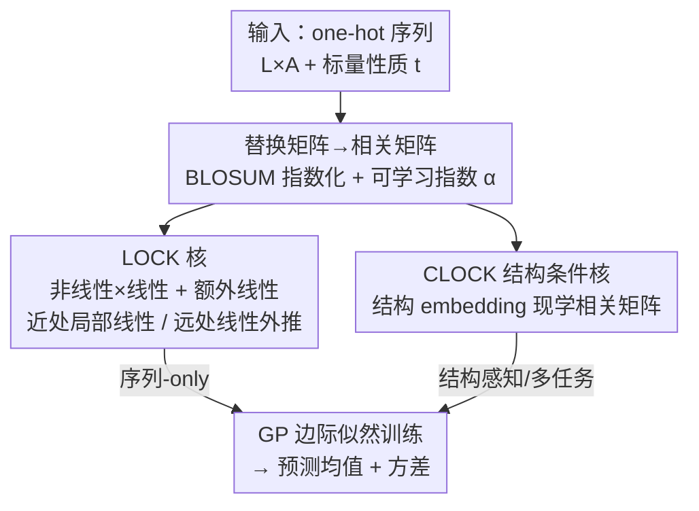

# Flexible Kernels for Protein Property Prediction

**会议**: ICML 2026  
**arXiv**: [2606.11057](https://arxiv.org/abs/2606.11057)  
**代码**: https://github.com/generatebio/lock_gp  
**领域**: 计算生物学 / 蛋白质性质预测 / 高斯过程  
**关键词**: 高斯过程, 序列核, 替换矩阵, 局部线性, 结构条件核  

## 一句话总结
本文为蛋白质序列设计了一族"灵活核"（LOCK / CLOCK），把进化替换矩阵（BLOSUM）的生物物理先验和"性质对突变近似可加"的局部线性假设直接编进高斯过程核里，在数据稀缺的蛋白质性质预测上常常打败依赖大模型 embedding 的复杂方法，并且能零样本吸收结构基础模型的信息做多任务学习。

## 研究背景与动机
**领域现状**：在蛋白质设计里，准确预测结合亲和力、热稳定性、荧光等性质是核心刚需。近几年主流做法是拿 ESM-2 这类蛋白质语言模型（PLM）当特征提取器，再接一个轻量监督头（甚至直接微调 PLM 权重），或者用 Kermut 这种基于 ESM-2 embedding + 结构坐标 + ProteinMPNN 逆折叠 logits 拼出来的高斯过程核。

**现有痛点**：这条"大模型 embedding + 监督头"的路线代价不小——训练超参一大堆、算力开销高、在小数据上极易过拟合，而且不少工作发现 PLM 预训练任务做得好并不一定能迁移到下游监督任务上。更现实的问题是：实验数据通常极度稀疏（一个 landscape 往往只有几十到上千条带标签序列），模型必须**数据高效**、还要给出**高质量的不确定性估计**，并且能在多个相关性质 landscape 之间**多任务共享**。

**核心矛盾**：序列核要在两个极端之间找平衡。最简单的线性核（等价于贝叶斯线性回归）假设性质对突变完全可加，外推时"激进"——离训练数据几十个突变了还在线性外延；而 RBF 这类乘性核随 Hamming 距离指数衰减，外推时"过于保守"，远离训练数据就回退到先验均值。两者都不适合用于模型驱动的蛋白质设计。更糟的是，这两类朴素核都"不认识氨基酸"：观测到突变 8A→8V 完全不能帮助推断 8A→8I 的效果，浪费了氨基酸之间已知的生物物理相似性。

**本文目标**：构造一个既数据高效、又自带不确定性、还能多任务的序列核，让它（1）利用替换矩阵编码的氨基酸相似性；（2）在训练数据附近做有细节的非线性预测、在远处平滑退化为稳健的线性预测；（3）能可选地吸收结构基础模型的信息。

**核心 idea**：把替换矩阵转成"相关矩阵"塞进各向异性 RBF 核，并给它一个可学习的指数来调节相似性强弱；再用"任意核 × 线性核"的乘积构造让模型具备局部线性。两者组合就是 LOCK 核；把相关矩阵改成由结构 embedding 现学就得到结构条件核 CLOCK。

## 方法详解

### 整体框架
LOCK-GP 的目标是：给定一个蛋白质性质 landscape（$N$ 条序列、每条对应一个标量性质 $t_n$），用一个高斯过程（GP）来预测任意新序列的性质，同时给出方差。整篇方法的核心是**怎么设计这个 GP 的核函数**。序列用 one-hot 编码成 $L\times A$ 的矩阵（$L$ 是长度、$A$ 是氨基酸字母表大小）。

作者分三步搭起这个核：先把进化替换矩阵 BLOSUM 加工成带可学习指数的**相关矩阵**，作为单个位点上"氨基酸像不像"的度量（设计 1）；再用"非线性核 × 线性核 + 一个额外线性核"的组合，让整体核在近处局部线性、远处退化为线性外推，即 LOCK 核（设计 2）；最后把固定的替换矩阵换成由结构基础模型 embedding 现学出来的相关矩阵，得到结构条件核 CLOCK，天然适合多任务（设计 3）。三步之外还有一套超参先验来稳住训练（设计 4）。

### 关键设计

**1. 替换矩阵相关矩阵化 + 可学习指数：让核"认识"氨基酸的生物物理相似性**

朴素的线性核和 RBF 核都把 20 种氨基酸当成彼此正交的符号，于是观测 8A→8V 学不到 8A→8I 的任何信息。本文的第一步是把生物信息学里现成的 BLOSUM 替换矩阵搬进来：替换矩阵原本以对数几率分 $M_{ij}=\log(q_{ij}/p_ip_j)$ 给出，作者取其逐元素指数形式 $S_{ij}=e^{M_{ij}}$，再归一化成相关矩阵 $C_{aa'}=S_{aa'}/\sqrt{S_{aa}S_{a'a'}}$，保证 $k(\mathbf{x},\mathbf{x})=1$。这样单个位点上的核就从"相同记 1、不同记 0"升级成"按氨基酸相似度打分"——缬氨酸和异亮氨酸高度相关，色氨酸、半胱氨酸则与大多数氨基酸不相似。

关键洞察是：BLOSUM 家族矩阵不仅半正定，还**无限可分**（infinitely divisible）——即逐元素幂 $S^{\circ\alpha}$（$(S^{\circ\alpha})_{ij}=(S_{ij})^\alpha$）对任意正幂仍保持半正定。这让作者可以给相关矩阵配一个**可学习指数** $\alpha_\ell$：$\alpha>1$ 衰减非对角相似度（更"挑剔"），$\alpha<1$ 放大相似度（更"宽容"）。指数可以全局共享、也可以逐位点 $\alpha_\ell$ 变化，从而把通用的进化相似性按当前 landscape 自适应地调出来。各向异性 RBF 核写成位点上协方差矩阵的乘积 $k_{\rm rbf}(\mathbf{x},\mathbf{y})=\prod_\ell \mathbf{x}_\ell^{\rm T}\mathbf{S}_\ell\mathbf{y}_\ell$ 正是这一步的载体。

**2. LOCK 核的局部线性组合：近处有细节、远处稳得住**

蛋白质性质对单点突变常常"近似可加"（global epistasis 之外，pairwise 上位效应通常不大）。本文把这条先验直接焊进核结构里：任何形如 $k'\,k_{\rm lin}$（任意核乘线性核）的核都对应"局部线性"的函数类——若给线性系数 $\bm\beta(\mathbf{x})$ 套一个由 $k'$ 控制、随序列空间缓慢变化的 GP 先验，则 $f(\mathbf{x})\approx\bm\beta(\mathbf{x}_0)\cdot\mathbf{x}$ 在 $\mathbf{x}_0$ 邻域内是线性的。

于是 LOCK 核定义为：

$$k^{\text{LOCK}}(\mathbf{x},\mathbf{y})=\sigma_1^2\,k_{\rm nl}^{\text{LOCK}}(\mathbf{x},\mathbf{y})\,k_{\rm lin}^{\text{LOCK}}(\mathbf{x},\mathbf{y})+\sigma_2^2\,\tilde{k}_{\rm lin}^{\text{LOCK}}(\mathbf{x},\mathbf{y})$$

其中 $k_{\rm lin}^{\text{LOCK}}=\sum_\ell \mathbf{x}_\ell^{\rm T}\mathbf{C}_\ell^{\alpha_\ell}\mathbf{y}_\ell$ 是加性的相关线性核，$k_{\rm nl}^{\text{LOCK}}=\prod_\ell \mathbf{x}_\ell^{\rm T}\mathbf{C}_\ell^{\alpha_\ell}\mathbf{y}_\ell$ 是乘性（RBF 推广）核，二者都建在设计 1 的相关矩阵上。乘积项 $k_{\rm nl}^{\text{LOCK}}k_{\rm lin}^{\text{LOCK}}$ 保证了局部线性；额外的线性核 $\tilde{k}_{\rm lin}^{\text{LOCK}}$ 则是兜底。这个组合的妙处在 **kernel decay**：在训练数据附近 $k_{\rm nl}^{\text{LOCK}}\gg0$，核给出响应局部数据细节的非线性预测；远离训练数据时 $k_{\rm nl}^{\text{LOCK}}\approx0$，模型不再像纯乘性核那样回退到先验均值，而是平滑过渡到由 $\tilde{k}_{\rm lin}^{\text{LOCK}}$ 控制的线性外推。这就同时避开了"线性核外推太激进"和"乘性核外推太保守"两个极端——近处有细节、远处稳，且全程都受替换矩阵的生物物理知识约束。乘性核还能在 log 空间计算（$\exp(\sum_\ell \alpha_\ell\mathbf{x}_\ell^{\rm T}\log^\circ(\mathbf{C}_\ell)\mathbf{y}_\ell)$）以保证数值稳定。

**3. CLOCK 结构条件核：把结构基础模型零样本接进来、天然多任务**

LOCK 只通过"罐头"替换矩阵接触全局蛋白质信息。CLOCK 把这一步换成**现学**：拿预训练结构基础模型给出的位点结构 embedding $\mathbf{h}_{1:L}(\mathcal{S})$，经一个线性映射 $\mathbf{z}_\ell=\mathbf{W}\mathbf{h}_\ell$ 得到每个氨基酸的抽象 embedding $\mathbf{z}_{\ell a}\in\mathbb{R}^{A-1}$，再据此构造逐位点相关矩阵

$$C_{\ell aa'}=\exp\left(-\|\mathbf{z}_{\ell a}-\mathbf{z}_{\ell a'}\|^2\right)$$

也就是在氨基酸 embedding 空间上的一个 RBF 核。这个参数化很"通用"——它生成的每个 $\mathbf{C}_\ell$ 都无限可分，且所有无限可分相关矩阵都是这种形式。于是相当于学到了一组**结构感知的替换矩阵**：同一种氨基酸替换，在不同结构上下文里相似度可以不同。训练只学线性映射 $\mathbf{W}$（$A=20$、128 维 embedding 时约 4.9 万参数），用"profile 掉核尺度"的浓缩 GP 目标来拟合。因为 $\mathbf{W}$ 在多个相关 landscape 间共享，CLOCK 特别适合多任务学习——在一堆相关性质 landscape 上联合训练，零样本地为每个位点生成结构条件核。

**4. 超参先验与正则：让灵活核别过拟合**

灵活意味着容易过拟合，尤其逐位点指数 $\alpha_\ell$ 自由度很高。LOCK-GP 至少有三个标量超参（两个核尺度 $\sigma_1,\sigma_2$ 和噪声 $\sigma_n$），加上三个基核各自的指数。作者给出一套默认正则配置：$k_{\rm nl}^{\text{LOCK}}$ 用逐位点指数 $\alpha_\ell$、两个线性核各用一个全局指数；$\sigma_1^2,\sigma_2^2,\sigma_n^2$ 配弱 Gamma 先验；全局指数配弱先验、局部指数配相对**强**的先验来压住过拟合并保证数值稳定。所有超参都通过最大化 GP 边际似然（Eqn. 2）用梯度法拟合，让核自适应当前 landscape。

### 损失函数 / 训练策略
LOCK-GP 的训练就是标准 GP 的边际似然最大化：$p(\mathbf{t}|\mathbf{X})=\mathcal{N}(\mathbf{t}|\mathbf{0},K_{\mathbf{XX}}+\sigma_n^2\mathbb{1}_N)$，对核超参（核尺度、噪声、各指数）做梯度优化，配合上节的先验做正则。预测用 GP 后验均值；复杂度对数据点数 $N$ 是立方的。CLOCK 额外学线性映射 $\mathbf{W}$，用浓缩形式的 GP 目标在多任务数据上拟合。

## 实验关键数据

### 主实验
作者整理了 **21 个**带参考结构的数据集（涵盖热稳定性、结合亲和力、荧光、衣壳活性等，含 9 个来自 ProteinGym），每个 ≥1800 数据点、≥10 个可变位点且含大量高阶突变。评测分三种 regime：i.i.d. 交叉验证、基于 Hamming 距离的外推、以及"未见突变"（测试序列至少含一个训练集没出现过的突变）。指标在 21 个数据集上平均。

| 评测 regime（训练点数） | 指标 | LOCK-GP | Kermut-GP | Tanimoto-GP |
|---|---|---|---|---|
| 交叉验证（48） | Pearson | **0.682** | 0.639 | 0.517 |
| 交叉验证（1536） | Pearson | **0.914** | 0.888 | 0.888 |
| 未见突变（96） | Pearson | 0.622 | **0.632** | 0.560 |
| 外推（128） | Pearson | **0.711** | 0.654 | 0.654 |
| 外推（512） | Pearson | **0.807** | 0.767 | 0.769 |

LOCK-GP 仅用 BLOSUM 先验（纯序列、无大模型 embedding），就在 5 个 regime 的 4 个上拿到最佳 Pearson R，尤其在数据极少（48 点）和外推场景下优势明显；它打败了用 ESM-2 + ProteinMPNN + 结构坐标的 Kermut-GP（截至 2026 年 1 月 ProteinGym 监督 DMS 替换榜单的第一名）。

### 消融 / 对比分析
作者对比了不同模型类与所用先验信息，凸显 LOCK-GP"用得最少、打得最好"：

| 模型 | 模型类 | 先验信息 | 交叉验证 1536 Pearson |
|---|---|---|---|
| LOCK-GP | 高斯过程 | BLOSUM | **0.914** |
| Kermut-GP | 高斯过程 | ESM-2 + ProteinMPNN | 0.888 |
| KermutSeq-GP | 高斯过程 | ESM-2 | 0.838 |
| MLP-ESM2-LastLayer | 神经网络 | ESM-2 | 0.900 |
| Ridge-ESM2 | 神经网络 | ESM-2 | 0.877 |
| Ridge-OH | 线性 | — | 0.800 |

### 关键发现
- **数据效率是最大亮点**：在 48 个训练点这种极稀疏场景下 LOCK-GP 的 Pearson（0.682）远超 Tanimoto-GP（0.517），说明把生物物理先验直接焊进核里在小数据上回报巨大。
- **不需要大模型也能赢**：纯序列、仅靠 BLOSUM 的 LOCK-GP 能压过依赖百万参数基础模型 embedding 的 Kermut 系列，挑战了"必须上大模型 embedding"的默认假设。
- **外推稳健**：局部线性 + 远处线性退化的设计让 LOCK-GP 在 128/512 点外推 regime 下持续领先，验证了 kernel decay 设计的价值。
- LOCK-GP 还用 CRPS（既评准确度又评校准的 proper scoring rule）展示了高质量的不确定性估计，而 CLOCK 在多任务跨 landscape 学习上能大幅超过局部监督方法。

## 亮点与洞察
- **把领域先验编进核结构而非堆数据/参数**：替换矩阵的"无限可分"性质被巧妙利用——可学习的 Hadamard 幂指数成了调节生物物理相似度的简洁旋钮，这是把经典生物信息学工具和现代 GP 嫁接的漂亮一手。
- **局部线性 + 远处线性退化"两全其美"**：用 $k'k_{\rm lin}$ 乘积构造局部线性、再用额外线性核兜底外推，单一核同时解决"近处要细节"和"远处别乱飞"，这个 trick 可迁移到任何"近似可加 + 需稳健外推"的结构化回归。
- **CLOCK 把基础模型当"相关矩阵生成器"而非特征拼接器**：只学一个 ~4.9 万参数的线性映射就把结构 embedding 零样本接进核，比"embedding 拼监督头"轻得多，且天然支持多任务。
- 最"啊哈"的是：在这个被大模型主导的方向里，一个设计精良的纯序列 GP 核竟能稳定击败重武器方案——提醒大家归纳偏置在小数据上仍是硬通货。

## 局限与展望
- **GP 的立方复杂度**：训练/推理对数据点数 $N$ 是 $\mathcal{O}(N^3)$，论文也限定数据集 ≥1800 点的中小规模；扩展到超大 landscape 需要稀疏 GP 等近似。
- **依赖序列对齐**：one-hot + 替换矩阵的框架建立在固定长度/对齐序列上，处理变长蛋白质需要引入 gap token，indel 密集场景适用性待验证。
- **CLOCK 需要足够数据**：学 $\mathbf{W}$（~4.9 万参数）在小数据单任务上可能吃力，其优势主要体现在多任务；纯结构（非语言模型）embedding 的选择也没充分探索。
- **上位效应（epistasis）建模有限**：核以局部线性 + 可加性为主要先验，对强高阶上位效应的 landscape 可能力不从心。

## 相关工作与启发
- **vs Kermut-GP**：Kermut 用 ESM-2 embedding + 结构坐标 + ProteinMPNN 逆折叠 logits 构造对突变对求和的核，是 ProteinGym 监督榜首；本文 LOCK-GP 仅用 BLOSUM 就在多数 regime 反超，优势是轻量、数据高效、超参少，代价是放弃了大模型的全局语义。
- **vs PLM 特征 + 监督头（Ridge-ESM2 / MLP-ESM2）**：那一类把 ESM-2 当特征提取器再接监督头，超参多、易过拟合、且 PLM 预训练好不一定迁移得动；LOCK 把先验放进核结构，训练更稳。
- **vs 纯线性 / RBF 核**：朴素核不认识氨基酸、外推要么太激进要么太保守；LOCK 用相关矩阵 + 局部线性组合同时修好这两点。

## 评分
- 新颖性: ⭐⭐⭐⭐ 把替换矩阵的无限可分性 + 局部线性焊进 GP 核是优雅且少见的归纳偏置设计。
- 实验充分度: ⭐⭐⭐⭐ 21 个数据集 × 三种 regime × 30+ baseline，覆盖数据效率/外推/未见突变/多任务，相当扎实。
- 写作质量: ⭐⭐⭐⭐ 从朴素核一步步推导到 LOCK/CLOCK，逻辑清晰；公式略密集。
- 价值: ⭐⭐⭐⭐ 给数据稀缺的蛋白质性质预测提供了轻量、可解释、带不确定性的强基线，实用性高。

<!-- RELATED:START -->

## 相关论文

- [\[ICML 2026\] Learning the Interaction Prior for Protein-Protein Interaction Prediction: A Model-Agnostic Approach](learning_the_interaction_prior_for_protein-protein_interaction_prediction_a_mode.md)
- [\[ICLR 2026\] Learning Molecular Chirality via Chiral Determinant Kernels](../../ICLR2026/computational_biology/learning_molecular_chirality_via_chiral_determinant_kernels.md)
- [\[ICLR 2026\] Enhancing Molecular Property Predictions by Learning from Bond Modelling and Interactions](../../ICLR2026/computational_biology/enhancing_molecular_property_predictions_by_learning_from_bond_modelling_and_int.md)
- [\[NeurIPS 2025\] Quantifying the Role of OpenFold Components in Protein Structure Prediction](../../NeurIPS2025/computational_biology/quantifying_the_role_of_openfold_components_in_protein_structure_prediction.md)
- [\[ICML 2026\] SPATIA: Multimodal Generation and Prediction of Spatial Cell Phenotypes](spatia_multimodal_generation_and_prediction_of_spatial_cell_phenotypes.md)

<!-- RELATED:END -->
