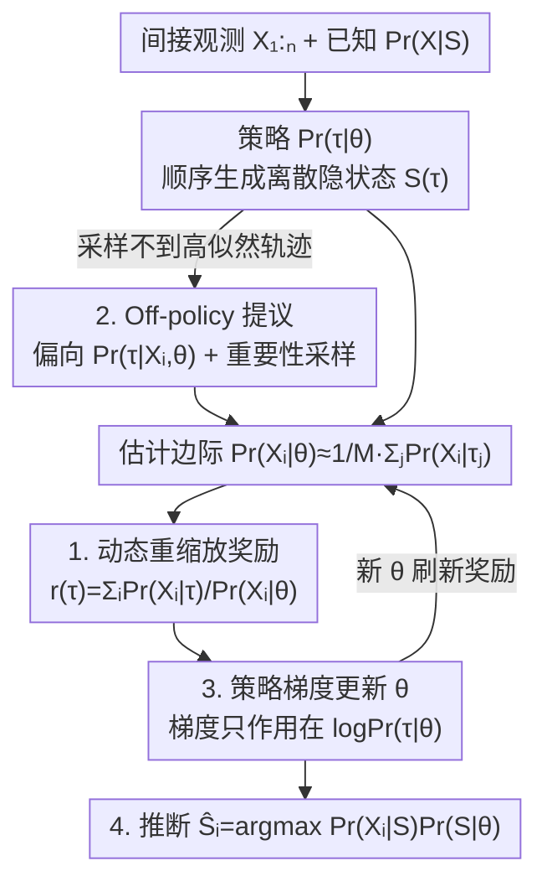

# Generative Modeling of Discrete Latent Structures via Dynamic Policy Gradients

**会议**: ICML2026  
**arXiv**: [2606.07400](https://arxiv.org/abs/2606.07400)  
**代码**: 待确认  
**领域**: 计算生物学 / 强化学习 / 离散生成建模  
**关键词**: 策略梯度, 动态奖励, 离散隐状态, 最大似然, RNA 异构体重建

## 一句话总结
GReinSS 用一个**随参数动态重缩放的奖励** $r(\tau)=\sum_i \Pr(X_i\mid\tau)/\Pr(X_i\mid\theta)$ 把策略梯度变成对"观测数据对数似然"的无偏梯度上升，从而在组合爆炸的离散隐状态空间上做生成建模与推断；在模拟图 / 集合重建上全面超过 GFlowNets、朴素策略梯度和 VAE/扩散/自回归 GEM 基线，并在真实短读 RNA 测序的异构体重建上胜过标准 RSEM。

## 研究背景与动机

**领域现状**：从间接观测里推断**机理性隐状态**是科学建模的核心需求——化学反应路径、交通网络、进化树、基因调控网络、RNA 异构体等，这些隐状态 $S$ 本质是组合结构，且我们看不到 $S$，只拿到间接观测 $X$ 以及一个**已知或部分已知的似然 $\Pr(X\mid S)$**。

**现有痛点**：两类主流方法各有硬伤。① 通用无监督方法（聚类、主题模型、表示学习、VAE）学的是**人工隐状态**——VAE 的隐变量活在一个和机理真值完全不同的向量空间里，根本不打算去还原真实的 $S^*$。② 经典 EM / 广义 EM（GEM）想推断机理隐变量，但 E 步要算复杂数据对数似然的期望 $\mathbb{E}_{S\sim\Pr(S\mid X,\theta)}[\cdot]$，在指数大的状态空间上一般**不可计算**（除非像 HMM 那样有马尔可夫结构能动态规划）。

**核心矛盾**：要么放弃还原机理真值（VAE 路线），要么被组合爆炸卡死（EM 路线）。而强化学习天然适合"顺序生成组合结构"，但标准 RL/策略梯度、GFlowNets 都是在**固定奖励**下最大化期望回报或匹配奖励分布，**没有一个直接优化"间接观测的边际似然" $\Pr(X_{1:N}\mid\theta)$**。

**本文目标**：在任意离散结构上同时解决两个问题——学习问题（找 $\theta$ 最大化 $\Pr(X_{1:N}\mid\theta)$，Problem 2.1）和推断问题（给定 $\theta$ 估计每个 $\hat{S}_i=\arg\max \Pr(X_i\mid S)\Pr(S\mid\theta)$，Problem 2.2）。

**切入角度**：把 RL 机器**当成优化工具**而非建模目标。关键观察是：如果让奖励随当前策略参数 $\theta$ 动态变化、并用 $\Pr(X_i\mid\theta)$ 做分母重缩放，标准策略梯度的更新方向就会**恰好等于**数据对数似然的梯度方向。

**核心 idea**：用动态重缩放奖励让策略梯度去做最大似然估计——分母 $\Pr(X_i\mid\theta)$ 把每个观测的贡献按"占比"而非"原始概率"计入，从而求解的是**最优轨迹分布** $\Pr(\tau\mid\theta)$，而不是收敛到单条最高奖励轨迹。

## 方法详解

### 整体框架

GReinSS（Generative Reinforcement Learning of Structured States）把"在组合隐空间上做最大似然生成建模"转化为一个**自带反馈回环的策略梯度训练**：策略 $\Pr(\tau\mid\theta)$ 顺序生成轨迹 $\tau$，其终止状态 $S(\tau)$ 就是一个离散隐状态（图 / 集合 / 序列 / 异构体…）。

整体回环是这样转的：① 当前参数 $\theta$ 下从策略采样若干轨迹（必要时走 off-policy 提议分布以保证采到高 $\Pr(X_i\mid S)$ 的状态）；② 用采样估计每个观测的边际概率 $\Pr(X_i\mid\theta)\approx\frac1M\sum_j \Pr(X_i\mid\tau_j)$；③ 用它做分母，算出**动态奖励** $r(\tau)=\sum_i \Pr(X_i\mid\tau)/\Pr(X_i\mid\theta)$；④ 跑一步标准策略梯度更新 $\theta$；⑤ 用新 $\theta$ 刷新奖励，回到①。训练收敛后，再用学好的 $\theta$ 解推断问题：采样状态并取最大化 $\Pr(S\mid\theta)\Pr(X_i\mid S)$ 的 $\hat{S}_i$。

关键细节：奖励虽然用 $\theta$ 算出来，但求梯度 $\frac{d}{d\theta}$ **只作用在 $\log\Pr(\tau\mid\theta)$ 上、不作用在 $r(\tau)$ 上**——这正是它区别于标准 RL（固定奖励）的地方，也是无偏性的来源。

### 关键设计

**1. 动态重缩放奖励：让策略梯度等价于数据对数似然的无偏梯度**

针对"标准 RL/GFlowNets 优化的是固定奖励而非边际似然"这个根本错位，GReinSS 给出 Theorem 3.1：带动态奖励
$$r(\tau)=\sum_{i=1}^N \frac{\Pr(X_i\mid\tau)}{\Pr(X_i\mid\theta)}$$
的策略梯度 $\mathbb{E}_\tau[r(\tau)\frac{d}{d\theta}\log\Pr(\tau\mid\theta)]$ 是数据对数似然梯度 $\frac{d}{d\theta}\log\Pr(X_{1:N}\mid\theta)$ 的**无偏估计**（Corollary 3.2：因此它在做数据对数似然的梯度上升）。

为什么分母 $\Pr(X_i\mid\theta)$ 是关键？直觉是它把每条轨迹的奖励按"它对 $\Pr(X_i\mid\theta)$ 的**比例贡献**"计，而不是按原始概率 $\Pr(X_i\mid\tau)$。若去掉分母（即"朴素策略梯度"奖励 $r'(\tau)=\sum_i \Pr(X_i\mid\tau)$），优化会**坍缩到单条最高奖励轨迹**；有了分母，求解的是最优轨迹分布 $\Pr(\tau\mid\theta)$，从而真正在拟合分布。论文还证明它支持 mini-batch 无偏估计（Corollary A.1），可扩展到大数据集。值得强调：奖励用 $\theta$ 计算，但梯度只回传到 $\log\Pr(\tau\mid\theta)$，$r(\tau)$ 被当作常数——这是无偏性成立的技术前提。

**2. 最优 off-policy 采样：用方差最小的提议分布解决"采不到高似然轨迹"**

针对组合空间里"直接从策略采样可能几乎采不到对某些观测 $X_i$ 有非零 $\Pr(X_i\mid\tau)$ 的轨迹"这个实际瓶颈，作者推导出 Theorem 3.3：无偏且**方差最小**的 off-policy 提议是
$$q(\tau\mid X_{1:N},\theta)=\frac1N\sum_{i=1}^N \Pr(\tau\mid X_i,\theta),$$
其中 $\Pr(\tau\mid X_i,\theta)=\Pr(X_i\mid\tau)\Pr(\tau\mid\theta)/\Pr(X_i\mid\theta)$ 由贝叶斯定理得到。

通常无法精确从 $q$ 采样，但可以用启发式把采样**偏向** $q$：例如癌症系统发育应用 CloMu 里观测直接给出图中有哪些节点，于是只允许生成对应某个 $X_i$ 节点集的轨迹；CNRein 里先用简单非 ML 算法 CNNaive 给出可信初始隐状态，再把轨迹偏向这些状态。偏置采样后用重要性采样在策略梯度里修正。实验显示只要采样大致偏向 $q$，GReinSS 的精度对具体提议**不敏感**——这让 off-policy 在信息量大的观测上极其有用。

**3. 策略梯度更新与动态奖励刷新的交替回环：把 RL 机器当 MLE 优化器**

GReinSS 的训练就是 Theorem 3.1 + Theorem 3.3 串成的闭环：每步用当前 $\theta$ 经式(2) $\Pr(X\mid\theta)=\mathbb{E}_\tau[\Pr(X\mid S(\tau))]$ 估计边际、再经式(3) 算动态奖励，跑一步标准策略梯度更新 $\theta$，新 $\theta$ 又刷新下一步的奖励。这套交替的意义在于：它复用了成熟的策略梯度实现（顺序生成 + REINFORCE 式更新），却把目标偷换成了**间接观测的边际似然**——既不像 EM 那样被指数大 E 步卡死，也不像 GFlowNets 那样需要预先知道终态奖励。论文进一步用神经网络参数化"顺序加边构图"或"逐个加元素构集合"的生成过程作为策略，使框架能套到任意可顺序生成的离散结构上。

**4. 与经典方法的统一与特例归约：把 GReinSS 放进已有谱系**

作者系统刻画了 GReinSS 在哪些特例下退化为已有方法，既是理论自洽也是基线设计依据：① 当观测等于真值 $X_i=S_i^*$（$\Pr(X_i\mid S)$ 是指示函数），Problem 2.1 退化为标准最大似然生成建模 $\arg\max_\theta\sum_i\log\Pr(S_i^*\mid\theta)$（Lemma 3.4），可由 VAE / 离散扩散 / 自回归求解；若每个 $X_i$ 唯一确定一条轨迹则进一步退化为自回归生成。② 当 $\Pr(X_i\mid S)$ 对所有 $i$ 相同（Lemma 3.6），分母失效，GReinSS 退化为带标准奖励归一化的**标准策略梯度**——去掉分母正是论文的"朴素策略梯度"消融。③ 当每个 $X_i$ 仅由唯一轨迹以概率 1 解释（Lemma 3.7），GFlowNets 的最优分布也最优解 Problem 2.1。④ 对 GEM，因 E 步在指数空间不可精确算，论文用"当前 $\theta$ 下推断 $\hat{S}_{1:N}$ 近似 E 步、再精确 M 步梯度上升"的近似 GEM，配 VAE / 扩散 / 自回归当基线。这套归约把 local search / GEM / 朴素 PG / GFlowNets 全摆进同一坐标系，凸显只有 GReinSS 直接优化 $\Pr(X_{1:N}\mid\theta)$。

### 一个例子：随机游走端点反推过程图

以 Problem 4.1 为例走一遍：隐状态 $S_i^*$ 是有向图，观测 $X_i$ 是从该图上做 $k$ 条吸收随机游走记录下的 $k$ 对（起点, 终点）。$\Pr(X_i\mid S)$ 由逆移位拉普拉斯 $(L+I)^{-1}$ 的起止概率乘积给出。GReinSS 把 $\theta$ 设成一个"从空图开始顺序加有向边、最后终止"的神经网络策略：采样若干图轨迹 → 用 $(L+I)^{-1}$ 算每个观测的 $\Pr(X_i\mid\tau)$ → 估计 $\Pr(X_i\mid\theta)$ → 算动态奖励 → 更新加边策略。$k=10$（每观测信息极少）时 GReinSS 中位 $F_1=0.891$，而所有基线都 $<0.55$；尤其朴素策略梯度直接坍缩成"预测空图"（小观测数下奖励高但 $F_1=0$），直观印证了"动态奖励分母虽是小改动却不可或缺"。

## 实验关键数据

### 主实验

在两类模拟（隐图 / 隐集合）和真实 RNA 异构体重建上对比 Table 1 列出的基线（local search / VAE-GEM / 自回归-GEM / 扩散-GEM / 朴素策略梯度 / GFlowNets）。评测用 $F_1$（图边集 / 子集的精确率召回率调和平均），RNA 任务用基于 Jaccard + 最优传输 + 长读支持加权的异构体预测误差（0 最好、1 最差）。

| 任务 | 设置 | GReinSS | 最优基线 | 说明 |
|------|------|------|------|------|
| 过程图推断 | $k=10$ 随机游走 | 中位 $F_1=0.891$ | 全部 $<0.55$ | 每观测信息极少时优势最大 |
| 子集推断 | $|\mathcal{U}|=1000,\sigma=0.3$ | 中位 $F_1=0.938$ | local search 0.869 / 朴素 PG 0.849 | 只有 GReinSS 扩到大 universe |
| 子集推断 | $|\mathcal{U}|=10$ | 中位 $F_1=1.0$ | 多数基线也 1.0 | 小空间下简单方法即够 |
| RNA 异构体 | GTEx 14,390 基因 | 误差中位低于 RSEM | RSEM（EM 基线） | GReinSS−RSEM 误差中位 $-0.0405$ |

RNA 任务中，GReinSS 用短读 junction 计数为输入、以长读（FLAIR）异构体为真值，在 61 个有配对长读的样本、14,390 个基因上整体优于 GTEx 默认的 RSEM；示例基因 MBD2 上 GReinSS 重建出与长读一致的两个异构体及相近比例，而 RSEM 没有。

### 消融实验

| 配置 | 关键现象 | 说明 |
|------|---------|------|
| Full GReinSS | 各任务全面最优 | 完整动态奖励 + off-policy |
| w/o 分母（朴素策略梯度） | 图任务坍缩成空图，$F_1$ 常为 0 | 去掉 $\Pr(X_i\mid\theta)$ 即坍缩到单轨迹 |
| GFlowNets 替换 | 图任务中位 $F_1<0.55$ | 优化代理目标而非边际似然 |
| VAE / 自回归 GEM | 图任务次优、且两者表现相近 | 受 GEM 框架上限制约 |
| 改变 off-policy 提议 | 精度基本不变（Fig S4） | 只要偏向最优 $q$ 即可 |

### 关键发现
- **动态奖励的分母是命门**：去掉它（朴素策略梯度）在图任务上直接坍缩成预测空图、$F_1=0$；这是个算法上很小、效果上决定性的改动。
- **观测信息量越小，GReinSS 优势越大**：$k=10$ 时它一骑绝尘（0.891 vs 全部 <0.55），信息充分时各法差距收窄。
- **唯独 GReinSS 扩到大组合空间**：$|\mathcal{U}|=1000$ 时多数 GEM 基线灾难性退化（中位 $F_1<0.4$），GReinSS 仍 0.938。
- **低噪 vs 高噪的关键因素不同**：低 $\sigma$ 时"利用观测（off-policy / local search）"最关键，高 $\sigma$ 时"有效优化 $\Pr(X_{1:N}\mid\theta)$（GReinSS / GEM）"最关键——GReinSS 两头都占。

## 亮点与洞察
- **把 RL 当成 MLE 的优化器而非建模目标**：一个看似微小的"奖励除以 $\Pr(X_i\mid\theta)$"就把策略梯度的不动点从"最高奖励轨迹"挪到了"数据似然最优分布"，这是最让人"啊哈"的设计。
- **理论与基线一体两面**：通过一串引理把 local search / GEM / 朴素 PG / GFlowNets 全证成 GReinSS 的特例，既证明了普适性，又天然给出消融与基线，论证非常干净。
- **方差最小 off-policy 提议有闭式形式** $q=\frac1N\sum_i\Pr(\tau\mid X_i,\theta)$，且实践中只要偏向它即可、对具体启发式不敏感——这个鲁棒性对真实科学问题落地很重要。
- **真实科学价值**：在 GTEx 上胜过被广泛使用的 RSEM，说明它不只是模拟玩具，可迁移到任何"已知 $\Pr(X\mid S)$ + 组合隐状态"的反问题（化学路径、交通网络、系统发育等）。

## 局限与展望
- **必须已知（或可计算）似然 $\Pr(X\mid S)$**：这是 GReinSS 区别于纯无监督方法的前提，似然完全未知的场景不适用。
- **依赖 off-policy 启发式**：在策略难以采到高似然轨迹的问题上，需要问题特定的偏置采样设计（如 CloMu / CNRein 的做法），通用自动化程度有限。
- **奖励估计带采样噪声**：$\Pr(X_i\mid\theta)$ 用 $M$ 条轨迹蒙特卡洛估计，$M$ 偏小可能引入偏差 / 方差，论文未细致刻画其对收敛的影响。
- **评测以模拟为主**：真实实验只有 RNA 异构体一项；更多真实组合反问题（系统发育、调控网络）上的验证还待补充。
- 改进方向：自动化 off-policy 提议构造、与离散扩散等更强生成主干结合、以及对奖励估计方差的理论控制。

## 相关工作与启发
- **vs 标准策略梯度 / 朴素策略梯度**：标准 PG 在固定奖励下最大化期望回报，去掉分母的朴素版会坍缩到单轨迹；GReinSS 的动态分母让它改为优化边际似然、拟合分布（Lemma 3.6 是其特例）。
- **vs GFlowNets**：GFlowNets 学的是终态概率正比于**预定义奖励**的策略，假设奖励已知；GReinSS 反过来构造自适应奖励去最大化间接观测似然，GFlowNets 仅在 Lemma 3.7 特例下与之等价。
- **vs VAE**：VAE 学人工隐状态、活在独立向量空间，不还原机理真值；GReinSS 直接在机理状态空间 $\mathcal{S}$ 上建模。
- **vs EM / GEM**：经典 EM 的 E 步在指数大空间不可算，GReinSS 用策略梯度绕开期望计算；论文用"近似 E 步 + 精确 M 步"的 GEM 配 VAE/扩散/自回归作基线，普遍受 GEM 框架上限制约。
- **vs RSEM**：RSEM 是 GTEx 用于异构体定量的 EM 算法，输入相同的剪接感知比对；GReinSS 在 14,390 基因上预测误差中位低 0.0405。

## 评分
- 新颖性: ⭐⭐⭐⭐⭐ "动态重缩放奖励让策略梯度等价于边际似然梯度"是简洁而有洞察的核心贡献。
- 实验充分度: ⭐⭐⭐⭐ 两类模拟扫参 + 真实 RNA 任务 + 完整消融，但真实实验仅一项。
- 写作质量: ⭐⭐⭐⭐⭐ 问题定义清晰、定理引理把方法与基线统一进同一框架，逻辑严谨。
- 价值: ⭐⭐⭐⭐⭐ 为"已知似然 + 组合隐状态"的科学反问题提供了通用且实证有效的生成建模范式。
