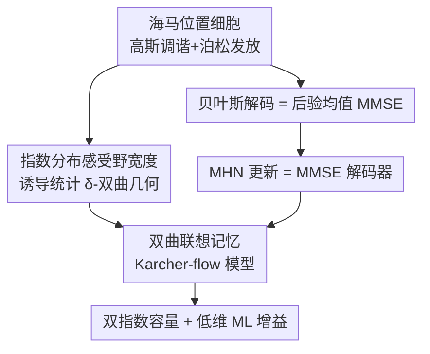

# Hyperbolic Neural Population Geometry Benefits Computation

**会议**: ICML2026  
**arXiv**: [2606.10238](https://arxiv.org/abs/2606.10238)  
**代码**: 有（论文称源码在 GitHub）  
**领域**: 计算神经科学 / 联想记忆 / 双曲几何  
**关键词**: 神经群体几何, 海马位置细胞, 现代Hopfield网络, MMSE解码, 记忆容量

## 一句话总结
为"海马群体活动呈双曲结构"这一实验现象建一套理论：先证明感受野宽度服从指数分布的位置细胞会**统计意义上诱导出树状/双曲的刺激几何**，再揭示现代 Hopfield 网络的更新规则其实在算 MMSE 最优解码器，最后据此提出一个**定义在双曲空间的联想记忆模型（Karcher-flow 模型）**，其容量随维度指数、随最大范数双指数增长，远超现有模型。

## 研究背景与动机
**领域现状**：神经科学正从"单个神经元"转向"大规模群体的集体表征"，关心群体活动诱导的**神经群体几何**如何决定下游计算；机器学习也在借鉴群体几何来改进模型。近期多项实验发现海马等生物系统中**涌现出双曲几何**。

**现有痛点**：这些发现**几乎都是经验性的**——既没有理论解释双曲几何如何由神经群体诱导，也没刻画它对下游解码的影响，更没给出可指导 ML 模型的设计原则。

**核心矛盾**：双曲（负曲率、树状）结构与欧氏表征的根本差异在于，双曲空间体积随半径指数膨胀，天然适合存放层级化、稀疏的信息；但"位置细胞编码 → 双曲几何"的生成机制、以及"双曲几何 → 更好解码/记忆"的因果链都缺一个统一框架。

**本文目标**：把三件事串起来——(i) 解释双曲几何如何被神经群体诱导；(ii) 刻画它对解码的影响；(iii) 提炼出 ML 可用的设计原则。

**核心 idea**：用"位置细胞感受野宽度服从指数分布"这一**实验观测**当种子，证明它诱导树状几何；再借"Hopfield 更新 = MMSE 估计"这座桥，把解码问题翻译成联想记忆，从而在双曲空间里造一个大容量记忆模型。

## 方法详解

### 整体框架
论文是一篇理论工作，主线是一条把神经科学观测、贝叶斯解码与联想记忆容量串起来的逻辑链。编码端用高斯调谐曲线 + 泊松发放对海马空间编码建模：神经元 $i$ 对刺激 $s$ 的发放率 $\lambda_i(s)=\lambda_{\max}\exp(-\|s-s_i\|_2^2/2\sigma_i^2)$，感受野宽度 $\sigma_i\sim\mathrm{Exp}(\beta)$。解码端则把"从群体活动 $n$ 推断刺激 $s$"形式化为统计估计，并指出在平方损失下贝叶斯最优解是后验均值（MMSE）。关键转折是发现 **MMSE 解码器的形式与现代 Hopfield 网络（MHN）的更新规则结构同构**——两者都是 softmax 加权的记忆模式求和。沿这条桥，作者把欧氏 MHN 升级成双曲版本，得到大容量的联想记忆。

### 关键设计

**1. 指数分布感受野宽度诱导统计双曲几何：给"海马是双曲的"一个可实现构造**

实验观测到海马 CA1 区位置细胞的感受野宽度 $\sigma$ 近似服从指数分布 $p(\sigma)\approx\zeta e^{-\zeta\sigma}$（这又恰好对应在双曲球里均匀采样）。作者把这一观测嵌入高斯调谐模型，研究由群体响应内积诱导的刺激间"半度量" $d_{ab}=-\phi(\langle\lambda(s_a),\lambda(s_b)\rangle)+C$（因 $\sigma_i$ 随机，三角不等式不一定成立，故只是半度量）。为能在随机性下谈双曲性，作者把 Gromov 的 4 点条件**放松成概率版**——定义"统计 $\delta$-双曲"（Def. 4.1）：在 $\mathcal{S}$ 上均匀采四元组，4 点超额 $\Delta=L_{(1)}-L_{(2)}$ 满足 $\Pr[\Delta>2\delta]<\eta$。Theorem 4.2 证明：当神经元数 $N=\mathcal{O}((L/\beta)^D)$ 足够大时，存在常数 $\delta(\beta,\rho)$ 使该半度量统计 $\delta$-双曲，且 $\delta$ 非平凡（$\lim_{L\to\infty}\delta/L=0$，即域无限增大时仍保持树状）。直觉上，这说明**把指数分布的感受野宽度塞进高斯调谐，群体活动诱导的刺激距离就是树状的**，等价于海马用双曲半度量编码空间——既被实验启发，又给出了树状几何的可实现构造。

**2. 现代 Hopfield 更新 = MMSE 解码器：在解码与联想记忆间架桥**

把刺激空间离散成 $M$ 个网格点、取均匀先验，后验取 softmax 形式 $p(s_\mu\mid n)=\mathrm{softmax}_\mu(h(n))$，于是贝叶斯最优解码器 $s^*(n)=\sum_\mu \mathrm{softmax}_\mu(h(n))\,s_\mu$。而 MHN 的更新 $\mathrm{MHN}(v)=\sum_\mu\mathrm{softmax}_\mu(\langle v,\xi_\mu\rangle)\,\xi_\mu$ 与之结构同构。Proposition 2.2 进一步给出条件：当后验取 Boltzmann 形式时，**一次 MHN 更新就在计算后验均值估计**，即 $\mathrm{MHN}(v)=\arg\min_z\mathbb{E}_{p(\mu\mid v)}\|\xi_\mu-z\|_2^2$。这把"神经解码"与"联想记忆检索"统一成同一个 MMSE 问题——记忆检索可被看作解码过程。这一桥之所以重要，是因为它允许把损失换成尊重 $\lambda(s)$ 几何的版本，从而在第 4 节自然推出**非欧（双曲）联想记忆**。论文还引入一个把调谐曲线编码器接到 MHN 的非线性映射 $\psi^E$，解耦编码器与解码器、避免施加过强的生物约束。

**3. 双曲联想记忆 Karcher-flow 模型与双指数容量：把记忆搬进负曲率空间**

在双曲（Lorentz/双曲面）模型 $\mathbb{H}^d_\kappa$ 上，作者把解码写成测地平方损失下的估计，最优解是后验 **加权 Fréchet 均值**，并用 Karcher flow 迭代求解。据此定义 **Karcher-flow 模型（KFM）**：$H(\mathbf v)=\mathrm{Exp}_{\mathbf v}\big(\sum_\mu w_\mu(\mathbf v)\,\mathrm{Exp}^{-1}_{\mathbf v}(\boldsymbol\xi_\mu)\big)$，权重 $w_\mu$ 用 **Lorentz 内积** $\langle\cdot,\cdot\rangle_L$ 取 softmax。与 MHN 的两点关键区别：一是定义在双曲面上，二是用 Lorentz 内积取代欧氏内积——后者天然编码测地距离（$\cosh(\sqrt{|\kappa|}d_g)=-\kappa\langle\mathbf x,\mathbf y\rangle_L$）、计算复杂度却与欧氏内积相同，因此能以极低代价区分"方向相近但范数不同"的模式。容量上，Theorem 4.8 证明在 Chernoff 类分离条件下，当 $d\to\infty$ 时召回成功概率趋于 1，且可存储模式数满足 $\log M=\Theta\!\big(\frac{d}{|\kappa|}\frac{e^{2\alpha r_{\min}}}{r_{\min}^2}\big)$——即**容量随维度 $d$ 指数、随最大范数 $r_{\max}$ 双指数**增长，比 MHN 多出一个"双指数于 $r_{\max}$"的因子。一个值得注意的松弛是：本文**不要求记忆模式归一化**，因为 Lorentz 内积编码的是测地距离而非角相似度。

### 一个完整示例：从一次发放到一次记忆检索
把三条设计串成一遍可以这样想：动物处在某个位置 $s$，海马里 $N$ 个位置细胞按各自的高斯感受野发放，宽度 $\sigma_i$ 服从指数分布——于是不同位置的群体响应向量 $\lambda(s)\in\mathbb{R}^N$ 之间的距离 $d_{ab}$ 是**树状的**（设计 1）。现在要从一组带噪发放 $n$ 反推位置：贝叶斯最优是后验均值，但它不可解；好在它的离散形式恰是一次 softmax 加权求和，与 Hopfield 检索同构，于是"解码 $\approx$ 一次记忆检索"（设计 2）。最后，因为底层几何是双曲的，就把记忆模式 $\boldsymbol\xi_\mu$ 放到双曲面 $\mathbb{H}^d_\kappa$ 上、用 Lorentz 内积加权、Karcher flow 迭代逼近加权 Fréchet 均值（设计 3）——一个被噪声污染的查询 $\mathbf v$ 经几步迭代就被拉回正确记忆 $\boldsymbol\xi_\mu$，且因双曲容量大，即便 $d$ 很小、模式很多也能成功召回。

### 损失函数 / 训练策略
ML 层（KFAttention / KFPooling）可在不引入任何双曲参数的情况下构造，因而仍能用 AdamW 等欧氏优化器训练，却享受双曲带来的容量优势；这与需要 Riemannian 优化器的 (Shimizu et al., 2021) 形成对比。

## 实验关键数据

### 模式补全（Pattern Completion）
- 数据：合成点、MNIST、CIFAR10，维度 $d\in\{10,20,100\}$、$r_{\max}=3$，10 个随机种子。
- 结论：Karcher-flow 模型召回成功率高，**两个基线（MHN、DAM）在低维下甚至存不下少量模式**；扫 $r_{\max}=1\to6$ 时，KFM 容量随 $r_{\max}$ 显著上升，而 MHN 几乎不受这种重缩放影响——与"双指数于 $r_{\max}$"的理论吻合。

### 分类 / 多示例学习（Table 1）

| 模型 | MNIST d=4 | MNIST d=8 | MNIST d=32 | MIL·Tiger | MIL·Fox | MIL·Elephant |
|------|------|------|------|------|------|------|
| KarcherFlow | **85.52** | **92.42** | **96.89** | 87.34 | **66.00** | 91.20 |
| Hopfield | 83.70 | 92.29 | 96.71 | 83.52 | 60.54 | 91.65 |
| Gulcehre 2019 | 84.85 | 91.71 | 96.80 | **89.20** | 62.92 | **93.04** |
| Shimizu 2021 | 67.35 | 84.17 | 84.17 | 80.32 | 57.76 | 85.32 |

（MNIST 为准确率%，MIL 为 AUC；均值±标准差，此处略去标准差。）

### 关键发现
- **增益在低维最明显**：MNIST 上 $d=4$ 时 KarcherFlow 比 Hopfield 高约 +1.8，$d=32$ 时差距缩到 +0.2 以内——印证"双曲在低维提供更高效的存储空间"这一主张。
- MIL 上结果有取舍：KarcherFlow 在 Fox 上最优、Tiger 大幅超 Hopfield，但 Tiger/Elephant 上不及双曲注意力网络 Gulcehre 2019——说明优势依任务而定，并非全面碾压。
- 需要 Riemannian 优化器的 Shimizu 2021 反而显著最差，凸显"用欧氏优化器即可享双曲容量"的工程价值。

## 亮点与洞察
- **从实验现象到可实现构造**：不是又一篇"我们观察到双曲性"，而是给出"指数感受野宽度 → 统计双曲几何"的定理级机制，把 Zhang et al. (2023) 的观测变成可推导的结论。
- **"Hopfield = MMSE 解码"这座桥很漂亮**：一句结构同构把联想记忆与贝叶斯解码打通，使"换几何 = 换损失"成为顺理成章的推广路径。
- **Lorentz 内积是免费午餐**：与欧氏内积同复杂度，却编码测地距离、还免去模式归一化约束——这是容量暴涨且工程可落地的关键。
- **可迁移**：KFAttention/KFPooling 作为即插即用层，提示在内存维度受限的 ML 场景（小模型、边缘部署）用双曲记忆换容量是值得一试的方向。

## 局限与展望
- 理论靠多处简化假设：单感受野（$K=1$）、固定幅度、均匀先验、网格离散、Chernoff 分离条件，多场（大环境）情形留作未来工作。
- 编码器到记忆模式之间假设存在映射 $\psi^E/\psi^H$，但其生物可实现性与具体形式未深究。
- 容量是渐近（$d\to\infty$）结论，有限维下的常数与边界仍需更细的实验刻画。
- ML 实验规模偏小（MNIST/CIFAR10/三个 MIL 数据集），且在部分 MIL 任务上不及已有双曲注意力，普适性有待更大基准检验。

## 相关工作与启发
- **vs 现代 Hopfield 网络（MHN, Ramsauer 2020）/ DAM（Krotov 2021）**：它们在欧氏/连续域、用欧氏内积、需归一化模式；本文搬到双曲面、用 Lorentz 内积、免归一化，容量多出一个双指数于 $r_{\max}$ 的因子，低维优势尤其明显。
- **vs 经验性的"生物双曲几何"发现（Zhang 2022/2023 等）**：那些是观测；本文补上"如何被群体诱导 + 如何利于解码 + 如何指导 ML"的理论三联。
- **vs 双曲神经网络（Gulcehre 2019 / Shimizu 2021）**：后者常需 Riemannian 优化器、参数定义在双曲空间；本文的层无需双曲参数，可用标准欧氏优化器训练，部署更省事。

## 评分
- 新颖性: ⭐⭐⭐⭐⭐ 把神经群体几何、贝叶斯解码与联想记忆容量统一成一条可证明的理论链
- 实验充分度: ⭐⭐⭐ 模式补全与小规模 ML 验证到位，但基准偏小、部分 MIL 任务不占优
- 写作质量: ⭐⭐⭐⭐ 逻辑链清晰、定理与直觉注解兼备，但几何前置知识门槛较高
- 价值: ⭐⭐⭐⭐ 给"生物为何用双曲编码"一个理论答案，并提供低维高容量记忆的设计原则

<!-- RELATED:START -->

## 相关论文

- [\[CVPR 2026\] Hyperbolic Busemann Neural Networks](../../CVPR2026/computational_biology/hyperbolic_busemann_neural_networks.md)
- [\[ICML 2026\] Viral Proteins Reveal Geometry of Protein Language Models](viral_proteins_reveal_geometry_of_protein_language_models.md)
- [\[CVPR 2026\] HyperST: Hierarchical Hyperbolic Learning for Spatial Transcriptomics Prediction](../../CVPR2026/computational_biology/hyperst_hierarchical_hyperbolic_learning_for_spatial_transcriptomics_prediction.md)
- [\[ICLR 2026\] PoinnCARE: Hyperbolic Multi-Modal Learning for Enzyme Classification](../../ICLR2026/computational_biology/poinncare_hyperbolic_multi-modal_learning_for_enzyme_classification.md)
- [\[ICML 2026\] Neural Estimation of Pairwise Mutual Information in Masked Discrete Sequence Models](neural_estimation_of_pairwise_mutual_information_in_masked_discrete_sequence_mod.md)

<!-- RELATED:END -->
