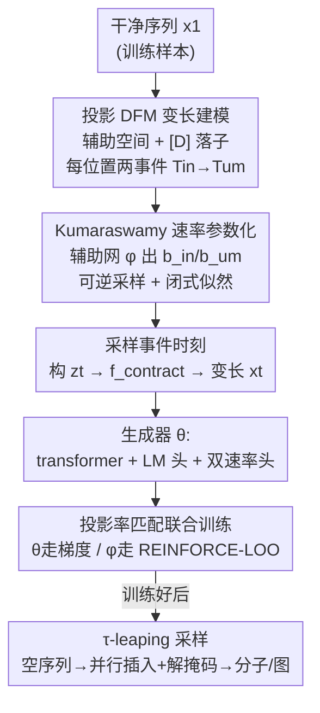

# Insertion Based Sequence Generation with Learnable Order Dynamics

**会议**: ICML2026  
**arXiv**: [2602.18695](https://arxiv.org/abs/2602.18695)  
**代码**: https://github.com/dhruvdcoder/LoFlexMDM  
**领域**: 计算生物学 / 离散扩散生成  
**关键词**: 掩码扩散模型, 离散流匹配, 插入式生成, 可学习生成顺序, 分子生成

## 一句话总结
本文提出 LoFlexMDM——一个把"插入掩码 + 解掩码"两步插入式掩码扩散模型的**固定生成顺序换成可学习、依样本的顺序动态**的生成模型：通过把离散流匹配推广到变长序列、用 Kumaraswamy CDF 参数化可学习的插入/解掩码时刻，并用 REINFORCE 联合训练生成器与目标顺序网络，在分子和图任务上让模型自己学到接近最优的生成顺序，de novo 分子质量比 FlexMDM 最高提升 17.5 个百分点。

## 研究背景与动机

**领域现状**：掩码扩散模型（MDM）通过在**定长字符串的固定绝对位置**上反复解掩码来生成序列。插入式扩散模型则更进一步，能在任意已有 token 之间的"空隙（gap）"插入新 token，从而天然处理变长序列。FlexMDM（Kim et al. 2026b）是其中代表：它把每个 token 先作为掩码 `[M]` 插入、再解掩码成符号，即 `[D]→[M]→symbol` 的两阶段过程，可在任意空隙一次插入多个掩码并并行解掩码。

**现有痛点**：图、分子这类结构化序列是**变长**的，依赖关系常通过**相对位置**表达——比如星形图里，从两端往中枢节点（junction）逐边插入，能让原本需要前瞻才能确定的中枢出边变得局部可预测。但 FlexMDM 的目标插入/解掩码**时刻表是固定的、与数据无关**，于是模型被迫学会"以所有可能顺序生成每一条真实序列"。当某些顺序明显优于另一些时，把概率质量摊到一大堆次优顺序上既浪费、又放大了动作空间的不确定性，拖累生成质量。

**核心矛盾**：插入式扩散的灵活性（任意空隙、任意顺序）与训练效率/质量之间存在张力——顺序越自由，模型要覆盖的轨迹空间越大、越难学好；但把顺序写死又丢掉了"为这条样本挑一个好顺序"的机会。

**本文目标**：让生成顺序成为**可学习、依具体样本**的量，同时保持训练**可解析、可并行**（不模拟完整轨迹），并能给出数据对数似然的下界保证。

**切入角度**：作者观察到 FlexMDM 的两步过程其实由每个位置的"插入时刻 $T_\text{in}$ 和解掩码时刻 $T_\text{um}$"隐式决定生成顺序（$T_\text{um}^j>T_\text{um}^i$ 则 $j$ 在 $i$ 之后生成）。只要把这两个时刻的**分布**变成可学习的，就能在不改变终态分布的前提下控制顺序。

**核心 idea**：保留 FlexMDM 的两步插入-解掩码结构，但用一个辅助网络 $\phi$ 预测**依样本的插入/解掩码速率**，用 Kumaraswamy CDF 给这些速率一个可解析采样、闭式似然的参数化，再用投影率匹配 + REINFORCE 把生成器 $\theta$ 与目标顺序 $\phi$ 联合训练——让模型自己学出"哪条顺序更好生成"。

## 方法详解

### 整体框架
LoFlexMDM 要解决的是"让插入式扩散模型自己学出依样本的好生成顺序，同时训练仍可解析、可并行"。整条管线分两侧：**目标侧**由辅助网络 $\phi$ 读入干净序列 $x_1$，预测每个位置的插入/解掩码速率，定义出一个"目标顺序动态"（一个生成顺序上的分布）；**生成侧**由生成器网络 $\theta$（transformer 主干 + 一个 LM 头出 token 概率 + 两个速率头出插入率 $\lambda_\text{in}$ 与解掩码率 $\lambda_\text{um}\!\cdot\!K$）在变长部分序列 $x_t$ 上预测速率，被训练去匹配目标侧的端点依赖速率。训练时按时刻采样部分序列、做投影率匹配损失，$\theta$ 走自动微分梯度、$\phi$ 走 REINFORCE；采样时用 $\tau$-leaping 从空序列起步、并行插入掩码并解掩码。

### 关键设计

**1. 投影离散流匹配：把 DFM 推广到变长序列的两事件过程**

针对的痛点是变长序列无法像定长掩码 DFM 那样直接构造条件边际 $p_{t|C}(x_t|x_1)$——因为部分序列 $x_t$ 到干净序列 $x_1$ 有多种对齐。作者的做法是引入一个**带对齐信息的辅助空间**：定义落子 token `[D]`（词表外、表示"该位置尚未出现"），则定长空间 $\bar{\mathbb Z}=(\mathbb V\cup\{[D]\})^L$ 通过 $f_\text{contract}$（删掉 `[D]`、把绝对位置搬进有序位置元组 $s$）与变长部分序列空间 $\mathbb Z$ 同构。在 $\bar{\mathbb Z}$ 上每个位置走两事件过程 $[D]\to[M]\to z_1^i$：插入时刻 $T_\text{in}^i$ 控制 `[D]→[M]`，解掩码时刻 $T_\text{um}^i$（约束 $T_\text{um}^i>T_\text{in}^i$）控制 `[M]→z_1^i`；位置若 $z_1^i=[D]$ 则速率恒为 0、钉在 `[D]`。这两个时刻的相对先后**隐式定义了生成顺序**。关键的"投影"在于：动态定义在好操作的辅助空间，再用编码核 $\pi_\text{enc}$ 与 Bayes 解码 $\pi_\text{dec}$ 把速率投影回真实变长序列空间 $\mathbb X$，得到投影率
$$R_t^\pi(x,y)=\sum_{z,w}\pi_\text{enc}(y|w)\,\pi_{\text{dec},t}(z|x)\,R_t(z,w),$$
而**生成器只在 $\mathbb X$ 上工作、从不接触 `[D]`**，靠最小化投影 Bregman 散度学习。配合每位置独立假设避免率矩阵随长度 $L$ 指数膨胀。

**2. Kumaraswamy 速率参数化：让"依样本的生成顺序"可采样、似然闭式**

可学习顺序要落地，必须能高效采样部分序列、又能算似然来更新 $\phi$。由 Proposition 1，目标率可由两个递增右连续函数 $F_\text{in}^i(t),F_\text{um}^i(t)$（$[0,1]$ 上、边界 $F(0)=0,F(1)=1$）表出，其危险率形如 $\lambda^i\propto \dot F/(1-F)$。作者选 **Kumaraswamy CDF** $F_*^{\phi,i}(t;z_1)=1-(1-t^{a_*})^{b_*}$ 作为函数形式，因为它支持逆 CDF 采样（事件时刻可并行采）、能产生内部模态、且在取 $a_\text{in}^i=a_\text{um}^i=a$（常数）时给出闭式似然。辅助 transformer $\phi$ 读入 $x_1$ 输出每 token 的 $b_\text{in}^{\phi,i},b_\text{um}^{\phi,i}$，得到闭式危险率
$$\lambda_\text{in}^i(t)=b_\text{in}\,\frac{a t^{a-1}}{1-t^a},\qquad \lambda_\text{um}^i(t)=b_\text{um}\,\frac{a t^{a-1}}{1-t^a}.$$
有意思的是插入与解掩码**共享同一形状函数** $\frac{a t^{a-1}}{1-t^a}$，只由乘子 $b_\text{in},b_\text{um}$ 控制整体速率；在时间变换 $\tau=-\log(1-t^a)$ 下，它退化为一场带"插入先于解掩码"优先约束的**指数竞赛**——每个 token 的两个乘子决定它在竞赛中的早晚，从而决定生成顺序。当 $a=b=1$ 固定时，损失恰好退回 FlexMDM（这也是名字里 L = Learnable 的由来）。

**3. 投影率匹配 + REINFORCE-LOO：联合训练"生成器"与"目标顺序"且无需模拟完整轨迹**

目标是同时优化生成器 $\theta$ 与目标顺序 $\phi$，并保证最大化数据对数似然的下界（ELBO）。损失由解掩码项与插入项构成，用负熵 $\psi(r)=\sum_k r_k\log r_k$ 诱导的 Bregman 散度 $D_\psi$ 让生成器速率 $\lambda^\theta$ 匹配端点依赖的目标速率 $\lambda^\phi$。难点在于期望本身依赖 $\phi$（采样分布随 $\phi$ 变），无法直接对 $\phi$ 求导，作者用 **REINFORCE leave-one-out（RLOO）** 做分数梯度估计降方差：对同一 $z_1$ 采两条只在事件时刻上不同的部分状态 $z^{(1)},z^{(2)}$，用 $\mathcal L^{(1)}-\mathcal L^{(2)}$ 作为优势信号，
$$\tfrac12\big[\mathcal L^{\phi,\theta}(z^{(1)})-\mathcal L^{\phi,\theta}(z^{(2)})\big]\nabla_\phi\log\frac{p^\phi_{t|z_1}(z^{(1)})}{p^\phi_{t|z_1}(z^{(2)})}+\cdots$$
直觉是：**上调那条生成器更容易补完的部分状态（顺序）的似然**，从而把 $\phi$ 推向生成器擅长的顺序。整套更新靠停梯度（stop-gradient）算子在一次反向传播里完成（Algorithm 1），不需要模拟完整 CTMC 轨迹，因此训练高效。采样阶段用 $\tau$-leaping（Gillespie）从空序列起步，按 Poisson 在各空隙并行插入掩码、再并行解掩码（Algorithm 2），并可叠加置信度位置选择 + nucleus 采样。一个工程要点：因生成器与目标率都可训，速率易取极端值致数值退化，作者加了**时刻表正则**约束。

### 损失函数 / 训练策略
- **联合目标**：解掩码损失 $\mathcal L_\text{um}^{\phi,\theta}$（交叉熵 + Bregman 速率匹配）+ 插入损失 $\mathcal L_\text{in}^{\phi,\theta}$（空隙内速率求和后做 Bregman 匹配），期望对 $t\sim\mathcal U(0,1)$、$z_1\sim p_\text{data}$、$z_t\sim p^\phi_{t|z_1}$ 取。
- **稳定性发现**：固定 $b_\text{um}=1$（只学插入乘子 $b_\text{in}$）能稳住训练——完全可训的 $b_\text{um}$ 会让训练失稳，尤其在 hard 难度上掉得厉害；固定后仍保留学习插入顺序的空间。
- **架构选择**：目标率与生成器用独立 transformer（"separate"）比共享主干（"shared"）在 hard 图任务上更稳。

## 实验关键数据

### 主实验：星形图遍历（Exact Match %，medium / hard）

| 模型 | conf. | medium | hard |
|------|-------|--------|------|
| ARM（自回归） | N/A | 75.0 | 23.0 |
| MDM | ✓ | 36.5 | 21.0 |
| FlexMDM | × | 89.6 | 6.0 |
| FlexMDM | ✓ | 91.3 | 7.4 |
| LoFlexMDM（可训 $b_\text{um}$, Separate） | × | 92.3 | 38.0 |
| LoFlexMDM（固定 $b_\text{um}{=}1$, Separate） | × | **93.2** | **87.9** |
| LoFlexMDM（固定 $b_\text{um}{=}1$, Separate） | ✓ | 93.0 | 88.1 |
| LoFlexMDM（固定 $b_\text{um}{=}1$, Shared） | × | 93.6 | 34.2 |

hard 难度上 FlexMDM 只有 6–7%，LoFlexMDM 固定 $b_\text{um}=1$ 飙到 ~88%——可学习顺序在"必须挑对生成顺序"的任务上是质变。

### 主实验：de novo 小分子生成（1024 步）

| 模型 | conf. | $p$ | Validity % | Diversity | Uniqueness % | Quality % |
|------|-------|-----|-----------|-----------|--------------|-----------|
| SAFE-GPT | — | — | 94.0 | 0.879 | 100.0 | 54.7 |
| MDM | — | — | 96.7 | 0.896 | 99.3 | 53.8 |
| FlexMDM | × | — | 98.9 | 0.890 | 99.6 | 62.0 |
| FlexMDM | ✓ | — | 67.8 | 0.940 | 61.7 | 5.5 |
| LoFlexMDM（Aux=medium） | ✓ | 0.5 | **99.9** | 0.830 | 93.2 | **69.3** |

LoFlexMDM 质量 69.3 vs FlexMDM 62.0；论文摘要口径为 de novo 最高 +17.5pp、片段约束生成 +6.7pp。

### 消融与关键发现

| 配置 | 现象 | 说明 |
|------|------|------|
| 可训 $b_\text{um}$ vs 固定 $b_\text{um}{=}1$ | hard: 38.0 → 87.9 | 放开 $b_\text{um}$ 失稳；固定后训练稳、仍能学插入顺序 |
| Shared vs Separate 主干 | hard: 34.2 → 87.9 | 共享主干在 hard 上显著掉点 |
| 置信度位置选择 conf. | LoFlexMDM 无害甚至有益；FlexMDM 崩（quality 62.0→5.5） | LoFlexMDM 有学到的顺序，conf. 才有意义 |

- **生成顺序确实被学到了**：星形图最优局部顺序是"从两端往中枢"，理想相关 $-1$。可训 $b_\text{um}$ 的 LoFlexMDM 平均相关达 $-0.91$，固定 $b_\text{um}=1$ 无置信度为 $-0.22$、加置信度为 $-0.60$；FlexMDM 仅 $-0.09\to-0.33$。即模型自发学到了接近最优的生成顺序。
- **置信度选择是把双刃剑**：它放大已学到的好顺序（利于 LoFlexMDM），但对没有学过顺序的 FlexMDM 反而灾难性掉质量（5.5%）。
- **稳定性 > 灵活性**：最灵活的全可训配置不是最优；固定 $b_\text{um}=1$ 牺牲一点灵活换来训练稳定，整体最好。

## 亮点与洞察
- **把"生成顺序"显式变成可学习分布**：用每位置两事件时刻 $T_\text{in},T_\text{um}$ 的危险率隐式编码顺序，而不改终态分布——这是个干净且通用的"让顺序可学"的框架，可迁移到其他插入式/掩码式离散生成。
- **Kumaraswamy 的妙用**：选它不是凑数，而是同时满足"逆 CDF 可采 + 闭式似然 + 内部模态"三要素，且在 $a_\text{in}=a_\text{um}$ 下插入与解掩码共享形状函数、退化为带优先约束的指数竞赛——把复杂的顺序学习压成几个标量乘子，极其精炼。
- **RLOO 优势信号的解释很漂亮**："上调生成器更易补完的顺序"把目标网络 $\phi$ 和生成器 $\theta$ 的协同写成一个自洽的强化信号，且一次反向传播搞定、无需模拟完整轨迹。
- **"稳定 > 灵活"的反直觉结论**：固定 $b_\text{um}=1$ 反而更好，提示在可学习调度里要警惕过度自由带来的数值退化，这条经验对同类联合训练有参考价值。

## 局限与展望
- **可学习调度易失稳**：作者不得不固定 $b_\text{um}=1$ 并加时刻表正则才稳，说明"完全可学顺序"目前还驾驭不住，泛化到更复杂调度需更鲁棒的训练。
- **REINFORCE 方差**：尽管用 LOO 降方差，分数梯度估计在更大词表/更长序列上的方差与扩展性仍是隐忧。
- **置信度选择对基线不公平的解释**：FlexMDM 加置信度崩到 5.5%，比较时需注意这是"无学到顺序 + 置信度"的退化组合，横向比绝对数值要带 caveat。
- **任务范围**：实验集中在星形图遍历与小分子（de novo / 片段约束），对更大规模分子、蛋白、一般图或文本的有效性未验证。
- **辅助网络开销**：separate 设置要额外一个 transformer 预测目标率，shared 又掉点，存在显存/质量权衡。

## 相关工作与启发
- **vs FlexMDM（Kim et al. 2026b）**：FlexMDM 用固定、数据无关的插入/解掩码时刻表，被迫覆盖所有生成顺序；LoFlexMDM 把时刻表换成可学习、依样本的速率，$a=b=1$ 时恰好退回 FlexMDM。优势是在"顺序重要"的任务上质变（hard 图 6%→88%），代价是训练稳定性需额外照顾。
- **vs 标准掩码扩散 MDM（Sahoo/Shi 2024）**：MDM 在定长字符串固定绝对位置解掩码，难表达变长 + 相对位置依赖；本文通过插入式 + 投影 DFM 处理变长序列。
- **vs 单 token 插入式扩散（Patel 2026b; Ding 2026）**：单 token 每空隙只插一个，逼出贪心局部决策、丢失同空隙 token 组相关性；FlexMDM/LoFlexMDM 一次插多个掩码并并行解掩码避免这两个限制。
- **vs 离散流匹配 DFM（Campbell/Gat 2024; Lipman 2024）**：本文把 DFM 推广到变长 + 投影到辅助空间，并首次让条件路径（生成顺序）本身可学，而非固定。
- **vs SAFE-GPT 等自回归分子生成**：自回归用固定从左到右顺序；LoFlexMDM 学依样本顺序，在 de novo 质量上更高（69.3 vs 54.7）。

## 评分
- 新颖性: ⭐⭐⭐⭐⭐ 首次把插入式掩码扩散的生成顺序变成可学习、依样本的分布，并保持训练可解析。
- 实验充分度: ⭐⭐⭐⭐ 图遍历 + 分子双任务 + 丰富消融，但任务规模与领域覆盖偏窄。
- 写作质量: ⭐⭐⭐⭐ 数学框架（投影 DFM + Kumaraswamy + RLOO）严谨，符号较重需细读。
- 价值: ⭐⭐⭐⭐ 为"让离散生成自己学好顺序"提供了干净通用的方案，结构化序列生成可直接借鉴。

<!-- RELATED:START -->

## 相关论文

- [\[ICML 2026\] DNAChunker: Learnable Tokenization for DNA Language Models](dnachunker_learnable_tokenization_for_dna_language_models.md)
- [\[ICML 2026\] LineageFlow: Flow Matching for High-Fidelity Family-Aware Protein Sequence Generation](lineageflow_flow_matching_for_high-fidelity_family-aware_protein_sequence_genera.md)
- [\[CVPR 2026\] MMCP-GEN: A Modality-Extensible Diffusion Language Model for Conditional Protein Sequence Generation](../../CVPR2026/computational_biology/mmcp-gen_a_modality-extensible_diffusion_language_model_for_conditional_protein_.md)
- [\[NeurIPS 2025\] CrossNovo: Bidirectional Representations Augmented Autoregressive Biological Sequence Generation](../../NeurIPS2025/computational_biology/bidirectional_representations_augmented_autoregressive_biological_sequence_gener.md)
- [\[CVPR 2026\] Predicting Spatial Transcriptomics from Histology Images via High-Order Multi-Cell Interaction Modeling](../../CVPR2026/computational_biology/predicting_spatial_transcriptomics_from_histology_images_via_high-order_multi-ce.md)

<!-- RELATED:END -->
