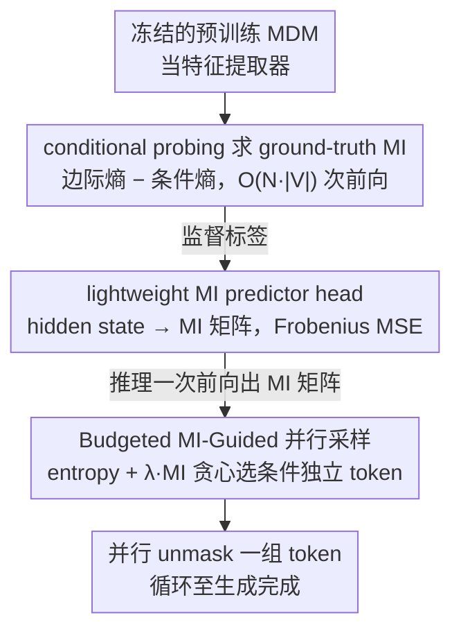

# Neural Estimation of Pairwise Mutual Information in Masked Discrete Sequence Models

**会议**: ICML2026  
**arXiv**: [2605.20187](https://arxiv.org/abs/2605.20187)  
**代码**: 待确认  
**领域**: 计算生物  
**关键词**: 掩码扩散模型, 互信息, 并行采样, ESM-C, Sudoku

## 一句话总结
本文从一个预训练 masked diffusion model (MDM) 的隐藏状态出发，训练一个轻量级"互信息预测头"，一次前向就能输出全部 token 对之间的条件互信息矩阵，并据此挑选"条件独立"的 token 子集做并行解码，在 Sudoku 和蛋白质 (ESM-C) 上把推理 NFE 降低 3-5 倍同时保持甚至超过顺序解码的质量。

## 研究背景与动机
**领域现状**：掩码扩散模型 (MDM) 现在被视作自回归 (AR) 在离散序列生成上的有力替代品，它把生成过程建模成"从全 mask 逐步 unmask"的反向扩散过程；为了避免做满 $L$ 步，主流加速策略是 Mask-Predict 这种基于"边际置信度 (entropy)"的并行解码——每步把模型最有把握 (entropy 最低) 的 top-$k$ 个 token 同时 unmask。

**现有痛点**：纯靠边际置信度选择并行 token 在结构化数据上会崩。两个置信度都很高、但彼此高度相关的 token 如果被同时采样，会出现"同一行放两个 3"这种违反硬约束的情况，蛋白质生成里则表现为破坏全局一致性。EB-Sampler 之类工作试图用 marginal entropy 之和上界 joint entropy，但这种做法把依赖结构压缩成了一个聚合的不确定性数字，无法刻画 token 之间的条件依赖、不对称依赖。

**核心矛盾**：MDM 训练时只显式学了 marginal $p(x^i \mid x_t)$，并不直接给出 joint $p(x^i, x^j \mid x_t)$；而并行解码的正确性恰恰要求知道哪些位置是条件独立的——这正是 marginal 看不见的信息。

**本文目标**：(1) 从 MDM 的隐藏状态中"读出"模型对任意两位置 $i, j$ 的条件互信息 $I(X_i; X_j \mid C)$；(2) 用这个 MI 矩阵指导并行解码，只把互信息低 (条件独立) 的 token 放在同一步 unmask。

**切入角度**：MDM 的隐藏层本身就编码了 joint 信息——只是 head 没把它显式输出而已。所以可以训一个 lightweight predictor head，把 MDM 当成"特征提取器"，监督信号来自模型自己定义的"ground-truth MI"（通过暴力 conditional probing 算出来）。

**核心 idea**：用神经互信息估计器一次前向预测整张 $N \times N$ MI 矩阵，再用 entropy + λ·MI 的 budgeted greedy 选 token 集合并行 unmask。

## 方法详解

### 整体框架
本文要解决的是 MDM 并行解码"选错 token"的问题：现有方法只看每个位置的边际置信度，无法判断两个高置信位置是否彼此相关，导致同步 unmask 时违反约束。作者的思路是先承认"预训练 MDM 的隐藏状态里其实已经编码了 token 间的联合依赖，只是输出头没把它读出来"，于是训练一个轻量级 predictor head 把这份依赖以条件互信息矩阵的形式显式输出，再用这张矩阵在每个去噪步里只挑出彼此条件独立的 token 一起 unmask。整套流程的监督信号不是来自数据真实分布，而是来自 MDM 自己 probing 出来的"模型相信的 MI"。

### 关键设计

**1. 基于 conditional probing 的 ground-truth MI：从只输出 marginal 的 MDM 反推出联合依赖**

predictor head 需要一个回归目标，但 MDM 训练时只学了边际 $p(x^i \mid x_t)$，从不直接给出联合分布，没有现成的 MI 标签可用。作者的做法是把 MDM 当成一个可以被任意"打孔条件化"的概率黑盒，用恒等式 $I(X_i; X_j \mid C) = H(X_j \mid C) - H(X_j \mid X_i, C)$ 把互信息拆成"边际熵 − 条件熵"两项分别 probing。具体要做 $1 + N \cdot |V|$ 次前向：先 1 次 base pass 拿到 $P(X_i \mid C)$ 并算出 $H(X_j \mid C)$；再对每个位置 $i$ 和每个词表元素 $v \in V$ 各做一次"把 $X_i$ 临时钉成 $v$"的 pass，得到 $P(X_j \mid X_i = v, C)$，最后按 $P(X_i = v \mid C)$ 加权求和得到 $H(X_j \mid X_i, C)$。

之所以用"模型自己 probing 出来的 MI"而不是从数据统计出来的 MI 作为标签，是因为这样 estimator 学的恰好是"模型相信 $i, j$ 之间有多少依赖"——它既匹配 estimator 的输入（同一个模型的 hidden state），也匹配下游用途（指导这个模型自己的并行解码），从而消除了数据分布和模型分布之间的 gap。代价是 $O(N \cdot |V|)$ 的前向开销极大，但这笔账只在生成监督标签的训练阶段付一次。

**2. 隐藏状态上的 lightweight MI predictor head：把 MI 估计压成一次前向**

conditional probing 太贵，没法放进推理循环，所以需要一个能一次前向就输出整张 MI 矩阵的近似器。作者把冻结的 MDM 当作特征提取器，取它最终层的 hidden state $h \in \mathbb{R}^{N \times D}$ 喂给一个小 head $f_\phi$，输出对称矩阵 $\hat{I} = f_\phi(\mathrm{MDM}(X_t))$，训练目标是 masked 位置上的 Frobenius MSE $\mathcal{L}_{MI} = \|M_{GT} - \hat{I}\|_F^2$；训练样本通过随机采样噪声水平 $t \sim \mathcal{U}[0,1]$ 再 mask 原始序列得到，让 head 在各种 mask 比例下都能预测 MI。这个 head 规模极小，Sudoku 上约 100K 参数、ESM-C (300M backbone) 上约 810K 参数。

这一步成立的前提是 MDM 隐藏层本就必须建模 token 间的联合关系才能预测被 mask 的位置，也就是"它知道依赖结构，只是输出头没说"，因此只要再加一个 head 把这份内部信念读出来即可。把昂贵的 probing 替换成一次 forward，是 MI 信号能真正进入解码循环、起到加速作用的关键。

**3. Budgeted MI-Guided 并行采样：每步只放一组彼此条件独立的 token**

有了 MI 矩阵后，需要一个解码规则决定每一步同时 unmask 哪些位置，既要快又不能破坏全局一致性。作者用一个带预算的贪心算法：先把所有 masked 位置按 marginal entropy $h_i$ 升序排（最有把握的优先），初始化预算 $B = \gamma$；对每个候选 $i$ 计算它与当前已选集合 $U$ 的依赖成本 $d(i \mid U) = \sum_{j \in U} \hat{I}_{i,j}$，总代价 $\text{cost} = h_i + \lambda \cdot d(i \mid U)$，只要 $\text{cost} \le B$ 就把 $i$ 加进 $U$ 并扣掉相应预算，最后对 $U$ 里所有 token 按各自 marginal 同步采样。这里 $\gamma$ 控制一步能并行多少，$\lambda$ 是依赖惩罚系数。

这个代价函数把"置信度"和"独立性"统一进了一个预算约束：当 $\lambda = 0$ 时退化成纯 entropy 的 Mask-Predict，会把高置信但高度相关的 token 一起 unmask 而出错；引入 $\lambda \cdot d(i \mid U)$ 后，一旦某个 $\hat{I}_{i,j}$ 很大，候选 $j$ 的代价就被推高、被迫推迟到下一步——而下一步 $j$ 的分布会因为 $i$ 已经 unmask 而更新，于是链式的条件依赖被保留下来，并行只发生在真正独立的位置上。

### 损失函数 / 训练策略
estimator 只在 masked 位置上算 Frobenius MSE，原 MDM 全程冻结。Sudoku 用 4.16M 参数的 MDM + 0.10M head，在 100K 随机 Sudoku 上训 10 epoch；ESM-C 用 300M 参数的预训练 ESM-Cambrian + 810K head，在 10K 蛋白质上训 5 epoch。

## 实验关键数据

### 主实验：Sudoku 并行解码

| 方法 | 平均 NFE | Solve Acc. |
|------|---------|-----------|
| Sequential | 53.9 | 61.6% |
| Naive ($k=4$) | 14.9 | 52.4% |
| Naive ($k=7$) | 9.0 | 36.8% |
| EB-Sampler ($\gamma=0.2$) | 15.3 | 61.0% |
| EB-Sampler ($\gamma=0.5$) | 9.9 | 51.2% |
| **MI-Guided ($\gamma=0.3$)** | 15.2 | **63.6%** |
| **MI-Guided ($\gamma=0.6$)** | 9.7 | 56.2% |

MI-Guided 在低 NFE 区不仅赢过 EB-Sampler，甚至在 $\gamma=0.3$ 配置下用 1/3 NFE 反而比 Sequential 还高 2 个点。

### 主实验：ESM-C 蛋白质生成

| 方法 | 平均 NFE | JSD to Ref. ↓ |
|------|---------|---------------|
| Sequential | 74.8 | 0.093 |
| Naive ($k=4$) | 19.1 | 0.185 |
| Naive ($k=8$) | 9.8 | 0.196 |
| Naive ($k=12$) | 6.2 | 0.218 |
| **MI-guided ($\gamma=2, \lambda=1$)** | 15.3 | **0.136** |
| **MI-guided ($\gamma=4, \lambda=1$)** | 10.0 | 0.174 |

500 条长度 50–100 的无条件生成，比 UniRef50 参考集计算 Jensen-Shannon divergence；MI-guided 在相近 NFE 下 JSD 显著低于 Naive。

### 关键发现
- **解释性副产物**：在 Sudoku 上 MI 矩阵自然恢复了行/列/3×3 块的硬约束——模型从来没被显式告知规则，但它的 internal belief 里已经把这些结构编码出来了 (Fig. 1)。
- **MI vs Entropy 的差距随结构性增强而拉大**：在 Sudoku 这种强约束任务上 EB-Sampler 表现还行，但一到蛋白质这种长程依赖明显的场景，Naive/Entropy-based 的质量塌得很厉害，MI-guided 优势放大。
- **$\lambda$ 是关键开关**：$\lambda = 0$ 就退化为 Mask-Predict；$\lambda$ 太大会过度串行化，作者实验中 $\lambda = 1$ 已经能拿到甜区。

## 亮点与洞察
- **"模型自己的 MI"作为监督信号**：不是用数据分布算 ground-truth MI，而是用模型 conditional probing 出来的 MI。这非常聪明——它消除了"数据 vs 模型"的 distribution gap，且天然适配下游"指导该模型的解码"用途，是把 MINE 系列搬到生成模型里很巧妙的一个变体。
- **把"加速"问题变成"读 hidden state"问题**：把"并行解码该选哪些 token"这个原本要靠启发式或额外采样估计的问题，转化为"在 hidden 上加一个 prediction head"——本质上承认了 MDM 已经在算 joint，只是没暴露而已。这个视角可以迁移到任何 marginal-only 输出的模型 (e.g. AR 的某些 head、energy-based model 的部分参数化)。
- **可解释性免费**：MI 矩阵本身可视化就能看出"模型理解的依赖结构"，在 Sudoku 上直接画出 row/col/box 约束。这套思路可以用来 probe 任意 MDM 学到了什么"结构知识"。

## 局限与展望
- **训练阶段开销巨大**：ground-truth MI 计算是 $O(N \cdot |V|)$ 次前向，长序列 + 大词表会非常贵 (蛋白质 20 词表还可控，ESM 词表更大或文本 LLM 词表会爆)。作者也承认这是主要限制，并提到 curriculum / 改训练策略是 future work。
- **predictor 精度有限**：MI 估计本质是回归任务，论文用 ~100K–810K 参数的 head 做 MSE，没系统比较过更深架构或对比学习目标 (CLUB / INFOLOG 之类) 的效果。
- **只在 Sudoku + ESM-C 上验证**：没有放到大规模文本 MDM (例如 SEDD、MD4) 上做语言建模的并行解码评测，泛化性还需要在更通用的语言/分子任务上确认。
- **依赖 frozen MDM**：head 是事后加上的，没探讨"联合训练 MI head + MDM"是否能进一步提升 MI 表征质量。

## 相关工作与启发
- **vs Mask-Predict (Ghazvininejad et al., 2019)**：Mask-Predict 是纯 entropy 并行 ($\lambda = 0$)，本文等价于在它之上加 MI 惩罚项 $\lambda \cdot d(i \mid U)$，从理论上修正了"高置信但相关 token 同步 unmask"的错误。
- **vs EB-Sampler (Ben-Hamu et al., 2025)**：EB-Sampler 用边际熵之和上界 joint entropy 来推迟相关 token，但只能反映 aggregate uncertainty；本文直接预测显式的 pairwise MI，能捕捉条件依赖、不对称依赖等 EB-Sampler 看不见的结构，Sudoku 实验里也证实 MI-guided 优于 EB-Sampler。
- **vs MINE / CLUB (Belghazi 2018, Cheng 2020)**：经典 MI 神经估计聚焦"表征学习时最大化/最小化 MI"，本文是首次把 neural MI estimator 嵌进生成模型的推理循环，且监督来自模型自身而非数据。
- **vs 顺序 AR 解码**：AR 强行 $O(L)$ 步，而 MI-guided 并行能在 Sudoku 上 9.7 NFE 拿到 56.2% (vs 53.9 NFE 拿 61.6%)，蛋白质上 10 NFE JSD 0.174 (vs 74.8 NFE JSD 0.093)，把 NFE 压到 1/5–1/7 同时保持可接受质量。

## 评分
- 新颖性: ⭐⭐⭐⭐ 把 neural MI estimation 嵌入 MDM 推理循环的视角很新，"用模型自身条件概率做 ground truth"也是聪明设计。
- 实验充分度: ⭐⭐⭐ Sudoku + ESM-C 两个域都做了对比，但没上大规模文本 MDM，PCA/JSD 之外的蛋白质生物学指标也偏少。
- 写作质量: ⭐⭐⭐⭐ 动机推导清晰，算法描述明确，Fig. 1 的 Sudoku MI 可视化很有说服力。
- 价值: ⭐⭐⭐⭐ MI-guided 并行解码是个通用 recipe，配合 MDM 推理加速的浪潮 (SEDD 等) 有不错的复用前景。

<!-- RELATED:START -->

## 相关论文

- [\[CVPR 2026\] Cell-Type Prototype-Informed Neural Network for Gene Expression Estimation from Pathology Images](../../CVPR2026/computational_biology/cell-type_prototype-informed_neural_network_for_gene_expression_estimation_from_.md)
- [\[NeurIPS 2025\] Is Sequence Information All You Need for Bayesian Optimization of Antibodies?](../../NeurIPS2025/computational_biology/is_sequence_information_all_you_need_for_bayesian_optimization_of_antibodies.md)
- [\[NeurIPS 2025\] KLASS: KL-Guided Fast Inference in Masked Diffusion Models](../../NeurIPS2025/computational_biology/klass_kl-guided_fast_inference_in_masked_diffusion_models.md)
- [\[ICML 2025\] ExLM: Rethinking the Impact of \[MASK\] Tokens in Masked Language Models](../../ICML2025/computational_biology/exlm_rethinking_the_impact_of_mask_tokens_in_masked_language_models.md)
- [\[ICML 2026\] Plug-and-Play Guidance for Discrete Diffusion Models via Gradient-Informed Logit Correction](plug-and-play_guidance_for_discrete_diffusion_models_via_gradient-informed_logit.md)

<!-- RELATED:END -->
