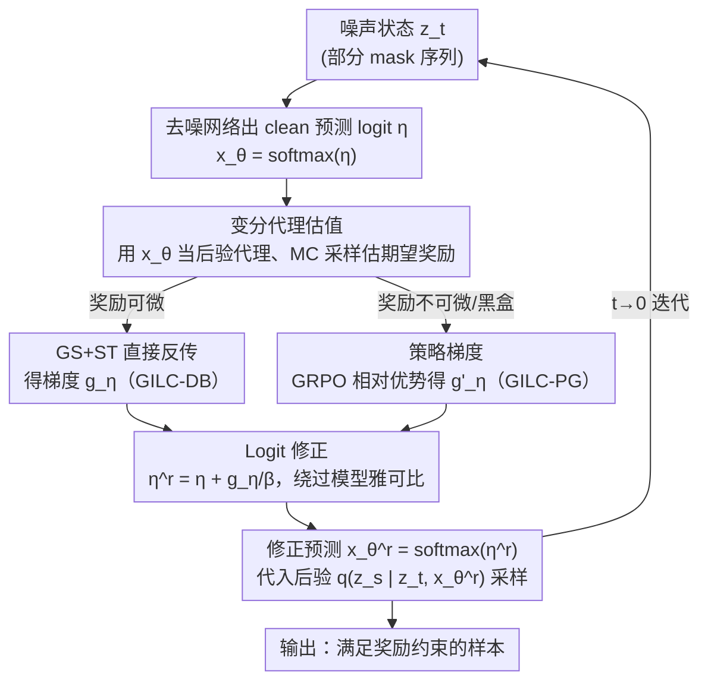

# Plug-and-Play Guidance for Discrete Diffusion Models via Gradient-Informed Logit Correction

**会议**: ICML 2026  
**arXiv**: [2606.06303](https://arxiv.org/abs/2606.06303)  
**代码**: 待确认  
**领域**: 扩散模型 / 可控生成 / 计算生物学  
**关键词**: 离散扩散、即插即用引导、logit 修正、变分代理、策略梯度

## 一句话总结
本文提出 GILC（Gradient-Informed Logit Correction），把预训练的去噪网络当作价值函数的变分代理，再用一个「绕过模型雅可比、直接在 clean 预测 logit 上做梯度修正」的机制，实现**无需任何再训练**的离散扩散可控生成，在 DNA、蛋白质、分子三类科学任务上同时超过免训练基线、甚至打平/超过微调方法。

## 研究背景与动机
**领域现状**：扩散模型已经是连续域（图像、视频）的概率建模标配，近两年也被搬到离散空间，用于语言生成、生物序列合成、分子设计。但很多科学/工业场景要的不是无条件采样，而是**可控生成**——生成的蛋白质要更稳定、分子要满足特定理化性质。

**现有痛点**：离散扩散的可控生成主流走两条路，一是分类器/无分类器引导（CG/CFG），二是对生成模型做微调（如 DRAKES）。这两条路都**额外要训练**：要么训一个时间相关的分类器、要么重训生成模型本身。每换一个新的奖励目标（新的性质约束）就得重新收集数据、重新训练，既贵又不通用；微调还容易 reward hacking（为刷奖励牺牲分布保真度）。

**核心矛盾**：连续域里成熟的「即插即用」范式（拿现成奖励函数/性质评估器直接引导、不动生成模型）一搬到离散域就失灵——离散数据本质上**不可微**，没法像连续扩散那样直接对状态求奖励梯度。现有免训练尝试（SMC、重要性采样类）要么维护多条采样轨迹、计算成本高得离谱，要么引导效果差。

**本文目标**：在**完全不训练**的前提下，给离散扩散一个既高效又有效的引导信号估计器，且要能同时处理可微和不可微（黑盒）奖励。

**切入角度**：作者把引导任务重新表述为「估计一个价值函数的梯度」——这个价值函数衡量从中间状态出发的期望未来奖励。关键观察有两个：① 训练去噪网络用的负对数似然损失，**恰好等价于**把去噪网络当作后验分布 $p_\theta(\mathbf{x}|\mathbf{z}_t)$ 变分代理时要最小化的目标，所以预训练网络免费就是现成的价值代理；② 直接对离散噪声状态 $\mathbf{z}_t$ 求导会撞上病态雅可比，但在连续光滑的 clean 预测 logit 空间求导是稳定的。

**核心 idea**：用预训练去噪网络当变分代理估价值函数，再「丢掉不稳定的模型雅可比、只在 logit 空间做梯度修正」，把奖励梯度直接加到 clean 预测 logit 上引导采样。

## 方法详解

### 整体框架
GILC 要解决的是：在标准离散扩散的逆向采样里，把每一步的无引导转移 $p_\theta(\mathbf{z}_s|\mathbf{z}_t)$ 换成一个隐式最大化奖励的最优转移 $p^r_\theta(\mathbf{z}_s|\mathbf{z}_t)$。理论上这个最优转移有闭式（式 6），但分母要对所有 $K^L$ 个状态求和、不可解。作者用一阶 Taylor 展开把它化简到「只依赖价值函数梯度 $\nabla_{\mathbf{z}_t} v(\mathbf{z}_t)$」，于是整条管线就变成：**每个去噪步里，先让网络出 clean 预测 logit，再算出奖励引导梯度并把它加回 logit，得到修正后的 clean 预测，最后用修正预测走原本的后验采样**。

整体数据流如下（以 DNA 序列从全 mask 态逐步去噪为例）：

### 关键设计

**1. 变分代理估价值函数：让预训练去噪网络免费充当价值估计器**

价值函数 $v(\mathbf{z}_t)\approx\mathbb{E}_{p_\theta(\mathbf{x}|\mathbf{z}_t)}[r(\mathbf{x})]$ 需要对「从当前状态展开多步逆向轨迹到最终数据 $\mathbf{x}$」的真实后验求期望，直接算或求导都不可解。作者引入一个变分代理 $\tilde{p}(\mathbf{x}|\mathbf{z}_t)$ 去逼近真实后验，并证明「最小化两者 KL」等价于「最小化代理的负对数似然」；若代理取 mean-field 形式 $\tilde{p}(\mathbf{x}|\mathbf{z}_t)=\prod_\ell \mathrm{Cat}(\mathbf{x}^\ell;\mu^\ell(\mathbf{z}_t,t))$，这个目标**恰好就是训练离散扩散去噪网络用的负对数似然（式 4）**。

这一步是整个免训练性质的来源：既然目标一致，直接令 $\mu(\mathbf{z}_t,t)\leftarrow\mathbf{x}_\theta(\mathbf{z}_t,t)$，拿预训练网络的 clean 预测当代理分布，再从代理里 MC 采样 $n$ 个样本估期望奖励 $v(\mathbf{z}_t)\approx\frac1n\sum_i r(\mathbf{x}^{(i)})$。和先前的确定性估计（DE，直接 $v\approx r(\mathbf{x}_\theta)$）相比，随机采样（$n>1$）能捕捉多步生成固有的不确定性，估计偏差更小，且精度随样本数可预测地提升——实验里 DE 在采样末段仍有显著偏差并出现性能平台，而本文估计器持续逼近真值。

**2. Logit 修正：丢掉病态的模型雅可比，只在 logit 空间做引导**

把价值梯度按链式法则展开（式 14），会出现两项：奖励对 logit 的「logit 敏感度」$\partial r/\partial\hat{\mathbf{x}}\cdot\partial\hat{\mathbf{x}}/\partial\eta$，和去噪网络的「模型雅可比」$\partial\eta/\partial\mathbf{z}_t$。问题出在后者：去噪网络是被训来拟合 clean 数据分布的，**不保证对输入有光滑导数**；实测它的雅可比条件数高达 $\mathcal{K}\approx10^4$–$10^5$（严重病态），加上 $\mathbf{z}_t$ 本身处在离散非光滑的 token 空间，对它求导会注入巨大噪声，让引导信号没法沿去噪轨迹连贯累积。

作者借鉴 SDS（Score Distillation Sampling）「在连续扩散里直接丢掉不稳定雅可比项」的思路，干脆**整个绕过模型雅可比**，只保留 logit 敏感度，把引导定义在光滑连续的 logit 空间：$g_\eta\triangleq\frac1n\sum_i \frac{\partial r(\hat{\mathbf{x}}^{(i)})}{\partial\hat{\mathbf{x}}^{(i)}}\frac{\partial\hat{\mathbf{x}}^{(i)}}{\partial\eta}$。最终引导以一个很可解释的形式落地：先修正 logit $\eta^r=\eta+g_\eta/\beta$，得到奖励修正后的预测 $\mathbf{x}_\theta^r=\mathrm{softmax}(\eta^r)$，再把它代回原后验 $q(\mathbf{z}_s|\mathbf{z}_t,\mathbf{x}_\theta^r)$ 采样。实验（Fig. 2b）显示在 logit 空间引导比在噪声态 $\mathbf{z}_t$ 引导收敛更快、累积奖励更高。

**3. 可微奖励 → GS+ST 直接反传（GILC-DB）**

当奖励是现成的可微网络时，MC 采样这一步本身会断开计算图（采样不可导），没法直接反传。作者用 Gumbel-Softmax（GS）重参数化给出可微的软样本 $\mathbf{x}_{\text{soft}}$（温度 $\tau$ 控制锐度），再叠一个 Straight-Through（ST）估计器：前向用 hard one-hot $\mathbf{x}_{\text{hard}}=\mathrm{one\text{-}hot}(\arg\max \mathbf{x}_{\text{soft}})$ 喂给奖励模型（很多奖励模型只吃离散输入），反向梯度走可微的 $\mathbf{x}_{\text{soft}}$，复合输入写成 $\hat{\mathbf{x}}=\mathbf{x}_{\text{hard}}-\mathrm{sg}(\mathbf{x}_{\text{soft}})+\mathbf{x}_{\text{soft}}$。这样既保证奖励算的是真离散输入、又让梯度稳定回流。GILC-DB 因为吃了奖励函数的内部梯度，引导更精准、且每步只需 1 次去噪调用 + 5 次奖励调用，效率明显优于要维护多轨迹的基线。

**4. 不可微奖励 → 策略梯度 + 相对优势（GILC-PG）**

很多真实奖励是黑盒、不可微的（如美学评分）。作者用策略梯度（REINFORCE 思想）改写价值梯度：$\nabla_\eta \mathbb{E}_{p_\theta(\mathbf{x}|\mathbf{z}_t)}[r(\mathbf{x})]=\mathbb{E}[r(\mathbf{x})\,\partial\log p_\theta(\mathbf{x}|\mathbf{z}_t)/\partial\eta]$，同样用变分代理采样估计、把 $\log p_\theta$ 换成代理的对数似然。为降方差、稳梯度，进一步学 GRPO 把绝对奖励换成**组内相对优势** $\mathcal{A}_i=\frac{r(\mathbf{x}^{(i)})-\mathrm{mean}}{\mathrm{std}}$，得到 $g'_\eta\triangleq\frac1n\sum_i\mathcal{A}_i\,\partial\log\langle\mathbf{x}_\theta,\mathbf{x}^{(i)}\rangle/\partial\eta$。这条路完全不关心奖励是否可微，是黑盒引导的稳健 fallback。

### 损失函数 / 训练策略
GILC **不引入任何训练**——既不训分类器也不微调生成模型，全程复用预训练去噪网络 + 现成奖励函数。唯一的「目标」是采样时隐式求解式 5 的「奖励 − $\beta$·KL 正则」目标，其闭式解 $p^r_\theta(\mathbf{x})\propto p_\theta^{\text{pre}}(\mathbf{x})\exp(r(\mathbf{x})/\beta)$ 通过上述 logit 修正在每个去噪步近似实现，$\beta$ 控制「满足奖励」与「保持原分布质量」的权衡。

## 实验关键数据

### 主实验
跨 DNA、蛋白质、分子三类科学域评测（均用预训练离散扩散/流模型 + 独立的引导/评测双 oracle 防泄漏）。下表为调控 DNA 序列设计（ACDC 之外的 Gosai 增强子数据集，640 样本）：

| 方法 | 类型 | Pred-Activity ↑ | ATAC-Acc(%) ↑ | JASPAR Corr ↑ |
|--------|------|------|------|------|
| Pretrained | 无引导 | 0.17 | 1.5 | 0.249 |
| CFG | 训练引导 | 5.04 | 92.1 | 0.864 |
| DRAKES | 微调 | 5.61 | 92.5 | 0.911 |
| SVDD | 免训练 | 4.84 | 51.9 | 0.826 |
| **GILC-DB** | 免训练 | **7.04** | **95.2** | 0.935 |
| **GILC-PG** | 免训练 | 5.21 | 84.0 | **0.937** |

蛋白质逆折叠（稳定性引导，主指标为同时满足 Pred-ddG>0 且 scRMSD<2 的成功率）：

| 方法 | Pred-ddG ↑ | 成功率(%) ↑ |
|--------|------|------|
| Pretrained | −0.544 | 34.4 |
| DRAKES（微调） | 1.095 | 78.6 |
| SVDD（免训练） | 0.694 | 65.0 |
| **GILC-DB** | **1.430** | **82.4** |
| GILC-PG | 0.719 | 69.8 |

GILC-DB 成功率超过微调方法 DRAKES 约 4 个百分点。分子生成（QM9，6 种量子性质 MAE）上 GILC-PG 在大多数性质上取得免训练方法最佳，GILC-DB 次之；并能零改动扩展到 CIFAR-10 类条件生成与 Meissonic 文生图（用不可微美学评分引导）。

### 效率对比（DNA 任务，每步调用数）

| 方法 | 去噪调用 ↓ | 奖励调用 ↓ |
|------|------|------|
| Best-of-NN / SMC / SVDD | 20 | 20 |
| TFG-Flow | 1 | 20 |
| **GILC-DB** | **1** | **5** |
| GILC-PG | 1 | 20 |

### 关键发现
- **去掉模型雅可比是稳定性关键**：直接对 $\mathbf{z}_t$ 求导因雅可比病态（条件数 $10^4$–$10^5$）导致引导信号无法连贯累积；改在 logit 空间引导后收敛更快、累积奖励更高（Fig. 2b）。
- **随机变分估计胜过确定性估计**：MC 样本从 5 增到 50，价值估计 $L_1$ 误差单调下降；确定性估计（DE）在采样末段仍偏差显著、出现性能平台。
- **DB vs PG 各有所长**：GILC-DB 吃奖励内部梯度，功能活性类指标最强、奖励调用最省（5 次）；GILC-PG 把奖励当黑盒，序列保真度/分子 MAE 上反而更优、通用性更强。

## 亮点与洞察
- **「训练损失=变分目标」的洞察很巧**：作者点破去噪网络的负对数似然训练目标恰好等价于变分代理的拟合目标，于是预训练网络「免费」就是价值估计器——这是整套免训练范式成立的地基，比硬训一个价值网络优雅得多。
- **把 SDS 的「丢雅可比」思想迁到离散域**：连续扩散里 SDS 丢不稳定雅可比早有先例，本文识别出离散扩散的病态雅可比更严重（离散非光滑 token 空间叠加病态条件数），并给出 logit 空间这个「光滑替身」，是一个干净且可解释的工程化解法。
- **一套框架两种 fallback**：可微走 GS+ST 反传、不可微走策略梯度+GRPO 相对优势，统一在「修正 logit」这一个动作上，迁移性强——任何离散/流扩散 + 任何奖励（含黑盒）都能即插即用。

## 局限与展望
- 作者承认：DB/PG 仍需多次 MC 采样查询奖励函数，进一步压低采样次数同时保持引导保真度是待解问题。
- mean-field（token 独立）假设在结构化域（如自然语言，token 强依赖）会引入非平凡误差；放松独立性约束扩展到大规模扩散语言模型是重要下一步。
- 自己看：实验主要在中等词表/中等长度的科学序列与图像上，超长序列、超大词表的可扩展性与 $\beta$、$\tau$、$n$ 的敏感性还需更系统的报告；文生图仅给定性结果。

## 相关工作与启发
- **vs DRAKES（微调）**: DRAKES 重训生成模型刷奖励，易 reward hacking、需仔细调 KL 约束强度；GILC 完全不训、且在蛋白质成功率上反超约 4 个点。
- **vs SVDD / SMC / Best-of-NN（免训练）**: 它们靠维护多条采样轨迹做重要性采样/筛选，去噪+奖励调用都是 20 次量级且引导效果有限；GILC 单轨迹、去噪只调 1 次，效果与效率双赢。
- **vs CFG（训练引导）**: CFG 重度依赖标注数据、泛化受限；GILC 只需现成奖励函数，换目标无需重训。

## 评分
- 新颖性: ⭐⭐⭐⭐⭐ 「训练损失=变分目标」+「logit 空间丢雅可比」两个洞察组合出真正即插即用的离散扩散引导，思路干净。
- 实验充分度: ⭐⭐⭐⭐⭐ DNA/蛋白质/分子三大科学域 + 图像，含效率、价值估计收敛、雅可比病态等多维消融。
- 写作质量: ⭐⭐⭐⭐ 推导清晰、图示到位；部分关键结论（如图像）仅定性，$\beta/\tau/n$ 敏感性可更系统。
- 价值: ⭐⭐⭐⭐⭐ 免训练、可处理黑盒奖励、单轨迹高效，对药物/基因设计等可控科学生成实用性强。

<!-- RELATED:START -->

## 相关论文

- [\[ICML 2026\] Stein Diffusion Guidance: Training-Free Posterior Correction for Sampling Beyond High-Density Regions](stein_diffusion_guidance_training-free_posterior_correction_for_sampling_beyond_.md)
- [\[ICML 2026\] On the Collapse of Generative Paths: A Criterion and Correction for Diffusion Steering](on_the_collapse_of_generative_paths_a_criterion_and_correction_for_diffusion_ste.md)
- [\[ICML 2026\] TD3B: Transition-Directed Discrete Diffusion for Allosteric Binder Generation](td3b_transition-directed_discrete_diffusion_for_allosteric_binder_generation.md)
- [\[NeurIPS 2025\] Remasking Discrete Diffusion Models with Inference-Time Scaling](../../NeurIPS2025/computational_biology/remasking_discrete_diffusion_models_with_inference-time_scaling.md)
- [\[ICML 2026\] Neural Estimation of Pairwise Mutual Information in Masked Discrete Sequence Models](neural_estimation_of_pairwise_mutual_information_in_masked_discrete_sequence_mod.md)

<!-- RELATED:END -->
