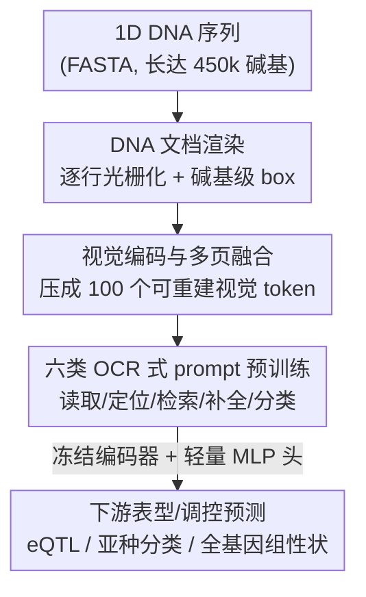

# Rethinking Genomic Modeling Through Optical Character Recognition

**会议**: ICML 2026  
**arXiv**: [2602.02014](https://arxiv.org/abs/2602.02014)  
**代码**: 见 OpenReview / 项目主页（论文标注有 Code 链接）  
**领域**: 计算生物学 / 基因组基础模型 / 视觉-语言模型  
**关键词**: 基因组建模, OCR, 视觉 token 压缩, 长序列, eQTL 预测

## 一句话总结
OpticalDNA 把一维 DNA 序列**渲染成多页"文档图像"**，再用一个 OCR 式的视觉-语言模型去"阅读"它，把碱基内容压成少量可重建的视觉 token，从而在最长 45 万碱基的长序列任务上以约 $20\times$ 更少的有效 token、仅 256K 可训练参数就超过比它大 $985\times$ 的序列基础模型。

## 研究背景与动机
**领域现状**：当前主流的基因组基础模型（Nucleotide Transformer、HyenaDNA、Caduceus、Evo-2、JanusDNA 等）几乎全部沿用大语言模型那一套——把 DNA 当成 A/T/C/G 四字母表上的**一维 token 序列**，用 Transformer 做掩码语言建模或自回归建模来学上下文表示。

**现有痛点**：作者指出这种"顺序逐 token 阅读"和基因组语义存在结构性错配，体现在两点。其一是**缺乏结构感知的阅读**：基因组的功能信号是稀疏、不连续的，被大段低信息量的背景区隔开，相距很远的位点之间存在"跳跃式"依赖；可顺序模型继承了自然语言"语义稠密、逐 token 读"的归纳偏置，把大量算力浪费在扫描背景上，而不是建模真正重要的功能区。其二是**缺乏理解驱动的压缩**：基因组信息密度本就低，长序列建模天然需要压缩，但高保真压缩要求"先看懂再压"——识别稀疏的、任务相关的结构并抑制背景；而 token 级 LLM 范式对背景区和功能区一视同仁地分配算力，运行时间和显存随序列长度急剧膨胀。

**核心矛盾**：一维序列表示既无法表达基因组坐标/区间这类一等公民的操作（区间定位、子序列检索只能靠位置编码隐式编码），又无法做"看懂之后再压缩"，于是长上下文下效率和精度同时受限。

**切入角度**：作者做了一个关键观察——**OCR 式文档理解和基因组分析高度同构**。文档 OCR 里的"定位（grounding）、检索（retrieval）、缺失补全（span completion）"恰好对应基因组里的"变异定位、子序列检索、缺失区间推断"。把 DNA 当成一篇可以**选择性跳读**的"文档"而非一句必须逐字读完的"句子"，就能用区域感知的视觉归纳偏置去处理稀疏信号。

**核心 idea**：把基因组建模重新表述为 **OCR 式文档理解**——将 1D DNA 渲染成结构化的 2D 多页图像，用视觉编码器把碱基内容压成紧凑且可重建的视觉 token，再用文档解码器在六类 OCR 式 prompt 任务下学习"布局感知"的 DNA 表示。

## 方法详解

### 整体框架
OpticalDNA 的输入是一条 FASTA 里的 DNA 序列 $S=(s_1,\dots,s_N)$（$s_i\in\{A,C,G,T,N\}$），输出是下游表型/调控预测，中间走"渲染成文档图 → 视觉编码压缩 → prompt 条件解码"三段。具体地：先把 $S$ 按每页约 1800 个碱基**逐行光栅化**成多页图像 $\mathcal{D}(S)$，并为每个碱基记录像素级 bounding box，建立"序列区间 ↔ 像素区域"的双向映射 $\Phi$；然后视觉编码器 $E_\theta$ 只吃页面图像、把多页融合成一段定长视觉 token $Z\in\mathbb{R}^{L\times d}$（实现里 $L=100$）；最后文档解码器 $G_\psi$ 在六类 OCR 式 prompt 监督下自回归生成各任务输出。预训练完成后，**冻结的编码器被当作通用表示提取器**，只在上面挂一个轻量 MLP 头 $g_\phi$ 做下游预测。

### 关键设计

**1. DNA 文档渲染：把跳跃式长程依赖变成 2D 空间结构**

针对"顺序阅读浪费算力、长程依赖跳跃"的痛点，OpticalDNA 不再喂 token 序列，而是把 $S$ 用等宽字体在固定分辨率画布（页面 $H=W=640$）上**逐行写出来**：每行从左到右、行间从上到下，渲染内容只含 A/C/G/T/N，不插入任何索引、分隔符或坐标标记；写不下就自动续到下一页，默认 `font_size=14`、`line_spacing=1.6`，一页约 1800 个碱基。每页都附一份有序的碱基级标注 $\mathcal{B}^{(p)}=[b_0^{(p)},\dots]$，每个标注 $b_k^{(p)}=(c_k^{(p)},g_k^{(p)},\mathbf{r}_k^{(p)})$ 记录渲染字符、在 $S$ 中的**全局索引** $g_k$ 以及像素框 $\mathbf{r}_k=(x_1,y_1,x_2,y_2)$。这样就建立了区间到区域的映射 $\Phi:(i,j)\mapsto b_{ij}$（box 形如 $[img\_id,x_1,y_1,x_2,y_2]$，$img\_id$ 指明页号），让"按坐标取一段 DNA""定位某个区间"这类区间级操作变成图像上现成可监督的几何对象，而不是只能靠位置编码隐式表达。作者还用受控实验佐证了这条路线：2D CNN 骨干在 eQTL 上的精度-效率折中明显优于 1D CNN，说明把序列摊成二维布局本身就带来更好的归纳偏置。

**2. 六类 OCR 式 prompt 任务：把基因组原语对齐到文档理解原语**

光有图像还不够，得让模型在合适的目标下学会"看懂"。作者把基因组理解拆成四个核心原语——识别（reading）、定位（grounding）、检索（retrieval）、补全（completion），实例化为六个 prompt 家族 T1–T6，每个训练样本是一段**两轮多模态对话** $\mathcal{C}=[m^{(u)},m^{(a)}]$，user 轮带页面图和任务 prompt，assistant 轮给监督目标。六个任务覆盖：T1 自由式 DNA 转写（纯 OCR）、T2 转写 + 空间定位（输出序列-box 对）、T3 给定 ROI 框内转写、T4 给定 ROI 的掩码区间补全、T5 query 驱动的子序列定位（返回所有命中的 box）、T6 染色体级文档分类。每个任务有形式化的监督空间（如 $\mathcal{Y}_2=(\Sigma^*\times\mathbb{B})^*$ 表示变长的"DNA 串 + box"对列表，$\Sigma=\{A,C,G,T,N\}$）。这套设计的巧妙在于：grounding↔变异定位、retrieval↔子序列检索、completion↔缺失区间推断，OCR 原语和真实基因组分析工作流天然一一对应，因此 prompt 监督学到的是**区域级可解释、碱基级可理解**的表示，而不是全局序列 token 预测。

**3. 视觉编码器 + 文档解码器：把碱基压成可重建的紧凑视觉 token**

要做"理解驱动的压缩"，关键是编码器既要压得狠又要可重建。OpticalDNA 复用 DeepSeek-OCR 的 SAM–Conv–CLIP-L 视觉前端：每页切成 $16\times16$ patch，Conv 阶段沿 token 轴做固定 $16$ 倍下采样，再用投影器 $\Pi_\theta$ 对齐到解码器宽度得到逐页 token $\tilde{U}\in\mathbb{R}^{P\times T\times d}$（$T=T_0/16$）。由于一条 DNA 可能跨多页，多页融合模块 $\mathcal{F}_\theta$（单层、20 头自注意力 + 沿页维均值约简）把它聚合成与页数无关的定长文档表示 $Z=\mathcal{F}_\theta(\tilde{U})\in\mathbb{R}^{L\times d}$，$L=100$。文档解码器 $G_\psi$ 是 DeepSeek-3B 的 MoE（570M 激活参数），prompt 里放一个 `<image>` 占位符并追加 `NUM_IMAGES=P` 元信息行，条件于 $Z$ 和任务 prompt $q$ 自回归生成 $P_\psi(\hat Y\mid Z,q)=\prod_t P_\psi(\hat y_t\mid \hat y_{<t},Z,q)$。正是这条"碱基→视觉 token"的路径把有效 token 数相比碱基/$k$-mer 分词降了约 $20\times$，同时通过 T1/T3/T4 的转写与补全监督保证压缩**可重建、不丢细粒度信息**。

### 损失函数 / 训练策略
预训练用统一的 prompt 条件生成目标：给定 prompt $q$ 和融合视觉 token $Z$，只在 assistant 回复 span 上做 teacher-forcing 自回归损失

$$\mathcal{L}_{\mathrm{pt}}=-\sum_{t=1}^{T}\log P_\psi\!\left(y_t\mid y_{<t},Z,q\right).$$

训练时任务索引按类别分布 $t\sim\mathrm{Cat}(\boldsymbol\pi)$ 采样以平衡 T1–T6，并对依赖区域条目的 T2/T3/T5 做尾部截断、行/块跨度随机化、T5 的 query 长度随机化等增强来提升鲁棒性。参数侧：冻结 SAM–Conv–CLIP-L 视觉前端，解码器 $G_\psi$ 用 LoRA 微调，多页融合 $\mathcal{F}_\theta$ 全参数更新，投影器 $\Pi_\theta$ 视设置用 LoRA 或全参。在 HG38 上用两阶段调度（Stage 1 约 8 天训 $\mathcal{F}_\theta$+LoRA，Stage 2 约 3 天调 $\Pi_\theta$），8×H100 训练。

## 实验关键数据

### 主实验
OpticalDNA 在三个长序列基准上评测：DNALONGBENCH（eQTL，序列长达 45 万碱基）、RiceSubBench（水稻亚种跨分布泛化）、RiceWGPB（约 4 亿碱基全基因组性状预测）。下表为 DNALONGBENCH eQTL 九个 GTEx 组织的平均 AUROC：

| 模型 | 可训练参数 | 平均 AUROC | 相对本文 |
|------|-----------|-----------|----------|
| HyenaDNA | 1.6M | 0.514 | −65.8%(相对) |
| Caduceus-Ph | 7.7M | 0.750 | OpticalDNA +13.6% |
| NT-v2-500M* | 1.03K | 0.772 | +10.4% |
| GENERator-1.2B* | 10.24K | 0.782 | +9.0% |
| JanusDNA (w/o mid-Attn) | 7.66M | 0.791 | +7.7% |
| 专家模型 Enformer | 252M(激活) | 0.681 | — |
| **OpticalDNA (Linear Probe)** | **256K** | **0.852** | SOTA |
| **OpticalDNA (MLP)** | **1.3M–2.3M** | **0.867** | 5/9 组织最佳 |

仅用 256K 线性探针就拿到 0.852 平均 AUROC，比 JanusDNA 用约 $30\times$ 更少的可训练参数还全面更优；换轻量 MLP 头进一步到 0.867，在 WB（0.927 vs 0.821）、Thyroid（0.876 vs 0.793）上大幅领先。相对激活 252M 参数的 Enformer，OpticalDNA 以最多 $985\times$ 更少的激活参数胜出。

水稻跨亚种泛化（RiceSubBench，Accuracy/AUROC）：

| 模型 | 参数 | In-Domain japonica | Far-OOD glaberrima |
|------|------|--------------------|--------------------|
| Evo-2 | 7B | 0.486 / 0.700 | 0.489 / 0.705 |
| LucaOne | 1.8B | 0.510 / 0.703 | 0.526 / 0.736 |
| **OpticalDNA** | **409M** | **0.590 / 0.739** | **0.599 / 0.731** |

OpticalDNA 在所有 split 的 accuracy 上都最好，且分布偏移越强优势越大（rufipogon +8.49%、barthii +9.35%、glaberrima +13.88%）。在 RiceWGPB（约 4 亿碱基）上，它在 TGW（RMSE 2.952）和 LRI（9.531）上均最低，且在 389.8M 碱基的代表基因组上把推理时间从 Evo-2 的 5h40m、LucaOne 的 32.5m 压到 **12.3 分钟**。

### 消融实验
作者以同样协议把 OpticalDNA 和它的骨干 DeepSeek-OCR 对比，回答两个问题：

| 配置 | 关键指标 | 说明 |
|------|---------|------|
| DeepSeek-OCR 骨干 | eQTL AUROC 基线 | 通用 OCR 模型直接做下游 |
| **OpticalDNA (Q1 下游)** | 平均 **+5.37%** 相对增益 | DNA 专用文档化 + 预训练，全部 9 组织都涨；Thyroid +16.86%、SNSES +14.30% 最猛 |
| DeepSeek-OCR (Q2 转写) | EM ≈ 0（全程） | 通用 OCR 几乎转写不出 DNA |
| **OpticalDNA (Q2 转写)** | EM 79.6/74.9（满长），CS 90.6–100.0 | 在 HG38/rice 上近乎完美短前缀转写（10% 前缀 EM 97.3/98.5） |

### 关键发现
- 把基因组渲染成文档 + OCR 式预训练带来的不是花架子：下游 eQTL 平均 +5.37%，且在更难的组织（Thyroid、SNSES）上增益最大，说明区域感知表示对弱信号组织帮助更显著。
- 可重建是压缩有效的前提：通用 DeepSeek-OCR 的 DNA 转写 EM 几乎为零，而 OpticalDNA 在严苛尾部截断下仍保持 90%+ 的字符相似度，证明 100 个视觉 token 真的"压而不丢"。
- 极致参数/token 效率：256K 可训练参数 + 约 $20\times$ 更少有效 token 就超越 7B 级多物种基础模型，长基因组推理从数小时降到十几分钟，是真正可落地的规模优势。

## 亮点与洞察
- **范式级 reframing**：第一个把基因组建模当成 OCR 式文档理解的工作。它的"啊哈"在于发现 grounding/retrieval/completion 这套文档原语和变异定位/子序列检索/缺失推断这套基因组原语严丝合缝地对齐，于是能直接借用成熟 OCR 模型与监督形式。
- **可重建视觉 token 是压缩落地的钥匙**：用 T1/T3/T4 的转写与补全任务逼编码器学到"可还原"的压缩，避免了一般 token 压缩"压完就丢信息"的陷阱，这套思路可迁移到任何"低信息密度长序列"建模（如蛋白、时间序列、日志）。
- **坐标即一等公民**：把序列区间显式映射到像素 box，让区间定位/检索从"隐式位置编码"变成"可监督的几何输出"，给基因组分析里大量 region-based 操作提供了天然接口。

## 局限与展望
- 渲染配置（每页约 1800 碱基、字号/行距固定）是经验设定，论文也指出转写在接近单页容量时会退化，说明"页面密度"是个未充分探索的敏感超参，过密会丢精度。
- 训练成本不低：HG38 两阶段约 11 天、8×H100，虽然推理高效，但预训练门槛仍高于轻量序列模型。
- 评测集中在 eQTL / 亚种分类 / 全基因组性状这几类，尚未覆盖更细粒度的调控元件注释、突变效应预测等任务；OCR 渲染对含大量 `N`（未知碱基）或重复区的序列是否稳健也有待验证。
- 视觉化是否在所有基因组语义上都优于序列建模仍是开放问题——本文主要在长上下文场景展示优势，短序列任务上的相对收益未充分讨论。

## 相关工作与启发
- **vs 序列式基因组基础模型（NT、HyenaDNA、Caduceus、JanusDNA、Evo-2）**：它们把 DNA 当成扁平 token 流，坐标和区间操作只能靠位置编码/注意力权重隐式编码；OpticalDNA 把基因组当成坐标索引对象，把区间定位/检索/区域推理提升为一等原语，且以远少的参数和 token 取胜。
- **vs OCR / 文档理解模型（Donut、Nougat、DeepSeek-OCR）**：这些模型为自然文档设计，从未用于基因组；本文首次架起 OCR 与基因组建模的桥梁，并针对 DNA 设计了六类专用 prompt 任务和多页融合，把通用 OCR 骨干改造成 DNA 专用表示提取器（直接用 DeepSeek-OCR 做 DNA 转写 EM 近乎为零，凸显专用预训练的必要）。

## 评分
- 新颖性: ⭐⭐⭐⭐⭐ 把基因组建模 reframe 成 OCR 文档理解是真正的范式创新，并给出原语级对齐论证
- 实验充分度: ⭐⭐⭐⭐⭐ 三个长序列基准 + 多个强基线（含 7B 级）+ 转写/下游双消融 + 污染分析
- 写作质量: ⭐⭐⭐⭐ 动机和方法链条清晰，但部分关键配置散落在附录，正文略密
- 价值: ⭐⭐⭐⭐⭐ 极致参数/token 效率 + 长基因组可落地推理，给长序列建模提供了可迁移的新思路

<!-- RELATED:START -->

## 相关论文

- [\[AAAI 2026\] MergeDNA: Context-aware Genome Modeling with Dynamic Tokenization through Token Merging](../../AAAI2026/computational_biology/mergedna_context-aware_genome_modeling_with_dynamic_tokenization_through_token_m.md)
- [\[AAAI 2026\] Efficient Chromosome Parallelization for Precision Medicine Genomic Workflows](../../AAAI2026/computational_biology/efficient_chromosome_parallelization_for_precision_medicine_genomic_workflows.md)
- [\[ICML 2026\] Learning Protein Structure-Function Relationships through Knowledge-guided Representation Decomposition](learning_protein_structure-function_relationships_through_knowledge-guided_repre.md)
- [\[ICML 2025\] ExLM: Rethinking the Impact of \[MASK\] Tokens in Masked Language Models](../../ICML2025/computational_biology/exlm_rethinking_the_impact_of_mask_tokens_in_masked_language_models.md)
- [\[ICML 2026\] Protein Autoregressive Modeling via Multiscale Structure Generation](protein_autoregressive_modeling_via_multiscale_structure_generation.md)

<!-- RELATED:END -->
