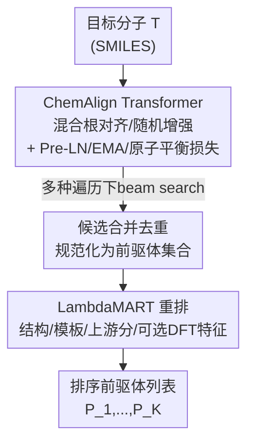

# RETROSPECT: RETROsynthesis via Sequential Prediction, and Chemically Transformed-ranking

**会议**: ICML2026  
**arXiv**: [2606.07181](https://arxiv.org/abs/2606.07181)  
**代码**: 待确认  
**领域**: 计算生物 / 计算化学 / 逆合成预测  
**关键词**: 单步逆合成, SMILES 增强, Transformer 生成器, LambdaMART 重排, USPTO-50K

## 一句话总结
把单步逆合成拆成"提议（proposal）+ 选择（selection）"两个独立模块——用一个强化训练的单模型 ChemAlign Transformer 生成候选前驱体，再用 LambdaMART 对合并去重后的候选池做学习排序重排，在 USPTO-50K 上单模型 top-1 达 55.00%、重排后 59.4%，并诚实地拆清了"重排增益主要来自哪些特征"。

## 研究背景与动机

**领域现状**：逆合成（retrosynthesis）问的是"什么前驱体分子能合成目标分子"，是计算机辅助合成规划的核心——单步模型会被多步搜索反复调用。一个好的单步模型要同时满足两个要求：**正确的断键要排在候选列表靠前**，且**候选列表要足够丰富**，让规划器或化学家在首选方案不可用/不安全/策略不佳时还能回退。主流方法分模板法（分类/检索反应模板）和无模板法（直接生成前驱体 SMILES 串或图）。

**现有痛点**：很多系统把"提议候选"和"给候选排序"**揉进同一个阶段**——无论模板法还是 seq2seq，最终都吐出一个排好序的候选列表，但"枚举合理断键的机制"和"决定它们顺序的机制"其实不是一回事。揉在一起就没法干净地回答两个问题：一个精心训练的**单模型** Transformer 提议器自己能做到多好？候选池已经存在后，到底**哪些特征族**真正改善了排序？

**核心矛盾**：现有 SOTA（如 RetroChimera）靠**集成多个互补提议模型 + 学习排序**取得高分，但集成把"提议强不强"和"排序贡献多少"混在一起，科学上难以归因，工程上也难以复用单个组件。

**本文目标**：(1) 造一个尽量强的**单模型**提议器（不靠集成），看它独立能到什么水平；(2) 在候选池上做独立的学习排序研究，搞清楚重排信号到底来自哪里；(3) 给出一个**模块化、可解释、可作为集成系统即插即用组件**的逆合成框架。

**切入角度**：作者刻意把提议器做成单模型而非集成，从而把"提议"与"排序"解耦，分别单独研究、单独消融。

**核心 idea**：proposal–selection 解耦——一个强单模型 ChemAlign Transformer 负责生成丰富候选，一个 LambdaMART 重排器负责在候选池上重新排序，二者互补而非互相替代。

## 方法详解

### 整体框架
RETROSPECT 输入目标分子 $T$，输出一个排好序的前驱体集合列表 $P_1,\dots,P_K$。整条管线是清晰的两段式：**生成器**在多种 SMILES 遍历方式下产候选 → 候选**合并去重**成一个 proposal pool → **listwise 重排器**对池子重新排序。两个模块各司其职：生成器决定"合理候选能不能进池子"，重排器决定"池子里候选怎么排"。

### 关键设计

**1. ChemAlign Transformer：用混合 SMILES 增强 + 强化优化把单模型提议器做到极致**

逆合成 seq2seq 的一大难点是源（产物）和目标（前驱体）SMILES 的编辑距离大，模型难学对齐。本文的生成器是 6 层 encoder / 6 层 decoder、隐藏维 512、8 头、FFN 2048 的标准编码-解码 Transformer（基于 Augmented Transformer），但在三处做了针对化学的强化。最关键的是**混合 SMILES 增强**：对 40,008 条训练反应做 20 倍离线增强，其中 **16 份用根对齐（root-aligned）SMILES**——让产物和前驱体的遍历从对应原子出发、极大降低源-目标编辑距离，**4 份用随机 SMILES** 保留遍历不变性。随机增强的多片段前驱体按规范片段排序以降低输出顺序方差，根对齐的则保留对齐顺序。消融显示根对齐增强是最主导的设计：在 15K 反应消融里它把 top-1 提升 **9.23 个百分点**。其次是一组优化与正则技巧：**Pre-LayerNorm**（稳定优化）、**三向权重绑定**（encoder/decoder 词嵌入与输出投影共享）、**EMA 权重**（decay 0.999，用于验证/推理），这些再叠加 **1.54 个百分点**。

**2. 可微原子平衡辅助损失：把"质量守恒"软约束进生成**

逆合成生成的前驱体应当与产物满足原子守恒，但硬约束不可微、没法端到端训。作者设计一个**可微的原子平衡辅助损失**：设 decoder 在位置 $t$ 的 logits 为 $z_t$、矩阵 $A$ 把每个 token 映到 12 种元素的计数，则在 softmax 下的**期望元素计数** $\hat{a}=\sum_t \mathrm{softmax}(z_t)A$，对它与真值元素比例之间的偏差加 L1 惩罚（系数 0.1）。它不是硬性合法性约束，而是**把模型软性地推离质量不平衡**，同时保持可微。这一项让生成器在保持 99.86% top-1 合法率的同时减少违反守恒的输出。

**3. LambdaMART 候选池重排：在已存在的池子上学 listwise 排序**

提议器再强也只解决"候选进不进池"，"怎么排"是另一回事。重排器用 **XGBoost LambdaMART**、以 listwise 的 `rank:ndcg` 为目标。候选池由生成器在多种产物遍历下跑 beam search、再合并去重得到（测试池平均每个产物约 **111 个候选**）。每个"目标-候选"对算四类特征块：**结构描述子**（药效团计数、官能团指示、原子数差、Morgan/MACCS 指纹相似度）、**反应模板描述子**（能否抽出模板、多半径哈希模板标识、**在训练集上冻结**的模板频率统计）、**上游提议分数**、以及**可选的 DFT 衍生特征**（HOMO/LUMO/gap/偶极/硬度/软度等前线轨道差）。排序在每个产物内部 groupwise 训练、**绝不跨产物**；训练标签用分级相关性——前驱体集合精确匹配给最高增益，部分片段重叠给较弱正标签。一个关键工程细节是**所有频率类统计必须在训练集上冻结后再用到验证/测试**，否则会信息泄漏。消融表明：上游提议分是**最强的单一特征**，模板频率/标识特征贡献次之，DFT 特征则次要且不稳定。

### 一个例子：候选池怎么流动
给定一个产物，生成器在 ~111 个候选的规模下产出大量带遍历差异的前驱体假设；这些假设先被规范化成统一的前驱体集合表示、按规范化前驱体 SMILES 合并——同一前驱体集合若被多次提议，只保留一行、记录来源、并保留该集合**最好的上游分数**；然后 LambdaMART 在这个产物的候选组内用四类特征重新排序。本文里这一步把 top-1 从 55.00% 抬到 59.4%、top-10 从 86.18% 抬到 93.06%、MRR 达 0.7171，证明"提议已强、排序仍有独立增益"。

### 损失函数 / 训练策略
生成器用 token 归一化交叉熵（无 label smoothing）+ 原子平衡 L1 辅助损失训练；Adam（$\beta_1=0.9,\beta_2=0.998,\epsilon=10^{-9}$）、Noam 调度（factor 2.0、8000 warmup）、按目标长度打包到每微批 16,384 token、累积 2 步、AMP 混合精度；每 2000 步验证，最佳 EMA checkpoint 在第 20,000 步。重排器为 XGBoost LambdaMART，`rank:ndcg` 目标，分级相关性标签，频率统计训练集冻结。

## 实验关键数据

### 主实验
USPTO-50K 标准划分（40,008 训练 / 5,000 验证 / 5,007 测试），反应类别在测试时未知，报告规范化后精确匹配 top-$k$。下表对比单模型提议器与重排后的 RETROSPECT 和代表性 SOTA（TB=模板法，ST=半模板，TF=无模板）：

| 类型 | 方法 | Top-1 | Top-3 | Top-5 | Top-10 |
|------|------|-------|-------|-------|--------|
| TB | LocalRetro | 53.4 | 77.5 | 85.9 | 92.4 |
| TF | R-SMILES | 56.3 | 79.2 | 86.2 | 91.0 |
| TF | RetroChimera（集成） | 59.6 | 82.8 | 89.2 | 94.2 |
| TF | Retro SynFlow | 60.0 | 77.9 | 82.7 | 85.3 |
| TF | EditRetro | 60.8 | 80.6 | 86.0 | 90.3 |
| Ours | ChemAlign Transformer（仅生成器） | 55.00 | 76.13 | 81.33 | 86.18 |
| Ours | RETROSPECT（结构特征重排） | **59.4** | 82.02 | 87.51 | 93.06 |

单模型生成器 55.00% top-1 已经超过多个无模板/模板基线（如 R-SMILES 56.3 略高，但 RetroChimera 是集成）；重排后的 RETROSPECT top-1 59.4、top-10 93.06，逼近集成系统 RetroChimera，且全程只用一个提议模型。作者措辞克制：并不声称每个组件都全面超过最佳端到端基线，而是论证"单模型提议有竞争力、且可作为集成系统的即插即用候选源"。

### 消融实验

| 配置 | 效果 | 说明 |
|------|------|------|
| 完整生成器 | top-1 55.00 / top-10 86.18 / 合法率 99.86% | 全配置（15K 消融基准上叠加） |
| − 混合根对齐 SMILES | top-1 ↓9.23pp | 根对齐增强是最主导设计 |
| − Pre-LN/EMA/原子平衡 | top-1 再 ↓1.54pp | 优化与正则技巧的叠加贡献 |
| 重排：结构特征集 | top-1 55.00→59.4 / top-10 →93.06 / MRR 0.7171 | LambdaMART 在 ~111 候选池上重排 |
| 重排：+ DFT / 反应中心 DFT | <1pp、不一致 | DFT 特征增益小且不稳，故 V2 只用结构特征集 |

### 关键发现
- **更强的提议不消除选择的价值**：生成器已很强，但重排仍能把 top-1 抬 4.4pp、top-10 抬 ~6.9pp——提议决定"候选进不进池"，排序利用上游分/模板先验/结构兼容性重排，二者捕捉不同信号。
- **重排信号主要来自上游分和模板先验**：上游提议分是最强单特征，模板频率/标识特征贡献次之——这条结论很有指导性：未来更该投入"更好的候选打分 + 更好的训练集模板统计"，而非堆更大的 DFT 栈。
- **DFT 特征探索性而非核心**：DFT/反应中心 DFT 在某些高 $k$ 指标或 MRR 上略有改善，但增益小且跨设置不一致，作者明确把它定位为探索性特征。
- **诚实归因是本文的科学态度**：作者反复强调全测试表（单模型精确匹配）与重排表（合并候选池上的排序质量）回答的是相关但不同的问题，不能直接混比。

## 亮点与洞察
- **干净的解耦实验设计**：刻意做单模型而非集成，从而能分别回答"单提议器多强""排序信号来自哪"，归因清晰，这种方法论本身就有价值。
- **根对齐增强的杠杆**：单一设计带来 9.23pp 的 top-1 提升，把"降低源-目标 SMILES 编辑距离"的重要性量化得很硬，可直接迁移到其他分子翻译任务。
- **可微原子平衡损失**：把化学守恒律软性编码进交叉熵训练、保持可微，是把领域先验注入序列生成的可复用 trick。
- **训练集冻结频率统计**：提醒所有用"频率类特征"的排序系统必须在训练集冻结统计再用到验证/测试，否则信息泄漏——一个易被忽视但关键的工程纪律。
- **即插即用定位**：把 ChemAlign Transformer 明确定位成 RetroChimera 这类集成系统的候选源，给后续工作留了清晰接口。

## 局限与展望
- **只在 USPTO-50K 上评测**：这是常用但偏小、有专利偏差的基准；若正确前驱体根本没进候选池，再好的重排器也救不回来。
- **精确匹配指标本身有偏**：exact-match 奖励复现专利记录的前驱体集合，即使存在其他化学上合理的断键也算错。
- **DFT 特征验证不足**：相对生成器，DFT/反应中心特征的收益在当前消融里仍然微弱且不稳定，需更系统的验证。
- **提议与重排基准不一致**：全测试表是端到端单模型精确匹配，重排表是合并候选池（5,007 产物、约 111 候选/产物）上的排序质量，两者口径不同需谨慎解读。

## 相关工作与启发
- **vs RetroChimera（集成 + 学习排序）**: 它集成多个互补提议模型 + molecule-space 排序拿到高分，但把提议与排序混在一起；本文把二者拆成独立单元单独研究，并把自己定位成可插进 RetroChimera 的更强单模型候选源。
- **vs R-SMILES / Augmented Transformer（无模板 seq2seq）**: 本文在 Augmented Transformer 基础上加混合根对齐增强、Pre-LN/EMA/权重绑定、原子平衡损失，单模型 top-1 显著优于原 Augmented Transformer baseline。
- **vs LocalRetro / GLN（模板法）**: 模板法可解释、化学受约束，但提议机制被绑死在模板库上；本文无模板生成器不受模板库限制，重排器再借模板频率特征把"模板先验"作为信号补回来。
- **vs Retro-Rank-In（无机逆合成排序）**: 同样做"候选排序"，但 Retro-Rank-In 面向无机、在共享潜空间排前驱体；本文聚焦有机 USPTO-50K，研究 listwise LambdaMART 与单强提议器如何互动。

## 评分
- 新颖性: ⭐⭐⭐⭐ proposal–selection 解耦不算全新，但把它做成可归因的科学实验 + 混合增强/原子平衡损失的组合扎实。
- 实验充分度: ⭐⭐⭐⭐ 生成器与重排器分别消融、特征族归因清晰，但只在 USPTO-50K 单一基准上验证。
- 写作质量: ⭐⭐⭐⭐⭐ 措辞极克制诚实，明确区分两类基准、不夸大，归因结论可指导后续研究。
- 价值: ⭐⭐⭐⭐ 强单模型提议器 + 清晰的重排信号归因，对逆合成系统的工程复用和方向选择都有实用价值。

<!-- RELATED:START -->

## 相关论文

- [\[ICML 2026\] Transformed Latent Variable Multi-Output Gaussian Processes](transformed_latent_variable_multi-output_gaussian_processes.md)
- [\[ICML 2026\] Constrained Flow Optimization via Sequential Fine-Tuning for Molecular Design](constrained_flow_optimization_via_sequential_fine_tuning_for_molecular_design.md)
- [\[ICML 2025\] Scalable Equilibrium Sampling with Sequential Boltzmann Generators](../../ICML2025/computational_biology/scalable_equilibrium_sampling_with_sequential_boltzmann_generators.md)
- [\[ICML 2026\] Flexible Kernels for Protein Property Prediction](flexible_kernels_for_protein_property_prediction.md)
- [\[NeurIPS 2025\] Retrosynthesis Planning via Worst-path Policy Optimisation in Tree-structured MDPs](../../NeurIPS2025/computational_biology/retrosynthesis_planning_via_worst-path_policy_optimisation_in_tree-structured_md.md)

<!-- RELATED:END -->
