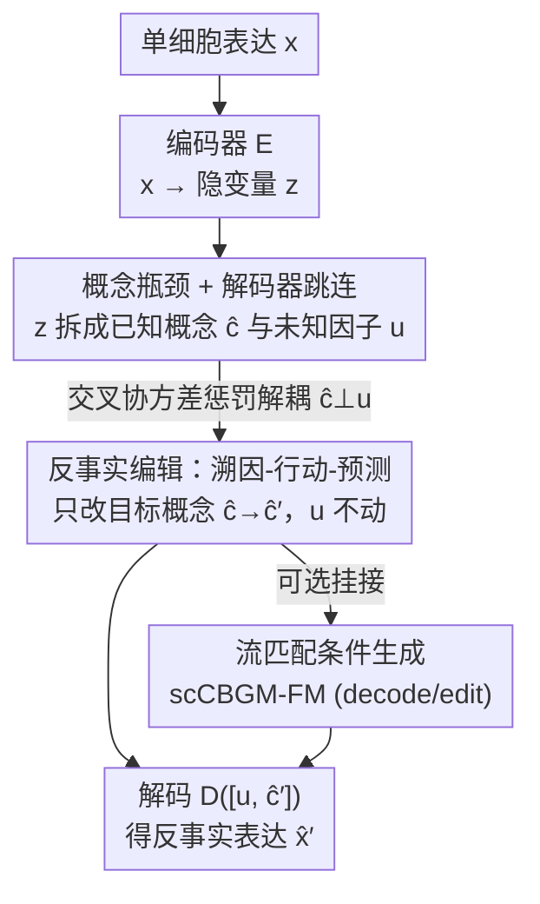

# scCBGM: Interpretable Single-Cell Counterfactual Editing

**会议**: ICML 2026  
**arXiv**: [2606.07760](https://arxiv.org/abs/2606.07760)  
**代码**: 无（论文未提供开源链接）  
**领域**: 计算生物学 / 单细胞 / 反事实生成  
**关键词**: 单细胞, 概念瓶颈, 反事实编辑, 流匹配, 可解释性

## 一句话总结
本文提出单细胞概念瓶颈生成模型 scCBGM，把"概念瓶颈"架构搬到单细胞 RNA 测序数据上，通过解码器跳连和交叉协方差解耦惩罚，实现对单个细胞做"如果改变某个生物概念会怎样"的可解释、可控反事实编辑，并能挂到流匹配模型上提升生成质量。

## 研究背景与动机
**领域现状**：单细胞 RNA 测序（scRNA-seq）能在细胞分辨率上刻画细胞状态、轨迹与疾病机制，但"细胞群 × 条件（药物、剂量、暴露）"的组合空间太大，不可能靠实验穷举。于是大家用计算模型来预测细胞在未见条件下的响应。

**现有痛点**：理想的"细胞编辑"模型需要同时满足两点——既能给出**单个细胞**的反事实（这个 T 细胞用了 anti-PD-1 会变成什么样），又能在**生物学可解释的概念**（基因程序、细胞类型、通路活性）上做干预，而不是操纵一堆不透明的隐变量。但现有方法各顾一头：早期方法（scGen、scVIDR 等）只建模条件分布、给出群体平均效应，拿不到单细胞反事实；较新的细胞级反事实方法又缺乏显式可解释控制；而现有可解释性方法只是"描述性"的——能解释相关性，却不能模拟或编辑细胞响应。

**核心矛盾**：编辑（editing）和条件生成（conditional generation）本质不同——后者问"给定条件下任意一个细胞长什么样"，前者问"这个特定细胞在改变条件后长什么样，其余一切不变"。要做到后者，必须保留细胞自身的身份（外生噪声 $U$），只改被干预的概念，这恰恰是条件生成模型做不到的。

**本文目标**：在单细胞这种高异质、强技术噪声、概念标注不可靠的模态上，实现细胞级、概念可控、身份保持的反事实编辑。

**切入角度**：作者借用 Pearl 的结构因果模型把细胞表达拆成"可观测概念 $C$ + 不可观测残差因子 $U$"，把编辑形式化为 abduction-action-prediction 三步反事实推理；并把概念瓶颈生成模型（CBGM）改造成适配单细胞的版本。

**核心 idea**：用概念瓶颈把可解释概念显式分离出来当"控制旋钮"，用解码器跳连和交叉协方差惩罚保证概念与残差因子解耦，从而对单个细胞做"只拧某个概念旋钮、其余不动"的反事实编辑。

## 方法详解

### 整体框架
scCBGM 是一个带概念瓶颈的编码器-解码器（VAE）生成模型。输入是单细胞基因表达 $\mathbf{x}\in\mathbb{R}^d$ 与一组 $K$ 个生物概念 $\mathbf{c}$（可二值如细胞类型/刺激状态，也可连续如药物剂量/通路活性分数）；输出是反事实表达 $\hat{\mathbf{x}}'$——同一个细胞在概念被改成 $\mathbf{c}'$ 后的样子。

编码器 $E(\cdot)$ 把 $\mathbf{x}$ 映成隐变量 $\mathbf{z}$，再分解成两部分：概念网络 $f_c$ 产出可解释的已知因子 $\hat{\mathbf{c}}=f_c(\mathbf{z})$，另一支 $f_u$ 产出未知因子 $\mathbf{u}=f_u(\mathbf{z})$（捕捉概念之外的变异，如批次、细胞身份）；两者拼接后送进解码器 $D(\cdot)$ 重建 $\mathbf{x}$。编辑时走 abduction-action-prediction：先编码拿到 $(\hat{\mathbf{c}},\mathbf{u})$，再只改要干预的概念维度得到 $\hat{\mathbf{c}}'$，最后解码 $[\mathbf{u},\hat{\mathbf{c}}']$ 得反事实。该框架还能进一步给流匹配（flow matching）模型当条件，兼顾可解释控制与高生成质量。

### 关键设计

**1. 概念瓶颈 + 解码器跳连：在噪声标注下维持持续概念条件**

单细胞数据的概念标注常常含噪（错标、无关、缺失、冗余），如果只在解码器输入端注入一次概念，下游层很容易"忘掉"或绕过它。本文一是改用标准概念瓶颈模型（CBM，瓶颈把输入映到与可解释概念一一对应的标量预测），而非原 CBGM 用的把每个概念映成高维表示的概念嵌入模型（CEM）；二是给解码器加跳连——在每一层 $\ell>1$ 都把上一层隐状态与已知概念 $\hat{\mathbf{c}}$ 拼起来再喂入：

$$\mathbf{h}_\ell = D_\ell\big([\mathbf{h}_{\ell-1},\,\hat{\mathbf{c}}]\big),\quad \hat{\mathbf{x}}=D_{\text{final}}(\mathbf{h}_L)$$

这样概念信号在整个解码路径上被反复强制条件化，比只在输入端注入一次显著更稳健，尤其在概念标注含噪时——消融显示这是抗噪的关键来源之一。

**2. 交叉协方差解耦惩罚：不限维度地把概念和残差因子拆开**

要保证编辑"只改概念、不动身份"，必须让已知概念 $C$ 与未知因子 $U$ 解耦，否则改概念会连带改身份。原 CBGM 用余弦相似度损失做正交，但它要求两个嵌入维度相同（$K=d_u$），在单细胞场景下很受限。本文改用交叉协方差惩罚：对一个大小为 $B$ 的 minibatch，惩罚预测概念 $\hat{C}\in\mathbb{R}^{B\times K}$ 与未知因子 $U\in\mathbb{R}^{B\times d_u}$ 之间经验交叉协方差的 Frobenius 范数平方：

$$\mathcal{L}_{\text{cc}}=\Big\|\tfrac{1}{B-1}(\hat{C}-\mathbf{1}\bm{\mu}_{\hat c}^\top)^\top(U-\mathbf{1}\bm{\mu}_u^\top)\Big\|_F^2$$

它允许 $K\neq d_u$（任意嵌入维度），并通过对 $U$ 加 ReLU、对 $\hat{C}$ 由概念损失隐式定标来避免"未知因子塌缩成近零值"的退化解。效果是把批次、细胞类型等非概念变异推进 $\mathbf{u}$，让 $\hat{\mathbf{c}}$ 只承载被监督的概念语义。整体训练目标在 $\beta$-VAE 的 ELBO（重建 + 概念监督 $\mathcal{L}_{\text{concept}}$ + KL）之上再加该惩罚：$\mathcal{L}=\mathcal{L}_{\text{VAE}}+\lambda_{\text{cc}}\mathcal{L}_{\text{cc}}$。其中概念损失对二值概念用 BCE、连续概念用 MSE，并用二值掩码 $\mathbf{m}$ 处理缺失标注。

**3. 溯因-行动-预测的反事实编辑：只拧目标旋钮、保住细胞身份**

本文把单细胞编辑严格落到 Pearl 的反事实三步上。给定一个观测细胞 $\mathbf{x}$，反事实编辑定义为后验期望

$$\mu_{\mathbf{x},\mathbf{c}'}:=\mathbb{E}_U\big[f_X(\mathbf{c}',U)\,\big|\,X=\mathbf{x}\big]$$

落到模型即三步：**溯因**——编码 $\mathbf{z}=E_\mu(\mathbf{x})$ 并分解出 $(\hat{\mathbf{c}},\mathbf{u})$，其中 $\mathbf{u}$ 锁住了细胞身份（外生因子）；**行动**——只对 $\hat{\mathbf{c}}$ 与目标 $\mathbf{c}'$ 不同的维度赋值（$\hat{\mathbf{c}}'_k\leftarrow\mathbf{c}'_k,\ \forall k:\mathbf{c}'_k\neq\mathbf{c}_k$），其余维度原封不动；**预测**——解码 $\hat{\mathbf{x}}'=D([\mathbf{u},\hat{\mathbf{c}}'])$。这正好对应"编辑 = 改条件、其余不变"的语义，与只看群体平均的条件生成形成对比。作者在附录给出了该估计器一致性的证明。

**4. 流匹配扩展：把可解释控制接到高质量生成器上**

scCBGM 本身可独立用，但其 VAE 解码生成质量有限。本文把训练好的 scCBGM 嵌入当条件，去训一个流匹配模型，学条件向量场 $v_\theta(\mathbf{x}_t,t;[\mathbf{u},\hat{\mathbf{c}}])$，从而把 SOTA 生成器的质量和概念瓶颈的可解释/可控性合到一起（扩散模型同理）。它支持两种反事实策略：**decode**——从噪声 $\mathbf{x}_0\sim\mathcal{N}(0,I)$ 出发、按编辑后概念 $\hat{\mathbf{c}}'$ 走条件流 $\hat{\mathbf{x}}'=\varphi_1(\mathbf{x}_0,[\mathbf{u},\hat{\mathbf{c}}'])$，适合多样化采样；**edit**——更精确，先用原概念 $\hat{\mathbf{c}}$ 把 $\mathbf{x}$ 反向映回噪声 $\mathbf{x}_0=\varphi_1^{-1}(\mathbf{x},[\mathbf{u},\hat{\mathbf{c}}])$（溯因），再用编辑后概念 $\hat{\mathbf{c}}'$ 正向解码（行动+预测），把 Pearl 三步直接搬进流匹配。

### 损失函数 / 训练策略
总目标为 $\mathcal{L}=\mathcal{L}_{\text{VAE}}+\lambda_{\text{cc}}\mathcal{L}_{\text{cc}}$，其中 $\mathcal{L}_{\text{VAE}}$ 含重建项、$\lambda_c\mathcal{L}_{\text{concept}}$ 概念监督项、$\beta$-KL 正则；$\mathcal{L}_{\text{concept}}$ 对二值/连续概念分别用 BCE/MSE 并按掩码归一化。流匹配版本另用条件流匹配损失 $\mathcal{L}_{\text{FM}}$ 训练向量场。

## 实验关键数据

### 主实验
在 Kang et al. (2017) PBMC 数据集（IFN-$\beta$ 刺激 vs 对照）上预测刺激响应，用 rMMD 比较（<1 表示优于"映射到最相似已有群体"的平凡基线，越低越好）。下表为各免疫细胞亚群 rMMD（节选代表性列）：

| 模型 | B cells | T cells (CD4) | T cells (CD8) | Dendritic | NK cells |
|------|---------|---------------|---------------|-----------|----------|
| scCBGM | 0.112 | 0.169 | 0.171 | 0.375 | 1.167 |
| scCBGM-FM (decode) | 0.106 | 0.162 | 0.138 | 0.288 | 0.093 |
| scCBGM-FM (edit) | **0.093** | **0.156** | **0.119** | **0.231** | 0.084 |
| CBGM (原版) | 0.902 | 2.228 | 1.914 | 1.503 | 1.270 |
| Vanilla-FM (edit) | 0.492 | 0.487 | 0.364 | 1.307 | 0.082 |
| biolord | 2.622 | 5.514 | 4.829 | 3.904 | 2.355 |
| CINEMA-OT | 2.259 | 7.042 | 5.362 | 1.367 | 3.707 |
| scGen | 1.830 | 5.117 | 4.748 | 1.133 | 2.436 |

scCBGM/scCBGM-FM 在 7 个实验中的 5 个上显著优于现有条件生成方法，且 scCBGM-FM (edit) 通常最佳。

### 消融实验
在三个合成数据集（5 类干预 × 2 seed × 多噪声设置）上消融三个组件——解码器类型（跳连 vs 直连）、概念头（CBM vs CEM）、正交损失（交叉协方差 vs 余弦）：

| 配置 | 结论 |
|------|------|
| CBM vs CEM | 在单细胞这类数据上概念瓶颈（CBM）优于概念嵌入（CEM） |
| + 交叉协方差损失 | 在 CBM 家族内进一步提升性能 |
| + 跳连解码器 | 仅当同时配齐交叉协方差损失与 CBM 时才增益 |

### 关键发现
- **三个组件存在协同效应**：跳连解码器并非单独有用，只有和交叉协方差损失 + 概念瓶颈一起上才生效，说明"持续概念条件 + 解耦"是配套的，单拆一个不灵。
- **流匹配扩展真正受益于结构化隐空间**：为验证 scCBGM-FM 的优势来自 scCBGM 的结构化隐空间而非流匹配本身，作者额外比了 CVAE-FM、biolord-FM，scCBGM-FM 仍领先，说明可解释概念瓶颈才是关键。
- **零样本组合泛化**：在 Kang 数据上把"被刺激的 Naive CD4 T 细胞"整类留出（训练时从未见），scCBGM 仍能从对照 Naive CD4 T 准确预测其刺激态，展示出明显优于 Vanilla-FM、CINEMA-OT 的零样本泛化。

## 亮点与洞察
- **把"编辑"和"条件生成"在因果语义上彻底分开**：用 $U$ 锁身份、只动概念维度，落实 Pearl 三步——这是它能做单细胞反事实而非群体平均的根本，思路可迁移到任何"保身份改属性"的可控生成任务。
- **交叉协方差惩罚解除维度约束**：相比余弦正交要求 $K=d_u$，Frobenius 范数版交叉协方差允许任意嵌入维度，还用 ReLU + 概念损失隐式定标防塌缩，是个轻量好用的解耦 trick。
- **自建带真值反事实的合成基准**：单细胞无法在同一细胞上重复测量，真值反事实天然缺失；作者用分层过散布 Poisson 过程把外生噪声与条件分离，造出可控的真值反事实，还能注入四类标注噪声，为该领域补上了严格评测的缺口。
- **概念瓶颈当"可解释控制层"挂到流匹配/扩散上**：把可解释性和 SOTA 生成质量解耦再组合，是个通用的"控制层 + 生成器"范式。

## 局限与展望
- **真实数据只能用代理指标**：真实数据无法控制外生噪声，作者只能把细胞亚型当作隐藏的 $U$、用 rMMD 这类群体级代理来近似反事实评测，细胞级精确度仍主要依赖合成数据验证，sim-to-real gap 未完全打消。
- **依赖概念标注质量与因果假设**：方法建立在"$U\perp U_C$、概念可被监督学出"的假设上，若关键概念缺失或标注系统性偏差，编辑可信度会下降。
- **部分亚群方差很大**：如 Monocytes (FCGR3A) 上各方法 rMMD 都偏高且方差大（scCBGM 1.845±1.776），说明在某些稀有/噪声大的亚群上编辑仍不稳。
- **改进方向**：把更多机制性先验（通路拓扑、剂量响应曲线）写进概念结构，以及在真实数据上发展更接近细胞级真值的评测协议。

## 相关工作与启发
- **vs 原始 CBGM (Ismail et al., 2023)**：原版用概念嵌入（CEM）+ 余弦正交，受维度约束且对噪声标注脆弱；本文换成标准 CBM + 解码器跳连 + 交叉协方差，专门解决单细胞高噪声、概念不可靠的问题。
- **vs biolord / scDisInFac (Piran/Zhang 2024)**：它们学解耦表示但假设因子相互独立、潜空间加性处理，在本文场景下不现实；scCBGM 不强加加性/独立假设，且显式支持概念级干预。
- **vs scGen / scVIDR (Lotfollahi/Kana)**：这类细胞编辑方法依赖强扰动机制假设（如潜空间加性效应），且不提供可解释表示；本文支持多样生物干预并给出可解释概念旋钮。
- **vs CINEMA-OT (Dong et al., 2023)**：它先把数据分成因果/伪因子再预测处理效应，但只能把细胞映到训练数据中已有的观测，泛化受限；scCBGM 能做零样本组合泛化。

## 评分
- 新颖性: ⭐⭐⭐⭐⭐ 首个把概念瓶颈 + Pearl 反事实落到单细胞编辑、并扩到流匹配的框架。
- 实验充分度: ⭐⭐⭐⭐ 合成真值 + 三个真实数据集 + 充分消融，但真实评测只能用代理指标。
- 写作质量: ⭐⭐⭐⭐ 因果形式化清晰、动机层层递进，公式与架构对应明确。
- 价值: ⭐⭐⭐⭐⭐ 为可解释、可控的单细胞反事实推理提供了可落地的范式与基准。

<!-- RELATED:START -->

## 相关论文

- [\[ICML 2026\] What Makes a Representation Good for Single-Cell Perturbation Prediction?](what_makes_a_representation_good_for_single-cell_perturbation_prediction.md)
- [\[AAAI 2026\] Gene Incremental Learning for Single-Cell Transcriptomics](../../AAAI2026/computational_biology/gene_incremental_learning_for_single-cell_transcriptomics.md)
- [\[ICML 2026\] Scalable Single-Cell Gene Expression Generation with Latent Diffusion Models](scalable_single-cell_gene_expression_generation_with_latent_diffusion_models.md)
- [\[ICLR 2026\] scDFM: Distributional Flow Matching for Robust Single-Cell Perturbation Prediction](../../ICLR2026/computational_biology/scdfm_distributional_flow_matching_model_for_robust_single-cell_perturbation_pre.md)
- [\[ICML 2026\] Towards Universal Gene Regulatory Network Inference: Unlocking Generalizable Regulatory Knowledge in Single-cell Foundation Models](towards_universal_gene_regulatory_network_inference_unlocking_generalizable_regu.md)

<!-- RELATED:END -->
