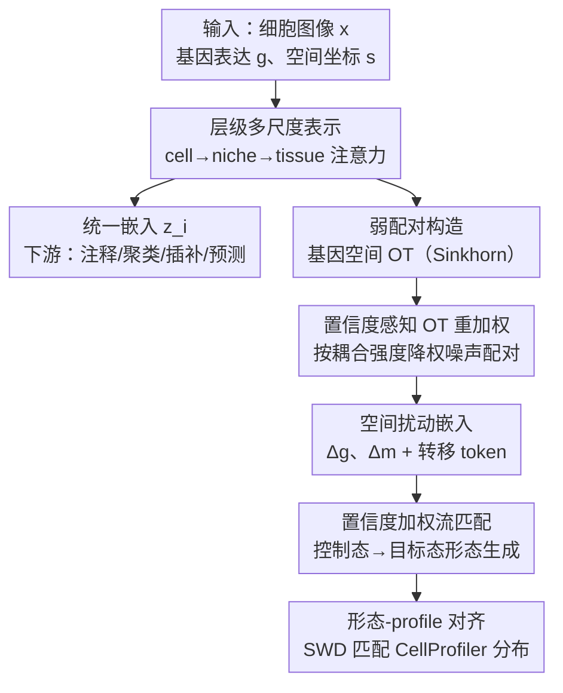

# SPATIA: Multimodal Generation and Prediction of Spatial Cell Phenotypes

**会议**: ICML2026  
**arXiv**: [2507.04704](https://arxiv.org/abs/2507.04704)  
**代码**: https://github.com/mims-harvard/SPATIA  
**领域**: 计算生物学 / 空间转录组 / 多模态生成  
**关键词**: 空间转录组、细胞表型、流匹配、最优传输、多尺度表示  

## 一句话总结
面向"细胞形态 + 基因表达 + 空间位置"三模态联合建模的空间转录组难题，SPATIA 用 **细胞→niche→组织** 的层级注意力学统一表示，并配一个**空间条件的形态生成模块**（弱配对 + 置信度感知的最优传输重加权 + 形态-profile 对齐流匹配），在 25.9M 细胞、12 个任务上同时刷新生成与预测 SOTA。

## 研究背景与动机
**领域现状**：基于图像的空间转录组（spatial transcriptomics, ST）技术能在保持组织完整的前提下，同时拿到细胞的**显微形态图像**和**基因表达谱**。理解细胞形态、基因表达、空间组织三者如何共同塑造组织功能，是建模健康/疾病细胞状态的核心问题。

**现有痛点**：现有方法几乎都"各管一摊"，无法在**细胞级分辨率**上把三个维度整合起来——单细胞模型（scGPT、Geneformer）忽略形态、或只看 spot 级相关性；病理模型（UNI、HIPT）擅长全切片但丢掉分子信息；视觉-语言模型依赖文本标注、空间定位与组合推理都弱；即便是新的多模态 ST 模型也只停在 **patch 分辨率**，没有细胞粒度。简单拼接（concatenation）则抓不住空间组学里非线性、依赖上下文的关系。

**核心矛盾**：这些缺陷可归为三点——(1) 抓不全细胞级的形态与表达变异（而这正是定义细胞身份的关键）；(2) 不建模跨尺度的空间交互（局部 niche 与全局组织如何共同支配生物过程）；(3) 无法预测**微环境依赖**的形态变化。尤其第三点：在破坏性的 ST 技术里，同一个细胞**没有"扰动前/后配对"观测**（测一次就毁了），无法像普通图像合成那样监督学习。

**本文目标**：分解为两个耦合的子问题——**统一表示学习**（学一个融合三模态、跨尺度的细胞嵌入 $\mathbf{z}_i=\mathcal{F}(x_i,\mathbf{g}_i,\mathbf{s}_i)$）和**空间条件生成**（在没有配对前后数据时，预测扰动后的目标形态）。

**核心 idea**：用**层级注意力**（cell→niche→tissue）解决多尺度统一表示；用**基因表达空间的最优传输**构造弱配对、再用**置信度感知的流匹配**把"扰动前→后"的形态迁移学出来——把"没有配对数据"这个死结，转化为"弱配对 + 不确定性重加权"的可学问题。

## 方法详解

### 整体框架
SPATIA 输入是空间转录组数据集 $\mathcal{D}=\{(x_i,\mathbf{g}_i,\mathbf{s}_i)\}$（细胞形态裁剪图 $x_i$、基因表达向量 $\mathbf{g}_i$、空间坐标 $\mathbf{s}_i$），同时服务两个目标：**表示**（输出统一嵌入 $\mathbf{z}_i$ 供注释/聚类/插补等下游任务）和**生成**（输出扰动后的目标形态 $x_{tgt}$）。整体分两大块：前半是 **层级表示学习**——细胞级用 cross-attention 融合形态 token 与基因 token，niche 级把邻近细胞聚成空间 patch 建模细胞间交互，tissue 级用全局 transformer 聚合捕捉长程依赖，三级嵌入再投影成 $\mathbf{z}_i$；后半是 **空间条件形态生成**——因为拿不到同一细胞的扰动前后配对，先用基因表达空间的最优传输（OT）构造控制-目标弱配对，再用置信度感知的流匹配学一个速度场，把控制态形态"流"向目标态，并用形态-profile 对齐保证生物保真。

### 关键设计

**1. 层级多尺度表示：cell→niche→tissue 三级注意力，把"细胞身份"和"空间上下文"同时保住**

针对"现有方法抓不住细胞级变异、又不建模跨尺度交互"的痛点，SPATIA 学三个层级的嵌入并融合：$\mathbf{z}_i=\mathcal{F}_{\text{fusion}}(\mathbf{z}_{cell},\mathbf{z}_{niche},\mathbf{z}_{tissue})$。细胞级用 ViT 编码图像得到 $\mathbf{X}_{cell}$、用预训练单细胞编码器得到基因 token $\mathbf{X}_{gene}$，再以视觉 token 为 query 做 cross-attention 融合：$\mathbf{z}_{cell}=\mathrm{Attn}(Q=\mathbf{X}_{cell},K=\mathbf{X}_{gene},V=\mathbf{X}_{gene})$，让单个细胞的形态与其自身表达对齐。niche 级把邻近细胞 pool 成 query $\mathbf{q}_{niche}$、与 niche 图像做 cross-attention 得 $\mathbf{z}_{niche}$，建模局部细胞间交互。tissue 级再聚合 niche 嵌入 + 位置编码，捕捉跨区域长程依赖。关键设计取舍是：**niche/tissue 只当"上下文信号"，不替代细胞级建模**——所有细胞级任务（注释、聚类）仍保留原始单细胞输入、用 cross-attention 而非线性聚合，因此能在引入空间上下文的同时保住细胞身份和形态-表达对应。

**2. 弱配对 + 置信度感知 OT 重加权：在没有"前后配对"时，用基因空间最优传输配对并按可靠度降权噪声**

破坏性 ST 拿不到同一细胞的扰动前后图像，SPATIA 于是构造**控制-目标弱配对** $(x_{ctrl},\mathbf{g}_{ctrl};x_{tgt},\mathbf{g}_{tgt})$，配对发生在生物相关细胞之间（同谱系或 niche 一致区域，如低恶性 vs 侵袭性上皮、免疫冷 vs 免疫热 T 细胞）。配对用**熵正则最优传输**在降维 PCA 表达空间上做、Sinkhorn 求解，得到耦合矩阵 $\mathbf{P}^*$。关键是 **OT 在基因表达空间而非图像空间做**，避免退化成平凡的形态匹配，空间邻近约束再进一步减少组织异质性带来的错配。但弱配对必然有噪声、错配会污染流匹配的端点位移监督 $\bm{\ell}_{tgt}-\bm{\ell}_{ctrl}$，所以作者用 **OT 耦合强度当可靠度信号**：对每个 $x_{ctrl}$ 定义置信度 $c(x_{ctrl})=\max_{x_{tgt}}\mathbf{P}^*(x_{ctrl},x_{tgt})$，再归一化成训练权重

$$w(x_{ctrl})=\frac{c(x_{ctrl})^\gamma}{\mathbb{E}_{x_{ctrl}}[c(x_{ctrl})^\gamma]},$$

$\gamma$ 控制对不确定配对的降权强度，归一化保证 batch 间损失尺度稳定。$w$ 只作用在 OT-正流匹配监督项上，让高置信配对对速度场贡献更大、模糊匹配影响更小，从而在弱监督下稳定流学习又保留弱配对样本的多样性。

**3. 置信度加权流匹配 + 空间扰动嵌入：把"控制态→目标态"建成条件生成，并显式编码分子与形态的转移**

形态生成被建成条件流匹配。给定控制图和 OT 匹配的目标，编码端点 $\bm{\ell}_{ctrl},\bm{\ell}_{tgt}$，定义真值速度 $\bm{u}=\bm{\ell}_{tgt}-\bm{\ell}_{ctrl}$，在线性桥 $\bm{\ell}_\lambda=(1-\lambda)\bm{\ell}_{ctrl}+\lambda\bm{\ell}_{tgt},\ \lambda\sim\mathcal{U}(0,1)$ 上训练条件速度场 $v_\theta(\bm{\ell}_\lambda,\lambda\mid\mathbf{z}_{cond})$，损失为置信度加权流匹配 $\mathcal{L}_{FM}^w=\mathbb{E}_\lambda[w\lVert v_\theta-\bm{u}\rVert_2^2]$。条件 $\mathbf{z}_{cond}$ 由两部分融合：实例特异的控制上下文 $\mathbf{z}_{ctrl}$，以及**空间扰动嵌入** $\mathbf{z}_{pert}$。后者把某转移类型 $\tau$（状态 A→B）的典型分子/形态偏移编码进来：基因偏移签名 $\Delta\mathbf{g}=\mathbb{E}[\mathbf{g}_{tgt}-\mathbf{g}_{ctrl}]$、形态偏移签名 $\Delta\mathbf{m}=\mathbb{E}[M(x_{tgt})-M(x_{ctrl})]$（$M$ 为 CellProfiler 形态特征），投影后与可学转移 token $\mathbf{z}_{trans}=\mathrm{Embed}(\tau)$ 拼接过 MLP 得 $\mathbf{z}_{pert}$。妙处在于 $\Delta\mathbf{m},\Delta\mathbf{g}$ 是**每个转移类型只算一次的群体级统计量**，推理时只需控制图 + 预计算的 $\mathbf{z}_{pert}$，**不用目标细胞的任何特征**，既避免目标泄漏又让条件显式带形态含义。此外加 **condition-contrastive 正则**：用错误转移 $\tau^-$ 构造负条件 $\mathbf{z}_{cond}^-$，用 margin 形式 $\mathcal{L}_{cond}=\mathbb{E}_\lambda[\lVert v_\theta(\cdot\mid\mathbf{z}_{cond})-\bm{u}\rVert^2-\lVert v_\theta(\cdot\mid\mathbf{z}_{cond}^-)-\bm{u}\rVert^2]_+$ 强制"正确条件比错误条件更能解释真值速度"，提升转移可辨识性。

**4. 形态-profile 对齐：在评测同款特征空间上对齐生成与真实分布，保证生物保真而非只像**

弱 OT 配对监督有噪声，生成器即便条件对了也可能匹配不上目标形态分布。SPATIA 因此在**评测用的同一形态特征空间**做分布对齐：取冻结的形态编码器 $\phi(\cdot)$（预训练去回归 CellProfiler 特征），每个 batch 构造生成分布 $\mathcal{D}_{gen}=\{\phi(\hat{x}_{tgt})\}$ 与真实分布 $\mathcal{D}_{real}=\{\phi(x_{tgt})\}$，用**切片 Wasserstein 距离**对齐 $\mathcal{L}_{morph}=\mathrm{SWD}(\mathcal{D}_{gen},\mathcal{D}_{real})$。用分布级目标（而非像素级配对）是因为弱 OT 下严格像素配对不可靠。这一项把"生成图看着真"升级成"生成图在诊断性形态特征上也对"，是图像保真之外的生物保真保证。

### 损失函数 / 训练策略
预训练阶段用基于重建的自监督：统一细胞嵌入要重建输入细胞图 + 对应基因表达谱，并强制图像派生与表达派生表示的跨模态一致，使嵌入在某模态噪声/缺失时仍有信息。生成阶段总损失为

$$\mathcal{L}=\mathcal{L}_{FM}^w+\rho\,\mathcal{L}_{cond}+\lambda_{morph}\mathcal{L}_{morph}.$$

训练用 4 张 H100、25K 步，配层级 batching 策略控显存；评测一律 donor-disjoint 70/10/20 划分，保证同一供体的形态/表达/空间上下文不跨 train/test 泄漏。

## 实验关键数据

### 数据与设定
自建 **MIST**（Multi-scale dataset for Image-based ST）：来自 74 个数据源、17 种组织、60 位供体、4 个平台，三级嵌套——MIST-C（25.9M 细胞-基因对）、MIST-N（2M niche-基因对）、MIST-T（20K 组织-基因条目）。对比 18 个模型、覆盖 12 个任务（生成、注释、聚类、基因插补、跨模态预测等）。整体声称生成保真度提升 8%、预测精度最多提升 3%。

### 主实验：条件形态生成（逐步加组件）

| 方法 | FID↓ | KID↓ | Wass.Corr↑ | KS↑ |
|------|------|------|------------|-----|
| CellFlux | 64.1 | 2.31 | 0.83 | 0.57 |
| MorphDiff | 70.5 | 2.52 | 0.81 | 0.54 |
| GeneFlow | 62.4 | 2.20 | 0.87 | 0.58 |
| SPATIA (base) | 59.5 | 2.09 | 0.90 | 0.61 |
| + Reweight | 59.1 | 2.06 | 0.91 | 0.62 |
| **+ Morph. Loss** | **58.5** | **2.01** | **0.94** | **0.65** |

图像保真（FID/KID）与生物形态正确性（CellProfiler 特征上的 Wasserstein 相关 / KS 统计量）双轴评测：SPATIA 全面优于三个生成 baseline，且**置信度重加权**和**形态对齐**逐步加上去都在涨——形态对齐对"生物保真"指标（Wass.Corr 0.90→0.94、KS 0.61→0.65）提升最明显。

### 跨平台聚类（批次效应）

| 模型 | Xenium ARI↑ | Xenium NMI↑ | CosMx ARI↑ | CosMx NMI↑ |
|------|-------------|-------------|------------|------------|
| scGPT | 0.730 | 0.678 | 0.507 | 0.472 |
| scFoundation | 0.727 | 0.754 | 0.530 | 0.560 |
| UCE | 0.618 | 0.718 | 0.516 | 0.555 |
| **SPATIA** | **0.735** | **0.806** | **0.542** | 0.490 |

在 Xenium / CosMx 两个不同平台上冻结嵌入做聚类，SPATIA 多数指标领先（尤其 Xenium NMI 0.806 大幅领先），说明其多模态表示更能跨采集技术保住生物结构、缓解批次效应；作者归因于 scPRINT 预训练里的层级分类损失 + 对抗训练（fine-tune 时保留以强制批次不变）。

### 关键发现
- **形态-profile 对齐贡献最大**：消融里它把生物保真指标拉得最多，印证"看着真"≠"生物上对"，需要在诊断特征空间显式对齐。
- **置信度重加权稳住弱监督**：单加 reweight 已让所有生成指标小幅但一致地变好，说明降权噪声 OT 配对确有效。
- **层级表示带来跨平台鲁棒性**：在异构平台上的聚类优势体现统一多尺度嵌入的可迁移性。
- 在生物标志物状态预测（BCNB 上 ER/PR/HER2）等预测任务上 SPATIA 也与 UNI/GigaPath 等强病理模型竞争。

## 亮点与洞察
- **把"没有配对前后数据"这个死结化解为弱配对 + 不确定性重加权**：基因空间 OT 配对 + 置信度加权流匹配，是本文最可迁移的范式——任何"破坏性测量、只有群体而无个体配对"的生成问题都可借鉴。
- **群体级转移签名做条件、推理零目标泄漏**：$\Delta\mathbf{g},\Delta\mathbf{m}$ 每个转移只算一次，推理只需控制态，既干净又显式带形态语义。
- **在评测特征空间内做训练对齐**：用 CellProfiler 特征上的 SWD 当 loss，直接把"评测想要的生物保真"写进训练目标，避免生成器只优化视觉真实度。
- **niche/tissue 只当上下文不替代细胞级**：这个克制的设计取舍保住了细胞身份，是它能同时在细胞级任务和组织级任务上都强的关键。

## 局限与展望
- **OT 弱配对的根本假设**：配对质量依赖"同谱系/niche 一致"约束和基因空间 OT，若转移轴本身定义不清或谱系标注有误，置信度重加权也救不回系统性错配。
- **群体级签名抹平个体差异**：$\Delta\mathbf{m},\Delta\mathbf{g}$ 是转移类型的平均偏移，对同一转移内异质性较大的细胞可能欠拟合。
- **生成评测仍偏两条转移轴**（DCIS→侵袭、免疫冷→热），更广的扰动类型与组织上的泛化有待验证。
- **重计算资源**：4×H100、25.9M 细胞 + LMDB 序列化，复现门槛高；niche/tissue 的 patch 尺寸（256×256）等也可能影响跨数据集迁移。
- CosMx 上 NMI 略低于 scFoundation，说明跨平台一致性并非全指标领先。

## 相关工作与启发
- **vs 单细胞模型（scGPT / Geneformer / scFoundation）**：它们忽略形态或只在 spot 级建模；SPATIA 在细胞级把形态图像与表达 cross-attention 融合，并叠加 niche/tissue 空间上下文。
- **vs 病理模型（UNI / HIPT / GigaPath）**：擅长全切片视觉但丢分子信息；SPATIA 把分子与形态在多尺度统一，且能做条件生成。
- **vs 生成 baseline（CellFlux / MorphDiff / GeneFlow）**：它们各用控制图/扰动转录组/基因嵌入条件做形态预测，但缺少弱配对的置信度处理与形态-profile 对齐；SPATIA 在 FID/KID 与生物保真两轴都更优。

## 评分
- 新颖性: ⭐⭐⭐⭐⭐ 层级多尺度表示 + 置信度感知 OT 流匹配，系统解决"细胞级三模态 + 无配对生成"
- 实验充分度: ⭐⭐⭐⭐⭐ 25.9M 细胞、18 模型、12 任务，生成/预测/跨平台全覆盖，消融清晰
- 写作质量: ⭐⭐⭐⭐ 方法链条完整、公式与动机对得上，组件略多需细读
- 价值: ⭐⭐⭐⭐⭐ 大规模数据集 + 可迁移的弱配对生成范式，对空间组学与扰动建模有实打实推动

<!-- RELATED:START -->

## 相关论文

- [\[ICML 2026\] What Makes a Representation Good for Single-Cell Perturbation Prediction?](what_makes_a_representation_good_for_single-cell_perturbation_prediction.md)
- [\[CVPR 2026\] HyperST: Hierarchical Hyperbolic Learning for Spatial Transcriptomics Prediction](../../CVPR2026/computational_biology/hyperst_hierarchical_hyperbolic_learning_for_spatial_transcriptomics_prediction.md)
- [\[CVPR 2026\] HINGE: Adapting a Pre-trained Single-Cell Foundation Model to Spatial Gene Expression Generation from Histology Images](../../CVPR2026/computational_biology/adapting_a_pre-trained_single-cell_foundation_model_to_spatial_gene_expression_g.md)
- [\[AAAI 2026\] SpaCRD: Multimodal Deep Fusion of Histology and Spatial Transcriptomics for Cancer Region Detection](../../AAAI2026/computational_biology/spacrd_multimodal_deep_fusion_of_histology_and_spatial_transcriptomics_for_cance.md)
- [\[ICML 2026\] Scalable Single-Cell Gene Expression Generation with Latent Diffusion Models](scalable_single-cell_gene_expression_generation_with_latent_diffusion_models.md)

<!-- RELATED:END -->
