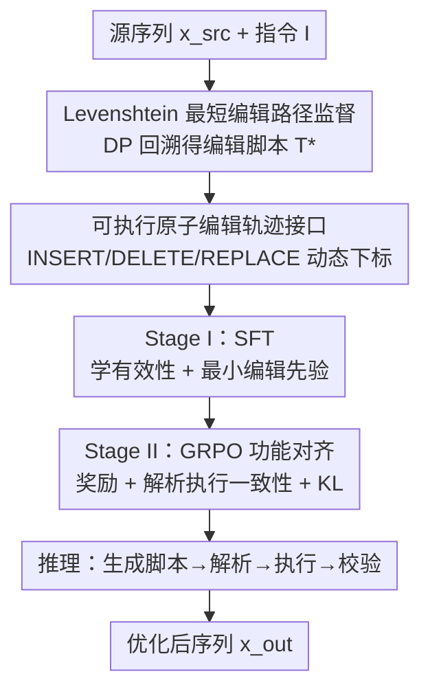

# STRIDE: Post-Training LLMs to Reason and Refine Bio-Sequences via Edit Trajectories

**会议**: ICML2026  
**arXiv**: [2603.03573](https://arxiv.org/abs/2603.03573)  
**代码**: https://github.com/daiheng-zhang/STRIDE  
**领域**: 计算生物学  
**关键词**: 生物序列优化, 编辑轨迹, 后训练, GRPO, 蛋白质/分子设计

## 一句话总结
STRIDE 把"优化蛋白质/分子序列"重新表述成"在编辑空间里做轨迹规划"：训练一个 LLM 显式吐出可执行的 INSERT/DELETE/REPLACE 原子编辑脚本，先用 Levenshtein 最短编辑路径做 SFT、再用 GRPO 类强化学习对齐任务奖励，从而在变长、带语法约束的离散序列优化上，把蛋白质全动作压力测试的成功率从 42% 拉到 89%、新颖性从 47% 拉到 97%。

## 研究背景与动机
**领域现状**：蛋白质和小分子的设计优化是计算生物学的核心，多数现实场景不是从零生成（de novo），而是**目标导向的精修**——从一个已可用的前体出发，在巨大的离散空间里加少量编辑，既要提升目标性质（如荧光、成药性），又要满足氨基酸约束、SMILES 语法这类硬约束。

**现有痛点**：两条主流范式各有硬伤。**离散扩散模型**支持迭代精修、去噪式逐步改进，但它没有暴露一个"可控的离散编辑接口"——尤其涉及插入/删除时要靠专门的转移参数化和采样过程，难以在每个中间步强制满足领域有效性，编辑也不直观、不可直接控制，而且大多只能定长生成。**自回归 LLM** 原生就在离散 token 上工作、能生成结构化序列，但拿来做优化时解码是**短视的**：局部看着合理的编辑，未必能在紧编辑预算下走通崎岖适应度地形所需的长程规划。

**核心矛盾**：精修任务要的是"既迭代多步、又可控可执行、还能变长"的编辑接口；扩散给了迭代但不可控离散编辑，LLM 给了离散 token 但短视。两者都缺"显式、可验证、变长的编辑策略"。

**本文目标**：让模型直接输出一串可执行的原子编辑（INSERT/DELETE/REPLACE），把每一步都做成透明、可解析、可执行、可校验的程序；并通过后训练让这些轨迹既保持有效性、又对齐下游任务奖励。

**切入角度**：与其学一个单独的随机转移过程，不如训练 LLM 把编辑当成"在编辑空间里的轨迹规划"。用 Levenshtein 对齐得到的最短编辑路径作为保守的结构先验，把模型偏向"局部、最小改动"而非全局重写。

**核心 idea**：用"可执行编辑轨迹"作为统一的控制接口，配合"SFT 学有效最小编辑 + GRPO 对齐任务奖励"的两阶段后训练，把离散序列优化变成可规划、可验证的编辑过程。

## 方法详解

### 整体框架
STRIDE（Sequence Trajectory Refinement via Iterative Discrete Editing）的输入是一个源序列 $x_{\mathrm{src}}$（野生型蛋白或初始分子）加一条指令 $I$，输出是优化后的序列 $x_{\mathrm{out}}$；中间产物是一段被 `<edit_traj>...</edit_traj>` 包裹的原子编辑脚本。整条管线分两步走：**数据侧**先用 Levenshtein 动态规划把"源→目标"配对回溯成最短编辑脚本作为监督信号；**训练侧**先做 SFT 让模型学会"输出有效且最小的编辑轨迹 + 最终序列"，再用 GRPO 类强化学习把轨迹对齐到任务奖励、并用 KL 锚回 SFT 策略防止退化。推理时，策略生成一段编辑脚本，经解析→在 $x_{\mathrm{src}}$ 上顺序执行→校验后产出最终序列。

### 关键设计

**1. 可执行原子编辑轨迹接口：把"怎么改"做成一段能跑的程序**

针对"扩散不可控、LLM 输出不可验证"的痛点。STRIDE 把编辑轨迹定义成作用在演化序列上的可执行程序：在第 $t$ 步，动作 $a_t = (op_t, p_t, v_t)$ 作用于当前长度为 $L_{t-1}$ 的序列 $x_{t-1}$，**位置是 0-based 且永远相对当前序列 $x_{t-1}$ 解释（不是相对初始 $x_{\mathrm{src}}$）**。具体地：$\text{INSERT}(p,v)$ 在位置 $p$ 前插入 token $v$（$p=L_{t-1}$ 时追加到末尾）；$\text{DELETE}(p)$ 删掉 $x_{t-1}[p]$；$\text{REPLACE}(p,v)$ 令 $x_{t-1}[p]\leftarrow v$。因为每次操作后下标都重新评估，整段脚本顺序执行时无歧义。序列化格式为 $(x_{\mathrm{src}}, I)\to\langle\text{edit\_traj}\rangle T^\star\langle/\text{edit\_traj}\rangle\to x_{\mathrm{tgt}}$。这个接口天然支持变长、索引一致的编辑，且每步可解析、可执行、可校验——把"不可控的离散编辑"变成了透明可审计的程序。

**2. Levenshtein 最短编辑路径监督：用确定性 DP 回溯造出"最小改动"教材**

针对"哪里来高质量编辑轨迹做监督"。给定源 $x_{\mathrm{src}}$ 和目标 $x_{\mathrm{tgt}}$，先在单位代价 INSERT/DELETE/REPLACE 下求最小代价编辑脚本 $T^\star$。计算 Levenshtein DP 表 $D\in\mathbb{Z}_{\geq 0}^{(m+1)\times(n+1)}$，边界 $D[i,0]=i$、$D[0,j]=j$，递推

$$D[i,j]=\min\{\,D[i-1,j]+1,\;D[i,j-1]+1,\;D[i-1,j-1]+\mathbb{I}[x^{\mathrm{src}}_i\neq x^{\mathrm{tgt}}_j]\,\}.$$

从 $(m,n)$ 回溯得最小代价对齐路径，再在 $x_{\mathrm{src}}$ 的可变副本上**前向重放**对齐步骤、用游标维护当前序列，使发出的下标始终指向当前状态（呼应设计 1 的动态下标）；回溯遇到多个前驱并列时按固定优先级确定性打破平局以保证可复现。需注意：端点是合法序列，但最短路径上的中间串不保证满足领域有效性（如 SMILES 良构），故脚本只作过程监督、有效性只在最终输出上评估。这一确定性流水线把每对样本变成索引对齐的编辑脚本，给模型注入了"最小改动、偏有效"的先验。

**3. Stage I — SFT：先学会写出有效且最小的编辑**

针对"模型起步要先会写合法、不啰嗦的编辑"。对每个训练对 $(x_{\mathrm{src}}, x_{\mathrm{tgt}})$ 和指令 $I$，用设计 2 得到最短脚本 $T^\star$，构造提示 $q=(x_{\mathrm{src}}, I)$ 和补全 $y=[\langle\text{edit\_traj}\rangle T^\star\langle/\text{edit\_traj}\rangle; x_{\mathrm{tgt}}]$——即让模型**先吐编辑轨迹、再吐最终目标序列**。用标准 teacher-forcing 最小化负对数似然

$$\mathcal{L}_{\mathrm{SFT}}(\theta)=-\mathbb{E}_{(q,y)\sim\mathcal{D}}\sum_{t=1}^{|y|}\log\pi_\theta(y_t\mid q, y_{<t}).$$

同时监督过程（$T^\star$）和结果（$x_{\mathrm{tgt}}$）带来两个归纳偏置：**有效性偏置**——训练目标都是合法端点（蛋白/SMILES），模型学到隐式的"产出合法序列"先验，无需受限解码（有效性用 RDKit 等事后判定）；**最小编辑偏置**——因为 $T^\star$ 是单位代价最短脚本，模型被引导生成简洁非冗余的轨迹。所得策略记为 $\pi_{\mathrm{ref}}$，作为 Stage II 的 KL 参考。

**4. Stage II — GRPO 功能对齐：把编辑轨迹拉向任务奖励，并卡死"说到做到"**

针对"SFT 只会模仿最短路径、不一定优化目标性质"。Stage II 用 GRPO 类策略优化在最大化任务奖励的同时 KL 正则回 $\pi_{\mathrm{ref}}$。对每个提示采样一组 $G$ 个补全 $\{o_i\}$，算组归一化优势 $A_i=\frac{r_i-\mu_r}{\sigma_r+\epsilon}$（$\mu_r,\sigma_r$ 为组内奖励均值与标准差），因奖励是结果级（定义在最终序列上）故组内同一 $o_i$ 所有 token 共享 $A_i$；目标为带 KL 的 PPO 式裁剪代理

$$J_{\mathrm{GRPO}}(\theta)=\mathbb{E}\Big[\tfrac{1}{G}\sum_i\tfrac{1}{|o_i|}\sum_t\min(\rho_{i,t}A_i,\ \mathrm{clip}(\rho_{i,t},1-\varepsilon,1+\varepsilon)A_i)-\beta D_{\mathrm{KL}}(\pi_\theta\|\pi_{\mathrm{ref}})\Big].$$

**关键卡点是"解析-执行一致性"**：若轨迹 $T$ 不可解析/执行，或在 $x_{\mathrm{src}}$ 上执行 $T$ 重放不出 $x_{\mathrm{out}}$，则直接置 $r=0$——逼模型真的"说到做到"，不能嘴上一套脚本、手上另给答案。奖励按任务设计：蛋白用编辑预算 + 改善指示 $R_{\mathrm{protein}}=\mathbb{I}[1\leq d\leq 3]+\mathbb{I}[f_{\mathrm{fl}}(x_{\mathrm{out}})>f_{\mathrm{fl}}(x_{\mathrm{src}})]$；分子用 $R_{\mathrm{mol}}=(\mathbb{I}_{\mathrm{valid}}\cdot R_{\mathrm{prop}}\cdot R_{\mathrm{sim}})+R_{\mathrm{stable}}$，其中 $R_{\mathrm{prop}},R_{\mathrm{sim}}\in\{0,0.5,1\}$ 分别管目标性质达标与 Tanimoto 结构保持、$R_{\mathrm{stable}}\leq 0$ 惩罚非目标性质漂移。论文还在同一奖励与一致性框架下评测了 GRPO 的两个变体 GSPO（把重要性采样从 token 级移到序列级、降长轨迹方差）和 CISPO（直接裁剪重要性权重而非策略比），只换裁剪/加权机制。

### 一个完整示例
以分子优化为例（论文 Table 1）：用户输入 SMILES `CC(=O)Nc1cc(NC(=O)N[C@@H](CCO)c2cccs2)ccc1C` 并要求"更像药物、且与输入相似"。模型先生成编辑轨迹 `<edit_traj> DELETE(21) REPLACE(31,2) INSERT(7,=) DELETE(11) INSERT(8,C) ... </edit_traj>`，每个下标都相对**当前序列**解释；解析器顺序执行这串原子操作，得到最终输出 SMILES `CC(=O)N=Cc1ccc(C=NC(=O)N[C@@H](CCO)c2cccs2)cc1`。RL 阶段会校验"执行这串脚本能否重放出该输出"，不一致则奖励归零——这保证了轨迹与结果的可追溯一致。

## 实验关键数据

### 主实验
**蛋白质（GFP 荧光，全动作压力测试，Table 3）**：从同一源序列各采 $N=100$ 个候选，报告成功数/唯一改善数/新颖数（因荧光 oracle 主要在替换数据上训练，全动作结果读作"基于 oracle 的可控性压力测试"）。

| 方法 | Success | Unique | Novelty |
|------|---------|--------|---------|
| Random Perturbation | 5/100 | 5/5 | 3/5 |
| Zero-Shot | 54/100 | 8/54 | 4/8 |
| Edit Flow | 79/100 | 51/79 | 13/51 |
| Vanilla SFT | 42/100 | 30/42 | 14/30 |
| **STRIDE** | **89/100** | **78/89** | **76/78** |

STRIDE 把成功率从 Vanilla SFT 的 42% 抬到 89%，新颖性 14/30（≈47%）→76/78（≈97%）；相比同样支持变长的 Edit Flow（成功 79 但新颖仅 13/51），STRIDE 在保持高成功率的同时新颖性碾压，说明显式编辑轨迹在组合性更强的变长编辑里尤其值钱。

**分子（DrugAssist 14 条件 ×500 分子，Table 2 总览）**：

| 指标 | STRIDE-SFT | STRIDE-GSPO |
|------|-----------|-------------|
| Valid ↑ | 0.750 | **0.909** |
| Success (Strict) ↑ | 0.579 | **0.676** |
| Success (Loose) ↑ | 0.684 | **0.782** |
| Shift Rate ↓ | 0.983 | **0.755** |
| Shift Avg ↓ | 2.629 | **2.001** |

GSPO 对齐版相比仅 SFT 版在有效性、严格成功率、可控性（更低的非目标漂移）上全面提升，验证了 Stage II 强化对齐的价值。

### 消融与归因

| 配置 | 关键结论 |
|------|---------|
| 直接生成最终序列（无轨迹） | 新颖性基线（GFP replace-only：Novelty 23） |
| 仅结构化编辑 token（无自由文本理由） | 新颖性 23→40，增益来自可执行编辑接口而非更长文本 |
| 完整 STRIDE | 在 GFP replace-only 上综合权衡最佳；AAV 全动作三项指标均第一 |

### 关键发现
- **可执行编辑接口才是增益来源**：归因消融显示，光是"结构化编辑 token"就把新颖性从 23 提到 40，说明涨点来自显式可执行的编辑轨迹接口，而非多吐了一段自由形式的推理理由。
- **变长越难，优势越大**：replace-only 下各法成功率接近，但切到全动作（含插入删除）后 Vanilla SFT 骤降到 42/100，STRIDE 仍稳在 89/100——编辑空间越组合化，显式轨迹越关键。
- **跨蛋白可迁移**：同一套配方迁到 AAV 衣壳全动作设置仍三项第一，说明编辑接口泛化到不同蛋白地形，而非过拟合 GFP 的 oracle 伪影。
- **RL 提可控性**：分子上 GSPO 把 Shift Rate 从 0.983 降到 0.755，在涨成功率的同时压住了非目标性质漂移。

## 亮点与洞察
- **把优化重述为编辑空间的轨迹规划**：不学单独的随机转移过程，而是让 LLM 直接吐可执行原子编辑——既保留扩散式迭代精修的味道，又拿回了 LLM 的离散 token 先验和可控性。
- **"解析-执行一致性"奖励门是点睛之笔**：执行脚本重放不出声称的输出就奖励归零，从机制上杜绝了"轨迹与结果对不上"的奖励黑客，让可解释性不只是摆设而是被强约束。
- **动态下标设计**：位置永远相对当前序列、每步重评估，使变长编辑脚本顺序执行无歧义——这套"程序化编辑"接口可迁移到任何需要"模型给出可审计修改步骤"的结构化生成任务（如代码补丁、文本改写）。

## 局限与展望
- **依赖 oracle/打分器**：蛋白全动作结果被作者明确标注为"基于 oracle 的可控性压力测试"而非真实荧光测量，因为荧光预测器主要在替换数据上训练，全动作下的绝对数值需谨慎解读。
- **最短路径监督的偏置**：以 Levenshtein 最短脚本为先验会偏向最小改动，对需要大幅重构的优化目标可能保守；且中间串不保证领域有效，只能事后校验最终输出。
- **奖励设计依赖人工阈值**：分子奖励里 $R_{\mathrm{prop}}/R_{\mathrm{sim}}$ 的离散档位、各性质阈值 $\tau_p$、蛋白编辑预算 $1\leq d\leq 3$ 都是手设，迁到新任务需重新校准。
- **合成 indel 增强**：变长能力部分靠对 $x_{\mathrm{src}}$ 随机施加 1–3 个原子编辑并用固定预测器打伪标签来获得，伪标签质量会影响上限。

## 相关工作与启发
- **vs 离散扩散（EvoDiff / DPLM）**：扩散靠去噪做迭代精修但不暴露显式可执行编辑策略、且多为定长；STRIDE 在 GFP replace-only 上成功率（61/100）高于 EvoDiff（47/100），并在变长全动作下保持高成功+高新颖。
- **vs Edit Flow**：Edit Flow 用 CTMC 显式建模插入/删除/替换、原生支持变长，但全动作下新颖性低（13/51）；STRIDE 以 LLM 生成可验证轨迹，兼顾成功率与新颖性（76/78）。
- **vs Vanilla SFT / Vanilla GSPO（直接生成，无轨迹）**：直接预测目标序列的消融隔离出"显式轨迹监督"的贡献——去掉轨迹后变长全动作成功率从 89 掉到 42。
- **vs PepThink-R1 / Mol-R1（推理迹后训练）**：这些工作用自由文本 CoT 理由提升可解释性；STRIDE 的归因实验表明，增益主要来自"可执行编辑接口"本身，而非更长的自然语言理由。

## 评分
- 新颖性: ⭐⭐⭐⭐⭐ 把生物序列优化重述为可执行编辑轨迹规划，并用一致性奖励门约束，框架新颖
- 实验充分度: ⭐⭐⭐⭐ 蛋白(GFP/AAV)+分子(14 条件)双域、含归因消融与跨蛋白迁移；oracle 压力测试性质需谨慎读
- 写作质量: ⭐⭐⭐⭐ 动机—接口—两阶段训练—奖励设计层层递进，公式与示例清晰
- 价值: ⭐⭐⭐⭐⭐ 提供可控、可验证、可变长的离散序列优化接口，对蛋白/分子工程有直接落地潜力

<!-- RELATED:START -->

## 相关论文

- [\[ICLR 2026\] Protein as a Second Language for LLMs](../../ICLR2026/computational_biology/protein_as_a_second_language_for_llms.md)
- [\[ICLR 2026\] Thompson Sampling via Fine-Tuning of LLMs](../../ICLR2026/computational_biology/thompson_sampling_via_fine-tuning_of_llms.md)
- [\[ICLR 2026\] EvoFlows: Evolutionary Edit-Based Flow-Matching for Protein Engineering](../../ICLR2026/computational_biology/evoflows_evolutionary_edit-based_flow-matching_for_protein_engineering.md)
- [\[ICML 2026\] Active Timepoint Selection for Learning Measure-Valued Trajectories](active_timepoint_selection_for_learning_measure-valued_trajectories.md)
- [\[NeurIPS 2025\] Post Hoc Regression Refinement via Pairwise Rankings](../../NeurIPS2025/computational_biology/post_hoc_regression_refinement_via_pairwise_rankings.md)

<!-- RELATED:END -->
