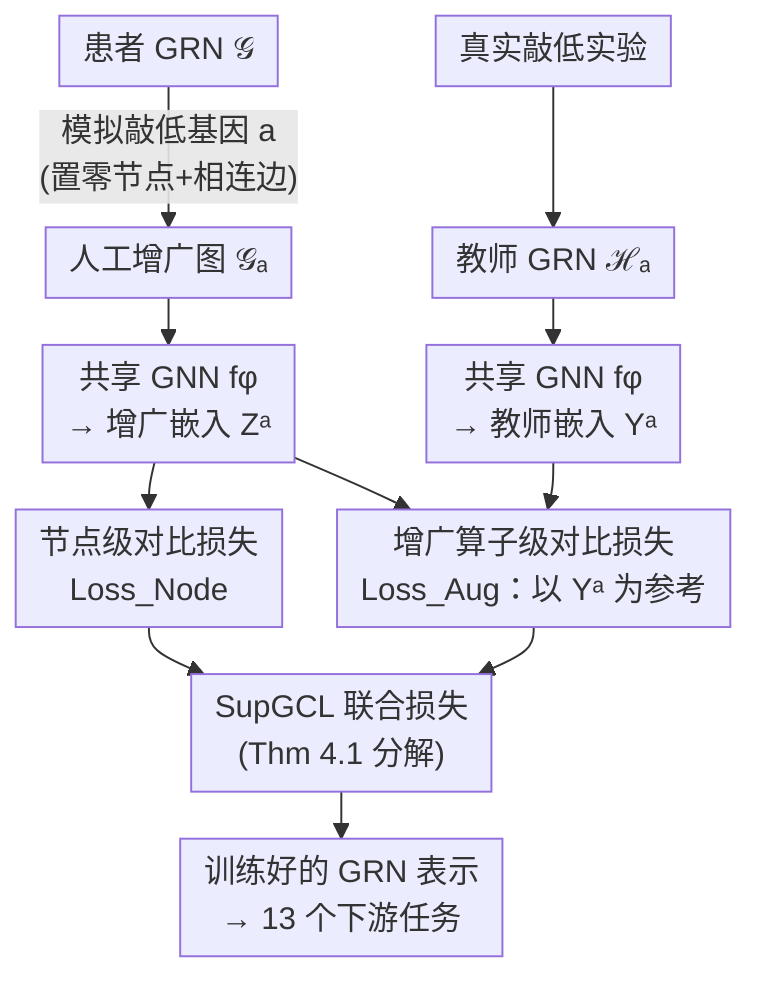

# Supervised Graph Contrastive Learning for Gene Regulatory Networks

**会议**: ICML2026  
**arXiv**: [2505.17786](https://arxiv.org/abs/2505.17786)  
**代码**: https://github.com/shobioinfo/SupGCL （数据集见 Zenodo 15496012）  
**领域**: 计算生物学 / 图对比学习 / 表示学习  
**关键词**: 基因调控网络, 图对比学习, 基因敲低, 监督增广, 癌症亚型

## 一句话总结
把"基因敲低实验"当作监督信号喂给图对比学习，让基因调控网络（GRN）的图增广不再依赖随机扰动而是基于真实生物扰动，在三种癌症的患者特异 GRN 上拿到更清晰的疾病亚型聚类，并在 13 个下游任务上稳定超过现有图表示学习基线。

## 研究背景与动机

**领域现状**：图表示学习被广泛用于分析基因调控网络（GRN）——节点是基因、边是调控关系。其中图对比学习（GCL）是主力自监督范式，它对同一张图做数据增广得到两个视图，再最大化对应节点表示的相似度。

**现有痛点**：GCL 在 GRN 上的常规增广（随机删点、删边）会破坏网络结构，尤其可能删掉"主调控因子"（master regulator）这类关键节点，导致学到的表示偏离生物学事实。为了规避这个问题，近期出现一股"免增广"（augmentation-free）潮流（BGRL、SGRL 等），改去扰动模型参数而不动图结构。

**核心矛盾**：免增广路线把"结构变化"一律当成要躲开的麻烦，于是连带也放弃了一个宝贵机会——真实生物实验（如基因敲低）本身就会产生结构变化，而这些变化不是噪声，是携带调控因果信息的富矿。高通量测序让敲低数据变得容易拿到，却没人把它用进对比学习。

**本文目标**：让 GCL 的"增广扰动"直接对齐真实的基因敲低扰动，把后者当成显式监督，从而学到生物学上站得住脚的 GRN 表示。

**切入角度**：基因敲低实验里，抑制某个基因会引发可观测的扰动，得到一张"变化后的 GRN"。如果把这张真实变化后的网络当作"教师"，去约束人工增广该往哪个方向变，就能既保留对比学习的好处、又注入生物先验。

**核心 idea**：用真实敲低得到的教师 GRN 作监督，提出 SupGCL（监督式图对比学习）——它在概率框架里连续地推广了传统 GCL，把"人工增广"与"真实敲低扰动"挂钩，并证明传统节点级 GCL 只是其一个退化特例。

## 方法详解

### 整体框架

SupGCL 的输入是一张患者特异的 GRN $\mathcal{G}=(\mathcal{V},\mathcal{E},\bm{X}^{\mathcal{V}},\bm{X}^{\mathcal{E}})$（节点是基因），以及一组来自真实敲低实验的教师 GRN $\{\mathcal{H}_a\}_{a\in\mathcal{K}}$，其中 $\mathcal{H}_a$ 是敲低第 $a$ 个基因后观测到的网络。输出是一个共享的图神经网络 $f_\phi$，它把任意 GRN 编码成节点表示，供下游做基因级/患者级任务。

整条流水线是：先对原图模拟敲低第 $a$ 个基因（把该基因的特征及其相连边特征全置零）得到人工增广图 $\mathcal{G}_a$；同一个 GNN $f_\phi$ 分别编码增广图和教师图，得到 $\bm{Z}^a=f_\phi(\mathcal{G}_a)$ 与 $\bm{Y}^a=f_\phi(\mathcal{H}_a)$；然后同时优化两个层面的对比损失——节点级损失（保证同一节点在不同增广下表示一致）和增广算子级损失（让"人工增广该选哪个基因"去对齐教师网络给出的相似度结构）。两者在一个统一的 KL 散度框架下合并为 $\mathrm{Loss}_{\rm SupGCL}$。

### 关键设计

**1. 把基因敲低当增广的监督信号：增广不再是要躲的噪声**

针对"随机删点会破坏关键节点、免增广又彻底放弃结构信息"这个两难，SupGCL 的做法是让增广有据可依。它把"敲低第 $a$ 个基因"形式化为一个确定的增广算子：把第 $a$ 个基因的节点特征 $\bm{X}^{\mathcal{V}}_{:,a}$ 以及与它相连的所有边特征都置零，得到 $\mathcal{G}_a$；与此同时，真实敲低实验观测到的网络 $\mathcal{H}_a$ 被当作这一增广的"教师"。换句话说，人工增广模拟的是哪个基因被敲低，就拿同一个基因的真实敲低网络去监督。这一步把"对比学习的增广空间"和"生物实验的扰动空间"对齐起来，是后面所有监督的来源。

**2. 增广算子层面的对比损失：让"该选哪个敲低"也变得可学**

仅在节点层面对齐还不够——要约束的是"增广操作之间的相似关系"。SupGCL 在整张图的嵌入空间 $\mathbb{R}^{|\mathcal{V}|\times d}$ 上用 Frobenius 内积定义增广算子的概率分布。教师分布 $p_\phi(b\mid a)\triangleq \mathrm{softmax}_c\,\big(\mathrm{sim}_F(\bm{Y}^a,\bm{Y}^b)/\tau_{\rm a}\big)$ 由教师嵌入 $\{\bm{Y}^a\}$ 给出，学习分布 $q_\phi(b\mid a)$ 则换成增广嵌入 $\{\bm{Z}^a\}$，二者由同一个 $f_\phi$ 参数化。对应损失

$$\mathrm{Loss}_{\rm Aug}\triangleq \frac{1}{|\mathcal{K}|}\sum_{a\in\mathcal{K}} D_{\mathrm{KL}}\big(p_\phi(b\mid a)\,\|\,q_\phi(b\mid a)\big)$$

逼着"人工增广图之间的相似结构"去匹配"真实敲低网络之间的相似结构"。和节点级 GCL 里把参考分布固定成常数（Kronecker delta）不同，这里的参考分布 $p_\phi$ 是随教师嵌入变化的，因而能自然回避那些会剧烈改变 GRN 结构的基因。注意：单独优化 $\mathrm{Loss}_{\rm Aug}$ 会塌缩到平凡解（GNN 输出常数时两个分布都变均匀、损失为零），所以它必须和节点级损失配合。

**3. 统一概率框架：传统 GCL 成为 SupGCL 的退化特例**

为避免上述塌缩，SupGCL 把节点对 $(i,j)$ 与增广对 $(a,b)$ 放进同一个联合分布，在 $\mathcal{V}\times\mathcal{K}$ 上定义 $\mathrm{Loss}_{\rm SupGCL}$。在"节点身份分布与增广分布相互独立"的假设 $p_\phi(i,j,a,b)=p(i,j)\,p_\phi(a,b)$ 下，定理 4.1 给出干净的分解：

$$\mathrm{Loss}_{\rm SupGCL}=\mathbb{E}_{a,b\sim p_\phi(b|a)\mathrm{U}_{\mathcal{K}}(a)}\big[\mathrm{Loss}_{\rm Node}^{a,b}\big]+\mathrm{Loss}_{\rm Aug}.$$

第一项是节点级 GCL 损失在"监督增广分布 $p_\phi(b\mid a)$"下的期望，第二项就是增广算子级损失。这个分解还和具体的节点级模型无关，意味着任何能写成 KL 散度的对比损失都能插进来。更关键的是推论 4.2：当温度 $\tau_{\rm a}\to\infty$ 时 $p_\phi(b\mid a)\to\mathrm{U}_{\mathcal{K}}$，$\mathrm{Loss}_{\rm SupGCL}\to\mathrm{Loss}_{\rm Node}$——也就是说**传统节点级 GCL 是 SupGCL 在温度趋于无穷时的奇异解**，SupGCL 是它的连续推广。此外，独立性假设带来一个实用红利（Remark 4.4）：教师图与目标图的基因集合不必相同，损失依然良定义，因此可以跨不同癌症类型、不同基因规模的 GRN 一起训练。

### 损失函数 / 训练策略
最终就用定理 4.1 给出的合并损失做标准梯度优化训练同一个 GNN $f_\phi$。两个温度超参各司其职：$\tau_{\rm n}$ 控节点级表示学习的锐度，$\tau_{\rm a}$ 控"跟随教师敲低数据"的强度；$\tau_{\rm a}$ 越大越退化回普通 GCL。论文还指出，直接去"学习增广函数本身"会让对比学习变成 ill-posed、出现平凡解，所以才采用"教师监督 + 双层损失"这条路线。

## 实验关键数据

### 主实验
在三种癌症（乳腺 Breast、肺 Lung、结直肠 Colorectal）的患者特异 GRN 上评估，分两个机制：(i) 不做任务训练直接看嵌入空间的疾病亚型聚类（NMI/ARI），SupGCL 给出明显更清晰的亚型结构；(ii) 微调后在 13 个下游任务上比较。下游任务含节点级的生物过程分类 BP、细胞组分分类 CC、癌症相关性 Rel，以及图级的生存风险 Hazard（C-index）和亚型分类 Subtype。下表摘取代表性条目（↑ 越大越好）：

| 任务 (癌症) | w/o-pretrain | GAE | GRACE | SGRL (SOTA) | SupGCL |
|------|------|------|------|------|------|
| BP. Lung | 0.259 | 0.247 | 0.259 | 0.233 | **0.282** |
| CC. Breast | 0.264 | 0.250 | 0.236 | 0.249 | **0.291** |
| Rel. Breast | 0.573 | 0.561 | 0.575 | 0.580 | **0.600** |
| Hazard Colorectal | 0.621 | 0.631 | 0.647 | 0.616 | **0.698** |
| Subtype Breast | 0.804 | 0.834 | 0.841 | 0.829 | **0.847** |

五个基线覆盖四类图表示学习路线外加一个 SOTA 免增广 GCL（SGRL）：w/o-pretrain（不预训练直接监督）、GAE（重构式）、GraphCL（图级 GCL）、GRACE（节点级 GCL）、SGRL（免增广 GCL）。SupGCL 在绝大多数任务上取得最优。

### 消融 / 机制分析

| 配置 | 现象 | 说明 |
|------|------|------|
| $\tau_{\rm a}\to\infty$ | 退化为 $\mathrm{Loss}_{\rm Node}$ | 推论 4.2：传统节点级 GCL 是奇异特例 |
| 仅 $\mathrm{Loss}_{\rm Aug}$ | 塌缩到平凡解 | GNN 输出常数即可让损失=0，必须配节点级损失 |
| GraphCL（图级增广） | 在 GRN 上掉点最明显 | 印证"破坏关键节点的人工增广有害" |
| 跨癌症训练 | 损失仍良定义 | Remark 4.4：教师与目标基因集可不同 |

### 关键发现
- 增广算子级损失（$\mathrm{Loss}_{\rm Aug}$）是注入生物先验的核心，但它不能独立使用——必须靠节点级损失托住，否则塌缩。
- 图级增广方法（GraphCL）在 GRN 上反而最差，从反面验证了"随机结构扰动会破坏 master regulator"的动机。
- 温度 $\tau_{\rm a}$ 是连接"生物保真"与"传统 GCL"的旋钮，提供了从有监督到无监督的连续过渡。

## 亮点与洞察
- 把"真实生物扰动"从被回避的麻烦重新定义成监督信号，这一视角转换很巧：免增广路线在躲结构变化，SupGCL 反而去拥抱并对齐它。
- 定理 4.1 的 KL 分解把"节点级 + 增广级"两层损失干净地拆开，且与具体对比损失无关，可即插即用；推论 4.2 进一步把已有方法收编为特例，理论站位漂亮。
- Remark 4.4 的独立性假设解除了"教师图与目标图必须同基因集"的限制，使得跨癌症、跨基因规模联合训练成为可能——这个 trick 可迁移到其他"教师/目标图节点集不一致"的图对比场景。

## 局限与展望
- 方法强依赖能拿到对应基因的真实敲低教师数据 $\mathcal{H}_a$；对没有敲低覆盖的基因，监督信号缺失，集合 $\mathcal{K}$ 受限于实验可得性。
- 增广算子被简化为"置零节点及其相连边"，是对敲低的粗粒度建模，未必刻画真实敲低引起的下游级联调控变化。
- 评测集中在三种癌症的患者 GRN 与 13 个任务，提升幅度多为零点几个百分点级别；在更大规模、跨组织的 GRN 上是否同样稳健仍待验证。
- 论文未在正文展开学习增广函数为何 ill-posed 的完整分析（置于附录），读者需结合附录 L 理解其取舍。

## 相关工作与启发
- **vs 免增广 GCL（BGRL / SGRL）**：他们用 bootstrapping / 特征均匀性绕开结构扰动以防塌缩；SupGCL 反其道而行，把结构扰动当监督来用，因此能利用真实实验数据，而非仅靠模型内部正则。
- **vs 增广自适应 GCL（AD-GCL / AutoGCL）**：它们用对抗或可学策略优化增广，但扰动仅由优化目标驱动、脱离真实现象；SupGCL 的扰动直接来自生物实验，更贴近现实。
- **vs SupCon（监督对比）**：SupCon 依赖每样本一对一的类别标签、停留在样本级概率建模；SupGCL 用的是网络级的教师分布，监督的是"增广算子之间的相似结构"，粒度与对象都不同。
- **vs MuSe-GNN**：MuSe-GNN 借不同组学模态当天然视图避免人工增广；SupGCL 在单一模态内用真实扰动当监督，思路互补。

## 评分
- 新颖性: ⭐⭐⭐⭐⭐ 把基因敲低当 GCL 监督、并证明传统 GCL 是其特例，视角与理论都新。
- 实验充分度: ⭐⭐⭐⭐ 覆盖 3 癌症 + 13 任务 + 嵌入与微调两机制，但提升幅度偏小、规模有限。
- 写作质量: ⭐⭐⭐⭐ 概率框架推导清晰，定理/推论层层递进，部分关键分析放在附录。
- 价值: ⭐⭐⭐⭐ 为"生物实验数据 × 自监督图学习"提供了可迁移的统一范式。

<!-- RELATED:START -->

## 相关论文

- [\[ICML 2026\] Towards Universal Gene Regulatory Network Inference: Unlocking Generalizable Regulatory Knowledge in Single-cell Foundation Models](towards_universal_gene_regulatory_network_inference_unlocking_generalizable_regu.md)
- [\[ICML 2026\] Learning the Neighborhood: Contrast-Free Multimodal Self-Supervised Molecular Graph Pretraining](learning_the_neighborhood_contrast-free_multimodal_self-supervised_molecular_gra.md)
- [\[CVPR 2026\] Cross-Slice Knowledge Transfer via Masked Multi-Modal Heterogeneous Graph Contrastive Learning for Spatial Gene Expression Inference](../../CVPR2026/computational_biology/cross-slice_knowledge_transfer_via_masked_multi-modal_heterogeneous_graph_contra.md)
- [\[NeurIPS 2025\] Random Search Neural Networks for Efficient and Expressive Graph Learning](../../NeurIPS2025/computational_biology/random_search_neural_networks_for_efficient_and_expressive_graph_learning.md)
- [\[ICML 2026\] SIGMA: Structure-Invariant Generative Molecular Alignment for Chemical Language Models via Autoregressive Contrastive Learning](sigma_structure-invariant_generative_molecular_alignment_for_chemical_language_m.md)

<!-- RELATED:END -->
