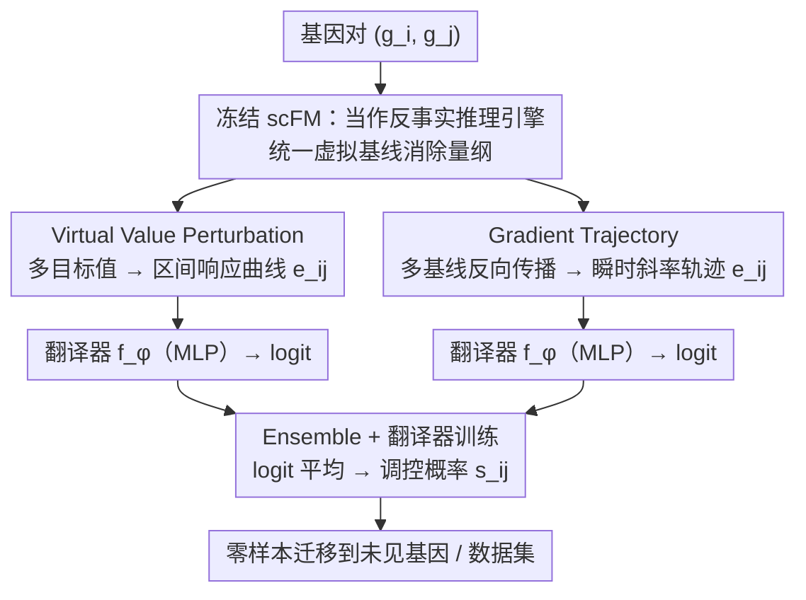

# Towards Universal Gene Regulatory Network Inference: Unlocking Generalizable Regulatory Knowledge in Single-cell Foundation Models

**会议**: ICML 2026  
**arXiv**: [2605.08128](https://arxiv.org/abs/2605.08128)  
**代码**: 未公开  
**领域**: 基础模型 / 单细胞生物信息 / 表征蒸馏  
**关键词**: 基因调控网络, scFM, 反事实扰动, 梯度轨迹, 零样本泛化

## 一句话总结
本文指出单细胞基础模型 (scFM) 蕴含丰富但被"重建式预训练"遮蔽的基因调控知识，并提出 Virtual Value Perturbation 与 Gradient Trajectory 两种探针，从冻结的 scFM 中蒸馏出可跨基因/跨数据集泛化的成对基因特征，在 BEELINE 基准上把 AUPRC 从 ~0.5 推到 0.8–0.97，开启了"通用 GRN 推断 (UGRN)"这一新范式。

## 研究背景与动机

**领域现状**：基因调控网络 (GRN) 推断是理解细胞机制的核心任务。传统做法 (GENIE3、PIDC 等) 依赖单数据集内的共表达回归或互信息；近年单细胞基础模型 (scGPT、Geneformer、scBERT) 通过在亿级单细胞语料上做 masked value reconstruction 预训练，被普遍寄予厚望，认为可以零样本推断 GRN。两类主流 scFM 用法是"in-silico perturbation"(把源基因 $g_i$ 的输入置零，看目标基因 $g_j$ 重建值的变化) 和"attention 提取"(把跨层注意力权重当成调控强度)。

**现有痛点**：多篇近期 benchmark (Jin et al. 2025, Ahlmann-Eltze et al. 2025) 指出这两类 scFM 用法的 AUPRC 普遍只有 0.49–0.55，几乎等于随机猜测，导致生物社区开始怀疑 scFM 是否真的学到了调控知识。同时传统 GRN 方法是"闭世界"的：模型维度被训练集的细胞数 $N$ 绑死，遇到新数据集 (cell count $N'$ 不同) 直接失效，更别说推断未见过的基因。

**核心矛盾**：scFM 的预训练目标是"重建表达值"，本质上学的是"用什么基因可以猜出 $g_j$ 的表达"，这与"$g_i$ 是否调控 $g_j$"在因果上并不等价。简单的 zero-out 扰动只反映了模型对 $g_i$ 的依赖强度，而且不同基因基线表达差异巨大，使得扰动幅度本身就不可比；attention 权重则混杂了语义与位置信号。所以并不是 scFM 没学到调控知识，而是"探针太粗糙"。

**本文目标**：(1) 设计一个能强迫模型跨数据集/跨基因泛化的评估协议 (UGRN benchmark)；(2) 给出可以从冻结 scFM 中提炼出"调控可解释"成对特征 $\mathbf{e}_{ij}$ 的探针方法。

**切入角度**：scFM 可以接收任意 (甚至训练分布外的) 虚拟表达值作为输入。因此可以脱离"真实细胞"的羁绊，直接构造一系列虚拟扰动状态，把 scFM 当成一个"反事实推理引擎"，系统地探测 $g_i \to g_j$ 的响应曲线，再让一个轻量"翻译器" $f_\phi$ 学习从响应特征到调控标签的映射。

**核心 idea**：用统一虚拟基线值 + 多目标扰动 (VVP) 与多基线梯度轨迹 (GDT)，把 scFM 内隐的成对调控知识"蒸馏"成可跨基因/跨数据集泛化的稠密特征向量。

## 方法详解

### 整体框架
UGRN 把"判断 $g_i$ 是否调控 $g_j$"拆成两步来做：先冻结 scFM $\mathcal{M}$，把它当成一台反事实推理引擎，对任意基因对 $(g_i,g_j)$ 抽出一个固定维度、跨数据集可比的成对特征 $\mathbf{e}_{ij}$；再在某个源数据集 $\mathcal{D}_b$（例如 hESC）上用一个浅层 MLP 翻译器 $f_\phi$ 把 $\mathbf{e}_{ij}$ 映射成调控概率 $s_{ij}=f_\phi(\mathbf{e}_{ij})$，然后零样本迁移到含未见基因、未见细胞类型的目标数据集（mDC、mESC、mHSC-E/G/L、hHEP 等）。整套设计的关键全压在第一步：怎样让特征摆脱"绑定具体细胞数 $N$ 和真实表达量级"的桎梏，从而能在数据集之间对齐。作者先放两个朴素策略垫底——**Pert** 用真实平均表达 $\bar{\mathbf{x}}$ 做 zero-out 取差值 $e_{ij}=\mathcal{M}(\bar{\mathbf{x}})_j-\mathcal{M}(\bar{\mathbf{x}}_{\neg i})_j$，**Emb** 直接相加 scFM 词表 embedding $\mathbf{E}_{\mathcal{M},i}+\mathbf{E}_{\mathcal{M},j}$——再引出两个真正的探针 VVP 与 GDT，并把它们的 logit 平均成 Ensemble。

### 关键设计

**1. Virtual Value Perturbation：用统一虚拟基线把扰动响应变成可跨数据集对齐的曲线**

传统 zero-out 探针之所以几乎等于随机，根子在于"扰动幅度不可比"：把 $g_i$ 置零，实际扰动量等于它的原始表达 $\mathbf{x}_{c,i}$，于是高表达基因被扰得很狠、低表达基因被扰得很轻，不同数据集之间量纲彻底错位。VVP 的做法是抛开真实细胞，先选一个虚拟基线值 $v_b$（取零均值附近的固定标量），把所有基因都置成 $v_b$ 构成统一背景，只在 $g_i$ 那一位填入要询问的值，得到虚拟细胞向量 $\mathbf{v}_{g_i\leftarrow v}$。然后不再只问"开/关"，而是给一组覆盖动态范围的目标值 $\{v_{p,1},\dots,v_{p,M}\}$，逐个算响应 $e_{ij}^{v_p}=\mathcal{M}(\mathbf{v}_{g_i\leftarrow v_p})_j-\mathcal{M}(\mathbf{v}_{g_i\leftarrow v_b})_j$，拼成 $\mathbf{e}_{ij}=[e_{ij}^{v_{p,1}};\dots;e_{ij}^{v_{p,M}}]$。这等于把"$g_i$ 升高多少 → $g_j$ 跟着动多少"画成一条离散响应曲线。由于所有基因对都在同一个 $v_b$ 坐标系下、用同一组 $v_p$ 被询问，特征天然跨数据集对齐，额外的 $M$ 个目标值还能刻画非线性响应。

**2. Gradient Trajectory：用反向传播读出随表达水平演变的瞬时调控强度**

VVP 给的是"从 $v_b$ 到 $v_p$ 这段区间的累计响应"，但对曲线在某个具体表达水平上到底有多陡刻画不足。GDT 利用 scFM 本身可微，直接读取瞬时斜率：定义一组有序基线值 $\{v_{b,1},\dots,v_{b,T}\}$，每个 $v_{b,t}$ 对应一个虚拟输入 $\mathbf{v}_{g_i\leftarrow v_{b,t}}$（其余基因仍固定在背景值），反向传播得到 $\nabla_{ij}^{(t)}=\partial \mathcal{M}(\mathbf{v}_{g_i\leftarrow v_{b,t}})_j / \partial v_i$，再沿表达水平串成轨迹 $\mathbf{e}_{ij}=[\nabla_{ij}^{(1)};\dots;\nabla_{ij}^{(T)}]$。它能告诉翻译器"$g_i$ 在低表达区就强烈影响 $g_j$、到高表达区却饱和"这类细节，正好补上 VVP 看不到的局部敏感度，与之形成互补视角。

**3. Ensemble + 翻译器训练：融合区间响应与瞬时敏感度**

VVP 和 GDT 抓的是同一条响应曲线的两个侧面——前者是区间累积、后者是逐点斜率——实验里它们在不同数据集各擅胜场（mDC 上 GDT 更强、mH-G 上 VVP 更强）。作者因此分别用 VVP 特征（维度 $M$）和 GDT 特征（维度 $T$）训练两个轻量 MLP $f_\phi^{\text{VVP}},f_\phi^{\text{GDT}}$ 输出 sigmoid 概率，最终预测取 logit 平均 $s_{ij}=\sigma\big(\tfrac{1}{2}(\text{logit}_{\text{VVP}}+\text{logit}_{\text{GDT}})\big)$。简单的 logit 平均就能稳稳压过单探针，说明两个视角确实各自捕到了不同的调控线索。

### 损失函数 / 训练策略
全流程唯一可学的参数就是翻译器 $f_\phi$，scFM 始终冻结，损失是标准二分类 BCE：$\mathcal{L}_\phi = -\sum_{(i,j)\in\Omega_{tr}}[y_{ij}\log s_{ij}+(1-y_{ij})\log(1-s_{ij})]$。评测刻意采用 Leave-One/Some-Dataset-Out 协议：在某个数据集（如 hESC + STRING 网络）上训 $f_\phi$，再零样本评估到所有其他数据集的 AUPRC；源数据集和目标数据集既不共享基因集也不共享细胞表达矩阵，强制翻译器学到真正可泛化的映射。VVP 用 $M=8$ 个目标值、GDT 用 $T=8$ 个基线值（消融见论文附录）。

## 实验关键数据

### 主实验
作者在 BEELINE 框架下 7 个 scRNA-seq 数据集 (hESC, hHEP, mDC, mESC, mHSC-E/G/L) × 4 种 ground-truth 网络 (STRING, Non-specific, Cell-type-specific, Lofgof) 上评测，使用 scGPT 与 scBenchmark 两个 scFM 作 backbone。下表节选 STRING 网络 (Str) 与 Non-specific (Nsp) 在 scGPT 上的 AUPRC：

| 数据集 / 网络 | Pert (Origin) | Attn (Origin) | Pert (Baseline) | Emb (Baseline) | VVP | GDT | Ens |
|---|---|---|---|---|---|---|---|
| Str / hHEP | 0.496 | 0.507 | 0.586 | 0.732 | 0.609 | 0.906 | **0.909** |
| Str / mDC | 0.512 | 0.536 | 0.569 | 0.637 | 0.606 | 0.917 | **0.923** |
| Str / mESC | 0.542 | 0.531 | 0.493 | 0.699 | 0.600 | **0.969** | 0.966 |
| Str / mH-L | 0.622 | 0.534 | 0.624 | 0.815 | 0.656 | 0.895 | 0.873 |
| Nsp / hHEP | 0.516 | 0.512 | 0.546 | 0.586 | 0.549 | **0.716** | 0.711 |
| Nsp / mESC | 0.551 | 0.539 | 0.512 | 0.638 | 0.582 | 0.835 | **0.836** |

可以看到原始 scFM 用法 (Pert/Attn) 几乎等于随机；改成 UGRN baseline 形式 (Pert/Emb 作翻译器特征) 已能涨到 0.6–0.8；而 GDT + Ensemble 一举把 AUPRC 推到 0.83–0.97，相对原始 Pert 提升 40%–80%。

### 消融实验

| 配置 | mESC (Str) AUPRC | 说明 |
|---|---|---|
| Pert (Origin, 真实 $\bar{\mathbf{x}}$) | 0.542 | scFM 原始用法 |
| Pert (Baseline, 翻译器化) | 0.493 | 直接把扰动差当特征喂翻译器，因量纲不可比反而更差 |
| Emb (Baseline) | 0.699 | 仅用基因词表 embedding |
| VVP (单目标值 $v_p$) | ~0.60 | 没用响应曲线，只比原始 Pert 略好 |
| VVP (多目标 $M=8$) | 0.600 | 完整 VVP，跨数据集稳定 |
| GDT ($T=8$) | 0.969 | 梯度轨迹是核心增益 |
| Ensemble (VVP+GDT) | 0.966 | 与 GDT 持平，但在多数其他数据集上更稳健 |

### 关键发现
- **GDT 是主要增益来源**：从原始 Pert (0.49) 到 GDT (0.97) 几乎翻倍，说明 scFM 的"梯度信号"才是真正承载调控知识的载体，而非重建残差。
- **统一虚拟基线消除量纲是泛化关键**：Pert Baseline (0.49) 比 Emb Baseline (0.70) 更差，恰好暴露了"真实表达值导致扰动幅度不可比"是跨数据集失败的根因。
- **scFM 本身确实蕴含调控知识**：在所有 scFM、所有数据集、所有 ground-truth 网络上 GDT/Ensemble 都稳定超过随机 (0.5) 与传统 scFM 用法，扭转了"scFM 学不到 GRN"的悲观结论。
- **可在"没有真实细胞测量"的场景下做预测**：VVP/GDT 使用的全是虚拟值，因此可以在缺乏目标基因表达数据时直接给出调控预测，对稀有细胞类型与新基因尤其有用。

## 亮点与洞察
- **重塑了 scFM 的可解释性视角**：把模型从"重建器"重新解读成"反事实推理引擎"，从此可以脱离训练分布，用任意虚拟输入系统地探测内部知识——这一思路完全可以迁移到大语言模型的因果归因或图像生成模型的属性解纠缠。
- **"梯度作为调控信号"是个被低估的探针**：作者展示了对冻结 scFM 直接反向传播得到的 $\partial \mathcal{M}_j / \partial v_i$ 是稳定且跨数据集可对齐的特征，比基于注意力或残差的特征都要强，这给 mechanistic interpretability 提供了一个新工具箱。
- **统一虚拟基线 + 多目标采样**这套"消除量纲 + 采样响应曲线"的范式非常通用：在 RecSys / 因果推断 / drug response 这些场景里同样可以用来构造跨域可比的反事实特征。
- **UGRN benchmark 本身是个贡献**：传统 GRN 评测都是 in-distribution，本文强制 leave-dataset-out 与未见基因，让评测真正反映"通用性"，这种 benchmark 设计思路值得在生物 AI 领域推广。

## 局限与展望
- **依赖 scFM 自身质量**：本文假设 scFM 已经学到了潜在调控知识，若 backbone 太弱 (例如只在数万细胞上预训练) VVP/GDT 可能拿不到有效信号；论文也未在更小规模 scFM 上做对照。
- **GDT 计算成本不低**：对 $T=8$ 个虚拟基线都要做一次反向传播，规模化到全基因对 (几万 × 几万) 时显存/时间开销可能成为瓶颈，作者未给出工程上的稀疏化方案。
- **没有显式建模时间动力学**：GRN 调控本身具有时间/发育阶段依赖性，本文的虚拟值是静态采样，无法刻画"激活随时间演化"的情形，未来可与 trajectory inference 结合。
- **翻译器 $f_\phi$ 仍是黑盒**：尽管输入特征更可解释，但 BCE 训练得到的 MLP 仍然无法直接读出"哪几条通路驱动了预测"，这与生物学家的需求 (机制可解释) 尚有距离。

## 相关工作与启发
- **vs 原始 scFM in-silico perturbation (Theodoris et al. 2023; Cui et al. 2024)**：他们直接把单次 zero-out 的输出差当调控分数；本文把同样的扰动操作改造成"统一基线 + 多目标值"的特征向量并配以可学翻译器，AUPRC 直接从 ~0.5 跳到 0.8+。
- **vs 注意力提取 (Yang et al. 2022)**：注意力权重混杂语义与位置信号，本文用基于梯度的 GDT 替代，证明梯度比注意力更"调控纯净"。
- **vs 传统 GRN 推断 (GENIE3, PIDC)**：那些方法是 in-distribution、闭世界的，无法迁移到新基因/新数据集；本文借助 scFM 的统一词表 $\mathcal{V}$ 与虚拟输入能力实现真正的零样本泛化。
- **vs Causal Tracing / Mechanistic Interpretability**：与 LLM 上做 activation patching 的思路类似，本文相当于在 scFM 上做"输入维度的反事实干预 + 梯度归因"，可视为 mechanistic interpretability 在生物基础模型上的落地实例。

## 评分
- 新颖性: ⭐⭐⭐⭐⭐ 把 scFM 重塑为反事实推理引擎，定义了 UGRN 这一新评测范式，并给出两个互补的可解释探针。
- 实验充分度: ⭐⭐⭐⭐ 覆盖 2 个 scFM × 7 个数据集 × 4 个 ground-truth 网络的密集消融，但缺少对 scFM 规模/预训练数据的对照。
- 写作质量: ⭐⭐⭐⭐ 公式与图示清晰，从问题到方法的推理链很自然；不过 baseline 与 origin 命名容易混淆。
- 价值: ⭐⭐⭐⭐⭐ 为整个生物基础模型社区扭转了悲观情绪，并提供了可直接迁移到其他基础模型的反事实探针套路。

<!-- RELATED:START -->

## 相关论文

- [\[ICML 2026\] Supervised Graph Contrastive Learning for Gene Regulatory Networks](supervised_graph_contrastive_learning_for_gene_regulatory_networks.md)
- [\[ICML 2026\] Scalable Single-Cell Gene Expression Generation with Latent Diffusion Models](scalable_single-cell_gene_expression_generation_with_latent_diffusion_models.md)
- [\[AAAI 2026\] Gene Incremental Learning for Single-Cell Transcriptomics](../../AAAI2026/computational_biology/gene_incremental_learning_for_single-cell_transcriptomics.md)
- [\[ACL 2025\] A Survey on Foundation Language Models for Single-cell Biology](../../ACL2025/computational_biology/foundation_lm_single_cell_survey.md)
- [\[CVPR 2026\] HINGE: Adapting a Pre-trained Single-Cell Foundation Model to Spatial Gene Expression Generation from Histology Images](../../CVPR2026/computational_biology/adapting_a_pre-trained_single-cell_foundation_model_to_spatial_gene_expression_g.md)

<!-- RELATED:END -->
