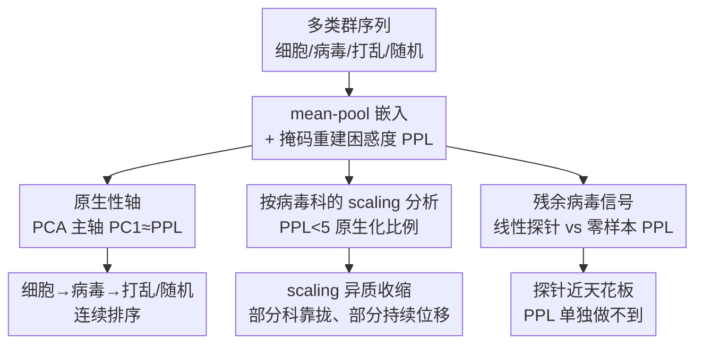

# Viral Proteins Reveal Geometry of Protein Language Models

**会议**: ICML 2026  
**arXiv**: [2606.12609](https://arxiv.org/abs/2606.12609)  
**代码**: 有（作者承诺开源，含 embedding 提取与复现脚本）  
**领域**: 计算生物学 / 可解释性  
**关键词**: 蛋白质语言模型, 病毒蛋白, 原生性轴, 线性探针, 表示几何

## 一句话总结
这篇论文以病毒蛋白为探针，发现 ESM 系列蛋白质语言模型（pLM）的嵌入空间里存在一条由掩码重建困惑度主导的"原生性轴"（PC1），它把序列从建模良好的细胞蛋白、经病毒蛋白、一直排到打乱/随机序列；同时证明嵌入里还保留着超出困惑度的"残余病毒信号"——线性探针能近天花板地区分病毒/细胞蛋白，而单靠困惑度做不到。

## 研究背景与动机
**领域现状**：pLM 在大规模序列库上训练，已成为结构预测、逆折叠、功能预测的通用表示工具，近期还兴起用机制可解释性去拆解它们学到了什么。但训练数据极度不均衡，主流分析几乎只看细胞蛋白。

**现有痛点**：人们几乎不了解 pLM 如何表示那些"功能真实存在、但在预训练数据里被严重低估、且演化上与细胞蛋白迥异"的生物类群。病毒蛋白正是典型——它们丰度低、受宿主依赖/高突变率/紧凑基因组/多功能性等不同演化约束塑造，且在病毒突变效应预测这类基准上 pLM 表现明显落后。

**核心矛盾**：病毒蛋白在 pLM 表示空间里确实和细胞蛋白分得很开（已有工作发现仅凭 mean-pooled ESM2 嵌入就能线性区分），但没人说清这种"分离"到底是什么驱动的——是单纯因为病毒蛋白"更难被模型重建"（即更不原生），还是嵌入里真的编码了病毒特有的生物信息？

**本文目标**：把这个问题拆成两问。第一，病毒分离是否主要由"低原生性"解释（病毒蛋白只是被预训练分布建模得更差）？第二，在原生性之外，嵌入是否还保留了病毒特有信息？

**切入角度**：作者把"掩码重建困惑度"（PPL）当作一个**模型相对**的原生性度量——它直接对齐 ESM2/ESMC 的训练目标，越低说明序列越符合模型在预训练中学到的统计规律。再用 PCA 去看嵌入几何，用线性探针 vs 零样本 PPL 分类器去拆解信息来源。

**核心 idea**：用"原生性轴"统一解释病毒-细胞位移，同时用"探针超过 PPL 的那部分 AUC"量化出残余的病毒特异信号——前者是几何主轴，后者是几何主轴装不下的信息。

## 方法详解

### 整体框架
论文不是提出新模型，而是一套围绕"病毒蛋白当探针"的表示几何分析方案。输入是横跨生命之树的多类群蛋白序列（六类细胞 + 四类病毒）加三种"无生物学意义"对照（打乱细胞、打乱病毒、i.i.d. 随机），跨三个 ESM 家族、跨越三个数量级参数量的模型；对每条序列取末层残基嵌入做 mean-pool 得到一个序列向量，并算一个掩码重建困惑度 PPL。然后并行跑三条分析线：① 把所有类群嵌入合到一起做 PCA，看病毒分离是否集中在单一主轴上；② 在人类病毒科粒度上看 scaling 如何改变"原生化比例"；③ 在同源去泄漏的病毒/细胞分类集上，比线性探针、零样本 PPL 分类器、浅层序列基线三者的 AUC，分离出残余信号。

### 关键设计

**1. 掩码重建困惑度：把"原生性"定义成模型相对的可重建难度**

要回答"病毒分离是不是因为更难建模"，先得有一个能量化"原生性"的标量。作者直接复用 pLM 的训练目标：对每条序列 $\mathbf{x}$ 随机掩码 $p=0.15$ 比例的残基位置（不含 BOS/EOS），算被掩 token 的对数似然，得到困惑度

$$\mathrm{PPL}(\mathbf{x}) = \exp\!\left(\frac{1}{|\mathcal{M}|}\sum_{i\in\mathcal{M}} -\log p_\theta\!\left(x_i \mid \mathbf{x}_{\setminus\mathcal{M}}\right)\right)$$

其中 $\mathcal{M}$ 是被掩位置集合，结果对每条序列取三次独立掩码平均。这个定义的关键在于"模型相对"：一条序列原生与否，取决于它多大程度匹配该模型在预训练里学到的统计规律，而不是某个固定外部标准。这直接对齐 ESM2/ESMC 的掩码语言建模目标，也对齐 ESM3 掩码去噪目标的序列分支，所以 PPL 越低 ≈ 越"原生"。

**2. 原生性轴：嵌入空间里一条对齐 PPL 的主导几何方向**

把十个生物类群加三种对照的序列嵌入合成一个矩阵做联合 PCA，作者发现病毒分离高度集中在**单一主轴 PC1** 上。在 ESMC-600M 上，PC1 解释了 73.1% 的方差，且与 PPL 的 Spearman 相关高达 $\rho=+0.961$。这条轴把序列从"重建良好的细胞蛋白（低 PPL，左侧）"，经过"病毒区"，一路排到"难重建的打乱/随机对照（高 PPL，右侧）"——病毒蛋白处在中间，既不像细胞蛋白那么原生，又比无生物学意义序列更有结构。作者据此把 PC1 命名为**原生性轴**。这条轴并非某个模型的偶然产物：它在 ESM2-650M（PC1 解释 54.3%）、ESM3-open（67.3%）上同样强相关（$\rho=+0.926, +0.935$），甚至跨出掩码 LM 目标——自回归的 ProGen2 与离散扩散的 EvoDiff 也呈现 PC1≈PPL 对齐和"细胞→病毒→打乱→随机"的五层排序。一个干净的反驳"数据曝光论"的对照是：把发布于 ESMC-600M checkpoint **之后**（因此不在预训练里）的 1723 条细胞蛋白拿来测，其中位 PPL 为 5.3，远接近细胞参考（3.2）而非病毒参考（15.3）——说明位移反映的是"与细胞主导先验的兼容性"，不是单纯训没训过。

**3. 按病毒科的 scaling 分析：原生性轴的收缩是异质而非均匀的**

光看"病毒整体"会掩盖内部差异，作者把分析下沉到人类病毒的**科**（family）粒度，定义"原生化比例"= 该科中 $\mathrm{PPL}<5$ 的序列占比（固定阈值，因为细胞类群在更小模型上就已普遍低于它），只保留 ≥50 条序列的科。结果是：放大模型平均只让人类病毒略微更原生（全体均值从 300M 的约 5% 升到 6B 的约 17%），但**各科差异极大**——Papillomaviridae 和 Retroviridae 随 scaling 增益约 60%，而 Orthomyxoviridae、Orthoherpesviridae、Sedoreoviridae 即便到 6B 仍大多在原生区之外。作者给的解释是：scaling 主要降低那些"本就更接近学到的蛋白先验"的科的重建难度；能被原生化的科往往有**细胞同源物**（如 Retroviridae 的逆转录酶在真核反转录转座子里也有、LTR 反转录转座子与逆转录病毒共享结构特征），其蛋白结构域早已存在于细胞训练分布里，因此更兼容细胞训练的 pLM。

**4. 线性探针对比零样本 PPL：分离出超越重建难度的残余病毒信号**

这是回答第二问的核心拆解。在一个**同源去泄漏**的人类病毒/细胞分类集（10400 条序列用 MMseqs2 在 30% 同一性、80% 双向覆盖度下聚类，整簇分到 60/20/20 train/val/test）上，作者对同一个模型用两种读出方式比较：一个是 mean-pooled 嵌入上训的 $\ell_2$ 正则逻辑回归**线性探针**，一个是仅用负困惑度 $s(\mathbf{x})=-\mathrm{PPL}(\mathbf{x})$ 的**零样本 PPL 分类器**（为可比报 $\max(\mathrm{AUC}, 1-\mathrm{AUC})$）；再加长度/氨基酸组成/二肽组成三个浅层基线取最优作为天花板下界。关键发现是两条曲线**随 scale 发散**：线性探针在所有规模都高于浅层基线、在大模型上达到 AUC∈[0.97,1.00] 天花板带；而 PPL 分类器更弱且非单调——它在中间规模改善，但在 ESM2-15B、ESM3-large 上反而下降，因为 scaling 把一些病毒蛋白变得"更原生"、挤进低 PPL 区，反而削弱了 PPL 单独可用的病毒/细胞可分性。换句话说，大模型能让病毒蛋白在重建目标下"看起来更原生"，却**仍在嵌入里保留一条线性可达的病毒信号**——这条信号正是原生性轴装不下的部分。

### 损失函数 / 训练策略
本文不训练 pLM 主干，只在冻结嵌入上拟合轻量分类头：线性探针为标准化后的 $\ell_2$ 正则逻辑回归，零样本分类器无需训练（直接用 $-\mathrm{PPL}$ 排序），浅层基线为 length(1 维)/氨基酸组成(20 维)/二肽组成(400 维)上的逻辑回归。所有指标在留出 test 划分上报 AUC-ROC。

## 实验关键数据

### 主实验
预训练数据的不均衡是整篇文章的前提（Table 1 改写）：

| 类群 | UniRef50 簇数 | 说明 |
|------|--------------|------|
| 全部细胞蛋白 | 46.3 M | 主导预训练分布 |
| 全部病毒蛋白 | 390.3 k | 含噬菌体/植物/无脊椎/人类病毒 |
| 细胞 : 病毒 比例 | **119×** | 极度不均衡 |

病毒/细胞分类 AUC（人类病毒集，同源去泄漏 test 划分；数值取代表性规模）：

| 读出方式 | 典型 AUC | 随 scale 行为 |
|----------|---------|--------------|
| 嵌入线性探针 | 0.97–1.00（大模型达天花板带） | 单调上升、近天花板 |
| 零样本 PPL 分类器 | 明显更低 | 非单调，ESM2-15B / ESM3-large 反降 |
| 最优浅层基线（二肽组成） | 灰带上沿 | 探针始终高于它 |

跨架构稳健性：ProGen2、EvoDiff 的探针 AUC 分别为 0.984、0.986，且 PC1–PPL 对齐（$\rho=+0.90, +0.95$）同样成立。

### 低假阳性场景（序列筛查相关）
在筛查实际关心的低 FPR 区，探针对 PPL 的优势最锐利：

| 模型 | FPR=1% 探针 TPR | FPR=1% PPL TPR |
|------|----------------|----------------|
| ESM2-15B | 88.3% | 26.9% |
| ESMC-6B | 96.7% | 39.2% |
| ESM3-large | 90.6% | 36.1% |

在 0.1% FPR 下，探针 TPR 从 ESM2-8M 的 6.2% 升到 ESM2-15B 的 55.4%，从 ESMC-300M 的 47.9% 升到 ESMC-6B 的 83.4%——scaling 提升的是嵌入表示的实用筛查价值，即便此时 PPL 单独变得更不可靠。

### 关键发现
- **原生性轴是统一解释器**：PC1 一条轴（解释 54%–73% 方差）就吃下了大部分细胞→病毒位移，并把病毒蛋白定位在"原生细胞蛋白"与"无意义对照"之间。
- **scaling 的收缩是选择性的**：有细胞同源物的科（Papillomaviridae、Retroviridae）随放大显著原生化（约 +60%），无同源支撑的科（Orthomyxoviridae 等）即便 6B 仍持续位移。
- **残余信号独立于重建难度**：探针与 PPL 分类器随 scale 发散，且探针超过二肽组成基线，说明它不是在利用简单序列统计。
- **不需直接病毒曝光**：ESM3-open 完全不含病毒训练序列，却仍有原生性轴、病毒仍线性可分——位移是"相对细胞主导先验"的结果，而非"训过没训过"。

## 亮点与洞察
- **把训练目标本身当度量**：用掩码重建困惑度定义"模型相对的原生性"，既无需外部标签、又天然对齐 ESM 训练目标，是一个干净且可迁移的诊断量。这套"PPL 当 nativeness"的思路可直接搬到任何掩码序列模型。
- **几何主轴 ≈ 损失代理**：PC1 与 PPL 的 $\rho>0.92$ 跨架构成立，提示掩码 pLM 可能会自发长出一条"对齐模型拟合度"的主导方向——这是一个很强的、值得理论化的经验现象。
- **"探针减 PPL"= 残余信号**：用同一模型两种读出的 AUC 差，干净地把"难重建"和"病毒特异信息"两件事拆开，方法论上比"探针能分=有信号"更有说服力。
- **类比多语言模型**：作者点出低资源语言/方言之于多语言 LM，可能正是病毒蛋白之于 pLM 的对应物——一个能检验"原生性轴是否是大型掩码序列模型普遍属性"的漂亮跨域假设。

## 局限与展望
- 作者承认主分析集中在 ESM 家族，对 ProGen2/EvoDiff 只是 Appendix 的初步证据，跨架构跨规模的系统普查仍是未来工作；且按科 scaling 的科排序是目标依赖的。
- 自己观察：固定阈值 $\mathrm{PPL}<5$ 作为"原生化"门槛是经验选择，不同模型族绝对 PPL 尺度不同，跨族比较"原生化比例"需谨慎；"细胞同源物解释为何某科被原生化"目前是定性归因而非系统因果检验。
- 生物安全含义被作者克制地表述为"可能补充同源筛查"，并未真正评测部署系统；嵌入能更好区分病毒-like 也意味着双用风险。
- 展望：在病毒序列上微调可降低病毒 PPL 并把它们推向原生区且不损探针性能；理解原生性轴的数学/统计起源（高维混合几何？掩码目标的一般性质？）是最有价值的后续方向。

## 相关工作与启发
- **vs Ofer & Linial（病毒/细胞线性可分）**: 他们证明仅凭 mean-pooled ESM2 嵌入就能线性区分病毒与细胞蛋白，但没解释驱动分离的是什么；本文用 PPL/原生性轴把分离拆成"低原生性 + 残余信号"两部分，给出了机制性归因。
- **vs Gurev et al.（病毒突变效应基准）**: 他们从下游基准发现 pLM 在病毒上落后；本文从表示几何给出原因——病毒处于相对细胞先验的位移区，并把"低原生性"提议为一个可用的诊断量（低原生性科应更谨慎做零样本预测）。
- **vs SAE 类机制可解释性工作（Adams/Simon/Silberg 等）**: 他们用稀疏自编码器找绑定位点、结构基序、热稳定性等潜在特征，但都没检查病毒蛋白；本文专门补上"pLM 表示是否编码病毒特异信号"这一空白，并用线性探针给出量化答案。

## 评分
- 新颖性: ⭐⭐⭐⭐⭐ 用病毒蛋白当探针发现并命名"原生性轴"，并把分离干净拆成原生性+残余信号，视角新且统一。
- 实验充分度: ⭐⭐⭐⭐ 跨三大 ESM 家族、跨三个数量级、加 ProGen2/EvoDiff 与同源去泄漏划分、低 FPR 分析都做了，但主结论仍以 ESM 为主、部分为 Appendix 初步证据。
- 写作质量: ⭐⭐⭐⭐⭐ 两问驱动、三贡献清晰，几何结论与生物解释衔接自然。
- 价值: ⭐⭐⭐⭐ 既给 pLM 可解释性一个可迁移诊断量（原生性），又对病毒筛查/生物安全有实际启示。

<!-- RELATED:START -->

## 相关论文

- [\[NeurIPS 2025\] Learning Conformational Ensembles of Proteins Based on Backbone Geometry](../../NeurIPS2025/computational_biology/learning_conformational_ensembles_of_proteins_based_on_backbone_geometry.md)
- [\[ICML 2026\] Circuit Tracing in Autoregressive Protein Language Models](circuit_tracing_in_autoregressive_protein_language_models.md)
- [\[ICLR 2026\] Controlling Repetition in Protein Language Models](../../ICLR2026/computational_biology/controlling_repetition_in_protein_language_models.md)
- [\[ICML 2026\] Hyperbolic Neural Population Geometry Benefits Computation](hyperbolic_neural_population_geometry_benefits_computation.md)
- [\[ICML 2025\] Steering Protein Language Models](../../ICML2025/computational_biology/steering_protein_language_models.md)

<!-- RELATED:END -->
