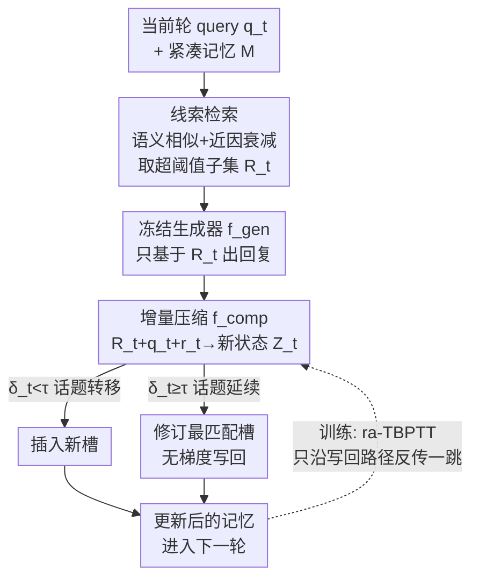

# Context-Driven Incremental Compression for Multi-Turn Dialogue Generation

**会议**: ICML 2026  
**arXiv**: [2606.12411](https://arxiv.org/abs/2606.12411)  
**代码**: 待确认  
**领域**: 对话生成 / LLM效率 / 上下文压缩  
**关键词**: 多轮对话, 上下文压缩, 可修订隐记忆, 线索检索, 截断时序反传

## 一句话总结
多轮对话里把整段历史拼进 prompt 既贵又会丢线索，本文提出 **C-DIC**：把对话看成交织的「话题线索」，在一块紧凑记忆里存可修订的逐线索压缩状态，每轮跑一个轻量的「检索 → 修订 → 写回」循环，并配套**检索感知的截断时序反传（ra-TBPTT）**训练，在数百轮对话上保持稳定的延迟和困惑度。

## 研究背景与动机
**领域现状**：基于 LLM 的对话助手天然是多轮的，主流做法是每一步把**整段对话历史**拼到 prompt 里再生成回复。

**现有痛点**：全历史拼接有两个硬伤。其一是**计算爆炸**——自注意力对输入长度二次增长，一段 $T$ 轮、每轮平均 $L$ token 的对话，累计注意力成本是 $\sum_{t=1}^T O((tL)^2)=O(T^3L^2)$，立方级增长很快吃满延迟和显存。其二是**语义漂移**：对话越长，模型越容易丢掉早先提到的线索，对超出「近因注意力」范围的关键轮次关注不足（论文图 1：隔了 196 轮后问「上个月参加了几场晚宴」，基线全部答错）。现有省钱方案各有破绽：**截断**只留最近 $k$ 轮，丢长程依赖；**摘要**通常 query 无关、有损、且对话中途难修订；而把长文档压成少量隐向量的**静态隐压缩器**（ICAE、AutoCompressor）在多轮 rollout 下极其脆弱——连续压缩 3-4 次后困惑度急剧上升，从单轮换到多轮评测时静态模型 PPL 暴涨至少约 1900%。

**核心矛盾**：静态、一次性的压缩器**缺乏跨轮的记忆共享与修订机制**，导致信息累积丢失、误差滚雪球。一句话：压缩状态被当成「对过去的固定摘要」，而不是「可以被检索、被改写、被写回的持久隐记忆」。

**本文目标**：做**渐进式、话题感知的推理时压缩**，同时保住效率和连贯性。这要解决三个技术挑战：漂移下的话题对齐检索、不重编码全历史的增量修订、高效的推理时记忆管理。

**核心 idea**：把对话视为交织的话题线索，维护一块紧凑记忆，槽位里存**可修订的逐线索压缩状态**；每轮用轻量的 **检索 → 压缩 → 写回** 循环，把压缩状态当作持久可改的隐记忆而非固定摘要。

## 方法详解

### 整体框架
C-DIC 维护一块对话记忆 $\mathcal{M}_{<t}=\{\mathbf{Z}_i\}$，每个槽位 $\mathbf{Z}_i\in\mathbb{R}^{n\times d}$ 是某条话题线索的压缩状态，随对话演化。记忆由「压缩指令」初始化为第一个线索状态。此后每一轮 $t$ 做三件事：(1) 用当前 query $q_t$ 给已有槽位打分，检索相关子集 $\mathcal{R}_t$；(2) 冻结的生成器 $f_{\text{gen}}$ 只基于检索到的隐状态而非全历史生成回复；(3) 可训练的压缩器 $f_{\text{comp}}$ 把当前轮压成新状态，用**无梯度写回策略**更新记忆（话题转移则**插入**新槽，话题延续则**修订**最匹配的槽）。训练侧只优化压缩器和可学习压缩 token，生成器全程冻结，并用检索感知的截断时序反传只沿「实际被用到的记忆更新路径」分配梯度。

### 关键设计

**1. 增量压缩 + 话题对齐检索：让每轮只为「真正相关」的上下文付费**

静态压缩器每轮要么重压全历史、要么无修订地堆叠新隐向量，长对话下要么贵要么忘。C-DIC 反过来：不重编码全历史，而是维护一块演化的紧凑记忆。基础情形下，压缩器把 $(q_t,r_t)$ 连同可学习压缩 token $\mathbf{C}$ 压成 $\mathbf{Z}_t=f_{\text{comp}}([\text{Emb}(q_t);\text{Emb}(r_t);\mathbf{C}];\theta)$（式 2）。但基础情形对所有历史一视同仁、无法按「实际复用了什么」调粒度，所以引入**检索支持集** $\mathcal{R}_t\subset\mathcal{M}_{<t}$：每个槽位用带轻微近因衰减的语义相似度打分

$$S(q_t,\mathbf{Z}_i)=\frac{\langle\psi(f_{\text{comp}}(q_t,C)),\psi(\mathbf{Z}_i)\rangle}{\|\psi(f_{\text{comp}}(q_t,C))\|\,\|\psi(\mathbf{Z}_i)\|}\,e^{-\alpha\Delta t_i}$$

其中 $\psi(\cdot)$ 是池化（mean 或 CLS），$\Delta t_i$ 是槽位 $\mathbf{Z}_i$ 上次被检索以来的轮数，$\alpha$ 是衰减率。取相似度超过阈值 $\tau$ 的槽位组成 $\mathcal{R}_t=\{\mathbf{Z}_i:S(q_t,\mathbf{Z}_i)>\tau\}$，若无一超阈值则回退到 top-1 最佳匹配。生成 $\hat{r}_t=f_{\text{gen}}([\mathcal{R}_t;\text{Emb}(q_t)];\phi)$（式 4）、压缩 $\mathbf{Z}_t=f_{\text{comp}}([\mathcal{R}_t;\text{Emb}(q_t);\text{Emb}(r_t);\mathbf{C}];\theta)$（式 5）都只基于检索子集——于是每轮计算量正比于 $|\mathcal{R}_t|$ 而非对话长度，且压缩聚焦于活跃线索，长程连贯性更好。

**2. 无梯度写回：在「插入新线索」与「修订旧线索」之间确定性地二选一**

要让记忆既紧凑又跟得上话题演化，C-DIC 用一条**确定性、无梯度**的更新规则。每轮先算当前 query 对已有槽位的峰值相似度 $\delta_t=\max_i S(q_t,\mathbf{Z}_i)$ 与对应槽位 $j_t=\arg\max_i S(q_t,\mathbf{Z}_i)$，再按式 6 更新：

$$\mathcal{M}_{<t+1}=\begin{cases}\mathcal{M}_{<t}\cup\{\mathbf{Z}_t\},&\text{若 }\delta_t<\tau\ (\text{话题转移，插入新槽})\\\big(\mathcal{M}_{<t}\setminus\{\mathbf{Z}_j\}\big)\cup\{\mathbf{Z}_t\},&\text{否则 }(\text{话题延续，修订最匹配槽})\end{cases}$$

相关时改写最匹配槽以保持线索连续，相关性低时开新槽。由于选择和写回都不走梯度，推理保持轻量、也不依赖原始对话 token 历史。这正是它区别于静态压缩器的核心——压缩状态是「可修订的持久隐记忆」，而不是写死的摘要。

**3. 检索感知截断时序反传（ra-TBPTT）：只给「真正被消费的记忆路径」记功**

多轮压缩下，模型并不 attend 全历史，只查检索出的一小撮状态。标准 BPTT 反传所有过去轮（贵且与实际使用错位），常规 TBPTT 按固定窗口截断（不管哪些轮真被用到）。C-DIC 改用**检索感知的截断计算图**：只沿被选中的记忆更新路径分配梯度。训练最小化逐轮负对数似然 $\mathcal{L}=\frac{1}{T}\sum_t\ell_t$，$\ell_t=-\log P_\phi(r_t\mid q_t,\mathcal{R}_t)$（式 7），其中 $r_t$ 是 teacher-forcing 的金标准回复。反传时做**一跳截断**：仅当 $\delta_t\ge\tau$ 时梯度才流入被写回的槽 $\mathbf{Z}_{j_t}$，其余槽 $s\ne j_t$ 一律 $\partial\ell_t/\partial\mathbf{Z}_s=0$（式 8）。等价地用掩码 $M_{s,t}=\mathbb{1}[s=j_t]\cdot\mathbb{1}[\delta_t\ge\tau]$ 控制 $\partial\mathcal{L}/\partial\mathbf{Z}_s=\sum_t M_{s,t}\,\partial\ell_t/\partial\mathbf{Z}_s$。被检索但未被写回的状态当作 stop-gradient 上下文；对离题轮（$\delta_t<\tau$）保留 arg-max 槽用于前向连续性但训练时 detach，使梯度永不流入失配的记忆。这套稀疏、检索对齐的信用分配，正好匹配写回操作实际用到的记忆路径，避开了全历史反传与误差累积。

**4. 用 ICAE 预训练权重初始化压缩器**

不从零训压缩器，而是用 ICAE 的预训练 checkpoint（在大规模语料上为一次性文档压缩训练）初始化，再适配到增量、检索条件、生成器冻结的设定。这样无需额外预训练就继承了 ICAE 高容量、上下文忠实的压缩能力，省成本又保表征质量。

### 一个例子：隔 196 轮的引用追踪
用户在对话早期零散提到几次「参加晚宴」，中间穿插 196 轮无关闲聊后突然问「上个月一共参加了几场晚宴」。全历史/截断/摘要基线要么把早先提及挤出注意力范围、要么早被截断/摘要丢弃，答错。C-DIC 则因为每次「参加晚宴」都被压进同一条话题线索的槽位并被反复修订写回，提问时凭语义相似度（即便隔了上百轮、近因衰减也压不没它）检索回该线索状态，正确聚合出次数——这具象地展示了「可修订逐线索记忆 + 话题对齐检索」如何跨越数百轮恢复证据。

## 实验关键数据
在两个多会话长对话语料上评测：**MSC**（Multi-Session Chat，官方训练集 1001 段、评测平均 66 轮）和 **REALTALK**（10 段真实 WhatsApp 式对话、平均 21.9 会话 / 894.4 轮，**零样本**评测）。所有方法共享冻结的 Llama-2-Chat-7B 生成器（除需自身微调的方法和 § 更强骨干参考），学习型压缩基线在 MSC 上训 2 epoch、REALTALK 上零样本评测。

### 主实验
报告困惑度 PPL（↓）、BLEU、ROUGE（R-L/R-1/R-2，↑）。

| 模型（MSC） | PPL↓ | BLEU↑ | R-L↑ | R-1↑ | R-2↑ |
|------|------|------|------|------|------|
| Full prompting | 41.245 | 0.008 | 0.110 | 0.157 | 0.015 |
| Truncation | 30.890 | 0.012 | 0.128 | 0.184 | 0.024 |
| Summarization | 41.849 | 0.013 | 0.128 | 0.172 | 0.024 |
| RAG@20 | 31.179 | 0.013 | 0.111 | 0.156 | 0.014 |
| LLMLingua | 36.211 | 0.012 | 0.105 | 0.157 | 0.011 |
| InfLLM | 27.329 | 0.016 | 0.118 | 0.161 | 0.019 |
| AutoCompressor | 9.285 | 0.012 | 0.121 | 0.145 | 0.019 |
| ICAE (incremental) | 513.774 | 0.006 | 0.057 | 0.069 | 0.005 |
| ICAE (one-shot) | 27.656 | 0.017 | 0.133 | 0.190 | 0.027 |
| ICAE (append) | OOM | — | — | — | — |
| **Ours (C-DIC)** | **8.431** | **0.023** | **0.160** | **0.205** | **0.037** |

REALTALK（零样本，per-session）上 C-DIC 同样领先（PPL 9.789、BLEU 0.035、R-L 0.134）。

### 关键对比与失败模式

| 现象 | 数据 | 解读 |
|------|------|------|
| 静态压缩器在多轮下崩溃 | 单轮→多轮 PPL 暴涨 ≥~1900% | 缺跨轮修订/共享，连续压缩误差累积 |
| ICAE 朴素增量灾难性失败 | PPL ≈ 513.774（MSC）/ 124（REALTALK） | 一次性训练目标与重复压缩结构错位 |
| C-DIC 反而随轮数下降 | 多轮 PPL 下降 ~70% | 检索聚焦 + 可修订记忆稳住长程行为 |
| ICAE (append) | 显存溢出（OOM） | 隐向量无修订地增长，长度爆炸 |

另有 REALTALK all-sessions 的闭环 vs teacher-forcing 对比：多数基线因显存限制无法在该设定评测；C-DIC 仅在 MSC 上训却能零样本迁移到更长更开放的 REALTALK，且 teacher forcing 与闭环（基于模型自身历史回复）差距很小，说明数百轮上的长程行为稳定。

### 关键发现
- **可修订隐记忆是稳定性的根源**：C-DIC 困惑度随轮数**下降** ~70%，而静态压缩器暴涨——印证「检索 + 修订写回」治住了长程退化。
- **结构错位会致命**：ICAE 一次性训练目标直接用于重复增量压缩，PPL 高达 513，凸显训练范式必须与推理时的多轮压缩匹配（这正是 ra-TBPTT 的动机）。
- **稳定的延迟与困惑度**：用 7B 骨干在数百轮上延迟和 PPL 都保持平稳，支撑可扩展的高质量对话建模。

## 亮点与洞察
- **「对话 = 交织话题线索」的记忆观**：把压缩单位从 token/segment 抬到「对话级可修订线索状态」，每条线索一个槽、可被检索/改写/写回，是区别于 RMT、AutoCompressor 等记忆增强模型的核心抽象，思路可迁移到任何需要长程状态维护的流式任务。
- **检索感知的一跳截断反传（ra-TBPTT）**：让训练的信用分配与推理时「实际查了哪些记忆」严格对齐，既避开全历史 BPTT 的开销、又比固定窗口 TBPTT 更准——这种「按使用路径稀疏记功」的思想对任何「检索后生成 + 记忆写回」的可微系统都有借鉴价值。
- **无梯度确定性写回**：插入/修订二选一的规则简单到不需要学习，却恰好把记忆维持得紧凑且话题忠实，推理零额外梯度开销。
- **冷启动复用 ICAE 权重**：用现成一次性压缩器初始化再适配增量设定，省去预训练，是务实的工程选择。

## 局限与展望
- **阈值 $\tau$ 与衰减 $\alpha$ 敏感性**：插入 vs 修订、检索子集大小全由 $\tau$ 决定，$\tau$ 设不好会让线索过度合并或记忆膨胀；论文把替代更新策略放附录，正文未给充分的鲁棒性扫描。
- **一跳截断的代价**：ra-TBPTT 只沿写回路径反传一跳，跨多跳的长程依赖信用可能分配不足；作者也承认这是「实现的截断计算图」而非完整 BPTT。
- **依赖检索质量**：若语义相似度把相关线索打到阈值以下，关键证据会被漏检；池化函数（mean/CLS）和相似度度量的选择对长程引用追踪影响大。
- **生成器冻结的天花板**：只训压缩器、冻结 Llama-2-7B，最终质量受限于骨干能力；论文用更强骨干（Llama3.1-8B）作 § 参考也说明这一点。

## 相关工作与启发
- **vs 截断 / 摘要（Xu et al. 2022；Packer et al. 2024）**：它们丢长程依赖或产生 query 无关、易过时的静态摘要；C-DIC 的隐记忆可按当前 query 检索并中途修订，长程连贯性更好。
- **vs 静态隐压缩 AutoCompressor / ICAE（Chevalier et al. 2023；Ge et al. 2024）**：为一次性/静态输入设计，多轮 rollout 下连续压缩误差累积、ICAE 朴素增量直接崩到 PPL 513；C-DIC 引入跨轮共享与修订写回，PPL 反而随轮数下降。
- **vs 记忆增强长上下文模型（RMT/Compressive Transformer，Bulatov et al. 2022；Rae et al. 2019）**：它们在 token/segment 级定义记忆；C-DIC 在**对话级**做记忆更新——多槽检索 + 增量隐写回 + 检索感知信用分配，无需重编码全历史也不改基座生成器。

## 评分
- 新颖性: ⭐⭐⭐⭐⭐ 把上下文压缩从「静态一次性」改造成「可修订逐线索隐记忆 + 检索感知反传」，问题诊断和解法都新颖。
- 实验充分度: ⭐⭐⭐⭐ MSC + REALTALK 零样本 + 多类基线 + 闭环/teacher-forcing + 数百轮稳定性，覆盖到位；正文消融（阈值/检索/衰减）略偏附录。
- 写作质量: ⭐⭐⭐⭐ 用图 1/图 2 的失败案例引出动机、三个设计层层递进；ra-TBPTT 的公式表述稍密。
- 价值: ⭐⭐⭐⭐⭐ 直击长对话的效率与漂移痛点，数百轮上延迟与 PPL 稳定，对实际部署的对话系统很有用。

<!-- RELATED:START -->

## 相关论文

- [\[ACL 2026\] SPASM: Stable Persona-driven Agent Simulation for Multi-turn Dialogue Generation](../../ACL2026/dialogue/spasm_stable_persona-driven_agent_simulation_for_multi-turn_dialogue_generation.md)
- [\[ACL 2026\] Discourse Coherence and Response-Guided Context Rewriting for Multi-Party Dialogue Generation](../../ACL2026/dialogue/discourse_coherence_and_response-guided_context_rewriting_for_multi-party_dialog.md)
- [\[ICML 2026\] Not All Prefills Are Equal: PPD Disaggregation for Multi-turn LLM Serving](not_all_prefills_are_equal_ppd_disaggregation_for_multi-turn_llm_serving.md)
- [\[ACL 2026\] ETHICMIND: A Risk-Aware Framework for Ethical-Emotional Alignment in Multi-Turn Dialogue](../../ACL2026/dialogue/ethicmind_a_risk-aware_framework_for_ethical-emotional_alignment_in_multi-turn_d.md)
- [\[ICML 2026\] From Self-Evolving Synthetic Data to Verifiable-Reward RL: Post-Training Multi-turn Interactive Tool-Using Agents](from_self-evolving_synthetic_data_to_verifiable-reward_rl_post-training_multi-tu.md)

<!-- RELATED:END -->
