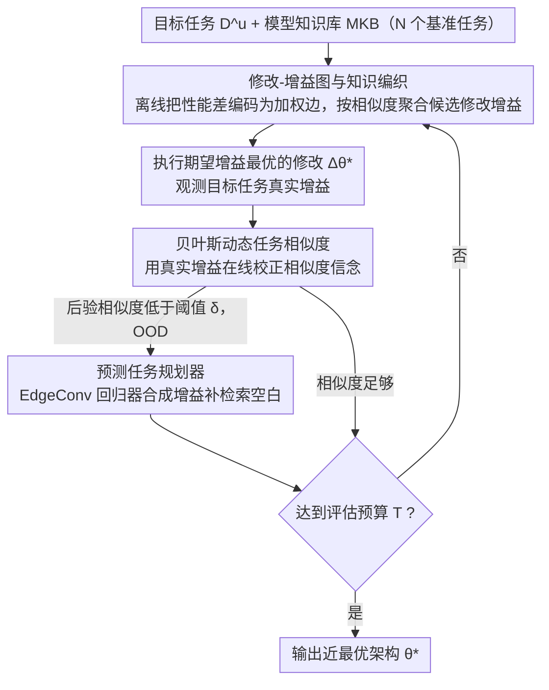

# Beyond Model Base Retrieval: Weaving Knowledge to Master Fine-grained Neural Network Design

**会议**: ICML 2026  
**arXiv**: [2507.15336](https://arxiv.org/abs/2507.15336)  
**代码**: https://github.com/jilwang84/M-DESIGN  
**领域**: 图学习 / 自动机器学习  
**关键词**: 神经架构搜索, 模型检索, 知识图谱, 图神经网络, 贝叶斯优化  

## 一句话总结

提出 M-DESIGN 框架，将神经网络设计建模为检索增强的迭代修改过程，通过构建修改-增益图编码细粒度架构编辑效果，并利用贝叶斯动态任务相似度在线校准迁移信号，在 33 个 GNN 任务中的 26 个达到设计空间最优。

## 研究背景与动机

**领域现状**：设计高性能神经网络的主流方法分为两大类——神经架构搜索（NAS）通过穷举试错寻找最优结构，模型检索（Model Retrieval）从预训练模型库中选取起始模型。前者计算昂贵，后者难以达到最优性能。

**现有痛点**：NAS 方法对每个新任务都从头搜索，不复用历史经验，存在严重的冷启动问题；检索方法虽然效率高，但只关注选择一个合理的起始模型，后续的架构适配仍依赖临时的试错调整。更关键的是，两类方法都忽略了细粒度架构修改（如替换 GNN 的消息传递机制）对性能的具体影响记录。

**核心矛盾**：现有方法在搜索效率与最优性之间存在根本性的权衡困境。NAS 能找到好的架构但代价高昂，检索效率高但结果次优。根本原因在于：（1）架构修改的迁移效果随着修改轨迹演进而变化，静态的任务相似度会失效；（2）当新任务与知识库中的任务分布差异较大时，直接检索的证据不可靠。

**本文目标**：将模型设计从一次性检索转变为基于知识驱动的迭代修改过程，在有限评估预算下快速找到接近最优的架构。

**切入角度**：作者观察到，如果将每次细粒度架构修改（如改变激活函数或聚合方式）对性能的影响显式记录为"编辑-效果证据"，就可以将这些证据组织成图结构，支持跨任务的关系推理。

**核心 idea**：构建修改-增益图（Modification-Gain Graph）编码历史设计经验，通过贝叶斯在线更新的动态任务相似度来编织（weave）跨任务证据，将模型设计转化为自适应的检索增强修改过程。

## 方法详解

### 整体框架

M-DESIGN 的输入是一个新的目标任务 $D^u$ 和一个包含 $N$ 个基准任务历史记录的模型知识库（MKB）。输出是在固定评估预算 $T$ 内找到的最优架构 $\theta^*$。流程分为三个阶段：（1）离线构建修改-增益图，将每个基准任务上架构变体之间的性能差异编码为有向加权边；（2）在线迭代修改，每步从知识库检索候选修改，通过跨任务知识编织估计期望增益，执行最优修改并观察真实效果；（3）贝叶斯更新，利用观测到的真实增益在线校正任务相似度信念，使迁移逐步对齐目标任务。

### 关键设计

**1. 修改-增益图与知识编织：把历史经验做成可复合的图**

传统检索方法只存"某个完整模型在某任务上得多少分"，这种记录只能查不能推理。M-DESIGN 改为记录"相对增益"：对每个基准任务 $D^i$ 构建图 $G_\Delta^i = (V, E^i, \omega^i)$，节点 $V$ 是架构配置，边 $(θ, θ')$ 的权重直接是这次修改带来的性能差 $\omega^i(e) = \mathcal{P}(θ', D^i) - \mathcal{P}(θ, D^i)$。相对增益天然可逆、可串联，于是跨任务的局部编辑模式可以被组合起来逼近最优路径。给目标任务选下一步修改时，把各基准任务的增益证据按相似度加权聚合：$\Delta\theta_t^* = \arg\max_{\Delta\theta} \sum_i \mathcal{S}_t(D^u, D^i) \cdot \widetilde{\Delta P}_t^i(\Delta\theta)$，其中 $\mathcal{S}_t(D^u, D^i)$ 是下一点要在线校正的动态任务相似度。

**2. 贝叶斯动态任务相似度：边修边校正迁移信号**

静态相似度的问题在于：同一个修改在修改轨迹的不同阶段对目标任务的指导意义会剧烈变化（实测 Kendall 秩相关从静态的 0.08 升到动态的 0.34），一旦失配就会引入负迁移。M-DESIGN 把相似度 $\mathcal{S}_t^{u,i}$ 当成贝叶斯后验，每执行一步修改、观测到真实增益后，用贝叶斯规则更新：$\mathcal{S}_t^{u,i} \propto \mathcal{N}(\Delta P_t^u; \gamma_{i,t} \Delta P_t^i, \sigma^2) \cdot \mathcal{S}_{t-1}^{u,i}$。似然项假设目标任务的真实增益 $\Delta P_t^u$ 与基准任务增益 $\Delta P_t^i$ 在缩放因子 $\gamma_{i,t}$ 下呈高斯一致，参数从最近一段滑动窗口（窗口大小 30-40）的观测里估计，让相似度逐步对齐目标任务真实表现。

**3. 预测任务规划器：知识库证据不足时合成增益**

当目标任务严重偏离知识库分布（OOD）、检索不到可靠证据时，直接检索的相关性会塌到 $R^2=0.03$（如 Cornell），照搬误导性证据会让错误不断累积。为此每个基准任务额外训练一个基于 EdgeConv GNN 的增益回归器 $f_{\psi_i}$，输入当前架构和候选修改后的架构、预测增益 $\widehat{\Delta P}_t^i(\Delta\theta) = f_{\psi_i}(\theta_t, \theta_t + \Delta\theta)$。一旦后验相似度低于阈值 $\delta$ 就切换到规划器预测来补检索空白，并用在线 replay buffer 微调让合成证据逐步贴近目标分布，把 Cornell 的相关性从 $R^2=0.03$ 拉到 $R^2=0.11$。

## 实验关键数据

### 主实验

在 67,760 个 GNN 模型、22 个数据集、33 个任务-数据对上评估，最大评估预算 100 次：

| 数据集 | 设计空间最优 | AutoTransfer | DesiGNN | M-DESIGN | 达到最优? |
|--------|-------------|-------------|---------|----------|----------|
| Actor | 34.89 | 33.97 | 34.43 | **34.89** | ✓ |
| Computers | 89.59 | 87.72 | 88.40 | **89.22** | — |
| Photo | 94.75 | 94.62 | 94.60 | **94.75** | ✓ |
| CiteSeer | 74.59 | 73.89 | 74.54 | **74.59** | ✓ |
| CS | 95.33 | 95.16 | 95.03 | **95.33** | ✓ |
| Cora | 88.50 | 88.50 | 88.34 | **88.50** | ✓ |
| Cornell | 77.48 | 76.58 | 75.50 | **77.48** | ✓ |
| DBLP | 84.29 | 83.59 | 84.29 | **84.29** | ✓ |
| PubMed | 89.08 | 89.08 | 89.08 | **89.08** | ✓ |
| Texas | 84.68 | 78.38 | 81.80 | 83.79 | — |
| Wisconsin | 91.33 | 88.67 | 90.66 | **91.33** | ✓ |

M-DESIGN 在 33 个任务-数据对中的 **26 个**达到设计空间最优，全面超越所有基线。

### 消融实验

| 变体 | 平均准确率下降 | Kendall 秩相关 | 说明 |
|------|-------------|---------------|------|
| M-DESIGN (完整) | — | 0.34 | 动态相似度 + 滑动窗口 + OOD 适配 |
| w/o 滑动窗口 | 轻微下降 | 0.27 | 早期不可靠证据未被降权 |
| w/o 动态更新 | 最大下降 | 0.08 | 静态相似度完全无法跟踪局部一致性 |
| w/o OOD 适配 | OOD 数据集大幅下降 | 0.31 | Computers/Cornell/Texas 性能显著退化 |

知识库规模消融：仅保留 25% 基准任务时平均准确率为 81.50，保留 100% 时为 82.11，性能降级平缓。

### 搜索效率对比

| 方法 | Cornell 到达目标所需评估数 | Wisconsin 到达目标所需评估数 |
|------|-------------------------|---------------------------|
| Random | ∞ | 79 |
| RL | 92.7 | 91.2 |
| EA | ∞ | 96.9 |
| DesiGNN | ∞ | 62.6 |
| **M-DESIGN** | **22** | **5** |

M-DESIGN 每步 MKB 操作开销 <0.31 秒（含 OOD 适配 <0.44 秒），远小于单次模型评估的 ~30 秒。

## 亮点与洞察

1. **知识表示的范式转变**：从存储完整模型性能记录转向编码细粒度修改增益，使历史经验可复合、可推理，而非仅可查找
2. **动态迁移校正**：贝叶斯在线更新是性能提升的主要来源（消融显示去除后 Kendall 相关从 0.34 降至 0.08），解决了静态任务相似度在迭代修改过程中失效的根本问题
3. **理论假设有实证支撑**：增益线性迁移和高斯分布假设在高相似任务对上得到验证（Cora-DBLP 的 $R^2=0.87$），为贝叶斯更新提供了可靠的似然模型
4. **跨域迁移潜力**：在表格数据（Protein/Slice/Naval 等 4 个数据集）上也表现优异，排名进入设计空间前 0.05%-0.47%

## 局限性 / 可改进方向

1. 当前实例化仅覆盖 GNN 设计空间（3080 个候选架构），向 CNN/Transformer 等更大设计空间扩展需要解决知识库构建的可扩展性问题
2. 离线 MKB 构建需要预训练大量模型（67,760 个），初始成本较高
3. OOD 适配在极端分布偏移下（Cornell 的 $R^2$ 仅从 0.03 提升到 0.11）改善有限，多跳推理能力仍需增强
4. 贝叶斯更新假设增益服从高斯分布，在高度非凸的设计空间中可能不成立

## 相关工作与启发

1. **DesiGNN** (Wang et al., 2026)：检索增强的 GNN 设计，但使用静态任务相似度，缺乏在线校正能力
2. **AutoTransfer** (Cao et al., 2023)：基于嵌入的模型迁移，但同样存在静态相似度问题
3. **NAS-Bench-Graph** (Qin et al., 2022)：GNN 架构搜索基准，使用排序相关度量任务相似度

## 评分
- 新颖性: 9/10 — 将模型设计重构为修改-增益图上的检索增强迭代优化，贝叶斯动态任务相似度是独创性设计
- 实验充分度: 9/10 — 33 个任务-数据对 + 10 个基线 + 详细消融 + 理论假设验证 + 跨域实验
- 写作质量: 8/10 — 形式化定义清晰严谨，但符号密度较高
- 价值: 8/10 — 为自动机器学习提供了新范式，但扩展到更大设计空间的可行性待验证

<!-- RELATED:START -->

## 相关论文

- [\[ICML 2026\] Full-Spectrum Graph Neural Network: Expressive and Scalable](full-spectrum_graph_neural_network_expressive_and_scalable.md)
- [\[ICML 2026\] KBQA-R1: Reinforcing Large Language Models for Knowledge Base Question Answering](kbqa-r1_reinforcing_large_language_models_for_knowledge_base_question_answering.md)
- [\[ACL 2025\] Beyond Completion: A Foundation Model for General Knowledge Graph Reasoning](../../ACL2025/graph_learning/beyond_completion_a_foundation_model_for_general_knowledge_graph_reasoning.md)
- [\[AAAI 2026\] On Stealing Graph Neural Network Models](../../AAAI2026/graph_learning/on_stealing_graph_neural_network_models.md)
- [\[ICML 2026\] Are Common Substructures Transferable? Riemannian Graph Foundation Model with Neural Vector Bundles](are_common_substructures_transferable_riemannian_graph_foundation_model_with_neu.md)

<!-- RELATED:END -->
