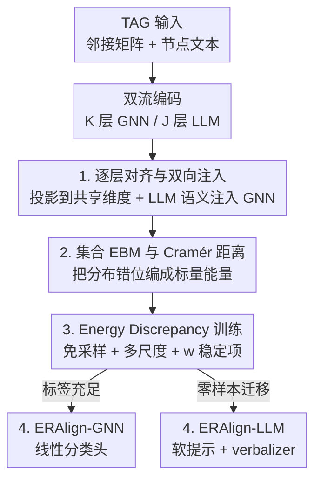

# ERAlign: Energy-based Representation Alignment of GNNs and LLMs on Text-attributed Graphs

**会议**: ICML2026  
**arXiv**: [2606.10461](https://arxiv.org/abs/2606.10461)  
**代码**: 待确认  
**领域**: 图学习 / GNN-LLM 表示对齐  
**关键词**: 文本属性图, GNN-LLM 对齐, 能量模型, Energy Discrepancy, Cramér 距离

## 一句话总结
针对文本属性图（TAG）上 GNN 与 LLM 表示难以对齐的问题，本文用一个**集合能量模型（set EBM）**把两路表示投到共享隐空间、用 Cramér 距离度量分布错位并逐层对齐，再用免采样的 **Energy Discrepancy（ED）** 训练把能量降下去，在 8 个 TAG 数据集上全面取得 SOTA。

## 研究背景与动机
**领域现状**：文本属性图（每个节点带一段文本，如论文、用户简介、商品描述）同时含有「结构」和「语义」两类信息。GNN 擅长用消息传递建模拓扑，LLM 擅长理解文本，于是「GNN + LLM 协同」成了 TAG 学习的主流方向，已被证明能显著提点。

**现有痛点**：要让两者真正协同，关键是把 GNN 表示和 LLM 表示「对齐」到可比的空间，但已有做法有三个硬伤——（i）**约束太弱**：只靠自回归 token loss 或人造的 embedding-文本伪配对当代理信号；（ii）**粒度太粗**：对齐只发生在输出端（logit 混合或拼接），中间层表示根本没对上；（iii）**分布不一致**：只盯着单个样本对的局部相似度，忽略全局分布一致性，隐空间一遇分布漂移就崩。

**核心矛盾**：GNN 与 LLM 编码的是**异质信号**（结构 vs 语义），单纯逐点拉近正样本对（如 InfoNCE）会陷入一种失败模式——个别样本对看似对齐了，底层两个分布却仍然错位。真正需要约束的是**分布层面的几何一致性**，而不是点对点相似度。

**本文目标**：让 GNN 的结构表示和 LLM 的文本表示在一个共享隐空间里实现**逐层、分布级**的对齐，并且训练要高效（不能依赖昂贵采样）。

**切入角度**：作者借鉴**能量模型（EBM）**——EBM 用一个可学习标量能量函数定义非归一化密度，给高概率区域赋低能量，天然鼓励分布一致性。把「表示错位」编码成能量、把「对齐」变成「降能量」，就得到一个有理论支撑的分布级约束。

**核心 idea**：用一个定义在隐表示集合上的 set EBM 替代逐点对比损失——能量函数就是两路表示之间的 Cramér 距离，最小化能量即最小化跨模态分布错位；再用 Energy Discrepancy 把 EBM 训练里要命的 MCMC 采样彻底去掉。

## 方法详解

### 整体框架
ERAlign 是一个**双流编码器 + 共享隐空间能量对齐**的框架。输入是一张 TAG（邻接矩阵 $\mathbf{A}$ + 每个节点的文本 $s_v$），$\mathcal{K}$ 层 GNN $g_\theta$ 沿拓扑产出结构表示 $\mathbf{H}^{\mathcal{G}}_k$，$\mathcal{J}$ 层预训练 LLM $f_\theta$ 把节点文本编成语义表示 $\mathbf{H}^{\mathcal{T}}_j$。由于 GNN 深度和维度都远小于 LLM（$\mathcal{K}\ll\mathcal{J}$、$d_{\mathcal{G}}\ll d_{\mathcal{T}}$），两路不能直接对齐：方法先用投影头把它们映到统一维度 $d_{\mathcal{A}}$、按固定间隔配对中间层做**逐层对齐**，并把 LLM 语义反向注入 GNN 的消息传递。对齐质量用一个**集合能量函数**（Cramér 距离）打分，再用 **ED 训练**把这个能量降下去；最后接两种输出头（GNN 分类头 / LLM 软提示头），分别面向标签充足和零样本迁移两类场景。

### 关键设计

**1. 逐层对齐与双向语义注入：把对齐从输出端推进到中间层**

针对「粒度太粗、只在输出端对齐」的痛点，ERAlign 不再只对最后一层动手，而是把 GNN 的每一层和 LLM 在固定间隔选出的层配成对 $(k,j)\in\mathcal{P}$（实现里用 $\{(1,4),(2,12),(3,20),(4,28)\}$ 这种「中等间隔」）。维度不匹配则交给可学习投影头：$\pi_{\mathcal{G}}$ 把低维 GNN 表示升维、$\pi_{\mathcal{T}}$ 把高维 LLM 表示降维，统一到 $d_{\mathcal{A}}$，得到配对表示 $\mathbf{Z}^{\mathcal{G}}_k=\pi_{\mathcal{G}}(\mathbf{H}^{\mathcal{G}}_k)$、$\mathbf{Z}^{\mathcal{T}}_j=\pi_{\mathcal{T}}(\mathbf{H}^{\mathcal{T}}_j)$。更关键的是**双向**：在 GNN 进入下一轮消息传递前，把 LLM 语义注回去，

$$\tilde{\mathbf{H}}^{\mathcal{G}}_k=(1-\alpha)\mathbf{H}^{\mathcal{G}}_k+\alpha\,\tilde{\pi}_{\mathcal{G}}(\mathbf{Z}^{\mathcal{T}}_j),$$

其中 $\alpha$ 控制融合强度。由于 LLM 逐层把文本抽象成高层语义、GNN 逐层扩大结构感受野，这种逐层注入相当于把每一步的结构聚合都「锚」在 LLM 的语义空间里，让语义信号顺着拓扑往外传，而不是等到最后一层才生硬拼接。消融（表 4）也证实：纯输出端对齐（layer index 仅 $\{32\}$）在 Cora 上只有 87.14%，中等间隔则到 90.75%。

**2. 集合 EBM 与 Cramér 距离：把分布错位编成一个可降的标量能量**

针对「约束太弱、只对齐局部样本对」的痛点，作者不直接建模数据分布，而是在隐表示集合 $\mathbf{Z}=\{\mathbf{z}^{\mathcal{G}}_i,\mathbf{z}^{\mathcal{T}}_i\}_{i=1}^N$ 上定义一个 set EBM：$p_\theta(\mathbf{Z})\propto\exp(-E_\theta(\mathbf{Z}))$。度量选 Cramér 距离而非 KL 或 Wasserstein——KL 只看密度比、忽略输出空间的几何尺度；Wasserstein 几何敏感但高维下样本梯度有偏、SGD 不稳；Cramér 兼具几何敏感性与低方差样本梯度。能量函数就写成经验 Cramér 距离：

$$E_\theta(\mathbf{Z})=2\,\widehat{\mathbb{E}}_{i,j}\big[\|\mathbf{z}^{\mathcal{G}}_i-\mathbf{z}^{\mathcal{T}}_j\|_2\big]-\widehat{\mathbb{E}}_{i,j}\big[\|\mathbf{z}^{\mathcal{G}}_i-\mathbf{z}^{\mathcal{G}}_j\|_2+\|\mathbf{z}^{\mathcal{T}}_i-\mathbf{z}^{\mathcal{T}}_j\|_2\big].$$

第一项缩小**跨模态**距离（让结构对上语义），后两项扩大**模态内**离散度（防止两路一起塌成平凡解）。能量越低，说明跨模态距离相对于模态内离散度越小，即对齐越好。这样 EBM 就充当了一个逐层正则项，专门压制模态漂移、提升分布漂移下的鲁棒性——这正是「逐点对比」做不到的全局约束。

**3. Energy Discrepancy 最小化：免 MCMC、多尺度、带稳定项的高效训练**

标准 EBM 训练（对比散度 CD）的负相位要从 $p_\theta$ 采样，通常靠 Langevin/MCMC，既贵又对跨模态混合敏感、容易训崩；Score Matching 免采样但「近视」，只用局部梯度、抓不到全局比例。ERAlign 改用 **Energy Discrepancy（ED）**：对数据 $\mathbf{Z}$ 加各向同性高斯噪声得到扰动样本 $\tilde{\mathbf{Z}}_t$，ED 定义为真实数据能量与扰动样本对比势 $E_q$ 之差，$\mathrm{ED}_q=\mathbb{E}_{p_d}[E_\theta(\mathbf{Z})]-\mathbb{E}_{p_d}\mathbb{E}_q[E_q(\tilde{\mathbf{Z}}_t)]$。理论上（Theorem 1）高斯扰动下 ED 诱导的梯度场在 $t\to0$ 时退化为 score matching、$t$ 增大时趋于极大似然梯度，相当于在两者之间架了一座桥；单一尺度有取舍（大 $t$ 连远模糊细节、小 $t$ 保细节又近视），于是作者对 $t\in(0,T]$ 积分得到**多尺度 ED**（Theorem 2），兼顾全局模态与局部结构。实现上用蒙特卡洛估计对比势，但 $M$ 小时对数估计有偏、梯度方差大，于是再加一个 **$w$-稳定项** $w/M$，给对数自变量一个确定性下界、防止扰动样本落入高能区时发散，最终目标写成

$$\mathcal{L}_{\text{ED}}(\theta)\approx\frac{1}{S}\sum_{i=1}^{S}\log\Big(\frac{w}{M}+\frac{1}{M}\sum_{j=1}^{M}\exp\big(E_\theta(\mathbf{Z})-E_\theta(\tilde{\mathbf{Z}}_{t_i,j})\big)\Big).$$

效果是既降方差又降低稳定训练所需的样本量——这是 ED 相对 CD/SM 的核心优势。

**4. 双输出头：一套对齐表示同时服务监督分类与零样本迁移**

对齐好的隐表示要落到下游，ERAlign 给出两个可选输出头，衍生出两个变体。**ERAlign-GNN** 把末层 GNN 嵌入 $\mathbf{H}^{\mathcal{G}}_{\mathcal{K}}$ 经 softmax 投到类别概率，走标准监督分类，在标签充足时充当主判别器。**ERAlign-LLM** 则把对齐后的 GNN 嵌入经 $\tilde{\pi}_{\mathcal{T}}$ 映回 $B$ 个 token 嵌入，作为**软提示**注入指令：节点分类时用候选标签集 + verbalizer 的条件对数似然打分，链接预测时对节点对构造二元 query、用肯定/否定 verbalizer 的对数概率差当边分。正因为对齐表示足够任务无关，ERAlign-LLM 才能把只在节点分类上训练的模型**零样本**迁到链接预测。总训练目标把任务损失和逐对 ED 损失加权合起来：$\mathcal{L}_{\text{total}}=\mathcal{L}_{\text{task}}+\lambda\sum_{(k,j)\in\mathcal{P}}\mathcal{L}^{(k,j)}_{\text{ED}}(\theta)$。

### 损失函数 / 训练策略
任务损失 $\mathcal{L}_{\text{task}}$ 因变体而异：ERAlign-GNN 用标准交叉熵，ERAlign-LLM 用基于 verbalizer 的交叉熵；ED 损失同时更新 GNN、LLM 主干及全部投影头。实现上 GNN 取 4 层 GraphSAGE（隐维 256），LLM 取 32 层 LLaMA2-7B 用 LoRA 微调，投影头是 2 层 GELU MLP（$d_{\mathcal{A}}=512$），$S=4$ 个噪声尺度覆盖 $[0.01,10.0]$、每尺度 $M=4$ 个扰动样本，$\alpha=0.5$、$w=0.1$、$\lambda=1.0$，AdamW（lr $10^{-3}$）+ 余弦退火 + 5 轮 warm-up，最多 200 epoch 早停。

## 实验关键数据

### 主实验
8 个 TAG 数据集（引文网络 Cora/CiteSeer/PubMed/Arxiv、社交 Reddit/Instagram、电商 Photo/Computer），对比 GNN、PLM、GNN-LLM Enhancer/Predictor 四类基线，10 个随机种子。

| 设置 | 数据集 | ERAlign-GNN | 之前最强基线 | 提升 |
|------|--------|-------------|--------------|------|
| 全监督（acc%） | Cora | **90.75** | GraphAdapter 88.95 | +1.8 |
| 全监督（acc%） | PubMed | **92.17** | GraphAdapter 91.39 | +0.8 |
| 全监督（acc%） | Photo | **89.38** | LLaGA 87.62 | +1.8 |
| 全监督（acc%） | Computer | **90.07** | GAT 88.32 | +1.8 |
| 半监督 20%（acc%） | Cora | **52.33** | GLEM 49.01 | +3.3 |
| 半监督 20%（acc%） | Photo | **63.27** | TAPE 59.76 | +3.5 |

零样本跨任务迁移（节点分类→链接预测，AUC%）：ERAlign-LLM 在全部 5 个数据集上最高，比最强零样本基线 TEA-GLM 高 1.2–3.2%（如 PubMed 71.17 vs 68.90、Computer 58.63 vs 55.40）。

### 消融实验

| 维度 | 配置 | Cora | PubMed | Photo |
|------|------|------|--------|-------|
| 对齐间隔 | Output only $\{32\}$ | 87.14 | 85.22 | 86.36 |
| 对齐间隔 | Medium $\{4,12,20,28\}$ | **90.75** | 92.17 | **89.38** |
| 度量+目标 | Cosine + InfoNCE | 87.52 | 89.19 | 87.14 |
| 度量+目标 | Wasserstein + Sinkhorn | 88.10 | 90.45 | 88.40 |
| 度量+目标 | Cramér + EBM(ED) | **90.75** | **92.17** | **89.38** |

### 关键发现
- **逐层对齐比输出端对齐重要**：仅输出端对齐在 Cora 掉到 87.14%，中等间隔提到 90.75%，说明中间层表示漂移必须被显式纠正；但「越密越好」也不成立——稠密间隔会引入额外计算开销并削弱 LLM 语义丰富度，中等间隔是精度/效率最优折中。
- **Cramér + ED 全面压过替代方案**：Cosine+InfoNCE（纯逐点对比）和 Euclidean 都明显更差，印证「分布统计 > 欧氏/逐点相似」；同为 Cramér 度量时，ED 也略优于 CD 和 SM，体现免采样训练既稳又准。
- **半监督增益最大**：只用 20% 标签时 ERAlign-GNN 在 Cora/Photo 上比最强基线高 3.3–3.5%，说明 LLM 语义有效缓解了标注稀缺。

## 亮点与洞察
- **把「表示对齐」重述为「降能量」**：用 set EBM + Cramér 距离把跨模态分布错位编成一个可微标量能量，比逐点对比多了全局分布约束——这是本文最关键的视角转换，思路可迁移到任意「两路异质表示要对齐」的多模态场景。
- **ED 把 EBM 训练的采样难题绕开**：用扰动对比 + 多尺度积分 + $w$-稳定项替代 MCMC，理论上还在 score matching 与极大似然之间插值，既快又稳，对所有想用 EBM 但被采样劝退的工作都有参考价值。
- **一套对齐表示、两个输出头**：GNN 头吃监督、LLM 头吃零样本迁移，复用同一份对齐隐空间，说明「对齐得足够任务无关」本身就能换来跨任务泛化。

## 局限与展望
- LLM 主干用的是 7B 级 LLaMA2 + LoRA，逐层对齐要同时反传 GNN/LLM/投影头，显存和算力成本不低；对更大规模图或更大 LLM 的可扩展性论文未充分讨论。
- 对齐层索引 $\mathcal{P}$、噪声尺度区间 $[0.01,10.0]$、$\alpha/w/\lambda$ 等超参较多，消融显示对齐间隔敏感（不同数据集最优间隔不同，PubMed 偏好稠密），实际迁移到新图可能需要重新搜索。
- 评测集中在节点分类与（零样本）链接预测，对图级任务、异配图、动态图等是否同样有效仍待验证。

## 相关工作与启发
- **vs TEA-GLM / GraphAdapter（GNN-LLM Predictor）**：它们用线性投影或 GNN-adapter 把图变成软 token 喂给冻结 LLM，对齐基本停在输出端、靠自回归 token loss；ERAlign 把对齐推进到中间层并用分布级能量约束，零样本迁移上 AUC 高 1.2–3.2%。
- **vs InfoNCE 类对比对齐**：InfoNCE 只强制正样本对逐点相似，异质信号下会「点对齐、分布不对齐」；ERAlign 用 set EBM 直接约束分布几何，消融里 Cosine+InfoNCE 在大图上明显落后。
- **vs 图 EBM（GraphEBM / DeGEM 等）**：以往图 EBM 多用于图生成、结构学习或异常检测，把能量当似然分；本文首次把 EBM 当作 **GNN-LLM 跨模态对齐**的正则器，并用 ED 解决其训练效率问题。

## 评分
- 新颖性: ⭐⭐⭐⭐⭐ 用 set EBM + Cramér 距离重述跨模态表示对齐，配 ED 免采样训练，角度新颖且自洽。
- 实验充分度: ⭐⭐⭐⭐ 8 数据集 × 全监督/半监督/零样本迁移 + 度量与对齐间隔消融，较充分；缺大规模/异配图验证。
- 写作质量: ⭐⭐⭐⭐ 动机三条痛点清晰、方法层层递进，公式与理论（Theorem 1/2）有交代。
- 价值: ⭐⭐⭐⭐ 给「异质表示分布级对齐」提供了可复用范式，TAG 与多模态对齐均可借鉴。

<!-- RELATED:START -->

## 相关论文

- [\[NeurIPS 2025\] Unifying Text Semantics and Graph Structures for Temporal Text-attributed Graphs with LLMs](../../NeurIPS2025/graph_learning/unifying_text_semantics_and_graph_structures_for_temporal_text-attributed_graphs.md)
- [\[AAAI 2026\] GCL-OT: Graph Contrastive Learning with Optimal Transport for Heterophilic Text-Attributed Graphs](../../AAAI2026/graph_learning/gcl-ot_graph_contrastive_learning_with_optimal_transport_for_heterophilic_text-a.md)
- [\[ICML 2026\] Generative Representation Learning on Hyper-relational Knowledge Graphs via Masked Discrete Diffusion](generative_representation_learning_on_hyper-relational_knowledge_graphs_via_mask.md)
- [\[NeurIPS 2025\] SSTAG: Structure-Aware Self-Supervised Learning Method for Text-Attributed Graphs](../../NeurIPS2025/graph_learning/sstag_structure-aware_self-supervised_learning_method_for_text-attributed_graphs.md)
- [\[NeurIPS 2025\] Dynamic Bundling with Large Language Models for Zero-Shot Inference on Text-Attributed Graphs](../../NeurIPS2025/graph_learning/dynamic_bundling_with_large_language_models_for_zero-shot_inference_on_text-attr.md)

<!-- RELATED:END -->
