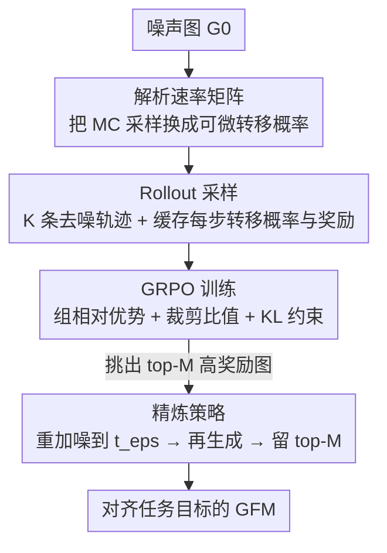

# Graph-GRPO: Training Graph Flow Models with Reinforcement Learning

**会议**: ICML 2026  
**arXiv**: [2603.10395](https://arxiv.org/abs/2603.10395)  
**代码**: https://github.com/Zhubaoheng/Graph-GRPO  
**领域**: 图学习 / 图生成 / 强化学习  
**关键词**: 图流模型, 离散流匹配, GRPO, 分子优化, 可微采样  

## 一句话总结
针对"图流模型（GFM）难以用强化学习对齐复杂目标"的痛点，本文提出 Graph-GRPO：先把 GFM 采样中不可微的蒙特卡洛速率矩阵推导成一个**解析表达式**，让整条去噪轨迹可微、可用 GRPO 训练；再配一个**精炼策略**对高分图反复"局部加噪—再生成"，在 50 步去噪下就在 Planar/Tree 上拿到 95.0%/97.5% 的 V.U.N.，并在分子优化（蛋白对接、PMO）上全面超过此前的图 RL 与遗传算法方法。

## 研究背景与动机

**领域现状**：图生成正从离散扩散转向**离散流匹配**范式，即所谓图流模型（Graph Flow Model, GFM，代表作 DeFoG）。GFM 把训练目标和采样过程解耦，用一个去噪器 $f_\theta$ 预测干净图，再通过连续时间马尔可夫链（CTMC）的速率矩阵 $R_t$ 一步步从噪声图采样出图，兼具高质量和灵活推理。

**现有痛点**：但 GFM 只会做"无条件"的从头生成（de novo），很难对齐到复杂的人类偏好或任务目标——例如药物发现要求生成高结合亲和、低毒性的小分子，这类目标只对应生成空间里一小块区域。直接用预训练 GFM 去采，绝大多数图是无效或低质量的。

**核心矛盾**：把 RL 接到 GFM 上有两个绕不开的硬骨头。其一，现代策略梯度要算新旧策略的概率比 $r=\pi_\theta(G_{t+\mathrm{d}t}\mid G_t)/\pi_{\text{old}}(G_{t+\mathrm{d}t}\mid G_t)$，这要求策略对每个动作的转移概率**可微**；可 GFM 的速率矩阵是靠**蒙特卡洛采样一个伪图** $\hat z_1$ 来估的，采样这一步把梯度流截断了，即便用 Gumbel-Softmax 强行续上，也会有"新旧模型采到不同伪图"导致训练—推理不一致的问题。其二，de novo 生成给出的奖励信号太稀疏（大部分图无效），RL 探索定位不到任务相关区域。

**本文目标**：让 GFM 能被端到端地 RL 训练，并在稀疏奖励下高效探索高潜力区域。

**切入角度**：作者发现速率矩阵的蒙特卡洛估计本质上是"对真实数据 $z_1$ 求期望"，既然类别有限，就可以**把这个期望解析地展开**，绕过采样。

**核心 idea**：用一个可预计算的**解析速率矩阵**替换蒙特卡洛采样，使 GFM 的 rollout 全程可微、可套用 GRPO；再用**精炼策略**对高奖励样本反复局部扰动再生成，把探索集中到高潜力区域。

## 方法详解

### 整体框架

Graph-GRPO 建立在预训练的 GFM（DeFoG，去噪器是带 RRWP 的图 Transformer）之上，把它当作策略模型 $\pi_\theta$，状态是当前图、动作是采样下一步图的节点和边。整条流水线是：从同一个噪声图 $G_0$ 出发，用**解析速率矩阵**算出可微的转移概率并采出一组 $K$ 条去噪轨迹（rollout），缓存每步转移概率与终点图的奖励；把奖励组内归一化成优势，用 GRPO 的裁剪目标加 KL 约束更新策略；最后用**精炼策略**挑出高分图反复"加噪—再生成"，进一步把生成质量推向任务目标区域。

### 关键设计

**1. 解析速率矩阵：把不可微的蒙特卡洛采样换成可微的闭式转移概率**

这是让 RL 能接上 GFM 的根。原版 DeFoG（算法 1）在每个去噪步先用去噪器预测分布 $p_\theta(\cdot\mid z_t)$，再**采样一个伪图** $\hat z_1\sim p_\theta(\cdot\mid z_t)$，用它去算条件速率矩阵 $R_t(z_t,z_{t+\mathrm{d}t}\mid \hat z_1)$（式 8），转移概率为 $p(z_{t+\Delta t}\mid z_t)=\delta(z_t,z_{t+\Delta t})+R_t\,\Delta t$。这个采样让转移概率对 $\theta$ 不可微，策略比值算不了。作者注意到无条件速率矩阵其实是对伪图求期望 $R_t(z_t,z_{t+\mathrm{d}t})=\mathbb{E}_{\hat z_1\sim p_\theta(\cdot\mid z_t)}[R_t(z_t,z_{t+\mathrm{d}t}\mid \hat z_1)]$，于是把它解析地展开（命题 3.1，算法 2）：

$$R_t^{\theta}(z_t,z_{t+\mathrm{d}t})=p_\theta(z_{t+\mathrm{d}t})\,V_1+\big(1-p_\theta(z_t)-p_\theta(z_{t+\mathrm{d}t})\big)\,V_2,$$

其中 $V_1=\frac{1+p_0(z_t)-p_0(z_{t+\mathrm{d}t})}{Z_t^{>0}(1-t)p_0(z_t)}$、$V_2=\frac{\mathrm{ReLU}(p_0(z_t)-p_0(z_{t+\mathrm{d}t}))}{Z_t^{>0}(1-t)p_0(z_t)}$ 只依赖先验分布 $p_0$ 和时间 $t$，**可在生成前预计算**。这样转移概率就成了去噪器预测 $p_\theta$ 的可微函数，不再需要采伪图——既续上了梯度流，又消除了"新旧模型采到不同伪图"造成的训练—推理不一致。

**2. 组相对策略优化（GRPO）的 rollout 与训练：在稀疏奖励下做组内对比**

有了可微转移概率，作者套用 GRPO 框架。Rollout 阶段：固定同一个噪声图 $G_0$，让 GFM 并行生成一组 $K$ 条轨迹 $\{\tau^{(k)}\}_{k=1}^K$，显式记录每条轨迹 $\tau^{(k)}=\{G_0,G_{\Delta t}^{(k)},\dots,G_1^{(k)}\}$ 及其逐步转移概率 $p(G_{t+\Delta t}^{(k)}\mid G_t^{(k)})$；到达终点用任务奖励函数算 $R^{(k)}=\mathcal{R}(G_1^{(k)})$（如结构有效性或对接分数）。训练阶段用**组相对优势**把奖励标准化 $A^{(k)}=\frac{R^{(k)}-\operatorname{mean}(\{R^{(i)}\})}{\operatorname{std}(\{R^{(i)}\})}$，配合裁剪过的重要性比值 $r_{t,\theta}^{(k)}=\frac{\pi_\theta(G_{t+\Delta t}^{(k)}\mid G_t^{(k)})}{\pi_{\text{old}}(G_{t+\Delta t}^{(k)}\mid G_t^{(k)})}$ 最大化目标 $\mathcal{L}_t^{(k)}=\min\big(r_{t,\theta}^{(k)}A^{(k)},\,\operatorname{clip}(r_{t,\theta}^{(k)},1\pm\epsilon)A^{(k)}\big)$，并加一项 $-\beta D_{\text{KL}}(\pi_\theta\Vert\pi_{\text{ref}})$ 把策略约束在预训练 DeFoG 附近。组内对比的好处是不需要单独的价值网络，用同一噪声图下的相对优劣就能给出稳定的优势估计，缓解了 de novo 奖励稀疏带来的高方差，同时 KL 约束防止 reward hacking、保住化学有效性。

**3. 精炼策略：对高分图"局部加噪—再生成"做定向探索**

只靠 de novo 采样，模型很难命中任务目标那一小块区域。作者维护一个优先级池 $\mathcal{B}$ 存当前奖励 top-$M$ 的图，每轮对池里的图做"重加噪 + 再生成"：先按条件概率路径 $p_{t_\epsilon\mid 1}(z_{t_\epsilon}\mid z_1)=t_\epsilon\cdot\delta(z_{t_\epsilon},z_1)+(1-t_\epsilon)\cdot p_0(z_{t_\epsilon})$ 把 $G_1$ 回退到中间噪声态 $t_\epsilon\in(0,1)$——$t_\epsilon$ 越大扰动越小，相当于只随机扰动局部节点和边；再让 GFM 从这些带噪图重新去噪生成多个候选，评分后与池中图比较、保留 top-$M$。重复多轮，生成分布就逐步收敛到高潜力区域。它本质上等价于"显式增加去噪步数 + 围绕好样本局部搜索"，在高度选择性的奖励（如 Valsartan SMARTS）上比从头生成有效得多。

### 损失函数 / 训练策略

整体目标沿用标准 GRPO：$\mathcal{J}(\theta)=\frac{1}{KT}\sum_{k=1}^K\sum_{t=1}^T\big(\mathcal{L}_t^{(k)}(\theta)-\beta D_{\text{KL}}(\pi_\theta\Vert\pi_{\text{ref}})\big)$。合成图任务的奖励是"硬有效性约束 + 软分布匹配"的组合：$R(G)=\mathbb{I}(G)\cdot\big(\alpha+\frac{1-\alpha}{|\mathcal{K}|}\sum_{k\in\mathcal{K}}S_k\big)$，其中 $\mathbb{I}(G)$ 是有效性指示，$\mathcal{K}=\{\text{deg},\text{clus},\text{orb}\}$ 是度/聚类/orbit 三类结构相似度，$\alpha=0.65$ 优先保证有效性、其余容量留给结构精修。分子任务的奖励则换成对接分数（DS）等。

## 实验关键数据

### 主实验

合成图生成（Planar / Tree，64 节点，5 次评测各生成 40 图，V.U.N. 越高越好、Ratio 越低越好）。Graph-GRPO 仅用 **50 步**去噪就压过用 1000 步的扩散与策略优化方法：

| 模型 | 步数 | Planar V.U.N.↑ | Planar Ratio↓ | Tree V.U.N.↑ | Tree Ratio↓ |
|------|------|------|------|------|------|
| DiGress | 1,000 | 77.5 | 5.1 | 90.0 | 1.6 |
| DisCo | 1,000 | 83.6 | - | - | - |
| GDPO | 1,000 | 73.8 | - | - | - |
| DeFoG（基座） | 50 | 95.0 | 3.2 | 73.5 | 2.5 |
| **Graph-GRPO** | 50 | **95.0** | **1.5** | **97.5** | **2.2** |

蛋白对接（ZINC250k，DS top 5% 越负越好、Hit Ratio 越高越好），Graph-GRPO 对每个靶点都大幅领先 RL 类（GDPO/DDPO/FREED）与基础生成类方法：

| 靶点 | 指标 | Graph-GRPO | GDPO | MOOD | DiGress |
|------|------|------|------|------|------|
| parp1 | DS top5%↓ | **-12.515** | -10.938 | -10.865 | -9.219 |
| parp1 | Hit Ratio↑ | **60.763** | 9.814 | 7.017 | 0.366 |
| jak2 | DS top5%↓ | **-11.123** | -10.183 | -10.147 | -8.706 |
| jak2 | Hit Ratio↑ | **52.897** | 13.405 | 9.200 | 0.861 |
| 5ht1b | Hit Ratio↑ | **46.634** | 34.359 | 18.673 | 4.236 |

### 消融实验

精炼策略的作用主要体现在不同难度任务上的差异（图 1）。在基础的 Scaffold Hopping 任务上，de novo 生成和带精炼几乎打平；但在高度选择性奖励的 Valsartan SMARTS 任务上，两者拉开明显差距，说明任务越难、目标区域越窄，精炼的"局部搜索"越关键。PMO benchmark（AUC-top10）上 Graph-GRPO 在冷启动（无预筛）设定下对多数 oracle 也优于 InVirtuoGen、Gen.GFN、Mol GA 等：

| 配置 / oracle | 关键指标 | 说明 |
|------|---------|------|
| de novo（基础任务） | ≈ 持平 | Scaffold Hopping 上精炼增益不明显 |
| + 精炼（难任务） | 显著领先 | Valsartan SMARTS 上拉开大差距 |
| Celecoxib Rediscovery（冷启动） | 0.890 vs 0.802(Gen.GFN) | 多数 PMO oracle 上领先 |
| Fexofenadine MPO（冷启动） | 0.984 vs 0.856 | 优势稳定 |

### 关键发现

- **解析速率矩阵是"能不能训"的开关**：没有它，GFM 的转移概率不可微，GRPO 的比值根本算不出来；有了它才有后续一切。这是方法最核心、也最有迁移价值的一步。
- **精炼的收益与任务难度强相关**：奖励越选择性（目标区域越窄），从头生成越难命中，反复局部扰动再生成的增益越大；在简单任务上则可有可无。
- **少步数高质量**：50 步去噪即超过 1000 步的扩散基线，说明 RL 对齐带来的提升不是靠堆采样步数，而是把生成分布真正挪向了目标区域。

## 亮点与洞察
- 把"对真实数据求期望"的蒙特卡洛速率矩阵解析展开成只依赖先验 $p_0$ 与 $t$ 的闭式 $V_1,V_2$，一步同时解决"不可微"和"训练—推理不一致"两个问题——这种"用解析期望替采样"的思路可迁移到其他离散扩散/流模型的 RL 微调。
- 精炼策略本质是"在采样阶段做围绕好样本的局部搜索"，把 RL 探索和推理时缩放（增加等效去噪步）统一起来，思路上接近图像扩散里的 SDEdit/迭代精修。
- 用 GRPO 而非 PPO，省掉价值网络、靠组内相对优势，天然适合"同一噪声图采一组轨迹"的图生成场景。

## 局限与展望
- 解析速率矩阵的推导依赖离散流匹配的具体形式（线性插值条件路径、co-design 速率矩阵），换成别的噪声调度或连续状态可能需要重推。
- 精炼引入额外超参（池大小 $M$、回退时刻 $t_\epsilon$、每轮候选数），论文正文未给系统的敏感性分析，实际迁移到新任务时调参成本未知。
- 奖励仍需可验证的 oracle（对接分数、结构相似度），对没有清晰打分函数的"软偏好"目标如何对齐尚未触及。

## 相关工作与启发
- **vs GDPO（图扩散策略优化）**：GDPO 在图扩散上做策略优化但用 1000 步、且未解决转移概率可微问题；Graph-GRPO 面向图流模型、用解析速率矩阵实现可微 rollout，50 步即全面超越 GDPO（如 parp1 Hit Ratio 60.8 vs 9.8）。
- **vs DeFoG（基座 GFM）**：DeFoG 只做无条件生成、靠蒙特卡洛采样估速率矩阵；本文在其上加 RL 对齐与精炼，Tree V.U.N. 从 73.5% 提到 97.5%。
- **vs 遗传算法 / 片段式 RL（Mol GA、f-RAG、REINVENT）**：这些方法在分子空间做离散搜索，Graph-GRPO 用可微的图流策略 + 局部精炼，在 PMO 冷启动设定下对多数 oracle 更优。

<!-- RELATED:START -->

## 相关论文

- [\[ACL 2026\] AgentGL: Towards Agentic Graph Learning with LLMs via Reinforcement Learning](../../ACL2026/graph_learning/agentgl_towards_agentic_graph_learning_with_llms_via_reinforcement_learning.md)
- [\[ICLR 2026\] Bures-Wasserstein Flow Matching for Graph Generation](../../ICLR2026/graph_learning/bures-wasserstein_flow_matching_for_graph_generation.md)
- [\[ICLR 2026\] Learning Concept Bottleneck Models from Mechanistic Explanations](../../ICLR2026/graph_learning/learning_concept_bottleneck_models_from_mechanistic_explanations.md)
- [\[ICML 2026\] Aitchison Embeddings for Learning Compositional Graph Representations](aitchison_embeddings_for_learning_compositional_graph_representations.md)
- [\[ICML 2026\] T-GINEE: A Tensor-Based Multilayer Graph Representation Learning](t-ginee_a_tensor-based_multilayer_graph_representation_learning.md)

<!-- RELATED:END -->
