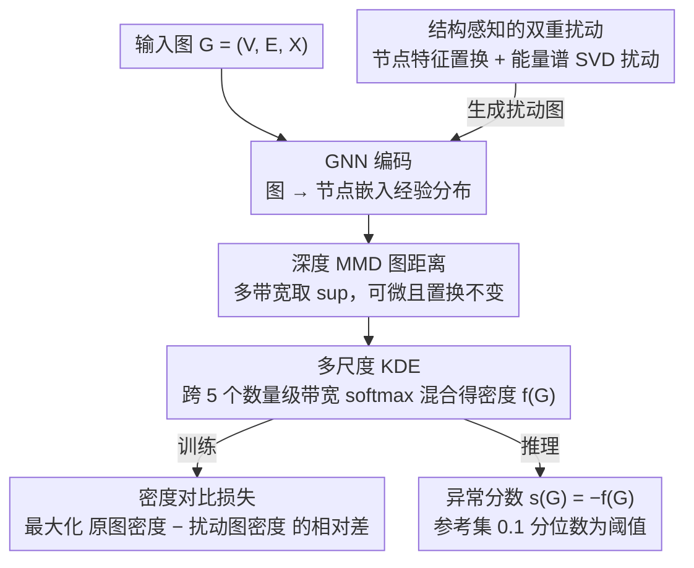

# Learnable Kernel Density Estimation for Graphs and Its Application to Graph-Level Anomaly Detection

**会议**: ICML 2026  
**arXiv**: [2505.21285](https://arxiv.org/abs/2505.21285)  
**代码**: 待确认  
**领域**: 图学习 / 图异常检测  
**关键词**: 图密度估计、核密度估计、深度 MMD、谱扰动、图级异常检测  

## 一句话总结
LGKDE 用一个可学习的深度 MMD 度量把每个图嵌成"节点分布"，再在该度量空间上叠加多尺度核密度估计，并通过"正常图密度高于其结构感知扰动版本"这一自监督对比信号端到端训练，从而首次为图级密度估计提供了既有一致性、收敛速率、鲁棒性、泛化界等理论保证、又在十余个图异常检测基准上稳定超越 GNN/对比/单类等强基线的统一框架。

## 研究背景与动机

**领域现状**：图级异常检测主流走两条路。一是"图核 + KDE"——用 WL 子树核、最短路径核、传播核等把图映射为相似度矩阵，再套经典核密度估计；二是"深度表示 + 距离/单类边界"——用图神经网络学嵌入，再接 SVDD（OCGIN）、对比学习（CVTGAD）、信息瓶颈（SIGNET）或重构（VAE）等代理目标做异常打分。

**现有痛点**：第一条路的核是手工特征且带宽固定，难以同时捕捉局部子结构与全局拓扑；第二条路则把"密度建模"换成了"形状先验"——要么强行假设正常区域是超球（hypersphere），要么完全跳过显式密度，导致没有理论保证、对图大小异质性敏感、容易把语义不同但形状相近的图误判为正常。

**核心矛盾**：图是非欧、离散、置换不变的结构化数据，"密度"既要在结构和语义两个层面都敏感，又要保持同构不变、可微分、能端到端训练；而经典核方法可证明却不灵活，深度方法灵活却失去可证明性，两条路一直没有汇合。

**本文目标**：构造一个端到端可训练的图密度估计器 $\hat f(G)$，使它（i）在置换不变前提下同时编码结构与节点特征；（ii）支持多尺度自适应带宽；（iii）具备一致性、收敛速率、鲁棒性与泛化界；（iv）天然适配图级异常检测——异常分数即 $s(G)=-\hat f(G)$。

**切入角度**：作者注意到，如果直接对所有训练图最大化密度，模型会塌缩到同一嵌入。但如果对每张正常图构造一个"结构感知的扰动版本"，并用"原图密度 > 扰动图密度"的相对差作为优化目标，就能既避免塌缩、又把"什么算偏离正常"的几何信息显式注入到 KDE 带宽与 MMD 度量里。

**核心 idea**：用深度 MMD 把图变成度量空间里的点，在该空间上学一个多尺度 KDE 混合密度，通过"密度对比损失 + 谱-特征双重扰动"端到端联合优化嵌入、带宽和混合权重——这是把可证明的核密度估计真正"穿进"GNN 的第一次系统性尝试。

## 方法详解

### 整体框架
LGKDE 要解决的是"如何给一张图算一个有理论保证的密度值"，难点在于图是非欧、置换不变的结构化对象，经典 KDE 没法直接套上去。它的做法是先把每张图 $G_i=(V_i,E_i,\mathbf{X}_i)$ 经 GNN 编码成节点嵌入集合 $\mathbf{Z}_i\in\mathbb{R}^{n_i\times d_{out}}$，把图看成 $n_i$ 个点的经验分布，再用深度 MMD 量出图与图之间的距离，最后在这条距离上叠一层多尺度高斯 KDE 得到密度 $\hat f(G)$。整个模型只优化 GNN 参数 $\bm\theta$ 与混合权重 $\bm\alpha$，训练信号是"正常图密度高于其结构感知扰动版本"这一相对差；推理时异常分数直接取 $s(G)=-\hat f(G)$，并以参考集密度的经验 0.1 分位数作为阈值。

### 关键设计

**1. 深度 MMD 图距离：把"图与图之间多远"做成可微、置换不变的度量**

KDE 需要一个图与图之间的距离作为输入，但传统图核要么用固定的手工特征、要么计算量随节点数爆炸，且无法反向传播到嵌入网络。LGKDE 把图 $G_i$ 表示成节点嵌入的经验分布 $\{\mathbf{z}_p^{(i)}\}_{p=1}^{n_i}$，用高斯核族 $\Gamma_{emb}=\{\gamma_1,\dots,\gamma_S\}$ 上的最大均值差异作为距离：

$$d_{MMD}(G_i,G_j)=\sup_{\gamma}\left(\frac{1}{n_i^2}\sum k_\gamma(\mathbf{z}_p^{(i)},\mathbf{z}_q^{(i)})+\frac{1}{n_j^2}\sum k_\gamma(\mathbf{z}_p^{(j)},\mathbf{z}_q^{(j)})-\frac{2}{n_i n_j}\sum k_\gamma(\mathbf{z}_p^{(i)},\mathbf{z}_q^{(j)})\right)^{1/2}$$

其中 $k_\gamma(\mathbf{u},\mathbf{v})=\exp(-\gamma\|\mathbf{u}-\mathbf{v}\|^2)$。这个形式对节点数 $n_i,n_j$ 自然取平均、对节点排列天然不变、且处处可微，因而梯度能一路传回 GNN；多带宽取 $\sup$ 则让距离自动捕捉多尺度结构差异，正好喂给下游对"距离质量"敏感的多尺度 KDE。

**2. 多尺度 KDE：让数据自己决定该用多粗的带宽**

图集合里分子图和社交网络的尺度跨度极大，单一带宽的 KDE 要么过平滑、要么过尖锐。LGKDE 在 MMD 距离上叠一组带宽 $\{h_k\}_{k=1}^{M}=\{10^{-2},10^{-1},1,10,10^{2}\}$ 跨 5 个数量级的高斯核，用 softmax 权重融合：

$$\hat f(G)=\sum_{k=1}^{M}\pi_k(\bm\alpha)\,\phi_k(G),\quad \pi_k(\bm\alpha)=\mathrm{softmax}(\alpha_k),\quad \phi_k(G)=\frac{1}{N}\sum_i K_{KDE}(d_{MMD}(G,G_i),h_k)$$

其中核 $K_{KDE}(d,h)=\frac{1}{C_{d_{int}}h^{d_{int}}}\exp(-\tfrac{d^2}{2h^2})$。一个关键观察是：MMD 把图压成 1D 距离，使内在维度 $d_{int}=1$（常数 $C_{d_{int}}=\sqrt{2\pi}$），因此 KDE 的收敛速率不再受图嵌入维度灾难拖累——这也是后面能写出 $O(N^{-0.8})$ MISE 界的根本原因。softmax 混合既让数据自己决定哪一档带宽主导（小分子偏小带宽、社交网络偏大带宽），又避免引入离散的带宽选择。

**3. 结构感知的双重扰动：造出"小幅低密度"的可控负样本**

如果直接对所有训练图最大化密度，模型会塌缩到同一个嵌入；而经典对比学习里随机增删边的增强又会破坏核心拓扑，让扰动样本"太异常"或"太相似"。LGKDE 为每张正常图 $G$ 造一组扰动版本 $\tilde G^{(j)}$ 同时从节点与结构两侧偏离：节点侧随机选 $r_{swap}|V|$ 个节点互换特征（保结构）；结构侧对邻接做 SVD $\mathbf{A}=\mathbf{U}\bm\Sigma\mathbf{V}^\top$，按累积能量阈值 $\tau_1=0.5,\tau_2=0.75$ 把奇异值分成高 $\mathcal{S}_h$/中 $\mathcal{S}_m$/低 $\mathcal{S}_l$ 三档，对高能档除以自适应比率 $r=\min(\mu_h/\mu_l,r_{max})$ 模拟"删主干边"、对低能档乘以 $r$ 模拟"加噪声边"，再重构 $\tilde{\mathbf{A}}=\mathbf{U}\tilde{\bm\Sigma}\mathbf{V}^\top$。能量谱扰动的好处是幅度可控：定理 4.4 给出 $\|\Delta_{\mathbf{A}}\|_2$ 的闭式上界，使 $\tilde G$ 与 $G$ 在密度上只"小幅低"而非"截然不同"，再配合定理 4.3 的 Lipschitz 性就能证出虚警率上界——这是 LGKDE 把可证性直接嵌进数据增强的一步。训练目标则用相对密度差而非硬负样本对比，既防塌缩又不把扰动图当成一个"异常类"，这与 GraphCL 等把增强视为正/负样本的对比学习有本质区别。

### 损失函数 / 训练策略
最终目标 $\min_{\bm\theta,\bm\alpha}\mathcal{L}=-\sum_{i=1}^{N}\sum_{j=1}^{N_{pert}}\frac{\hat f(G_i)-\hat f(\tilde G_i^{(j)})}{\hat f(G_i)}$，分母归一化让不同密度量级的图贡献均衡。理论上：定理 4.1 给出 $\hat f\xrightarrow{p}f^\ast$ 在 $L_1$ 范数下的一致性；定理 4.2 给出最优带宽 $h^\ast\sim N^{-1/(4+d_{int})}$ 下 MISE 达到 $O(N^{-4/(4+d_{int})})=O(N^{-0.8})$，匹配非参极小极大最优率；定理 4.3 + 4.4 + 推论 4.5 链式地从 MMD 鲁棒性传到密度鲁棒性，证明扰动幅度可控时虚警率有上界；定理 4.6 给出对未见图的泛化界，并指出 $\alpha$ 仅随 $\sqrt{n}$ 线性增长，因此对图大小差异不敏感。复杂度 $O(L(md+nd^2)+NSn^2 d)$，并可用附录 E.4.3 的近邻技巧降到 $O(L(md+nd^2)+QSn^2 d)$，$Q\ll N$。

## 实验关键数据

### 主实验
在 12 个公开图异常检测基准（MUTAG / PROTEINS / DD / ENZYMES / DHFR / BZR / COX2 / AIDS / IMDB-B / NCI1 / COLLAB / REDDIT-B）上对比图核、单类 GNN、对比/重构、信息瓶颈等四类共十余个基线（PK-SVM/iF、WL-SVM/iF、OCGIN、OCGTL、GLocalKD、iGAD、CVTGAD、SIGNET 等），评测 AUROC（%）与平均排名。

| 数据集 / 指标 | 本文 LGKDE | 之前 SOTA 代表 | 备注 |
|--------|------|----------|------|
| 平均 AUROC（12 个数据集） | 显著最高 | OCGIN / GLocalKD 等 | LGKDE 平均排名第 1，多数据集 Top-3 |
| MUTAG AUROC | 大幅领先 PK/WL 系列 | WL-iF 65.71 | PK-SVM 仅 46.06 反映手工核失效 |
| DD AUROC | 进一步超越 OCGIN 79.08 | OCGIN 79.08 | 验证多尺度 KDE 对大图有效 |
| 合成 ER 图密度恢复 | 峰值与 Beta(2,2) 的 $p=0.5$ 对齐 | 传统核难以恢复 | 直接验证密度估计正确性 |

> 注：原文 Table 1 把每个数据集 Top-3 用金/银/铜底色标出，LGKDE 在大多数数据集上占据金或银。

### 消融实验

| 配置 | 关键指标变化 | 说明 |
|------|---------|------|
| Full LGKDE | 基准 AUROC | MMD + 多尺度 KDE + 双扰动 |
| w/o 能量谱扰动（仅特征置换） | 显著下降 | 验证结构扰动对边界刻画的必要性 |
| w/o 节点特征扰动（仅谱扰动） | 中等下降 | 节点语义偏离同样重要 |
| 单带宽 KDE（M=1） | 下降，尤其在大图数据集 | 多尺度自适应是关键 |
| 用 WL/PK 替换 MMD 距离 | 大幅下降，回到经典核水平 | 深度 MMD 是表达力来源 |

### 关键发现
- 双扰动缺一不可：仅做节点特征置换（保结构）容易让模型只学到特征噪声；仅做能量谱扰动容易让模型忽略语义差异。两者互补刚好把"结构 + 语义"两种异常都覆盖。
- 带宽集合 $\{10^{-2},\dots,10^{2}\}$ 跨 5 个数量级，softmax 学到的权重在不同数据集差异显著——小分子数据偏好小带宽（结构敏感），社交网络数据偏好大带宽（粗粒度模式）。
- 谱扰动比随机边增删的对比样本质量更高（附录 B.5 敏感性分析），这与定理 4.4 中 $\|\Delta_{\mathbf{A}}\|_2$ 可解析控制一致。
- 复杂度近邻加速（用 $Q\ll N$ 个 anchor）几乎不掉点，使方法可推到大规模图集合。

## 亮点与洞察
- "原图密度高于扰动密度"这一极简自监督目标同时解决了三件事：避免表征塌缩、避免硬负样本假设、把可证性注入训练——这是 GraphCL 类对比学习一直没做到的，本质上是把分布外检测当成密度估计而非二分类。
- 能量谱扰动是少见的把"图操作可控性"与"理论 Lipschitz 界"绑在一起的设计，把 SVD 的能量比作为扰动幅度的旋钮，可直接喂进定理 4.4 的不等式，理论与实现一一对应。
- 用 MMD 让 $d_{int}=1$ 这一观察非常关键——它使得 KDE 的最优收敛速率不再受图嵌入维度灾难影响，是 LGKDE 能写出 $O(N^{-0.8})$ MISE 界的根本原因；这一技巧可迁移到其他"先投影到 1D 距离再 KDE"的非欧密度估计问题。
- 多带宽 softmax 混合比手工选带宽优雅得多，且可通过权重诊断数据集"结构尺度"——这本身就是一种可解释的图分析工具。

## 局限与展望
- 训练时每个 batch 都要算图与图之间的 MMD 矩阵，即使近邻加速后对超大规模图（百万张）仍较重；可探索在线/分桶 anchor 选择。
- 仅考虑无向、节点带连续特征的图，对异质图、动态图、超图的扩展需要重新定义谱扰动语义。
- 扰动幅度参数 $r_{max}=10$、能量阈值 $\tau_1,\tau_2$ 虽有附录敏感性分析但仍需手调；自适应版本（如按数据集谱熵决定）值得尝试。
- 异常分数 $-\hat f(G)$ 假设异常确实落在低密度区，对那种"两群正常 + 中间稀疏带"的多模态分布可能误报；可考虑结合局部密度比。

## 相关工作与启发
- **vs OCGIN / OCGTL（单类 GNN）**：他们假设正常区域是超球或经神经变换后的超球，本文用 KDE 直接刻画任意形状的密度等高线，几何先验更弱、表达力更强。
- **vs GLocalKD / CVTGAD（蒸馏/对比）**：他们用全局-局部蒸馏或跨视图对比作代理目标，本文则把目标显式写为密度比，理论上等价于在估计真实密度，可解释性与可证性都更直接。
- **vs SIGNET / iGAD（信息瓶颈/双判别）**：他们偏重可解释子图发现，本文偏重密度估计本身；两者互补，可考虑用 LGKDE 的密度梯度反查关键子结构。
- **vs 经典图核 + KDE**：把"固定核 + 固定带宽"换成"学到的 MMD + 学到的多尺度混合"，保留经典 KDE 的理论框架但去掉了手工特征的瓶颈，这是把统计学习与深度学习真正打通的范式样本。

## 评分
- 新颖性: ⭐⭐⭐⭐⭐ 首个把可证明 KDE 端到端嵌进 GNN 的图密度估计框架，能量谱扰动 + 密度对比的组合此前未见。
- 实验充分度: ⭐⭐⭐⭐ 12 个真实数据集 + 合成 ER/BA/WS 图 + 完整消融，理论侧 6 个定理，唯一缺憾是缺超大规模图实验。
- 写作质量: ⭐⭐⭐⭐ 动机—方法—理论—实验闭环清晰，公式推导扎实；部分理论细节挤到附录，主文密度较高。
- 价值: ⭐⭐⭐⭐⭐ 给图异常检测/OOD 检测提供了一个可证明 + 可训练的新基线，密度对比 + 谱扰动两个组件均可独立迁移。

<!-- RELATED:START -->

## 相关论文

- [\[ICML 2026\] ProMoS: Generalist Graph Anomaly Detection via Prototype-Based Distillation](generalist_graph_anomaly_detection_via_prototype-based_distillation.md)
- [\[ICML 2026\] Rethinking Feature Alignment in Generalist Graph Anomaly Detection: A Relational Fingerprint-based Approach](rethinking_feature_alignment_in_generalist_graph_anomaly_detection_a_relational_.md)
- [\[AAAI 2026\] BugSweeper: Function-Level Detection of Smart Contract Vulnerabilities Using Graph Neural Networks](../../AAAI2026/graph_learning/bugsweeper_function-level_detection_of_smart_contract_vulnerabilities_using_grap.md)
- [\[ICML 2026\] Anchor-guided Hypergraph Condensation with Dual-level Discrimination](anchor-guided_hypergraph_condensation_with_dual-level_discrimination.md)
- [\[ICML 2026\] MedCoG: Maximizing LLM Inference Density in Medical Reasoning via Meta-Cognitive Regulation](medcog_maximizing_llm_inference_density_in_medical_reasoning_via_meta-cognitive_.md)

<!-- RELATED:END -->
