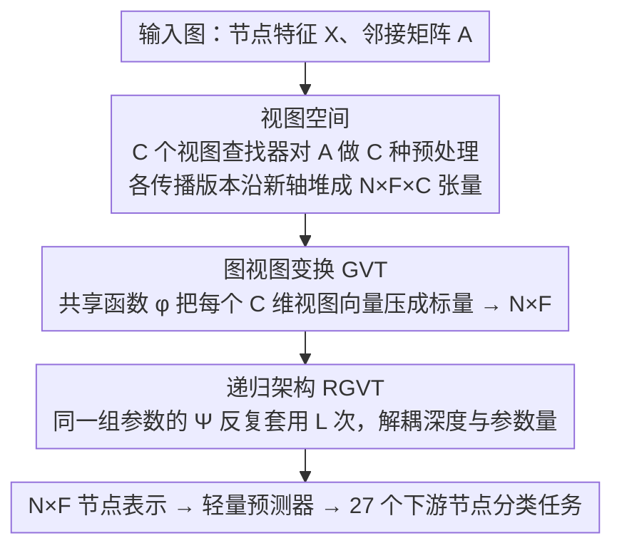

# View Space：跨任意图的表示学习

**会议**: ICML 2026  
**arXiv**: [2512.11561](https://arxiv.org/abs/2512.11561)  
**代码**: 待确认  
**领域**: 图学习 / 图神经网络 / 跨域迁移  
**关键词**: 图表示学习, 特征异构性, 完全归纳学习, 视图空间

## 一句话总结
本文提出视图空间概念，通过将图从 2 维（节点-特征）升到 3 维（节点-特征-视图），实现对任意特征维度和语义图的统一表示——首次让图模型像 NLP/CV 基础模型那样无需微调即可跨域推理，在 27 个下游任务上平均超越 GraphAny 8.93%。

## 研究背景与动机

**领域现状**：NLP 和 CV 中基础模型通过大规模预训练再轻量级适配就能跨数据集推理。这是因为这两个领域有标准化输入格式——NLP 中所有文本都分词成共享词表，CV 中所有图像都能 resize 到固定分辨率。

**现有痛点**：图数据的标准化极其困难。节点特征的维度和语义在数据集间差异巨大。现有 GNN 通过学习特征变换矩阵处理，跨特征空间泛化能力极弱。GraphAny 虽通过相对距离空间初步解决完全归纳问题但只能预测不能学表示。

**核心矛盾**：如何在保证特征维度对等（feature equivariance）的前提下让模型学到跨图、跨特征的通用知识？传统 2 维表示无法同时满足节点置换等变和特征置换等变。

**本文目标**：（1）形式化"完全归纳节点表示学习"（FI-NRL）；（2）发现图的第三个表示轴：视图空间；（3）设计参数化变换 GVT，证明其满足双重置换等变性；（4）实例化为递归架构 RGVT 验证跨任务泛化。

**切入角度**：所有图共享连通性属性。不同邻接矩阵预处理方式会强调图的不同结构侧面。可以将这些不同"视图"堆叠形成新维度，在统一视图空间里学习与特征维度无关的表示。

**核心 idea**：从 2 维表示升到 3 维——每个节点特征对 $(n,f)$ 都映射到 $C$ 维"视图向量"，$C$ 个维度分别对应 $C$ 种不同图结构视图。用共享的可学习函数处理这些视图向量，自动适配任意维度和语义特征。

## 方法详解

### 整体框架

要让一个图模型像 NLP/CV 基础模型那样跨任意图工作，难点在于不同图的特征维度和语义完全不对齐。本文的做法是给图表示加一个新维度：先把邻接矩阵的多种预处理结果堆成一个 $N \times F \times C$ 的三维张量，让每个"节点-特征"位置都拥有一个 $C$ 维的"视图向量"；再用一个跨所有位置共享的可学习函数把视图向量压成标量，得到与特征维度无关的 $N \times F$ 节点表示；最后让这套变换以共享参数递归套用若干次以匹配不同图的感受野。整个过程不在特征空间里放任何与维度绑定的参数，因此天然能吃下任意维度、任意语义的特征。

### 关键设计

**1. 视图空间：用第三个轴换取双重置换等变性**

完全归纳学习要求模型对两件事都不敏感：换节点顺序时表示同步重排（节点置换等变 R1），换特征顺序时表示同步重排（特征置换等变 R2）。传统 2 维的节点-特征矩阵 $\bm{X} \in \mathbb{R}^{N \times F}$ 同时满足这两点很困难，因为一旦在特征维度上放变换矩阵就破坏了特征置换等变。本文的关键观察是：所有图都共享"连通性"这一属性，而不同的邻接矩阵预处理方式会强调结构的不同侧面，于是可以把这些不同"视图"堆叠成一个全新的、与特征无关的轴。具体地，对每个位置取出 $C$ 维视图向量 $\bm{v}_{n,f} = \bm{\mathsf{X}}_{n,f,:}$，它记录该节点-特征对在 $C$ 个不同结构视角下的响应值。由于视图维度 $C$ 只由预定义的视图查找器集合决定，与图规模 $N$、特征维度 $F$ 都无关，任何图都被统一表示成 $N \times F$ 个 $C$ 维向量——这正是图领域一直缺失的"标准化输入格式"。

**2. 图视图变换 GVT：在视图空间做参数化换取动态聚合**

有了视图空间，参数就全部放在视图维度上而非特征维度上，从而绕开了显式特征变换矩阵 $\bm{W}$，自动满足特征置换等变。GVT 形式化为

$$\Psi(\bm{X}, \bm{A}) = \big[\,\phi(\bm{\mathsf{X}}_{n,f,:} \mid \theta)\,\big]_{n,f},$$

分两步执行：先通过对 $\bm{A}$ 应用 $C$ 个视图查找器 $\{\nu_c\}_{c=1}^C$、把各传播版本 $\nu_c(\bm{A})\bm{X}$ 沿新维度堆叠升到 3D；再对每个位置 $(n,f,:)$ 用同一个可学习降维函数 $\phi$ 压成标量。当 $\phi$ 取非线性时，把它做 Taylor 展开可以证明 GVT 等价于一种"节点-特征级动态聚合"——每个 $(n,f)$ 对应的聚合权重都不一样，这使其表达能力超过 GCN 这类静态、对所有节点共用同一套聚合系数的方案。

**3. 递归架构 RGVT：解耦参数化与传播深度**

不同图对感受野的需求差异很大，但如果靠堆叠多个不同参数的层来加深，既会参数爆炸，又把"深度"和"参数量"绑死。受 RNN 启发，RGVT 用同一组共享参数把 $\Psi$ 反复套用 $L$ 次：

$$\bm{Z} = \Psi(\cdot, \bm{A} \mid \theta)^L(\bm{X}).$$

这样参数化和深度被解耦——预训练只学一份 $\theta$，面对每个新图时只需挑一个合适的递归次数 $L$，无需重新优化编码器，就能匹配该图特有的信息传播范围。

## 实验关键数据

### 主实验

预训练在 OGBN-Arxiv 上，迁移到 27 个下游节点分类数据集：

| 数据集分组 | OGBN-Arxiv | 有符号稠密 | 无符号稠密 | 稀疏 | 二值稠密 | 二值稀疏 | One-hot | 平均 |
|----------|-----------|-------------|-------------|--------|-----------|-----------|----------|-----|
| 线性预测器 | 52.44 | 53.29 | 75.67 | 66.41 | 72.18 | 57.11 | 38.86 | 59.41 |
| MLP 预测器 | 53.80 | 55.08 | 75.86 | 69.02 | 72.88 | 57.65 | 39.34 | 60.43 |
| GraphAny (Wisconsin) | 57.77 | 59.12 | 71.78 | 81.61 | 83.44 | 55.25 | 52.68 | 64.72 |
| GraphAny (Cora) | 58.58 | 59.38 | 71.76 | 81.49 | 83.35 | 53.40 | 53.30 | 64.30 |
| GraphAny (Arxiv) | 58.63 | 59.70 | 72.62 | 81.68 | 83.56 | 54.18 | 53.02 | 64.71 |
| **RGVT + Linear** | **70.14** | **64.95** | **76.44** | **84.33** | **85.11** | **62.77** | **58.85** | **70.03** |
| **RGVT + MLP** | **71.11** | **66.37** | **77.12** | **83.98** | **84.86** | **63.87** | **62.48** | **71.13** |

RGVT 比 GraphAny 最佳变体平均提升 +8.93%（MLP）或 +7.24%（线性）。

### 消融实验

| 配置 | OGBN-Arxiv | 有符号稠密 | 无符号稠密 | 稀疏 | 二值稠密 | 二值稀疏 | One-hot | 平均 |
|----|-----------|---------|---------|-----|--------|--------|--------|-----|
| RGVT + MLP（完整）| 71.11 | 66.37 | 77.12 | 83.98 | 84.86 | 63.87 | 62.48 | 71.13 |
| 去掉非线性 | 70.22 | 64.53 | 75.89 | 78.82 | 84.16 | 61.12 | 56.13 | 68.12 |
| 去掉递归 | 70.91 | 63.73 | 73.79 | 82.61 | 83.90 | 53.29 | 54.53 | 65.73 |
| 同时去掉两者 | 70.53 | 61.69 | 75.10 | 77.52 | 84.57 | 53.41 | 54.73 | 64.96 |

### 关键发现
- 去掉非线性导致下降 2.31 个百分点。
- 去掉递归导致下降 5.40 个百分点。
- 与 12 个数据集特定 GNN 对比，RGVT + MLP 平均超越最强基线 UniMP +3.30%（71.13 vs 68.86）。

## 亮点与洞察
- **图的第三个表示轴**：突破二维表示限制，将连通性信息抽象为"视图"维度，与特征维度正交。
- **双重置换等变性的充要条件**：论文给出形式化定义和充要条件，为其他跨域图学习提供理论基准。
- **节点-特征级动态聚合**：通过 Taylor 展开揭示非线性 GVT 的表达能力——每个节点-特征对都能有自己的聚合权重分布。
- **参数化-深度解耦**：受 RNN 启发让模型预训练后灵活选择递归深度。
- **可迁移的知识**：在 arXiv 上学到的视图空间知识能直接迁移到完全不同特征集合的 27 个下游任务。

## 局限与展望
- 设计权衡——GVT 在每个特征维度独立学习无法显式建模跨特征交互。
- 预测器训练成本——仍需对每个下游任务训练轻量级预测器。
- 递归深度选择开销——需为每个数据集训练多个预测器选最优 $L$。
- 适用范围——主要聚焦节点分类，扩展到边/图分类、超图还需探索。

## 相关工作与启发
- **vs 传统 GNN（GCN、GAT、GraphSAGE）**：他们通过显式特征变换矩阵处理特征跨图泛化差；本文避免这种参数化直接在视图空间做计算。
- **vs GraphAny**：GraphAny 通过相对距离空间的注意力机制做预测只能输出标签；本文表示学习方案更灵活支持多种下游预测器。
- **vs 表格基础模型（TabR、TabM）**：通过合成数据预训练跨特征空间泛化但不利用图结构；本文利用连通性作为超越特征空间的新轴。
- **启发**：（1）"升维"思路可借鉴到其他跨域问题；（2）置换等变性形式化框架有助于设计其他完全归纳模型。

## 评分
- 新颖性: ⭐⭐⭐⭐⭐  视图空间概念创新，首次形式化完全归纳学习。
- 实验充分度: ⭐⭐⭐⭐⭐  27 下游任务 + 多特征类型 + 详细消融 + 12 GNN 对比。
- 写作质量: ⭐⭐⭐⭐⭐  逻辑清晰、形式化严谨。
- 价值: ⭐⭐⭐⭐⭐  解决图学习长期难题，为图基础模型奠定基础。

<!-- RELATED:START -->

## 相关论文

- [\[ICML 2026\] Message Tuning Outshines Graph Prompt Tuning: A Prismatic Space Perspective](message_tuning_outshines_graph_prompt_tuning_a_prismatic_space_perspective.md)
- [\[CVPR 2026\] R2G: A Multi-View Circuit Graph Benchmark Suite from RTL to GDSII](../../CVPR2026/graph_learning/r2g_multi_view_circuit_graph_benchmark_suite_from_rtl_to_gdsii.md)
- [\[CVPR 2025\] Coeff-Tuning: A Graph Filter Subspace View for Tuning Attention-Based Large Models](../../CVPR2025/graph_learning/coeff-tuning_a_graph_filter_subspace_view_for_tuning_attention-based_large_model.md)
- [\[NeurIPS 2025\] Bridging Graph and State-Space Modeling for Intensive Care Unit Length of Stay Prediction](../../NeurIPS2025/graph_learning/bridging_graph_and_state-space_modeling_for_intensive_care_unit_length_of_stay_p.md)
- [\[ICML 2026\] T-GINEE: A Tensor-Based Multilayer Graph Representation Learning](t-ginee_a_tensor-based_multilayer_graph_representation_learning.md)

<!-- RELATED:END -->
