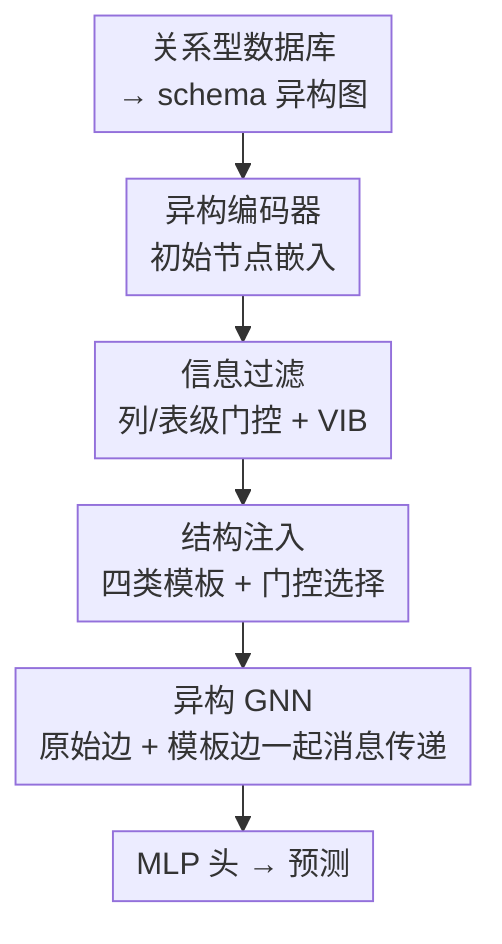

# What Makes a Desired Graph for Relational Deep Learning?

**会议**: ICML 2026  
**arXiv**: [2606.08491](https://arxiv.org/abs/2606.08491)  
**代码**: https://github.com/cy623/Structural_Optimizer_RDL.git  
**领域**: 图学习 / GNN / 关系型深度学习  
**关键词**: 关系型深度学习, 异构图, 图结构学习, 信息瓶颈, 结构注入

## 一句话总结
这篇论文指出"把数据库 schema 机械转成图"并不是 GNN 想要的图，它系统性地存在**信息过载**和**语义碎片化**两大病灶；作者提出一个端到端的"结构优化器"，用可学习门控做**信息过滤**、用模板化的**结构注入**补回任务相关连边，在 RELBench 的 26 个任务上既提精度又常常降低推理开销。

## 研究背景与动机
**领域现状**：关系型深度学习（Relational Deep Learning, RDL）的标准做法是把关系型数据库（RDB）按 schema 转成异构图——每张表是一类节点、每条外键约束是一类边，然后直接拿异构 GNN 在上面做消息传递来预测。Fey 等人 2024 年的 blueprint、REL-GNN、RelGT 都沿着这条路在卷模型架构。

**现有痛点**：问题在于，RDB 的 schema 是为"存储完整性 + 查询效率"设计的（遵循 2NF/3NF/BCNF 这些范式来消除数据冗余），它的组织目标和 GNN 想要的"短路径、局部连通"根本不是一回事。机械映射出来的图因此有两个系统性失败：

- **信息过载（information overload）**：数据库里大量字段和实体类型（如 ID、日志字段）跟预测目标几乎无关，映射成图后只增加表征复杂度，不带预测信号。
- **语义碎片化（semantic fragmentation）**：范式化把一个本该直接的关系拆成一串外键链。比如"用户—商品"的交互在库里被存成"User→Order→OrderItem→Item"，GNN 要走 3-4 跳才能恢复一个概念上一步就到的依赖，既加深了计算、又让信号在长路径上衰减。

**核心矛盾**：保留所有表和关系能维持数据库语义，却恰恰掩盖了对预测最关键的关系结构——**schema 图 ≠ 任务忠实图**。

**本文目标**：抛开"再设计一个更强的模型架构"，回到更根本的问题——到底什么样的图才是 RDL 想要的图？

**切入角度**：作者认为想要的图不是原始 schema，而是它的一个**任务相关变换**，需要两个互补操作：一边**删掉**对目标贡献小的结构和属性，一边**注入**直接暴露推理所需依赖的连边。图构建因此不是 schema→拓扑的前向映射，而是被学习目标引导的"压缩 + 增强"受控过程。

**核心 idea**：把图构建当成两个算子（过滤 + 注入）的受控过程，用一个端到端可训练的结构优化器自动学"删什么、加什么"，让图从过载与碎片化收敛到紧凑且任务对齐的拓扑。

## 方法详解

### 整体框架
整体流程是：输入一个关系型数据库 → 按标准方式转成时序一致的异构图 → 异构编码器给每个节点初始嵌入 → 依次过两个结构算子（**信息过滤** 压掉冗余特征/表，**结构注入** 补回任务相关连边）→ 优化后的图喂进异构 GNN 做消息传递 → MLP 头出预测。关键在于过滤和注入都用**可学习门控** + **ℓ₀ 稀疏惩罚**驱动，整张图的结构是被任务损失端到端"学"出来的，而不是人工设计的。

作者特意强调：注入用的是**可解释的模板**（同质修复、时序连续等带语义身份的算子），而不是自由参数化的任意连边。这是用"科学可解释性"换"最大灵活性"——一个无约束的结构学习器也许能刷更高的分，但产出的是黑箱拓扑，提炼不出"任务↔motif"的可复用规律。

### 关键设计

**1. 信息过滤：把过滤当成"结构容量旋钮"而非简单降噪**

针对信息过载，作者用一个**两级层次门控**在不同粒度上抑制冗余。列级（column-level）给每类节点 $T_i$ 一个可学习门控向量 $g_{T_i}\in[0,1]^{d_i}$，逐元素乘到初始特征上 $\hat{h}_v = g_{T_i}\odot h_v^{(0)}$；表级（table-level）再给每类节点一个标量门 $s_{T_i}\in[0,1]$，得到 $\tilde{h}_v = s_{T_i}\cdot\hat{h}_v$。为了既能近似离散选择又保持可微，门控用 **Hard-Concrete 松弛**参数化：

$$g_{T_i}=\sigma\!\left(\frac{\log u-\log(1-u)+\theta_{T_i}}{\tau}\right)\cdot(\zeta-\gamma)+\gamma,\quad u\sim\text{Uniform}(0,1)^{d_i}$$

训练时门是随机的、可以加 $\ell_0$ 风格的稀疏惩罚，推理时退化成确定性硬选择 $g_{T_i}=\mathbb{I}[\sigma(\theta_{T_i})>\tau_g]$。这个设计之所以有效，是作者实证发现过滤呈**倒 U 形**：过滤太弱留下语义噪声导致过平滑/信号稀释，过滤太强则抹掉任务相关证据——想要的图不是最稀疏也不是最全的，而是在"去噪"和"保信息"之间取任务相关平衡。一个反直觉的结论是**语义稀疏化打败统计剪枝**：基于方差保留高方差特征（VarFilter）并不稳定优于原图，因为 RDB 里很多高方差属性只是"统计上活跃但因果上无关"的运营痕迹。

**2. 结构注入：把加边当成"motif 选择"，只补任务真正需要的关系模式**

过滤治不了语义碎片化——当 schema 把交互拆成多跳链，GNN 需要过深才能恢复依赖。结构注入通过**加边修复缺失的关系 motif** 来解决，但加边不是免费午餐：盲目加边会扭曲邻域、引入有害归纳偏置。作者因此把注入设计成四类**可解释模板**，并实证哪种 motif 配哪类任务：

- **Type-wise KNN（同质修复）**：在同类型内把节点连到 top-$n$ 最相似的同伴（余弦相似度），强化类内同质性。
- **Two-hop Shortcuts（拓扑修复）**：给长链 $A\to B\to C$ 直接加捷径边，把高阶依赖的消息传递深度压短。
- **Behavioral Similarity（协同修复）**：对经关系 $r$ 相连的 $A,B$ 两类节点，聚合每个 $A$ 节点的 $B$ 类邻居再算两两相似度，相似度超阈值 $\tau_{\text{sim}}$ 就连边，暴露被 join 路径打散的协同信号。
- **Temporal Continuity（因果修复）**：把同一实体按时间排序的记录 $[v_1,\dots,v_m]$ 顺次连边 $E_{\text{time}}=\{(v_{t-1},v_t)\}$，显式建模状态转移。

实证规律很清晰：**分类任务**最吃同质修复（KNN），**回归任务**最吃时序连续，**推荐任务**最吃行为相似；而错配的 motif 会掉点（如给时序任务硬加 shortcut）。结论是想要的图不由边密度刻画，而由"拓扑是否注入了任务相关归纳偏置"刻画。

**3. 模板门控 + 统一目标：让"加什么"也变成可学习、可稀疏的选择**

在端到端优化器里，每个实例化模板 $\mathcal{E}_k$ 都配一个可学习门 $g_k\in[0,1]$（同样 Hard-Concrete 参数化）。训练时把 $g_k$ 当作模板消息的连续权重 $z_{v,k}^{(l)}=g_k\cdot\text{AGG}(z_u^{(l)}:u\in\mathcal{N}_k(v))$ 以保可微，推理时硬选择只保留 $g_k>\tau_k$ 的模板，得到稀疏增强图。每个模板边被当成一类独立的关系类型，和原始外键关系一起进异构 GNN 消息传递。整个模型用如下统一目标端到端训练：

$$\mathcal{L}=\mathcal{L}_{\text{task}}(\hat{Y},Y)+\beta_{\text{vib}}\sum_{T_i}\tfrac{1}{|T_i|}\sum_{v\in T_i}\text{KL}\big(q(z_v\mid\tilde{h}_v)\,\|\,\mathcal{N}(0,I)\big)+\lambda\Big(\sum_{T_i}\mathbb{E}\|g_{T_i}\|_0+\lambda_s\sum_{T_i}\mathbb{E}\|s_{T_i}\|_0\Big)+\lambda_k\sum_{k}\mathbb{E}\|g_k\|_0$$

四项分别是：监督损失、类型级**变分信息瓶颈（VIB）**（在硬门控之上再加连续信息压缩，把 $\tilde{h}_v$ 映到随机隐变量 $z_v=\boldsymbol{\mu}(\tilde{h}_v)+\boldsymbol{\sigma}(\tilde{h}_v)\odot\epsilon$）、过滤门的 $\ell_0$ 稀疏惩罚、注入模板门的 $\ell_0$ 稀疏惩罚。这样"删什么"和"加什么"被放进同一个可微目标里联合学习。

### 损失函数 / 训练策略
核心理论支撑是把"想要的图"定义成 $\phi_g^\star\in\arg\min_{\phi_g}\{\mathcal{R}^\star(\phi_g)+\Omega(\phi_g)\}$：既要在优化编码器后能拿到好性能，又要结构按稀疏正则 $\Omega(\phi_g)$ 足够简单。作者还给出两条定理直觉——**过滤控制结构容量**：Bernoulli 门的期望稀疏度 $\mu=\mathbb{E}\|M\|_0$ 给门控配置的熵设了上界 $H(M)\le J\,h(\mu/J)$，稀疏区间内随 $\mu$ 单调，正好解释倒 U 形（过滤太少留下大量含噪配置，太多则过度限制结构）；**注入扩大搜索空间**：当模板门可学习且被惩罚时，加候选边在理想总体设定下不会让最优正则目标变差，因为优化器总能把有害模板门置零。

## 实验关键数据

### 主实验
在 RELBench 的 26 个任务（分类 / 回归 / 推荐）上评测，对手覆盖 GBDT（LightGBM）、异构 GNN（HAN/GTN/HGSL）、RDL 专用模型（REL-GNN/RelGT）以及 LLM 结构方法（LLM-Struct）。分类用 ROC-AUC（↑），回归用 MAE（↓），推荐用 MAP（↑）。

| 任务（指标） | Base | 之前最好 | 本文 |
|--------------|------|----------|------|
| study-outcome (AUC↑) | 69.44 | 70.86 (REL-GNN) | **72.35** |
| driver-top3 (AUC↑) | 81.48 | 83.57 (LLM-Struct) | **86.82** |
| user-repeat (AUC↑) | 78.75 | 80.64 (HGSL) | **82.36** |
| driver-position (MAE↓) | 3.88 | 3.69 (LLM-Struct) | **2.13** |
| study-adverse (MAE↓) | 45.50 | 44.62 (RelGT) | **41.28** |

优化后的图在分类、回归、推荐三类任务上一致超过原始 schema 图和现有 RDL pipeline，且常常同时降低推理成本（连边/特征被稀疏掉）。

### 消融实验
论文的核心"消融"其实是第 3 节的**结构探针实验**（9 个 RELBench 任务），用来揭示过滤/注入的规律：

| 配置 | 现象 | 说明 |
|------|------|------|
| RandFilter | 普遍掉点（如 study-outcome 69.44→63.21） | 随机过滤破坏有用结构 |
| VarFilter（高方差保留） | 不稳定，不一定优于 Base | 方差≠预测信号，运营字段虚高 |
| FullFilter（语义门控） | 多数任务最佳（如 driver-top3 84.66） | 语义稀疏化 > 统计剪枝 |
| 注入·匹配 motif | 对应任务族提升 | 分类↔KNN、回归↔时序、推荐↔行为相似 |
| 注入·错配 motif | 中性甚至掉点 | 给时序任务加 shortcut 反而伤害 |

### 关键发现
- **过滤是 bias-variance 旋钮，呈倒 U 形**：随过滤强度（稀疏权重 $\lambda$）增加，性能先升后降，峰值在中间区间——最优图既非最稀疏也非最全。
- **注入要对症下药**：加边只在注入了任务真正依赖的关系 motif 时才有用，错配会掉点；价值由"是否暴露任务相关依赖"而非边密度决定。
- **可解释模板换来可迁移规律**：约束用语义模板（而非自由连边）虽牺牲了一点上限，却换来"分类要同质、回归要因果、推荐要协同"这类能跨数据库复用的结论。

## 亮点与洞察
- **把"图构建"本身当成可学习的优化对象**：跳出"卷模型架构"的内卷，指出 RDL 性能从一开始就被 schema→图 的转换卡住，转而优化图本身——这是一个被长期忽视却很根本的切口。
- **"语义稀疏化打败统计剪枝"很反直觉也很实用**：高方差属性在 RDB 里常是 ID/日志这类运营痕迹，靠方差选特征会被带偏；这条经验可直接迁移到任何表格→图的预处理里。
- **task↔motif 对照表是可复用的工程指南**：分类→KNN 同质、回归→时序连续、推荐→行为相似，给"该往关系图里加哪种边"提供了现成的先验。
- **过滤的倒 U 形 + 熵上界定理**：把"图不是越稀疏越好"这一经验用结构容量的熵界形式化，给调 $\lambda$ 提供了理论直觉。

## 局限与展望
- **模板是人工设计的有限集**：四类语义修复 motif 覆盖了常见依赖，但遇到模板表达不了的复杂关系模式（如高阶超图结构）可能力不从心；作者也承认无约束结构学习器上限更高。
- **依赖时间戳与时序一致采样**：时序连续修复只对带时间戳列的节点类型实例化，对无时间信息的库帮助有限。
- **超参较多**：过滤阈值 $\tau_g$、相似度阈值 $\tau_{\text{sim}}$、各项稀疏权重 $\lambda/\lambda_s/\lambda_k$、VIB 权重 $\beta_{\text{vib}}$ 都需调，跨数据库的鲁棒性需进一步验证。
- **可改进方向**：把模板从"枚举 + 门控"升级为"按任务自动生成 motif"，或把过滤/注入做成可与不同 GNN backbone 解耦的即插即用预处理层。

## 相关工作与启发
- **vs REL-GNN / RelGT**：它们改的是**模型**（原子路径、图 transformer tokenization），假设输入图是给定的；本文改的是**图本身**，指出性能上界被初始转换约束，二者正交可叠加。
- **vs HGSL / GTN（异构图结构学习）**：这些方法假设输入图已有语义有意义的基础拓扑、只做精修；但 RDB 图的连通性由 schema 和外键决定、反映的是数据组织而非任务语义，所以本文从"过载 + 碎片化"这个 RDB 特有视角重新定义了结构优化。
- **vs LightGBM / XGBoost（传统两步法）**：传统做法靠 SQL 特征工程 + 表格模型，无法捕捉实体间的结构信息；本文端到端在图上学，并把结构选择也纳入优化。

## 评分
- 新颖性: ⭐⭐⭐⭐⭐ 把"什么是好图"提成一等公民问题，过滤+注入双算子框架视角新颖
- 实验充分度: ⭐⭐⭐⭐⭐ 26 个任务覆盖分类/回归/推荐，外加系统的结构探针消融
- 写作质量: ⭐⭐⭐⭐ 经验规律→理论→优化器的递进清晰，符号偏密
- 价值: ⭐⭐⭐⭐⭐ task↔motif 对照与"语义稀疏化"洞察对 RDL 工程有直接指导意义

<!-- RELATED:START -->

## 相关论文

- [\[ICLR 2026\] Relatron: Automating Relational Machine Learning over Relational Databases](../../ICLR2026/graph_learning/relatron_automating_relational_machine_learning_over_relational_databases.md)
- [\[ACL 2026\] What Makes AI Research Replicable? Executable Knowledge Graphs as Scientific Knowledge Representations](../../ACL2026/graph_learning/what_makes_ai_research_replicable_executable_knowledge_graphs_as_scientific_know.md)
- [\[ICML 2026\] Deep Neural Sheaf Diffusion](deep_neural_sheaf_diffusion.md)
- [\[ICML 2026\] Generative Representation Learning on Hyper-relational Knowledge Graphs via Masked Discrete Diffusion](generative_representation_learning_on_hyper-relational_knowledge_graphs_via_mask.md)
- [\[ICLR 2026\] Relational Graph Transformer](../../ICLR2026/graph_learning/relational_graph_transformer.md)

<!-- RELATED:END -->
