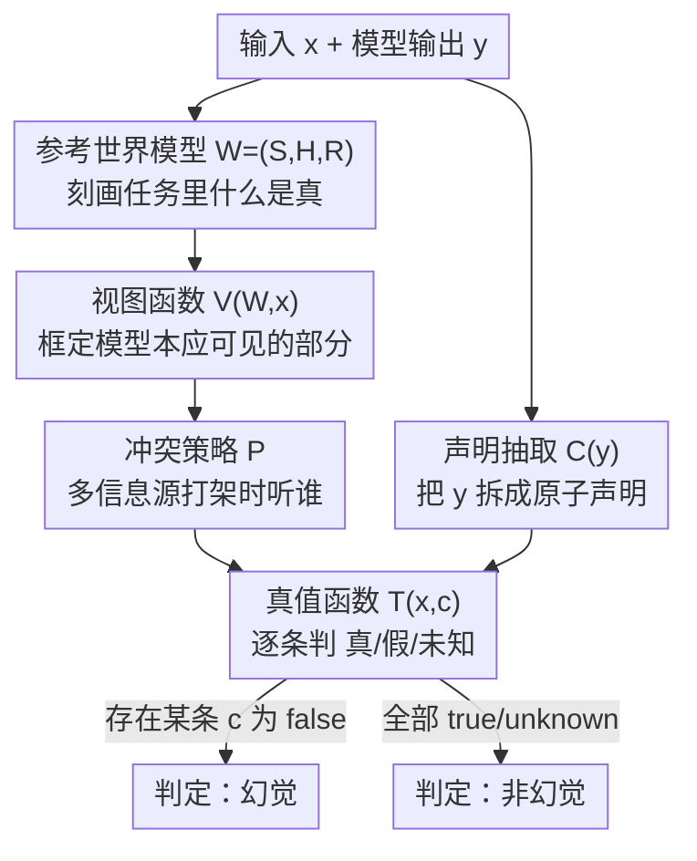

# A Unified Definition of Hallucination: It's The World Model, Stupid!

**会议**: ICML2026  
**arXiv**: [2512.21577](https://arxiv.org/abs/2512.21577)  
**代码**: 待确认（配套 benchmark 为 HalluWorld，Liu et al. 2026）  
**领域**: 幻觉 / LLM 评测理论  
**关键词**: 幻觉定义, 参考世界模型, 冲突策略, 评测基准, position paper

## 一句话总结
这是一篇 position paper，主张把翻译、摘要、开放问答、RAG、多模态、智能体等各路"幻觉"统一成同一件事——**对一个"参考世界模型"的、用户可见的、不准确的世界建模**：每个场景只是对"参考世界 $W$、视图函数 $V$、冲突策略 $P$"三件套做了不同选择，从而把碎片化的定义收敛成一个可比较、可生成大规模基准的通用模板。

## 研究背景与动机
**领域现状**：从 2019 年神经机器翻译里第一次提出"hallucination"开始，这个词随着任务不断被改写——摘要里指"不被原文支持的内容"，开放问答里指"与真实世界事实不符"，VLM 里指"与视觉证据冲突"，智能体里指"与环境状态不符的动作"。每个子领域都按自己的"真相来源"私下定义了一套幻觉。

**现有痛点**：定义碎片化导致一些最基本的问题都答不清楚。论文开篇用了一个绝妙的例子：上下文给定"夏洛克·福尔摩斯住在贝克街 221B 号"，问"福尔摩斯住哪？"，模型答"福尔摩斯是虚构人物，没有真实地址"——这算不算幻觉？摘要研究者会说算（违背了原文），开放问答研究者会说不算（这话本身是真的）。同一个输出，结论相反。于是"某方法把幻觉降低了 40%"到底在度量什么、能不能跨场景迁移，都无从谈起。

**核心矛盾**：问题不是缺一个好定义，而是**定义太多、各自捕捉了幻觉的不同侧面**，且每个定义都**隐式**假设了一个"真相来源"却从不言明：这个来源是什么、模型能看到它的哪部分、当多个信息源冲突时听谁的。

**本文目标**：不是再发明一个新定义去和旧的争，而是给出一个能把旧定义全部"装进去"的上位框架，强迫每个评测把自己隐含的假设摊到台面上。

**切入角度**：作者观察到，所有场景的共同结构是"模型输出 vs 我们认定为真的东西"之间的失配；差异只在于"我们认定什么为真"。把"真相"形式化成一个可变的对象，差异就被参数化了。

**核心 idea**：用一句话概括——**幻觉 = 对参考世界模型 $W$ 的、用户可观测的、不准确的世界建模**；旧定义不过是对 $(W, V, P)$ 三件套的不同取值。

## 方法详解
这是一篇理论/立场论文，"方法"是它提出的形式化框架本身，而非可训练的算法。整套框架要回答的是：给定一个模型输出，怎么**判定**它是否幻觉，且这个判定规则能覆盖所有任务形态。

### 整体框架
框架把"判定幻觉"拆成一条清晰的流水线：先用一个**参考世界模型** $W=(\mathcal{S},\mathcal{H},\mathcal{R})$ 刻画"在这个任务里什么是客观真的"；再用**视图函数** $V(W,x)$ 框定"针对输入 $x$，模型本应能看到世界的哪一部分"；用**冲突策略** $P$ 规定"当多个信息源（知识库 / 上下文 / 参数记忆）打架时听谁的"；用**真值函数** $T_{W,P}(x,c)\in\{\text{true},\text{false},\text{unknown}\}$ 给任意原子声明 $c$ 判真假；最后把模型输出 $y$ 经**声明抽取** $C(y)$ 拆成一组可判定的原子声明，逐条过 $T$。判据极其简洁：只要存在一个可观测声明 $c\in C(y)$ 使 $T_{W,P}(x,c)=\text{false}$，就判定 $y$ 幻觉。

### 关键设计

**1. 参考世界模型 $W=(\mathcal{S},\mathcal{H},\mathcal{R})$：把"真相"从含糊的"知识"变成可指定的结构**

旧定义的根子病是把"真相"当成一团说不清的"世界知识"。本文把它显式化成一个三元组：$\mathcal{S}$ 是可能的世界状态集合，$\mathcal{H}$ 是可能的交互历史（指令、对话、日志），$\mathcal{R}$ 是约束哪些 $(s,h)\in\mathcal{S}\times\mathcal{H}$ 合法的规则。关键在于，作者强调 $W$ 是"我们**希望**模型内部世界模型对齐到的金标准"，而不是模型自己那个可能残缺的内部表征；并且 $W$ **不绑定任何具体表示**——它可以被实例化成模拟器、数据库、状态机、形式文法、知识库、源文档或一段可执行程序。正是这种"不绑定表示"让它能同时容纳摘要的源文档和开放问答的真实世界事实。论文也点明：固定的 ground-truth 标签只是 $W$ 的一个特例（$W$ 静态、$T$ 退化成"在答案集里查表"），而智能体这类部分可观测场景，真值依赖状态、历史和已执行动作（如"agent 能看到物体 X"取决于之前是否开过门），静态标签根本表达不了这种条件依赖。

**2. 视图函数 $V$ 与冲突策略 $P$：把"模型能看到什么"和"听谁的"显式拆开**

同一个世界 $W$，模型被允许看到多少、以及信息源冲突时怎么裁决，会直接改变"什么算幻觉"。视图函数 $V(W,x)\subseteq\mathcal{S}\times\mathcal{H}$ 选出对输入 $x$ 相关、且模型本应可见的那一块；冲突策略 $P$ 则规定诸如"知识库覆盖上下文文本""检索文档优先于参数记忆""DOM 是可见页面的唯一真相"这类裁决规则。这一拆解直接解释了开篇的福尔摩斯悖论：摘要场景里 $P$ = 源文档为唯一真相，于是"没有真实地址"违背源文，算幻觉；开放问答场景里 $P$ = 真实世界为真，于是同一句话不算幻觉。换句话说，**结论之争其实是 $V$、$P$ 取值之争**，框架把这层争论从"幻觉与否"前移到"你假设的世界和裁决规则是什么"。

**3. 真值函数 $T_{W,P}$ 与原子声明 $C(y)$：把自由文本判定落到可判定单元，并给出幻觉的充要式**

要让判定可操作，必须把自由文本 $y$ 切成能逐条判真假的原子声明 $C(y)$，再让真值函数给每条声明赋 $\{\text{true},\text{false},\text{unknown}\}$。幻觉的形式定义就是

$$\exists\, c\in C(y)\ \text{s.t.}\ T_{W,P}(x,c)=\text{false}.$$

作者特别强调声明抽取要**保留认知状态**："X 是真的"和"X 很可能是真的"不能塌缩成同一条；只有当模型给出可证伪的陈述（如"X 有 70% 概率为真"）才纳入框架；无法判定的声明应标 unknown 而非自动判幻觉。这一点把"判不出"和"判错"区分开，避免框架把模型的诚实不确定性误伤成幻觉。$C(y)$ 的作用不是消灭自然语言里的一切歧义，而是把"被评判的单元"显式化、可检视。

**4. 把幻觉从"一切错误"里切出来：与规划错误、激励/奖励错误划界**

当前用法把好几种失败模式都一锅煮成"幻觉"。本文用 $W$ 这把尺子把它们切开：**世界建模错误**——模型对世界的内部图景就是错的（这才是幻觉）；**规划错误**——世界图景基本正确，但选了个差动作或差计划；**激励/奖励错误**——模型其实知道自己不确定，却被训练/提示成无论如何都给出自信回答。框架只把第一类认定为幻觉。一句话点睛：**错误是关于输出的，幻觉是关于输出所隐含的那个世界的**——一个智能体选了次优但忠实于环境的计划只是规划失误；而它声称点了一个 DOM 里根本不存在的按钮，才是幻觉（它的世界模型错了）。这条划界也顺势把"改 $V$ 的缓解法（更好的检索 / 更丰富的环境状态）"和"改 $T_{W,P}$ 的缓解法（外部校验器 / 弃答训练 / 校准）"和"改进模型内部对 $W$ 的逼近"三类干预手段区分开。

### 一个完整示例：四个领域走一遍同一把尺子
论文用四个跨领域案例展示同一框架如何落地，每个案例都显式写出 $W$、$V$、$P$，再让 $T$ 给声明判真假：

- **摘要**：源文说"TechCorp 营收 21 亿、未达 23 亿预期"，模型输出却说"超出预期、CEO 盛赞强劲表现"。$P$ = 源文为唯一真相 → 声明"超出预期""盛赞强劲表现"被判 false → 内在矛盾型幻觉。
- **开放问答**：问"2023 诺贝尔文学奖得主"，模型答"村上春树"。$V(W,x)$ 为空（模型只能靠参数记忆），但 $W$ 仍存在；真实得主是 Jon Fosse → 声明 false → 事实型幻觉。这个例子专门说明：即使模型"看不到"世界，幻觉判据依然成立。
- **RAG**：检索文档已写明"Freedonia 是虚构国家、无首都"，模型却编出"首都是 Freedstadt、人口两百万"。$P$ = 检索文档覆盖参数记忆 → "首都是 Freedstadt"判 false；而"人口两百万"判 **unknown**（虚构世界里未知，不强判幻觉）——示范了 unknown 这一档的必要性。
- **智能体网页操作**：DOM 里只有 `confirm-btn` / `cancel-btn`，模型却输出 `click(button#submit-btn)` 并自述"我正在点 Submit"。$P$ = DOM 为唯一真相 → 声明"存在 id 为 submit-btn 的按钮"判 false → 模型幻觉出了不存在的元素（区别于"信念正确但动作错"的规划失误）。

四个案例的差异完全被 $W/V/P$ 的不同取值吸收，判据始终是同一条 $T_{W,P}(x,c)=\text{false}$。

## 实验关键数据
作为 position paper，本文不含传统的模型对比实验，其"实证"在于：(1) 用框架统一复盘四类领域；(2) 把框架当作诊断清单去审视现有 benchmark 的"显式程度"；(3) 用国际象棋示范如何从一个完全可指定的世界里**自动**生成大规模、标签由构造确定的幻觉基准。

### 四领域在统一框架下的归约

| 场景 | 参考世界 $W$ | 视图 $V$（可见输入） | 冲突策略 $P$ | 幻觉类型 |
|------|--------------|----------------------|--------------|----------|
| 摘要 | 源文档 | 完整文档 | 文档为真 | 内在矛盾 |
| 开放问答 | 真实世界事实 | 仅参数记忆 | 真实世界为真 | 事实错误 |
| RAG | 检索语料 + 世界知识 | 检索文档(+记忆) | 文档覆盖记忆 | 与检索证据矛盾 |
| 智能体 | 环境 DOM | DOM 观测 | 环境为真 | 观测幻觉 |

### 用框架当"诊断清单"审视现有 benchmark

| Benchmark | $V$（视图）是否显式 | $W$（参考世界）是否显式 | 框架诊断 |
|-----------|---------------------|--------------------------|----------|
| FavaBench | 显式（检索日志暴露 $V$） | 较显式 | grounding 较好 |
| HALoGEN | 部分（结构化任务暴露 $V$） | 部分需另行指定 | 部分 grounded |
| HaluEval | 弱 | 弱（多跳场景含糊） | 需更显式的 $C(y)$，部分用例仍歧义 |

### 关键发现
- **benchmark 的分歧未必来自模型行为差异，而来自"评测世界被显式化的程度"不同**：把现有基准放进框架，会发现它们在"是否讲清 $W$、是否暴露 $V$、是否定义 $P$、$C(y)$ 是否可检视"上参差不齐——这把框架变成了一份 benchmark 设计的诊断清单。
- **完全可指定的世界 → 可无标注自动生成基准**：以国际象棋为例，世界 $W$ 就是棋局状态空间 + 规则，状态 $s$ 是某个具体局面、$h$ 是走子历史；文档生成器产出棋盘文字描述或 PGN 记谱当上下文，查询生成器抛出"黑方是否一步杀？""白方最佳走法及理由？"等问题，真值函数直接对照棋规裁定（如"白方一步吃掉黑后"在有兵挡路的局面里就是矛盾）。由于标签由构造自动确定，可以**主动搜索模型更易幻觉的设定**来加难度，且配方可推广到 NetHack、Crafter 等其它环境（配套基准 HalluWorld 即覆盖网格世界、国际象棋与终端任务）。
- **与"探测潜在世界模型"研究的区别**：象棋类语言模型研究通常问"模型内部是否学到了准确的棋盘表征、能否走强棋"，度量是 Elo、合法走子率、隐状态线性可解码性；本文则把环境当作**显式的外部参考世界**来判定输出声明真假，目的不同。

## 亮点与洞察
- 最"啊哈"的一点是把"幻觉与否"之争**前移**：很多场景里两个研究者吵的不是模型对错，而是隐含的 $W/V/P$ 不同——框架强迫大家先声明世界假设，争论自然消解。
- `unknown` 这一档很关键：它把"诚实的不确定"和"自信的编造"分开，避免框架把弃答/概率化表述误伤成幻觉，这是很多现有评测忽略的盲点。
- "错误是关于输出、幻觉是关于输出隐含的世界"这句划界可直接迁移到智能体评测：把幻觉、规划错误、指令不遵从分开统计，能更精准地定位 agent 的失败根因。
- "完全可指定的世界 → 标签由构造确定 → 无需人/LLM 标注"这条思路，给"造大规模、可控难度、可自动判分的幻觉基准"指了一条可落地的路。

## 局限与展望
- **声明抽取 $C(y)$ 仍是框架外包的设计决策**：框架假设 $y$ 能被映射成可判定的原子声明，但怎么抽、抽得准不准，本文不解决——而这恰是自由文本评测里最难、最易引入噪声的一环。
- **框架是"判定语言"而非"缓解算法"**：它让评测更可比、更显式，但本身不直接降低幻觉率；论文也坦承缓解工作只是被它重新归类（改 $V$ / 改 $T$ / 改内部 $W$）。
- **可指定世界的覆盖面有限**：象棋、网格世界这类世界能被程序完全指定，但开放域真实世界事实的 $W$ 仍难以完整、无歧义地写下来，自动生成基准的红利主要落在合成/封闭环境。
- **改进思路**：把声明抽取也纳入框架做形式化约束（如要求抽取保持认知状态的可验证协议），并探索"部分可指定世界"下如何近似 $T$，让红利从封闭环境向半开放域延伸。

## 相关工作与启发
- **vs 机制导向的统一尝试（Fang et al. 2024）**：他们从"幻觉**为什么**发生、缓解应在何处介入"的机制视角统一；本文是互补的——先形式化"**什么**才算幻觉"，让基准与论断跨任务可比。
- **vs 各类 factuality / 细粒度 span 级 benchmark（Ji et al. 2023、Mishra et al. 2024、Ravichander et al. 2025、Bang et al. 2025）**：这些工作都隐式地把幻觉定义在某个固定参考源上（静态、单轮、对照外部真相）；本文论证它们都是 $(W,V,P)$ 某个取值下的特例，并指出它们把幻觉框成"静态单轮判定"而非"内部世界表征/时序决策的失败"。
- **vs VLM 幻觉框架（HallusionBench, Guan et al. 2024）**：HallusionBench 把幻觉重构为"参数先验 vs 上下文理解"的知识冲突（语言幻觉 / 视觉错觉）；本文把这种冲突归入 $P$（如何裁决先验与视觉证据），纳入同一上位结构。

## 评分
- 新颖性: ⭐⭐⭐⭐⭐ 把碎片化的幻觉定义收敛成 $(W,V,P,T,C)$ 一套可参数化的上位框架，并据此把判定之争前移到"世界假设之争"，视角很干净。
- 实验充分度: ⭐⭐⭐ 作为 position paper 无传统对比实验，靠四领域归约 + benchmark 诊断 + 象棋案例支撑，说服力够但缺定量验证（定量留给配套的 HalluWorld）。
- 写作质量: ⭐⭐⭐⭐⭐ 福尔摩斯/诺奖/Freedonia/DOM 四个例子层层递进，把抽象形式化讲得极有画面感。
- 价值: ⭐⭐⭐⭐ 给幻觉评测提供了通用语言和可自动生成基准的方法论，对 benchmark 设计与缓解方法归类都有实际指导意义。

<!-- RELATED:START -->

## 相关论文

- [\[CVPR 2025\] Stop Learning It All to Mitigate Visual Hallucination, Focus on the Hallucination Target](../../CVPR2025/hallucination/stop_learning_it_all_to_mitigate_visual_hallucination_focus_on_the_hallucination.md)
- [\[ICLR 2026\] Copy-Paste to Mitigate Large Language Model Hallucinations](../../ICLR2026/hallucination/copy-paste_to_mitigate_large_language_model_hallucinations.md)
- [\[ACL 2025\] Hallucination Detox: Sensitivity Dropout (SenD) for Large Language Model Training](../../ACL2025/hallucination/hallucination_detox_send.md)
- [\[CVPR 2026\] Tell Model Where to Look: Mitigating Hallucinations in MLLMs by Vision-Guided Attention](../../CVPR2026/hallucination/tell_model_where_to_look_mitigating_hallucinations_in_mllms_by_vision-guided_att.md)
- [\[CVPR 2026\] One Token, Two Fates: A Unified Framework via Vision Token Manipulation Against MLLMs Hallucination](../../CVPR2026/hallucination/one_token_two_fates_a_unified_framework_via_vision_token_manipulation_against_ml.md)

<!-- RELATED:END -->
