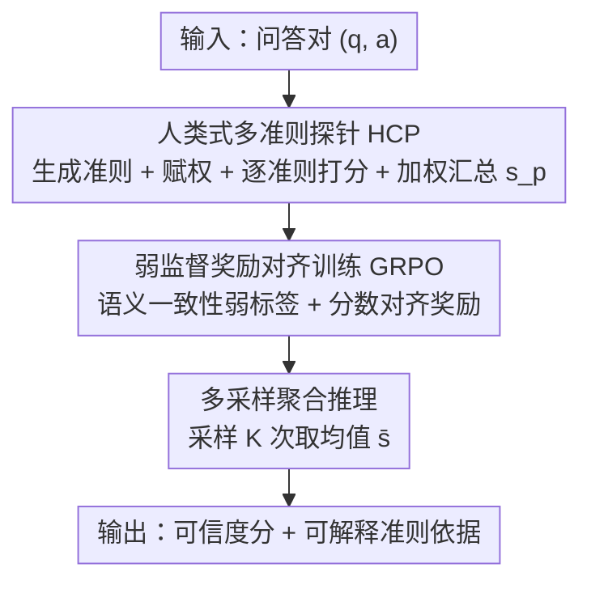

# Zero-source LLM Hallucination Detection with Human-like Criteria Probing

**会议**: ICML2026  
**arXiv**: [2606.12900](https://arxiv.org/abs/2606.12900)  
**代码**: https://github.com/TRISKEL10N/HCPD  
**领域**: 幻觉检测 / LLM安全  
**关键词**: 幻觉检测, 零源约束, 多准则探针, GRPO, 弱监督对齐

## 一句话总结
HCPD 把"零源（zero-source，只看问答文本对、拿不到模型内部状态也没外部知识库）幻觉检测"做成"模仿人类评审"的多准则探针——让一个 LLM agent 针对每个问答对自适应生成一组可解释评判准则、赋权、逐准则打分再加权汇总成可信度分；用语义一致性的弱监督 + GRPO 训练这个 agent，推理时多次采样取平均，在 4 个 QA 数据集、多个目标模型上 AUROC 大幅超过现有方法。

## 研究背景与动机
**领域现状**：LLM 会"幻觉"——生成事实错误、无依据或不忠于用户意图的内容，可靠的幻觉检测是安全部署的前提。现有检测方法大体分四类：检索/事实核查（需外部知识库）、基于置信度/内部状态（需 token logits 或隐层表示）、自一致性（多次采样比对）、以及直接训练分类器。

**现有痛点**：真实开放场景常处于严格的**零源约束**下——第三方审核方（社交平台、新闻机构）要审海量用户上传文本却不知道背后是哪个 LLM；绝大多数终端用户也只通过网页接口拿到纯文本输出。于是商业 API、内部状态、外部知识库统统不可用，检测只能靠观测到的问答对 $(q,a)$。在此约束下：检索/事实核查没知识库可用；置信度/内部状态法拿不到 logits 或隐层；自一致性法用的是静态、任务无关的启发式，抓不住跨领域、上下文相关的精细判断；而且多数检测器只输出二值标签或标量分，缺乏可解释性。

**核心矛盾**：零源约束把所有"外挂信号"都掐断了，只剩文本本身；可幻觉又是异质的——可能是事实错误、逻辑谬误或语义错位，单一静态准则根本覆盖不全。"只有文本可用"和"需要多维度、上下文自适应的判断"之间存在张力。

**本文目标**：在纯文本 $(q,a)$ 输入下，做出既自适应、又可解释、还稳定的幻觉判断。

**切入角度**：作者观察到人类专家从不用单一刚性规则判断对错，而是把评估拆成多个维度（事实性、逻辑性、时序一致性、上下文忠实度……），按内容动态调整各维度权重，并给出有据可循的判断。这种"上下文相关的多准则加权"带来两个好处：自适应（聚焦每个实例最该查的点）和可解释（能指出违反了哪条准则）。

**核心 idea**：让一个 LLM agent 模仿人类评审——自适应生成准则、赋权、逐准则打分再汇总，把"单一打分"换成"多准则探针"。

## 方法详解

### 整体框架
HCPD（Human-like Criteria Probing for zero-source hallucination Detection）的核心是一个 HCP 探针机制。给定问答对 $(q,a)$，一个 LLM agent $f_\theta$ 先自适应生成一组细粒度准则 $\{c_i\}$ 及其上下文相关权重 $\{w_i\}$，再对每条准则逐一打分 $\{s_i\}$，最后加权汇总成总可信度分 $s_p$。为让 agent 具备这种自适应判断能力，用语义一致性的弱监督 + GRPO 强化学习训练它（无需人工标注的幻觉标签）；推理时对同一实例独立采样 $K$ 次取平均，压掉生成随机性。论文还给出训练对齐、采样集中、排序误差三条理论保证。

### 关键设计

**1. 人类式多准则探针机制（HCP）：把单一打分换成可解释的多维度评判**

现有零源方法要么只给一个标量分、要么用一条静态规则，既抓不住异质幻觉、又不可解释。HCP 让 agent $f_\theta$ 对每个 $(q,a)$ 输出结构化、逐准则的评估。具体地，它先从预定义的通用评估准则集 $\mathcal{C}=\{\text{Factual},\text{Logical},\text{Semantic},\text{Temporal},\text{Social}\}$ 里自适应派生出一组细粒度具体准则 $\{c_i\}_{i=1}^m$，再给每条准则赋上下文相关权重 $\{w_i\}$（如历史类问题强调时序准确、科学解释强调逻辑严密），逐准则打 1–10 的整数分 $s_i$，最后加权汇总：

$$s_p=\sum_{i=1}^m w_i\cdot s_i,\quad \{(c_i,w_i,s_i)\}_{i=1}^m\leftarrow f_\theta(q,a;\mathcal{C})$$

其中 $w_i\ge 0$ 且 $\sum_i w_i=1$。agent 被约束以严格结构化格式输出，每条准则都报告权重、支持/反驳该回答的证据、以及对应分数。举例（论文 Table 1）：问"1948 年冬奥会在哪国举办"、答"挪威"，agent 派生出 Factual Grounding（权重 60%）、Temporal Consistency（20%）、Semantic Precision（20%）三条准则，分析指出实际在瑞士圣莫里茨、属明显事实错误，最终给出低分 1。这样既能对每个实例聚焦最该查的维度（自适应），又能通过"具体违反了哪条准则"解释负判断（可解释），把人类评审"多维度、按内容调权"的特性搬进检测器。

**2. 弱监督的奖励对齐训练（GRPO）：不靠幻觉标注就教会 agent 怎么打分**

要让 agent 学会精准的自适应判断，得有训练信号，但人工标注幻觉严重度昂贵且几乎不可得。HCPD 用语义一致性作弱监督：从带人工核验答案的 QA 数据集（如 TriviaQA）出发，对每个问题 $q$ 用辅助 LLM 生成一批从正确到明显幻觉的候选答案 $\{a^{(n)}\}$，用 BLEURT 等一致性指标算每个候选与参考答案 $\hat{a}$ 的相似度 $\text{sim}(\hat{a},a^{(n)})\in[0,1]$，再离散成 1–10 的弱标签：

$$s_l^{(n)}=\text{clip}\big(\lfloor 10\cdot\text{sim}(\hat{a},a^{(n)})\rceil,\,1,\,10\big)$$

参考答案本身赋满分 10（相似度 >0.5 视为相对忠实、否则标为幻觉）。训练用 GRPO（组相对策略优化）：对同一输入采样一组输出、以组内平均奖励作隐式 baseline 构造组相对优势 $A_g=r(Y_g)-\frac{1}{G}\sum_j r(Y_j)$，并用 KL 正则约束不偏离初始策略以保生成质量。奖励直接比对预测分 $s_p$ 和弱标签 $s_l$：

$$r=\begin{cases}1-\dfrac{|s_p-s_l|}{9},&\text{输出格式良好}\\[4pt]0,&\text{否则}\end{cases}$$

完美匹配（$s_p=s_l$）得 $r=1$，偏差越大奖励线性递减；格式不合规导致没法可靠抽取分数则直接 $r=0$，等于把"结构化输出"也约束进奖励里。作者特意选**可微分打分**而非二值"True/False"分类：① 分级打分更贴合幻觉严重度的连续谱（从轻微失实到完全编造）；② 按误差幅度惩罚比二值奖励信号更稠密、更利于策略优化；③ 标量分推理时可按不同阈值灵活权衡精确率-召回率，无需重训。

**3. 多采样聚合推理与理论保证：用平均压掉生成随机性、并给出可证可靠性**

LLM 生成本身有随机性，单次评估方差不可忽略。HCPD 推理时对同一 $(q,a)$ 独立调用训练好的 agent $K$ 次，得到一组总分 $\{s_p^{(k)}\}_{k=1}^K$，算术平均得鲁棒估计 $\bar{s}=\frac{1}{K}\sum_k s_p^{(k)}$。这套"训练 + 推理"被三条理论结果支撑：Theorem 1（训练期望对齐）表明优化 KL 正则的 GRPO 目标会把期望解析分 $\mu_\theta(x)$ 在分布上推向弱标签 $s_l(x)$，即 $\mathbb{E}_x[|\mu_\theta(x)-s_l(x)|]\le\mathcal{J}'(\theta)$；Proposition 1（多采样集中）给出 Hoeffding 集中界 $\mathbb{P}(|\bar{s}(x)-\mathbb{E}[S_\theta(x)]|\ge u)\le 2\exp\big(-\frac{2Ku^2}{(10-1)^2}\big)$，说明方差随 $K$ 指数级被压；Corollary 1（排序误差分解）把检测排序误差上界拆成"内在可分性 + 训练对齐损失 $\mathcal{J}'(\theta)$ + 多采样集中项"三部分，明确显示更小的训练对齐损失和更大的采样数 $K$ 都降低误差界，为方法的两个核心设计提供了理论依据。

## 实验关键数据

### 主实验
在 TriviaQA / SciQ / NQ Open / CoQA 四个 QA 数据集、LLaMA-3.1-8b 与 Qwen-3-8b 两个目标模型上以 AUROC（%）评测；♣ 表示需全标注数据训练的方法。

| 目标模型 | 方法 | TriviaQA | SciQ | NQ Open | CoQA | Avg. |
|----------|------|----------|------|---------|------|------|
| LLaMA-3.1-8b | SelfCKGPT | 74.58 | 59.68 | 62.13 | 70.61 | 66.75 |
| LLaMA-3.1-8b | SAPLMA♣ | 78.51 | 85.63 | 76.23 | 71.58 | 77.99 |
| LLaMA-3.1-8b | TSV♣ | 79.78 | 80.01 | 70.17 | 69.31 | 74.82 |
| LLaMA-3.1-8b | **HCPD** | **86.25** | **86.04** | **90.38** | **90.07** | **88.19** |
| Qwen-3-8b | SAPLMA♣ | 78.11 | 86.63 | 72.86 | 80.28 | 79.47 |
| Qwen-3-8b | **HCPD** | **93.69** | **92.63** | **87.35** | **84.80** | **89.62** |

HCPD 仅靠 $(q,a)$ 输入，在 LLaMA-3.1-8b 上平均 AUROC 88.19%，比第二好方法（SAPLMA 77.99%）高 10.20%；在 Qwen-3-8b 上 89.62%，高出第二好 10.15%。在跨目标模型迁移（Table 3，源模型训练后迁到 7 个不同家族/规模目标模型）中，HaloScope、TSV 等因代理模型特征分布漂移明显退化，而 HCPD 在自然语言空间工作、模型无关，迁移到未见目标模型仍稳定保持高分。

### 消融实验

| 配置 | TriviaQA AUROC | 说明 |
|------|----------------|------|
| Self-evaluation（baseline） | 56.07 | 标准自评基线 |
| HCPD（仅 HCP，Pre-RL） | 66.54 | 只加多准则探针，+10.47 |
| HCPD（HCP + GRPO，Post-RL） | 86.25 | 再加奖励对齐训练，+19.71 |

| 设计选择 | TriviaQA | CoQA | 说明 |
|----------|----------|------|------|
| 可微分打分（-D） | 86.25 | 90.07 | 完整设计 |
| 二值打分（-B） | 79.06 | 51.75 | 退化成二分类，CoQA 暴跌 |

### 关键发现
- **两大组件各自有效、训练贡献更大**：仅 HCP 探针就把 56.07 提到 66.54（+10.47），再叠加 GRPO 弱监督对齐又涨到 86.25（+19.71），说明"多准则探针"提供了可解释框架、而"奖励对齐训练"才是把分数校准到位的主力。
- **可微分打分远胜二值分类**：换成二值奖励后 TriviaQA 从 86.25 跌到 79.06、CoQA 从 90.07 暴跌到 51.75，因为二值信号丢掉了幻觉严重度，靠近决策阈值的样本极易误判。
- **采样数 $K$ 越大越稳但有成本**：$K$ 从 1 增到 5，TriviaQA AUROC 85.21→86.25、NQ Open 86.89→90.38，但推理时间从 0.23s 线性增到 1.13s；权衡后取 $K=5$。HCPD 速度与轻量指标相当、快于一致性类方法，且对大目标模型（如 LLaMA-3.1-70b）因模型无关而更省算力。

## 亮点与洞察
- **把"零源检测"重新形式化并对标人类评审**：作者是首个显式把幻觉检测形式化在零源约束下、并用"自适应生成准则 + 赋权 + 汇总"模仿人类多维判断，跳出了单一标量打分的范式，且天然带可解释性（能指出违反了哪条准则）。
- **用语义一致性当弱监督、绕开幻觉标注**：把 BLEURT 相似度离散成 1–10 弱标签来训 agent，彻底摆脱昂贵的人工幻觉标注，这套"用现成一致性指标造弱标签"的思路可迁移到其他缺标注的评判任务。
- **理论与设计一一对应**：三条定理不是装饰——Theorem 1 解释为什么 GRPO 能对齐、Prop 1 解释为什么要多采样、Corollary 1 把误差拆成可优化的三项，直接为"训练 + 多采样"两个设计背书，难得地把方法选择和理论界扣在一起。

## 局限与展望
- **弱标签天花板**：监督信号来自 BLEURT 等一致性指标，本身是真值因素 $s^\star$ 的有偏代理（论文记 $s_l=g(s^\star)+\epsilon$），当一致性指标与真实事实性背离时（如答案措辞迥异但都正确）会给错信号。
- **跨 QA 格式迁移有衰减**：跨数据集迁移时 HCPD 在 CoQA 上有明显退化，作者归因于其问答形式和交互模式差异大，说明对话式/多轮 QA 的泛化仍是短板。
- **推理成本随 $K$ 线性增长**：多采样虽稳但每实例要跑 $K$ 次完整探针，$K=5$ 时单样本约 1.13s，海量审核场景下吞吐是现实约束；如何在保精度下降低采样数值得探索。

## 相关工作与启发
- **vs 置信度/内部状态法（Perplexity / Semantic Entropy / SAPLMA / TSV）**: 它们依赖 token logits 或隐层表示，在黑盒商业系统下不可用、且跨目标模型迁移时因特征漂移退化；HCPD 只用文本、在语言空间工作，模型无关、迁移稳定。
- **vs 自一致性法（SelfCKGPT）**: 它用静态、任务无关的多采样比对启发式，抓不住上下文相关的精细判断；HCPD 用自适应多准则探针，按问题动态调权，且速度相当。
- **vs 检索/事实核查法**: 它们需外部知识库，在零源开放场景里根本没库可查；HCPD 完全不依赖外部参考，纯靠 $(q,a)$ 内在推理。

## 评分
- 新颖性: ⭐⭐⭐⭐⭐ 首次显式形式化零源约束并用多准则探针模仿人类评审，范式新颖
- 实验充分度: ⭐⭐⭐⭐ 4 数据集多目标模型 + 跨模型/跨分布迁移 + 多组消融，较扎实
- 写作质量: ⭐⭐⭐⭐ 动机—方法—理论三者衔接清晰，结构化输出示例直观
- 价值: ⭐⭐⭐⭐⭐ 零源、模型无关、可解释，贴合真实黑盒审核需求，落地价值高

<!-- RELATED:START -->

## 相关论文

- [\[ACL 2026\] MultiHaluDet: Multilingual Hallucination Detection via LLM Hidden State Probing](../../ACL2026/hallucination/multihaludet_multilingual_hallucination_detection_via_llm_hidden_state_probing.md)
- [\[ICML 2026\] From Out-of-Distribution Detection to Hallucination Detection: A Geometric View](from_out-of-distribution_detection_to_hallucination_detection_a_geometric_view.md)
- [\[ICML 2025\] Steer LLM Latents for Hallucination Detection](../../ICML2025/hallucination/steer_llm_latents_for_hallucination_detection.md)
- [\[ACL 2026\] Rethinking Evaluation for LLM Hallucination Detection: A Desiderata, A New RAG-based Benchmark, New Insights](../../ACL2026/hallucination/rethinking_evaluation_for_llm_hallucination_detection_a_desiderata_a_new_rag-bas.md)
- [\[ICML 2026\] Automatic Layer Selection for Hallucination Detection](automatic_layer_selection_for_hallucination_detection.md)

<!-- RELATED:END -->
