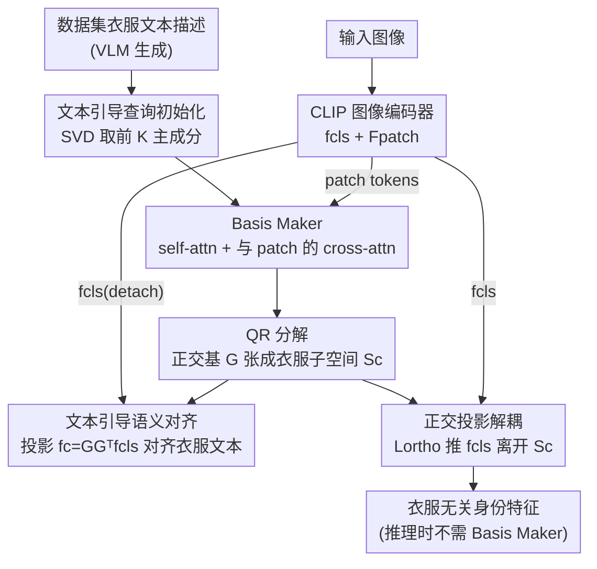

# Learning Instance-Adaptive Low-Rank Orthogonal Subspaces for Clothes-Changing Person Re-Identification

**会议**: ICML2026  
**arXiv**: [2606.11661](https://arxiv.org/abs/2606.11661)  
**代码**: 未公开  
**领域**: 人体理解 / 行人重识别  
**关键词**: 换衣行人重识别, 低秩子空间, 视觉语言模型, 正交投影, 解耦表示

## 一句话总结
把"衣服"这个语义概念显式建模成一个 **实例自适应的低秩子空间**（用 CLIP 文本描述的 SVD 主成分初始化、再靠图像 patch 的 cross-attention 精修），然后用几何约束强制身份特征与该子空间严格正交，从而在不用对抗训练的情况下做到换衣行人重识别的 SOTA（PRCC +5.9% Rank-1）。

## 研究背景与动机

**领域现状**：换衣行人重识别（Clothes-Changing Person Re-ID, CC-ReID）要在同一个人换了衣服、外观剧变的前提下还能把他从不同摄像头里认出来。此时"衣服颜色/款式"这种最显眼的视觉线索反而是干扰项，必须想办法把它从身份特征里剥掉。主流做法分两类：一类靠外部模态（3D 体型、步态、姿态）补充与衣服无关的信息；另一类做特征解耦，常见手段是对抗学习、因果去偏、或者改网络结构。近期还冒出用 CLIP 文本先验来监督"衣服"语义的文本引导路线。

**现有痛点**：这些方法大多 **没有显式利用 VLM 表示里"衣服"概念本身就是低秩线性结构** 这一几何事实。它们要么用一个学出来的线性投影矩阵粗暴地切出"衣服子空间"，要么用对抗目标去对抗，缺乏几何可解释性，而且对抗训练本身不稳定、难收敛。最接近本文的 DIFFER 同样用冻结的 CLIP 文本编码器做衣服监督，但仍然依赖对抗学习而不是显式低秩子空间建模。

**核心矛盾**：近年表示学习研究表明，"衣服""颜色"这类高层语义概念在大型预训练 VLM 的嵌入空间里对应着 **结构化的低维线性子空间**。既然概念是低秩子空间，那本来就可以直接用正交投影这种几何操作去抑制它——可是现有 CC-ReID 方法却绕开这个干净的几何 handle，去用对抗 loss 硬解耦。问题在于：用什么子空间？一个对全数据集固定的"衣服子空间"太粗（每张图衣服可见区域、遮挡、光照都不同），而完全自由学的投影又丢掉了 CLIP 文本空间的语义锚点。

**本文目标**：① 给每张查询图构造一个 **既有语义锚点、又能逐实例自适应** 的低秩衣服子空间；② 用几何正交约束（而非对抗）把身份特征推离这个子空间。

**切入角度**：作者抓住 VLM 表示的两个性质——第一，衣服语义可以由 CLIP 文本嵌入的主成分（SVD）捕获，给出一个语义扎实的全局先验；第二，这个全局先验可以通过与图像局部 patch token 做 cross-attention 被逐实例精修。

**核心 idea**：用一个 transformer 式的 **Basis Maker** 把"SVD 初始化的可学习 query"经 cross-attention 精修成一组正交基（QR 分解保证正交），张成实例自适应的衣服子空间；身份特征在训练时被约束与该基正交。推理时 Basis Maker 直接丢弃，编码器零额外开销地输出衣服无关特征。

## 方法详解

### 整体框架

Ortho-ReID 由三部分组成：① 一个 CLIP 图像编码器（EVA-02-CLIP-L），吐出全局 CLS token $\mathbf{f}_{\text{cls}}$ 和局部 patch token $\mathbf{F}_{\text{patch}}$；② **Basis Maker**，用 cross-attention 学出实例自适应的衣服子空间 $\mathcal{S}_c$；③ 正交投影模块，把身份特征推离 $\mathcal{S}_c$。训练时三条 loss 协同：$\mathcal{L}_{\text{cloth}}$ 让投影到衣服子空间的分量对齐衣服文本，$\mathcal{L}_{\text{reid}}$ 做身份判别，$\mathcal{L}_{\text{ortho}}$ 强制 CLS 特征与衣服分量几何正交。整条链路的巧妙之处在于一个梯度隔离设计：Basis Maker 负责"看清"当前编码器眼里衣服长什么样，编码器则被反向推着"忘掉"衣服，两者目标互补但通过 detach 互不串扰。

### 关键设计

**1. 文本引导的 SVD 查询初始化：给衣服子空间一个语义扎实的先验**

最朴素的做法是让 Basis Maker 的 query 随机初始化、从头学一个衣服子空间，但这样 query 漂在 CLIP 空间里没有语义锚点，优化轨迹不稳、容易学偏。作者改成：先用一个 VLM（默认 GPT-4o，换开源模型效果相当）为每个数据集生成大量自然语言衣服描述，用冻结的 CLIP 文本编码器编码成 $\{\mathbf{t}_c^{(i)}\}_{i=1}^M$，再对这堆文本嵌入做奇异值分解，取前 $K$ 个主成分作为可学习 query 的初值：

$$\mathbf{Q}_{\text{init}}=\text{SVD}_K(\{\mathbf{t}_c^{(i)}\}_{i=1}^M)$$

这相当于先用文本统计出"衣服概念"在 CLIP 空间里的主导方向，让 query 一出生就落在语义有意义的低维区域、天然关注衣服相关特征。关键是 query 之后仍然 **完全可学**，会从文本初值出发逐渐适配到目标数据集的具体衣服分布和实例级视觉模式。消融显示 SVD 初始化在所有配置下都稳压随机初始化，且让 query 可学比冻结再涨 +2.8% Rank-1（LTCC）。

**2. 基于 patch 的 cross-attention Basis Maker + QR 正交化：把全局先验精修成实例自适应正交基**

光有一个对全数据集固定的衣服先验还不够——每张图的衣服可见区域、遮挡、配饰、模糊都不一样。Basis Maker 用一个标准 Transformer decoder（6 层、16 头、$K=16$ 个 query，受 Q-Former 启发）：query 先做 self-attention 在各基向量间交换信息，再通过 multi-head cross-attention 去 **attend 图像 patch token**（而不是只看 CLS）。用 patch 的好处是保留细粒度空间局部性，能逐部位捕捉不同身体区域的衣服特征，在遮挡时自然聚焦到可见衣物上。精修后的 query $\mathbf{Q}'$ 经 QR 分解正交归一：

$$\mathbf{G}=\text{QR}(\mathbf{Q}'^{\top})\quad\text{s.t.}\quad\mathbf{G}^{\top}\mathbf{G}=\mathbf{I}$$

$\mathbf{G}\in\mathbb{R}^{d\times K}$ 就是衣服子空间 $\mathcal{S}_c$ 的一组正交基。正交归一逼着每个基向量去捕捉独立、不重叠的衣服属性（颜色、纹理、款式），避免冗余坍缩。消融表明：patch cross-attention 比 CLS cross-attention 在衣服多样性最高的 LTCC 上多 +2.1% Rank-1；去掉 QR 分解则基向量易高度相关或坍缩到窄空间，LTCC mAP 掉约 1.86%。$K$ 也要适中——太小表达力不够、太大引入冗余甚至把身份/背景噪声卷进来，实测 $K=16$ 最优。

**3. 文本引导语义对齐（带梯度隔离）：训练 Basis Maker 而不污染编码器**

ReID 任务最终用 CLS token 当全局表示，所以要让 Basis Maker 学到的子空间确实对 CLS 里的衣服分量负责。做法是把 $\mathbf{f}_{\text{cls}}$ 投影到 $\mathcal{S}_c$ 取出衣服分量 $\mathbf{f}_c=\mathbf{G}\mathbf{G}^{\top}\mathbf{f}_{\text{cls}}$，再用对比学习把它对齐到对应衣服文本嵌入：

$$\mathcal{L}_{\text{cloth}}=-\frac{1}{B}\sum_{i=1}^{B}\log\frac{\exp(\cos(\mathbf{f}_c^{(i)},\mathbf{t}_c^{(i)})/\tau)}{\sum_{j=1}^{B}\exp(\cos(\mathbf{f}_c^{(i)},\mathbf{t}_c^{(j)})/\tau)}$$

关键细节：算这个投影时 **detach 掉 $\mathbf{f}_{\text{cls}}$ 的梯度**，于是 $\mathcal{L}_{\text{cloth}}$ 只更新 Basis Maker、不动图像编码器。这就实现了职责分离——Basis Maker 被训练去"如实捕捉当前编码器表示里的衣服信息"，而编码器则被另一条 $\mathcal{L}_{\text{ortho}}$ 单独推着"删掉衣服"。两者目标看似矛盾却互补，靠 detach 防止互相破坏。

**4. 正交投影解耦损失：用几何约束（而非对抗）剥离衣服**

有了 Basis Maker 学好的子空间，作者用一个极简的几何 loss 把身份从衣服里抠出来——最小化归一化后的 CLS 特征与衣服分量的内积平方（此处 $\mathbf{G}$ 被 detach）：

$$\mathcal{L}_{\text{ortho}}=\left\langle\frac{\mathbf{f}_{\text{cls}}}{\|\mathbf{f}_{\text{cls}}\|_2},\frac{\mathbf{f}_c}{\|\mathbf{f}_c\|_2}\right\rangle^2$$

最小化这个归一化内积，就是逼编码器学出与衣服子空间正交、即衣服无关的表示。相比 DIFFER 那种对抗目标，这里没有 min-max 博弈、训练稳定且几何可解释。t-SNE 可视化很直观：没有 $\mathcal{L}_{\text{ortho}}$ 时特征按衣服颜色聚团、同一人不同衣服被拆散；加上后同一身份样本无视换衣紧紧聚成一簇。推理时 Basis Maker 整个不需要，编码器直接零额外开销地产出衣服无关特征。

### 损失函数 / 训练策略

总损失联合优化 Basis Maker 与编码器：$\mathcal{L}_{\text{total}}=\mathcal{L}_{\text{cloth}}+\lambda_{\text{ortho}}\mathcal{L}_{\text{ortho}}+\lambda_{\text{reid}}\mathcal{L}_{\text{reid}}$。其中 ReID 部分 $\mathcal{L}_{\text{reid}}=\lambda_{id}\mathcal{L}_{id}+\lambda_{tri}\mathcal{L}_{tri}+\lambda_{intra}\mathcal{L}_{intra}$：$\mathcal{L}_{id}$ 是身份分类交叉熵，$\mathcal{L}_{tri}$ 是 batch-hard triplet，$\mathcal{L}_{intra}$ 是作者提出的模态内对比，把同一身份的所有换衣变体都当作均匀正样本（$q_{ij}=1/K_i$ 当 $\text{pid}_i=\text{pid}_j$ 否则 0），从而在换衣干扰下仍收紧类内簇。所有 loss 权重一律设为 $\lambda=1$。编码器用 SGD（$lr=2\times10^{-6}$），Basis Maker 用 Adam（$lr=2\times10^{-5}$），cosine 调度 80 epoch，2 张 A100，不用数据增强 / re-ranking / 后处理。

## 实验关键数据

### 主实验

在 4 个 CC-ReID benchmark 上评测（PRCC / LTCC / Celeb-reID-light / LaST），报 Rank-1 与 mAP。

| 数据集（协议） | 指标 | Ortho-ReID | 之前最佳 | 提升 |
|--------|------|------|----------|------|
| PRCC (CC) | R-1 / mAP | 74.4 / 70.2 | DIFFER 68.5 / 64.7 | +5.9 / +5.5 |
| LTCC (CC) | R-1 / mAP | 56.1 / 30.2 | DIFFER 58.2 / 31.6 | 竞争性（略低） |
| Celeb-reID-light | R-1 / mAP | 79.1 / 59.0 | DIFFER 75.6 / 54.3 | +3.5 / +4.7 |
| LaST (228K id) | R-1 / mAP | 84.3 / 53.5 | MADE 79.0 / 40.9 | +5.3 / +12.6 |

PRCC、Celeb-reID-light、LaST 上全面刷新 SOTA；LTCC 上与 DIFFER 竞争性持平（且作者注：DIFFER 的 LTCC 结果对应一个异常偏高的 baseline 54.6%，远高于同设置的 MADE 45.9% / CSCI 44.9%，疑似实现差异）。

### 消融实验

| 配置 | PRCC R-1 | LTCC R-1 | 说明 |
|------|---------|---------|------|
| 仅 $\mathcal{L}_{\text{reid}}$ | 70.6 | 52.2 | 标准 ReID baseline |
| + $\mathcal{L}_{\text{ortho}}$（完整） | 74.4 | 56.1 | 正交损失带来 +3.8 / +3.9 |
| Self-attn only (SVD) | 72.9 | 54.0 | 不看图像 patch |
| Self+Cross(CLS, SVD) | 72.5 | 53.3 | 只 attend CLS |
| Self+Cross(Patch, Random) | 72.3 | 52.5 | patch 但随机初始化 |
| Self+Cross(Patch, SVD)=完整 | 74.4 | 56.1 | patch + SVD 最优 |

### 关键发现
- **正交损失是核心引擎**：仅加 $\mathcal{L}_{\text{ortho}}$ 就在三个数据集一致涨 +3.5～3.9% Rank-1，t-SNE 上把按衣服聚团的特征重排成按身份聚团。
- **patch cross-attention > CLS**：细粒度空间交互对捕捉局部变化的衣服至关重要，遮挡时能聚焦可见衣物，LTCC（衣服多样性最高）上比 CLS 变体多 +2.1%。
- **SVD 初始化 + 可学 query 缺一不可**：SVD 给稳定的语义起点，可学性让 query 适配目标分布（冻结会掉 2.8%）；$K=16$ 时子空间秩刚好——太小欠表达、太大过拟合卷入噪声。
- **QR 分解保证基不坍缩**：去掉后基向量高度相关、LTCC mAP 掉约 1.86%，正交独立性是后续解耦有效的前提。

## 亮点与洞察
- **把"概念=低秩子空间"这个表示学习发现真正落地成几何操作**：不再用对抗 loss 硬解耦，而是直接对子空间做正交投影，既稳定又可解释——这是从"对抗博弈"到"几何约束"的范式切换。
- **梯度 detach 实现"互补但不打架"的双目标训练**：Basis Maker 学"衣服现在长啥样"、编码器学"忘掉衣服"，靠一个 detach 把两个看似对立的目标拆成各管各的，非常优雅，可迁移到其他"先建模干扰子空间、再正交掉"的解耦任务。
- **训练用、推理丢**：Basis Maker 只在训练期存在，推理零额外开销，部署友好。
- **实例自适应是关键区分点**：相比把衣服子空间建成一个固定线性矩阵，cross-attention 让子空间逐图变化，天然处理遮挡、光照、配饰、模糊等可见性变化。

## 局限与展望
- LTCC 上未超过 DIFFER（虽作者质疑 DIFFER 的 baseline 偏高），说明在衣服极度多样、每人平均 5 套衣服的场景下方法优势收窄。
- 依赖一个外部 VLM（GPT-4o）生成数据集级衣服描述来做 SVD 初始化，引入了对额外大模型的依赖（虽称开源模型效果相当），可复现性与成本需注意。
- 子空间秩 $K$ 需按数据集手调（实测 16 最优），对衣服多样性差异大的数据集是否需要自适应 $K$ 值得探索。
- 方法本质是"建模并正交掉一个语义干扰子空间"，是否能推广到颜色、背景、视角等其他干扰概念的联合解耦，是自然的延伸方向。

## 相关工作与启发
- **vs DIFFER (CVPR 25)**：同样用冻结 CLIP 文本编码器做衣服监督，但 DIFFER 靠对抗学习解耦，本文靠显式低秩子空间 + 几何正交，训练更稳、可解释，且 PRCC/Celeb-L/LaST 全面反超。
- **vs CSCI / Pathak&Rawat 的正交方法**：他们也用训练期正交约束分离形状或颜色，但作用在固定/启发式定义的子空间上；本文把正交约束施加到一个 **文本扎根、实例自适应** 的学习子空间，子空间本身随每张图变化。
- **vs 线性投影类 VLM-ReID（如 Li et al. 2024）**：他们用简单线性矩阵建模衣服子空间，本文用 cross-attention 的 Basis Maker 做更灵活、更有表达力的实例自适应子空间建模。

## 评分
- 新颖性: ⭐⭐⭐⭐⭐ 把"概念=低秩子空间"的几何洞察落地成实例自适应 Basis Maker + 正交投影，范式清晰且与对抗路线区分明显
- 实验充分度: ⭐⭐⭐⭐ 4 个 benchmark + 4 组消融（正交损失/注意力/查询配置/QR）齐全，但 LTCC 未超 DIFFER 留有保留
- 写作质量: ⭐⭐⭐⭐⭐ 动机层层递进、几何直觉与公式对应清楚，t-SNE 与注意力可视化支撑有力
- 价值: ⭐⭐⭐⭐ 给解耦表示提供了稳定可解释的几何模板，可迁移到其他干扰概念剥离任务

<!-- RELATED:START -->

## 相关论文

- [\[CVPR 2026\] SSM-Aware Token-Efficient VMamba via Adaptive Patch Pruning and Merging for Person Re-Identification](../../CVPR2026/human_understanding/ssm-aware_token-efficient_vmamba_via_adaptive_patch_pruning_and_merging_for_pers.md)
- [\[CVPR 2026\] Spatial-Frequency Collaborative Learning for Occluded Visible-Infrared Person Re-Identification](../../CVPR2026/human_understanding/spatial-frequency_collaborative_learning_for_occluded_visible-infrared_person_re.md)
- [\[CVPR 2026\] Pose-guided Enriched Feature Learning for Federated-by-camera Person Re-identification](../../CVPR2026/human_understanding/pose-guided_enriched_feature_learning_for_federated-by-camera_person_re-identifi.md)
- [\[NeurIPS 2025\] DevFD: Developmental Face Forgery Detection by Learning Shared and Orthogonal LoRA Subspaces](../../NeurIPS2025/human_understanding/devfd_developmental_face_forgery_detection_by_learning_shared_and_orthogonal_lor.md)
- [\[AAAI 2026\] Modality-Aware Bias Mitigation and Invariance Learning for Unsupervised Visible-Infrared Person Re-Identification](../../AAAI2026/human_understanding/modality-aware_bias_mitigation_and_invariance_learning_for_unsupervised_visible-.md)

<!-- RELATED:END -->
