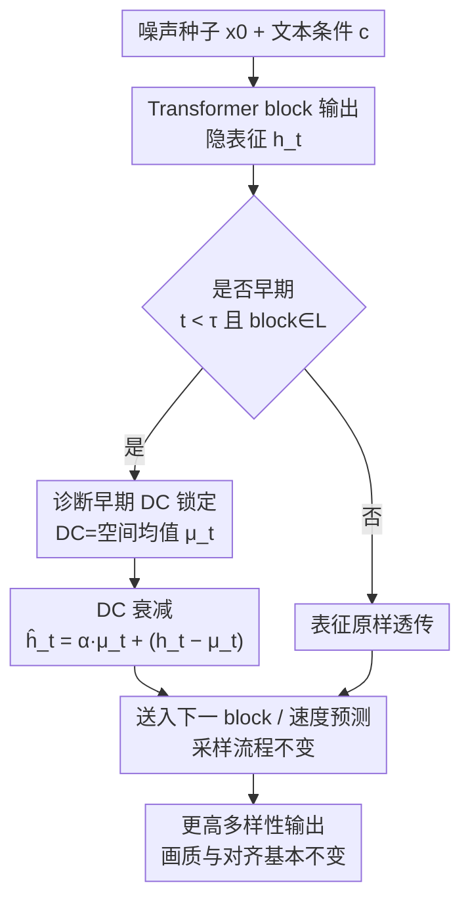

# Breaking the Lock-in: Diversifying Text-to-Image Generation via Representation Modulation

**会议**: ICML 2026  
**arXiv**: [2606.06813](https://arxiv.org/abs/2606.06813)  
**代码**: 待确认  
**领域**: 图像生成 / 扩散模型  
**关键词**: 文生图多样性, 表征调制, DC 分量, flow matching, 训练无关  

## 一句话总结
作者发现 Transformer 文生图模型在去噪早期会让"零频空间均值（DC 分量）"在不同随机种子间迅速对齐，把全局布局过早锁死，于是提出 DAVE——在早期生成阶段对中间表征里的 DC 分量做一次轻量衰减，几乎零开销地解锁了同一 prompt 下的样本多样性，同时保持画质与文图对齐。

## 研究背景与动机

**领域现状**：当下文生图（T2I）主流是大规模 Transformer 骨干 + flow matching 目标（如 SD3、Flux、SANA），它们在文图对齐和写实度上非常强，已成为生成建模的主导范式。

**现有痛点**：质量的可靠性反而带来多样性的塌缩——给定一个固定 prompt 反复采样，输出常常收敛到高度相似的构图和风格。多样性不是可有可无的装饰，它决定了用户能不能探索候选、发现稀有配置、构造分布覆盖广的合成数据集，直接影响下游收益。

**核心矛盾**：现有的多样性增强方法有两个硬伤。其一是**开销大**：要么加额外采样步、要么做辅助优化、要么并行跑多个种子互相排斥（如 Particle Guidance、DiverseFlow、SPELL、OSCAR、SPARKE），这些"批内联合评估"的方法随模型规模膨胀越来越吃显存和算力。其二是**不解释根因**：它们都停留在采样层的启发式（如 CADS 往文本条件注调度噪声），只在推理时"掰回"多样性，却没回答多样性塌缩到底发生在模型内部的哪里、为什么发生。

**本文目标**：从表征层面（而非采样层面）找到多样性塌缩的机制源头，并设计一个**不改采样管线、不重训、几乎零开销**的干预。

**切入角度**：作者去看 Transformer block 的中间隐表征 $h_t^{(\ell)}$ 在不同噪声种子之间的差异，发现一个反直觉的现象——隐状态的**零频分量（DC 分量，即沿空间 token 维的均值）在去噪早期几乎跨种子完全对齐**，且这个分量占了总能量的 51.2%，是主导信号而非噪声。

**核心 idea**：既然"早期 DC 漂移"像一个种子无关的锚把生成轨迹钉死，那就**在早期选择性地削弱 DC 分量**，让初始噪声种子的随机性重新主导结构变化，从而打破"条件均值"造成的同质化。

## 方法详解

### 整体框架

DAVE（DC Attenuation for diVersity Enhancement）的全流程不改采样器、不动模型权重，只是在去噪循环的早期、在若干个 Transformer block 的输出上插入一次"DC 衰减"操作。整体逻辑是三步：先**诊断**——分析中间表征，定位 DC 分量在早期的跨种子锁定；再**干预**——对选定 block、在时间 $t<\tau$ 时把 DC 分量按系数 $\alpha$ 衰减；最后**采样照旧**——衰减后的表征送入下一个 block，其余 flow matching 采样流程一字不改。

文生图本身是把源分布 $X_0=\mathcal{N}(0,I)$ 通过学到的速度场 $v_\theta(x_t,t;c)$ 沿 ODE $\frac{dx_t}{dt}=v_\theta(x_t,t;c)$ 输运到数据分布 $X_1$，离散成 $K$ 步欧拉迭代 $x_{k+1}=x_k+\Delta t\,v_\theta(x_k,t_k;c)$。速度场用 Transformer 实现，每个 block 把表征更新为 $h_t^{(\ell+1)}=\mathrm{Block}^{(\ell+1)}(h_t^{(\ell)},t,c)$。DAVE 干预的就是这个 $h_t^{(\ell)}$。

### 关键设计

**1. 早期 DC 锁定的诊断：把多样性塌缩定位到零频分量**

作者用 SD3 在每个 prompt 上跑 100 个随机种子、取 Transformer 第 5 个 block 的表征做分析，发现 DC 分量（沿 $D$ 个视觉 token 的空间均值）在种子间高度一致：成对余弦相似度高、变异系数低，且占总能量的 $51.2\%$。这一现象被命名为"早期 DC 漂移（early DC drift）"。作者进一步给出机制解释：它来自**架构偏置与训练目标的合谋**。一方面，神经网络有谱偏置（spectral bias），天然优先拟合低频信号，而 DC 正是最低频，于是在采样起点就被优先关注，与"全局结构在生成早期先成形"的经验一致。另一方面，早期步信噪比（SNR）低，MSE 形式的 flow matching 目标在高不确定性下的最优解是预测**文本条件下数据的期望**——高频、样本特异的纹理会跨种子被平均掉，而 DC 作为全局统计量被强力拉向条件均值，成了一个种子无关的锚。逐步分析证实这种跨种子 DC 对齐确实集中在最早的几步、并向生成末期衰减（见 Table 3）。这个诊断是全文立论的根：它告诉我们干预要"早、且只针对 DC"。

**2. DC 衰减干预：一次空间均值缩放就解锁轨迹**

针对上面的锚，DAVE 直接削弱它。对隐表征 $h_t^{(\ell)}\in\mathbb{R}^{D\times C}$（$D$ 为视觉 token 数、$C$ 为通道数），DC 分量不需要做频域变换，直接取空间均值即可：

$$\mu_t^{(\ell)}=\frac{1}{D}\sum_{d=1}^{D}h_t^{(\ell)}[d,:]\in\mathbb{R}^{1\times C}.$$

衰减就是把表征拆成"DC + 残差"，只缩 DC、留全残差：

$$\hat{h}_t^{(\ell)}=\alpha\cdot\mu_t^{(\ell)}+\big(h_t^{(\ell)}-\mu_t^{(\ell)}\big),\quad \alpha\in(0,1),$$

其中 $\mu_t^{(\ell)}$ 在减/加时沿全部 $D$ 个 token 广播。在 MMDiT 这类多模态架构里，作者只对承载视觉信息的表征动手，不碰文本分支。$\hat{h}_t^{(\ell)}$ 替换原表征后照常送入下一个 block。这个操作之所以有效，是因为它**精准拆掉了那个种子无关的全局锚**：削弱 DC 后，初始噪声里的种子特异空间残差相对影响被放大，全局布局不再被过早钉死，从而恢复"勿改语义、只换布局/风格"的多样性。它是手术刀式、训练无关的，无缝嵌入任何预训练模型，不加架构、不做额外优化，因此几乎零算力/显存开销、也不约束 batch size——这正好规避了 Particle Guidance 一类批内排斥方法的开销瓶颈。

**3. 三个旋钮的选择：衰减强度 $\alpha$、目标 block 池 $\mathcal{L}$、时间截止 $\tau$**

DAVE 只有三个超参，且都对应明确的物理含义：$\alpha$ 控制衰减多狠（越小多样性越强，但过小会损画质/对齐）；$\mathcal{L}$ 选在哪些 block 上动手（呼应"第 5 个 block 附近 DC 主导"的诊断）；$\tau$ 决定只在前多少步干预（呼应"DC 锁定集中在早期"的发现）。三者共同把干预限制在"早期 + 中间 block + 适度强度"的窗口里，使得削弱 DC 提升多样性的同时，不破坏后续高频细节与文图语义对齐。论文给出了选取这三个旋钮的经验指引，并在实验里做了系统的配置分析。

### 损失函数 / 训练策略
DAVE 是**训练无关**的纯推理期干预，不引入任何损失函数、不重训、不微调，直接作用于冻结的预训练模型。

## 实验关键数据

### 主实验

在独立采样（样本之间无批内交互）设定下，跨 SD3.5 / Flux.1-dev / SANA1.5 三种骨干、ImageNet 与 MSCOCO 两个数据集评测。多样性主指标是 **Vendi**（越高越多样）和 **Recall/Coverage**，质量看 FID 与 Precision/Density，语义看 CLIP。下表摘 ImageNet 上 SD3.5 的代表性结果（"Ours Random"为随机化变体）：

| 方法 | FID ↓ | Recall ↑ | Vendi ↑ | CLIP ↑ |
|------|-------|----------|---------|--------|
| Orig | 22.23 | 0.2589 | 1.71 | 0.2952 |
| CADS | 17.91 | 0.5698 | 2.09 | 0.2907 |
| SPARKE | 22.27 | 0.3136 | 1.77 | 0.3016 |
| **Ours (DAVE)** | 20.74 | **0.6489** | 2.33 | 0.2897 |
| **Ours Random** | 17.57 | 0.5422 | **2.50** | 0.2939 |

DAVE 在把 Vendi 从 1.71 提到 2.33–2.50、Recall 从 0.26 提到 0.54–0.65 的同时，CLIP 仅从 0.2952 微降到 0.29 上下，FID 还有改善——即"多样性大涨、对齐几乎不掉、画质不退"。

### 开销 / 机制对比

| 维度 | 批内排斥类（PG/DiverseFlow/SPARKE） | DAVE |
|------|-----------------------------------|------|
| 额外采样步 / 辅助优化 | 需要 | 不需要 |
| 显存与解码开销 | 随规模显著上升 | 几乎为零 |
| batch size 约束 | 依赖批内联合评估 | 无约束 |
| 是否解释根因 | 否（采样层启发式） | 是（定位早期 DC 锁定） |

### 关键发现
- **DC 分量是多样性塌缩的关键瓶颈**：它占早期表征能量的 51.2%，跨种子高度对齐；只动这一个分量就能撬动整张图的布局变化，说明塌缩高度集中在"全局均值"这一个自由度上。
- **干预要趁早**：跨种子 DC 对齐集中在最早几步、向末期衰减，因此 $\tau$ 必须卡在早期窗口；晚期干预既无必要也可能伤细节。
- **几乎免费的多样性**：相比批内排斥方法动辄成倍的采样/显存成本，DAVE 一次空间均值缩放就拿到有竞争力的多样性，scaling 友好。
- **CADS 在强骨干上会崩**：在 Flux.1-dev / SANA1.5 上 CADS 的 FID 大幅恶化（如 SANA1.5 上 68.13），而 DAVE 保持稳健，说明"往条件注噪"在强模型上副作用大，表征层干预更可控。

## 亮点与洞察
- **把"多样性塌缩"还原成一个可观测、可干预的内部信号**：用谱偏置 + 低 SNR 下 MSE 最优解趋向条件均值，双重解释了 DC 为何被钉死，机制叙事干净有力——这是它比纯采样启发式更深的地方。
- **干预之简单近乎"白嫖"**：DC 就是空间均值，不用 FFT；衰减就是"拆 DC+残差、只缩 DC"，一行张量运算，训练无关、无 batch 约束，几乎零开销。
- **可迁移的思路**："找到跨样本被过早对齐的低频/均值分量并选择性衰减"这一范式，可推广到视频生成、3D 生成乃至任何 flow/diffusion 模型的多样性控制；也提示在表征层而非采样层做可控生成往往更精准、更省。

## 局限与展望
- 干预集中在"DC=空间均值"这一个全局自由度上，对需要更细粒度（如局部多样性、特定属性多样性）的控制可能力不从心。
- 三个旋钮 $\alpha,\mathcal{L},\tau$ 需要按骨干/数据集调，论文给了经验指引但仍是手调；自适应地按 prompt 或按步动态选取衰减强度是自然的改进方向。
- 诊断主要基于 SD3 的第 5 个 block，跨架构（如不同 MMDiT 变体、非 Transformer 骨干）DC 锁定是否同样集中、同样定位，需要更多验证。
- 多样性指标（Vendi/Recall）提升与轻微 CLIP 下降之间仍存在权衡，极端追多样时对齐会掉，需要场景化取舍。

## 相关工作与启发
- **vs Particle Guidance / DiverseFlow / SPELL / OSCAR / SPARKE**：它们在批内让样本互相排斥来增多样，本文不做批内联合评估、直接在单条轨迹的表征上衰减 DC，优势是几乎零开销、无 batch 约束；这些方法的代价是随规模膨胀的算力/显存。
- **vs CADS**：CADS 往文本条件注调度噪声、属采样层启发式，本文在内部表征层干预、且给出了根因机制；实验显示 CADS 在强骨干上 FID 易崩，DAVE 更稳。
- **vs 内部表征分析/编辑（如 C3、注意力编辑、架构再平衡）**：这些工作也动中间特征，但多用于可控编辑或激发创造性，鲜有去追问"轨迹在哪一步、为什么锁死"；本文把分析落到"早期 DC 收敛是种子级多样性的表征瓶颈"，并据此设计直接干预。

## 评分
- 新颖性: ⭐⭐⭐⭐⭐ 把多样性塌缩归因到"早期 DC 锁定"并据此做表征层干预，视角新且有机制支撑
- 实验充分度: ⭐⭐⭐⭐ 覆盖三骨干两数据集多指标，但缺更细粒度多样性与跨架构诊断的深挖
- 写作质量: ⭐⭐⭐⭐⭐ 从现象→机制→方法→验证一气呵成，公式与动机贴合
- 价值: ⭐⭐⭐⭐⭐ 几乎零开销、即插即用，对实际部署的多样化采样很实用

<!-- RELATED:START -->

## 相关论文

- [\[CVPR 2026\] Premier: Personalized Preference Modulation with Learnable User Embedding in Text-to-Image Generation](../../CVPR2026/image_generation/premier_personalized_preference_modulation_with_learnable_user_embedding_in_text.md)
- [\[CVPR 2026\] Extending One-Step Image Generation from Class Labels to Text via Discriminative Text Representation](../../CVPR2026/image_generation/emf_meanflow_text_to_image.md)
- [\[AAAI 2026\] Unleashing the Potential of Large Language Models for Text-to-Image Generation through Autoregressive Representation Alignment](../../AAAI2026/image_generation/unleashing_the_potential_of_large_language_models_for_text-to-image_generation_t.md)
- [\[ICML 2026\] Shifting the Breaking Point of Flow Matching for Multi-Instance Editing](shifting_the_breaking_point_of_flow_matching_for_multi-instance_editing.md)
- [\[CVPR 2026\] Breaking Semantic Boundaries: Distribution-Guided Semantic Exploration for Creative Generation](../../CVPR2026/image_generation/breaking_semantic_boundaries_distribution-guided_semantic_exploration_for_creati.md)

<!-- RELATED:END -->
