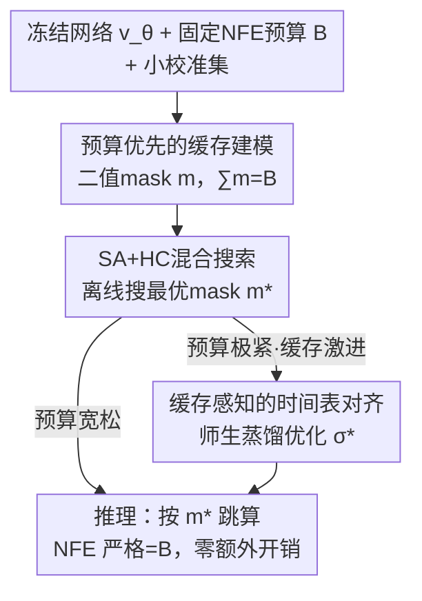

# Budget-Constrained Step-Level Diffusion Caching

**会议**: ICML 2026  
**arXiv**: [2606.13496](https://arxiv.org/abs/2606.13496)  
**代码**: https://github.com/Westlake-AGI-Lab/BudCache  
**领域**: 扩散模型 / 图像生成 / 推理加速  
**关键词**: 步级缓存, 预算约束, 组合优化, 模拟退火, 时间表对齐

## 一句话总结
BudCache 把扩散模型的步级缓存从"用阈值被动触发、延迟随输入飘"翻转成"先锁死算力预算 B，再离线搜出最优缓存策略"，用模拟退火+爬山在几分钟内搜出一个静态缓存 mask，并在预算极紧时用师生蒸馏重对齐时间表，在 FLUX.1-dev 和 Wan2.1 上同等延迟下质量全面超过 TeaCache/MagCache 等启发式缓存。

## 研究背景与动机
**领域现状**：扩散 / 流匹配模型生成一张图要解一条 PF-ODE，需要几十到上百次网络前向（NFE），延迟高。步级缓存（step-level caching）是当下最讨喜的免训练加速手段——相邻去噪步之间特征演化缓慢，于是只在少数关键步真算网络，其余步直接复用上一缓存的输出/激活来近似，TeaCache、MagCache 都属此类。

**现有痛点**：现有缓存方法靠**启发式阈值**在推理时逐步判断"这一步该算还是该复用"。这带来两个实际问题：一是缓存决策由运行时信号触发，不同输入算出来的 NFE 不一样，**部署时延迟不可控**；二是这些逐步决策**并没有直接对最终生成质量做优化**，给定一个 NFE 预算时算力分配往往是次优的。

**核心矛盾**：阈值范式让"误差阈值"反过来决定了"算力开销"，因果是反的——你想要固定开销，却只能间接通过调阈值去凑，且凑出来的策略短视（myopic），早期一个缓存决策会沿着采样轨迹把误差级联放大到后续所有步。

**本文目标**：(1) 让延迟严格等于预算；(2) 在该预算下让最终输出保真度最高；(3) 在预算极紧时进一步压住缓存引入的轨迹漂移。

**切入角度**：把缓存看成一个**资源分配问题**——固定算力预算下，决定哪些去噪步值得新鲜计算、哪些可以安全复用。既然要的是"固定开销最优分配"，那就别让阈值在线决定开销，干脆**预算优先（budget-first）**：先把 B 钉死，离线把缓存策略搜出来。

**核心 idea**：用一个固定预算 $B$ 下的二值 mask 搜索，替代在线阈值触发——离线搜出静态缓存策略 $\mathbf{m}^*$，推理时零搜索零阈值开销，延迟严格 $\text{NFE}=B$。

## 方法详解

### 整体框架
BudCache 的输入是一个预训练（冻结）的流匹配网络 $\mathbf{v}_\theta$、一个固定的 NFE 预算 $B$、以及一个很小的校准集；输出是一对静态产物——缓存 mask $\mathbf{m}^*$ 和对齐后的时间表 $\boldsymbol{\sigma}^*$，二者在推理时直接套用、不再产生任何在线开销。

整条管线分两段离线优化：先在固定预算的约束流形上**搜缓存策略**（模拟退火做全局探索、爬山做局部精修），得到决定"哪些步真算、哪些步复用"的 mask；当缓存非常激进（预算极紧）时，再做一段**缓存感知的时间表对齐**，用师生蒸馏把时间离散 $\boldsymbol{\sigma}$ 重新优化，去补偿固定 mask 带来的轨迹漂移。两段都在部署前算完，推理阶段只是按 $\mathbf{m}^*$ 跳算、按 $\boldsymbol{\sigma}^*$ 走步。

### 关键设计

**1. 预算优先的缓存建模：把"阈值定开销"翻成"开销定策略"**

针对启发式阈值导致延迟不可控、且没对最终输出优化的痛点，BudCache 把缓存决策直接建模成一个二值 mask $\mathbf{m}\in\{0,1\}^K$：$m_k=1$ 表示第 $k$ 步新鲜计算，$m_k=0$ 表示复用缓存。设 $a(k)=\max\{j\le k\mid m_j=1\}$ 为最近一次真算的下标，则缓存版的 Euler 更新为

$$\mathbf{x}_{k+1}\leftarrow\mathbf{x}_k+(\sigma_{k+1}-\sigma_k)\cdot\mathbf{v}_\theta(\mathbf{x}_{a(k)},\sigma_{a(k)},c).$$

这一步把**离散化粒度 $K$** 和**推理预算 $B=\sum_k m_k$** 彻底解耦：$K$ 决定轨迹分多细，$B$ 决定真算几次。于是优化目标变成在 $\sum_k m_k=B,\ m_0=1$ 的约束下，最小化缓存采样输出 $x^{\mathsf S}$ 与全算输出 $x^{\mathsf T}$ 的蒸馏损失 $\mathcal L_{\text{distill}}$。和阈值范式最本质的区别在于：延迟是先验确定的（严格 $\text{NFE}=B$），策略是对"最终输出"端到端优化出来的，而不是逐步贪心拍脑袋。

**2. SA+HC 混合搜索：用退火逃局部最优、用爬山锁紧谷底**

mask 搜索是个硬骨头：空间离散且巨大（$\binom{K}{B}$ 种），地形高度非凸——由于采样是顺序的，早期一个缓存决策会改变轨迹漂移、把误差级联到后续所有步。纯爬山（myopic 局部移动）极易卡在局部最优；多次随机重启又算不起。

BudCache 把搜索拆成两段。**阶段一全局探索（模拟退火 SA）**：在预算约束流形 $\mathcal M_B=\{\mathbf m\mid\sum m_k=B\}$ 上用两个保预算的拓扑算子游走——Swap（把一个计算位和一个复用位对调）和 Shift（把一个计算位挪到相邻位置），二者都不改变 $\sum\mathbf m=B$；候选按 Metropolis 准则接受，

$$P(\text{accept})=\min\!\Big(1,\exp\big(-\tfrac{\Delta\mathcal L}{T_t}\big)\Big).$$

高初温允许接受"能量更高"（损失更大）的移动，从而翻越势垒、逃出纯贪心会被困住的局部最优。**阶段二确定性精修（爬山 HC）**：当温度 $T_t\to0$，停止随机探索，转为贪心——把 $\mathbf m$ 的一步 Swap/Shift 邻域 $\mathcal N(\mathbf m)$ 全部算一遍，确定性地跳到损失下降最多的邻居，直到无法再降为止，把解锁死在当前山谷的精确谷底。整个搜索在小校准集上几分钟跑完，且全在离线，推理零开销。

**3. 缓存感知的时间表对齐：固定 mask 后用师生蒸馏重排步长**

搜出的 $\mathbf m^*$ 是套在"为每步全算而设计"的原始时间表上的；缓存一激进，大量步用了过期向量，沿轨迹累计的近似误差就变了，预算越紧每一步承担的更新占比越大、问题越突出。作者从 Euler 更新拆出漂移项给出动机：缓存用过期向量 $\mathbf v(\mathbf x_{a(k)})$ 代替精确的 $\mathbf v(\mathbf x_k)$，引入局部误差 $\mathbf e_k$，则

$$\Delta\mathbf x_k=\underbrace{\Delta\sigma_k\,\mathbf v(\mathbf x_k)}_{\text{理想更新}}+\underbrace{\Delta\sigma_k\,\mathbf e_k}_{\text{漂移项}}.$$

关键观察是步长 $\Delta\sigma_k$ 对误差 $\mathbf e_k$ 起**乘性放大**作用——若步长均匀，高曲率区的大误差会被重重加权。于是固定 $\mathbf m^*$ 后，把时间表 $\boldsymbol\sigma$ 当可学参数，用**师生蒸馏**优化它去匹配全算输出：教师用 $\boldsymbol\sigma_{\text{ref}}$ 全算生成 $\mathbf x^{\mathsf T}$，学生用当前 $\boldsymbol\sigma$ 加缓存 mask 生成 $\mathbf x^{\mathsf S}$，最小化输出级差异

$$\boldsymbol\sigma^*=\arg\min_{\boldsymbol\sigma}\,\mathbb E\big[\mathcal D\big(\mathbf x^{\mathsf S}(\mathbf m^*,\boldsymbol\sigma),\mathbf x^{\mathsf T}\big)\big],$$

$\mathcal D$ 取 MSE 一类输出级度量。直接逐步估 $\mathbf e_k$ 不现实，所以只从最终输出反传：优化 $\boldsymbol\sigma$ 等于让采样器按 mask 诱导的误差分布**重新分配时间分辨率**——在缓存误差大的地方缩小步长、近似准的地方放大步长。学好的时间表固定下来与 mask 一起用，推理不增加任何 NFE。

### 损失函数 / 训练策略
两段优化各有目标但都不动网络权重 $\theta$（$\mathbf v_\theta$ 全程冻结、免训练 plug-and-play）。缓存搜索阶段的"损失"是缓存输出对全算输出的蒸馏距离 $\mathcal L_{\text{distill}}(x^{\mathsf S},x^{\mathsf T})$，由 SA 的 Metropolis 准则和 HC 的贪心下降驱动；时间表对齐阶段的损失是输出级 MSE $\mathcal D$，只对可学参数 $\boldsymbol\sigma$ 做梯度下降。两段都只用一个小校准/提示集，整体几分钟到分钟级离线完成。

## 实验关键数据

### 主实验
在 FLUX.1-dev（1024×1024 文生图，原始 28 步）上与 SOTA 缓存基线对比。BudCache 提供 ultra/fast/base 三档预算（8/9/10 NFE），同等延迟下质量全面占优；图示甚至能到 3.73× 加速（6 NFE）仍保住高频细节。

| 方法 | NFE | Speedup↑ | LPIPS↓ | SSIM↑ | PSNR↑ | ImageReward↑ |
|------|-----|----------|--------|-------|-------|--------------|
| Original (28 步) | 28 | 1.00× | – | – | – | 1.0138 |
| ERTACache | – | 3.00× | 0.3208 | 0.7603 | 20.343 | 0.9243 |
| TaylorSeer | – | 2.82× | 0.4490 | 0.6454 | 16.092 | 0.8857 |
| MagCache | – | 2.74× | 0.2498 | 0.7854 | 20.893 | 0.9544 |
| TeaCache | – | 2.51× | 0.3218 | 0.7362 | 18.401 | 0.9708 |
| **BudCache-ultra** | 8 | **3.00×** | 0.2479 | 0.7917 | 22.163 | 0.9495 |
| **BudCache-fast** | 9 | 2.74× | 0.2020 | 0.8201 | 23.586 | 0.9633 |
| **BudCache-base** | 10 | 2.51× | **0.1759** | **0.8374** | **24.903** | **0.9782** |

### 同预算对比 / 消融
关键看点是"同一加速比下谁更好"——这正是预算优先范式的卖点。视频侧在 Wan2.1-T2V-1.3B（832×480、81 帧、100 条 prompt、A800）上 BudCache 取得最低延迟同时在 PSNR/SSIM/LPIPS 上超过 TeaCache。

| 对照（同 Speedup） | 指标 | 启发式基线 | BudCache | 说明 |
|--------------------|------|-----------|----------|------|
| 2.74× | LPIPS↓ | 0.2498 (MagCache) | **0.2020** (fast) | 同加速比下重建更准 |
| 2.74× | PSNR↑ | 20.893 (MagCache) | **23.586** (fast) | +2.7 dB |
| 2.51× | LPIPS↓ | 0.3218 (TeaCache) | **0.1759** (base) | 同加速比下大幅领先 |
| 3.00× | SSIM↑ | 0.7603 (ERTACache) | **0.7917** (ultra) | 更高加速档仍超基线 |

### 关键发现
- 预算优先范式的直接收益是**延迟严格可控**（$\text{NFE}=B$，无输入相关的阈值触发），同时在每个加速档位上质量都压过对应的启发式基线。
- BudCache-ultra（3.00×、8 NFE）就能超过运行在更高算力（2.51×）的 TeaCache，说明把算力"花在刀刃上"的离线搜索比阈值范式更省。
- 缓存感知的时间表对齐主要在**预算极紧**时起作用——此时每步承担的更新占比大、漂移最严重，重排步长的边际收益最高；预算宽松时可省略这一段。
- 论文额外报告了在不同 solver、分辨率、引导尺度、few-step 模型与大规模视频模型上的结果，方法对多种扩散骨干是 plug-and-play 的。

## 亮点与洞察
- **把因果调正**是最漂亮的一笔：阈值范式让"误差阈值→运行开销"，BudCache 让"固定开销→最优策略"，一句话点破了现有方法延迟飘、分配次优的根。
- 用 SA+HC 这种经典组合优化打到深度生成加速上，避开了对网络的任何训练/微调，纯离线搜一个静态 mask，工程上极易落地（免训练、即插即用、推理零开销）。
- 步长对缓存误差的**乘性放大**这一观察很可迁移：任何"复用过期量"的加速方案（不止扩散），都可以借"在误差大处缩步长"的思路做后置补偿。
- "离线几分钟搜一次、推理永久零开销"的成本结构，对固定 prompt 分布/固定预算的部署场景非常划算。

## 局限与展望
- 缓存策略 $\mathbf m^*$ 是针对**特定预算 B + 特定校准分布**搜出来的静态策略；预算或 prompt 分布变了需要重搜，灵活性不如在线阈值法。
- 搜索质量依赖小校准集对部署分布的代表性，校准集偏移可能让搜出的 mask 在真实分布上次优（论文未深入压力测试这点）。
- 时间表对齐需要一段师生蒸馏，虽是离线，但相比纯阈值法多了一道优化工序；其收益主要集中在极紧预算，普通预算下性价比有待权衡。
- 静态 mask 对"同一模型不同难度输入"一视同仁，没法像阈值法那样对特别难的样本临时多算几步——可作为未来"分桶预算"的改进方向。

## 相关工作与启发
- **vs TeaCache / MagCache**：它们用输出差异的启发式阈值在线触发缓存，延迟随输入变、决策短视；BudCache 固定预算离线搜静态策略，延迟严格可控且对最终输出端到端优化，同加速比下质量更高。
- **vs LeMiCa**：LeMiCa 用动态规划基于误差估计求全局缓存策略，思路同样是"全局而非逐步"；BudCache 不依赖误差估计的代理目标，而是直接以最终输出保真为目标用 SA+HC 搜，并额外引入时间表对齐补偿漂移。
- **vs Align-Your-Steps / LD3 等时间表优化**：这些工作为"更好的离散化"本身而优化 schedule；BudCache 把 schedule 优化当作**补偿机制**，专门用来修正激进缓存诱导的轨迹漂移，动机不同。

## 评分
- 新颖性: ⭐⭐⭐⭐⭐ 把步级缓存从在线阈值翻转为预算优先的离线组合搜索，范式级转向
- 实验充分度: ⭐⭐⭐⭐ 覆盖 FLUX 图像与 Wan 视频、多 solver/分辨率/引导尺度，但多为重建保真指标
- 写作质量: ⭐⭐⭐⭐⭐ 动机—建模—算法—补偿层层递进，公式与算法表清晰
- 价值: ⭐⭐⭐⭐⭐ 免训练、即插即用、推理零开销、延迟严格可控，落地价值高

<!-- RELATED:START -->

## 相关论文

- [\[ICML 2026\] DirectEdit: Step-Level Accurate Inversion for Flow-Based Image Editing](directedit_step-level_accurate_inversion_for_flow-based_image_editing.md)
- [\[CVPR 2026\] ResCa: Residual Caching for Diffusion Transformers Acceleration](../../CVPR2026/image_generation/resca_residual_caching_for_diffusion_transformers_acceleration.md)
- [\[NeurIPS 2025\] Diffusion Model as a Noise-Aware Latent Reward Model for Step-Level Preference Optimization](../../NeurIPS2025/image_generation/diffusion_model_as_a_noiseaware_latent_reward_model_for_step.md)
- [\[CVPR 2025\] Stretching Each Dollar: Diffusion Training from Scratch on a Micro-Budget](../../CVPR2025/image_generation/stretching_each_dollar_diffusion_training_from_scratch_on_a_micro-budget.md)
- [\[ICLR 2026\] Evolutionary Caching to Accelerate Your Off-the-Shelf Diffusion Model](../../ICLR2026/image_generation/evolutionary_caching_to_accelerate_your_off-the-shelf_diffusion_model.md)

<!-- RELATED:END -->
