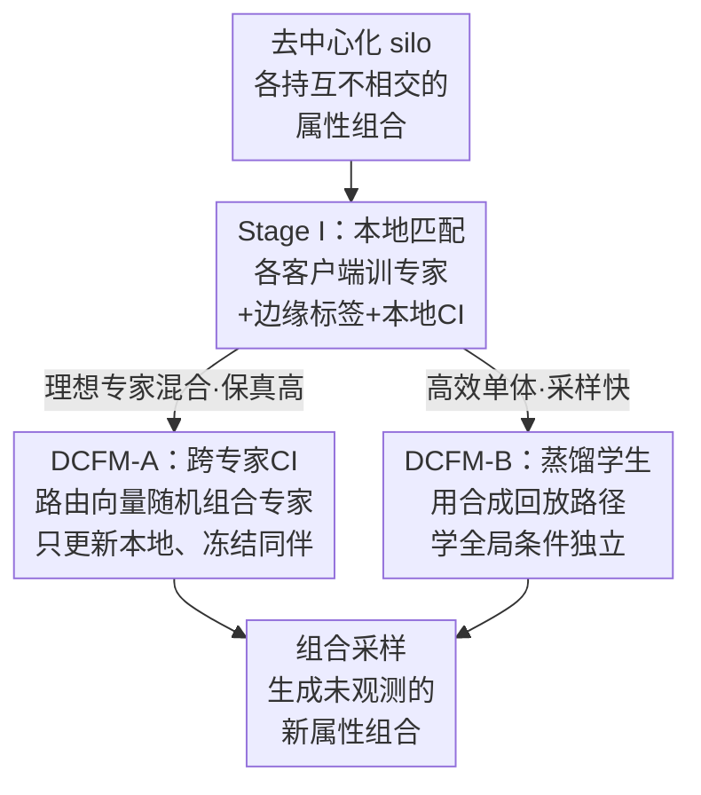

# Compositional Generative Modeling from Decentralized Data

**会议**: ICML 2026  
**arXiv**: [2606.10153](https://arxiv.org/abs/2606.10153)  
**代码**: 待确认  
**领域**: 图像生成 / 扩散模型 / 流匹配 / 联邦学习  
**关键词**: 组合泛化, 去中心化生成, 流匹配, 条件独立, 知识蒸馏

## 一句话总结
当生成因子被切碎在互不共享原始数据的多个客户端里时，本文用 **DCFM（去中心化组合流匹配）** 在全局强制属性的条件独立约束，让模型生成出任何单个客户端都没见过的属性组合，在条件图像生成、机器人空间规划、胸片疾病共现三类任务上都显著超过联邦学习与专家混合基线。

## 研究背景与动机
**领域现状**：现实里的训练数据常常是去中心化的——多个机器人、医院、设备各自把数据锁在本地，互相不能交换原始样本 $\mathbf{x}$。要在这种 silo 上学生成模型，主流做两件事：用**联邦学习**（FedAvg）训一个全局模型，或者各客户端各训一个本地专家、推理时用 **mixture-of-experts / product-of-experts** 把它们拼起来。

**现有痛点**：这些方法只盯着「把各 silo 数据的**并集**建好」，却忽略了集体数据隐含的**新组合**。论文举的例子很直白：机器人 1 只见过雨天、机器人 2 只见过大风、机器人 3 只见过崎岖地形，没有任何一台见过「雨+风+崎岖」同时出现——而这恰恰是部署时必须可靠应对的场景。联邦学习平均参数/梯度时默认能拼出一个连贯全局模型，当各地数据是不相交、高度偏斜的属性组合时这个假设就崩了；专家拼接则缺乏「不同专家该如何交互」的结构性保证（比如共享隐空间），独立训出来的 score 场根本不对齐。

**核心矛盾**：真正的难点不是单纯的去中心化，而是**组合所需的因子被分散在隔离数据源里**时，「全局的属性条件独立性」无法保证。作者证明：即便每个本地模型 $p^{(a)}(\mathbf{y}\mid\mathbf{x})$ 都满足条件独立，全局混合 $p^*(\mathbf{y}\mid\mathbf{x})=\sum_a w_a p^{(a)}(\mathbf{y}\mid\mathbf{x})$ 也不一定满足——所以光在本地各打一个 CI（conditional independence）补丁，在 non-IID 下依然救不回缺失的组合。

**本文目标 + 切入角度**：在不交换任何原始数据的前提下，让生成模型恢复出「没有任何单一数据源能独立支撑」的组合。作者的关键观察是：组合采样要成立，必须让属性满足**全局**条件独立 $p(\mathbf{y}\mid\mathbf{x})=\prod_i p(y_i\mid\mathbf{x})$（式 1），而不只是各客户端的局部条件独立。

**核心 idea**：把条件独立约束从「本地」抬升到「跨全体客户端的全局属性空间」，并通过两种方式实现——要么让本地专家在训练时互相约束（DCFM-A），要么把所有专家蒸馏进一个全局条件独立的学生模型（DCFM-B）。

## 方法详解

### 整体框架
DCFM 建立在**流匹配**（flow matching）之上。流匹配学一个时变速度场 $\mathbf{v}_\theta(\mathbf{x}_t,t,\mathbf{y})$，把高斯噪声 $\mathbf{x}_0\sim\mathcal{N}(\mathbf{0},\mathbf{I})$ 沿概率路径推到数据分布，生成即沿速度场积分 $G_\theta(\mathbf{z},\mathbf{y})=\mathbf{x}_0+\int_0^1\mathbf{v}_\theta(\mathbf{x}_t,t,\mathbf{y})\,dt$。本文先把扩散里熟知的「按边缘条件加权组合」采样（式 4）搬到流匹配速度上，得到组合速度场

$$\hat{\mathbf{v}}_\theta(\mathbf{x}_t,\mathbf{y})=\mathbf{v}_\theta(\mathbf{x}_t)+\sum_{i=1}^k w_i\big(\mathbf{v}_\theta(\mathbf{x}_t,y_i)-\mathbf{v}_\theta(\mathbf{x}_t)\big)$$

这相当于对每个属性 $y_i$ 单独做一次 classifier-free guidance 再叠加，前提是属性条件独立。

整条管线分三步走：**Stage I** 各客户端在本地数据上训出专家（顺带学边缘标签和本地 CI 约束）；然后二选一进入 **DCFM-A**（让本地专家两两之间也满足条件独立，是「理想专家混合」版本，保真度高但采样贵）或 **DCFM-B**（把所有专家蒸馏成一个全局条件独立的单体学生，高效采样）。三者用同一个 CI 惩罚作为粘合剂。

### 关键设计

**1. 全局条件独立是组合泛化的真正前提**

论文先用一个二维高斯混合的玩具例子戳破现有方法：两个客户端 $\{D_1,D_2\}$ 每个样本带水平属性（左/右）和垂直属性（上/下），组合 $\mathbf{y}=(2,1)$ 在数据里**从不出现**。联邦流（FedAvg）在 non-IID 下收敛都困难、IID 下也补不出缺失模式；DDM、DFD 这类专家混合能覆盖已知区域，但都把缺失的「右上」模式拉回已观测的数据密度区。作者据此论证：失败的根因是 $p(\mathbf{y}\mid\mathbf{x})$ 不满足条件独立，而**局部 CI 补丁在 non-IID 下不够**——因为各客户端分布不同 $p^{(a)}\nsim p^{(b)}$，局部独立无法保证全局混合独立。CI 惩罚的统一形式是让联合速度逼近边缘组合速度：$\mathcal{L}_{\text{CI}}(\theta)=\mathbb{E}\,\|\mathbf{v}_\theta(\mathbf{x}_t,\mathbf{y})-\hat{\mathbf{v}}_\theta(\mathbf{x}_t,\mathbf{y})\|^2$（式 7，取 $w_i=1$），逼模型学到一个能解耦各属性、外推到未观测组合的速度场。本文还给出**最小组合覆盖**的下界 $\mathcal{C}\ge\mathcal{C}_{\min}=\frac{1+\sum_i(|\mathcal{Y}_i|-1)}{|\mathcal{Y}|}$（式 2），刻画了「要能解耦各属性主效应，全局至少要观测多少个联合组合」。

**2. Stage I 本地匹配：让本地专家具备边缘可调与局部独立**

标准流匹配只见过完整联合标签 $\mathbf{y}$ 和无条件标签，但组合采样（式 4、5）需要**边缘标签** $y_i$。所以训练时用一个随机二值掩码 $\mathbf{m}\in\{0,1\}^k$ 构造 $\mathbf{y}_\mathbf{m}=\mathbf{y}\odot\mathbf{m}$，按混合权重 $p(\mathbf{m})$（式 8）以概率 $\pi_{\text{full}}$ 给完整标签、$\pi_{\text{marg}}$ 给单属性边缘标签 $(\emptyset,\dots,y_i,\dots,\emptyset)$、$\pi_{\text{uncond}}$ 给纯无条件。本地总损失 $\mathcal{L}_{\text{total}}^{(a)}=\mathcal{L}_{\text{FM}}^{(a)}+\lambda\,\mathcal{L}_{\text{CI}}^{(a)}$（式 11），即流匹配回归项加本地 CI 惩罚。这一步让每个客户端的专家既能响应单属性查询、又在本地范围内尽量解耦，为后面两种全局策略打底。Stage I 完成后，各客户端把模型交给可信服务器或彼此分享（只传参数，不传数据）。

**3. DCFM-A：跨专家条件独立，理想但需多轮**

DCFM-A 让客户端做一次 allgather，每个客户端都拿到全套专家 $\{\mathbf{v}_\theta^{(a)}\}$。引入**路由向量** $\mathbf{r}=(r_0,r_1,\dots,r_k)$，$r_i$ 给第 $i$ 个边缘属性指派一个专家、$r_0$ 指派无条件专家，于是 CI 惩罚被推广到「任意专家组合」上（式 12）：用不同专家算出的边缘速度去组装 $\mathbf{z}_\theta^{(r_0)}$，再约束本地专家的联合速度逼近它。关键技巧是 **StopGrad**（式 13）：组装里只有当前客户端 $a$ 的模型可训，其余同伴专家全部冻结（$\bar{\mathbf{v}}_\theta^r=\delta_{r,a}\mathbf{v}_\theta^{(a)}+(1-\delta_{r,a})\text{StopGrad}(\mathbf{v}_\theta^{(r)})$），且每个路由至少含一个 $r_i=a$，保证梯度落到本地。这样训出的专家在本地和跨同伴两个层面都满足条件独立，在 non-IID 下也能组合泛化。代价是：更新后的专家是相对 Stage I 的**旧冻结**同伴学的 CI，同伴一旦也更新就产生失配，需要重复 DCFM-A 多轮（图像域 $R\sim 2$）才收敛，通信和计算开销随轮数上涨。

**4. DCFM-B：蒸馏成全局条件独立的单体学生**

DCFM-B 绕开多轮失配问题。作者的观察是：判别模型的输入空间 $\mathcal{X}$ 难处理，但生成模型的输入空间 $\mathcal{Z}$（高斯噪声）对每个客户端都是**可处理**的，因此可以像 rectified flow 那样在自生成样本上优化。于是把一组本地专家蒸馏进单个学生：**peer matching 损失** $\mathcal{L}_{\text{student}}=\mathbb{E}\,\|\mathbf{v}_\theta(\hat{\mathbf{x}}_t,t,\mathbf{y}\odot\mathbf{m})-\bar{\mathbf{v}}_\theta^{(r)}(\hat{\mathbf{x}}_t,\mathbf{y})\|^2$（式 15），其中 $\hat{\mathbf{x}}_t$ 是沿冻结教师 $\bar{\mathbf{v}}_\theta^{(r)}$ 的 ODE 积分出的「合成回放路径」，若样本落在某教师的概率路径上就把该教师的速度当真值。但单纯蒸馏只能覆盖数据并集、补不出缺失组合，所以再叠一个**学生 CI 惩罚** $\mathcal{L}_{\text{studentCI}}$（式 16），强制学生自身的联合速度逼近自己的边缘组合速度（这里不用任何冻结模型）。总目标 $\mathcal{L}_{\text{DCFM-B}}=\mathcal{L}_{\text{student}}+\lambda\,\mathcal{L}_{\text{studentCI}}$（式 17）。最终学生既学到全体专家的集体速度场、又满足全局条件独立，能高效采样未观测组合；通信成本被压到常数 2（每个客户端上传本地模型、收回一个蒸馏模型）。

### 损失函数 / 训练策略
- **本地**：$\mathcal{L}_{\text{FM}}^{(a)}+\lambda\mathcal{L}_{\text{CI}}^{(a)}$，流匹配走线性路径，真值条件速度 $\mathbf{u}_t=\mathbf{x}_1-\mathbf{x}_0$。
- **DCFM-A**：$\mathcal{L}_{\text{FM}}^{(a)}+\lambda\mathcal{L}_{\text{peerCI}}^{(a)}$，靠 StopGrad 只更新本地专家，需 $R\sim 2$ 轮。
- **DCFM-B**：$\mathcal{L}_{\text{student}}+\lambda\mathcal{L}_{\text{studentCI}}$，在合成回放路径上一次性蒸馏，无需多轮。

## 实验关键数据
在三类去中心化基准上评测，统一区分 **已知组合**（上标 $o$）与 **新组合**（上标 $*$），后者是任何单一客户端都没观测到的组合。

### 主实验
**Colored MNIST**（$n=10$ 客户端，覆盖率 $\mathcal{C}=1/2$，一半组合从未出现）：用 FID 衡量，新组合 FID$^*$ 是关键。

| 方法 | IID FID$^o$↓ | IID FID$^*$↓ | Non-IID FID$^o$↓ | Non-IID FID$^*$↓ |
|------|------|------|------|------|
| FedFlow | 9.41 | 20.83 | 15.02 | 20.02 |
| DDM+L | 9.03 | 16.38 | 7.99 | 18.84 |
| DFD+L | 9.58 | 19.13 | 8.17 | 31.36 |
| **DCFM-A (Ours)** | 8.53 | **11.41** | 7.33 | **9.29** |
| **DCFM-B (Ours)** | 9.32 | 12.24 | 8.49 | 9.15 |

DFD 在恢复已知数据上最强，但新组合 FID$^*$ 飙到 31.36（non-IID），暴露其「把样本拉回已知密度区」的倾向；DCFM 把已知与新组合的差距大幅收窄。

**机器人空间规划**（OGBench cube-single-play，$n=2$，覆盖率 $3/4$，缺失对角象限移动）：报告成功率 SR。

| 方法 | Partition | SR$^o$ | SR$^*$（新组合） |
|------|-----------|--------|--------|
| DFD+L | Non-IID | **68.67** | 18.33 |
| DDM+L | Non-IID | 67.67 | 29.67 |
| **DCFM-A** | Non-IID | 68.33 | 53.0 |
| **DCFM-B** | Non-IID | 65.67 | **54.67** |

新组合（对角移动）上 DCFM 把成功率从基线的 18–30% 拉到 53–55%，而已知组合几乎不掉。

**胸片疾病共现**（NIH ChestX-ray14，$k=14$ 二值疾病属性，可行空间 $\mathcal{Y_F}$ 含 54 种组合）：用 FID 衡量画质、用「效用 U」（在纯合成数据上训分类器、测真实集的**组合召回率**，式 18）衡量稀有组合的可用性。DCFM 画质与同类相当，但下游分类器对疾病联合出现的敏感度更高，说明它解耦了训练相关性带来的疾病纠缠。

### 通信与计算成本

| 方法 | 每客户端通信成本 |
|------|------|
| FL（联邦） | $2T$（$T\ge 100$ 轮） |
| DDM / DFD | $N-1$ |
| DCFM-A | $RN$（$R\sim 2$） |
| **DCFM-B** | **常数 2** |

联邦学习需上百轮通信，DCFM-B 只需常数 2 次（上传本地模型 + 收回蒸馏模型），把去中心化生成的通信开销压到最低。

### 关键发现
- **全局 CI 是钥匙**：玩具实验直接证明，只有 DCFM 能在 IID 和 non-IID 下都补回缺失模式；局部 CI 补丁在 non-IID 下无效。
- **A vs B 权衡**：DCFM-A 保真度（recall/diversity）更高但采样贵、需多轮；DCFM-B 因学合成数据多样性略降（novel recall 下降），但采样高效、通信常数化。
- **DFD 的失败模式**：能量路由在 non-IID 新组合上会把样本系统性地推向已观测密度区，新组合 FID 最差。

## 亮点与洞察
- **把组合泛化的失败归因到「全局条件独立」而非单纯去中心化**——并用玩具高斯实验一锤定音，论证清晰有力，是全文最「啊哈」的点。
- **StopGrad 路由约束（DCFM-A）**：用 Kronecker delta + 停梯度，在一组共享专家里只更新自己、冻结同伴，是一种轻巧的「跨客户端互相约束又不互相污染梯度」的技巧，可迁移到其他需要 peer-to-peer 蒸馏/对齐的场景。
- **生成模型输入空间可处理 → 合成回放蒸馏（DCFM-B）**：利用 $\mathcal{Z}$ 是高斯这一点在自生成 ODE 路径上蒸馏，把多轮通信压成常数 2，对隐私敏感、带宽受限的医疗/机器人部署很实用。
- **同一套 CI 惩罚贯穿本地、跨专家、学生三个层级**，方法骨架统一，易于理解和复现。

## 局限与展望
- **DCFM-A 需多轮收敛**：图像域 $R\sim 2$ 看似不多，但每轮都要 allgather 全套专家，客户端多时通信仍偏贵；作者用 DCFM-B 规避，但 B 牺牲了多样性。
- **依赖最小组合覆盖假设**：方法要求全局满足 $\mathcal{M}_i=1$ 且 $\mathcal{C}\ge\mathcal{C}_{\min}$，若某属性在全系统里压根没出现过，则无从组合——这是组合泛化的硬约束而非本文能突破的。
- **条件独立假设本身的边界**：现实中属性间可能存在真实因果依赖（如某些疾病确实强相关），强行解耦未必符合数据真相；胸片实验里「效用」提升说明在该数据上利大于弊，但换数据集需重新审视。
- **蒸馏依赖合成数据质量**：DCFM-B 的学生只见教师生成的回放路径，教师本身的偏差会被继承，novel recall 下降即是体现。

## 相关工作与启发
- **vs 联邦学习（FedAvg / Tun et al. 2023）**：联邦默认参数/梯度平均能拼出连贯全局模型，本文证明在不相交属性组合下该假设失效；DCFM 不追求单一全局分布，而是显式强制全局条件独立来支撑组合。
- **vs 专家混合 DDM（McAllister et al. 2025）/ DFD（Hahn & Lee 2025）**：它们独立训专家、推理时路由拼接，但缺乏结构保证，新组合上会塌回已知密度；DCFM 用 CI 惩罚显式约束跨专家兼容性。
- **vs CoInD（Gaudi et al. 2025）**：CoInD 同样用 CI 惩罚解决独立性，但作用于**中心化**数据；本文把这条思路扩展到去中心化、不共享原始数据的设定，并额外解决跨专家 score 场不对齐的兼容性问题。

## 评分
- 新颖性: ⭐⭐⭐⭐⭐ 把组合泛化失败精准归因到「全局条件独立」，并给出去中心化下的两种实现，问题与解法都新。
- 实验充分度: ⭐⭐⭐⭐ 三类异构基准（图像/机器人/医疗）+ IID/non-IID + 通信计算成本分析，覆盖面广；缺真实大规模分布式部署验证。
- 写作质量: ⭐⭐⭐⭐ 玩具实验引出问题、理论与方法层层递进，叙事清晰；公式密集，对非生成模型读者门槛偏高。
- 价值: ⭐⭐⭐⭐ 对隐私敏感、数据孤岛的生成建模场景有实际意义，DCFM-B 的常数通信尤其实用。

<!-- RELATED:START -->

## 相关论文

- [\[ICML 2025\] Compositional Scene Understanding through Inverse Generative Modeling](../../ICML2025/image_generation/compositional_scene_understanding_through_inverse_generative_modeling.md)
- [\[CVPR 2026\] Heterogeneous Decentralized Diffusion Models](../../CVPR2026/image_generation/heterogeneous_decentralized_diffusion_models.md)
- [\[ICML 2026\] Adapting Noise to Data: Generative Flows from Learned 1D Processes](adapting_noise_to_data_generative_flows_from_1d_processes.md)
- [\[CVPR 2025\] Decentralized Diffusion Models](../../CVPR2025/image_generation/decentralized_diffusion_models.md)
- [\[ICLR 2026\] GenCP: Towards Generative Modeling Paradigm of Coupled Physics](../../ICLR2026/image_generation/gencp_towards_generative_modeling_paradigm_of_coupled_physics.md)

<!-- RELATED:END -->
