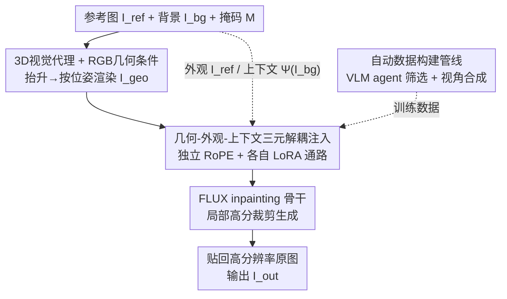

# Direct 3D-Aware Object Insertion via Decomposed Visual Proxies

**会议**: ICML 2026  
**arXiv**: [2606.06601](https://arxiv.org/abs/2606.06601)  
**代码**: https://gong1130.github.io/DIRECT （项目页）  
**领域**: 图像生成 / 扩散模型  
**关键词**: 物体插入, 位姿可控, 3D视觉代理, 解耦注入, 扩散模型, LoRA

## 一句话总结
DIRECT 把"物体插入"从 2D inpainting 升级成**位姿可控**任务：先用现成的 image-to-3D 模型把参考物体抬升成可交互的 3D 代理、按用户指定的 6-DoF 位姿渲染出稠密几何条件图，再把"几何 / 外观 / 上下文"三类条件**解耦成独立通路**注入扩散模型，从而在严格遵循指定 3D 位姿的同时保住参考外观、与背景和谐融合，几何可控性与视觉质量都超过此前方法。

## 研究背景与动机
**领域现状**：物体插入（把一个参考物体无缝合成进背景图指定区域）近年靠 reference-guided 生成大幅进步——AnyDoor、IMPRINT、InsertAnything 等借助 Stable Diffusion、FLUX 等强生成骨干，在身份保持和环境协调上已经做得很好。

**现有痛点**：这些方法都被锁在 **2D 图像平面**，无法显式控制物体的 3D 位姿。一旦场景要求精确的空间对齐（比如"让这块牌子斜靠在墙上、正面朝向相机"），它们就力不从心。具体来说控制机制有两类硬伤：(1) **文本引导**（如 Nano Banana Pro）靠自然语言，但语言在空间上是模糊的——"leaning against"这种描述定不出确切接触几何，模型只能幻觉出一个"看起来合理但其实错"的位姿；(2) **参数化 3D-aware 模型**（如 Object3DIT）想用旋转角等抽象标量注入控制，但从低维参数到稠密像素级形变缺乏显式空间对应，模型很难把几个标量翻译成正确的几何投影。

**核心矛盾**：刚性 3D 控制与高保真 2D 合成之间存在表征鸿沟——既要让物体严格服从用户指定的 6-DoF 位姿 $\boldsymbol{\xi}\in\mathfrak{se}(3)$，又要保住参考物体的高频纹理细节并与背景光照透视一致，而现有控制信号要么太模糊（文本）要么太稀疏（旋转角）。

**切入角度与核心 idea**：作者用**显式 3D 视觉代理**架桥——用前馈 image-to-3D 模型把单张参考图抬升成粗 3D 表示，在指定位姿下渲染成**稠密几何条件图** $I_{geo}$，把"位姿"变成像素对齐的稠密信号。但渲染代理常有纹理退化和伪影，直接拿它做条件会污染生成。于是核心 idea 是：把输入条件**正交分解成几何（来自 3D 代理）/ 外观（来自参考图）/ 上下文（来自背景）三路**，各走独立通路注入，让模型既严格遵循几何约束、又能从参考图取回高保真纹理、从背景取回环境光照。

## 方法详解

### 整体框架
DIRECT 全称 **Decomposed Injection for REference Composition and Target-integration**。输入是参考物体图 $I_{ref}$、背景图 $I_{bg}$、插入区域掩码 $M$、用户指定的 6-DoF 位姿 $\boldsymbol{\xi}$；输出是把物体按该位姿插入背景的图像 $I_{out}$。流程是：把 $I_{ref}$ 抬升成 3D 代理 $\mathcal{P}$ → 用户在 3D 空间交互定位姿 → 渲染出稠密几何条件 $I_{geo}$ → 把几何/外观/上下文三路条件编码后**经解耦 LoRA 通路 + 独立位置编码**注入 FLUX inpainting 骨干 → 在掩码区域生成 → 裁剪局部高分辨率窗口生成后再贴回高分辨率原图。生成目标可写成在解耦条件集上的条件分布：

$$I_{out}\sim p_\theta\big(I \mid \underbrace{I_{ref}}_{\text{外观}},\ \underbrace{I_{geo}}_{\text{几何}},\ \underbrace{\Psi(I_{bg})}_{\text{上下文}},\ M\big),$$

其中 $\Psi(\cdot)$ 是提供场景级语义的全局上下文编码。

### 关键设计

**1. 3D 视觉代理 + RGB 几何条件：把模糊的位姿变成无歧义的稠密条件**

文本/旋转角控制不住位姿的根源是缺乏像素级空间对应。DIRECT 用前馈 image-to-3D 模型（TRELLIS）把 2D 参考图抬升成可平移旋转的 3D 代理 $\mathcal{P}$，用户在 3D 空间里直接摆位姿，再把代理在该位姿下渲染成稠密几何条件图 $I_{geo}$——位姿就这样变成了和输出像素对齐的稠密信号，弥合了 2D 扩散模型对 $\mathfrak{se}(3)$ 变换缺乏内在理解的鸿沟。

关键细节是几何条件用 **RGB 渲染而非 depth/normal**。标准几何信号有语义歧义：一块对称的路牌，正放和倒放（旋转 $180^\circ$）的深度图、法线图几乎一模一样，模型分不清朝向。RGB 代理保留了语义丰富的纹理线索，能让模型正确判定物体取向、消解旋转歧义。这一设计直接针对"参数化 3D 控制翻译不出正确投影"的痛点——用稠密 RGB 几何图把位姿"画"出来，而不是用几个标量"描述"出来。

**2. 几何-外观-上下文三元解耦注入：避免特征纠缠，三路各取所长**

若把多路条件简单 concat 后做 LoRA 微调（如部分先前工作），模型会出现**条件干扰**：过度依赖几何代理，连它退化的模糊纹理一起继承，反而忽略高保真的参考图。DIRECT 的解法是 **Decomposed Injection**——三类条件各走专属通路。具体地，参考图与几何条件分别编码成 latent token $z_{ref}$、$z_{geo}$，背景图经冻结的 SIGLIP 编码成全局上下文 token $c_{global}$，与噪声 latent $z_t$ 拼成统一序列 $Z=[c_{global},\,z_t,\,z_{ref},\,z_{geo}]$。为区分这些条件 token，用两个机制：(1) **独立位置编码**——给外观与几何 token 分配不同的旋转位置编码（RoPE），在注意力里把它们空间隔离；全局上下文 token 编码的是场景级语义而非像素对齐结构，故不分配单独空间位置编码；(2) **模态专属适配器**——自注意力层里给每路条件配独立 LoRA 适配器，强迫模型学到条件专属变换：一个从 $z_{geo}$ 抽结构位姿、一个从 $z_{ref}$ 抽身份纹理、一个从 $c_{global}$ 抽全局上下文。

上下文这一路还顺手解决了**分辨率与上下文的取舍**：裁剪聚焦物体会丢掉周围环境（光源、透视线）。DIRECT 双层处理背景——局部上对掩码周边高分辨率裁剪窗口操作（把 $I_{geo}$ 贴进 $I_{bg}$ 掩码内得到局部合成 $I_{local}$，连同 $M$ 喂 inpainting 骨干），全局上把整帧背景编码成全局语义 token $c_{global}$，让模型透过注意力层关照整场景的光照与构图，保证局部插入的物体与全局环境和谐。

**3. 自动数据构建管线：从单视图野外图造出位姿配对训练数据**

训练位姿可控插入需要"同一物体实例、不同位姿、带复杂背景"的配对数据，但现有物体中心 3D 数据集（如 MVImgNet）背景简单、视角受限（多为环绕俯视）、还有视频抽帧的运动模糊。DIRECT 提出自动管线从单视图野外图造配对，分两步：**Step 1 VLM agent 物体筛选**——用 Qwen3-VL + SAM-3 组成智能体，按显著性/结构完整性/分割精度筛物体（Propose 提候选类别 → Segment 出候选掩码 → Verify 做"zoom-in 检查"丢弃被遮挡/截断的物体并核验掩码边界）；**Step 2 视角合成造参考**——采用"Real-Target, Synthetic-Source"策略，把真实原图当作 ground-truth 目标 $I_{gt}$，用带角度编辑适配器的 Qwen-Image-Edit 把抠出的物体旋转到随机新视角当作参考输入 $I_{ref}$（它只保身份、只做近似视角变化，不做插入）。最终从 SA-1B 造 65k 对、配上 93k 过滤后的 MVImgNet 样本，得到约 **160k** 对混合数据集，兼顾真实场景复杂度与 3D 一致性，显著提升泛化。

### 损失函数 / 训练策略
骨干基于预训练 **FLUX.1-Fill-dev**，冻结骨干、只训 LoRA 适配器（rank=128）和线性投影，用标准 **rectified flow matching** 目标。三个训练要点：
- **Shape-Decomposed 掩码增强**：若直接用目标物体的精确掩码当 inpainting 掩码，模型会过拟合掩码边界、出现"形状泄漏"（忽略几何条件 $I_{geo}$、直接按掩码轮廓填充）。训练时把精确掩码换成从外部数据集随机采的真实物体掩码，打断"掩码边界=捷径"的依赖，逼模型靠几何与外观条件。
- **渐进分辨率训练**：先在固定 $512^2$ 裁剪上学基本能力（200k 步、4×A100、batch 4），再在约 $1024^2$、任意长宽比上微调高分辨率合成（40k 步、8×A100、batch 8）。推理用 Euler 调度 28 步、CFG=2.0，参考条件以 0.1 概率随机丢弃以支持 CFG。
- **几何对齐（离线预处理）**：训练时需自动从 $I_{gt}$ 反推对齐的 $I_{geo}$。先用 image-to-3D 重建代理 $\mathcal{P}$ 并在 6 个预定视角渲染，把这 6 张加 $I_{gt}$ 共 7 张喂 VGGT 估相对位姿，恢复全局相似变换 $S\in\mathrm{Sim}(3)$ 得粗位姿 $\boldsymbol{\xi}^{\text{coarse}}_0$，再用可微 3D Gaussian Splatting 渲染器以轮廓一致损失 $L_{\text{mask}}(\boldsymbol{\phi})=\lVert\alpha_{\boldsymbol{\phi}}-M\rVert_1$ 精修出 $\boldsymbol{\xi}^{\text{precise}}_0$，渲染并缓存 $I_{geo}$。

## 实验关键数据

### 主实验
评测用从混合数据集随机采的 200 对（100 对 MVImgNet 真实观测 + 100 对经管线合成并人工核验的 SA-1B），与训练集无重叠。指标六项：PSNR/SSIM/LPIPS（重建与感知）、CLIP-I/DINO（身份保持，与 GT 的特征余弦相似度）、Matching Error（位姿精度——在掩码区域用 MASt3R 建稠密对应、算与几何条件的平均像素误差，越低越准）。基线把 3D 位姿编辑工具（Object3DIT）与强 2D 插入模型（AnyDoor / InsertAnything）级联，按骨干分 SD 类与 FLUX 类公平比较。

| 方法 | PSNR↑ | SSIM↑ | LPIPS↓ | CLIP-I↑ | DINO↑ | ME↓ |
|------|------|------|------|------|------|------|
| Object3DIT† (SD) | 19.24 | 0.776 | 0.319 | 0.889 | 0.815 | 135.7 |
| TRELLIS† (SD) | 19.51 | 0.778 | 0.312 | 0.895 | 0.848 | 75.4 |
| **Ours (SD)** | **21.66** | **0.829** | **0.206** | **0.937** | **0.913** | **21.4** |
| Object3DIT‡ (FLUX) | 21.32 | 0.839 | 0.225 | 0.916 | 0.857 | 98.9 |
| TRELLIS‡ (FLUX) | 22.00 | 0.843 | 0.217 | 0.935 | 0.902 | 19.6 |
| **Ours (FLUX)** | **23.09** | **0.871** | **0.147** | **0.959** | **0.936** | **17.8** |

†与 AnyDoor 级联，‡与 InsertAnything 级联，ME=Matching Error。两类骨干下 DIRECT 全指标领先：FLUX 版 PSNR 23.09、LPIPS 0.147、CLIP-I 0.959、ME 17.8 均为最优。重建提升来自上下文引导（建模场景环境光照使前景背景协调），身份提升来自外观引导（真实世界训练 + 参考再注入保高频细节），ME 下降验证 RGB 几何条件提供了显式细粒度位姿引导。

### 消融实验
逐组件叠加（基线=仅用外观+几何的解耦注入）：

| 配置 | PSNR↑ | LPIPS↓ | CLIP-I↑ | DINO↑ | ME↓ |
|------|------|------|------|------|------|
| Base | 22.26 | 0.207 | 0.904 | 0.915 | 26.9 |
| + Hybrid Data | 22.56 | 0.192 | 0.943 | 0.930 | 22.7 |
| + Context | 22.74 | 0.190 | 0.952 | 0.932 | 20.7 |
| + Mask Aug. | 22.89 | 0.155 | 0.957 | 0.935 | 19.0 |
| + Progressive | 23.09 | 0.147 | 0.959 | 0.936 | 17.8 |

### 关键发现
- **混合数据贡献最大的身份/位姿增益**：CLIP-I 从 0.904 提到 0.943、ME 从 26.9 降到 22.7，说明只靠现有多视角数据集严重限制对真实世界多样物体与位姿的泛化。
- **Shape-Decomposed 掩码增强对感知质量关键**：LPIPS 从 0.190 降到 0.155、ME 从 20.7 降到 19.0——削弱对边界伪影的依赖，逼模型用几何条件、学更鲁棒的内部纹理表示。
- **对 3D 重建退化鲁棒**：即便 3D 代理表面文字模糊扭曲，DIRECT 仍能生成清晰可读的文字（几何用代理、纹理回取参考图），验证了解耦注入的价值。
- **位姿幅度稳定性**：按相对旋转角分桶（$0$–$180^\circ$），各桶 SSIM/CLIP-I/ME 无明显退化趋势，大位姿变化下仍稳定。

## 亮点与洞察
- **把"位姿控制"问题转化为"稠密条件画出来"**：用现成 image-to-3D 渲染出 RGB 几何图，避免了从抽象标量到像素形变的翻译难题——这是最巧的一招，把刚性 3D 控制无损接进 2D 扩散生成。
- **RGB 几何 > depth/normal**：一个对称路牌正反翻转时 depth/normal 不变、RGB 变，这个观察直击"几何语义歧义"，简单却有效。
- **解耦注入对抗特征纠缠**：独立 RoPE + 模态专属 LoRA 让模型"几何归几何、纹理归纹理、上下文归上下文"，从根上解决了 naive concat 过度依赖几何代理、继承其退化纹理的问题，这套"按条件分通路 + 空间隔离"思路可迁移到任何多条件可控生成。
- **数据管线把单视图变多视图配对**：用 VLM agent 当质检员 + 视角编辑当造数器，绕开了"野外多视角配对数据稀缺"的瓶颈，"Real-Target, Synthetic-Source"锚定真实 GT 保证背景与质量真实。

## 局限与展望
- **被上游 image-to-3D 质量封顶**：方法严格遵循 3D 代理几何，一旦 image-to-3D 把粗几何弄错（如把矩形牌子重建成正方形），错误会原样传到输出（失败案例 Fig.11）——精确几何遵循的代价是需要一个足够准的 3D 代理起点。
- **位姿仍需离线对齐管线**：训练用 VGGT + 3DGS 精修反推 $I_{geo}$，依赖多个现成模型串联，工程链路较长。
- **评测规模有限**：测试只 200 对、部分来自自家合成管线（虽人工核验），与训练分布同源，跨域真实性仍待更广验证。
- **可改进方向**：作者提出在生成中做端到端几何精修以减少严重代理拓扑错误；也可探索让生成器在几何明显失真时主动"纠错"而非盲从代理。

## 相关工作与启发
- **vs AnyDoor / InsertAnything（2D 物体插入）**：它们靠特征注入/diptych 把插入做成统一 inpainting，保真度高但锁在 2D 平面、无显式几何可控性；DIRECT 引入 3D 代理几何条件，补上了用户定义 3D 位姿这一维。
- **vs Object3DIT / Neural Assets（参数化 3D-aware 编辑）**：它们用相机参数/包围盒等抽象信号微调生成模型，存在"认知 gap"、难对齐细粒度几何；DIRECT 用稠密 RGB 几何图取代抽象标量，对应关系显式。
- **vs Diffusion Handles / GeoDiffuser（training-free 特征操纵）**：它们靠 inversion 操纵扩散特征但测试时优化代价高；DIRECT 前馈推理、无需测试时优化。
- **vs ZeroComp / 3D Copy-Paste（3D 资产合成）**：它们需高质量 3D 资产（单视图难获取）；DIRECT 只需把单图抬升成粗代理，且对代理退化鲁棒，不要求高质量 3D 资产。

## 评分
- 新颖性: ⭐⭐⭐⭐ 首次把物体插入做成位姿可控任务，用 RGB 3D 代理 + 三元解耦注入这套组合拳解决几何/外观/上下文冲突。
- 实验充分度: ⭐⭐⭐⭐ 双骨干主表 + 五级消融 + 位姿分桶 + 鲁棒性/失败分析较完整；测试集规模偏小且与训练同源。
- 写作质量: ⭐⭐⭐⭐ 动机-痛点-设计链条清晰，几何歧义/外观退化等关键观察有图佐证。
- 价值: ⭐⭐⭐⭐ 对可控图像编辑/合成有直接实用价值，解耦注入与数据管线思路可复用。

<!-- RELATED:START -->

## 相关论文

- [\[CVPR 2026\] SpatialDiff: 3D-Aware Object Movement via Implicit Spatial Modeling](../../CVPR2026/image_generation/spatialdiff_3d-aware_object_movement_via_implicit_spatial_modeling.md)
- [\[CVPR 2026\] EffectErase: Joint Video Object Removal and Insertion for High-Quality Effect Erasing](../../CVPR2026/image_generation/effecterase_joint_video_object_removal_and_insertion_for_high-quality_effect_era.md)
- [\[ICCV 2025\] OmniPaint: Mastering Object-Oriented Editing via Disentangled Insertion-Removal Inpainting](../../ICCV2025/image_generation/omnipaint_mastering_object-oriented_editing_via_disentangled_insertion-removal_i.md)
- [\[ICLR 2026\] Direct Reward Fine-Tuning on Poses for Single Image to 3D Human in the Wild](../../ICLR2026/image_generation/direct_reward_fine-tuning_on_poses_for_single_image_to_3d_human_in_the_wild.md)
- [\[CVPR 2026\] Compositional Text-to-Image Generation Via Region-aware Bimodal Direct Preference Optimization](../../CVPR2026/image_generation/compositional_text-to-image_generation_via_region-aware_bimodal_direct_preferenc.md)

<!-- RELATED:END -->
