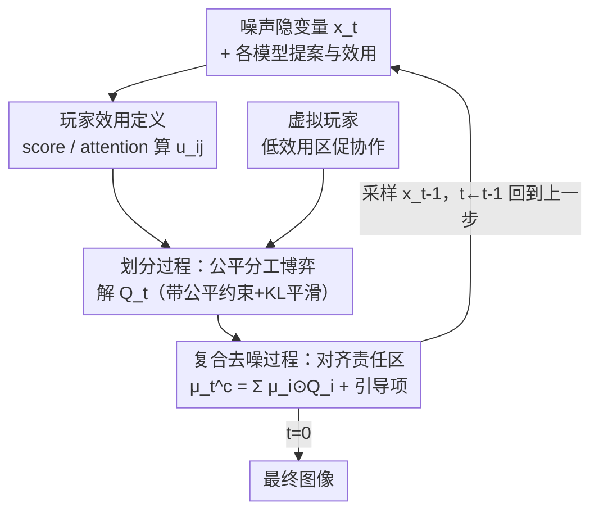

# Divide-and-Denoise: A Game-Theoretic Method for Fairly Composing Diffusion Models

**会议**: ICML 2026  
**arXiv**: [2606.14756](https://arxiv.org/abs/2606.14756)  
**代码**: 未公开  
**领域**: 扩散模型 / 图像生成 / 模型组合  
**关键词**: 扩散模型组合, 公平分工博弈, 推理时引导, 跨注意力效用, 多概念生成

## 一句话总结
把"多个预训练扩散模型协同采样"建模成一个**公平分工博弈**：每一步先用博弈给每个模型分配它该负责的图像区域（allocation），再让复合去噪只在各自分到的区域听各自模型的，从而在不训练、不共享权重的前提下让"单狗模型 + 单猫模型"等组合生成出一张既有狗又有猫、互不抢镜的图，GenEval %images 从 MultiDiffusion 的 58% 提到 88.5%。

## 研究背景与动机
**领域现状**：预训练扩散模型已经多到可以"拼装"——拿一个画狗的模型和一个画猫的模型，想合成一张狗猫同框的图。主流做法是把多个模型的分布做解析组合：乘积/混合密度（Composable Diffusion）、调和平均、对比、逻辑 AND 等，这些操作的好处是采样可解析、实现简单。

**现有痛点**：解析组合太"粗暴"，模型有冲突时保不住各自分布的特征。比如两个模型都习惯把动物画在画面中央，对它们的乘积密度采样，结果往往是中央一坨**互相重叠、糊在一起的狗猫**——目标物体缺失、属性错配。另一条路是 MultiDiffusion 这类**用户手动划分区域**再分配 prompt，但人工指定分工很笨重（蛋白质这种域根本没法手分），而且**完全不考虑每个模型自己的强弱**，还假设模型能忠实服从用户给的版图——这个假设经常崩。

**核心矛盾**：组合的本质是"谁负责画面的哪块"这件分工没人做好。解析组合让所有模型对每个像素一起表态，强势模型容易吃掉整张图（一个 dominating，另一个被忽略）；手工分工又僵硬且无视模型能力。分工既要**高效**（让擅长某区域的模型去画那块），又要**公平**（不能让一个模型彻底压死另一个、导致物体丢失）。

**本文目标**：在推理时**在线推断**出一个分工方案，既最大化总效用（efficiency），又满足公平约束（fairness），且不要求模型共享权重/架构/训练数据，只要它们在同维度的隐空间里操作即可。

**核心 idea**：把分工写成博弈论里的**公平分配（fair division）**问题——隐空间的每个特征是"待分的货物"，每个扩散模型是"参与分配的玩家"，每一步解一个带公平约束的效用最大化博弈得到分配 $Q$，再让复合去噪与这个分配对齐。两个过程（划分过程 + 复合去噪过程）耦合演化，随时间一起更新。

## 方法详解

### 整体框架
Divide-and-Denoise 协同 $n$ 个预训练扩散模型，它们都在一个共同的隐空间里工作，把隐变量看成有 $m$ 个特征的 feature map。整个采样过程是**两条耦合轨迹同步演化**：一条是复合去噪过程的采样路径 $\mathbf{x}_{t-1}\sim p^c_t(\cdot|\mathbf{x}_t)$，另一条是分工过程给出的分配序列 $Q_t$（$Q_t$ 是 $m$ 个特征在 $n$ 个模型间划分方式上的一个分布，可解读为"分工"）。

从 $Q_T=\mathcal{U}(\mathbb{M}_{n,m})$（均匀分工，对谁都公平）和 $p^c_T=\mathcal{N}(0,I)$ 出发，每个时间步做一个**双层优化**：先更新分工 $Q_t=\arg\max_{Q\in\mathbb{Q}_t}\mathcal{G}_t(\mathbf{x}_t,Q)$（在公平约束集 $\mathbb{Q}_t$ 内最大化效率），再选去噪核 $p^c_t=\arg\max_{p\in\mathbb{P}_t}\mathcal{F}_t(p,Q_t)$（让去噪更新对齐这个分工），然后采出 $\mathbf{x}_{t-1}$。两个子问题都靠一个共同的对齐分数 $U_t$ 串起来，再各加问题特定的正则。整个方法**完全训练自由**（inference-time），不改任何模型权重。

### 关键设计

**1. 划分过程：把分工写成带公平约束的分配博弈**

针对"强势模型吃掉整张图、物体丢失"这个痛点，本文把每一步的分工建成一个公平分配游戏：货物是 $m$ 个隐特征，玩家是 $n$ 个模型。分配 $Q$ 用**可分解（decomposable）**形式表示，等价于每个模型 $i$ 对每个特征 $j$ 拿到一个分数权重 $Q_{ij}\in[0,1]$（$\sum_i Q_{ij}=1$），就是"软区域"。效率用期望总效用度量 $U_t(\mathbf{x},Q)=\mathbb{E}_{\mathbf{M}\sim Q}\sum_{i,j}\mathbf{M}_{i,j}u_{ij}(\mathbf{x},t)$，目标 $\mathcal{G}_t$ 在它上面加一个 KL 正则惩罚相邻两步分配的剧变：

$$\mathcal{G}_t(\mathbf{x}_t,Q)=U_t(\mathbf{x}_t,Q)-\beta_t D_{\mathrm{KL}}(Q\,\|\,Q_{t+1}).$$

$\beta_t$ 控制"效率 vs 时间平滑"的权衡（$\beta_t\to\infty$ 时分配始终保持均匀），让分工轨迹随去噪平滑演化、给下游去噪一个稳定信号。公平性写成约束集 $\mathbb{Q}_t$ 里的**线性不等式**——巧妙之处在于 envy-free（不嫉妒别人的 bundle）、proportional（每人至少拿到自己总效用的 $1/n$）、equitable（各人效用相等）这三类经典公平概念都能用 $\mathbb{E}_{\mathbf{M}\sim Q}\sum \mathbf{M}_{i,j}\phi_{ij}\preceq \bm{b}$ 的形式表达并任意叠加，且均匀分配永远可行（可行集非空）。更关键的是，作者证明（Theorem 3.1）当 $Q_{t+1}$ 可分解时，最优 $Q_t$ 仍可分解，且有**闭式 softmax 解**：

$$Q^t_{ij}\propto \exp\!\big(-\langle\lambda^*,\phi_{ij}\rangle + u_{ij}/\beta_t\big)\,Q^{t+1}_{ij},$$

其中 $\lambda^*$ 来自一个低维对偶问题 $\max_{\lambda\ge0}-\langle\bm{b},\lambda\rangle-\sum_j\log Z_j(\lambda)$。于是每一步只需解这个对偶就能拿到分工，代价很小。图 2 直观展示了它的作用：没有公平约束时 car 模型分到的像素远少于 bus，导致 car 物体直接消失；加上公平后分配把两者拉平，car 不再"嫉妒" bus，物体得以保留。

**2. 复合去噪过程：让每个模型只在自己分到的区域说了算**

拿到分工 $Q$ 后，第二个问题是怎么把各模型的去噪提案"拼"成一个复合去噪核 $p^c_t$。本文设计的目标 $\mathcal{F}_t$ 显式让每个模型的提案对齐它被分到的区域：

$$\mathcal{F}_t(p,Q)=\mathbb{E}_{\mathbf{x}_{t-1}\sim p}U_{t-1}(\mathbf{x}_{t-1},Q)-\alpha_t\,\mathbb{E}_{\mathbf{M}\sim Q}\Big[\sum_{i,j}\mathbf{M}_{i,j}D_{\mathrm{KL}}(p_j\,\|\,p^i_j)\Big].$$

第一项（最大化 $U_{t-1}$）鼓励每个模型把偏好集中到自己负责的区域、抑制区域外的偏好；第二项 KL 把"分给模型 $i$ 的特征"上的复合更新拉近模型 $i$ 自己的提案 $p^i_j$，$\alpha_t$ 控制"听分配 vs 听各模型原始提案"的权衡。在"去噪分布按特征分解、$U_t$ 对 $(\mathbf{x},t)$ 联合线性"的假设下，作者给出闭式解（Theorem 3.2），复合均值漂亮地拆成**组合项 + 引导项**两部分：

$$\mu^c_t=\sum_{i=1}^n\mu^i_t(\mathbf{x}_t)\odot Q_i+\frac{\sigma_t^2}{\alpha_t}\nabla_{\mathbf{x}_t}U_t(\mathbf{x}_t,Q),$$

其中 $\odot$ 是逐特征乘、$Q_i$ 是模型 $i$ 的边际权重向量。第一项是"按分工加权各模型的均值提案"，第二项是顺着总效用梯度的引导。一个很有说服力的极限：当 $\alpha_t\to\infty$（引导被压制），该解退化为标准 MultiDiffusion 更新——说明 MultiDiffusion 只是本框架在"硬分工、无引导"下的特例。实践中作者用一阶 Taylor 局部线性化 reward，并把 $\alpha_t$ 重参数化为 $\alpha_t=\sigma_t\|\nabla_{\mathbf{x}_t}U_t\|/\gamma$（$\gamma$ 与时间无关），因为性能对 $\alpha_t$ 敏感——太大压死引导、太小会跑出分布外。

**3. 玩家效用定义：两种"模型对某区域有多在乎"的度量**

博弈要跑，得先有效用 $u_{ij}$（模型 $i$ 对特征 $j$ 的看重程度），本文给两种、都不需要手工设计或额外数据。**score-based 效用**对任意条件扩散模型都适用：把效用定义成分类器自由引导（CFG）的 score 增量在该特征上的能量占比，

$$u_{ij}(\mathbf{x},t)=\frac{\|s^j_t(\mathbf{x},\bm{y}_i;\theta_i)-s^j_t(\mathbf{x};\theta_i)\|^2}{\|s_t(\mathbf{x},\bm{y}_i;\theta_i)-s_t(\mathbf{x};\theta_i)\|^2},$$

即"条件 vs 无条件 score 之差"在特征 $j$ 上占整体的比例，刻画该特征对概念 $\bm{y}_i$ 有多关键。**attention-based 效用**针对带跨注意力的文生图模型：直接用与目标词对应的跨注意力图归一化 $u_{ij}=A^j_t/\sum_j A^j_t$。作者观察到 attention-based 效用噪声更小、时间上定位更一致（图 3），所以 Stable Diffusion 用 attention-based、ImageNet 类条件的 DiT 用 score-based（并加高斯模糊 + 裁剪去噪）。

**4. 虚拟玩家：在没人想要的区域促成模型协作**

纯几何平均式组合（averaging）在模型偏好重叠的低效用区会糊出"混血概念"，但这个"爱融合"的特性反过来可以用来填补空白区。作者往玩家集合里加一个**虚拟玩家**（fictitious player），其去噪核就是所有真实模型均值的平均 $\mu^{n+1}_t=\frac1n\sum_i\mu^i_t$，并赋予它**均匀效用** $u_{(n+1)j}=1/m$。这样在没有任何真实模型强烈在乎的区域，虚拟玩家会接管、用平均提案做背景式的协作填充；而公平约束**只对真实玩家强制**，虚拟玩家不参与公平博弈，纯粹是兜底协作者。

### 一个例子：car + bus 的公平分工
以图 2 的"car 模型 + bus 模型"为例走一遍：初始 $Q_T$ 均匀。某一步若只看效率不加公平，bus 模型对中央大片像素的效用远高于 car，分工会把绝大多数特征划给 bus，复合均值 $\sum_i \mu^i\odot Q_i$ 里 car 的权重 $Q_{\text{car}}$ 几乎为零——最终图里 car 直接缺席。加上"car 至少拿到自身总效用 $1/n$"的比例公平约束后，对偶 $\lambda^*$ 把 car 的 $Q_{ij}$ 拉起来，分工里给 car 留出一块责任区；复合去噪在那块区域听 car 的提案、并被引导项推向 car 的高效用方向，于是 car 和 bus 同时出现、互不重叠。整个过程没有人工画框，分工是每步在线解博弈算出来的。

### 损失函数 / 训练策略
本方法**完全训练自由**，没有任何可学习参数或损失——所有模型都是冻结的预训练扩散模型，协同只发生在推理采样时。实验用 DDIM scheduler，$T=50$ 步、噪声尺度 $\eta=0.015$；CFG guidance scale Stable Diffusion 取 $\omega=7.5$、DiT 取 $\omega=4$；$\gamma=\eta$，$\beta_t$ 在 score-based 用 0.01、attention-based 用 0.001；默认施加比例公平（每个模型至少拿到自身总效用的 $1/n$）。

## 实验关键数据

### 主实验
在 GenEval（COCO 词表检测物体及颜色）和 CLIP-Score / Reward / VQA 上评测，用 Stable Diffusion 协同 2 个单概念模型：

| 协同策略 | GenEval %images ↑ | %prompts ↑ | CLIP(joint) ↑ | Reward(joint) ↑ | VQA(joint) ↑ |
|----------|-------------------|------------|---------------|-----------------|--------------|
| Averaging | 31.25% | 59% | 26.26 | −0.49 | 0.720 |
| Composable Diffusion | 36.50% | 67% | 26.85 | −0.26 | 0.749 |
| Multi-Concept Diffusion | 53.75% | 86% | 27.05 | 0.28 | 0.753 |
| MultiDiffusion | 58.00% | 93% | 27.65 | 0.34 | 0.816 |
| **Divide-and-Denoise（本文）** | **88.50%** | **99%** | **30.02** | **1.23** | **0.960** |

本文在所有指标上大幅领先：%images 比最强基线 MultiDiffusion 高出 30 个百分点，Reward 从 0.34 提到 1.23，VQA 从 0.816 提到 0.960。值得注意的是，连一个真正在多概念联合 prompt 上工作的 Multi-Concept Diffusion（53.75%）也被一队单概念模型的协同反超，说明"会分工的专家队"胜过"一个全能模型"。

### 消融实验

| 配置 | GenEval %images | %prompts | 说明 |
|------|-----------------|----------|------|
| Ours（含公平） | 88.50% | 99% | 完整方法 |
| Ours w/o fairness | 87.00% | 98% | 去掉公平约束，纯效率最大化 |
| MultiDiffusion | 58.00% | 93% | ≈ $\alpha\to\infty$ 的硬分工特例 |

### 关键发现
- **公平约束的价值不在平均分数、而在防"丢物体"**：去掉公平后 GenEval %images 只小幅降到 87.00%，但图 2 显示无公平时会出现 car 被 bus 挤掉的整物体缺失——这类失败被平均指标稀释了，定性上公平是防止单模型垄断的关键。
- **概念越多越能拉开差距**：从 2 模型升到 3 模型，Averaging 直接崩到 %images 1.50%、Composable 3.50%，而本文方法仍保持高水平，说明分工博弈在更拥挤的组合场景下更有价值。
- **attention-based 效用优于 score-based**：注意力图给出的定位信号噪声更低、时间更一致，所以在 Stable Diffusion 上优先采用。

## 亮点与洞察
- **把"模型组合"翻译成"公平分配博弈"**是很漂亮的视角迁移：分工不再靠人手画框或粗暴乘积，而是每步在线解一个带公平约束的优化，且 envy-free/proportional/equitable 全能用线性约束表达、可叠加。
- **两个闭式解把理论落到可跑算法**：分工有 softmax 闭式（Theorem 3.1），复合去噪均值拆成"组合项 + 引导项"（Theorem 3.2），还顺手证明 MultiDiffusion 是 $\alpha\to\infty$ 的特例——既统一了已有方法又解释了它为什么不够好。
- **虚拟玩家**这个 trick 可迁移：把"爱融合"的平均行为收编成一个不受公平约束的兜底玩家，专门处理无人在意的低效用区，思路可用到任何"主-辅"协同里。
- 整套方法**训练自由、不要求模型同构**，只需共享隐空间维度，组合蛋白质模型这类无法手工分区的域时尤其有想象空间。

## 局限与展望
- **要求模型在同维度隐空间**：不同隐空间维度的模型无法直接组合，限制了"任意拼装"的范围。
- **每步要解对偶 + 局部线性化引导**，相比纯解析组合有额外推理开销；性能对 $\alpha_t$ 敏感、需重参数化才稳，超参（$\beta_t$ 在两种效用下差一个量级）有调参负担。
- **实验集中在 2-3 个物体的图像生成**：更多概念、更复杂关系（论文刻意不给多概念 prompt 注入关系信息）下的表现，以及作者强调的蛋白质等非图像域，都还停留在愿景，未给实证。
- 公平的好处主要体现在防物体丢失，但在平均指标上提升有限，如何把"公平收益"更显式地度量出来值得继续做。

## 相关工作与启发
- **vs Composable Diffusion / 解析组合**：他们对各模型 score 做乘积/加权和，所有模型对每个像素一起表态，冲突时糊成混血概念；本文先分工再去噪，每个区域只听被分到的模型，避免重叠。
- **vs MultiDiffusion / 用户手工分区**：MultiDiffusion 用固定的人工版图（如等宽竖条）分配模型，僵硬且无视模型能力；本文在线推断软分工，且证明 MultiDiffusion 是本框架 $\alpha\to\infty$（硬分工、无引导）的特例。
- **vs Multi-Concept 单模型**：用一个多概念 prompt 喂单个 SD，受限于该模型本身对多物体的处理能力；本文用一队单概念专家协同，实验中反超单一多概念模型。

## 评分
- 新颖性: ⭐⭐⭐⭐⭐ 把扩散模型组合重述为公平分配博弈、并给出两条闭式解，视角和理论都新。
- 实验充分度: ⭐⭐⭐⭐ GenEval + 多指标 + 2/3 模型 + 公平消融充分，但概念数和应用域偏窄。
- 写作质量: ⭐⭐⭐⭐ 理论推导清晰、图 2/3 直观，但博弈论与扩散符号交织，阅读门槛偏高。
- 价值: ⭐⭐⭐⭐ 训练自由、不要求同构的组合范式，对模型复用和非图像域有迁移潜力。

<!-- RELATED:START -->

## 相关论文

- [\[CVPR 2026\] Back to Basics: Let Denoising Generative Models Denoise](../../CVPR2026/image_generation/back_to_basics_let_denoising_generative_models_denoise.md)
- [\[NeurIPS 2025\] Information-Theoretic Discrete Diffusion](../../NeurIPS2025/image_generation/information-theoretic_discrete_diffusion.md)
- [\[NeurIPS 2025\] Information Theoretic Learning for Diffusion Models with Warm Start](../../NeurIPS2025/image_generation/information_theoretic_learning_for_diffusion_models_with_warm_start.md)
- [\[ICML 2026\] Divide and Conquer: Reliable Multi-View Evidential Learning for Deepfake Detection](divide_and_conquer_reliable_multi-view_evidential_learning_for_deepfake_detectio.md)
- [\[CVPR 2025\] Composing Parts for Expressive Object Generation](../../CVPR2025/image_generation/composing_parts_for_expressive_object_generation.md)

<!-- RELATED:END -->
