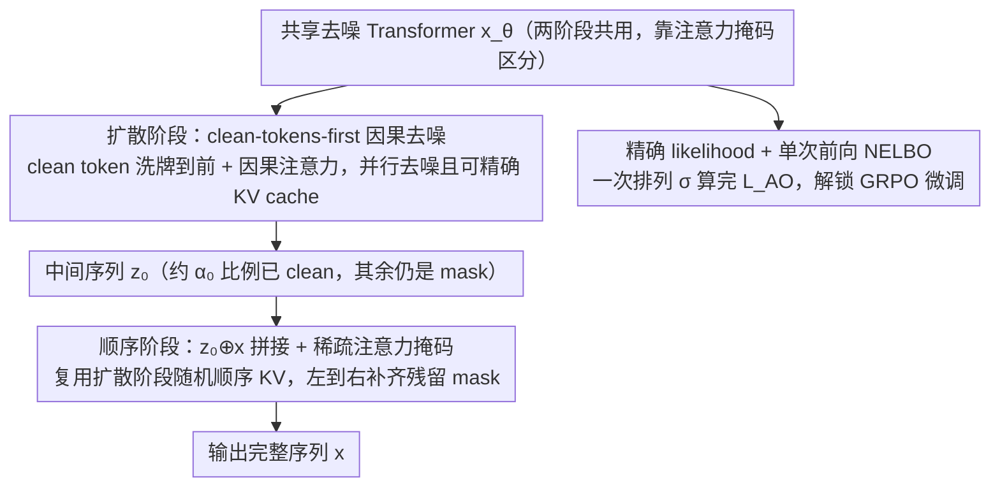

# Esoteric Language Models: A Family of Any-Order Diffusion LLMs

**会议**: ICML 2026  
**arXiv**: [2506.01928](https://arxiv.org/abs/2506.01928)  
**代码**: https://s-sahoo.com/Eso-LMs (有)  
**领域**: LLM 预训练 / 离散扩散语言模型  
**关键词**: Masked Diffusion LM, Any-Order AR, KV Cache, 因果注意力, 混合训练

## 一句话总结
Eso-LMs 把 AR 与 Masked Diffusion 在 loss、注意力、采样三个层面深度融合：用一个 causal-on-shuffled-sequence 的去噪 Transformer 同时支持并行扩散和左到右 AR，从而**首次让 MDM 在扩散阶段也能用上精确 KV cache**，在 OWT 长上下文上比 MDLM 快 14–65×、比 BD3-LM 快 3–4×，并在 speed–quality Pareto 前沿上取得 SOTA。

## 研究背景与动机
**领域现状**：语言模型正从纯 AR 走向"AR + 离散扩散"两条腿。AR 模型质量最好但只能逐 token 解码；以 MDLM 为代表的 Masked Diffusion LM (MDM) 支持并行生成、可控生成，规模化到 8B 后在 math/code/science 上已逼近 LLaMA。

**现有痛点**：MDM 落地有两大致命短板。其一，推理慢——虽然名义上"并行解码"，但去噪 Transformer 使用 **双向注意力**，每一步都要 over full sequence 重新算一次 Q/K/V，**无法 KV cache**，长序列下比 AR 还慢。其二，likelihood 没办法精确算——NELBO 只是上界，做 GRPO 这类 RL 微调时连一个可用的 policy log-prob 都拿不到。BD3-LM 把序列切成 block，block 之间 AR、block 内 MDM，**只能 cache block 之间**，block 内仍要 full forward，而且 block 一小（≤16）就出现严重的"并行解码冲突"，低 NFE 下样本质量塌掉。

**核心矛盾**：AR 的"因果注意力"是 KV cache 的前提，MDM 的"双向注意力"是并行去噪的前提——两者架构上互斥；任何想兼得二者优势的方案都要回答"用什么样的注意力既支持随机顺序去噪、又支持 KV 复用"。

**本文目标**：(1) 设计一个共享的去噪 Transformer，同时承载并行扩散和左到右 AR 两种生成模式；(2) 在扩散阶段也支持**精确 KV cache**（不是近似）；(3) 给出 MDM 第一个可计算的精确 likelihood 公式，让 RL 类目标可用。

**切入角度**：作者抓住 Ou et al. (2025) 揭示的等价关系——MDM 的 NELBO 等价于在所有排列 $\sigma$ 上平均的"Any-Order AR" loss $L_\text{AO} = -\mathbb{E}_\sigma \sum_\ell \log p_\theta(x^{\sigma(\ell)} \mid x^{\sigma(<\ell)})$。既然 MDM 本质就是 AO-AR，那就**直接当 AR 来训**：把 zt 里的 clean token 洗牌到前面、masked token 排后面，再用普通的因果注意力，就既是 MDM 又是 AR。

**核心 idea**：用"clean-tokens-first + causal attention on shuffled sequence"的去噪 Transformer 同时实现并行扩散和 AR；再加一项 AR loss + 一个特殊的稀疏注意力掩码，让 AR 阶段能 reuse 扩散阶段建好的随机顺序 KV，从而构成一个"先 MDM 并行铺一层、再 AR 填空"的两阶段采样器。

## 方法详解

### 整体框架
Eso-LMs 把生成过程拆成"先并行铺一层、再 AR 填空"两段，写成 $p_\theta(x) = \sum_{z_0} p^\text{AR}_\theta(x \mid z_0)\, p^\text{MDM}_\theta(z_0)$：MDM 组件先并行去噪出一个**部分 masked 的中间序列** $z_0$（平均 $\alpha_0$ 比例的位置已是 clean），AR 组件再把 $z_0$ 里残留的 mask 从左到右补齐。其中 $\alpha_0$ 是一个连续超参，$\alpha_0=1$ 退化成纯 MDM、$\alpha_0=0$ 退化成纯 AR、中间值在 perplexity 上给出两者的平滑插值。整条流程只靠**一个共享去噪 Transformer** $x_\theta$ 承载，用不同的注意力掩码区分阶段；其变分上界恰好分解成一项 AR 交叉熵加一项 MDM NELBO，训练时按比例 $\kappa$（默认 0.5）把 batch 一半喂 AR loss、一半喂 MDM loss。

### 关键设计

**1. 扩散阶段的 clean-tokens-first 因果去噪：把 MDM 改造成可 KV cache 的 AR**

MDM 推理慢的根因是双向注意力让"已经预测出的 token"依赖"未来还要解码的 token"，每步都得 over full sequence 重算 Q/K/V，无法 cache。Eso-LMs 切掉这条边：给 $z_t \sim q_t(\cdot \mid x)$，**把 clean token 连同其原始 positional embedding 一起洗牌到序列前面、mask token 排到后面**，再用标准左到右因果注意力训练去噪。这一步重排正是 Any-Order AR 视角的落地——随机顺序的 MDM 本质"只是 AR 的一种排列"，按生成顺序重排成因果序列就既是 MDM 又是 AR，无需放弃并行（一次 forward 仍能同时去噪一批 mask）。重排后 clean token 之间因果可见，恰好对应采样时"前面步骤已解出的 clean token"，KV cache 得以一路复用；mask token 只看左侧 clean、看不到未来要去噪的 mask，符合采样的因果约束。于是每步采样的 forward pass 只过"已 clean 的 token + 当前要去噪的 mask"而非整条序列，把 MDM 的推理瓶颈从 $O(L^2)$ 降到 $O(L)$，长序列下省的不是常数因子。

**2. 顺序阶段的 $z_0 \oplus x$ 拼接 + 稀疏注意力掩码：让 AR 复用扩散阶段的随机顺序 KV**

纯 AR 训练要求每个被预测 token 都有完整 clean 左 context，但 $z_0$ 里夹杂的 mask 没有这种 context，常规做法只能放弃 cache 重新 forward。Eso-LMs 用一个"伪左 context"骗过去：训练时把 clean+mask 的 $z_0$ 与完整 $x$ 拼成长度 $2L$ 的 $z_0 \oplus x$ 喂进同一个 Transformer，配一个依赖排列 $\sigma$ 的 $2L \times 2L$ 结构化稀疏注意力 bias $A$——clean token 在 $\sigma$ 下排在 mask 之前、mask token 保持自然顺序、每个待预测的 mask 位置 $i$ 只能 attend 到其左侧真实 token $x_{<i}$；$x$ 侧输出丢弃，只用 $z_0$ 侧 mask 位置的 logits 算 AR 交叉熵。由于 clean token 在扩散阶段本就按 $\sigma$ 顺序生成并 cache，AR 采样时直接复用这份 KV、再因果地逐个解 mask 即可，等价于让 AR 学会"基于一个非自然顺序的 KV 序列"做条件预测，从而把 cache 在两阶段间无缝衔接（完整实现用 FlexAttention 写出来不到一屏代码，Fig. 9）。代价是序列长度翻倍，但只有一半 batch 走 AR 训练，整体训练只比 MDLM 慢约 1.37×。

**3. MDM 的首个精确 likelihood 估计 + 单次前向 NELBO：解锁 GRPO 类 RL 微调**

MDM 想做 RL 微调必须能算 policy 的 $\log p$，但原本的 NELBO 只是上界、每个数据点还要 $L$ 次 forward，exact likelihood 更是缺失。基于 $L_\text{AO}$ 等价性，作者证明了一个 importance-weighted 上界（Theorem 3.1）：$L^K_\text{AO} = -\mathbb{E}_{\sigma_{1:K}}\left[\log \tfrac{1}{K} + \log\sum_{k=1}^K \exp\sum_\ell \log p_\theta(x^{\sigma_k(\ell)} \mid x^{\sigma_k(<\ell)})\right]$，并给出 $-\log p_\theta(x) \le L^K_\text{AO} \le L_\text{MDM}$、$L^K_\text{AO}$ 关于 $K$ 单调递减、$K\to\infty$ 时收敛到真 likelihood，是 MDM（以 Eso-LMs $\alpha_0=1$ 为代理）的首个（渐近）精确 likelihood 公式。更妙的是一次排列 $\sigma$ 就刻画了整条扩散轨迹上的 $L$ 个 latent，所以 $L_\text{AO}$ 在 Eso-LMs 上只需一次 forward 就能算完（MDLM 因双向注意力做不到）：表 2 实测 MDLM 用 10 个 MC 样本算 $L_\text{MDM}$ 标准差 0.56，Eso-LMs 用 1 个 $\sigma$ 算 $L_\text{AO}$ 标准差仅 0.03，更准也更省。这套估计器已被后续工作 Wang et al. (2025b) 用作 GRPO 的 likelihood，在 0.1B 和 8B 规模上都打过 Black et al. (2024) 与 Zhao et al. (2025)。

### 损失函数 / 训练策略
总目标是 (7) 式的变分上界 $-\log p_\theta(x) \le \mathbb{E}_{z_0}[\text{AR loss}] + \mathbb{E}_{q_t,t}[\text{MDM loss}]$。给定 batch 按 $\kappa$ 拆分：$\kappa=0.5$ 走扩散 loss、$1-\kappa$ 走 AR loss（$\alpha_0=1$ 时 $\kappa=1$）。AR loss 里用替换算子 $\odot$ 把 $z_0$ 的前 $\ell-1$ 位换成真实 $x_{<\ell}$，保证被预测的 mask 有干净左 context；噪声调度采用线性 $\alpha_t = \alpha_0(1-t)$。$\alpha_0=1$ 时把 MDM loss 的系数 $\alpha'_t/(1-\alpha_t)$ 替换为 $-1$，经验上降低训练方差、加快收敛。

## 实验关键数据

### 主实验
LM1B（$L=128$, 1M steps）和 OWT（$L=1024$, 250K steps）的测试 perplexity，AR/MDM 插值非常平滑：

| 方法 | LM1B PPL (NELBO) | LM1B PPL (Exact) | OWT PPL (NELBO) | OWT PPL (Exact) |
|------|------------------|------------------|-----------------|-----------------|
| AR Transformer | – | 21.86 | – | 17.78 |
| MDLM | 31.78 | 26.82 | 25.19 | – |
| BD3-LM ($L'=4$) | 28.23 | – | 20.96 | – |
| **Eso-LM ($\alpha_0=1$)** | 36.12 | 31.65 | 30.06 | 29.31 |
| **Eso-LM ($\alpha_0=0.5$)** | 32.53 | 28.07 | 27.94 | 26.61 |
| **Eso-LM ($\alpha_0=0.125$)** | 26.29 | 23.02 | 21.92 | 20.53 |
| **Eso-LM ($\alpha_0=0)$** | – | 21.86 | – | 17.78 |

长上下文采样延迟（OWT, $T \gg L$，与 AR 相同 NFE 级别）：

| 上下文 $L$ | vs MDLM 加速 | vs BD3-LM ($L'{=}16$) 加速 | vs BD3-LM ($L'{=}4$) 加速 |
|--------|--------------|--------------------------|--------------------------|
| 2048 | ~14× | 显著 | 显著 |
| 8192 | ~65× | ~3.2× | ~3.8× |
| 10240 (微调后) | 与 BD3-LM 同质量下 ~5× | – | – |

### 消融实验

| 配置 | 关键现象 | 说明 |
|------|---------|------|
| Eso-LM ($\alpha_0=1$, full) | LM1B NELBO 36.12 | 比 MDLM 差约 4 点 |
| Eso-LM (A)：仅把 mask 上的 attention 改成因果，clean 仍双向 | $\alpha_0=1$ 时与 MDLM 持平 | 说明 perplexity gap 主要来自"clean 之间也变因果"——这是为换 KV cache 付出的代价 |
| $\kappa$ 扫描 (Table 4) | $\kappa=0.5$ 最优 | AR/MDM loss 各占一半训练样本最佳 |
| MC 估计 NELBO (Table 2) | $L_\text{AO}$ 单样本 σ=0.03 vs $L_\text{MDM}$ 10 样本 σ=0.56 | 单次前向更准更省 |
| Block sampler vs 原 ancestral | 低 NFE 下 MAUVE 显著提升 | 只并行解远距离 mask，避免邻近冲突 |

### 关键发现
- Speed–quality Pareto 前沿（Fig. 4，MAUVE vs 采样耗时）上 Eso-LMs 全线压制 MDLM 与 BD3-LM；BD3-LM 在低 NFE 区间样本质量崩塌，Eso-LM 不崩。
- $\alpha_0=1$ 训练已足够：作者实测一个 $\alpha_0^\text{train}=1$ 的模型靠在采样阶段调 $\alpha_0^\text{eval}$ 就能覆盖整个 Pareto 前沿，省得为每个工作点单训一个模型（Remark 2）。
- $\alpha_0$ 越小越接近 AR，"exact PPL 与 NELBO PPL 的 gap" 也越小——侧面验证了 IW bound 与 NELBO 在不同插值点上的紧致性差异。

## 亮点与洞察
- "Any-Order AR ≡ MDM" 这条等价关系之前已知，作者第一次把它**架构层落地**：靠"洗牌 + 因果"两步就把 MDM 改造成可 KV cache 的 AR 变体，没引入任何额外参数。这是非常工程化但效果极强的 insight。
- 拼接 $z_0 \oplus x$ + 稀疏 mask 这种"训练时拼双倍序列、推理时不拼"的设计很值得借鉴——它把"AR 需要左 context"和"MDM 给出随机顺序 KV"的矛盾通过训练阶段单独造一个上下文承担掉，推理时直接复用扩散阶段的 cache。
- Exact likelihood + 单次前向 NELBO 不只是理论好看：它直接把 MDM 接入了 GRPO 这套主流 RL 工具链，已被后续 8B 规模工作 (Wang et al. 2025b) 实证更优。这是 Eso-LMs 比表面 perplexity 数字更深远的影响。
- Remark "perplexity 在有限 NFE 下不反映质量" 是对 diffusion LM 评测范式的一次反思——$\alpha_0=1$ Eso-LMs PPL 比 MDLM 差，但任何固定时间预算下样本质量都更好。提醒做扩散 LM 的人不要只刷 PPL。

## 局限与展望
- 作者承认：$\alpha_0<1$ 时训练比 MDLM 慢约 1.37×（序列长度 doubled），但仍快于 BD3-LM；$\alpha_0=1$ 下 NELBO 比 MDLM 差约 4 点（消融定位到"clean 之间也变因果"是主因）；KV 复用有一步延迟，相同 NFE 下比 AR 略慢。
- 我看到的额外局限：(i) 实验全部停在 LM1B/OWT 这种 pretraining 学术规模 (~9K H200 GPU hours)，没有 instruction tuning / 下游任务，scaling 主要靠引用 Sahoo et al. 2026 的 1.7B 结果背书；(ii) "$\alpha_0^\text{train}=1$ 足够"是在 OWT 单一分布上验证的，不同领域是否仍成立未知；(iii) sequential phase 的 $2L$ 拼接对内存友好度有限，long-context fine-tune 时 fp16/bf16 下的稳定性值得继续考察。
- 改进思路：把 Eso-LMs (A) 的"clean 间双向、mask 处因果"再发展一下，或许能找回 PPL 又不失 cache；另一条路是把 IW bound 直接接入 RLHF/RLAIF pipeline，做 MDM 版的 DPO/GRPO。

## 相关工作与启发
- **vs MDLM (Sahoo et al., 2024a)**: 同为 MDM，但 MDLM 用双向注意力的 DiT 去噪、无法 cache；Eso-LMs 改为 causal-on-shuffled-sequence，长序列推理快一到两个数量级，代价是 $\alpha_0=1$ 下 NELBO 略差。
- **vs BD3-LMs (Arriola et al., 2025)**: 都做 AR–MDM 插值，但 BD3-LM 通过 block 大小插值、cache 仅在 block 之间，且小 block 在低 NFE 下质量崩塌；Eso-LMs 通过 $\alpha_0$ 在 token 级别插值、cache 贯穿全程，Pareto 前沿全面更优。
- **vs Pannatier et al. (2024) / Xue et al. (2025)**: 这些是 Eso-LMs 在 $\alpha_0=1$ 的特例；Xue 额外引入 AdaLN 注入位置信息，Eso-LMs 完全靠 attention mask 实现、不加参数。
- **vs 并发 KV cache 工作 (Hu 2025, Wu 2025, Ma 2025)**: 它们都是**近似** cache（block 内仍要 full forward 或频繁刷新），长序列下退化严重；Eso-LMs 是**精确** cache。

## 评分
- 新颖性: ⭐⭐⭐⭐⭐ 把 Any-Order AR 视角真正在架构层落地，给出首个精确 likelihood 公式和扩散阶段精确 KV cache，两条都是 MDM 社区悬了很久的问题。
- 实验充分度: ⭐⭐⭐⭐ LM1B/OWT + 长上下文 + 消融 + Pareto 前沿都覆盖到了，唯独缺真实下游任务和大模型指令微调验证。
- 写作质量: ⭐⭐⭐⭐⭐ 公式、图示（Fig. 1 feature 对比、Fig. 2 unified KV cache 示意、Fig. 3 训练/注意力示意）非常清晰，把一套不直观的设计讲明白了。
- 价值: ⭐⭐⭐⭐⭐ 对 diffusion LM 是关键工程级解锁——长上下文 14–65× 提速 + 单次前向 NELBO 直接让 GRPO 在 MDM 上变得可行，已经被后续 8B 规模工作复用。

<!-- RELATED:START -->

## 相关论文

- [\[ICML 2026\] $f$-Trajectory Balance: A Loss Family for Tuning GFlowNets, Generative Models, and LLMs with Off- and On-Policy Data](f-trajectory_balance_a_loss_family_for_tuning_gflownets_generative_models_and_ll.md)
- [\[ICML 2026\] Order within Chaos: Capturing Intrinsic Energy Anomalies for AI-Manipulated Image Forgery Localization](order_within_chaos_capturing_intrinsic_energy_anomalies_for_ai-manipulated_image.md)
- [\[ICML 2026\] A Systematic Investigation of RL-Jailbreaking in LLMs](a_systematic_investigation_of_rl-jailbreaking_in_llms.md)
- [\[CVPR 2026\] 2ndMatch: Finetuning Pruned Diffusion Models via Second-Order Jacobian Matching](../../CVPR2026/image_generation/2ndmatch_finetuning_pruned_diffusion_models_via_second-order_jacobian_matching.md)
- [\[ICML 2026\] EvoGM: Learning to Merge LLMs via Evolutionary Generative Optimization](evogm_learning_to_merge_llms_via_evolutionary_generative_optimization.md)

<!-- RELATED:END -->
