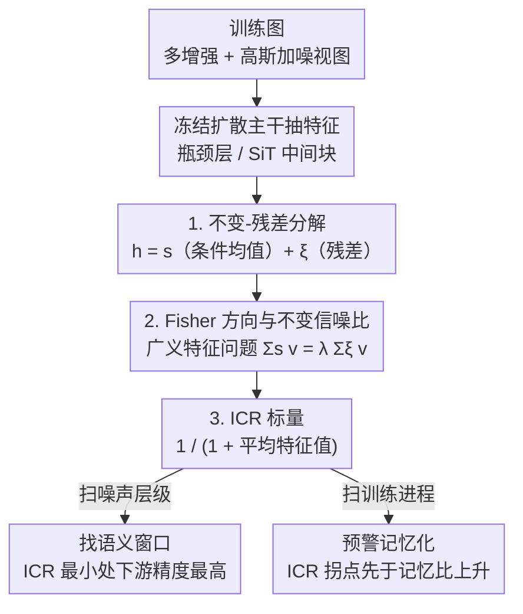

# Evaluating the Representation Space of Diffusion Models via Self-Supervised Principles

**会议**: ICML2026  
**arXiv**: [2606.09718](https://arxiv.org/abs/2606.09718)  
**代码**: 待确认  
**领域**: 扩散模型 / 表示评测  
**关键词**: 扩散模型, 自监督原理, 不变-残差分解, ICR 指标, 记忆化检测

## 一句话总结
本文用自监督学习（SSL）的「不变性 + 扩张性」两条原理来审视扩散模型的内部表示，提出一个无标签标量指标 **ICR（Invariant Contamination Ratio，不变污染比）**——它能在不采样、不训分类器的情况下，预测哪个噪声层级的特征最适合下游分类、并在训练中提前预警过拟合/记忆化的到来。

## 研究背景与动机
**领域现状**：扩散模型早已不只是生成器——把训好的去噪器某个时间步的瓶颈层当特征抽取器，在分类、分割、图像对应等下游任务上能媲美甚至超过 DINOv2、MAE 这类 SSL 方法；反过来，用强 SSL 编码器去正则扩散表示又能提升生成质量。表示学习与生成建模在扩散里高度纠缠。

**现有痛点**：可扩散模型的训练范式和 SSL 截然不同——扩散用**去噪目标**（从高斯污染里恢复干净信号），而大多数 SSL 显式**强制对数据增强不变**、同时保持丰富多样的嵌入空间。两类目标差异这么大，自然引出一个没被回答好的问题：扩散表示到底有没有隐式具备 SSL 直接优化的那些好性质？这些性质又如何随**噪声层级**和**训练进程**演化？

**核心矛盾**：要评估扩散模型「是不是真在学低维图像流形、而非死记训练样本」，现有手段都不趁手——生成指标 FID 被证明**不是可靠的记忆化检测器**；穷举最近邻测试要生成大量样本、代价高昂。缺一个**无标签、训练时可监控、不依赖采样**的内在信号。

**本文目标**：把 SSL 的两条经典原理翻译成扩散表示空间的**几何量**，构造一个能跨噪声层级、跨训练进程持续监控的单标量诊断指标。

**切入角度**：作者锁定 SSL 的两个互补原理——**表示不变性**（同一样本的不同随机扰动应在嵌入空间保持稳定）和**表示扩张性**（不同图像的表示应铺开、避免维度坍缩）。但现有的 Alignment/Uniformity 指标不够用：Alignment 是两视图间的绝对平方距离，表示一扩张它就变大，哪怕语义其实更稳定也会上升；Uniformity 只量「铺得多开」，分不清「不变结构」和「增强敏感噪声」。

**核心 idea**：先把每个扩散表示**显式拆成不变分量 $\bm{s}$ 和残差分量 $\bm{\xi}$**，再用两者协方差的广义特征结构（Fisher 风格信噪比）汇总成一个标量 ICR——它度量「增强/噪声敏感的变化」污染了多少稳定表示空间，越低越「干净」。

## 方法详解

### 整体框架
方法本质是一个**表示诊断流水线**：冻结扩散主干，从下游性能最强的层（U-Net 瓶颈 / SiT 中间 transformer 块）抽特征；对每张训练图采样多个增强 + 高斯加噪视图，把得到的表示按「条件均值 + 残差」拆成不变分量 $\bm{s}$ 和残差分量 $\bm{\xi}$；分别估其协方差 $\bm{\Sigma}_s$、$\bm{\Sigma}_\xi$，解一个广义特征问题得到一组「不变信噪比」特征值，最后汇总成单标量 ICR。ICR 全程无标签、只用训练特征，于是可以沿**噪声层级**扫一遍（找最适合下游的「语义窗口」），也可以沿**训练进程**追踪（区分泛化阶段与记忆化阶段）。

### 关键设计

**1. 不变-残差分解：把每个扩散表示拆成「稳定结构 + 视图噪声」**

针对「扩散表示高维、稳定信息和琐碎变化混在一起、难分离」的痛点，作者对每张训练图 $\bm{x}_0$ 定义一个随机扰动 $a\sim\mathcal{A}$，它同时涵盖语义保持的标准增强（裁剪、颜色等）和扩散目标本身注入的高斯噪声 $\bm{\epsilon}\sim\mathcal{N}(0,\sigma_t^2\bm{I})$（先增强、再加噪）。设 $\bm{h}(\cdot)$ 是固定层抽出的表示，则把随机表示拆成条件均值和残差：

$$\bm{s}(\bm{x}_0)\coloneqq\mathbb{E}_a[\bm{h}(a(\bm{x}_0))\mid\bm{x}_0],\qquad\bm{\xi}(a,\bm{x}_0)\coloneqq\bm{h}(a(\bm{x}_0))-\bm{s}(\bm{x}_0),$$

得到加性形式 $\bm{h}(a(\bm{x}_0))=\bm{s}+\bm{\xi}$。$\bm{s}$ 是**不变分量**，滤掉瞬时扰动、保留对损坏鲁棒的属性；$\bm{\xi}$ 是**残差分量**，捕捉单个含噪视图的琐碎特异变化。论文用最近邻实验佐证（图 2）：用 $\bm{s}$ 检索得到语义相近的图像，用 $\bm{\xi}$ 检索则得到视觉无关、无共享类别结构的图像。由于 $\mathbb{E}[\bm{\xi}\mid\bm{x}_0]=\bm{0}$，全协方差定律给出干净的协方差分解 $\bm{\Sigma}_h=\bm{\Sigma}_s+\bm{\Sigma}_\xi$，其中 $\bm{\Sigma}_s=\mathrm{Cov}_{\bm{x}_0}(\bm{s})$、$\bm{\Sigma}_\xi=\mathrm{Cov}_{\bm{x}_0,a}(\bm{\xi})$——这把 SSL 的两条原理直接翻译成了几何量：**扩张性**对应全协方差迹 $\mathrm{Tr}(\bm{\Sigma}_h)$ 的增长，**不变性**对应 $\bm{\Sigma}_s$ 相对 $\bm{\Sigma}_\xi$ 的主导程度。

**2. Fisher 方向与不变信噪比：沿最优方向量化「稳定信号 vs 残差噪声」**

光有两个协方差还不够，要把「不变性主导多少」量化成方向上的信噪比。作者解一个广义特征问题 $\bm{\Sigma}_s\bm{v}_i=\lambda_i\bm{\Sigma}_\xi\bm{v}_i$，特征值降序 $\lambda_1\ge\dots\ge\lambda_d\ge0$，特征向量在 $\bm{\Sigma}_\xi$ 内积下正交。每个特征值有 Rayleigh 商表示：

$$\lambda_i=\max_{\bm{v}\neq0,\,\bm{v}\perp_{\bm{\Sigma}_\xi}\{\bm{v}_1,\dots,\bm{v}_{i-1}\}}\frac{\bm{v}^\top\bm{\Sigma}_s\bm{v}}{\bm{v}^\top\bm{\Sigma}_\xi\bm{v}}.$$

它沿 Fisher 方向 $\bm{v}_i$ 比较稳定不变分量的方差与残差方差，即该方向上的**不变信噪比**。这沿用了经典 Fisher 线性判别的广义特征结构——$\bm{\Sigma}_s$、$\bm{\Sigma}_\xi$ 分别扮演类间/类内协方差的角色，只不过这里**每张图像各自当作一个类**。这样就把「表示好不好」精确刻画为：在多少方向上、稳定身份信号能压过增强敏感的污染。（实现时给 $\bm{\Sigma}_\xi$ 加 $\tau\bm{I}$ 保证可逆。）

**3. ICR：把方向谱汇总成一个无标签、可监控的标量**

一组特征值给的是「不变结构主导残差变化」的方向剖面，但要训练时实时追踪，需要压成单标量。作者定义不变污染比：

$$\mathrm{ICR}\coloneqq\frac{1}{1+\frac{1}{d}\sum_{i=1}^d\lambda_i}.$$

其中 $\frac{1}{d}\sum\lambda_i$ 是所有 Fisher 方向上的平均不变信噪比：当 $\bm{s}$ 在大多数方向上压过 $\bm{\xi}$ 时这个均值很大，ICR 就低；反之残差污染占据大片表示空间时 ICR 趋近 1。这个朝向刻意对齐了 FID 的约定——**越低越「干净」**。关键优势是 ICR 完全 label-free、只从训练特征算（实践中每图最少 2 个增强 + 训练特征子集即可估出 $\bm{\Sigma}_s$、$\bm{\Sigma}_\xi$），既不需要标签、也不需要外部网络或生成采样，因此能跨噪声层级、跨整个训练过程持续监控。

### 一个完整示例：ICR 怎么用
**用法一（扫噪声层级，找语义窗口）**：对预训练扩散主干，在每个噪声层级 $\sigma_t$ 上用训练特征子集估 ICR、再训线性分类器测精度。结果（图 3）跨 CIFAR10/100、ImageNet 一致呈现：ICR 关于 $\sigma_t$ 是 **U 形**、在中间噪声取最小，而分类精度恰好在同一区间取最高——这个区间就是「语义窗口」。低噪时表示太黏增强细节，高噪时表示塌向噪声，唯有中间相对不变性最强、表示空间最有用。于是无标签的 ICR 直接告诉你该用哪个噪声尺度抽特征。

**用法二（扫训练进程，预警记忆化）**：固定语义窗口里的 $\sigma^\star$，沿训练追踪 ICR。数据充足时，ICR 随训练**单调下降**、与 FID 同步改善（图 4），说明生成质量提升直接反映为表示几何变干净；数据受限时（如 CIFAR10 仅 4096 张），ICR 走出 **U 形**，其最小值**先于**记忆比（memorization ratio）上升出现（图 5/6）——记忆比在 ICR 谷底附近还接近 0，过了谷底才抬头。这意味着 ICR 提供了一个无需生成的、可监控的**早停信号**，正好补上「FID 测不出记忆化」的缺口。进一步看协方差迹（图 8）：数据充足时 $\mathrm{Tr}(\bm{\Sigma}_s)$ 持续涨、$\mathrm{Tr}(\bm{\Sigma}_\xi)$ 仅微增（扩张主要投给不变结构）；数据受限时 $\mathrm{Tr}(\bm{\Sigma}_s)$ 先涨后饱和、$\mathrm{Tr}(\bm{\Sigma}_\xi)$ 继续涨（后期扩张被残差变化主导），这正解释了 ICR 为何转折。

## 实验关键数据

### 主实验
ICR 与下游分类精度跨噪声层级的对应关系（EDM on CIFAR、SiT-XL/2 on ImageNet）：

| 数据集 | 主干 | ICR 最小处 | 分类精度峰值处 | 是否重合 |
|--------|------|-----------|----------------|----------|
| CIFAR10 | EDM | 中间噪声层级 | 中间噪声层级 | 是（U 形 ↔ 单峰） |
| CIFAR100 | EDM | 中间噪声层级 | 中间噪声层级 | 是 |
| ImageNet | SiT-XL/2 | 中间噪声层级 | 中间噪声层级 | 是 |

ICR 与训练动态的对应关系：

| 训练设置 | 数据规模 | ICR 轨迹 | 与生成/记忆的关系 |
|----------|----------|----------|--------------------|
| CIFAR10, EDM（数据充足） | 50K | 单调下降 | 与 FID 同步下降 |
| ImageNet-256, SiT-B/2（数据充足） | 1.28M | 单调下降 | 与 FID 同步下降 |
| CIFAR10, EDM（数据受限） | 4096 | U 形 | 谷底先于记忆比上升 |
| ImageNet-64, EDM（数据受限） | 10K | U 形 | 谷底先于记忆比上升 |
| ImageNet-256, SiT-B/2（数据受限） | 20K | U 形 | 谷底先于记忆比上升 |

### 关键发现
- **ICR 最小 ⇔ 下游精度最高**：跨数据集与主干一致出现「ICR 的 U 形谷 = 线性探针精度的峰」，且 ICR 全程无标签算出，却能准确预测最佳噪声尺度——这是把 SSL 评估自然延拓到扩散的桥梁。
- **ICR 提前预警记忆化**：数据受限时记忆比在 ICR 谷底附近仍近 0、过谷才升，ICR 拐点**领先**记忆化发生，可当早停信号；而 FID 在此场景被证明不可靠。
- **扩张去向揭示泛化 vs 记忆**：数据充足时新增特征容量主要投给不变结构 $\bm{\Sigma}_s$，数据受限后期则被残差 $\bm{\Sigma}_\xi$ 主导——把 ICR 的相对量补成了绝对能量的故事。
- **Alignment 指标会误判**：数据充足训练中 ICR 与 FID 同降，而「越低越好」的 Alignment 损失反而上升（图 11），说明表示一扩张 Alignment 就被绝对距离带偏，ICR 的相对构造更稳健。

## 亮点与洞察
- **把 SSL 原理翻译成扩散表示几何**：不变性→$\bm{\Sigma}_s$ 主导度、扩张性→$\mathrm{Tr}(\bm{\Sigma}_h)$，再用 Fisher 广义特征值汇总成单标量，思路干净且可复用到任意「想无标签评估表示质量」的场景。
- **一个指标三种用途**：选噪声层级、追踪生成质量（免采样）、预警记忆化——同一个 ICR 串起了下游迁移、生成评估、训练动态三件事。
- **「每图各自为类」的 Fisher 视角**：把单图的多增强视图当类内、不同图当类间，巧妙地把判别分析搬进自监督表示评测，是很可迁移的建模技巧。

## 局限与展望
- ICR 抽特征依赖「先验选好的层」（U-Net 瓶颈 / SiT 中间块），换架构或换层可能要重新定位最优层，论文未给自动选层方案。
- 估 $\bm{\Sigma}_s$、$\bm{\Sigma}_\xi$ 需对每图采多个增强视图并加 $\tau\bm{I}$ 正则，超高维表示下广义特征分解的计算与数值稳定性在更大模型上的代价未充分讨论。
- 验证集中在图像分类 + 记忆化检测，ICR 是否能指导分割、对应等更复杂下游任务、或直接当训练正则项去**改进**生成质量，仍是开放方向。

## 相关工作与启发
- **vs FID / 最近邻记忆测试**：FID 被证明测不出记忆化、最近邻测试要大量生成样本且昂贵；ICR 无标签、免采样、训练时即可监控，互补地提供了内在早停信号。
- **vs Alignment & Uniformity（wang2020）**：Alignment 是绝对平方距离、随表示扩张被误带高，Uniformity 分不清不变结构与增强噪声；ICR 用不变-残差分解 + 相对信噪比，对扩张鲁棒、能区分污染。
- **vs RankMe / 有效秩等无标签表示指标**：那些主要为 SSL 表示选择设计、看协方差谱衰减；ICR 专门利用增强 + 扩散噪声诱导的不变-残差分解，研究扩散特有的语义窗口、记忆化与训练动态。

## 评分
- 新颖性: ⭐⭐⭐⭐⭐ 用 SSL 原理 + Fisher 广义特征构造无标签 ICR 指标，视角与构造都新。
- 实验充分度: ⭐⭐⭐⭐ 跨 CIFAR/ImageNet、EDM/SiT、数据充足/受限多设置验证，且有 Alignment 对照；偏分析、缺下游任务多样性。
- 写作质量: ⭐⭐⭐⭐⭐ 从 SSL 原理一路推到几何量再到标量，逻辑链清晰、图文对应。
- 价值: ⭐⭐⭐⭐ 给扩散模型提供了训练时可监控的内在诊断与早停信号，实用价值明确。

<!-- RELATED:START -->

## 相关论文

- [\[ICLR 2026\] Adapting Self-Supervised Representations as a Latent Space for Efficient Generation](../../ICLR2026/image_generation/adapting_self-supervised_representations_as_a_latent_space_for_efficient_generat.md)
- [\[ICLR 2026\] Generalization of Diffusion Models Arises with a Balanced Representation Space](../../ICLR2026/image_generation/generalization_of_diffusion_models_arises_with_a_balanced_representation_space.md)
- [\[AAAI 2026\] Stabilizing Self-Consuming Diffusion Models with Latent Space Filtering](../../AAAI2026/image_generation/stabilizing_self-consuming_diffusion_models_with_latent_space_filtering.md)
- [\[ICML 2026\] SAEmnesia: Erasing Concepts in Diffusion Models with Supervised Sparse Autoencoders](saemnesia_erasing_concepts_in_diffusion_models_with_supervised_sparse_autoencode.md)
- [\[CVPR 2026\] Spatial-SSRL: Enhancing Spatial Understanding via Self-Supervised Reinforcement Learning](../../CVPR2026/image_generation/spatial-ssrl_enhancing_spatial_understanding_via_self-supervised_reinforcement_l.md)

<!-- RELATED:END -->
