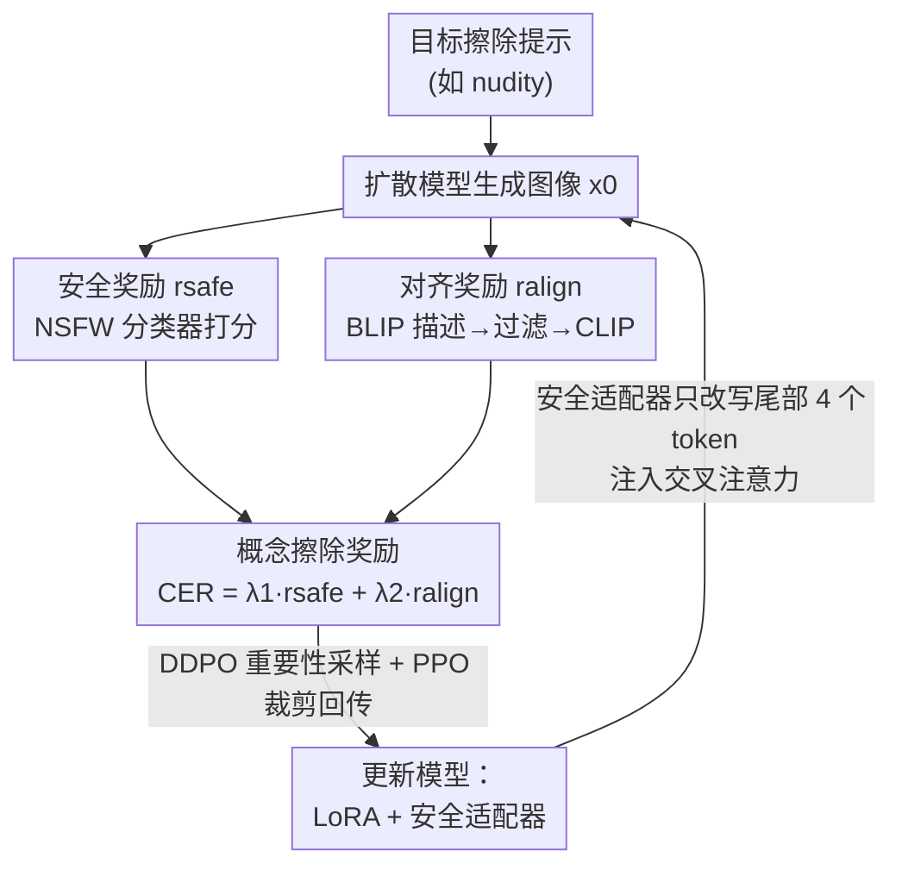

# ForceForget: Reinforcement Concept Removal for Enhancing Safety in Text-to-Image Models

**会议**: ICML 2026  
**arXiv**: [2606.14351](https://arxiv.org/abs/2606.14351)  
**代码**: 待确认  
**领域**: 图像生成 / 扩散模型 / AI 安全  
**关键词**: 概念擦除, 文生图安全, 强化学习, 交叉注意力适配器, NSFW 防御

## 一句话总结
把"擦除不安全概念"重新表述成强化学习的奖励优化问题——用一个安全奖励 + 一个对齐奖励组成的概念擦除奖励（CER）微调扩散模型，再配一个只改写少量文本 token 的"安全适配器"，在彻底去掉色情内容的同时，最大限度保住有害提示里夹带的良性语义（尤其是"人"相关内容）。

## 研究背景与动机
**领域现状**：文生图模型（Stable Diffusion、DALL·E 2 等）能生成各种内容，也包括色情、暴力等不安全内容。主流的安全手段有四类：训练集过滤（NSFW 检测器筛数据）、事后安全过滤器（拦截生成结果）、免训练引导（SLD/SAFREE，在推理时把生成往"反方向"推）、以及权重微调擦除（ESD/MACE/CA/DuMo 等，直接改 UNet 权重去掉目标概念）。

**现有痛点**：监督微调（SFT）类擦除方法的核心毛病是**擦得太狠**。一方面，"不安全概念"在 SFT 里本身就难以精确定义，导致擦除不彻底；另一方面，由于"裸露"这类概念天然和"人"强相关，擦除能力强的方法往往会连带损伤模型生成正常人物图像的能力。更糟的是，当一个有害提示里同时夹带了安全语义（如"穿衣服的人"），现有方法常常把安全语义也一并抹掉，造成**过度擦除**、模型可用性下降。此外，最近工作指出针对 T2I 设计的擦除方法在 image-to-image（I2I）场景里基本失效。

**核心矛盾**：擦除强度与模型可用性之间存在 trade-off——擦得越干净，越容易误伤良性内容；保留得越多，又容易被对抗提示绕过。SFT 用"硬标签/锚点概念"来对齐，缺乏对"生成结果到底安不安全"的直接反馈信号。

**本文目标**：在彻底消除不安全内容的同时，保住有害提示中的安全语义解释能力，并把擦除能力延伸到 I2I 场景与通用概念（艺术风格、物体）。

**切入角度**：作者借鉴了用 RL 微调扩散模型去优化"模糊目标"（如美学质量、可压缩性）的成功经验（DDPO/AlignProp）——既然"安全"也是一个难以用 ground-truth 监督的模糊目标，那就把它写成奖励函数，让模型在自己生成—评估—更新的闭环里学会"避开不安全、贴近安全"。

**核心 idea**：用强化学习的奖励优化代替监督微调来做概念擦除——设计一个由"安全奖励 + 对齐奖励"组成的概念擦除奖励 CER，再用一个轻量"安全适配器"只改写文本嵌入的少量尾部 token，把不安全概念从交叉注意力里"挤"出去而不动其余语义。

## 方法详解

### 整体框架
ForceForget 把概念擦除做成一个 RL 微调闭环：给定一个要擦除的目标概念（如"nudity"），模型不断从提示池里采样提示、生成图像，然后用一个**概念擦除奖励 CER** 给这批图像打分，再用策略梯度（沿用 DDPO 的重要性采样 + PPO 裁剪）回传更新模型。CER 由两部分构成——**安全奖励** $r_{safe}$ 通过 NSFW 分类器判断图像安不安全，**对齐奖励** $r_{align}$ 通过图像描述器 + CLIP 判断图像是否还忠于"安全版语义"。在网络结构上，文本特征被拆成两段：大部分走常规的 LoRA 线性投影，少量尾部 token 走一个**安全适配器**，二者拼接后送进 UNet 的交叉注意力层，由此实现"只调控不安全语义、不动主体语义"的擦除。

### 关键设计

**1. 安全奖励：用图像级 NSFW 分类器给"安不安全"打直接分**

SFT 的痛点是没法直接告诉模型"你这张图安不安全"。本文用一个图像 NSFW 分类器 $\mathcal{M}$ 作为安全评估器，对生成图 $x_0$ 输出"Neutral"和"Porn"两类分数 $\varpi_s, \varpi_u$，再加权求和得到安全奖励：

$$r_{safe}=\alpha\varpi_s+\beta\varpi_u=\mathcal{M}(x_0)$$

其中 $\alpha$ 是正系数、$\beta$ 是负系数。安全奖励为正表示图像安全，为负表示存在潜在不安全内容。这个信号直接来自生成结果本身，相当于给 RL 一个"现场裁判"，引导模型把生成分布整体推向安全域——比 SFT 用预设锚点概念去对齐要直接得多。提示池本身很小，只放"nudity""sexual""naked""erotic"几个泛化的不安全词。

**2. 对齐奖励：用"图像自描述 + 目标条件"防止过度擦除和退化**

只用安全奖励有个隐患：NSFW 分类器只认得有限内容，模型可能学会生成任意乱七八糟的图像来"骗过"裁判，甚至作者观察到模型会在这些简单提示上倾向生成任意的人体裸图。为此引入对齐奖励，让擦除后的图像仍然"言之有物、且是安全的"。做法是先用图像描述器（BLIP）给生成图反向写一句 caption，再用一个朴素的关键词过滤器 $\tau$ 滤掉 caption 里的色情词（如把"a nude woman with blond hair"清洗成"a woman with blond hair"），最后用 CLIP 衡量图像与这句"安全 caption"的一致性；同时再加一个辅助目标条件 $c_\phi$（"a photo of person wearing cloth"），把奖励往"人物且穿衣"的方向拉：

$$r_{align}=CLIP(x_0,\tau(BLIP(x_0)))+CLIP(x_0,c_\phi)$$

第一项保证图像忠于自身的安全语义、不退化成噪声，第二项专门补偿"擦除裸露 → 误伤人物生成"这个最常见的可用性损失。两个奖励缩放到 $[0,1]$ 后相加得到 $CER=\lambda_1 r_{safe}+\lambda_2 r_{align}$，$\lambda_1,\lambda_2$ 控制"擦得干净"与"保得住"之间的权衡，缩放是为了防止奖励坍缩到单一目标。

**3. 安全交叉注意力适配器：只改写尾部少量 token，把不安全语义"隔离"出去**

作者发现单纯用 CER 做 DDPO 微调收敛慢、擦不彻底，需要很多 epoch。于是在 UNet 的交叉注意力层加一个轻量"安全适配器"。关键观察是 CLIP 对短提示会做 padding，像"nudity"这种短概念落在序列的**前部**，而**尾部** token 携带的语义更弱——因此把适配器作用在前部 token 会破坏提示本意，作用在尾部 token 反而能整体擦除又不伤主体语义。具体地，把文本特征拆成两段 $c_t=c_t''\otimes c_t'$：尾部一小段 $c_t'$（实现里取最后 4 个 token）走安全适配器的独立投影 $K_{sa}=c_t'W_k'$、$V_{sa}=c_t'V_k'$，其余 $c_t''$ 走常规 LoRA 投影得到 $K'',V''$，二者拼接后进交叉注意力：

$$\mathbf{Z_{sa}}=Attention(Q,\ K''\otimes K_{sa},\ V''\otimes V_{sa})$$

这样安全适配器学会"主导地表示不安全概念"，从而让文本特征的主体部分专注于安全内容——相当于把不安全语义集中"引流"到几个被监管的 token 上再覆盖掉，既保持轻量（只 4 个 token，省显存），又比只动整段交叉注意力或只动自注意力的旧方法更难被隐式对抗提示绕过。

### 损失函数 / 训练策略
目标是最大化期望奖励 $\mathbf{J}(\theta)=E_{c\sim p(c),\,x_0\sim p_\theta(x_0|c)}[r(x_0,c)]$，其中 $r(x_0,c)=CER$。沿用 DDPO，把去噪过程当作多步决策，用重要性采样做多步更新：

$$\nabla_\theta\mathbf{J}(\theta)=E\Big[\sum_{t=0}^{T}\frac{p_\theta(x_{t-1}|x_t,c)}{p_{\theta_{old}}(x_{t-1}|x_t,c)}\nabla_\theta\log p_\theta(x_{t-1}|x_t,c)\,r(x_0,c)\Big]$$

为避免新策略偏离旧策略太多导致估计失真，用 PPO 的裁剪（trust region）控制更新步长。可训练参数只有 LoRA 投影 + 安全适配器，其余权重冻结。

## 实验关键数据

### 主实验
在 I2P 基准（4703 张图）上用 NudeNet（阈值 0.6）统计被检出的裸露部位数量（越低越好），并用 Ring-A-Bell / MMA / P4D 三种红队攻击测鲁棒性（报告裸露移除率 NRR，越高越好），在 COCO-30K 上测 CLIP 分（提示跟随）与 FID（保真度）。对比 10 个 SOTA 擦除方法。

| 方法 | 裸露检出总数 ↓ | Ring-A-Bell NRR ↑ | MMA NRR ↑ | P4D NRR ↑ | CLIP ↑ | FID ↓ |
|------|------|------|------|------|------|------|
| SD v1.4（原模型） | 810 | 0.00 | 0.00 | 36.76 | 31.33 | 19.59 |
| ESD | 133 | 63.51 | 96.30 | 83.46 | 29.89 | 23.63 |
| RECE | 92 | 95.44 | 73.10 | 86.03 | 30.49 | 22.12 |
| SAFREE | 85 | 50.17 | 71.80 | 73.16 | 30.66 | 31.96 |
| Co-Erasing | 53 | 73.33 | 97.20 | 85.29 | 30.35 | 26.97 |
| DuMo | 45 | 99.65 | 96.40 | 97.79 | 30.59 | 28.96 |
| **ForceForget（本文）** | **38** | **100.0** | **100.0** | **99.63** | 30.53 | 26.73 |

擦除最彻底（总检出 38，远低于原模型 810，也低于次优 DuMo 的 45），同时三种攻击下的 NRR 都拿到最高（两项 100.0、P4D 99.63），说明它既擦得干净又最难被对抗提示绕过；CLIP/FID 维持在合理区间（CLIP 30.53、FID 26.73），没有为了安全而明显牺牲良性图像质量。

### 消融与分析

| 维度 | 观察 | 说明 |
|------|------|------|
| 仅 $r_{safe}$ | 会退化成生成任意人体裸图 | 安全裁判覆盖面有限，需对齐奖励兜底 |
| 加 $r_{align}$ | 保住"人物且穿衣"语义 | 第二项目标条件 $c_\phi$ 专补人物生成可用性 |
| 仅 CER（无适配器） | 收敛慢、擦不彻底 | 需安全适配器加速并强化擦除 |
| 适配器作用位置 | 尾部 token 优于前部 token | 前部承载短概念主语义，改它会破坏提示（详见原文附录 A.7）|

### 关键发现
- **对齐奖励是"过度擦除"的关键解药**：去掉它，模型为了拿安全分会生成任意内容甚至退化裸图；加上"自描述 caption + 穿衣人物条件"后，有害提示里的安全语义和人物生成能力才被保住。
- **擦除位置很重要**：因为 CLIP 把短概念 padding 到序列前部，安全适配器必须作用在**尾部** token 才能"整体擦除 + 不破坏主体语义"，这是个反直觉但实用的工程洞察。
- **RL 闭环带来鲁棒性优势**：相比 SFT/闭式解方法，直接以生成结果安全度为奖励，使模型对红队对抗提示（尤其 Ring-A-Bell / MMA）几乎全防住。

## 亮点与洞察
- **把"安全"当成 RL 的模糊奖励**：用 NSFW 分类器当现场裁判替代 SFT 的硬锚点，绕开了"不安全概念难定义"的根本困难，这个 reformulate 很干净。
- **"图像自描述 + 关键词过滤"造安全 caption**：让模型用自己生成图的 caption（清洗掉色情词）来约束自己，是一个自监督式、不需额外标注的对齐信号，可迁移到其他"擦除某概念但保住其余语义"的任务。
- **尾部 token 隔离**：把不安全语义"引流"到少数被监管 token 再覆盖，既轻量又难绕过，思路可推广到风格/物体等通用概念擦除，本文也确实做了这类扩展。

## 局限与展望
- 安全奖励依赖外部 NSFW 分类器，裁判本身的盲区（只认有限类别）会成为擦除上界；分类器被对抗样本欺骗时奖励信号也会失真。
- 对齐奖励里的"穿衣人物"目标条件 $c_\phi$ 是为色情场景手工设计的，迁移到其他敏感概念（暴力、血腥）时需要重新设计辅助条件，通用性有待验证。
- RL 微调的训练成本与稳定性（reward 缩放、PPO 超参）比闭式解方法高；论文也提到朴素 DDPO 收敛慢才不得不引入适配器。
- I2I 与通用概念擦除的实验偏展示性质，缺乏与 I2I 专用防御方法的系统对比。

## 相关工作与启发
- **vs ESD / CA（SFT 微调擦除）**：它们用监督微调改 UNet 权重、靠锚点概念对齐，难以定义不安全概念且易过度擦除；本文改用 RL 奖励优化 + 对齐奖励，直接以生成安全度为信号，擦得更净也更保语义。
- **vs MACE / RECE（闭式解擦除）**：闭式解快但只改交叉注意力、缺乏对生成结果的反馈；本文牺牲一点训练成本换来对红队攻击的强鲁棒性（NRR 全场最高）。
- **vs SLD / SAFREE（免训练引导）**：免训练方法靠推理时投影/反向引导，易被反向工程绕过；本文把擦除"焊进"权重与适配器，攻击鲁棒性显著更好。
- **vs DDPO / AlignProp（RL 微调扩散）**：它们用 RL 优化美学/对齐等模糊目标，本文是首次把 RL 奖励优化用于"概念擦除"这一安全目标，并设计了专门的 CER 与安全适配器。

## 评分
- 新颖性: ⭐⭐⭐⭐ 首次把概念擦除 reformulate 成 RL 奖励优化，CER + 安全适配器组合清晰
- 实验充分度: ⭐⭐⭐⭐ 对比 10 个 SOTA、含三种红队攻击与 I2I/通用概念扩展，消融可再细化
- 写作质量: ⭐⭐⭐⭐ 动机—方法—实验逻辑顺畅，公式与表格略有 OCR 噪声
- 价值: ⭐⭐⭐⭐ 在"擦得净"与"保得住"之间给出可落地的平衡方案，鲁棒性突出

<!-- RELATED:START -->

## 相关论文

- [\[ECCV 2024\] Enhancing Diffusion Models with Text-Encoder Reinforcement Learning](../../ECCV2024/image_generation/enhancing_diffusion_models_with_text-encoder_reinforcement_learning.md)
- [\[ECCV 2024\] Implicit Concept Removal of Diffusion Models](../../ECCV2024/image_generation/implicit_concept_removal_of_diffusion_models.md)
- [\[CVPR 2026\] When Safety Collides: Resolving Multi-Category Harmful Conflicts in Text-to-Image Diffusion via Adaptive Safety Guidance](../../CVPR2026/image_generation/when_safety_collides_resolving_multi-category_harmful_conflicts_in_text-to-image.md)
- [\[ICML 2026\] Orthogonal Concept Erasure for Diffusion Models](orthogonal_concept_erasure_for_diffusion_models.md)
- [\[CVPR 2026\] Neighbor-Aware Localized Concept Erasure in Text-to-Image Diffusion Models](../../CVPR2026/image_generation/neighbor-aware_localized_concept_erasure_in_text-to-image_diffusion_models.md)

<!-- RELATED:END -->
