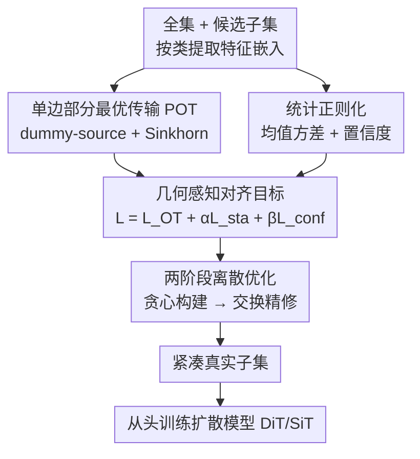

# Geometry-Aware Dataset Condensation for Diffusion Model Training

**会议**: ICML2026  
**arXiv**: [2606.05883](https://arxiv.org/abs/2606.05883)  
**代码**: https://github.com/2018cx/GADC  
**领域**: 扩散模型 / 数据集压缩  
**关键词**: 数据集压缩, 真实子集选择, 部分最优传输, 分布对齐, 扩散训练

## 一句话总结
针对"现有数据集压缩方法不适合训扩散模型"的痛点，本文把真实子集选择重新表述为**几何感知的分布对齐问题**，用单边部分最优传输（POT）+ 统计正则化定义对齐目标，再用两阶段离散优化（贪心 + 交换）求解，在 ImageNet 上只用 0.8% 数据训 DiT/SiT，FID 就显著低于此前最强的 D2C（10K 预算下 4.20→3.43）。

## 研究背景与动机

**领域现状**：数据集压缩（dataset condensation）想用更少的数据保住整个数据集的知识，做法分两类——**合成式**（在像素空间梯度优化出一批合成图）和**真实子集选择**（从原数据里挑一小撮真实样本）。多数方法是为分类等判别任务设计的。

**现有痛点**：扩散模型训练的目标是**建模数据分布本身**（最大化似然 / ELBO），而不是学决策边界。合成式压缩在连续像素空间做梯度优化，方差大、会引入噪声、扭曲细粒度结构和分布特性——而扩散模型对噪声和结构畸变极其敏感，所以合成图根本不适合拿来训扩散。真实子集选择虽然保住了真实样本的高保真结构、更对路，但现有方法（K-center、herding、CCS、数据集量化等）都用**固定/启发式准则**一次性挑样本，没有去优化一个与扩散训练对齐的目标。唯一专门面向扩散的工作 D2C 按每张图的"扩散难度"打一个标量分、沿这条一维难度轴等间隔取样——但一维排序把本质上多模态的分布塌缩成了标量，忽略了数据的流形结构。

**核心矛盾**：扩散训练要的是**分布级对齐**（保住数据支撑的几何结构和全局多样性），而现有选择策略给的是**标量级排序或启发式覆盖**——目标错配，导致选出的子集与真实分布对不齐，似然目标因此被带偏。更麻烦的是，就算有了对齐目标，大多数方法用的"一遍贪心"在离散组合空间里也没能力可靠优化它。

**本文目标**：(i) 怎么在特征空间做有原则的分布匹配；(ii) 子集预算远小于全集导致严重容量失配时，怎么避免对齐退化；(iii) 辅助约束能在多大程度上增强 OT 的几何塑形。

**切入角度**：作者把"几何"定义为**表示空间里分布支撑的几何**，用最优传输（OT）来做有原则的分布匹配——OT 天生能同时捕捉全局覆盖和局部几何结构。

**核心 idea**：把真实子集选择重构成一个"几何感知的分布对齐 + 离散选择约束"问题，用**单边部分 OT** 把传输质量聚到高密度核心流形，再用统计/语义正则化补全分布保真度，最后用两阶段离散优化把这个组合问题在大规模下解出来。

## 方法详解

### 整体框架

整条流程是：先把全集和候选子集的样本编码成特征嵌入（按类独立处理以保证均衡覆盖）；在特征空间里定义一个**分布对齐目标**——它由三块组成：单边部分 OT（几何对齐）、均值-方差正则（统计保真）、置信度正则（语义可靠）；这个目标关于"选哪些样本"是组合离散的，于是用**两阶段离散优化**求解——先贪心地按几何收益逐个加样本建立广覆盖初始化，再用交换式精修纠正早期短视选择；最终得到一个紧凑真实子集，拿去从头训练扩散模型（DiT/SiT）。为效率，POT 代价用熵正则 Sinkhorn 迭代以批处理形式并行算。

### 关键设计

**1. 单边部分最优传输（POT）：让传输质量聚到核心流形**

针对"经典 OT 强制全量对齐反而把子集推离核心流形"的问题，作者放松了目标侧约束。源样本（选中子集）质量仍要全部传输，但目标侧（全集）只需在容量约束下被部分满足：

$$\min_{\bm{\pi}\ge0}\langle\mathbf{C},\bm{\pi}\rangle\quad\text{s.t.}\quad\bm{\pi}\mathbf{1}_n=\bm{\mu},\ \bm{\pi}^\top\mathbf{1}_m\le\kappa\bar{\bm{\nu}}$$

其中代价 $\mathbf{C}_{ij}=\|\mathbf{x}_i-\mathbf{y}_j\|_2^2$，$\kappa$ 是容量缩放因子：$\kappa=1$ 退化为平衡 OT，$\kappa>1$ 则允许一部分目标质量不被匹配，从而把传输集中到高密度、几何稳定的主导区域。这正面回应了"严重容量失配下平衡匹配会把质量摊到外围低密度区、对齐变得无信息"。为了高效求解，作者用 **dummy-source 技巧**把不平衡问题转回平衡 OT：把代价矩阵增广一行 $\mathbf{C}_{\mathrm{aug}}=[\mathbf{C};\delta\mathbf{1}_n^\top]$（$\delta=\mathrm{median}(\mathbf{C})\cdot\gamma$），引入一个吸收多余目标容量的 dummy 行供给 $s=\kappa-1$ 质量，再加熵正则用 **Sinkhorn 迭代**求解，最后丢掉 dummy 行只保留真实质量算传输损失 $\mathcal{L}_{\mathrm{OT}}=\langle\mathbf{C},\mathbf{T}_{\mathrm{real}}\rangle$。这样既保住核心流形的几何对齐，又能在候选子集上批量并行算，可扩展到大规模。

**2. 统计正则化：用均值-方差 + 置信度补全分布保真与语义可靠**

OT 代价管住了几何对齐，但不显式保证分布统计量和语义清晰度，于是作者加两个轻量正则。**均值-方差正则** $\mathcal{L}_{\mathrm{sta}}=\|\bm{\mu}_\mathcal{S}-\bm{\mu}_\mathcal{T}\|_2^2+\|\bm{\sigma}_\mathcal{S}-\bm{\sigma}_\mathcal{T}\|_2^2$ 让选中子集的一阶/二阶特征统计逼近全集，保住全局分布形状。**置信度正则** $\mathcal{L}_{\mathrm{conf}}=\frac{1}{m}\sum_i-\log p(c|\mathbf{x}_i)$ 用预测类概率惩罚低置信、跑偏类别的样本——这些样本会成为不可靠的几何锚点，污染几何保持和分布对齐。三者合成总目标 $\mathcal{L}=\mathcal{L}_{\mathrm{OT}}+\alpha\mathcal{L}_{\mathrm{sta}}+\beta\mathcal{L}_{\mathrm{conf}}$。消融显示这两块都有用，尤其 $\mathcal{L}_{\mathrm{sta}}$ 去掉后 FID 从 3.43 恶化到 4.62——说明只靠 OT 的几何对齐还不够，统计/语义保真是必要补充。

**3. 两阶段离散优化：贪心建覆盖 + 交换纠短视**

针对"一遍贪心在离散组合空间 $\binom{|\mathcal{T}_c|}{m}$ 里无法可靠优化对齐目标"的痛点，作者设计两阶段求解，且**直接优化上面同一个对齐目标** $\mathcal{L}$。**Stage I 贪心几何引导选择**：从空集出发，每步评估每个未选候选 $x_k$ 的边际增益 $\Delta\mathcal{L}(x_k)=\mathcal{L}(\mathcal{S}_c^{(t-1)}\cup\{x_k\})-\mathcal{L}(\mathcal{S}_c^{(t-1)})$，选使增量代价最小的样本加入，迭代到选满 $m$ 个，快速建立广流形覆盖的初始化。**Stage II 交换式精修**：对每个已选 $x_i$ 和未选 $x_j$，试着把 $x_i$ 换成 $x_j$ 算改善量 $\Delta_{i\to j}=\mathcal{L}(\mathcal{S}_c')-\mathcal{L}(\mathcal{S}_c)$，若 $\Delta_{i\to j}<0$ 就接受（多个候选时选改善最大的那个），直到没有可改进的交换为止。Stage II 专门纠正贪心早期的短视错误——消融显示 50K 预算下加上 Stage II 把 FID 从 12.87 降到 11.01。整个目标都以批处理矩阵-向量运算并行算，可扩展。

### 损失函数 / 训练策略

对齐目标即 $\mathcal{L}=\mathcal{L}_{\mathrm{OT}}+\alpha\mathcal{L}_{\mathrm{sta}}+\beta\mathcal{L}_{\mathrm{conf}}$，$\alpha,\beta$ 平衡三项；POT 内部用熵正则 Sinkhorn（Gibbs 核 $\mathbf{K}=\exp(-\mathbf{C}_{\mathrm{aug}}/\varepsilon)$、交替更新缩放向量 $\mathbf{u},\mathbf{v}$）求传输计划。关键超参为容量缩放 $\kappa$ 和 dummy-source 系数 $\gamma$。选出子集后用标准扩散目标从头训 DiT-L/2 或 SiT-L/2，本方法只动训练数据、不改模型侧。

## 实验关键数据

### 主实验

ImageNet-1K 上取 10K/50K/100K（约 0.8%/4%/8%）子集，256×256 / 512×512 分辨率，DiT-L/2 与 SiT-L/2 从头训 100K 迭代，用 50K 生成样本评 FID/IS/Precision/Recall。基线含 Random、K-Center、Herding、CCS、DQ、D2C。

DiT-L/2 在 256×256、10K 预算（100K 迭代）下细分指标：

| 方法 | FID↓ | IS↑ | Precision↑ | Recall↑ |
|------|------|-----|-----------|---------|
| Random† | 4.63 | 263.1 | 0.70 | 0.26 |
| CCS | 5.45 | 364.9 | 0.77 | 0.21 |
| DQ | 4.56 | 267.8 | 0.72 | 0.25 |
| D2C | 4.20 | 283.6 | 0.72 | 0.24 |
| **Ours** | **3.43** | **414.3** | **0.78** | **0.28** |

FID-50K 跨预算（DiT-L/2, 256×256, 100K 迭代）：

| 数据预算 | Random | K-Center | Herding | D2C | Ours |
|----------|--------|----------|---------|-----|------|
| 0.8% (10K) | 35.86 | 50.77 | 40.75 | 4.20 | **3.43** |
| 4.0% (50K) | 36.78 | 69.86 | 32.38 | 14.81 | **11.01** |
| 8.0% (100K) | 41.02 | 71.31 | 36.37 | 22.55 | **17.09** |

512×512、10K 预算下提升更猛：FID 从 D2C 的 14.8 降到 6.17，IS 从 109.2 飙到 451.0。换 SiT-L/2 同样全面领先（50K 预算 FID 11.21→7.26）。

### 消融实验

组件消融（256×256, 10K 预算, 100K 迭代）：

| 配置 | FID↓ | IS↑ | 说明 |
|------|------|-----|------|
| w/o $\mathcal{L}_{\mathrm{OT}}$ | 3.82 | 414.1 | 去掉几何对齐，Recall 掉到 0.26 |
| w/o $\mathcal{L}_{\mathrm{sta}}$ | 4.62 | 451.6 | 去统计正则，FID 恶化最明显 |
| w/o $\mathcal{L}_{\mathrm{conf}}$ | 3.55 | 337.0 | 去语义正则，FID 略升 |
| balanced OT（去 partial） | 3.54 | 413.9 | 不用单边部分 OT |
| **Ours (full)** | **3.43** | 414.3 | 完整模型 |

Stage II 消融：10K 预算 FID 3.82→3.43、50K 预算 12.87→11.01，交换精修稳定带来约 0.4–1.9 的 FID 改善。

### 关键发现
- **$\mathcal{L}_{\mathrm{sta}}$ 贡献最大**：去掉统计正则 FID 从 3.43 恶化到 4.62，说明只靠 OT 几何对齐不够，全局矩匹配是分布保真的关键支柱。
- **单边 partial 比平衡 OT 好**：balanced OT 的 FID（3.54）劣于完整 partial 版（3.43），印证容量失配下放松目标侧、把质量聚到核心流形确实有效。
- **低预算反而更易出彩**：固定 100K 迭代下，10K 子集每样本被看约 1280 次、100K 子集只看约 128 次，所以小预算+好选择在固定迭代里收敛更快——这正是"聚焦几何一致核心流形加速收敛"的体现。
- **跨分辨率/跨扩散变体稳健**：256→512、DiT→SiT 都保持领先，说明选中子集捕获的是尺度一致的内在数据语义。

## 亮点与洞察
- **把"选数据"重述成"对齐分布"**：最巧妙的是认清扩散训练要的是分布级匹配而非标量排序，于是用 OT 这个天生做分布匹配的工具替掉 D2C 的一维难度轴——动机非常贴合扩散的 ELBO 本质。
- **单边部分 OT + dummy-source 的工程化**：用 dummy-source 把不平衡 POT 转回平衡 OT、再用批处理 Sinkhorn 并行，既保住"质量聚核心流形"的几何动机，又让组合优化在大规模 ImageNet 上可算，是个可复用的 trick。
- **两阶段贪心+交换的离散求解器**：贪心建覆盖、交换纠短视，直接优化同一个对齐目标——这套"先广后精"的离散优化范式可迁移到其他子集选择/核心集挑选任务。

## 局限与展望
- **依赖特征编码器和分类器**：置信度正则需要一个分类器给类概率，OT 在特征空间做对齐，整体质量受预训练编码器表示好坏影响（作者称框架对编码器/分类器不敏感，详见附录）。
- **按类独立处理**：为均衡覆盖按类分别做 POT，类间几何关系未显式建模，对类别极不均衡或细粒度类设定可能需要调整。
- **超参 $\kappa,\gamma,\alpha,\beta$ 需要调**：容量缩放、dummy 代价、两个正则权重都需调参，论文给了敏感性分析但跨数据集迁移时仍需重新校。

## 相关工作与启发
- **vs D2C（唯一面向扩散的前作）**：D2C 把样本投到一维扩散难度轴等间隔取样，会塌缩多模分布、忽略流形结构；本文用 OT 在表示空间做分布对齐，保住几何与分布双重结构，10K 预算 FID 4.20→3.43。
- **vs 合成式压缩（分布/轨迹/梯度匹配、模型反演）**：它们在像素空间梯度优化合成图，方差大、易模式塌缩、不受真实流形约束，对噪声敏感的扩散训练不适用；本文选真实图、保高保真结构。
- **vs 经典真实子集选择（K-Center/Herding/CCS/DQ）**：它们用固定/启发式准则一次性选样本——K-Center 偏向边界低密度区、herding 过拟合全局均值、DQ 的分箱塌缩箱内几何；本文显式优化一个训练对齐的分布对齐目标，且用两阶段离散优化可靠求解。

## 评分
- 新颖性: ⭐⭐⭐⭐ 把扩散数据集压缩重构为几何感知分布对齐、引入单边部分 OT，切入角度新颖。
- 实验充分度: ⭐⭐⭐⭐⭐ 跨预算/分辨率/扩散变体、组件与 Stage II 消融、超参敏感性齐全。
- 写作质量: ⭐⭐⭐⭐ 动机推导清晰、公式完整，OT/Sinkhorn 推导对非 OT 背景读者稍重。
- 价值: ⭐⭐⭐⭐ 仅用 0.8% 数据就大幅降 FID，对资源受限下的扩散训练很实用，依赖编码器/分类器是主要约束。

<!-- RELATED:START -->

## 相关论文

- [\[ICML 2026\] Geometry-Aware Tabular Diffusion](geometry-aware_tabular_diffusion.md)
- [\[CVPR 2026\] D2C: Accelerating Diffusion Model Training under Minimal Budgets via Condensation](../../CVPR2026/image_generation/d2c_diffusion_dataset_condensation.md)
- [\[ICML 2026\] Rethinking FID Through the Geometry of the Reference Dataset](rethinking_fid_through_the_geometry_of_the_reference_dataset.md)
- [\[CVPR 2026\] SPREAD: Spatial-Physical REasoning via geometry Aware Diffusion](../../CVPR2026/image_generation/spread_spatial-physical_reasoning_via_geometry_aware_diffusion.md)
- [\[ICML 2026\] GASS: Geometry-Aware Spherical Sampling for Disentangled Diversity Enhancement in Text-to-Image Generation](gass_geometry-aware_spherical_sampling_for_disentangled_diversity_enhancement_in.md)

<!-- RELATED:END -->
