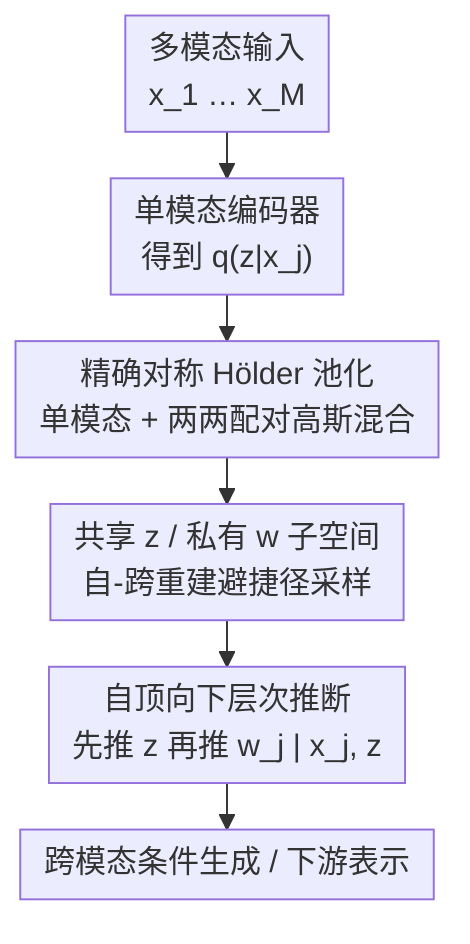

# Hölder++: Improving the Quality-Coherence Trade-off in Multimodal VAEs

**会议**: ICML2026  
**arXiv**: [2606.13381](https://arxiv.org/abs/2606.13381)  
**代码**: 待确认  
**领域**: 多模态生成 / 变分自编码器  
**关键词**: 多模态VAE, Hölder池化, 共享-私有表示, 层次推断, 质量-一致性权衡

## 一句话总结
针对多模态 VAE 长期存在的「生成质量 vs 跨模态一致性」难以兼得的问题，本文提出 Hölder++：首次给出对称 Hölder 池化（$\alpha=0.5$）的精确实现作为模态聚合器，再叠加共享/私有子空间分离与自顶向下层次推断两项架构改进，在四个基准上把质量-一致性的 Pareto 前沿整体推到 SOTA。

## 研究背景与动机
**领域现状**：多模态 VAE 把多个单模态编码器的输出聚合成一个跨模态共享潜变量 $\boldsymbol{z}$，再由各模态解码器重建。聚合方式是决定性能的关键设计，主流是专家乘积（PoE）和专家混合（MoE）。

**现有痛点**：PoE 一致性差，MoE 多样性低——二者分别是「质量」和「一致性」两个维度上的短板。MMVAE+ 通过显式区分共享/私有潜表示并避免捷径，第一次在两个维度上都拿到强结果，成为长期 SOTA；但它的聚合仍用 MoE。最近 Vo 和 Valera 指出 PoE、MoE 其实都是 Hölder 池化（一族以 $\alpha$-散度为目标的概率意见池化）的特例，并提出对称情形 $\alpha=0.5$ 的一个矩匹配近似 Hellinger 聚合（HELVAE），在单一共享表示下就把一致性做得比 MMVAE+ 还高——但代价是样本多样性轻微下降。

**核心矛盾**：质量与一致性之间存在结构性的 trade-off，单靠「换聚合方式」或单靠「拆共享/私有子空间」都只能改善一头。HELVAE 的近似还有两个隐患：一是它是 Laplace 近似而非精确池化；二是它在聚合「之后」才采样共享表示 $\boldsymbol{z}$，无法区分自重建与跨重建，因此一旦搬到共享/私有架构里反而会引入捷径。

**本文目标**：(i) 给出对称 Hölder 池化的精确（无近似）实现；(ii) 把它和共享/私有子空间结合；(iii) 在不靠额外辅助损失的前提下增强共享与私有表示的解耦。

**切入角度**：精确的对称 Hölder 池化天然把联合后验写成「单模态分量 + 两两配对分量」的高斯混合，这种结构既显式刻画了多模态的成对交互，又能干净地对接 MMVAE+ 式的自/跨重建采样策略。

**核心 idea**：用「精确 Hölder 池化（成对混合）+ 共享/私有子空间 + 自顶向下层次推断」三层叠加，一步步把质量-一致性权衡顶到 Pareto 前沿。

## 方法详解

### 整体框架
方法是一条「逐步加料」的演进链：先把聚合器从近似换成精确对称 Hölder 池化，得到 Hölder VAE；再把单一共享潜空间拆成共享 $\boldsymbol{z}$ 与模态私有 $\boldsymbol{w}_m$，并用 MMVAE+ 的避捷径采样得到 Hölder+；最后把后验从「共享与私有条件独立」改成自顶向下的层次分解，得到 Hölder++。输入是 $M$ 个模态 $\boldsymbol{X}=\{\boldsymbol{x}_1,\dots,\boldsymbol{x}_M\}$，输出是能在任意模态子集条件下、一致且高质量地生成其余模态的生成模型。

精确对称 Hölder 池化的关键是把聚合后的后验写成一个高斯混合：

$$q(\boldsymbol{z}|\boldsymbol{X})=\sum_{j=1}^{M}\pi_j\, q_{\phi_{z_j}}(\boldsymbol{z}|\boldsymbol{x}_j)+\sum_{i=1}^{M}\sum_{j>i}^{M}\pi_{ij}\, q_{ij}^{(1/2)}(\boldsymbol{z}|\boldsymbol{x}_i,\boldsymbol{x}_j)$$

即 $M$ 个单模态分量加上 $\binom{M}{2}$ 个两两配对分量。这一结构是后面两步改进能挂上去的「接口」，因此下面三个关键设计正是这条演进链上的三个加料点。

### 关键设计

**1. 精确对称 Hölder 池化：把近似聚合换成可闭式求解的成对混合**

针对 HELVAE 只是 Hölder 池化的 Laplace 近似这一痛点，本文给出 $\alpha=0.5$ 情形下的精确聚合。对称 Hölder 池化的目标是最小化加权 $\alpha$-散度，均匀权重下聚合密度为 $q(\boldsymbol{z})=c\big(\sum_j q_j(\boldsymbol{z})+2\sum_{i}\sum_{j>i}\sqrt{q_i(\boldsymbol{z})q_j(\boldsymbol{z})}\big)$。当各单模态后验是对角高斯时，两两几何平均归一化后仍是高斯，配对分量 $q_{ij}^{(1/2)}=\mathcal{N}(\boldsymbol{\mu}_{ij},\boldsymbol{\sigma}_{ij}^2)$ 的参数有闭式：

$$\mu_{ij,d}=\frac{\mu_{i,d}\sigma_{j,d}^2+\mu_{j,d}\sigma_{i,d}^2}{\sigma_{i,d}^2+\sigma_{j,d}^2},\qquad \sigma_{ij,d}^2=\frac{2\sigma_{i,d}^2\sigma_{j,d}^2}{\sigma_{i,d}^2+\sigma_{j,d}^2}.$$

混合权重 $\pi_j=c$、$\pi_{ij}=2cS_{ij}$，其中 $S_{ij}$ 是两个单模态后验之间的 Bhattacharyya 系数，归一化常数 $c=(M+2\sum_{i<j}S_{ij})^{-1}$ 也可闭式算出。相比 MoE 只有单模态分量，这里多出的配对项显式编码了模态间的成对一致性，所以即便在单一共享表示下，对称 Hölder 池化的质量和一致性都优于 MMVAE/MoPoE。代价是混合分量数达 $M^2$ 量级、采样开销上升，而且作为「混合子采样」类方法仍受限于生成质量——这正是需要下一步拆子空间的理由。

**2. 共享/私有子空间 + 避捷径采样：把多样性短板补回来（Hölder+）**

只有单一共享潜空间的模型（HELVAE、Hölder VAE）经验上样本多样性受限。本文沿用 MMVAE+ 的做法，把潜空间拆成跨模态共享 $\boldsymbol{z}$ 与模态私有 $\boldsymbol{w}_m$，并用自重建/跨重建区分的采样来防止「私有子空间偷走全部信息」的捷径：当 $\boldsymbol{z}$ 从单模态分量 $j$ 采样时，重建模态 $n$ 用的私有量按「$n=j$ 取后验、$n\neq j$ 取非信息先验 $r_n$」采；当 $\boldsymbol{z}$ 从配对分量 $(i,j)$ 采样时，则按「$n\in\{i,j\}$ 取后验、否则取先验」采。

$$\boldsymbol{w}_n\sim\begin{cases}q_{\phi_{w_n}}(\boldsymbol{w}_n|\boldsymbol{x}_n), & n\in\{i,j\},\\ r_n(\boldsymbol{w}_n), & n\notin\{i,j\}.\end{cases}$$

这样在重建未观测模态时，解码器只能依赖共享 $\boldsymbol{z}$，从而被迫把跨模态语义压进 $\boldsymbol{z}$ 而不是抄近路。本文证明 Hölder+ 优化的是一个合法 ELBO，是真正的多模态 VAE。值得注意的是，正因为 HELVAE 在聚合之后才采样 $\boldsymbol{z}$、无法区分自/跨重建，它搬进共享-私有架构反而失效——这反衬出「精确成对混合」这一结构在此处是必要的。

**3. 自顶向下层次推断：让共享与私有「设计上」解耦（Hölder++）**

已有方法多靠信息瓶颈/互信息的辅助损失来促解耦，需调超参且常局限于双模态。本文改成无需额外损失的层次后验分解：

$$q_{\Phi}(\boldsymbol{z},\boldsymbol{W}|\boldsymbol{X})=q_{\Phi_z}(\boldsymbol{z}|\boldsymbol{X})\prod_{j=1}^{M}q_{\phi_{w_j}}(\boldsymbol{w}_j|\boldsymbol{x}_j,\boldsymbol{z}).$$

即先在层次顶端推断捕获跨模态语义的共享 $\boldsymbol{z}$，再让每个私有 $\boldsymbol{w}_j$ 同时条件于自身输入 $\boldsymbol{x}_j$ 和已推出的 $\boldsymbol{z}$。把共享/私有都当作信息瓶颈时，这种自顶向下分解提供了一个归纳偏置：$\boldsymbol{w}_j$ 只去建模 $\boldsymbol{x}_j$ 中尚未被 $\boldsymbol{z}$ 解释的残余模态私有信息，从而在实践中避免捷径。它和 HMVAE 的根本区别在于：HMVAE 在推断和生成两侧都做自顶向下层次、且只把私有表示喂给解码器，可能损害一致性；本文只在推断侧用层次结构增强解耦，先验上仍假设共享与私有独立。

### 损失函数 / 训练策略
Hölder++ 的训练目标是单模态项与配对项的加权和（权重即 $\pi_j$、$\pi_{ij}$），每一项都是一个 ELBO 风格的重建-KL 表达式，层次推断带来的修改体现在把私有后验写成条件于 $\boldsymbol{z}$ 的 $q_{\phi_{w_j}}(\boldsymbol{w}_j|\boldsymbol{x}_j,\boldsymbol{z})$。训练用 $\beta\in\{1,2.5,5,10\}$ 扫不同的 KL 权重以画出 Pareto 前沿，多数数据集跑 3 个随机种子、CUBICC 跑 10 个。为对齐 CMVAE 的下游聚类比较，还把混合先验加到 $\boldsymbol{z}$ 上得到 CHölder+/CHölder++。

## 实验关键数据

### 主实验
在四个基准（PolyMNIST 五模态、MNIST-SVHN、CUBICC、CelebAMask-HQ）上评估，质量用 FID、一致性用生成样本的分类准确率（CelebAMask-HQ 用 F1）。CelebAMask-HQ 的条件生成结果（节选）：

| 条件 → 目标 | 指标 | MMVAE+ | CMVAE | Hölder+ | Hölder++ |
|------|------|------|------|------|------|
| Mask+Image → Attribute | F1 ↑ | 0.596 | 0.590 | 0.632 | **0.633** |
| Attr+Image → Mask | F1 ↑ | 0.879 | 0.874 | **0.896** | 0.885 |
| Mask+Attribute → Image | FID ↓ | 92.63 | 95.91 | **72.32** | 73.64 |
| Attribute → Image | FID ↓ | 110.15 | 125.21 | **87.19** | 90.99 |

最显眼的是图像生成 FID：Hölder+ 把 Attribute→Image 从 MMVAE+ 的 110.15 压到 87.19，幅度超过 20 点，同时属性/掩码的 F1 也同步上升——说明质量和一致性是一起改善而非此消彼长。在 PolyMNIST 和 MNIST-SVHN 上，Hölder+/++ 在条件与无条件生成中都稳居 Pareto 前沿的右上最优区，而 MMVAE+、CMVAE 在 MNIST↔SVHN 两个方向上会明显偏科。

### 消融实验
通过逐层加料对比组件贡献，并用 MNIST-SVHN 上的潜表示线性分类准确率衡量解耦（共享 $\boldsymbol{z}$ 越高越好、私有 $\boldsymbol{w}$ 越低越好）：

| 配置 | 关键现象 | 说明 |
|------|---------|------|
| Hölder（仅精确池化，单一共享） | 优于 MMVAE/MoPoE，但逊于 HELVAE | 精确成对混合提升 trade-off，但混合子采样仍限制质量 |
| Hölder+（+共享/私有子空间） | FID 大幅下降、Pareto 前沿领先 | 拆子空间补回多样性，是质量提升主力 |
| Hölder++（+层次推断） | 紧贴 Hölder+，私有 $\boldsymbol{w}$ 分类准确率更低 | 层次推断在保住 trade-off 的同时显著增强解耦 |

MNIST-SVHN 表示分类上，Hölder+ 的 MNIST 共享表示准确率 0.966、私有 0.479，Hölder++ 把私有进一步压到 0.387，而联合/共享准确率仍保持 0.977/0.970——私有子空间被有效剥离了类别信息。

### 关键发现
- 三步是层层递进而非冗余：精确 Hölder 池化负责「把成对一致性写进结构」，共享/私有子空间负责「补回多样性、降 FID」，层次推断负责「在不掉点的前提下增强解耦」。
- HELVAE 虽是单一共享表示下的 SOTA，但它在聚合后才采样 $\boldsymbol{z}$，无法区分自/跨重建，因此无法直接受益于共享-私有架构——这是本文坚持用精确成对混合的关键理由。
- 配对项带来的额外计算开销随模态数增长，但实测训练时间未出现二次爆炸；CelebAMask-HQ 上还能用预训练 DiffuseVAE 做后处理进一步提质而不改变样本特征。

## 亮点与洞察
- 把 PoE/MoE 统一进 Hölder 池化框架后，用「对角高斯几何平均仍是高斯」这一闭式性质，直接把对称池化写成可解析的成对高斯混合——这是整篇方法能落地的数学支点，巧在不用任何近似。
- 「成对配对分量」既是质量-一致性提升的来源，也恰好提供了对接 MMVAE+ 自/跨重建采样的天然接口，一个结构同时服务两个目的。
- 自顶向下层次推断作为「无辅助损失的解耦」手段可迁移：任何带共享/私有潜变量的生成模型，都能用「先推共享、再条件推私有」替换互信息正则，省掉难调的超参。

## 局限与展望
- 作者承认：配对项使分量数随模态数呈 $M^2$ 量级增长，采样与计算开销上升，虽未观察到训练时间二次爆炸，但模态非常多时仍是隐患。
- 实验集中在 ≤5 模态的标准基准（PolyMNIST/MNIST-SVHN/CUBICC/CelebAMask-HQ），图像分辨率与真实复杂度有限，需 DiffuseVAE 后处理才达较好视觉保真，方法本身的绝对生成质量仍受 VAE 框架制约。
- 当前层次只用于推断侧、先验仍假设共享与私有独立；作者指出向「共享内容影响模态风格」的自顶向下生成模型扩展是直接可做的方向。

## 相关工作与启发
- **vs HELVAE（Vo & Valera 2026）**: 同样基于对称 Hölder 池化，但 HELVAE 是 Laplace/矩匹配近似且在聚合后采样共享表示，本文给精确成对混合并能区分自/跨重建，因而可干净嵌入共享-私有架构；HELVAE 仍是单一共享表示下的 SOTA。
- **vs MMVAE+（Palumbo et al. 2023）**: 共享/私有拆分与避捷径采样沿用自 MMVAE+，但聚合从 MoE 换成精确 Hölder 池化，Hölder+ 在 FID 与一致性上整体超越 MMVAE+。
- **vs DMVAE / DCMEM（互信息/对比解耦）**: 它们靠辅助损失促解耦、需调超参且 DCMEM 限于双模态，本文用层次后验分解「设计上」解耦，可直接扩展到任意模态数。
- **vs HMVAE（Wolff et al. 2022）**: HMVAE 在推断与生成两侧都做自顶向下层次、只把私有喂解码器，可能损害一致性；本文仅在推断侧用层次结构、先验仍保持共享-私有独立。

## 评分
- 新颖性: ⭐⭐⭐⭐ 首个无近似对称 Hölder 池化实现 + 层次推断解耦，思路清晰且有理论支撑。
- 实验充分度: ⭐⭐⭐⭐ 四基准、多 $\beta$ 扫 Pareto 前沿、含解耦与下游聚类，较系统；但分辨率与模态数偏小。
- 写作质量: ⭐⭐⭐⭐ 演进链 Hölder→Hölder+→Hölder++ 叙述清楚，公式与动机对应紧密。
- 价值: ⭐⭐⭐⭐ 把质量-一致性 trade-off 推到 SOTA，且层次解耦思路可迁移到其他多模态生成模型。

<!-- RELATED:START -->

## 相关论文

- [\[CVPR 2025\] Conditional Balance: Improving Multi-Conditioning Trade-Offs in Image Generation](../../CVPR2025/image_generation/conditional_balance_improving_multi-conditioning_trade-offs_in_image_generation.md)
- [\[ICML 2026\] Discrete Diffusion Samplers and Bridges: Off-Policy Algorithms and Applications in Latent Spaces](discrete_diffusion_samplers_and_bridges_off-policy_algorithms_and_applications_i.md)
- [\[ICML 2026\] $f$-Trajectory Balance: A Loss Family for Tuning GFlowNets, Generative Models, and LLMs with Off- and On-Policy Data](f-trajectory_balance_a_loss_family_for_tuning_gflownets_generative_models_and_ll.md)
- [\[ICLR 2026\] Evolutionary Caching to Accelerate Your Off-the-Shelf Diffusion Model](../../ICLR2026/image_generation/evolutionary_caching_to_accelerate_your_off-the-shelf_diffusion_model.md)
- [\[ICML 2026\] GuidedBridge: Training-freely Improving Bridge Models with Prior Guidance](guidedbridge_training-freely_improving_bridge_models_with_prior_guidance.md)

<!-- RELATED:END -->
