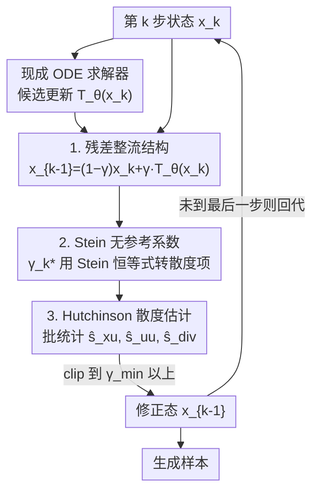

# Mitigating the Contractivity Trap in Diffusion ODEs via Stein Stabilization

**会议**: ICML2026  
**arXiv**: [2606.07835](https://arxiv.org/abs/2606.07835)  
**代码**: 待确认  
**领域**: 图像生成  
**关键词**: 扩散模型, 概率流ODE, 少步采样, Stein修正, 收缩性陷阱

## 一句话总结
针对扩散模型概率流 ODE 大步采样时"高表达力去噪器 + 激进步长会破坏收缩性稳定性证书、导致误差被放大轨迹发散"的问题（作者命名为 contractivity trap），SteinDiff 用 Stein 恒等式把"对齐干净目标"这个不可计算的项转成可计算的散度项，推出一个闭式、无需参考样本、无需重训的逐步修正系数 $\gamma_k$，对求解器候选更新做几何感知的残差校正，在 CIFAR-10 / ImageNet-64 / LSUN-Bedrooms 上大步采样的 FID 显著下降（最高减 45.8%）。

## 研究背景与动机
**领域现状**：扩散模型靠迭代去噪生成高质量样本，但推理昂贵（常需上百次函数评估 NFE）。ODE 类采样器（DDIM、DPM-Solver++、UniPC 等）沿确定性概率流 ODE（PF-ODE）走，把 NFE 压到几步，是当前提速主线。

**现有痛点**：激进的少步推理会放大局部预测误差和离散化误差。从稳定性角度看，离散更新算子 $\operatorname{T}_\theta$ 的"收缩性"是误差被逐步抑制的一个充分证书：$\|\operatorname{T}_\theta(\boldsymbol x)-\operatorname{T}_\theta(\boldsymbol y)\|\le L\|\boldsymbol x-\boldsymbol y\|$ 且 $L<1$ 时扰动会被压下去。问题是，在大步区间里，表达力强的去噪器（大 Lipschitz 常数）+ 大步长，会让这个收缩证书根本无法满足。

**核心矛盾**：作者把这个证书失效命名为 **contractivity trap（收缩性陷阱）**，并把它刻画成一个"稳定性三角"——效率要大步长 $h_t$、模型表达力要高敏感度 $L_{\boldsymbol{x}_\theta}$、稳定推理要这两者平衡，三者互相拉扯不可兼得。一旦 $\operatorname{T}_\theta$ 不再严格收缩，局部误差就可能被放大、轨迹发散、样本崩坏（出现严重结构伪影）。

**本文目标**：在不重训、不限制模型架构与步长的前提下，于推理时把大步更新"稳"下来，抑制误差放大。

**切入角度**：与其去强行约束去噪器的 Lipschitz 常数（那会限制模型容量），不如换一个视角——直接对求解器的候选更新做一次"朝干净目标对齐"的残差校正，把问题从"满足收缩证书"转成"逐步最小化对干净目标的均方误差"。难点是干净目标 $\boldsymbol{x}^*$ 在采样时未知；作者用 Stein 恒等式把含 $\boldsymbol{x}^*$ 的项变成只含可计算量（批统计 + 散度）的估计量。

**核心 idea**：把求解器候选 $\operatorname{T}_\theta(\boldsymbol{x}_k)$ 和当前态 $\boldsymbol{x}_k$ 做凸组合得到修正态，用一个由 Stein 恒等式推出的闭式、无参考系数 $\gamma_k$ 来定这个组合权重，使每一步的期望 MSE 不增。

## 方法详解

### 整体框架
SteinDiff 是一个即插即用、推理时的稳定化框架，套在任意现成 ODE 求解器外面，不增加求解器的 NFE、不重训模型。给定第 $k$ 步状态 $\boldsymbol{x}_k$ 和求解器给出的候选更新 $\operatorname{T}_\theta(\boldsymbol{x}_k)$，SteinDiff 不直接采纳候选，而是把更新写成一个**带可调系数的整流估计** $\boldsymbol{x}_{k-1}=(1-\gamma_k)\boldsymbol{x}_k+\gamma_k\operatorname{T}_\theta(\boldsymbol{x}_k)$。系数 $\gamma_k$ 不是拍脑袋的截断阈值，而是去最小化"这一步与潜在干净目标 $\boldsymbol{x}^*$ 的期望平方误差"的最优解。由于 $\boldsymbol{x}^*$ 不可得，作者借前向高斯耦合 + Stein 恒等式把它转成只依赖求解器残差 $\boldsymbol{u}_k=\boldsymbol{x}_k-\operatorname{T}_\theta(\boldsymbol{x}_k)$ 的内积、能量和散度的闭式量，最后用 Hutchinson trace 估计散度，落成 Algorithm 1。

### 关键设计

**1. 残差整流结构：把求解器候选改成"朝干净目标对齐"的凸组合**

收缩性陷阱的根子在于"指望算子自己收缩"。SteinDiff 换思路：不强求 $\operatorname{T}_\theta$ 收缩，而是把更新显式写成

$$\boldsymbol{x}_{k-1}=(1-\gamma_k)\boldsymbol{x}_k+\gamma_k\operatorname{T}_\theta(\boldsymbol{x}_k),$$

$\gamma_k$ 是自适应修正系数（vanilla 求解器对应 $\gamma_k=1$，即原封不动采纳候选）。和启发式截断不同，作者要求 $\gamma_k$ 去最小化逐步期望平方误差 $J(\gamma_k)=\mathbb{E}[\|(1-\gamma_k)\boldsymbol{x}_k+\gamma_k\operatorname{T}_\theta(\boldsymbol{x}_k)-\boldsymbol{x}^*\|^2]$。记残差 $\boldsymbol{u}_k=\boldsymbol{x}_k-\operatorname{T}_\theta(\boldsymbol{x}_k)$，这个二次目标的最小值点是

$$\gamma_k^*=\frac{\mathbb{E}\langle\boldsymbol{u}_k,\boldsymbol{x}_k-\boldsymbol{x}^*\rangle}{\mathbb{E}\|\boldsymbol{u}_k\|^2}.$$

直观上：分子量的是"残差里与期望去噪方向一致的分量"，分母用残差能量归一化。这是一个有原理的逐步校正，而非硬截断规则——而且这套分析只要求逐步 MSE 不增，**不要求** $\operatorname{T}_\theta$ 点态收缩，正好绕开了收缩性陷阱。

**2. Stein 无参考系数：用 Stein 恒等式把不可计算的干净目标项变成可计算散度**

$\gamma_k^*$ 里含未知的 $\boldsymbol{x}^*$，采样时拿不到。作者用前向加噪的精确高斯耦合 $q(\boldsymbol{x}_k|\boldsymbol{x}^*)=\mathcal{N}(\boldsymbol{x}_k;\alpha_k\boldsymbol{x}^*,\sigma_k^2\mathbf{I})$，配合 **Stein 恒等式**（对 $\boldsymbol{x}\sim\mathcal{N}(\boldsymbol\mu,\sigma^2\mathbf{I})$ 有 $\mathbb{E}[\langle\boldsymbol{v}(\boldsymbol{x}),\boldsymbol{x}-\boldsymbol\mu\rangle]=\sigma^2\mathbb{E}[\nabla\cdot\boldsymbol{v}(\boldsymbol{x})]$），把含 $\boldsymbol{x}^*$ 的内积项 $\mathbb{E}[\langle\boldsymbol{u}_k,\boldsymbol{x}^*\rangle]$ 转成可计算的散度项，得到无参考闭式：

$$\gamma_k^*=\frac{\left(1-\frac{1}{\alpha_k}\right)\mathbb{E}\langle\boldsymbol{u}_k,\boldsymbol{x}_k\rangle+\frac{\sigma_k^2}{\alpha_k}\mathbb{E}[\nabla\cdot\boldsymbol{u}_k]}{\mathbb{E}\|\boldsymbol{u}_k\|^2}.$$

这个式子完全不需要参考干净样本、不需要额外训练，校正信息全来自当前求解器残差，其中散度项 $\nabla\cdot\boldsymbol{u}_k$ 正好编码了"残差向量场的局部几何"，这就是"geometry-aware（几何感知）"的来源。理论上（Thm 4.8）精确 SteinDiff 更新满足 $E_{k-1}^{\text{Stein}}=(1-\rho_k)E_k$、$\rho_k\in[0,1]$，整条轨迹误差按 $\prod_k(1-\rho_k)$ 单调收缩。

**3. Hutchinson 散度估计 + EDM 视角：把闭式系数落成可计算算法**

实际中期望用一个生成批（batch size $B$）的经验均值近似：$\hat{s}_{xu}=\frac1B\sum\langle\boldsymbol{u}_k^{(i)},\boldsymbol{x}_k^{(i)}\rangle$、$\hat{s}_{uu}=\frac1B\sum\|\boldsymbol{u}_k^{(i)}\|^2$；散度项 $\nabla\cdot\boldsymbol{u}_k$ 用 **Hutchinson trace 估计** $\hat{s}_{div}=\frac1B\sum\boldsymbol{v}^{(i)\top}\nabla_{\boldsymbol{x}}\boldsymbol{u}_k^{(i)}\boldsymbol{v}^{(i)}$（$\boldsymbol{v}\sim\mathcal{N}(0,\mathbf{I})$，一次 VJP 即可），再 clip 到 $\gamma_{\min}$ 以上得 $\hat\gamma_k$。整个修正不额外消耗求解器 NFE，唯一开销是可并行的 VJP 散度估计。作者还给出**鲁棒性保证**：离散采样器分布相对理想耦合的 score 偏差 $\mathcal{S}(\tilde p_k,p_k)$ 小时，$|\tilde\gamma_k-\gamma_k^*|\le C_k\mathcal{S}(\tilde p_k,p_k)$，修正的逐步改进得以保留。一个有意思的副产物（4.5）：对 **EDM 式参数化**（$\alpha_k\equiv1$），分子里的 drift 项 $(1-\frac1{\alpha_k})\mathbb{E}\langle\boldsymbol{u}_k,\boldsymbol{x}_k\rangle$ 自动消失，系数退化成纯几何形式 $\frac{\sigma_k^2\mathbb{E}[\nabla\cdot\boldsymbol{u}_k]}{\mathbb{E}\|\boldsymbol{u}_k\|^2}$——这从理论上解释了为什么 EDM 参数化在大步采样里经验上更稳：它把全局信号缩放从逐步校正里解耦掉了，让校正只依赖局部残差几何。

### 损失函数 / 训练策略
SteinDiff 是纯推理时方法，**不涉及任何训练或微调**：修正系数完全由当前步的求解器残差闭式算出。Algorithm 1 一步流程：① 算残差 $\boldsymbol{u}_k=\boldsymbol{x}_{t_k}-\operatorname{T}_\theta(\boldsymbol{x}_{t_k})$；② 批均值求 $\hat{s}_{xu},\hat{s}_{uu}$；③ Hutchinson 估 $\hat{s}_{div}$；④ 算 $\hat\gamma_k=\max(\cdot,\gamma_{\min})$；⑤ 输出 $\boldsymbol{x}_{t_{k-1}}=(1-\hat\gamma_k)\boldsymbol{x}_{t_k}+\hat\gamma_k\operatorname{T}_\theta(\boldsymbol{x}_{t_k})$。可选的 self-consistency（SC）变体用 look-ahead 轨迹信息进一步压离散化误差。

## 实验关键数据

### 主实验
评测指标用 FID↓、IS↑，并额外用 FD-DINOv2（把 FID 的 InceptionV3 编码器换成 DINOv2，更贴人类感知）；效率用 Steps / NFE 衡量。在 CIFAR-10、ImageNet-64×64、LSUN-Bedrooms-256 上、跨 DPM-Solver++ / UniPC / Heun 多个求解器、EDM 与 logSNR 两种噪声调度测试。

LSUN-Bedrooms-256（Latent Diffusion，FID↓，不同 NFE）：

| 方法 | 5 NFE | 6 NFE | 8 NFE | 10 NFE | 20 NFE |
|------|-------|-------|-------|--------|--------|
| DPM-Solver++ (2m) | 21.29 | 10.97 | 5.13 | 3.88 | 3.25 |
| DPM-Solver++ (3m) | 18.61 | 8.52 | 4.15 | 3.61 | 3.17 |
| **SteinDiff (SC)** | **7.64** | **4.71** | **3.72** | **3.38** | **2.77** |

在最激进的 5 NFE 下，FID 从基线的 18.61 暴降到 7.64，差距最大；随着 NFE 增大差距收窄但 SteinDiff 仍全程领先，印证 Corollary 4.9 的"vanilla 候选变准时 SteinDiff 渐近等价于它"。

### 消融 / 跨设置分析

| 设置 | 现象 | 说明 |
|------|------|------|
| ImageNet-64，跨求解器/调度 | FID 最高减 **45.8%** | DPM-Solver++/UniPC/Heun + EDM/logSNR 均一致提升，不绑定特定求解器或调度 |
| CIFAR-10，5 NFE | 消除严重伪影（Fig 5/7） | 大步下 FID、IS 双双优于基线，对步长变化更鲁棒 |
| EDM 参数化（$\alpha_k\equiv1$） | drift 项消失，系数退为纯几何形式 | 理论解释 EDM 在大步采样更稳的经验现象 |

### 关键发现
- **越激进步长收益越大**：5 NFE 这种极端少步预算下 FID 改善最显著（LSUN 上 18.61→7.64），正是收缩性陷阱最严重、误差被放大最厉害的区间，说明 SteinDiff 确实在治"病灶"。
- **细化离散化不能根治**：Fig 4 显示即便 NFE=100，局部 Lipschitz 估计仍大段超过严格收缩阈值（NFE=6 时峰值约 24），证明单纯减小步长去不掉局部膨胀，需要显式的几何校正。
- **不增 NFE 的稳定化**：修正不额外跑求解器步，额外开销只是可并行的 VJP 散度估计，工程上几乎零成本叠加到现有采样器。

## 亮点与洞察
- **把"采样不稳"诊断成收缩证书失效，并量化成稳定性三角**：用 $L_{\operatorname{T}}\le\frac{\sigma_t}{\sigma_s}+\sigma_t h_t L_{\boldsymbol{x}_\theta}$ 推出"大步长 × 高表达力 × 严格收缩"不可兼得，把模糊的"少步采样会崩"做成了可分析的判据，这个视角本身就有诊断价值。
- **Stein 恒等式的妙用**：把推理时根本拿不到的"干净目标对齐项"无损转成只含散度的可计算量，给出闭式、无参考、零训练的逐步最优系数——这是整篇最漂亮的一招，可迁移到其他"目标未知但前向是高斯耦合"的校正问题。
- **理论反哺经验**：EDM 参数化下 drift 项自动消失这一发现，给"EDM 为何更稳"提供了一个干净的理论解释，对未来扩散架构与高效采样的协同设计有指导意义。
- **即插即用**：套在任意 ODE 求解器外、不改模型不改步长不加 NFE，落地门槛极低。

## 局限与展望
- 性能上界仍受预训练模型容量限制，SteinDiff 只能稳定采样、不能超越模型本身的生成能力。
- Hutchinson 散度估计引入蒙特卡洛方差，在小批量或高维设置下可能轻微扰动修正系数 $\gamma_k$（作者承认）。
- 收缩性陷阱在更高维连续空间里可能更严重，局部几何偏差累积更快；论文主要在图像上验证。
- 展望：把这套训练无关稳定化扩到大规模视频生成，看 Stein 引导校正能否抑制少步推理中的高频几何漂移。

## 相关工作与启发
- **vs 训练类加速（蒸馏 / Consistency Models / EDM）**：那些方法效果好但要昂贵的后训练、可能牺牲扩散模型的refinement灵活性；SteinDiff 推理时即可、零训练、保留灵活性。
- **vs DPM-Solver++ / UniPC / DEIS 等求解器**：它们改进的是数值积分格式（指数积分器、predictor-corrector、刚性处理），SteinDiff 是套在这些求解器**之上**的稳定化层，正交互补，实验里直接叠加并提升它们。
- **vs 依赖参考解的方法（如 DPM-Solver-v3、restart sampling）**：SteinDiff 的核心卖点是**无参考**——不需要参考解、辅助优化或额外训练，校正全从当前残差闭式算出。

## 评分
- 新颖性: ⭐⭐⭐⭐⭐ 收缩性陷阱的诊断 + Stein 恒等式推无参考闭式系数，理论与方法都新
- 实验充分度: ⭐⭐⭐⭐ 跨数据集/求解器/调度验证一致提升，少步增益显著；但缺与最新训练类少步方法的同台对比
- 写作质量: ⭐⭐⭐⭐⭐ 从稳定性三角到 Stein 推导到 EDM 解释，理论链条完整自洽
- 价值: ⭐⭐⭐⭐⭐ 零训练、不增 NFE、即插即用，直击大步采样痛点，工程价值高

<!-- RELATED:START -->

## 相关论文

- [\[NeurIPS 2025\] Learning to Integrate Diffusion ODEs by Averaging the Derivatives](../../NeurIPS2025/image_generation/learning_to_integrate_diffusion_odes_by_averaging_the_derivatives.md)
- [\[CVPR 2026\] Designing Instance-Level Sampling Schedules via REINFORCE with James-Stein Shrinkage](../../CVPR2026/image_generation/designing_instance-level_sampling_schedules_via_reinforce_with_james-stein_shrin.md)
- [\[ICLR 2026\] Detecting and Mitigating Memorization in Diffusion Models through Anisotropy of the Log-Probability](../../ICLR2026/image_generation/detecting_and_mitigating_memorization_in_diffusion_models_through_anisotropy_of_.md)
- [\[CVPR 2025\] Dissecting and Mitigating Diffusion Bias via Mechanistic Interpretability](../../CVPR2025/image_generation/dissecting_and_mitigating_diffusion_bias_via_mechanistic_interpretability.md)
- [\[CVPR 2026\] GRPO-Guard: Mitigating Implicit Over-Optimization in Flow Matching via Regulated Clipping](../../CVPR2026/image_generation/grpo-guard_mitigating_implicit_over-optimization_in_flow_matching_via_regulated_.md)

<!-- RELATED:END -->
