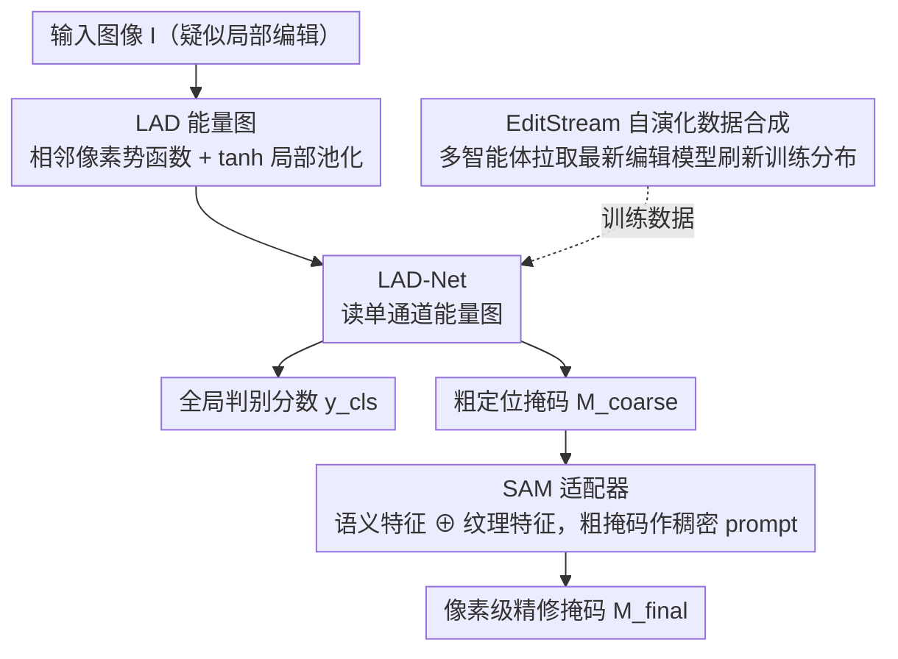

# Order within Chaos: Capturing Intrinsic Energy Anomalies for AI-Manipulated Image Forgery Localization

**会议**: ICML 2026  
**arXiv**: [2606.02178](https://arxiv.org/abs/2606.02178)  
**代码**: https://github.com/phoenixnir/FLAME  
**领域**: AI 安全 / 图像取证 / 扩散模型伪造定位  
**关键词**: AI-IFL、扩散模型、Gibbs 能量、SAM 适配器、自演化数据合成

## 一句话总结
本文从扩散模型的频谱偏置出发，理论证明扩散生成区域的局部 Gibbs 能量必然低于真实成像区域，据此构造 LAD（Local Adjacency Discrepancy）能量图作为内禀取证指纹，再用一个轻量适配器把 LAD 线索注入 SAM 完成像素级伪造定位，并配套 EditStream 多智能体自动从 HuggingFace 拉取最新编辑模型不断刷新训练数据，在 7 个 AI 编辑数据集上把平均 IoU 从前 SOTA 的 ~0.25 拉到 0.46。

## 研究背景与动机
**领域现状**：图像伪造定位（IFL）任务在前 AIGC 时代主要靠"物理信号一致性"——拼接、复制粘贴会破坏 ISP 流水线，留下传感器噪声残差、JPEG 压缩痕迹等物理指纹，Noiseprint 等方法靠这些线索定位篡改区。但 Stable Diffusion / FLUX / DALL·E 3 这类指令式编辑模型出现后，篡改像素本身就是神经渲染产物，相机噪声直接被合成信号取代，传统物理线索几乎完全失效。

**现有痛点**：当前应对扩散伪造的两条路都不太行：(1) 用 DINOv2 等视觉编码器嵌入空间做分布漂移检测，依赖预训练模型自身的泛化能力，缺乏对扩散过程内禀痕迹的显式建模；(2) 用 MLLM（FakeShield、SIDA）做"语义不一致推理"，但顶级扩散模型的物理先验强到几乎不留语义矛盾，而且 MLLM 的视觉 token 化天然是粗粒度的，看不到像素级的微弱不一致。

**核心矛盾**：可靠的取证证据既不在缺失的传感器噪声里（已被合成噪声替代），也不在语义错误里（被强物理先验抹平），那它到底藏在哪？

**本文目标**：找到一个**与生成器架构无关**的、由扩散机制本身决定的统计学指纹，并据此做像素级 AI-IFL；同时解决静态评测基准跟不上编辑模型迭代速度的"时间滞后"问题。

**切入角度**：作者从统计力学视角观察到，扩散模型本质上优化一个能量变分下界（Ho et al. 2020），加上深度网络已知的**频谱偏置**（spectral bias，Rahaman et al. 2019）和 VAE 解码器的 Lipschitz 平滑性，扩散生成内容会系统性地**抑制高频局部方差**，进入"人造的低熵秩序态"；而真实光学成像由光子散粒噪声、热噪声驱动，必然是"高熵混沌态"。这两者之间会形成可测量的统计能量差。

**核心 idea**：把图像建模成 Gibbs 随机场，用相邻像素强度差的局部势函数当作高频能量的空间代理，构造 LAD 能量图，把真实区与生成区的能量差和篡改边界的能量尖峰转成空间可定位的特征，再用 SAM 适配器把这种低级取证线索与高级语义先验融合，给出像素级掩码。

## 方法详解

### 整体框架
FLAME（Fine-grained Localization via Adjacency Map Energy）要解决的是"扩散编辑后传统物理指纹失效、像素级定位无从下手"的问题，做法是先把内禀的能量异常显式提取成一张图，再借通用分割模型把它精修成像素掩码。具体来说，输入一张疑似被局部编辑的 RGB 图 $I$，LAD 算子先把它压成单通道能量图 $\mathcal{L}$；轻量 LAD-Net 读这张能量图，同时给出全局是否伪造的标量分数 $y_{cls}$ 和一张粗定位掩码 $M_{coarse}$；随后这张粗掩码作为稠密 prompt 喂给冻结的 SAM，由一个适配器把 SAM 的语义特征和 LAD-Net 的纹理特征融合，再由 SAM 解码器吐出像素级精修掩码 $M_{final}$。整套系统外面还套了一个 EditStream 数据引擎，自动从开源仓库拉取最新 inpainting 模型，不断刷新训练分布。

### 关键设计

**1. LAD 能量图：把扩散的低熵痕迹转成与内容无关的空间指纹**

这一设计针对的痛点是——理论上"生成区低能、真实区高能、篡改边界出现能量尖峰"（Theorem 3.3 Energy Gap & Boundary Spike）虽然成立，但能量是定义在统计期望上的，必须找一个像素级可计算且对图像内容鲁棒的算子才能真正落地。作者把图像建模成 Gibbs 随机场 $p(x) \propto \exp(-E(x))$，用相邻像素强度差的势函数 $V(p,q) = \rho(\|I(p)-I(q)\|_2)$ 当作高频能量的空间代理，再对每个像素 $p$ 在 $3\times 3$ 邻域 $\mathcal{N}_p$ 上做局部聚合：

$$\mathcal{L}(p) = \frac{1}{|\mathcal{N}_p|} \sum_{q \in \mathcal{N}_p} \tanh\!\left(\|I(p)-I(q)\|_2^2 / \tau^2\right)$$

这里 $\tanh$ 起到饱和作用，把大语义梯度（物体边缘）压平，同时让 $\tau$ 控制的"小幅噪声残差"段被相对放大。这样一来，真实区的光学散粒噪声、生成区被 VAE 抹平的平滑伪迹、以及边界处由硬潜空间拼接 $z_{t-1}=m\odot \hat z^{gen}_{t-1}+(1-m)\odot z^{ref}_{t-1}$ 造成的协方差错位，三种异质信号被同时编进同一张能量图，后端 CNN 不必分头处理就能直接学到。

**2. SAM 适配器：用语义先验把粗能量响应 snap 成精确边界**

LAD-Net 是个低级统计算子，单独用会有个根本缺陷：纯色背景、窗外白墙这类本来就高度平滑的真实区，能量天然就低，会被误判成伪造区。要把"本来就低能的真实区"和"被扩散过的物体"区分开，就得引入语义先验。作者冻结 SAM 图像编码器输出语义特征 $F_{sem}$，让一个由残差块构成的轻量 Feature Adapter 学习 $F_{adapted} = \text{Adapter}(F_{sem} \oplus F_{tex})$（$\oplus$ 表示通道拼接后接 $1\times 1$ 卷积，$F_{tex}$ 是 LAD-Net 的纹理特征），把通用分割先验"调制"到取证域；同时把粗掩码 $M_{coarse}$ 灌进 SAM 的 prompt encoder 生成稠密位置嵌入 $E_{prompt}$，最后由 SAM mask decoder 联合 $F_{adapted}$ 和 $E_{prompt}$ 给出 $M_{final}$。之所以不直接微调 SAM，是因为它的特征是为通用分割训练的，用适配器注入低级取证残差既参数高效，又能避免破坏原有先验导致的灾难性遗忘。

**3. EditStream 自演化数据合成：把"benchmark 永远落后"做成移动靶**

这一设计瞄准的是训练集与现实威胁之间的代差——静态 benchmark 永远追不上 SD/FLUX/Qwen-Image 这些生成器的迭代速度。EditStream 用 Qwen-VL 当语义规划器，分析场景语义生成编辑指令，把指令翻成像素掩码并经 SAM 转成精确编辑区域；再用 Llama 3 驱动的 Autonomous Model Scouting Agent 持续监控 HuggingFace 等仓库，一旦发现新的 inpainting 模型就自动解析它的 model card、合成调用代码、接进生成管线，对 FLAME 持续注入更新一代的伪迹分布。作者强调泛化的关键不在单次扩大数据，而在构造一个"移动靶"：让检测器始终见到比上一版更难的伪迹，逼它去学架构无关的扩散共性，而不是过拟合某一代生成器的指纹。

### 损失函数 / 训练策略
训练联合优化像素级定位与图像级判别：$L = L_{Dice} + \lambda_{focal} L_{focal}^{\alpha,\gamma} + \lambda_{IoU} L_{IoU} + \lambda_{det} L_{det}$。其中 $L_{Dice}+L_{focal}$ 保证小篡改区在前背景严重失衡时也能学到准确边界，$L_{IoU}$ 用 $\ell_1$ 回归监督掩码质量预测，$L_{det}$ 用 BCE 保留全局判别能力；权重沿用 SAM 惯例 $\lambda_{focal}=20$、$\lambda_{IoU}=\lambda_{det}=1$。

## 实验关键数据

### 主实验
覆盖 7 个 AI 编辑数据集（MagicBrush、SID、CoCoGLIDE、AutoSplice、NanoBanana、Qwen-Image、Flux Kontext），与 SAFIRE、Mesorch、TruFor、AdaIFL、SIDA、FakeShield、SparseViT 等 7 个 SOTA 对比。Average 列是后 5 个数据集的均值用来衡量 OOD 泛化能力。

| 模型 | IoU(MagicBrush) | IoU(SID) | IoU(Qwen-Image) | IoU(Flux Kontext) | IoU(平均/OOD) | F1(平均/OOD) |
|---|---|---|---|---|---|---|
| TruFor | 0.281 | 0.188 | 0.228 | 0.203 | 0.247 | 0.324 |
| SIDA | 0.106 | 0.488 | 0.089 | 0.092 | 0.191 | 0.250 |
| FakeShield | 0.091 | 0.117 | 0.098 | 0.096 | 0.131 | 0.152 |
| **FLAME** | **0.538** | **0.580** | 0.321 | 0.285 | 0.358 | 0.459 |
| **FLAME-F**（EditStream 微调） | 0.507 | 0.569 | **0.482** ↑ | **0.446** ↑ | **0.460** ↑ | **0.565** ↑ |

图像级判别：FLAME 在 MagicBrush/SID 上 ACC 达 0.901/0.916（前 SOTA SIDA 为 0.812/0.725），平均 ACC 0.639（vs 最强基线 0.580）。FLAME-F 在 Qwen-Image 上把 ACC 从 0.715 拉到 0.812，且对未见的 Flux/NanoBanana 也有正向迁移，验证了 EditStream 的跨架构泛化与遗忘缓解。

### 消融实验

| 配置 | IoU↑ | F1↑ | 说明 |
|---|---|---|---|
| **FLAME（完整）** | **0.567** | **0.662** | 在 SID+MagicBrush 训练 / 验证集 |
| w/o LAD Map（换成原 RGB） | 0.294 | 0.380 | 掉 0.273 IoU，**最关键** |
| w/o Adapter | 0.313 | 0.392 | 掉 0.254 IoU |
| w/o SAM（直接用粗掩码） | 0.379 | 0.458 | 掉 0.188 IoU，边界变得块状 |

### 关键发现
- LAD Map 是命脉：去掉后 IoU 直接腰斩（0.567 → 0.294），证明"显式建模扩散内禀痕迹"比"让大模型自己学"重要得多——这也间接说明 DINOv2/MLLM 路线为何遇瓶颈。
- SAM 精修不可省：去掉 SAM 链路掉点也很大，但形式上是"块状预测"，说明 LAD-Net 给的是粗糙能量响应，必须靠语义先验做边界 snap。
- EditStream 的"移动靶"效应：仅在 Qwen-Image 上微调的 FLAME-F 在未见的 Flux Kontext 和 NanoBanana 上也涨点（IoU +0.16 / +0.18），表明学到的是扩散共性而非生成器指纹，同时旧 benchmark 上几乎无遗忘。
- 鲁棒性：JPEG 压缩（Q=75）和高斯噪声会显著伤 LAD（前者量化高频系数、后者注入全局方差，都直接破坏能量差），而高斯模糊伤害较小——因为区域能量差和边界错位即使在纹理残差被衰减后仍然成立。

## 亮点与洞察
- **从扩散的训练目标反推取证线索**：把"频谱偏置 + VAE 低通"这两个一直以来用来吐槽生成质量的性质，反过来当作不可绕过的取证指纹，思路上是把对手的"缺陷"做成自己的"特征通道"，比 MLLM 拼"语义找茬"扎实得多。
- **三种异常的统一编码器**：一个 $\tanh$ 池化算子同时编码了"真实区高熵"、"生成区低熵"、"边界协方差错位"三种异质信号，让后端的 CNN 不必分头处理。
- **可迁移的"低级残差 + SAM 适配器"范式**：这种"提一个低级取证图 + 用 prompt 喂给冻结 SAM + 用轻量 adapter 注入域特征"的两段结构，对一切"需要像素级定位但靠通用分割模型语义太强"的取证 / 工业检测 / 医学边缘场景都直接适用。
- **数据侧"持续对抗"**：把"benchmark 跟不上模型"这一系统问题工程化成一个 LLM 代理自动 scrape HuggingFace + 自动写调用代码的闭环，相当于把人力下放给 agent，是 AI 安全数据集建设值得借鉴的范式。

## 局限与展望
- 假设依赖：Spectral-Energy Inequality 依赖扩散模型的频谱偏置和 VAE Lipschitz 性质，若未来生成器显式优化高频损失或换用非平滑解码器（例如某些 GAN 复刻 + Pixel-Shuffle 后处理），能量差可能被抹平。
- 抗后处理一般：JPEG（Q=75）和高斯噪声造成显著掉点，说明上线场景如果对手主动做轻量 post-processing 就会受损；对抗性净化（adversarial purification）等针对性攻击下表现未做实验。
- EditStream 的 LLM 代理可靠性：完全依赖 Llama 3 自动解析 model card 与合成代码，存在调用失败、生成模型质量异常、license 风险等工程隐患，作者只给出原理性描述。
- 数据集偏向 inpainting：评测主要在局部 mask-guided 编辑场景，对 full-image regeneration（如 SDXL 整图生成）和视频伪造尚未推广，理论上 LAD 在整图生成场景下"边界尖峰"信号消失，只剩能量差，效果可能下滑。

## 相关工作与启发
- **vs FakeShield / SIDA（MLLM 派）**：他们靠语义/文本对齐找篡改，本文走纯统计能量路线；优势是不受顶级扩散模型"语义无瑕"压制，能定位到子像素级；劣势是不像 MLLM 那样能给自然语言解释。
- **vs Noiseprint / TruFor（传统噪声残差派）**：他们依赖物理 ISP 噪声指纹，本文换成了"生成机制本身的统计异常"；优势是覆盖 AIGC 时代主要威胁源；劣势是在传统 splicing 任务上未必占优（作者未对比纯 splicing 基准）。
- **vs DINOv2 嵌入派**：他们靠通用编码器学分布漂移，本文显式构造取证图，可解释性强、对生成器架构变化更稳；启发：在任何"需要泛化到未见生成器/未见篡改"的场景，**显式建模生成机制的物理/统计偏好**比"喂大模型让它学"更稳。
- **vs SAM 在医学/通用分割中的适配器范式**：本文把 SAM 适配范式从"语义分割"迁移到"取证定位"，证明 SAM 的语义先验对边界 snap 极其有用，但低级残差必须由额外算子（这里是 LAD）显式注入。

## 评分
- 新颖性: ⭐⭐⭐⭐⭐ 从扩散频谱偏置反推取证线索的理论框架（Gibbs 能量 + Energy Gap & Boundary Spike 定理）在 AI-IFL 领域是少见的"从机制出发"的清晰新角度。
- 实验充分度: ⭐⭐⭐⭐ 覆盖 7 个数据集、7 个 SOTA 基线、三种鲁棒性扰动、组件/算子/核大小多组消融，OOD 设置合理；扣一星因为缺少对传统 splicing 任务和对抗净化攻击的评估。
- 写作质量: ⭐⭐⭐⭐⭐ 动机—理论—算子—架构—数据引擎层层推进，理论部分有 Assumption/Theorem 形式化，工程部分有清晰 pipeline，可读性高。
- 价值: ⭐⭐⭐⭐⭐ AI-IFL 是当前迫切的安全问题，本文不仅给出 SOTA 方案，还把"benchmark 持续刷新"的系统问题用 LLM 代理工程化解决，理论框架和适配器范式都有跨任务可复用性。

<!-- RELATED:START -->

## 相关论文

- [\[ICML 2026\] The Latent Color Subspace: Emergent Order in High-Dimensional Chaos](the_latent_color_subspace_emergent_order_in_high-dimensional_chaos.md)
- [\[AAAI 2026\] Creating Blank Canvas Against AI-Enabled Image Forgery](../../AAAI2026/image_generation/creating_blank_canvas_against_ai-enabled_image_forgery.md)
- [\[ICML 2026\] Esoteric Language Models: A Family of Any-Order Diffusion LLMs](esoteric_language_models_a_family_of_any-order_diffusion_llms.md)
- [\[ICML 2026\] Local Hessian Spectral Filtering for Robust Intrinsic Dimension Estimation](local_hessian_spectral_filtering_for_robust_intrinsic_dimension_estimation.md)
- [\[ICML 2026\] The Coupling Within: Flow Matching via Distilled Normalizing Flows](the_coupling_within_flow_matching_via_distilled_normalizing_flows.md)

<!-- RELATED:END -->
