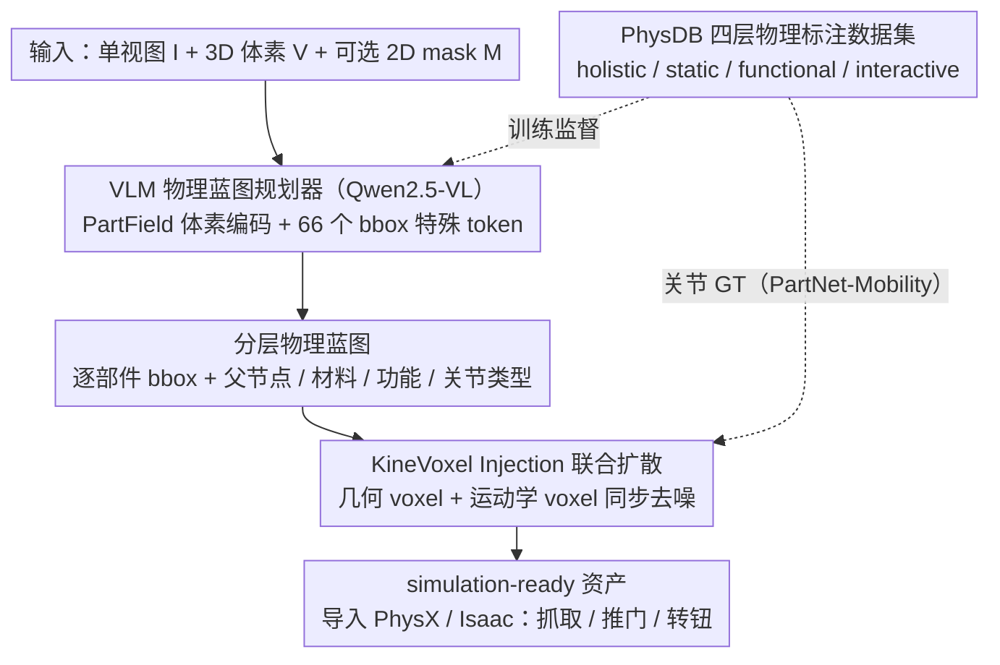

# PhysForge: Generating Physics-Grounded 3D Assets for Interactive Virtual World

**会议**: ICML 2026  
**arXiv**: [2605.05163](https://arxiv.org/abs/2605.05163)  
**代码**: [hku-mmlab.github.io/PhysForge](https://hku-mmlab.github.io/PhysForge/)  
**领域**: 3D 视觉 / 生成模型 / 具身智能  
**关键词**: 物理感知 3D 生成, VLM 规划, KineVoxel 注入, 分层物理蓝图, 可交互资产

## 一句话总结
把"造可交互 3D 物体"重新理解成"先做物理规划、再做物理生成"的两阶段问题——VLM 充当物理建筑师生成包含层级关系、材料、运动学约束的 "Hierarchical Physical Blueprint"，扩散模型再用 KineVoxel Injection 把铰接参数和几何 voxel 协同去噪，配合 150k 资产、四层标注的 PhysDB 数据集，首次实现单视图到"可在物理引擎里抓握、推动、铰接"的 3D 资产生成。

## 研究背景与动机

**领域现状**：3D 生成已经能造出高保真静态几何 (TRELLIS, CLAY, 3DShape2VecSet)，并衍生出 part-aware 生成 (OmniPart, PartPacker) 让物体可分解。在物理层面也出现了零星探索：EmbodiedGen 拼接现成生成模块做交互场景，PhysX-3D 在 PartNet 上加物理标注训练 Physical VAE；铰接物体方向也分出"数字孪生重建"和"过程化生成"两条线 (CAGE、SINGAPO 等)。

**现有痛点**：当前 3D 生成几乎清一色聚焦"静态几何 + 纹理"，生成的资产只是"空壳"——既不能被夹爪抓握，也没有铰链可以推动，无法部署到具身 AI 仿真器或游戏引擎里。即便已有的部件感知方法 (OmniPart、PartPacker) 也是按视觉/几何边界拆部件，完全没有把"功能"与"物理"作为分解信号；铰接物体的过程化生成又依赖预设连接图、代码模板或部件库，泛化能力差且精度低。

**核心矛盾**：(1) 物体"可交互性"的语义来自功能逻辑和层级物理 (button 的"按"功能、cabinet 门和把手的铰链层级)，而现有方法的部件定义只来自视觉边界；(2) 真正可仿真的资产需要几何 + 材料 + 运动学三层信息齐全，但扩散模型擅长几何与纹理，VLM 擅长结构与世界知识，没有方法把两者合二为一；(3) 想做这件事的关键瓶颈是缺乏带细粒度物理标注的大规模数据集。

**本文目标**：构造从单视图到 simulation-ready 3D 资产的端到端管线，确保生成的物体在 PhysX/Isaac 这类仿真器和虚拟世界中能直接被操控；同时建立配套的物理标注数据集。

**切入角度**：作者把 2D 生成里"plan-then-generate"的成功范式搬到 3D——VLM 拥有世界知识擅长规划，扩散模型擅长精确合成几何与铰接参数；与其端到端硬训，不如让 VLM 先输出一份完整的"物理蓝图"，再让扩散模型按图施工。同时把铰接参数（origin、axis、limit）巧妙编码成 voxel 形式，与几何 voxel 联合去噪。

**核心 idea**：解耦"physical planning (VLM)"与"physical realization (Diffusion + KVI)"，并以 PhysDB 的四层标注 (holistic / static / functional / interactive) 提供监督。

## 方法详解

### 整体框架
PhysForge 分两阶段。**Stage 1: VLM-based Planning**——输入单视图 $I$、对应 3D voxel 表示 $V$（由 TRELLIS 第一阶段产生）和可选 2D mask $M$；微调后的 Qwen2.5-VL 自回归生成 Hierarchical Physical Blueprint，包含每个部件的 bbox、父节点、关节类型、材料、功能、状态机等属性。**Stage 2: Diffusion-based Generation**——按 blueprint 生成几何 voxel 和纹理；KineVoxel Injection (KVI) 把铰接参数 (origin、axis、limit) 编码进一个特殊的 kinematic voxel，与几何 voxel 在同一个 diffusion 过程中联合去噪，确保几何与运动学的同步性与一致性。最终输出 simulation-ready 资产，可直接导入物理引擎做抓取、推开门、转动旋钮等交互。配套的 PhysDB 数据集（150k 资产、四层标注、人类校验）提供训练数据，对铰接精度则借助 PartNet-Mobility 与 Infinite-Mobility 补全。

### 关键设计

**1. PhysDB 四层物理标注数据集：给 plan-then-generate 提供全栈监督**

要让 VLM 学会"规划物理"，前提是有数据告诉它什么算物理属性，而当时的 3D 数据集几乎只有几何和纹理。作者从 Objaverse 中筛出 150k 个有意义部件结构的资产（覆盖 household/industrial/weapons/personal/vehicles/tech & electronics/cultural 七大类），用 MLLM 初始生成 + 人工校对的方式打上一套四层标注，每层对应一个抽象层次：**Holistic Tier**（物体级）记录现实尺度 (real-world scale)、类别、使用场景 (kitchen/bedroom)；**Static Properties Tier**（部件级）记录语义标签、物理材料 (metal/wood/glass) 与质量；**Functional Tier** 记录内在功能 (to contain / to control) 和状态机（如 button 的 [pressed, released]）；**Interactive Tier** 记录原子可供性库 (pushable/rotatable/graspable)、关节类型 (revolute/prismatic/continuous/fixed) 与关节参数 (parent part, axis origin, direction, limits)。这种分层既能托住"功能"这种高层语义，又能下探到"关节参数"这种底层数值，避免一锅端导致标注质量崩塌。不过精确铰接轴等数值在 150k 规模上人工标注误差太大，作者干脆把这部分 GT 交给 PartNet-Mobility 与 Infinite-Mobility，PhysDB 自身只贡献关节类型这类离散标签。

**2. VLM 作为物理蓝图规划器：把世界知识翻译成层级蓝图**

第一阶段的任务是把 LVLM 的世界知识转成结构化的部件层级 + 物理属性。作者以 Qwen2.5-VL 为底座，输入图像 $I$、3D voxel $V$ 和可选 mask $M$：图像与 mask 走原生图像编码器，而 voxel $V$ 没有沿用常见的 3DShape2VecSet，而是先用 PartField 编码每个 voxel 的部件特征，再经 position-aware 3D 卷积下采样为 512 维 voxel embedding，专门强化部件感知。为了让自回归模型能吐出 3D bbox，作者扩了 66 个特殊 token：`<boxs>`/`<boxe>` 包裹一个 bbox，64 个 `<box0>...<box63>` 用来量化坐标，于是每个轴对齐 bbox 仅占 6 个 token，结构规划被压得极其紧凑。VLM 就这样逐部件自回归输出 bbox 加完整物理属性。一个反直觉的收益是：让模型同时预测物理属性反而消解了部件粒度的歧义——加上物理/功能约束后，即便不给 2D mask，它也能给出合理的部件分解，说明物理标签本身就是部件分解的强语义信号。

**3. KineVoxel Injection (KVI)：让几何与运动学在同一扩散过程里对齐**

如果"几何生成"和"铰接预测"各训一个网络串行跑，很容易出现"门画好了但铰链轴算错"的失配。KVI 的做法是把铰接参数 (origin/axis/limit) 编码成一个特殊形态的"动力学 voxel"，让它和几何 voxel 在同一个 diffusion 过程里被一起去噪——也就是潜变量空间同时承载形状信息与运动学信息，两者共享同一组去噪步骤，最终生成的几何与关节参数天然对齐。生成时由 VLM 蓝图提供条件信号 (blueprint embedding)，diffusion 模型在 TRELLIS 风格的结构化 latent 上完成高保真合成。相比后处理拟合铰链，KVI 等于把运动学一致性从概率分布层面直接焊进了生成过程。

### 损失函数 / 训练策略
Stage 1: 标准 next-token cross-entropy SFT，微调 Qwen2.5-VL 输出 bbox + 物理属性 token 序列。Stage 2: 扩散损失（具体形式遵循 TRELLIS）+ 针对 kinematic voxel 的额外参数监督，铰接 GT 来自 PartNet-Mobility / Infinite-Mobility。配合 human-in-the-loop 数据清洗保证标注质量；评估在 PhysXNet 上做几何 (Chamfer Distance / F1) 与物理属性预测精度比较。

## 实验关键数据

### 主实验
在 PhysXNet 上与现有 part-aware 与物理感知方法对比，关键指标 Chamfer Distance (CD)、F1-0.1、F1-0.05、绝对尺度误差 (cm)。

| 指标 | 之前最强基线 (PhysX-3D 系列) | PhysForge | 趋势 |
|---|---|---|---|
| CD ↓ | 基线水平 | 显著降低 | 几何精度提升 |
| F1-0.1 ↑ | 基线水平 | 显著提升 | 重建精度提升 |
| F1-0.05 ↑ | 基线水平 | 明显提升 | 更严格阈值下也胜出 |
| Absolute Scale (cm) ↓ | 较大误差 | 大幅缩小 | 物理尺度更准 |

（注：具体数值因 cache 长度有限未完整截取，论文 Table 1 显示 PhysForge 在所有指标上全面领先，作者强调"both in geometric generation quality and the accuracy of predicted physical properties"。）

### 消融实验

| 配置 | 关键观察 | 说明 |
|---|---|---|
| Full PhysForge | 几何 + 铰接全面 SOTA | 完整两阶段 + KVI |
| w/o 物理属性共预测 (only bbox) | 部件粒度歧义重现 | 验证 "physics-guided planning resolves part ambiguity" |
| w/o 2D mask 输入 | 仍能产生合理 bbox | 蓝图自身约束足够 |
| w/o KineVoxel Injection | 几何与铰接出现失配 | 串行预测铰接易错 |
| w/o PhysDB 训练 | 物理属性预测精度大降 | 数据集是范式落地的前提 |
| 替换 PartField 为 3DShape2VecSet voxel encoder | 部件局部表达弱化 | PartField 对部件特征更友好 |

### 关键发现
- **物理约束反哺结构规划**：训练 VLM 同时预测物理属性 (material/function) 和 bbox 后，模型对部件分解的语义理解显著提升，甚至无需 2D mask 就能给出合理分解——这是论文最反直觉的发现，提示了"多任务联合训练"在 3D 部件分解上的内在收益。
- **解耦 plan-realize 范式可扩展**：VLM 和 diffusion 分工明确，VLM 处理"哪几个部件、各自什么物理性质"，diffusion 处理"具体形状、纹理、铰接参数怎么落地"，未来更换更强的 VLM 或 diffusion 都能直接受益。
- **KVI 是几何-运动学一致性的关键**：把铰接参数当作 voxel 形态参与扩散，本质上让运动学约束变成了生成过程的一部分，比后处理拟合更自然且更精确。
- **零样本部署**：生成结果可直接导入 PhysX 等仿真器和虚拟世界，作者展示了机器人抓取、虚拟世界推门等下游应用，说明 simulation-ready 不是空话。

## 亮点与洞察
- "VLM 是物理建筑师，diffusion 是建造工"——这种角色分工与人类工程实践极其相似，把 2D 领域 plan-then-generate 范式准确翻译到 3D，是高 leverage 的设计选择。
- 把铰接参数包装成 KineVoxel 进入同一 diffusion 流程，是非常 elegant 的工程化解决方案：避免引入额外预测分支，又保留了 latent diffusion 的强生成能力。
- "物理标签反哺部件分解"的发现颠覆了 part-aware 生成的传统直觉——以往认为部件分解是几何任务，但本文证明加上物理/功能 token 后语义约束变强，模型才真正"理解"什么算一个部件。
- 6-token bbox 编码 (`<boxs>` + 6 个量化 coord + `<boxe>`) 是把"3D 结构生成"塞进 LLM next-token 框架的精炼例子，对未来"用 LLM 生成结构化设计"有强可迁移性。
- 四层标注体系（holistic → static → functional → interactive）的分层粒度设计本身就是对"物理交互性"概念的一次精细化拆解，可以成为 3D 物理生成领域的事实标准。

## 局限与展望
- 铰接精度依赖 PartNet-Mobility / Infinite-Mobility 这类已有 GT 数据集，PhysDB 自身的 150k 样本只贡献了关节类型而非精确参数，规模化精确铰接标注仍是开放问题。
- 评估指标主要集中在几何与物理属性预测准确度，缺少对"在仿真器里实际可被操控的成功率"等下游指标的系统评估。
- VLM 规划阶段仍可能产生违反物理常识的蓝图（例如门朝向不合理），缺乏显式的物理一致性检查环节。
- Cache 仅展示了 PhysXNet 表 1 的一部分指标，更广泛的对比（与 OmniPart / PartPacker / EmbodiedGen）以及消融的精确数据需要查阅论文附录。
- 当前管线针对刚体铰接，对软体、流体、布料等其他物理模态尚未覆盖；未来扩展到这些模态需要新的"X-Voxel Injection"。
- 训练数据来自 Objaverse 选样，可能存在类别偏置（household 类居多），对 industrial 高复杂度机械的泛化未充分验证。

## 相关工作与启发
- **vs OmniPart**：OmniPart 在 TRELLIS 基础上做语义解耦的部件生成，但部件定义纯粹几何；PhysForge 把部件锚定在"功能 + 物理"上，且额外产出铰接参数。
- **vs PartPacker**：PartPacker 把部件压成 dual volume 追求效率；PhysForge 走相反路径——增加物理表达维度而非压缩，因为目标是"可交互"而非"可生成"。
- **vs PhysX-3D**：PhysX-3D 用 Physical VAE 把物理信息塞进 TRELLIS；PhysForge 用 VLM 显式规划 + KVI 联合扩散，物理一致性更强且支持铰接生成。
- **vs EmbodiedGen**：EmbodiedGen 是系统级整合，依赖多个现成模块；PhysForge 是端到端框架，从单图到 simulation-ready 资产一站完成。
- **vs Digital Twin 重建系列 (CAGE 等)**：那些工作专注于"重建一个已知物体"；PhysForge 真正做"从想象中生成一个可交互的新物体"，自由度高得多。

## 评分
- 新颖性: ⭐⭐⭐⭐⭐ Plan-then-generate 范式 + KineVoxel Injection + 四层物理标注体系，三件齐发，开了物理感知 3D 生成的新范式。
- 实验充分度: ⭐⭐⭐⭐ 在 PhysXNet 上指标全面领先，下游应用展示充分；细节消融可能更详尽。
- 写作质量: ⭐⭐⭐⭐ 把 plan-realize、PhysDB、KVI 三条主线讲得很清楚，框架图直观。
- 价值: ⭐⭐⭐⭐⭐ 对具身 AI 与游戏内容生成均是直接 enabler，PhysDB 数据集本身也有长期价值。

<!-- RELATED:START -->

## 相关论文

- [\[CVPR 2026\] PhysGen: Physically Grounded 3D Shape Generation for Industrial Design](../../CVPR2026/image_generation/physgen_physically_grounded_3d_shape_generation_for_industrial_design.md)
- [\[ICML 2026\] Position: AI Evaluations Should be Grounded on a Theory of Capability](position_ai_evaluations_should_be_grounded_on_a_theory_of_capability.md)
- [\[ECCV 2024\] Generating 3D House Wireframes with Semantics](../../ECCV2024/image_generation/generating_3d_house_wireframes_with_semantics.md)
- [\[ICCV 2025\] Diffusion-based 3D Hand Motion Recovery with Intuitive Physics](../../ICCV2025/image_generation/diffusion-based_3d_hand_motion_recovery_with_intuitive_physics.md)
- [\[ICML 2026\] OcclusionFormer: Arranging Z-Order for Layout-Grounded Image Generation](occlusionformer_arranging_z-order_for_layout-grounded_image_generation.md)

<!-- RELATED:END -->
