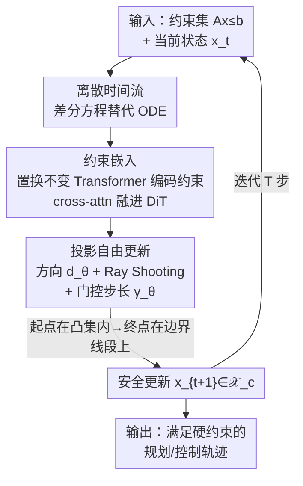

# PolyFlow: Safe and Efficient Polytope-Constrained Flow Matching with Constraint Embedding and Projection-free Update

**会议**: ICML2026  
**arXiv**: [2606.13400](https://arxiv.org/abs/2606.13400)  
**代码**: 待确认  
**领域**: 扩散/流模型 · 安全约束生成 · 机器人规划与控制  
**关键词**: 约束流匹配, 安全约束, 投影自由, Ray Shooting, 离散时间流  

## 一句话总结
PolyFlow 把"满足多面体硬约束"直接焊进流匹配模型的网络结构和流定义里——用离散时间流消掉数值积分误差、用 Frank-Wolfe 式的"射线打到边界 + 可学步长"代替昂贵的投影求解器，从而在规划/控制任务上做到**零约束违反**的同时把推理延迟降低一到两个数量级。

## 研究背景与动机

**领域现状**：流匹配（Flow Matching）已经是高保真生成的主力范式，并正快速渗透到机器人轨迹规划、四足运动控制这类"扎根物理世界"的决策任务里。这些任务和图像生成有个本质区别：输出必须严格落在可行域内（关节限位、避障、摩擦锥、执行器边界）。

**现有痛点**：标准流匹配天生不保证安全。即便源分布和目标分布都在可行域内，采样轨迹照样会越界，原因有两个——(1) **拟合误差**：参数化网络逼近真实向量场总有偏差，会把流推到不安全区域；(2) **数值积分误差**：连续时间 ODE 采样必须离散化，大步长（为了快）会让状态直接跨过安全边界。更棘手的是真实场景里训练数据本身可能无约束，却要在生成时强加约束。

**核心矛盾**：现有约束生成方法几乎都是**事后修正**（post-hoc）。投影法把每个采样步当成一个约束优化问题，用投影算子把越界状态拉回可行域；CBF 法引入控制屏障函数保证前向不变性。但它们都吃两个亏：一是要**反复解二次规划（QP）**，实时推理直接被拖垮；二是这种外部干预是对学到的流动力学的"硬掰"，会扭曲分布匹配、把采样困在局部最优。

**本文目标**：要一个**通用、计算高效、又不损伤分布质量**的框架，把硬约束嵌进流的架构本身。

**切入角度**：作者的哲学是"把约束写进流的定义和模型结构里，而不是事后补救"。受 Frank-Wolfe 算法启发——它解约束优化时是朝可行集的顶点移动，天然不越界，根本不需要投影。

**核心 idea**：把更新向量参数化成"从当前点朝某个方向射向多面体边界、再用一个学出来的步长缩放"。只要起点在凸集内、终点在边界上，线段上任意点都在凸集内（凸性），于是**每一步更新 by construction 就安全**，彻底甩掉投影求解器。

## 方法详解

### 整体框架

PolyFlow 要解决的是：在一个**紧凸多面体安全集** $\mathcal{X}_c=\{x \mid Ax\le b\}$ 内做生成，且保证整条采样轨迹一步都不越界。它分两条腿走路：先把"流"从连续时间 ODE 改写成**离散时间差分方程**，从理论上抹掉数值积分误差这个越界来源；再设计一个**投影自由（projection-free）的网络结构**，让网络吐出的每一步更新天然落在可行域里，从而连拟合误差导致的越界也堵死。

输入是约束集 $\mathcal{C}=\{(A_i,b_i)\}_{i=1}^m$、当前状态 $x_t$、时间步 $t$；输出是一步安全更新 $u_\theta(x_t,t)$，迭代 $T$ 步把先验样本搬运到目标分布。整条流水线如下：先在多面体的 Chebyshev 球里采初始点保证起点合法 → DiT 骨干 + 约束编码块把约束几何编码进表征 → Ray Shooting 块预测"方向 + 步长" → 构造出落在边界线段上的安全更新 → 递归推进。

### 关键设计

**1. 离散时间流：从根上消掉数值积分误差**

事后修正法之所以难，部分是因为连续 ODE $\frac{d}{dt}\psi_t(x)=u_t(\psi_t(x))$ 在采样时必须离散化，而离散化误差会把状态推过安全边界——你哪怕证明了连续路径安全，落到实际采样仍可能越界。PolyFlow 干脆把流**直接定义在离散时间上**：$\psi_{t+1}(x)=\psi_t(x)+u_t(\psi_t(x))$，时间步 $\mathcal{T}=\{0,\dots,T-1\}$。这样"采样"和"流的定义"是同一回事，不存在额外的离散化近似，越界的第二个来源直接消失。

代价是离散时间下 CFM 训出来的边际期望场 $\tilde u_t$ 不再精确生成真实边际路径 $p_t$，引入一个分布偏差。作者用 2-Wasserstein 距离把它界住（定理 4.4）：$W_2(p_{t+1},\tilde p_{t+1})\le (1+L)\,W_2(p_t,\tilde p_t)+\mathcal{E}_{match}(t)$，其中匹配误差 $\mathcal{E}_{match}(t)=\sqrt{\mathbb{E}_z\mathbb{E}_{x_t}[\|\tilde u_t(x_t)-u_t(x_t|z)\|^2]}$。只要 CFM 目标训得好，$\mathcal{E}_{match}$ 就小，误差在 $T$ 步内有界——也就是说**牺牲一点点边际分布精度，换来彻底干净的安全性**，这笔账划算。

**2. 安全保持定理：把"条件流安全"抬升成"边际流安全"**

光有离散框架还不够，得证明"每条条件流安全"能聚合成"边际流安全"。定理 4.5 给出：当 $\mathcal{X}_c$ 凸时，若条件流是 interior safe（Def 4.2，即起点在 $\mathcal{X}_c$ 内则整条轨迹都在内），那么边际期望场 $\tilde u_t$ 也 interior safe。

满足前提的构造很简洁：用端点 $x_0,x_1\in\mathcal{X}_c$ 的线性插值做条件流，条件场 $u_t(x|z)=(x_1-x_0)/T$。凸性保证连接 $x_0,x_1$ 的线段全在 $\mathcal{X}_c$ 内，故条件流 interior safe，由定理 4.5 边际场也安全。这一步把"逐条样本对的安全"这件容易验证的事，理论上拔高成"聚合后的整个生成过程安全"。

**3. 投影自由架构：Ray Shooting + 可学门控步长替代投影/QP**

定理只保证理想边际场 $\tilde u_t$ 安全，可参数化网络 $u_\theta$ 只是它的近似，仍可能越界。于是把 CFM 训练写成带约束的优化：$\min_\theta \mathcal{L}_{CFM}$ s.t. $x_t+u_\theta(x_t,t)\in\mathcal{X}_c$。绝大多数方法用投影 $x_{t+1}=\text{Proj}_{\mathcal{X}_c}(x_t+u_\theta)$ 来满足约束——又慢又干扰流动力学。

PolyFlow 借 Frank-Wolfe 的精神：朝可行集边界移动而非投影梯度。最朴素的版本是朝顶点移动 $u_\theta=\gamma_\theta\cdot(\text{Selector}_\theta(\mathcal{V}(\mathcal{X}_c))-x_t)$，但顶点选择不可微、且只朝顶点走会"之字形"震荡。作者把更新**解耦成"自由方向 + 有界步长"**：

$$u_\theta(x_t,t)=\gamma_\theta(x_t,t)\cdot\big(\text{RS}(x_t,d_\theta(x_t,t))-x_t\big)$$

其中 $d_\theta$ 是网络预测的**无约束连续方向**（类比未约束的 score/梯度）；$\text{RS}(x_t,d)$ 是 **Ray Shooting** 算子，从 $x_t$ 沿方向 $d$ 射线打到边界 $\partial\mathcal{X}_c$ 的交点；$\gamma_\theta\in[0,1]$ 是 sigmoid 输出的**门控步长**，控制在 $x_t$ 到边界交点这条线段上走多远。因为终点在线段 $[x_t,\text{RS}]\subseteq\mathcal{X}_c$ 上，$x_{t+1}$ by construction 就合法。

这个解耦有两个好处：一是射线-边界交点对 $x_t$ 和 $d_\theta$ **都可微**，训练可端到端；二是连续方向能瞄准边界上任意点（含面和棱），而非只有顶点，自由度大增，轨迹平滑、不震荡。等于把"安全"从一个需要反复求解的约束优化，变成网络结构的恒等性质——零额外求解器开销。

**4. 约束编码 + 实用化构造：让模型"看懂"任意多面体**

要泛化到任意时变多面体约束，模型得能吃下约束集本身。PolyFlow 在 DiT 骨干上加两个模块：**约束编码块**把线性不等式集 $\{(A_i,b_i)\}$（即 $Ax\le b$）当输入，用**无位置编码的 Transformer**（处理约束集的置换不变性），把约束嵌入通过 cross-attention 融进 DiT 的潜表征；**Ray Shooting 块**接收融合表征，预测 $\gamma_\theta$ 和 $d_\theta$ 来参数化约束分量的更新 $\Delta x_t^{con}$。由于约束可能只作用在部分维度，$x$ 被拆成无约束分量 $x^{unc}$ 和受约束分量 $x^{con}$，分别由独立输出头处理。

实用化上还有个关键：定理要求初始分布 support 整个落在 $\mathcal{X}_c$ 内。作者在多面体的 **Chebyshev 球**里均匀采初始点；求 Chebyshev 球只是个**线性规划（LP）**，比投影法用的 QP 便宜得多，且静态约束下只需预计算一次，在线采样几乎零开销。

## 实验关键数据

实验回答三问：Q1 能否在多任务上严格满足约束？Q2 性能-效率权衡是否优于强基线？Q3 能否处理动态复杂约束？基线包括 SafeFlow（CBF 类）、SafeDiffuser 三变体（RoSD/ReSD/TVSD）、FlowTrunc（投影截断）、GaugeFlow（gauge map + 反射）。

### 主实验：2D Maze（等算力对比最有说服力）

下表为所有方法限定 $N=10$ 采样步的"严格等算力"对比（PolyFlow 两个变体：attn / mlp）：

| 指标 | PolyFlow-attn | PolyFlow-mlp | Flow | SafeFlow | RoSD | ReSD |
|------|------|------|------|------|------|------|
| Safety ↑ | **1.0** | **1.0** | 0.845 | 0.530 | 0.990 | 0.145 |
| MMD ↓ | 6.2e-6 | **2.62e-6** | 3.5e-5 | 6.55e-3 | 1.76e-4 | 5.46e-2 |
| W ↓ | 0.041 | **0.033** | 0.054 | 0.348 | 0.124 | 1.800 |
| KL ↓ | 0.134 | **0.050** | 0.266 | 3.140 | 50.2 | 2.720 |
| TotalTime ↓ | 2.11 | 0.58 | **0.324** | 7.558 | 1.120 | 8.926 |

PolyFlow 是唯一在等算力下**安全率 = 1.0 且分布匹配（MMD/W/KL）全面最优**的方法；CBF 类基线要么安全率塌（SafeFlow 0.53、ReSD 0.145），要么靠默认 200+ 步才勉强达标、时间爆炸（默认步设置下 SafeFlow TotalTime 153.5 vs PolyFlow-mlp 0.58）。

### 闭环控制：五个 Gym Locomotion 任务

| 任务 | 指标 | Flow | PolyFlow | SafeFlow | RoSD | GaugeFlow |
|------|------|------|----------|----------|------|-----------|
| Hopper-Complex | Safety ↑ | 0.005 | **1.0** | 1.0 | 1.0 | 1.0 |
| Hopper-Complex | Total Time ↓ | 0.698 | **0.081** | 15.125 | 2.114 | 0.878 |
| Hopper-Complex | Return ↑ | 2450±878 | **2949±838** | 2397±877 | 937±539 | 2851±944 |
| Walker2d-Complex | Total Time ↓ | 0.348 | **0.079** | 4.530 | 1.339 | 0.435 |
| Walker2d-Complex | Return ↑ | 5895±113 | **5981±114** | 5961±95 | 5716±577 | 5783±618 |

### 关键发现
- **安全是硬保证不是软指标**：跨所有任务 PolyFlow 安全率恒为 1.0，而无约束 Flow 在 Hopper-Complex 上只有 0.5%、HalfCheetah 上 0%——说明任务约束越复杂，事后修正/无约束越扛不住，而 by-construction 的安全不受影响。
- **效率碾压来自"不解 QP"**：PolyFlow 单步只做一次可微 Ray Shooting，TotalTime 比 CBF 类 SafeFlow 快 1-2 个数量级（Hopper-Complex 0.081 vs 15.125），且达标不依赖大步数。
- **安全没有牺牲质量反而提升收益**：PolyFlow 的 Rollout Return 普遍高于无约束 Flow 和其他基线——把生成约束进可行域，反而避开了无约束流漂进坏区域，控制收益更高。
- **attn vs mlp 取舍**：PolyFlow-mlp 在分布匹配指标上更优且更快，attn 变体在等算力 Acc 上略好；约束编码用 attn 主要服务于复杂/时变约束的泛化（Q3，如 Go2 四足的时变摩擦锥）。

## 亮点与洞察
- **"把约束写进结构而非事后补"这一哲学落地得很干净**：Ray Shooting 把"安全"从约束优化降格成网络的恒等性质，既可微又零求解器开销，是全文最漂亮的一招。
- **离散时间流是被低估的视角**：大家默认流匹配=连续 ODE，作者反其道把流定义在离散时间，直接消掉数值积分误差这一整类越界来源，还顺手给了 Wasserstein 误差界，理论闭环。
- **方向/步长解耦解决了 Frank-Wolfe 的老毛病**：原生 FW 朝顶点走会之字震荡且不可微，解耦成"连续方向 + 门控步长"既保平滑又保可微，这个 trick 可迁移到任何"需朝凸集边界移动"的可微生成场景。
- **用 Chebyshev 球（LP）代替投影（QP）取初始点**：一个常被忽视的工程点，静态约束下预计算一次，把在线开销压到几乎为零。

## 局限与展望
- **凸性是硬前提**：所有安全保证都建立在 $\mathcal{X}_c$ 紧凸多面体上；非凸/非多面体可行域（很多真实避障是非凸的）需要先做凸分解（Maze 里就是切成凸走廊），分解本身的代价与近似在文中讨论不充分。
- **离散时间的分布偏差**：定理 4.4 只保证误差有界，未给出与连续流的精度差距量化；步数 $T$ 偏小时分布保真度与安全性的权衡边界尚不清晰。
- **HalfCheetah 上 Dismatching Score 偏高**（5.256，比部分基线差），说明在约束作用于动作空间、动力学更激进的任务上，强约束对分布匹配的损伤仍存在，并非全场景免费午餐。
- Ray Shooting 在高维、约束面数 $m$ 很大时的交点计算成本随约束规模如何 scaling，是部署到更复杂系统的待验证点。

## 相关工作与启发
- **vs 投影法（Christopher et al. / FlowTrunc）**：他们把每步当约束优化解 QP/投影，PolyFlow 用 Ray Shooting 把安全嵌进结构，区别在于"事后拉回 vs 天生不越界"，优势是零求解器、不扰流动力学，劣势是受限于凸约束。
- **vs CBF 法（SafeFlow / SafeDiffuser）**：他们用控制屏障函数保证前向不变，但通用约束的 CBF 难设计且要解 QP；PolyFlow 不需要手工设计屏障函数，效率高 1-2 个数量级。
- **vs Gauge/Mirror map（GaugeFlow）**：他们把约束域双射映到无约束空间再训标准流，依赖精心设计的映射/距离函数、有近似误差与超参敏感；PolyFlow 直接在原域上靠射线打边界，无需构造映射。
- **vs Riemannian flow**：在受约束流形上定义流，但仅适用简单几何（难为任意约束构造黎曼度量）；PolyFlow 的多面体设定覆盖更广的线性不等式约束。

## 评分
- 新颖性: ⭐⭐⭐⭐⭐ 离散时间流 + Ray Shooting 投影自由更新是一套自洽且少见的"结构内嵌约束"方案
- 实验充分度: ⭐⭐⭐⭐ 从 2D Maze 到四足时变摩擦锥覆盖到位，但非凸约束与高维 scaling 验证略欠
- 写作质量: ⭐⭐⭐⭐⭐ 动机-理论-架构逻辑链清晰，定理与算法伪码配合好读
- 价值: ⭐⭐⭐⭐⭐ 安全关键的机器人规划/控制里"零违反 + 实时"是刚需，落地价值高

<!-- RELATED:START -->

## 相关论文

- [\[ICLR 2026\] SafeFlowMatcher: Safe and Fast Planning using Flow Matching with Control Barrier Functions](../../ICLR2026/image_generation/safeflowmatcher_safe_and_fast_planning_using_flow_matching_with_control_barrier_.md)
- [\[NeurIPS 2025\] Training-Free Safe Text Embedding Guidance for Text-to-Image Diffusion Models](../../NeurIPS2025/image_generation/training-free_safe_text_embedding_guidance_for_text-to-image_diffusion_models.md)
- [\[CVPR 2026\] ProjFlow: Projection Sampling with Flow Matching for Zero-Shot Exact Spatial Motion Control](../../CVPR2026/image_generation/projflow_projection_sampling_with_flow_matching_for_zero-shot_exact_spatial_moti.md)
- [\[ICML 2026\] E²PO: Embedding-perturbed Exploration Preference Optimization for Flow Models](embedding-perturbed_exploration_preference_optimization_for_flow_models.md)
- [\[CVPR 2026\] Learning Straight Flows: Variational Flow Matching for Efficient Generation](../../CVPR2026/image_generation/learning_straight_flows_variational_flow_matching_for_efficient_generation.md)

<!-- RELATED:END -->
