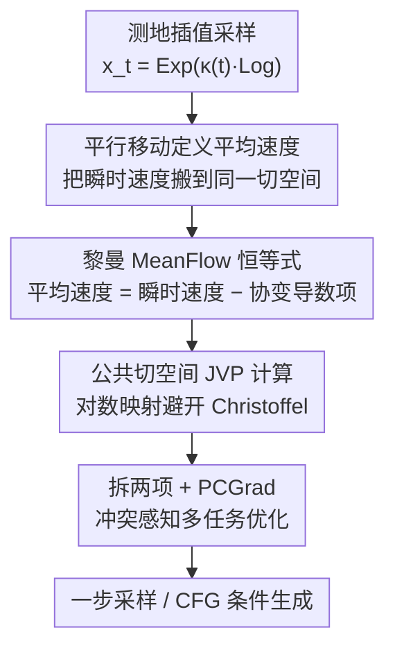

# Riemannian MeanFlow for One-Step Generation on Manifolds

**会议**: ICML2026  
**arXiv**: [2603.10718](https://arxiv.org/abs/2603.10718)  
**代码**: 论文未提供  
**领域**: 扩散模型 / 流匹配 / 黎曼流形生成  
**关键词**: MeanFlow, 黎曼流形, 一步生成, 平均速度, 平行移动, 多任务优化

## 一句话总结
把 MeanFlow 的"平均速度一步生成"推广到黎曼流形：用**平行移动**把不同切空间里的瞬时速度搬到同一切空间再平均，从而定义流形上的平均速度并导出**黎曼 MeanFlow 恒等式**；再用对数映射在公共切空间里做内蕴训练（避开轨迹模拟和 Christoffel 符号），把目标拆成两项并用 PCGrad 化解梯度冲突，在球面/环面/SO(3)/SE(3) 上以 1 步采样达到与最强 baseline 相当的质量、采样成本大幅下降。

## 研究背景与动机

**领域现状**：Flow Matching（FM）在欧氏空间能 simulation-free 地训练生成模型，Riemannian Flow Matching（RFM）进一步把它搬到球面、环面、SO(3) 这类流形上，保留了免模拟训练和良好扩展性的优点——它学一个时变速度场 $v_t$，其诱导的概率流 ODE 把基分布推到数据分布。

**现有痛点**：RFM 训练虽免模拟，**采样仍要在流形上数值积分这条 ODE**，高质量样本往往需要很多求解步，慢且贵。欧氏空间早有一堆加速器（渐进蒸馏、一致性模型、Shortcut、IMM，以及 MeanFlow 直接参数化长程平均速度做到稳定的一步生成），但把这些"平均速度型"一步生成方法搬到流形上**并不平凡**。

**核心矛盾**：流形上瞬时速度是切向量，活在**逐点不同的切空间** $T_{x_t}\mathcal M$ 里，必须在黎曼度量下比较。这意味着连"平均速度"都没法直接定义——把不同点的速度向量直接做时间平均是 ill-defined 的，硬套欧氏的 MeanFlow 恒等式会破坏几何一致性。

**本文目标**：① 给出几何上自洽的"流形平均速度"定义；② 导出一个可作监督信号、且不需轨迹积分的恒等式；③ 让它在实现上避开复杂几何计算；④ 解决由此带来的优化不稳定。

**切入角度**：既然问题出在"不同切空间不能直接平均"，那就先用平行移动把沿轨迹的瞬时速度统一搬到当前点的切空间，再在那里平均——这是流形上"平均"唯一几何正确的做法。

**核心 idea**：用平行移动定义内蕴平均速度 → 导出黎曼 MeanFlow 恒等式（平均速度 = 瞬时速度 − 协变导数项）→ 用对数映射在公共切空间里把它变成可由 JVP 高效计算的训练目标。

## 方法详解

### 整体框架

RMF 要做的是：在流形 $(\mathcal M,g)$ 上学一个平均速度场网络 $u_\theta(x_t,r,t)$，使得训练完后令 $r=0,t=1$ 即可一步从噪声 $x_0$ 生成数据 $x_1$，无需采样时数值积分 ODE。整体分四步：① 在流形上用平行移动给出平均速度的几何定义（式 5）；② 对定义求导得到黎曼 MeanFlow 恒等式，把"需要整条轨迹积分"的定义换成"只需当前点瞬时速度 + 协变导数"的可训练形式；③ 把协变导数用对数映射搬进公共切空间、用 JVP 计算，避开 Christoffel 符号和轨迹模拟；④ 把损失拆成两项发现梯度冲突，用 PCGrad 做冲突感知的多任务优化，并支持 CFG 条件生成。

### 关键设计

**1. 平行移动定义平均速度：让"流形上的平均"在几何上有定义**

欧氏 MeanFlow 把区间 $[r,t]$ 的平均速度定义成 $u=\tfrac{1}{t-r}\int_r^t v_\tau\,\mathrm d\tau$，但在流形上 $v(x_\tau,\tau)\in T_{x_\tau}\mathcal M$ 是逐点不同切空间里的向量，直接积分没意义。本文用 Levi–Civita 联络诱导的平行移动算子 $\mathcal P^\gamma_{\tau\to t}$ 把沿轨迹 $\gamma$ 的每个瞬时速度先搬到当前点 $x_t$ 的切空间，再在那里平均：

$$u(x_t,r,t)=\frac{1}{t-r}\int_r^t \mathcal P^{\gamma}_{\tau\to t}\big(v(x_\tau,\tau)\big)\,\mathrm d\tau$$

这样积分才 well-defined。当 $\mathcal M=\mathbb R^d$ 时平行移动退化为恒等映射，式子精确还原欧氏时间平均——说明它是欧氏 MeanFlow 的严格几何推广。这一步是整套方法的几何基石：它确保"平均速度"这个核心对象从一开始就尊重流形结构，而不是把欧氏公式硬搬过来。

**2. 黎曼 MeanFlow 恒等式：把"需整条轨迹"的定义换成"只看当前点"的可训练目标**

式 (5) 虽几何自然，却不能直接当监督——算积分要拿到整段轨迹 $\{x_\tau\}$ 并对每个 $\tau$ 做平行移动。作者对定义两边乘 $(t-r)$ 再对 $t$ 求导，得到 Proposition 3.1 的恒等式：

$$u(x_t,r,t)=v(x_t,t)-(t-r)\,\nabla_{\dot\gamma(t)}u(x_t,r,t)$$

其中 $\nabla_{\dot\gamma(t)}u$ 是沿轨迹速度方向的**协变导数**（因为 $u$ 是沿 $\gamma$ 的向量场，普通导数不对、必须用协变导数）。它的意义是：要监督平均速度，只需估计当前点的瞬时速度 $v(x_t,t)$ 和一个局部协变导数项，**完全不需要时间积分**。这正是 MeanFlow 在欧氏空间"用恒等式替代积分"那一招的流形版本，把不可计算的定义变成可训练的目标。

**3. 公共切空间 + 对数映射 + JVP：避开 Christoffel 符号与轨迹模拟**

恒等式里的协变导数若按局部坐标硬算，要操作局部基底和 Christoffel 符号，实践上很麻烦。作者改在公共切空间 $T_{x_t}\mathcal M$ 里工作：用测地插值 $x_t=\operatorname{Exp}_{x_1}(\kappa(t)\operatorname{Log}_{x_1}(x_0))$（$\kappa(t)=1-t$）参数化路径，对其求导得路径速度 $\dot x_t=\tfrac{1}{1-t}\operatorname{Log}_{x_t}(x_1)$；再把协变导数项替换成网络沿路径的方向导数，得到可计算的训练目标：

$$u_{\text{gt}}(x_t,r,t):=v(x_t,t)-(t-r)\big(\dot x_t\,\partial_{x_t}u_\theta+\partial_t u_\theta\big)$$

其中 $\dot x_t\,\partial_{x_t}u_\theta$ 解释为 Jacobian–vector product。所有量都用 **JVP** 高效算，既避开高阶导数、也避开基于坐标的协变计算——这是把内蕴恒等式真正落地的工程关键。瞬时速度则用网络在 $r=t$ 时的输出近似 $v(x_t,t)\approx u_\theta(x_t,t,t)$。

**4. 拆两项 + PCGrad：用冲突感知多任务优化稳住训练**

把 RMF 损失 $\mathcal L_{\text{RMF}}=\mathbb E\|u_\theta-u\|_g^2$ 用恒等式展开交叉项，可分解成两项（Proposition 3.2）：$\mathcal L_1$ 是"网络输出对齐瞬时速度"，$\mathcal L_2$ 是"网络输出与协变导数项的内积"（实现时对 $\mathcal L_2$ 的导数项加 stop-gradient $\operatorname{sg}(\cdot)$ 防高阶导数）。问题是这两项的梯度 $g_1,g_2$ 在实践中常呈**负余弦相似度**（梯度冲突），导致更新震荡或一项主导。作者不去手调权重 schedule（这正是欧氏 $\alpha$-Flow 的做法），而是把分解后的目标当成共享参数的两任务学习，用 PCGrad 在参数空间直接处理冲突——当 $\langle g_1,g_2\rangle<0$ 时把每个梯度中与对方冲突的分量正交投影掉：

$$\tilde g_1=g_1-\mathbb I[\langle g_1,g_2\rangle<0]\frac{\langle g_1,g_2\rangle}{\|g_2\|^2+\varepsilon}g_2,\qquad \tilde g=\tilde g_1+\tilde g_2$$

梯度对齐时保持不变、冲突时一阶抑制互相增损的分量。这一步每次迭代只多几个内积、不引入可学习参数，却显著改善优化稳定性，对应模型 RMF-MT。此外 RMF 还支持 CFG：训练时以概率 $p_{\mathrm{drop}}$ 把条件 $c$ 换成空 token，使单网络同时学条件/无条件预测，在公共切空间里组合二者。

### 损失函数 / 训练策略

训练流程（Algorithm 1）：每步采 $x_1\sim p_1$、$x_0\sim p_0$、$(r,t)$ 满足 $0\le r<t\le1$ → 计算 $x_t$ 与路径速度 $\dot x_t$ → 用 JVP 一次拿到 $u$ 和方向导数项 $\xi_t$ 并对其 stop-gradient → 算 $\mathcal L_1=\|u-\dot x_t\|_g^2$、$\mathcal L_2=2\langle u,(t-r)\xi_t\rangle_g$ → 分别求梯度后过 PCGrad 合成 $\tilde g$ 交给优化器。两个变体：RMF（直接相加两项）与 RMF-MT（加冲突感知多任务优化）。

## 实验关键数据

### 主实验

评测协议严格（train/val/test=8/1/1，验证集选超参，测试集报告），用 1 NFE（一步）下生成样本与测试分布的 **MMD**（基于测地距离 RBF 核）衡量质量。baseline 含 RFM、Riemannian Consistency Training（RCT）、Generalized Flow Maps（GFM，最强变体 G-LSD）。

球面（Earth 灾害数据集，$\mathbb S^2$）1 NFE 下 MMD（↓）：

| 类别 | RFM | RCT | G-LSD | RMF | RMF-MT |
|------|-----|-----|-------|-----|--------|
| Volcano (827) | 0.351 | 0.155 | 0.115 | **0.092** | 0.102 |
| Earthquake (6120) | 0.309 | 0.053 | **0.032** | 0.042 | 0.035 |
| Flood (4875) | 0.272 | 0.086 | 0.065 | 0.068 | **0.048** |
| Fire (12809) | 0.377 | 0.080 | **0.027** | 0.042 | 0.032 |

环面（蛋白质二面角 2D 子集 + RNA 7D）1 NFE 下 MMD（↓，节选）：RMF-MT 在高维 RNA(7D) 上 0.07 优于所有 baseline（G-LSD 0.08、RCT 0.11），在 Glycine/Proline/PrePro 上匹配最强 baseline。SO(3) 上 RMF-MT 在 Fisher(0.039)、Line(0.035) 取得最佳。

### SE(3) 抓取成功率与采样步数

SE(3) 机器人抓取数据集（成功率%↑，注意此处指标是抓取成功率非 MMD）：

| Step | 1 | 2 | 3 | 7 |
|------|---|---|---|---|
| RFM | 3.2 | 23 | 38 | 88 |
| G-LSD | 60 | 75 | 81 | 90 |
| **RMF** | **65** | **80** | 82 | 90 |
| RMF-MT | 60 | 67 | 70 | — |

RMF 在最少步（1/2 步）抓取成功率领先，大步时仍有竞争力。

### 关键发现
- **梯度冲突真实存在且 PCGrad 有效**：Earth 各类别训练中 $\nabla\mathcal L_1$ 与 $\nabla\mathcal L_2$ 频繁出现负余弦相似度；RMF-MT 相对 RMF 的提升在冲突更强的类别（如 Flood）更大、在冲突弱的类别（如 Volcano）更小——增益与冲突程度正相关，验证了冲突感知优化的必要性。
- **小数据集上多任务优化可能反伤**：Volcano 仅 827 样本，RMF-MT 反而略逊于 RMF，提示 PCGrad 在低数据下收益不稳。
- **"拟合好≠下游好"**：SE(3) 上 RMF-MT 虽可能更好拟合整体位姿分布，但抓取成功率反低于 RMF，因为抓取成功还取决于物理可行性与碰撞避免，分布拟合质量不直接等于任务成功率。

## 亮点与洞察
- **几何正确性贯穿始终**：从"用平行移动定义平均速度"这一最根本处就尊重流形结构，再导出内蕴恒等式，避免了把欧氏公式硬搬的几何破坏——这是把 MeanFlow 上流形的核心难点。
- **把几何难题转成工程友好形式**：协变导数本要 Christoffel 符号，作者用对数映射搬进公共切空间 + JVP，使整套训练只用一阶自动微分即可，复现门槛低。
- **优化视角的巧思**：不把损失分解当成需要手调 schedule 的麻烦，而是干脆当成两任务学习用 PCGrad，省掉调度调参且增益与冲突程度可解释地对应。
- **可迁移**：用平行移动统一切空间再平均、再用对数映射做公共切空间近似，这套范式可迁到其它"流形上需要跨点比较向量场"的问题（如流形上的一致性/Shortcut 模型）。

## 局限与展望
- **依赖闭式 Exp/Log**：方法建立在所考虑流形有闭式指数/对数映射、且在正规邻域内（避开 cut locus 等奇点）；对没有闭式测地构造的复杂流形如何落地未讨论。
- **PCGrad 收益不稳**：低数据（Volcano）和某些下游任务（SE(3) 抓取）上 RMF-MT 反而变差，冲突感知优化并非总赢，何时该用缺乏明确判据。
- **并非全面 SOTA**：在 Earthquake/Fire 等类别上最强 baseline G-LSD 仍领先，RMF/RMF-MT 多为"相当或第二"，一步生成的绝对质量上限仍有空间。
- **与并发工作的边界**：存在并发的 Riemannian MeanFlow 工作（Woo et al. 2026），用 flow map 视角导出三种等价表示，本文是平行移动 + 协变导数路线，两者孰优需更系统比较。

## 相关工作与启发
- **vs MeanFlow（Geng et al. 2025，欧氏）**：MeanFlow 用 MeanFlow 恒等式直接参数化长程平均速度做一步生成；本文是其严格黎曼推广，欧氏时精确还原，难点在于跨切空间的平均与协变导数。
- **vs RFM（Chen & Lipman 2024）**：RFM 免模拟训练但采样仍需在流形上积分 ODE；RMF 直接学平均速度，采样时一步到位、成本大幅下降。
- **vs GFM（Davis et al. 2026）**：GFM 把 Flow Map Matching 推广到流形、学任意时间对之间的 flow map；RMF 则是 MeanFlow 的直接黎曼化，用平行移动等几何算子参数化长程动力学，二者最接近但建模出发点不同。
- **vs $\alpha$-Flow（Zhang et al. 2026，欧氏）**：$\alpha$-Flow 用人工指定、随迭代变化的加权 schedule 稳住分解目标；RMF 把分解当两任务、用 PCGrad 化解冲突，免去 schedule 调参。

## 评分
- 新颖性: ⭐⭐⭐⭐⭐ 从平行移动定义平均速度到内蕴恒等式，是 MeanFlow 上流形的完整且几何自洽的方案。
- 实验充分度: ⭐⭐⭐⭐ 覆盖球面/环面/SO(3)/SE(3) 多域 + 梯度冲突分析，但绝对质量未全面超越最强 baseline。
- 写作质量: ⭐⭐⭐⭐⭐ 从几何难点到可训练目标再到优化稳定性层层递进，恒等式推导清晰。
- 价值: ⭐⭐⭐⭐ 一步流形生成大幅降采样成本，对分子/机器人位姿等非欧场景实用。

<!-- RELATED:START -->

## 相关论文

- [\[ICML 2026\] OMP: One-step Meanflow Policy with Directional Alignment](omp_one-step_meanflow_policy_with_directional_alignment.md)
- [\[CVPR 2026\] Temporal Equilibrium MeanFlow: Bridging the Scale Gap for One-Step Generation](../../CVPR2026/image_generation/temporal_equilibrium_meanflow_bridging_the_scale_gap_for_one-step_generation.md)
- [\[ICML 2026\] Rao-Blackwellized Score Matching on Manifolds](rao-blackwellized_score_matching_on_manifolds.md)
- [\[AAAI 2026\] MP1: MeanFlow Tames Policy Learning in 1-step for Robotic Manipulation](../../AAAI2026/image_generation/mp1_meanflow_tames_policy_learning_in_1-step_for_robotic_manipulation.md)
- [\[CVPR 2026\] InverFill: One-Step Inversion for Enhanced Few-Step Diffusion Inpainting](../../CVPR2026/image_generation/inverfill_one-step_inversion_for_enhanced_few-step_diffusion_inpainting.md)

<!-- RELATED:END -->
