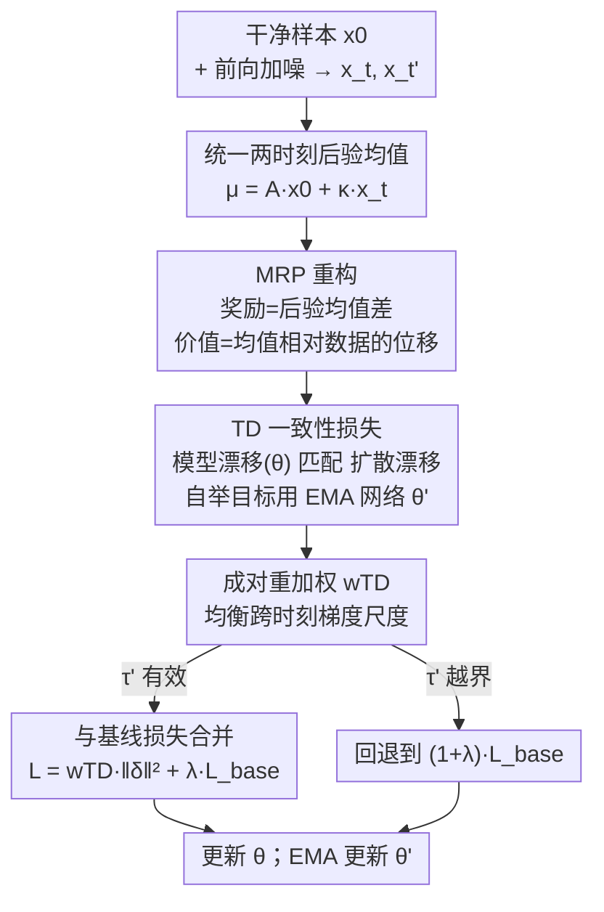

# Temporal Difference Learning for Diffusion Models

**会议**: ICML2026  
**arXiv**: [2606.15048](https://arxiv.org/abs/2606.15048)  
**代码**: https://github.com/StephenYing/Temporal_Difference_Learning_for_Diffusion_Models  
**领域**: 扩散模型 / 图像生成  
**关键词**: 扩散模型, 时序差分, 强化学习, 跨时刻一致性, 少步采样  

## 一句话总结
论文把扩散去噪过程重写成马尔可夫奖励过程（MRP）、把训练当成强化学习里的策略评估，提出一个时序差分（TD）目标，强制模型沿去噪轨迹的「多步漂移」与真实扩散漂移一致；它作为可即插即用的正则项叠加在 EDM/一致性训练等基线损失上，显著改善 FID，尤其在少步采样（小 NFE）场景下优势更明显。

## 研究背景与动机
**领域现状**：扩散模型已是图像/音频高保真生成的标准工具。尽管采样器（DDIM、DPM-Solver、UniPC）和训练加速（渐进蒸馏、一致性学习）进步很大，主流**训练范式**仍然只优化单时刻的重建/噪声预测损失，即在单个时间步（或相邻一对）上对齐去噪目标。

**现有痛点**：单时刻目标**不显式要求**不同噪声水平下的预测在已知前向腐蚀过程下构成一条「时间一致」的轨迹。这种跨时刻失配会沿去噪路径累积，在采样器只用少数几步（小 NFE，函数评估次数少）时尤其致命——局部误差没有足够步数被平均掉。

**核心矛盾**：扩散训练本质是个多步序贯决策问题（不同时间步的预测必须**多步一致**），但现有损失只保证**局部准确**，对「多步往前推时彼此是否自洽」毫无约束。

**本文目标**：在不改基础生成器参数化、不引入新一步生成器、不依赖任务特定奖励的前提下，加一个强制跨时刻一致性的训练正则项，让固定 NFE 下的生成质量变好。

**切入角度**：把去噪轨迹看成一个 RL 里的马尔可夫奖励过程，去噪训练对应**策略评估**（policy evaluation）。一旦把「沿轨迹前进」定义成奖励与回报，就能用经典的时序差分（TD）学习来逼近价值函数，而 TD 的精髓恰恰是「自举（bootstrap）」——用后一步的估计去约束前一步，天然强制跨步一致。

**核心 idea**：把相邻（或 $k$ 步隔开）两个时刻的**后验均值之差**当作 TD 误差里的「真实漂移」，要求模型预测出来的「模型漂移」与之匹配；不同于一致性模型（CM）要求重建本身随时间一致，本文要求的是后验均值之间的**变化量**与真实扩散漂移一致。

## 方法详解

### 整体框架
方法把扩散训练重述为 RL 的策略评估，再用 TD 误差作正则。它的统一武器是「两时刻后验均值」的线性形式：对任意 $\tau<t$，

$$\boldsymbol{\mu}_\tau^{\text{true}}(\boldsymbol{x}_t,\boldsymbol{x}_0) = A_{t,\tau}\,\boldsymbol{x}_0 + \kappa_{t,\tau}\,\boldsymbol{x}_t,$$

其中 $\boldsymbol{x}_0$ 是干净样本、$\boldsymbol{x}_t$ 是噪声水平 $t$ 的样本，系数 $(A_{t,\tau},\kappa_{t,\tau})$ 在 DDPM / DDIM / VP-SDE / VE-SDE / EDM / CM 各族里都有闭式（见下表），所以离散和连续时间用同一套形式表达。整条流程是：给定干净样本 $\boldsymbol{x}_0$ 与前向加噪，定义一个从 $t=T$ 反向走到 $t=0$ 的 MRP，奖励是后验均值差、价值是后验均值相对数据的位移；用带 EMA 目标网络的自举构造 TD 目标，要求模型漂移匹配真实扩散漂移；为稳住跨时刻的梯度尺度做样本级成对重加权；最后把加权 TD 损失与基线损失（EDM 或 CT）按系数 $\lambda$ 合并、梯度更新主网络 $\theta$ 并对目标网络 $\theta'$ 做 EMA 更新。

### 关键设计

**1. 把去噪重写成马尔可夫奖励过程：让奖励与价值都有闭式**

痛点是单时刻损失没有「跨步一致」的语言来表达。论文造了一个有限时域 MRP $(\mathcal{X}, r_t, P_t, T)$，状态空间就是数据空间（图像），并让它从 $t=T$ 反向走到 $t=0$ 以匹配扩散的时间记号。关键在于奖励定义为相邻两步**后验均值之差**（向量值，不是标量）：$\boldsymbol{r}_{t-1} := \boldsymbol{\mu}_{t-1}^{\text{true}}(\boldsymbol{x}_t,\boldsymbol{x}_0) - \boldsymbol{\mu}_{t-2}^{\text{true}}(\boldsymbol{x}_{t-1},\boldsymbol{x}_0)$，转移核就是扩散前向后验 $q(\boldsymbol{x}_{t-1}\mid\boldsymbol{x}_t,\boldsymbol{x}_0)$。这样定义后，回报与价值都坍缩成简洁闭式：$\boldsymbol{g}_t\mid\boldsymbol{x}_0 = \boldsymbol{\mu}_{t-1}^{\text{true}}(\boldsymbol{x}_t,\boldsymbol{x}_0)-\boldsymbol{x}_0$，价值 $\boldsymbol{v}_t(\boldsymbol{x}_t) = \boldsymbol{\mu}_{t-1}^{\text{true}}(\boldsymbol{x}_t,\boldsymbol{x}_0)-\boldsymbol{x}_0$，即「后验均值相对干净数据的位移」。$\boldsymbol{x}_0$ 在整个推导里充当 episode 级上下文（条件量），训练时再从数据分布采样。这一步是整套方法的地基：把抽象的「轨迹一致性」翻译成 RL 里可学习的价值函数。

**2. TD 一致性损失 + EMA 自举目标：要求模型漂移匹配扩散漂移**

有了价值就能用 TD 学习。把价值用预条件去噪器近似 $\boldsymbol{v}_{\theta,t}(\boldsymbol{x}_t) := \boldsymbol{\mu}_{\theta,t-1}(\boldsymbol{x}_t)-\boldsymbol{x}_0$，其中 $\boldsymbol{\mu}_{\theta,t-1}(\boldsymbol{x}_t)=A_{t,t-1}\boldsymbol{x}_{\theta,0}(\boldsymbol{x}_t;t)+\kappa_{t,t-1}\boldsymbol{x}_t$ 由预测 $\boldsymbol{x}_0$ 的模型 $\boldsymbol{x}_{\theta,0}$ 给出。自举目标用**固定参数的 EMA 目标网络** $\theta'$（stop-gradient）估下一状态价值。代入奖励定义，TD 误差恰好分解成两段漂移之差：

$$\boldsymbol{\delta}_t = \underbrace{[\boldsymbol{\mu}_{t-1}^{\text{true}}(\boldsymbol{x}_t,\boldsymbol{x}_0)-\boldsymbol{\mu}_{t-2}^{\text{true}}(\boldsymbol{x}_{t-1},\boldsymbol{x}_0)]}_{\text{一步扩散漂移}} - \underbrace{[\boldsymbol{\mu}_{\theta,t-1}(\boldsymbol{x}_t)-\boldsymbol{\mu}_{\theta',t-2}(\boldsymbol{x}_{t-1})]}_{\text{一步模型漂移}}.$$

TD(0) 目标即 $\mathcal{L}_{\mathrm{TD(0)}}=\mathbb{E}\|\boldsymbol{\delta}_t\|_2^2$。直观上：真实均值这一步往哪挪，模型也得往同方向同幅度挪，于是强制了相邻步的一致。论文进一步用 $k$ 步回报作自举目标得到 $\mathcal{L}_{\mathrm{TD}}^{(k)}$（匹配隔 $k$ 步的漂移）。注意一个巧妙退化：当采到 $t\le k$ 时整段回报已知、无需自举，TD 损失自动**退化成后验均值匹配**（即 DDPM 式损失）。实践中即便 $t>k$ 也把 TD 损失与基线损失合并 $\mathcal{L}_{\mathrm{TD+DDPM}}^{(k)}=\mathcal{L}_{\mathrm{TD}}^{(k)}+\lambda\mathcal{L}_{\mathrm{DDPM}}$ 来加速收敛，否则用 $(1+\lambda)\mathcal{L}_{\mathrm{DDPM}}$ 保持尺度。这正是与一致性模型的本质区别：CM 要求重建本身随时间一致，本文要求的是**均值之间的变化量**与真实扩散漂移一致。

**3. 统一两时刻形式：离散与连续时间一把抓**

痛点是离散（DDPM/DDIM）和连续（VP/VE/EDM/CM）两套体系若各写各的公式会很碎。靠两时刻后验均值的线性形式，连续时间只需挑两个索引 $t,t'\in[0,T]$，各自诱导更早时刻 $\tau<t$、$\tau'<t'$ 的真实后验均值，设 $\tau'<t'<\tau<t$、跨度 $k:=t-t'$、步幅 $\Delta:=t-\tau<k$，就能把离散 TD 误差平移到连续版 $\mathcal{L}_{\mathrm{TD}}^{\mathrm{cont}}$。当 $\tau'$ 落到有效时间窗外（噪声水平低于采样器下界）时同样退化为均值匹配，回退到基线损失。这让 TD 成为可挂到任意预测 $\boldsymbol{x}_0$ 的连续时间基线（EDM、CT）上的通用模块。

**4. 样本级成对重加权：均衡不同时刻对的梯度尺度**

不同 $(t,t')$ 对应的损失尺度差异巨大，会让某些时刻对主导梯度。论文从一个范数不等式出发推导重加权：把 TD 误差写成 $\boldsymbol{\delta}_{t,t'}=\mathcal{B}\,\boldsymbol{e}_{t,t'}$（$\boldsymbol{e}$ 是相对原始网络 $F_\theta$ 的归一化误差），由 $\|\boldsymbol{\delta}_{t,t'}\|_2^2\le\|\mathcal{B}\|_2^2\|\boldsymbol{e}_{t,t'}\|_2^2$ 得到 EDM 参数化下的成对权重

$$w_{\mathrm{TD}}^{\mathrm{EDM}}(t,t') = \frac{1}{A_{t,\tau}^2 c_{\mathrm{out}}^{\mathrm{EDM}}(t)^2 + A_{t',\tau'}^2 c_{\mathrm{out}}^{\mathrm{EDM}}(t')^2},$$

使得加权后 $w_{\mathrm{TD}}\|\boldsymbol{\delta}\|_2^2\le\|\boldsymbol{e}\|_2^2$，即把损失尺度统一到不随时间索引漂移的归一化误差量级。CT 参数化下类似得到 $w_{\mathrm{TD}}^{\mathrm{CT}}(t,t')=1/(A_{t,\tau}^2+A_{t',\tau'}^2)$。消融证明这个重加权是必要的——换成常数权重（unweighted）FID 明显变差。

### 损失函数 / 训练策略
通用配方（Algorithm 1）：采 $\boldsymbol{x}_0$ 与一个噪声索引 $t$，先算基线损失 $\mathcal{L}_{\text{base}}$（EDM 或 CT）；若 $t\le N-1-k-\Delta$（即 $\tau'$ 有效），算 TD 误差 $\boldsymbol{\delta}_{t,t'}$、加权得 $\mathcal{L}_{\mathrm{wTD}}$，总损失 $\mathcal{L}=\mathcal{L}_{\mathrm{wTD}}+\lambda\mathcal{L}_{\text{base}}$；否则 $\mathcal{L}=(1+\lambda)\mathcal{L}_{\text{base}}$；梯度下降更新 $\theta$ 并 EMA 更新 $\theta'$。TD 时间索引通过 EDM 噪声网格 $\sigma(i)$ 参数化，并按 $t'=t+k$、$\tau=t+\Delta$、$\tau'=\tau+k$ 配对，仅当 $\sigma(\tau')\in[\sigma_{\min},\sigma_{\max}]$ 时启用 TD。默认 $\Delta=0.25,k=1,\lambda=0.5$（TD+EDM）。

## 实验关键数据

### 主实验
采样用 probability-flow ODE + Heun 积分器，$\textit{NFE}=2\times\text{steps}-1$，报告 last-15% FID-50k（越低越好）。TD+EDM 在中等少步区间（12–18 步）持平或超过 EDM 基线，FFHQ 上各步数全面占优：

| 数据集 | 步数 | TD+EDM | EDM |
|--------|------|--------|-----|
| Cond. CIFAR-10 (32²) | 12 | **2.270** | 2.365 |
| Cond. CIFAR-10 (32²) | 18 | **2.129** | 2.170 |
| AFHQv2 (64²) | 15 | **3.554** | 3.588 |
| AFHQv2 (64²) | 18 | **3.386** | 3.402 |
| FFHQ (64²) | 9 | **7.463** | 7.829 |
| FFHQ (64²) | 15 | **3.564** | 3.695 |
| FFHQ (64²) | 18 | **3.246** | 3.370 |

TD+CT 在一步采样（steps=1, NFE=1）下也改善 FID：AFHQv2 从 12.97 → 12.87，FFHQ 从 19.45 → **15.93**（提升显著）。

### 消融实验
CIFAR-10 小 UNet、3 个种子的 last-15% FID-50k（默认 $\Delta=0.25,k=1,\lambda=0.5$）：

| 配置 | steps=12 | steps=15 | steps=18 | 说明 |
|------|---------|---------|---------|------|
| 无加权 TD（常数权重） | 11.059 | 10.589 | 10.435 | 去掉成对重加权明显变差 |
| 加权 $w_{\mathrm{TD}}$（完整） | **10.224** | **9.755** | **9.751** | 完整方法 |
| EDM 基线 | 10.576 | 10.201 | 9.978 | 对照 |

$\lambda$ 扫描显示小 $\lambda$（0.01–0.5）最好且在低 $\lambda$ 区间稳定；步幅 $\Delta\in\{1/2,1/3,1/4,1/5\}$ 在固定步数预算下差异很小，对该超参鲁棒。

### 关键发现
- **成对重加权是关键拼图**：换成常数权重后三个步数预算下 FID 全面退化（如 steps=12 从 10.224 退到 11.059），说明跨时刻梯度尺度均衡不可省。
- **少步收益更大**：TD 的优势在小 NFE 下最明显——对齐多步漂移让模型对少步采样固有的大离散化间隔更鲁棒。
- **超参鲁棒、$\lambda$ 宜小**：性能在低 $\lambda$ 区间稳定、对 $\Delta$ 不敏感，落地时不需要精细调参。
- **开销可控**：TD+EDM 因维护目标网络，CIFAR-10 上训练时长约 +40%（45.7→64.7 s/tick）、GPU 显存 +6%；TD+CT 因 CT 本就有目标网络，额外开销很小。

## 亮点与洞察
- **「后验均值之差 = 真实漂移」这个奖励定义**是全文最巧的一步：它让 MRP 的回报与价值都坍缩成后验均值相对数据的位移这种闭式，TD 误差自然拆成「扩散漂移 − 模型漂移」，把抽象的轨迹一致性变成可优化量。
- **与一致性模型的区别讲得很清楚**：CM 约束重建本身一致，本文约束的是均值**变化量**与真实漂移一致——这是「速度/漂移层面」而非「位置层面」的一致性，对少步采样更对症。
- **从范数不等式推出重加权**而非拍脑袋设权重，理论上把损失尺度卡到不随时间漂移的量级，且消融证明确实必要。
- 可迁移性强：它是一个即插即用的训练正则，能挂在 DDPM/DDIM/EDM/CT 等多种基线上，几乎不改原模型参数化，对想给现有扩散训练「加一层一致性约束」的工作很友好。

## 局限与展望
- **额外计算与显存开销**：TD+EDM 需维护并更新 EMA 目标网络，训练时长增加约 40%；虽然作者论证「不显著」，但在大规模训练上仍是成本。
- **评测规模有限**：实验集中在 CIFAR-10 / AFHQv2 / FFHQ 等 32²–64² 数据集，未在更高分辨率或文本到图像大模型上验证；消融为省算力用的是小 UNet。
- **改进幅度依场景而异**：在 AFHQv2 上部分步数预算下 TD+EDM 与基线互有胜负（如 steps=12 略逊），收益在 FFHQ 和少步区间更稳定。
- 展望：把 TD 一致性推广到高分辨率/条件生成、与蒸馏或更高阶求解器联合，验证「漂移层面一致性」在更激进的少步（1–4 步）下的极限收益。

## 相关工作与启发
- **vs 一致性模型 CM（Song 等 2023）**: CM 要求 $f_\theta$ 在相邻时刻的**重建一致**；本文要求后验均值**变化量**与真实扩散漂移一致，是漂移层面的约束，且作为正则叠加在基线上而非替换训练目标。
- **vs 扩散 RL 微调（DDPO / DPOK / Adjoint Matching）**: 那些方法把去噪当 MDP、用策略梯度/最优控制去优化外部奖励（美学、对齐）；本文做的是对去噪过程**自身**的策略评估，不引入任务特定奖励，目标是改善固定 NFE 的生成质量。
- **vs 少步采样的生成器改造（Shortcut Models / MeanFlow）**: 它们重设计生成器或参数化（条件于步长、学平均速度场）来实现一步/少步生成；本文动机互补——保留基础目标，只加 TD 正则强约束跨时刻一致，不改生成器。
- **vs Temporal Difference Flows / γ-model**: 那些工作把 TD 与流式训练或无限时域预测分布联系起来；本文聚焦标准扩散/一致性训练，把 TD 直接落到去噪轨迹的均值漂移匹配上。

## 评分
- 新颖性: ⭐⭐⭐⭐ 把去噪重述为 MRP 策略评估、用后验均值差作奖励导出 TD 一致性目标，视角新且自洽
- 实验充分度: ⭐⭐⭐⭐ 三数据集 × 多步数 + 重加权/λ/Δ 消融较完整，但分辨率与模型规模有限
- 写作质量: ⭐⭐⭐⭐ 统一两时刻形式串起离散/连续，推导清晰，与 CM 的区别交代到位
- 价值: ⭐⭐⭐⭐ 即插即用、对少步采样收益明显，对扩散训练社区实用性强

<!-- RELATED:START -->

## 相关论文

- [\[ICLR 2026\] Temporal Concept Dynamics in Diffusion Models via Prompt-Conditioned Interventions](../../ICLR2026/image_generation/temporal_concept_dynamics_in_diffusion_models_via_prompt-conditioned_interventio.md)
- [\[CVPR 2025\] Finite Difference Flow Optimization for RL Post-Training of Text-to-Image Models](../../CVPR2025/image_generation/finite_difference_flow_optimization_for_rl_post-training_of_text-to-image_models.md)
- [\[ICML 2026\] Diffusion Models Are Statistically Optimal for Learning Low-Dimensional Multi-Modal Distributions](diffusion_models_are_statistically_optimal_for_learning_low-dimensional_multi-mo.md)
- [\[ICML 2026\] A Diffusive Classification Loss for Learning Energy-based Generative Models](a_diffusive_classification_loss_for_learning_energy-based_generative_models.md)
- [\[CVPR 2026\] VideoCoF: Unified Video Editing with Temporal Reasoner](../../CVPR2026/image_generation/videocof_unified_video_editing_with_temporal_reasoner.md)

<!-- RELATED:END -->
