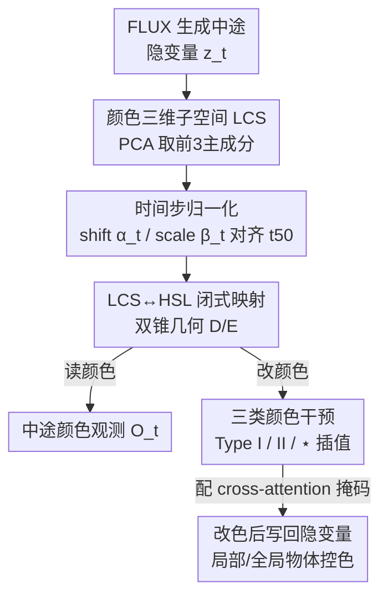

# The Latent Color Subspace: Emergent Order in High-Dimensional Chaos

**会议**: ICML2026  
**arXiv**: [2603.12261](https://arxiv.org/abs/2603.12261)  
**代码**: https://github.com/ExplainableML/LCS  
**领域**: 扩散模型 / 图像生成 / 机制可解释性  
**关键词**: Flow Matching, FLUX, VAE 隐空间, 颜色控制, 免训练干预

## 一句话总结
作者发现 FLUX.1 的 VAE 隐空间里"颜色"只占据一个三维子空间（Latent Color Subspace, LCS），其几何形状几乎就是 HSL 颜色模型的双锥体，并据此提出一套**完全免训练、纯闭式隐空间变换**的方法，既能在生成中途直接"读出"将要生成的颜色，又能把指定物体精确改成目标颜色。

## 研究背景与动机
**领域现状**：文生图（T2I）模型从扩散走向 Flow Matching（FM），FLUX、SD3.5 等都在一个 VAE 压缩出来的隐空间里做去噪/速度场积分，质量与文本一致性都很高。

**现有痛点**：要对生成结果做细粒度控制（比如"把这只鹦鹉变成蓝色"），主流做法是再训一个 ControlNet、IP-Adapter 或学一套 color prompt。这些方法靠堆额外模型/训练硬把控制能力加上去，系统越来越复杂，但**对模型内部"颜色到底是怎么被编码的"几乎没有增进任何理解**，因此也难以建立对系统的信任。

**核心矛盾**：可控性和可解释性被人为割裂——能控的不懂、懂的不能控。根因在于 T2I 的黑箱属性叠加了两层复杂度：一是逐步去噪的时序过程，二是它运行在一个本身就几乎不可读的高维 VAE 隐空间里。

**本文目标**：不再加模块，而是反过来**先理解 FLUX 如何表示颜色这一最基础的图像成分**，并验证这种理解必须同时满足两个性质——(1) 准确，能忠实反映最终图像里浮现的颜色；(2) 因果，允许主动干预去改变颜色。

**切入角度**：作者用 400 张 HSV 均匀采样的纯色图喂进 FLUX 的 VAE 编码器，对 patch 平均后的隐向量做 PCA，惊讶地发现**前 3 个主成分就解释了 100% 的方差**——颜色信息被严格压在一个 3 维子空间里。

**核心 idea**：把这个 3 维子空间命名为 LCS，论证它的几何结构就是一个对应 Hue/Saturation/Lightness 的双锥体，再补上"FM 时序如何在这个子空间里移动"的动力学，最终用一组闭式几何变换实现免训练的颜色观测与干预。

## 方法详解

### 整体框架
方法分两条腿：先做**分析**（揭示 LCS 的静态几何 + FM 时序动力学），再做**应用**（基于这套理解做观测与干预）。输入是一段标准的 FLUX 生成过程（噪声 $\mathbf{z}_0$ 经速度场 $\mathbf{v}_\theta(\mathbf{z},t)$ 积分到干净隐变量），输出是"中途可读的颜色图"或"被改色后的最终图像"。中间所有操作都发生在那张投影矩阵 $\mathbf{B}\in\mathbb{R}^{d\times 3}$ 定义的 3 维子空间里，无需调用 5000 万参数的 VAE 解码器。

整条管线可概括为：纯色图标定出 LCS 子空间与 HSL 几何 → 用 26 张单色图标定每个时间步的分布漂移/缩放统计 → 借这两组标定把任意中途隐变量归一到末步坐标系，再用闭式 $D/E$ 映射在 LCS↔HSL 之间互转 → 读出颜色或施加颜色干预后写回隐变量。

### 关键设计

**1. Latent Color Subspace：颜色被压进一个 3 维双锥**

针对"VAE 隐空间不可读"这个根本障碍，作者没有去解释整个 $d$ 维空间，而是只问"颜色住在哪里"。对 $N=400$ 张纯色图编码、patch 平均得 $\bar{\mathbf{z}}^n\in\mathbb{R}^d$，中心化后做 PCA，前 3 个主成分 $\mathbf{B}$ 解释了 $100\%$ 方差，说明颜色被严格限制在 3 维子空间。把隐向量投到该子空间得到坐标 $\bar{\mathbf{c}}^n=\mathbf{B}^\top(\bar{\mathbf{z}}^n-\boldsymbol{\mu})\in\mathbb{R}^3$，几何结构非常规整：第一维从亮到暗（Lightness），第二三维合成一个圆环（Hue 是角度、Saturation 是半径），整体就是一个双锥（bicone）。这个发现的价值在于把"高维混沌"塌缩成一个有解析意义的低维结构——而且作者在 SD3.5、FLUX.2、Qwen-Image 的 VAE 上重复实验都看到类似组织，暗示 LCS 不是 FLUX.1 独有的偶然。

**2. FM 时序统计标定：让中途隐变量也能被读出颜色**

LCS 的几何是在末步（干净隐变量）下成立的，但生成中途的 patch 还在从 mid-grey 向最终颜色"长出来"，分布会随时间步整体外扩。如果直接拿 $t<50$ 的坐标套 HSL 映射会算错。作者为每个时间步 $t$ 估两个统计量：平移 $\boldsymbol{\alpha}_t=\frac{1}{N}\sum_i \bar{\mathbf{z}}_t^i$ 和逐轴尺度 $\boldsymbol{\beta}_t=\frac{1}{N}\sum_i|\bar{\mathbf{z}}_t^i-\boldsymbol{\alpha}_t|$（用 26 张单色图标定）。任意中途坐标先归一到末步 $t_{50}$ 坐标系：

$$\hat{\mathbf{c}}_i=\frac{\mathbf{c}_i-\boldsymbol{\alpha}_t}{\boldsymbol{\beta}_t}\odot\boldsymbol{\beta}_{50}+\boldsymbol{\alpha}_{50}$$

归一后再走静态映射就准了。这一步把"颜色随时间长出来"的动力学显式建模，是论文能在生成途中就读/改颜色的关键。

**3. LCS↔HSL 闭式双向映射：把几何直觉变成可计算的解析公式**

要让 LCS 真正可用，必须有 LCS 坐标 $\mathbf{c}$ 与 HSL $(h,s,l)$ 之间的双向映射。作者只用 8 个锚点（6 个色相 + 黑/白）就构造出近似双射。**解码 $D$（LCS→HSL）**：以黑白锚定的轴 $\mathbf{a}=\mathbf{w}-\mathbf{b}$ 为消色轴，亮度是投影长度 $l=\|\mathrm{proj}_{\mathbf{a}}(\mathbf{c}-\mathbf{b})\|/\|\mathbf{a}\|$；色相是把点投到 6 个色相锚点近似围成的圆环上、在相邻锚点扇区内做角度插值 $h=\theta_k+\alpha(\theta_{k+1}-\theta_k)$；饱和度是到消色轴的距离除以同亮度下的最大可达距离（双锥模型令该距离向两极线性收窄），$s=\frac{\|\mathbf{c}-\mathbf{c}_L\|}{R(1-|2l-1|)}$。**编码 $E$（HSL→LCS）** 用同一套几何反着来，色相方向用球面插值 $\mathbf{d}_H=\frac{\sin((1-\alpha)\psi)}{\sin\psi}\mathbf{d}_k+\frac{\sin(\alpha\psi)}{\sin\psi}\mathbf{d}_{k+1}$。这套闭式映射不学任何参数，是后续观测与干预都能"免训练"的根基。

**4. 三类颜色干预 + 时序插值：在正确时机用正确方式改色**

改色的难点在于"何时改、怎么改"——FM 两端含义完全不同。晚时间步 patch 颜色已固定，要保持 patch 间关系、在 LCS 内做闭式变换（旋转改色相、收缩改饱和度、沿黑白轴平移改亮度）；早时间步 patch 颜色还没成形，坐标是一团反映"未定可能性"的无结构云，收缩会摧毁多样性、旋转也几乎无效，此时只能靠**整体均匀平移**。于是作者设计两种干预：**Type I** 直接在 LCS 平移 $\hat{\mathbf{c}}_i'=\hat{\mathbf{c}}_i+(\mathbf{c}^*-\bar{\mathbf{c}})$（晚期会破坏纹理、甚至只在表面糊一层色）；**Type II** 先解码到 HSL、平移后再编码回 LCS（早期影响太弱）。两者各有死角，作者用 FM 调度器给出的时序系数 $\gamma_t$ 把两者插值成 **Type ⋆**：$\hat{\mathbf{C}}^{\star}=\gamma_t\hat{\mathbf{C}}'+(1-\gamma_t)\hat{\mathbf{C}}''$，在第 8–10 步这个"黄金窗口"既能让颜色融进画面又能保住纹理。再配上从 cross-attention（Seg4Diff，取 transformer 第 18 层）取的物体掩码，就能只改目标物体而不动其余画面。

### 一个例子：把魔方变成目标色
以 prompt "a photo of a rubik's cube on a table" 为例：生成进行到中途 $t$，把当前隐变量投进 LCS 得到每个 patch 的坐标 $\mathbf{C}$；用第 2 步统计把它归一到 $t_{50}$ 坐标系，再用 $D$ 解码出每个 patch 的 HSL，排成网格就得到"此刻模型打算生成的颜色图" $O_t$——和 VAE 解码出的图几乎一致，但完全不用 5000 万参数解码器。若要改色，在第 9 步用 Type ⋆ 干预：给定目标 $\mathbf{y}^*=(h^*,s^*,l^*)$，对掩码框出的魔方 patch 施加插值平移、写回隐变量，继续跑完生成，魔方就被精确改成目标色，桌面反光和阴影也由 base model 自洽地跟着调整。

## 实验关键数据

### 主实验
观测精度（颜色预测误差 CIEDE2000 $\Delta E_{00}$，越低越好；与直接 VAE 解码对比）：

| 数据集 | 评估方式 | 方法 | t=20 | t=50（末步） |
|--------|---------|------|------|------|
| Objects | 逐像素 | $O_t$（本文，无解码器） | 20 | 12 |
| Objects | 逐像素 | VAE 解码 | 15 | 0 |
| Walls | 均值像素 | $O_t$（本文，无解码器） | 7 | 7 |
| Walls | 均值像素 | VAE 解码 | 19 | 5 |

末步本文在两个数据集都做到 $\Delta E_{00}\le 12$；均值评估下对所有 $t>0$ 都 $\le 13$，**早期时间步甚至反超 VAE 直接解码**——因为本文更善于利用全局隐空间统计，而 VAE 只被训过解码末步隐变量。

颜色干预精度（不改 prompt，只做机制干预）：

| 颜色注入方式 | GenEval Acc ↑ | Precise(plain) $\Delta E_{00}$ ↓ | Precise(plain) $\Delta H$ ↓ |
|--------------|---------------|------|------|
| None（不指定颜色） | 9% | 39 | 88° |
| Prompt（提示词指定颜色） | 79% | 20 | 24° |
| LCS（⋆, global，本文） | 72% | 11 | 8° |
| LCS（⋆, local，本文） | 68% | — | — |

仅靠机制干预、**完全不改 prompt**，就把 GenEval 颜色准确率从 9% 拉到 72%，逼近改 prompt 的 79%；在 plain 精确测试上色差/色相误差甚至**优于** prompt 方式。

### 消融实验

| 配置 | 现象 | 说明 |
|------|------|------|
| Type I（直接 LCS 平移） | 晚期（t=10/50）纹理被破坏、颜色浮于表层 | 单独用太晚不行 |
| Type II（经 HSL 平移） | 早期（t=3）对最终图几乎无影响 | 单独用太早不行 |
| Type ⋆（插值，t=8–10） | 颜色融入且保住细粒度纹理 | 最终选定方案 |

### 关键发现
- **颜色子空间的存在性是全文支点**：前 3 主成分解释 100% 方差这一点，把后续所有闭式操作的合理性都撑了起来。
- **时序统计标定是"中途可读/可改"的关键**：不做 $\boldsymbol{\alpha}_t/\boldsymbol{\beta}_t$ 归一就无法在 $t<50$ 正确套 HSL 映射。
- **干预时机比干预方式更重要**：早期改用平移、晚期改用旋转/收缩，第 8–10 步是兼顾"颜色融入"与"纹理保留"的黄金窗口。
- **跨架构泛化**：SD3.5 / FLUX.2 / Qwen-Image 都观察到类似 LCS 组织，暗示这是 FM-VAE 的普遍现象而非 FLUX 个例。

## 亮点与洞察
- **"先理解再控制"的范式**：不堆 ControlNet/IP-Adapter，而是把控制能力直接从对内部表示的机制理解里"长"出来——免训练、闭式、可解释，这是和主流可控生成最本质的区别。
- **100% 方差落在 3 维**这个实验结果本身就极具冲击力：它说明高维隐空间里"颜色"这个语义维度是高度结构化、可解析建模的。
- **双锥=HSL** 的几何对应非常优雅，把工程上熟悉的颜色模型和深度模型内部表示对上了，可复用的直觉是：其他低维语义属性（如亮度、空间位置）或许也住在类似的可解析子空间里。
- **无需 5000 万参数解码器就能读颜色**，对需要中途监控/早停的高效生成场景有直接价值。

## 局限与展望
- **只覆盖颜色这一种属性**：方法依赖"颜色恰好压在 3 维且呈双锥"这一发现，能否推广到形状、纹理、布局等更复杂语义尚不清楚。
- **依赖模型内部 attention 分割做掩码**：局部控色用 Seg4Diff 从 cross-attention 取掩码，这限制了很早时间步的干预可行性（早期 attention 还不稳）。
- **干预窗口窄**：Type ⋆ 主要在第 8–10 步有效，过早/过晚都会出问题（颜色不融或纹理被破坏），鲁棒时间窗较窄。
- **映射是近似双射**：$D/E$ 基于双锥几何假设和 8 锚点近似，极端饱和度/亮度处的误差未充分讨论。
- 改进方向：把同类"子空间+几何映射"框架扩展到更多可控属性，或学一个更精确的 LCS↔HSL 映射替代纯几何近似。

## 相关工作与启发
- **vs ControlNet / IP-Adapter / color prompt 学习**：它们靠额外模型或训练加控制能力，复杂度上升却不增进理解；本文纯靠机制理解 + 闭式变换，免训练且可解释，代价是目前只管颜色。
- **vs 用 SAE / attention 找可干预方向的可解释工作**：同样在找隐空间里可读可改的方向，但本文给出的是一个有解析几何（双锥/HSL）的封闭子空间，而非一组学出来的稀疏方向。
- **vs 并行的 VAE 颜色编码分析（Arias et al., 2025）**：对方也分析 VAE 隐空间颜色，但缺少预测、干预与 FM 时序分析；本文补齐了"读+改+时序"三块。

## 评分
- 新颖性: ⭐⭐⭐⭐⭐ 首次证明颜色在 FLUX VAE 隐空间占据可解析的 3 维双锥子空间，并据此做免训练控色
- 实验充分度: ⭐⭐⭐⭐ 观测/干预定量定性都有，跨 4 个 VAE 验证泛化；但精确控色 benchmark 仍属早期、规模有限
- 写作质量: ⭐⭐⭐⭐ 几何推导清晰、图示到位，公式较密但逻辑自洽
- 价值: ⭐⭐⭐⭐⭐ 给"理解驱动控制"提供了漂亮范例，对可控生成与机制可解释性都有启发

<!-- RELATED:START -->

## 相关论文

- [\[CVPR 2026\] Toward Diffusible High-Dimensional Latent Spaces: A Frequency Perspective](../../CVPR2026/image_generation/toward_diffusible_high-dimensional_latent_spaces_a_frequency_perspective.md)
- [\[ICML 2026\] Order within Chaos: Capturing Intrinsic Energy Anomalies for AI-Manipulated Image Forgery Localization](order_within_chaos_capturing_intrinsic_energy_anomalies_for_ai-manipulated_image.md)
- [\[ICML 2026\] OcclusionFormer: Arranging Z-Order for Layout-Grounded Image Generation](occlusionformer_arranging_z-order_for_layout-grounded_image_generation.md)
- [\[ICML 2026\] Esoteric Language Models: A Family of Any-Order Diffusion LLMs](esoteric_language_models_a_family_of_any-order_diffusion_llms.md)
- [\[CVPR 2026\] When Local Rules Create Global Order: Self-Organized Representation Learning for Latent Diffusion Models](../../CVPR2026/image_generation/when_local_rules_create_global_order_self-organized_representation_learning_for_.md)

<!-- RELATED:END -->
