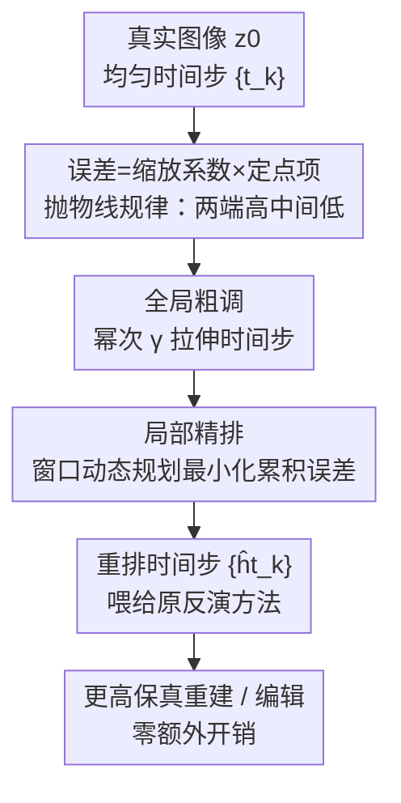

# Timestep Rescheduling in Diffusion Inversion

**会议**: ICML2026  
**arXiv**: [2606.15389](https://arxiv.org/abs/2606.15389)  
**代码**: 待确认  
**领域**: 扩散模型 / 图像生成与编辑  
**关键词**: 扩散反演, DDIM, 时间步调度, 动态规划, 图像编辑

## 一句话总结
作者发现扩散反演（diffusion inversion）的误差强烈依赖时间步大小、且随时间步索引呈"两端高中间低"的抛物线分布，于是提出一个免训练、零额外开销的非均匀时间步调度器 TRDI——先全局拉伸时间步、再用动态规划局部重排，把算力集中到误差大的区段，作为即插即用插件稳定提升各类反演方法在重建与编辑上的精度。

## 研究背景与动机
**领域现状**：扩散反演要把真实图像 $\mathbf{z}_0$ 映回高斯隐空间噪声 $\mathbf{z}_T$，使得从 $\mathbf{z}_T$ 去噪能忠实重建原图——这是图像重建与编辑的基石。DDIM 把反向扩散看成解 ODE，提供了确定性、高效的近似反演。

**现有痛点**：DDIM 反演的近似在每一步都引入误差，并**沿时间步累积**，在少步（few-step）设置下尤其明显，导致重建失真、编辑保真度下降。现有改进几乎都在做一件事——用定点迭代（fixed-point iteration）反复求解反演方程、压低**单步局部误差**（ReNoise、GNRI、AIDI 等）。

**核心矛盾**：所有这些方法都**只盯着每一步内部的局部误差，完全忽略了时间步本身怎么选、怎么排**。多数反演管线仍沿用从 0 到 $T$ 的均匀时间步采样——而时间步的分布与间距对整体反演保真度的影响一直是个盲区（时间步调度在扩散采样和训练里被研究过，唯独反演里几乎空白）。

**本文目标**：系统刻画时间步选择如何影响反演误差，并设计一个能在固定推理步数预算下、自适应重排时间步以最小化全局累积误差的调度策略。

**切入角度**：作者从理论上把大步长反演误差重新写成一个**带缩放系数的定点问题**——误差 = 缩放系数 $c_{\bm{\alpha}}(t,\Delta t)$ × 单步定点项 $\Delta\epsilon_\theta$。其中缩放系数**只取决于噪声调度和时间步**，与具体内容无关。可视化这个系数发现一条清晰规律：**大步长误差更大；且对固定步长，误差随时间步索引呈抛物线——两端（极小、极大时间步）高、中间低**。

**核心 idea**：既然误差形状已知，就该**把算力按误差分布重新分配**——误差大的区段用密集的小步、误差小的区段用稀疏的大步，而不是一刀切均匀采样。

## 方法详解

### 整体框架
TRDI（Timestep Rescheduling in Diffusion Inversion）是一个套在现有反演方法外面的**时间步重调度插件**：它不改反演方程、不改 ODE solver、不加参数、不增计算量，只重新决定"在固定 $K$ 步预算下，这 $K$ 个时间步该放在哪些位置"。

整体两阶段串行：先用一个幂次变换做**全局粗调（global rescaling）**，把均匀分布的时间步整体往误差大的一端拉伸；再用**窗口动态规划（DP）做局部精排**，在每个时间步附近的小窗口内搜索使累积误差最小的精确落点。输入是任意（通常均匀的）时间步序列，输出是重排后的 $\{\hat{t}_k\}_{k=1}^K$，直接喂给原反演方法即可。

### 关键设计

**1. 把大步长反演误差重写成"缩放系数 × 单步定点问题"：定位误差的来源**

要重排时间步，先得知道误差长什么样、由什么决定。标准 DDIM 反演在每步把隐式的 $\mathbf{z}_t$ 用 $\mathbf{z}_{t-1}$ 近似代入网络输入，引入逐步累积的误差。作者把单步推广到大步长 $\Delta t$ 的反演，定义大步与单步反演结果的差为额外误差 $\delta(\mathbf{z}_t,t,\Delta t)=\|\mathbf{z}_t^{(\Delta t)}-\mathbf{z}_t^{(1)}\|$（假设单步反演最准）。通过把中间过渡也展开代入，这个误差可被整理成一个**带缩放系数的定点问题**：

$$\delta(\mathbf{z}_t,t,\Delta t)=\big\|\,c_{\bm{\alpha}}(t,\Delta t)\,\big(\epsilon_\theta(\mathbf{z}_t,t,p)-\epsilon_\theta(\mathbf{z}_{t-1},t-1,p)\big)\,\big\|$$

其中缩放系数 $c_{\bm{\alpha}}(t,\Delta t)=\sqrt{\alpha_t}\,\Delta\psi(\alpha_{t-1},\Delta t-1)$，只依赖噪声调度 $\bm{\alpha}=\{\alpha_t\}$ 和时间步；后面的 $\Delta\epsilon_\theta$ 是已被前人充分研究的局部定点项。在"模型训练良好、输出近似标准高斯"的假设下，$\Delta\epsilon_\theta$ 也服从标准高斯，于是**缩放系数的大小可直接当作误差量级**。这是全文的理论支点：它把"内容相关、难控制"的误差，剥离成一个**只跟时间步有关、可解析计算、可被调度优化**的量。从 ODE 视角看，这等价于把 DDIM 轨迹当 probability-flow ODE 的离散化，非均匀时间步改变的是沿反演路径累积的局部离散化缺陷——TRDI 不发明新 solver，而是按 $c_{\bm{\alpha}}$ 这个调度相关的代理量重新分配固定步预算。

**2. 全局粗调：用幂次变换把时间步整体拉向误差大的一端**

可视化 $c_{\bm{\alpha}}(t,\Delta t)$ 揭示两条规律——步长越大误差越大；固定步长下误差对时间步索引呈抛物线（小索引处高、急降、近 $T$ 时又回升）。直觉是：误差高的地方避免大步，误差低的地方可用更少更大的步；又因为早期步累积的误差会显著影响后期大时间步处的模型输出，所以**早期要保持高敏感度**。据此作者先做一个全局的幂次重缩放：给定均匀时间步 $t_k=t_1+(t_K-t_1)\frac{k-1}{K-1}$，改写为

$$t_k=t_1+(t_K-t_1)\left(\frac{k-1}{K-1}\right)^{\gamma}$$

$\gamma$ 是控制拉伸的超参：$\gamma=1$ 不变；$\gamma>1$ 时间步向早期扩张（早期更密）；$\gamma<1$ 向末端变密。这一步是**粗粒度准备**——它不直接访问 Eq.9 的精确误差项，只是先把整体分布往合理方向挪，为后续精排打底。消融显示 $\gamma=1.05$ 最优。

**3. 局部精排：窗口动态规划在每个步附近搜索使累积误差最小的精确落点**

全局粗调只是大方向，无法对每个时间步做精确优化。作者引入一个**长度 $2d+1$ 的滑动窗口 + 动态规划**：定义代价图 $\mathbf{E}[k,t]$ 表示"在第 $k$ 步落到时间步索引 $t$ 时的最小累积误差"。初始化为 $\mathbf{E}[1,t]=c_{\bm{\alpha}}(t,t)$（覆盖第一个时间步窗口内所有候选 $t$），递推为

$$\mathbf{E}[k,t]=\min_{h=t_{k-1}-d}^{t_{k-1}+d}\Big\{\mathbf{E}[k-1,h]+c_{\bm{\alpha}}(t,t-h)\Big\}$$

即在前一步窗口内的所有候选 $h$ 中，找使"前一步累积误差 + 本步转移误差 $c_{\bm{\alpha}}(t,t-h)$"最小的转移，并用记录器 $\mathbf{R}[k,t]$ 存下最优前驱。前向填满代价图后，从 $\hat{t}_K=\arg\min_t \mathbf{E}[K,t]$ 出发反向回溯出整条最优路径 $\{\hat{t}_k\}$。因为缩放系数可解析计算，整个 DP 不需要跑任何网络前向，所以**零额外推理开销**。窗宽 $d$ 越大搜索空间越大、潜在收益越高（消融里 $d$ 从 0 加到 8/10，多数指标单调改善）。这一步把"全局拉伸"细化成"逐步最优"，是精度提升的主力。

### 损失函数 / 训练策略
TRDI **完全免训练、无参数**：既不微调扩散模型也不学任何新模块，纯粹在推理时重排时间步。它是即插即用的 off-the-shelf 增强，可无缝接进 DDIM、ReNoise、NPI、GNRI 等现有反演管线。

## 实验关键数据

### 主实验：图像重建（MSCOCO，SD v1.5）

| 反演方法 | PSNR↑ | SSIM(×10²)↑ | LPIPS(×10³)↓ |
|---------|-------|-------------|--------------|
| DDIM | 20.07 | 65.11 | 193.97 |
| DDIM w/ Ours | 20.21（+0.70%） | 65.73（+0.95%） | 187.85（−3.16%） |
| ReNoise | 22.35 | 69.46 | 166.27 |
| ReNoise w/ Ours | 22.67（+1.43%） | 70.42（+1.38%） | 157.30（−5.39%） |
| NPI | 20.82 | 66.22 | 182.01 |
| NPI w/ Ours | 21.08（+1.25%） | 67.05（+1.25%） | 175.41（−3.63%） |
| GNRI | 22.14 | 69.72 | 147.02 |
| GNRI w/ Ours | 22.32（+0.81%） | 70.39（+0.96%） | 141.33（−3.87%） |

### 图像编辑（PIE-Bench，SDXL / SDXL Turbo，节选）

| 模型/方法 | Structure Dist.(×10³)↓ | PSNR↑ | LPIPS(×10³)↓ | MSE(×10⁴)↓ |
|----------|------------------------|-------|--------------|------------|
| SDXL DDIM | 19.43 | 26.26 | 89.24 | 39.94 |
| SDXL DDIM w/ Ours | 15.63（−24.31%） | 26.53 | 84.20（−5.99%） | 37.89（−5.41%） |
| SDXL NPI | 19.43 | 26.26 | 89.04 | 39.91 |
| SDXL NPI w/ Ours | 16.36（−18.77%） | 26.54 | 83.13（−7.11%） | 37.74（−5.75%） |
| SDXL Turbo DDIM | 85.55 | 18.36 | 185.10 | 198.04 |
| SDXL Turbo DDIM w/ Ours | 70.64（−17.43%） | 19.03（+3.65%） | 166.52（−11.16%） | 170.54（−16.13%） |
| SDXL Turbo GNRI | 32.06 | 22.18 | 124.92 | 88.48 |
| SDXL Turbo GNRI w/ Ours | 23.63（−35.67%） | 23.39（+5.17%） | 110.13（−13.43%） | 67.76（−30.58%） |

### 消融实验（SDXL，50 步，Δt=20，DDIM baseline）

| γ | d | Struct.Dist.↓ | PSNR↑ | LPIPS↓ | SSIM(×10²)↑ |
|---|---|---------------|-------|--------|-------------|
| 1.00 | 0 | 19.43 | 26.26 | 89.24 | 86.27 |
| 1.10 | 0 | 17.33 | 26.26 | 98.16 | 85.74 |
| 1.05 | 0 | 17.07 | 26.45 | 88.49 | 86.36 |
| 0.90 | 0 | 23.11 | 26.14 | 85.31 | 86.37 |
| 1.05 | 2 | 17.05 | 26.26 | 93.66 | 85.93 |
| 1.05 | 5 | 16.39 | 26.38 | 89.25 | 86.25 |
| 1.05 | 8 | 15.63 | 26.53 | 84.20 | 86.60 |
| 1.05 | 10 | 15.68 | 26.84 | 77.06 | 87.17 |

### 关键发现
- **全局调与局部 DP 都有用、且可叠加**：$\gamma=1.05$（$d=0$）已把 Structure Distance 从 19.43 降到 17.07；再叠加 $d=8$ 进一步降到 15.63，两段设计互补。
- **$\gamma$ 不能贪大**：$\gamma=1.10$ 反而比 $1.05$ 差（LPIPS 升到 98.16），$\gamma=0.90$ 更糟，验证了"向早期适度加密"的最优区间很窄。
- **窗宽 $d$ 越大收益越高**：$d$ 从 0 增到 8/10，多数指标单调改善，因为更大窗口给 DP 更大的重排自由度——而代价仍是零网络开销。
- **少步 / 加速模型上提升最大**：SDXL Turbo 上 GNRI 的 Structure Distance 直降 35.67%、MSE 降 30.58%，印证了"少步设置下误差累积最严重、重调度收益最大"的判断。

## 亮点与洞察
- **把不可控的内容误差剥离成可解析的调度误差**：核心理论贡献是证明大步长反演误差 = 只依赖时间步的缩放系数 × 局部定点项，让"优化时间步"第一次有了明确、可计算的目标函数，这个分解思路对其他扩散加速/反演问题也有借鉴价值。
- **零开销的"免费午餐"**：因为缩放系数纯解析、DP 不跑网络，整套重调度不加任何参数和推理成本，却能即插即用提升一批现有方法——这种"retrofit 而非 replace"的定位很实用。
- **抛物线误差规律是个干净的实证洞察**：误差两端高、中间低，直接指导了"两端密、中间疏"的调度直觉，把方法动机讲得非常具体。
- **与正交方向互补**：TRDI 是 scheduler 级改造，和 EDICT/BDIA（改反演公式）、ReNoise/GNRI（改定点求解）正交，可以叠在它们之上一起用。

## 局限与展望
- **依赖"单步反演最准"和"模型输出近似标准高斯"两个假设**：缩放系数当误差量级的等价性建立在这些假设上，对训练不充分或分布外图像可能偏差。
- **超参需调**：$\gamma$ 和窗宽 $d$ 需按模型/步数预算调（$\gamma$ 最优区间很窄），论文未给跨设置的自动选取方案。
- **DP 窗口的内存/复杂度**：代价图 $\mathbf{E}\in\mathbb{R}^{K\times T}$ 与窗宽 $d$ 决定搜索量，$d$ 很大时虽无网络开销但 DP 本身的索引/内存成本会上升，论文未深入讨论上界。
- **改进方向**：让 $\gamma$、$d$ 随噪声调度/步数自适应；把缩放系数代理推广到 Euler/Heun 等其他确定性 solver；与随机反演方法的结合。

## 相关工作与启发
- **vs 定点迭代类（ReNoise / GNRI / AIDI）**：它们压低**单步局部误差**，TRDI 优化**时间步全局分布**，两者正交、可叠加——实验里 TRDI 套在它们之上都还能再涨。
- **vs 精确/可逆反演（EDICT / BDIA / ExactDPM）**：它们替换反演公式或 solver 来提保真，TRDI 保持底层 solver 家族不变、只在固定预算下重排离散时间步，是 scheduler 级 retrofit。
- **vs Schedule Your Edit（Lin et al. 2024）**：后者**重新设计噪声调度**本身，TRDI 不动噪声调度、只在既有调度内重排时间步，约束更轻、更易即插即用。
- **vs 随机反演（DDPM-style，Huberman-Spiegelglas 等）**：它们能近乎精确重建但通常需很多步和大隐变量存储，限制交互式使用；TRDI 面向少步确定性反演、零额外开销。

## 评分
- 新颖性: ⭐⭐⭐⭐⭐ 首次系统研究反演中的时间步调度，并给出"误差=调度相关缩放系数×定点项"的干净分解。
- 实验充分度: ⭐⭐⭐⭐ 覆盖重建+编辑、多 baseline、多模型（SD1.5/SDXL/Turbo），消融清楚；但缺与少步采样器更大规模的交叉验证。
- 写作质量: ⭐⭐⭐⭐ 理论推导到方法落地逻辑顺畅，图示直观；部分 DP 细节偏简。
- 价值: ⭐⭐⭐⭐⭐ 免训练、零开销、即插即用，能稳定增强一整类现有反演方法，落地性强。

<!-- RELATED:START -->

## 相关论文

- [\[ICML 2026\] Watch Your Step: Information Injection in Diffusion Models via Shadow Timestep Embedding](watch_your_step_information_injection_in_diffusion_models_via_shadow_timestep_em.md)
- [\[ECCV 2024\] Beta-Tuned Timestep Diffusion Model](../../ECCV2024/image_generation/beta-tuned_timestep_diffusion_model.md)
- [\[CVPR 2026\] RebRL: Reinforcing Discrete Visual Diffusion Models with Rebalanced Timestep Credits](../../CVPR2026/image_generation/rebrl_reinforcing_discrete_visual_diffusion_models_with_rebalanced_timestep_cred.md)
- [\[CVPR 2026\] CTCal: Rethinking Text-to-Image Diffusion Models via Cross-Timestep Self-Calibration](../../CVPR2026/image_generation/ctcal_rethinking_text-to-image_diffusion_models_via_cross-timestep_self-calibrat.md)
- [\[ICCV 2025\] Timestep-Aware Diffusion Model for Extreme Image Rescaling](../../ICCV2025/image_generation/timestep-aware_diffusion_model_for_extreme_image_rescaling.md)

<!-- RELATED:END -->
