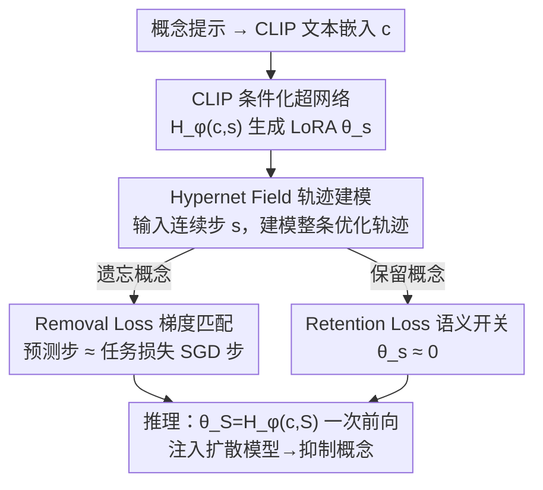

# UnHype: CLIP-Guided Hypernetworks for Dynamic LoRA Unlearning

**会议**: ICML 2026  
**arXiv**: [2602.03410](https://arxiv.org/abs/2602.03410)  
**代码**: 有（论文末注明 See the code on GitHub，具体地址待确认）  
**领域**: 图像生成 / 扩散模型概念擦除  
**关键词**: 机器遗忘, 扩散模型, 超网络, LoRA, CLIP 条件化

## 一句话总结
UnHype 用一个以 CLIP 文本嵌入为输入的超网络，在推理时动态生成 LoRA 权重——遇到要遗忘的概念就生成能抑制它的 LoRA，遇到正常概念就生成接近零的 LoRA——从而把"每个概念单独训练一个 LoRA"的静态遗忘，改造成"一个模型按文本即时生成遗忘适配器"的摊销式遗忘，同时支持 Stable Diffusion 和 Flux。

## 研究背景与动机
**领域现状**：大规模文生图扩散模型可能被滥用来生成有害内容，因此"机器遗忘（machine unlearning）"——在不损伤整体生成能力的前提下选择性抹掉某个概念——成为热点。LoRA（低秩适配）因为参数高效，被广泛用作概念遗忘的手段：往注意力/前馈层注入低秩矩阵 $\Delta W=BA$，只训练这一小撮参数就能定向修改模型行为。

**现有痛点**：现有 LoRA 遗忘方法有三个硬伤。其一，**静态全局修改**：LoRA 一旦合并进模型，每次前向都生效，不管输入提示是什么，容易"误伤"语义相邻的概念（擦"猫"把"猫科"也擦坏）。其二，**缺乏上下文灵活性**：固定权重对组合式、上下文相关的提示适应差。其三，**多概念不可扩展**：单个 LoRA 的单概念训练成本不高，但要擦 100 个名人就得跑 100 次独立训练，各自调参、各自存 checkpoint，成为实际瓶颈。

**核心矛盾**：根本问题在于"遗忘"被当成一次性、针对单个概念的**静态微调**。静态权重无法既精准擦掉目标、又对其余概念保持透明，更无法在多概念间复用。要打破这个矛盾，得让遗忘行为变成**条件于输入、即时生成**的动态过程。

**本文目标**：（1）让 LoRA 权重随输入概念动态变化、对非目标概念几乎不动；（2）对训练时没见过的同义/相关概念也能泛化；（3）多概念用一次训练摊销，而不是 N 次。

**切入角度**：作者引入**超网络（hypernetwork）**——一个生成另一个网络权重的网络——让它以概念的 CLIP 嵌入为条件，直接"吐出"对应的 LoRA 权重。但天真训练会遇到障碍：要学映射 $H_\phi(c)\to\theta_c$ 就需要 (概念, 目标 LoRA) 配对数据，而构造这种数据本身又要为每个概念单独训练并存一个 LoRA——正是本文想消灭的瓶颈。

**核心 idea**：借鉴 Hypernet Fields，不直接学"概念→最终权重"，而是让超网络建模**整条优化轨迹** $H_\phi(c,s)$（$s$ 是连续的优化步），用任务损失的梯度去监督超网络的局部梯度，从而**完全不需要预先算好的最终权重** $\theta_S$。

## 方法详解

### 整体框架
UnHype 的核心是一个用 MLP 实现的超网络 $H_\phi$，输入两样东西：概念的 768 维 CLIP 文本嵌入 $c$，以及一个连续的遗忘步 $s\in[0,S]$，输出该步的全套 LoRA 权重 $\theta_s=H_\phi(c,s)$。在 Stable Diffusion 上，LoRA 加在负责文本条件化的交叉注意力上；在 Flux 上则改值投影与输出变换组件。

训练阶段用两个损失教会 $H_\phi$ 一种"语义开关"行为：对要遗忘的概念，生成能把去噪预测从该概念推开的 LoRA（**removal loss**，靠梯度匹配实现）；对要保留的概念，生成接近零的权重（**retention loss**，防灾难性遗忘）。推理阶段，最终权重 $\theta_S=H_\phi(c,S)$ 一次前向就生成：若 $c$ 安全则 $\theta_S\approx 0$、模型照常生成；若 $c$ 是禁止概念则 $\theta_S$ 抑制它、产出替代图像（如"猫"→一片森林）。这套"以 CLIP 条件化 + 轨迹建模"的设计让单次训练即可摊销到多个概念，并泛化到训练时没见过的同义词。

### 关键设计

**1. Hypernet Field 轨迹建模：用连续步绕开"配对数据"死结**

天真做法要学 $H_\phi(c)\to\theta_c$，但拿不到 (概念, 目标 LoRA) 配对——构造它等于回到"每概念单训一个 LoRA"的老瓶颈。作者借鉴 Hypernet Fields：不学"概念→固定权重向量"，而是给超网络多加一个连续时间步输入 $s$，让它建模导向 $\theta_S$ 的**整条优化轨迹**，输出 $\theta_s=H_\phi(c,s)$ 表示第 $s$ 步的参数状态。这样做的关键好处是，超网络可以**用自己的局部梯度** $\nabla_s H_\phi$ 去对齐**任务损失的梯度** $\nabla_\theta \mathcal{L}$ 来训练，彻底不需要预先算好的终点权重 $\theta_S$。直观地说，超网络学的是"沿着遗忘任务的梯度场怎么走"，而不是"终点长什么样"。

**2. Removal Loss 梯度匹配：让超网络的步幅对齐遗忘任务的 SGD 步**

这是把上面的轨迹思想落地的损失。每步训练采样一个"遗忘"概念 $c$ 和一个随机步 $s\sim\mathcal{U}(0,S)$，要求超网络的数值梯度（"预测步"）$\Delta\theta_{pred}=H_\phi(c,s+1)-H_\phi(c,s)$ 去匹配任务损失的解析梯度（"目标步"）$\Delta\theta_{task}=-\eta\nabla_{\theta_s}\mathcal{L}_{task}$，二者取 MSE：

$$\mathcal{L}_{remove}=\big\|(H_\phi(c,s+1)-H_\phi(c,s))+\eta\nabla_{\theta_s}\mathcal{L}_{task}\big\|_2^2$$

其中任务损失 $\mathcal{L}_{task}$ 沿用 UnGuide 的"引导回归"思路：构造一个被推离遗忘概念 $c$、推向映射概念 $c_m$（如"猫"→"森林"）的目标预测 $\epsilon_{target}=\epsilon_{\theta^*}(z_t,t,c_m)-\gamma\big(\epsilon_{\theta^*}(z_t,t,c)-\epsilon_{\theta^*}(z_t,t,c_m)\big)$，再让加了 LoRA 的模型预测去逼近它，$\mathcal{L}_{task}=\mathbb{E}\big[\|\epsilon_{\theta_s+\theta^*}(z_t,t,c)-\epsilon_{target}\|_2^2\big]$，$\gamma$ 控制被排斥的程度。梯度匹配的好处是把"擦掉概念"这件事变成"让超网络的轨迹斜率处处等于遗忘梯度场"，从而无需终点监督就能学到完整的遗忘适配器生成器。

**3. Retention Loss 语义开关：让非目标概念的权重恒为零**

光有 removal loss 会破坏其余概念。retention loss 强制：当超网络以"保留"概念 $c_{retain}$ 为条件时，对所有步 $s$ 都应输出零权重。实现上直接惩罚它偏离初始零状态 $\theta_0=H_\phi(c_{retain},0)$ 的程度：

$$\mathcal{L}_{retain}=\mathbb{E}_{c_{retain},s}\big[\|H_\phi(c_{retain},s)-H_\phi(c_{retain},0)\|_2^2\big]$$

这条简单的损失把超网络训练成一个**语义开关**：输入安全概念就吐 $\theta_s\approx 0$、模型行为不变；输入禁止概念才生效。总损失是二者加权和 $\mathcal{L}_{final}=\lambda_{remove}\mathcal{L}_{remove}+\lambda_{retain}\mathcal{L}_{retain}$。

**4. CLIP 条件化 + 多概念摊销：一次训练泛化到同义词和多个概念**

把生成条件设成概念的 CLIP 文本嵌入，而不是离散的概念 id，带来两个直接收益。其一，**泛化**：CLIP 嵌入把语义相近的词映射到相近向量，于是超网络对训练时没见过的同义词（如擦"鸟"也能压住"bird"的近义表述）也能生成合理的抑制 LoRA。其二，**摊销**：传统方法擦 100 个名人要 100 次独立训练，而 UnHype 用单个统一模型在一次训练里覆盖多个概念，按概念数摊销算力。需要说明的是，对单概念或少概念擦除，UnHype 的训练成本与标准 LoRA 微调相当；效率优势**专门体现在多概念**场景的摊销上。推理时还按架构区分注入方式：SD 把 $\theta_S$ 只加到条件 CFG 分支、无条件分支冻结；Flux 因为是流匹配 + 蒸馏引导、无法只针对条件分支，就把 $\theta_S$ 直接作用于整条采样。

### 损失函数 / 训练策略
总目标 $\mathcal{L}_{final}=\lambda_{remove}\mathcal{L}_{remove}+\lambda_{retain}\mathcal{L}_{retain}$；超网络训练 300 步。SD 1.4 用 50 步去噪、引导尺度 7.5。遗忘任务沿用 UnGuide 的引导回归损失（含映射概念 $c_m$ 与排斥系数 $\gamma$），遗忘梯度场由 removal loss 的梯度匹配隐式逼近。

## 实验关键数据

### 主实验
在 Stable Diffusion 1.4 与 Flux.1 [dev] 上，覆盖物体擦除、名人擦除、裸露内容擦除三类任务。物体擦除在 3 个 CIFAR-10 类上做，指标为擦除效力 $\text{Acc}_e\downarrow$、特异性 $\text{Acc}_s\uparrow$、泛化性 $\text{Acc}_g\downarrow$（同义词上的残留），三者用调和均值 $\text{H}_o\uparrow$ 综合。

| 方法（三类平均） | $\text{Acc}_e\downarrow$ | $\text{Acc}_s\uparrow$ | $\text{Acc}_g\downarrow$ | $\text{H}_o\uparrow$ |
|---|---|---|---|---|
| UCE | 19.05 | 98.52 | 29.08 | 81.24 |
| ESD-u | 12.98 | 88.66 | 14.17 | 86.96 |
| MACE | 9.14 | 96.73 | 12.01 | 91.68 |
| **UnHype** | **6.61** | **96.20** | **7.67** | **93.85** |
| SD v1.4（原模型） | 98.14 | 98.69 | 84.90 | — |

UnHype 在擦除效力、同义词泛化、综合分 $\text{H}_o$ 上都领先；图 4 也显示基线压不住语义相关词，而 UnHype 能把同义变体映射到中性概念。

### 裸露内容擦除（I2P 基准，NudeNet 阈值 0.6，越低越好）

| 方法 | NudeNet 总检出 ↓ | FID ↓ | CLIP ↑ |
|---|---|---|---|
| MACE | 111 | 13.42 | 29.41 |
| SAeUron | 18 | 14.37 | 30.89 |
| STEREO | 9 | 15.70 | 30.23 |
| **UnHype** | **8** | **13.45** | **31.43** |
| SD v1.4（原模型） | 743 | 14.10 | 31.34 |

### 关键发现
- **擦得最干净还不掉质量**：UnHype 在 SD 上把裸露检出从 743 降到 8（减少 98.9%），同时 FID 和 CLIP 都优于原始 SD——大多数遗忘方法会牺牲生成质量，UnHype 反而略有提升。
- **训练更省**：达到上述效果只需约 3 小时训练，而 SAeUron 需要 24+ 小时；裸露检出比 EraseAnything 少六倍以上。
- **同义词泛化是 CLIP 条件化的直接红利**：$\text{Acc}_g$（同义词残留）从基线的 84.90 降到 7.67，远好于 MACE 的 12.01，说明把条件设成连续 CLIP 嵌入确实让模型把没见过的近义词也压住了。
- **架构通用性**：同一框架在 SD（修改 CFG 注入）和 Flux（直接作用于采样）上都稳定有效，验证了"超网络 + LoRA"对扩散与流匹配两类模型都适用。

## 亮点与洞察
- **把"静态微调"改成"摊销生成"是最核心的范式转变**：不再为每个概念存一个 LoRA，而是训一个能按文本即时生成遗忘适配器的超网络，多概念场景的可扩展性由此而来。
- **Hypernet Field 梯度匹配巧妙绕开配对数据**：用连续步 $s$ 建模优化轨迹、用任务梯度监督超网络梯度，避免了"要训练数据就得先单独训练每个 LoRA"的鸡生蛋问题——这个 trick 可迁移到任何"想用超网络生成微调权重但缺配对数据"的场景。
- **语义开关 = 一条极简 retention loss**：仅用"保留概念应恒输出零权重"就实现了对非目标概念透明，比依赖外部分割工具（如 MACE 用 Grounded-SAM）干净得多。
- **CLIP 嵌入当条件带来免费泛化**：连续语义空间让同义词自动获得相近的抑制行为，这个设计可迁移到其他"按语义条件化生成参数"的可控生成任务。

## 局限与展望
- **效率优势局限于多概念**：作者自己承认，单概念/少概念时训练成本与普通 LoRA 微调相当，摊销红利只在大量概念时显现。
- **依赖映射概念 $c_m$ 的选择**：遗忘任务把目标概念推向一个手选的中性概念（如"森林"），$c_m$ 和排斥系数 $\gamma$ 的选取会影响替代图像质量与擦除彻底度，论文未充分探讨其敏感性。
- **对抗鲁棒性未深究**：评测以标准提示和 I2P 为主，对绕过式对抗提示（adversarial prompt）的鲁棒性、以及超网络是否会被特制嵌入"骗"出非零权重，仍待考察。
- **可改进方向**：把映射概念也做成可学习/可条件化、对超网络输出加正则以增强对抗鲁棒性，或将语义开关扩展到细粒度的"部分擦除/可调强度"控制。

## 相关工作与启发
- **vs UnGuide（Polowczyk et al. 2025）**：UnGuide 学固定的 LoRA 模块并在去噪时做推理期动态引导；UnHype 直接沿用其任务损失（引导回归），但把"学固定 LoRA"换成"超网络即时生成 LoRA"，从而支持多概念摊销与同义词泛化。
- **vs MACE（Lu et al. 2024）**：MACE 用两个 LoRA 组件 + Grounded-SAM 分割图做空间定位擦除，依赖外部分割工具；UnHype 不需外部定位，靠 retention loss 的语义开关实现对非目标概念的透明。
- **vs ESD / FMN / UCE 等微调式擦除**：它们通过修改 CFG、重定向注意力或闭式编辑做静态全局修改，易误伤相邻概念；UnHype 的权重随输入概念动态变化，特异性和同义词泛化更好。
- **vs Hypernet Fields（Hedlin et al. 2025）**：本文把其"建模优化轨迹 + 梯度匹配"原理从一般权重生成迁移到扩散模型概念遗忘，是该原理在安全/可控生成上的具体落地。

## 评分
- 新颖性: ⭐⭐⭐⭐⭐ 首次把超网络 + Hypernet Field 梯度匹配用于扩散模型概念遗忘，范式从静态微调转为摊销生成
- 实验充分度: ⭐⭐⭐⭐ 覆盖物体/名人/裸露三任务、SD 与 Flux 两架构，指标全面，但对抗鲁棒性评测偏弱
- 写作质量: ⭐⭐⭐⭐ 动机-障碍-解法的逻辑链清晰，损失推导完整
- 价值: ⭐⭐⭐⭐⭐ 多概念可扩展 + 同义词泛化 + 训练省时，对实际部署的概念擦除很实用

<!-- RELATED:START -->

## 相关论文

- [\[CVPR 2026\] ChimeraLoRA: Multi-Head LoRA-Guided Synthetic Datasets](../../CVPR2026/image_generation/chimeralora_multi-head_lora-guided_synthetic_datasets.md)
- [\[ICML 2026\] DGS-Net: Distillation-Guided Gradient Surgery for CLIP Fine-Tuning in AI-Generated Image Detection](dgs-net_distillation-guided_gradient_surgery_for_clip_fine-tuning_in_ai-generate.md)
- [\[CVPR 2026\] BiMotion: B-spline Motion for Text-guided Dynamic 3D Character Generation](../../CVPR2026/image_generation/bimotion_b-spline_motion_for_text-guided_dynamic_3d_character_generation.md)
- [\[ICML 2026\] A Unified Framework for Diffusion Model Unlearning with f-Divergence](a_unified_framework_for_diffusion_model_unlearning_with_f-divergence.md)
- [\[ICLR 2026\] MOLM: Mixture of LoRA Markers](../../ICLR2026/image_generation/molm_mixture_of_lora_markers.md)

<!-- RELATED:END -->
