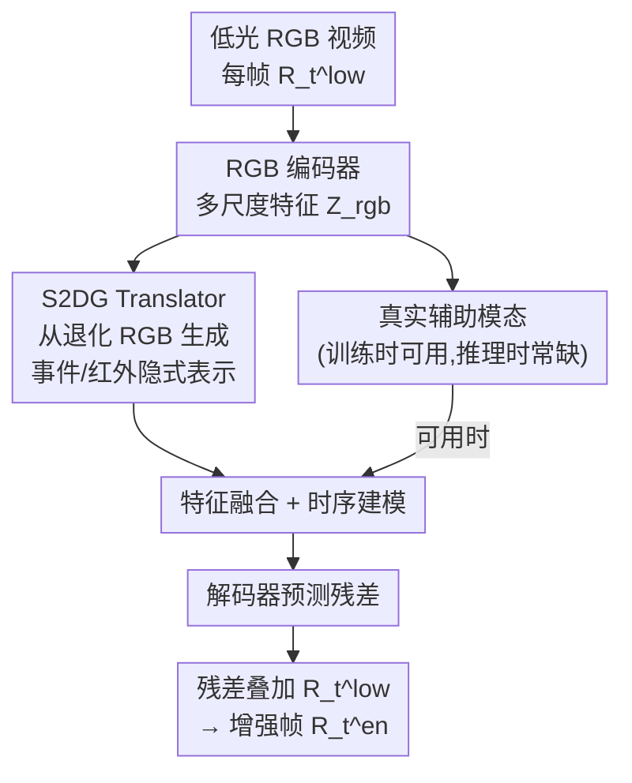

# AnyMod-LLVE: Low-Light Video Enhancement with Modality-Agnostic Inference

**会议**: ICML2026  
**arXiv**: [2606.11186](https://arxiv.org/abs/2606.11186)  
**代码**: 项目页（论文称 Code and models available，未给确切链接）  
**领域**: 图像/视频恢复  
**关键词**: 低光视频增强, 模态缺失, 隐式模态生成, 频域门控, 多模态预训练

## 一句话总结
针对"多模态低光视频增强在推理时拿不到事件流/红外辅助模态就崩"的痛点，AMNet 用一个 Spatial-Spectral Dual-Gated（S2DG）Translator 从退化的低光 RGB 里"凭空生成"辅助模态的隐式表示，再配合大规模合成多模态预训练，使得测试时无论给不给辅助模态都能稳定增强——RGB-only 推理就已达到 SOTA，给了辅助模态还能再涨一点。

## 研究背景与动机
**领域现状**：低光视频增强（LLVE）的主流做法分两类。一类是 RGB-only，靠 Retinex/光照分解（RetinexFormer、Cai et al.）和时序一致性建模（STCD、Xu et al.）来提亮去噪。另一类是近年兴起的多模态方法（EvLight、EvLight++），额外引入事件流（event stream）或红外（infrared）图像，提供互补的运动动态和结构先验，在细节恢复上明显更强。

**现有痛点**：多模态方法有一个隐含的强假设——辅助模态在训练和推理时都必须存在。但事件相机、红外相机需要额外硬件、精细标定、严格的时空同步，真实部署中往往拿不到高质量的多模态数据，或者拿到的是部分损坏的。一旦推理时辅助模态缺失，现有多模态模型会大幅掉点，可部署性很差。

**核心矛盾**：训练阶段想用多模态信息（它确实有用），但推理阶段又必须对缺失模态鲁棒。一个折中思路是"测试时用生成模型把缺失模态显式补出来"，但在推理时调用生成模型会引入不可忽视的延迟，对时效场景不实用。

**本文目标**：做一个统一框架，使其在任意模态可用组合下都能推理——有辅助模态就用，没有就自给自足，且不在推理时调用昂贵的生成模型。

**切入角度**：与其把辅助模态当成"必需输入"，不如把它当成"可以从 RGB 推断出来的隐式支撑"。难点在于低光下 RGB 本身信息严重退化，局部纹理和锐利边缘极脆弱、常被传感器噪声淹没，从这种退化输入里抽出可靠的多模态线索很难。

**核心 idea**：用一个频谱分析驱动的双门控翻译器，把"在低光观测里幸存下来的稀少但有用的高频细节"挑出来，转译成辅助模态的隐式表示；并用合成的多模态数据做大规模预训练，把这种跨模态对应关系当作先验学进来。

## 方法详解

### 整体框架
AMNet 接收一段低光 RGB 视频 $\{R_t^{low}\}_{t=1}^{T}$，输出增强后的视频 $\{R_t^{en}\}_{t=1}^{T}$。训练时事件流 $\{\mathcal{E}_t\}$ 和红外 $\{I_t\}$ 可用，推理时它们可能缺失。

每帧 $R_t^{low}\in\mathbb{R}^{H\times W\times 3}$ 先经 RGB 编码器抽取多尺度特征 $\mathcal{Z}_t^{rgb}$，作为后续增强与模态生成的基础表示。训练时若辅助模态可用，事件流会被转成 event voxel grid $E_t\in\mathbb{R}^{H\times W\times B}$、红外表示为单通道 $I_t\in\mathbb{R}^{H\times W\times 1}$，各自经模态编码器抽特征。核心组件 S2DG Translator 学习 RGB 与辅助模态间的对应关系：当辅助模态缺失时，它从 RGB 特征里生成对应的隐式辅助表示来顶上。随后 RGB 特征与（真实或生成的）辅助特征融合，送入时序建模模块捕捉帧间依赖，最后解码器预测一张残差图，叠加到 $R_t^{low}$ 上得到输出 $R_t^{en}$。

### 关键设计

**1. 模态无关推理：把辅助模态当可选线索而非必需输入**

这一设计直接针对"推理时辅助模态缺失就崩"的痛点。AMNet 不再把事件流/红外当成测试时必须喂入的输入，而是把它们建模为"可从 RGB 推断的隐式支撑"。具体地，当辅助模态可用时，框架直接吃显式信号、抽取结构信息；当辅助模态缺失时，AMNet 为每种辅助模态生成专属的隐式表示 $\hat{Z}_t^m$ 来替代真实特征参与解码（如 $\hat{R}_{t,en}^{r}=\mathcal{D}(Z_t^{rgb},\hat{Z}_t^{ir},\hat{Z}_t^{evt})$）。这样同一个网络就能覆盖"全模态 / 只有事件 / 只有红外 / 全缺失"等任意组合，且因为隐式表示是一个轻量翻译器前向得到的，不需要在推理时调用昂贵的生成模型，避免了显式补全方案的延迟问题。

**2. S2DG Translator：从退化 RGB 蒸馏可靠高频线索（IADS + FBS 双门控）**

这是全文的技术核心，解决"低光 RGB 里的细节又稀少又被噪声污染，怎么挑出可信的高频线索去转译成辅助模态"。S2DG 在空间域和频域各放一道门控，串联工作。

第一道是 **Illumination-Aware Detail Selector（IADS）**，在空间域按光照可靠性给高频细节加权。它先把 RGB 特征拆成低频和高频两部分：

$$Z_{low}=\mathrm{AvgPool}(Z_t^{rgb}),\qquad Z_{high}=Z_t^{rgb}-Z_{low}.$$

$Z_{low}$ 捕捉全局光照分布，$Z_{high}$ 是混着噪声的局部细节响应。基于 $Z_{low}$ 预测一张光照感知的空间可靠性图 $M_{spatial}=\sigma(\mathrm{Conv}_{1\times 1}(Z_{low}))$，再对高频做空间重加权 $\tilde{Z}_{high}=Z_{high}\odot M_{spatial}$，从而压掉光照差区域里被噪声主导的高频。

第二道是 **Frequency-Band Selector（FBS）**，在频域进一步保留并强化有用的频段、抑制噪声主导的响应。它先把 $\tilde{Z}_{high}$ 做逐通道 2D FFT 得到 $F_{freq}=\mathcal{F}(\tilde{Z}_{high})$，预测一个谱门控 $G_{spec}=\sigma(\mathrm{Conv}(F_{freq}))$ 和一个谱缩放 $S_{spec}=\tanh(\mathrm{Conv}(F_{freq}))$，联合调制频域特征 $F_{out}=F_{freq}\odot G_{spec}\odot(1+S_{spec})$，再逆 FFT 回空间域 $\hat{Z}_{high}=\mathcal{F}^{-1}(F_{out})$。最后用残差把可能被选择性门控压掉的全局上下文补回来：$\hat{Z}_t^m=\hat{Z}_{high}+Z_{low}$，这个 $\hat{Z}_t^m$ 就是该辅助模态的隐式表示。每种辅助模态用各自独立的 S2DG，做模态特定的生成。之所以有效，是因为它没有去"无中生有"地恢复所有细节，而是显式优先保留低光下幸存的那部分可信高频，避免把噪声当信号放大。

**3. 大规模合成多模态预训练：把跨模态对应当先验学进来**

成对的多模态 LLVE 数据极稀缺，直接监督学不出可靠的跨模态对应。本设计借生成模型造伪多模态数据来扩大训练规模：用 v2e 从 RGB 合成事件流、用 ThermalGen 合成红外图像，源数据来自视频分割、视频超分等多样视频集；再通过调节光照得到成对的正常光/低光 RGB（基于物理退化模型，光照在 10%–50% 均匀采样，并补充 1%–10% 的长尾极暗）。在这批伪多模态数据上预训练 S2DG，让它先把 RGB↔辅助模态的对应关系当先验学好，之后下游 RGB-only 微调时这套先验就能持续受益。值得注意的是：合成只用在训练侧；推理时若再调生成模型会引入延迟，所以模态缺失在测试时仍是真问题，这正凸显了模态无关推理的价值。

### 损失函数 / 训练策略
总目标由三项组成：$\mathcal{L}_{total}=\lambda_1\mathcal{L}_{rec}^{full}+\lambda_2\mathcal{L}_{rec}^{miss}+\lambda_3\mathcal{L}_{dt}$。

- **全模态重建** $\mathcal{L}_{rec}^{full}$：用全部真实模态解码出帧，与正常光参考帧算 $\ell_1$ 像素损失 + SSIM 结构损失，$\mathcal{L}_{rec}^{full}=\mathcal{L}_p+\lambda_s\mathcal{L}_s$。
- **缺失模态模拟** $\mathcal{L}_{rec}^{miss}$：训练时枚举所有辅助模态可用组合 $m\subset\{\text{ir},\text{evt}\}$（只有事件、只有红外、全缺失等），对每种组合产出的增强帧都用同样的重建损失监督，$\mathcal{L}_{rec}^{miss}=\sum_m \mathcal{L}_{rec}^m(\hat{R}_{t,en}^m,R_t^{gt})$，逼模型在不完整辅助信息下也能出好帧。
- **特征蒸馏** $\mathcal{L}_{dt}$：把生成的隐式表示 $\hat{Z}_t^m$ 与真实模态特征 $Z_t^m$ 对齐，对单位化后的特征求 $\ell_2$ 距离，并对真实分支用 stop-gradient 防止梯度回流：$\mathcal{L}_{dt}=\sum_m \lambda_m\big\|\hat{Z}_t^m/\|\hat{Z}_t^m\|_2 - \mathrm{sg}(Z_t^m/\|Z_t^m\|_2)\big\|_2^2$。

训练用 AdamW（初始学习率 $2\times10^{-4}$，cosine 调度 + 5 个 warm-up epoch），输入裁成 $128\times128$、clip 长度 8；预训练在 4 张 A800 上分布式进行，下游微调单张 A800、batch 32。

## 实验关键数据

### 主实验
在 RGB-only 设置下（推理不喂任何辅助模态），AMNet 在三个真实 LLVE 数据集上全面领先：

| 数据集 | 指标 | 本文 | 之前最佳(STCD) | 提升 |
|--------|------|------|----------------|------|
| DID | PSNR / SSIM | 31.57 / 0.95 | 30.10 / 0.93 | +1.47 dB / +0.02 |
| SDSD-Indoor | PSNR / SSIM | 29.03 / 0.92 | 28.93 / 0.88 | +0.10 dB / +0.04 |
| SDSD-Outdoor | PSNR / SSIM | 26.37 / 0.84 | 26.32 / 0.82 | +0.05 dB / +0.02 |

在多模态数据集 SDE 上，对比依赖事件流的多模态方法（EvLight++ 等）：AMNet 即便只用 RGB（R）推理就已超过它们；给事件（R+E）、红外（R+I）、或全给（R+E+I）还能进一步涨：

| 推理模态 | SDE-Indoor PSNR/SSIM | SDE-Outdoor PSNR/SSIM |
|----------|----------------------|------------------------|
| EvLight++ (R+E) | 22.67 / 0.779 | 23.34 / 0.768 |
| AMNet (R, 仅RGB) | 23.04 / 0.816 | 23.75 / 0.775 |
| AMNet (R+E) | 23.22 / 0.827 | 23.88 / 0.791 |
| AMNet (R+E+I) | 23.25 / 0.828 | 23.91 / 0.791 |

零样本（不微调）对比恢复基础模型（FoundIR、DarkIR 等），AMNet 在 DID 上 25.07/0.93、SDSD-Indoor 22.27/0.87、SDSD-Outdoor 21.43/0.74，全面碾压（如 DID 上 DarkIR 仅 19.62/0.82），说明大规模多模态预训练显著增强了泛化。

### 消融实验
S2DG 两个子模块的消融（DID 数据集，PSNR/SSIM）：

| IADS | FBS | DID | SDSD-Indoor | SDSD-Outdoor |
|------|-----|-----|-------------|--------------|
| ✗ | ✗ | 29.85 / 0.93 | 28.31 / 0.91 | 25.93 / 0.81 |
| ✓ | ✗ | 30.30 / 0.93 | 28.60 / 0.91 | 26.05 / 0.81 |
| ✗ | ✓ | 30.95 / 0.94 | 29.20 / 0.92 | 26.25 / 0.82 |
| ✓ | ✓ | 31.57 / 0.95 | 29.03 / 0.92 | 26.37 / 0.84 |

预训练数据规模消融（0%→100%）：DID 上 PSNR 从 29.78 升到 31.57，同时生成表示与真实模态的 L2 距离（Event/IR）从 0.328/0.314 降到 0.289/0.277。

### 关键发现
- **FBS 比 IADS 贡献更大**：单开 FBS 在 DID 上拉到 30.95，单开 IADS 只到 30.30；两者互补，全开 31.57。说明频域选频对挑出可信高频是主力，空间光照门控是辅助。
- **预训练越多越好且越"逼真"**：随预训练数据从 0% 到 100%，下游 RGB-only 性能单调上升，且生成的隐式表示与真实模态特征的 L2 距离单调下降——验证了大规模合成多模态预训练确实学到了更准的跨模态对应。
- **模态缺失掉点极小**：从全模态 R+E+I 到 RGB-only，SDE-Indoor PSNR 仅从 23.25 掉到 23.04（~0.21 dB），远好于现有多模态方法在缺失模态下的崩塌。

## 亮点与洞察
- **把"补缺失模态"从显式生成换成隐式翻译**：这是最巧妙的一步——既保留了多模态信息的好处，又规避了推理时跑生成模型的延迟，等于在精度和实用性之间找到了真正可部署的点。
- **频谱分析当作"细节筛选器"**：低光下不去贪心恢复所有细节，而是承认细节稀少、只优先保留幸存的可信高频，FBS+IADS 的双门控把这个直觉落地，思路可迁移到任何"输入退化、需从噪声里挑信号"的恢复任务。
- **合成数据只用于训练侧的清醒认知**：作者明确指出推理时调生成模型不实用，所以合成只扩训练规模、把跨模态对应学成先验——这种"训练慷慨、推理克制"的设计哲学值得借鉴。

## 局限与展望
- 隐式表示的质量依赖合成多模态数据的质量（v2e、ThermalGen），合成与真实分布的差距会传导到下游；论文用 L2 距离衡量但未深究极端场景下的失败模式。
- 在 SDSD 上相对前 SOTA 的 PSNR 提升较小（0.05–0.10 dB），主要增益集中在 DID 和零样本设置，方法优势在不同数据集上并不均匀。
- 给红外的提升来自合成红外（非真实红外）输入，真实红外缺失时的上界尚未在真红外测试集充分验证。
- 可改进方向：把"幸存高频"的选择从启发式门控升级为可学习的不确定性建模，或引入对生成隐式表示的置信度估计来动态决定融合权重。

## 相关工作与启发
- **vs EvLight / EvLight++（多模态 LLVE）**：它们把事件流当推理必需输入，缺失即崩；AMNet 把辅助模态当可选线索、缺失时用 S2DG 生成隐式表示顶上，RGB-only 就能超过它们的全模态结果。
- **vs LLVE-SEG（显式合成缺失模态）**：LLVE-SEG 在推理时显式生成缺失模态，引入大量计算和延迟；AMNet 走隐式表示路线，只需一次轻量翻译器前向，推理实用性更强。
- **vs RetinexFormer / STCD（RGB-only LLVE）**：它们受限于低光 RGB 本身的信息退化；AMNet 通过多模态预训练把辅助模态的结构先验蒸馏进 RGB 分支，突破了纯 RGB 的信息上限。

## 评分
- 新颖性: ⭐⭐⭐⭐ 把缺失模态补全从显式生成转为隐式翻译 + 频谱门控筛细节，角度新颖且实用。
- 实验充分度: ⭐⭐⭐⭐ 三个真实数据集、多模态/RGB-only/零样本/消融齐全；但部分数据集提升较小、真红外验证不足。
- 写作质量: ⭐⭐⭐⭐ 动机与方法链路清晰，公式完整，图表配套。
- 价值: ⭐⭐⭐⭐ 直击多模态方法的部署痛点，对自动驾驶/监控等低光真实场景有实际意义。

<!-- RELATED:START -->

## 相关论文

- [\[ECCV 2024\] Unrolled Decomposed Unpaired Learning for Controllable Low-Light Video Enhancement](../../ECCV2024/image_restoration/unrolled_decomposed_unpaired_learning_for_controllable_low-light_video_enhanceme.md)
- [\[ECCV 2024\] Towards Real-world Event-guided Low-light Video Enhancement and Deblurring](../../ECCV2024/image_restoration/towards_real-world_event-guided_low-light_video_enhancement_and_deblurring.md)
- [\[CVPR 2026\] Bi-Bridge: Bidirectional Diffusion Bridges for Low-Light Image Enhancement](../../CVPR2026/image_restoration/bi-bridge_bidirectional_diffusion_bridges_for_low-light_image_enhancement.md)
- [\[CVPR 2026\] Multinex: Lightweight Low-light Image Enhancement via Multi-prior Retinex](../../CVPR2026/image_restoration/multinex_lightweight_low-light_image_enhancement_via_multi-prior_retinex.md)
- [\[CVPR 2026\] MR. Illuminate: Zero-Shot Low-Light Image Enhancement with Diffusion Prior](../../CVPR2026/image_restoration/mr_illuminate_zero-shot_low-light_image_enhancement_with_diffusion_prior.md)

<!-- RELATED:END -->
