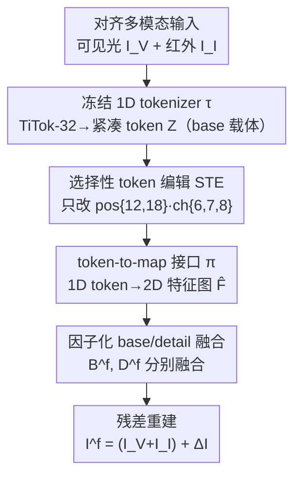

# From 2D Grids to 1D Tokens: Reforming Shared Representations for Multimodal Image Fusion

**会议**: ICML 2026  
**arXiv**: [2606.12303](https://arxiv.org/abs/2606.12303)  
**代码**: https://zju-xyc.github.io/1D-Fusion-Project-Page/ （项目页）  
**领域**: 图像融合 / 低层视觉  
**关键词**: 多模态图像融合, 1D token, 选择性 token 编辑, 全局/局部解耦, 红外可见光融合

## 一句话总结
多模态图像融合长期把共享表示放在二维特征网格上，导致全局外观（亮度/对比度/色调）和局部细节纠缠、难以独立调控；本文把"全局外观"挪到一个冻结的 1D tokenizer（TiTok-32）的紧凑 token 空间里，再用"选择性 token 编辑（STE）"只改少数几个 token-通道项来调控全局一致性，同时保留 2D 通路做细节恢复，在四个基准上取得多指标全面最优。

## 研究背景与动机
**领域现状**：多模态图像融合（MMIF，如红外-可见光、医学多模态）要把不同传感器的互补信息合成一张图，既要保住局部细节（纹理、边缘、结构），又要让全局外观（整体亮度、对比度、感知色调）协调一致。主流方法走"编码器-融合-解码器"范式，把像素/patch 编码成一张**稠密 2D 特征网格** $\mathbf F^{(m)}\in\mathbb R^{h\times w\times d}$，在网格空间里做位置/邻域级的融合。

**现有痛点**：2D 网格擅长建模局部结构，却对"图像级全局外观"无能为力。问题在于全局外观因子（光照、对比度、色调）**天然不是按空间坐标索引的**——它本该是一个全图共享的低维变量，但在 2D 网格里只能通过"空间广播"隐式地散布到许多位置上。这就带来空间冗余，并把全局 base 和局部纹理、模态特有线索、残余噪声搅在一起，结果就是亮度不一致、细节模糊或伪影被放大。

**核心矛盾**：作者用一个潜因子抽象把这点写清楚——2D 网格里某位置的特征可近似为
$$\mathbf F^{(m)}_{ij}=\phi(\text{detail}^{(m)}_{ij})+A\,\text{base}^{(m)}+\epsilon_{ij}$$
其中 $\phi(\cdot)$ 是局部细节编码、$A$ 把 base 因子线性广播到各空间位置、$\epsilon_{ij}$ 是位置相关残差。可见 base 不是独立变量，而是被空间广播后和 detail、残差纠缠在一起。**要从这样一个高维空间场里估计/对齐一个低维全局因子，本身就是不稳定的**：统计上对位置残差敏感（统计低效），优化上是个多对一的逆问题（病态、对分布漂移敏感）。

**本文目标 / 切入角度**：受紧凑图像 tokenization（如 TiTok 用 32 个 token 表示一张图）启发，作者主张把"全局外观"从 2D 网格里搬出来，放进一个**非空间的 1D token 接口**专门承载，而把局部细节留给 2D 通路。

**核心 idea**：用一个冻结的预训练 1D tokenizer 充当全局 base 的紧凑可控载体，再用"选择性 token 编辑"只动其中少数 token-通道，就能轻量地调控全局外观一致性，不改融合骨干、不加复杂损失。

## 方法详解

### 整体框架
框架把"全局外观"与"局部细节"在表示层就分开承载。对齐后的多模态输入（可见光 $I^{\mathcal V}$、红外 $I^{\mathcal I}$）先各自过一个**冻结的 1D tokenizer** $\tau$，得到紧凑 token 序列 $\mathbf Z^{(m)}\in\mathbb R^{N\times d_t}$ 作为 base 接口；STE 在 token 空间里稀疏编辑少数关键 token；随后**token-to-map 接口** $\pi$ 把 1D token 映射回 2D 特征图 $\hat{\mathbf F}^{(m)}$，进入私有编码器拆成 base/detail 两路、分别融合，最后用残差重建生成融合图。关键是：这个改动只局限在"表示层"，**完全不破坏成熟 2D 融合骨干在细节建模上的优势**。

### 关键设计

**1. 以 1D token 取代 2D 网格作为共享表示：给全局外观一个独立紧凑的载体**

这一步直接对症"base 在 2D 网格里被空间广播、纠缠、难估计"的痛点。作者用 1D 图像 tokenizer $\tau$ 把每个模态映成 $\mathbf Z^{(m)}=\tau(I^{(m)})$，这里实例化为冻结的预训练 **TiTok**，用极少的 token（$K{=}32$）承载全图外观。与 2D 网格不同，1D token 空间是**非空间**的：全局因子（光照、对比度、感知色调）可以用很少的自由度被访问和调控，而不必协调成千上万个空间位置。作者特别澄清：他们并不主张 1D tokenizer 是更强的重建骨干或语义编码器，**只是利用它紧凑可控的组织方式来调控非局部因子**，细节仍交给 2D 通路。

**2. 选择性 token 编辑（STE）：只动几个外观敏感的 token-通道来调外观**

在高度压缩的 1D 表示里，并非每个 token 贡献均等——主体内容对局部扰动鲁棒，而全局外观属性往往集中在少数几个 token 位置。STE 据此只稀疏编辑一小撮 token 项，就能提升锐度和外观一致性而不扰动核心语义。它**不靠人工指定编辑位置**，而是用离线 Gumbel-Softmax 探测：对每个编辑槽 $s$ 维护选择 logits $\mathbf a_s\in\mathbb R^K$，按
$$\mathbf y_s=\operatorname{softmax}\!\Big(\frac{\mathbf a_s+\mathbf g_s}{\tau_g}\Big),\quad p_s=\arg\max_k y_{s,k}$$
（$\mathbf g_s\sim\operatorname{Gumbel}(0,1)$）选出 token 位置，并用边缘强度 EI、平均梯度 AG、空间频率 SF、结构相似度 SSIM 等指标评估扰动后的融合输出。在 TiTok-32 配置下，探测**稳定地**指认出位置 $\{12,18\}$ 为最有效的外观敏感槽、通道 $\{6,7,8\}$ 为最稳定的编辑组。确定位置/通道后，STE 把人工扰动换成一个紧凑可学习偏置：
$$\widetilde{\mathbf Z}=\mathbf Z+\mathbf M\odot\Delta$$
二值掩码 $\mathbf M$ 只在位置 $\{12,18\}$ 的通道 $\{6,7,8\}$ 处激活、其余为零，$\Delta$ 是可学习偏置。由于只改极少 token-通道项，STE 是一个**即插即用**的轻量外观调控件，与任意 2D 融合骨干兼容。作者强调位置 12、18 是 TiTok-32 下"配置特定"的槽位，而非 tokenizer 的通用语义标签。

**3. Token-to-Map 接口 + 因子化 base/detail 融合：把 1D 全局接回 2D 细节生态**

1D token 适合扛全局语义，但成熟融合模块都建在 2D 特征图上。token-to-map 接口 $\pi$ 负责"表示适配"——把 token 序列映成 token 诱导的 2D 特征图 $\hat{\mathbf F}^{(m)}=\pi(\mathbf Z^{(m)})$（注意它区别于标准编码器直接产出的 2D 网格：全局语义仍主要留在 token 空间，2D 图只作局部处理的操作衬底）。$\pi$ 用分层映射：先把 token 维度从 12 升到 64，线性映成 $32\times32$ 粗图并配 $3\times3$ 卷积的残差局部聚合分支，再做三级上采样恢复到 $256\times256$，每级上采样都融入从原图抽取、尺度对齐的细节特征（卷积核分别 $7\times7$、$5\times5$、$3\times3$），以此抑制早期结构性伪影、又避免纯上采样的过平滑。在此之上，私有编码器 $E_{\mathrm{pri}}$ 把 $\hat{\mathbf F}^{(m)}$ 拆成 base $B^{(m)}$（低频全局外观）与 detail $D^{(m)}$（高频局部结构），并在两个子空间**分别融合**：$B^f=\mathcal F_{\text{base}}(B^{\mathcal V},B^{\mathcal I})$、$D^f=\mathcal F_{\text{detail}}(D^{\mathcal V},D^{\mathcal I})$，从而把 base 对齐与 detail 保持解耦，缓解 2D 网格里外观-细节纠缠带来的不稳定。

### 损失函数 / 训练策略
采用**两阶段训练、tokenizer 全程冻结**（防止共享表示在优化中漂移、保证 base 始终由紧凑 token 空间承载）。
- **阶段 I（重建热身 / 因子化稳定）**：关闭跨模态融合，各模态做内重建。重建损失 $\mathcal L_{\text{rec}}^{(m)}=\alpha_{\text{ssim}}\mathcal L_{\text{SSIM}}+\alpha_{\text{mse}}\|I^{(m)}-\hat I^{(m)}\|_2^2$，前者保结构、后者稳像素。再加分解正则 $\mathcal L_{\text{decomp}}=\frac{\mathrm{cc}(D^{\mathcal V},D^{\mathcal I})^2}{\delta+\mathrm{cc}(B^{\mathcal V},B^{\mathcal I})}$（$\mathrm{cc}$ 为相关系数），鼓励 detail 多样、base 一致。
- **阶段 II（跨模态融合）**：激活 base/detail 融合模块，最终残差重建 $I^f=I^{\text{ref}}+\Delta I$，其中参考输入 $I^{\text{ref}}=I^{\mathcal V}+I^{\mathcal I}$。融合损失 $\mathcal L_{\text{fusion}}=\alpha_{\text{in}}\|I_{\max}-I^f\|_1+\alpha_{\text g}\|G_{\max}-\nabla I^f\|_1$（$I_{\max}$、$G_{\max}$ 为输入强度图/梯度图的逐元素最大），并保留分解正则维持因子化一致性。

## 实验关键数据

### 主实验
在 $\text{M}^3\text{FD}$、RoadScene、TNO、Harvard 四个常用基准上用 EN（熵）、SD（标准差）、SCD、SSIM 等指标做定量对比（值越大越好），并验证目标检测、语义分割两个下游任务。下表摘录 $\text{M}^3\text{FD}$ 与 TNO 上的对比（本文 = Ours）：

| 数据集 | 指标 | CDDFuse | Text-DiFuse | EMMA | Ours |
|--------|------|---------|-------------|------|------|
| $\text{M}^3\text{FD}$ | EN | 6.80 | 6.93 | 6.78 | **7.19** |
| $\text{M}^3\text{FD}$ | SD | 35.22 | 39.87 | 35.12 | **47.35** |
| $\text{M}^3\text{FD}$ | SCD | 1.62 | 1.16 | 1.45 | **1.85** |
| $\text{M}^3\text{FD}$ | SSIM | 1.02 | 1.22 | 0.92 | **1.49** |
| TNO | EN | 7.17 | 7.28 | 7.27 | **7.34** |
| TNO | SD | 48.49 | 50.04 | 48.92 | **50.97** |
| TNO | SSIM | 1.08 | 0.35 | 1.01 | **1.42** |

可以看到本文在大多数指标上取得最优，SD（对比度/信息量）与 SSIM（结构保真）的提升尤其明显，印证了"全局外观调控 + 局部细节保持"的双重收益。

### 下游与消融

| 验证维度 | 设置 | 关键结论 |
|----------|------|----------|
| 目标检测 | $\text{M}^3\text{FD}$，mAP | 融合质量直接影响检测，本文优于 CDDFuse（mAP 0.346）等基线 ⚠️ Ours 具体数值以原文表 2 为准 |
| 语义分割 | FMB，mIoU | 同上，CDDFuse mIoU 0.684 作为参照 ⚠️ 以原文为准 |
| STE 探测 | TiTok-32 | 稳定指认位置 {12,18}、通道 {6,7,8} 为外观敏感/最稳定编辑组 |

### 关键发现
- **把 base 从 2D 网格挪到 1D token 是涨点主因**：SD 和 SSIM 的大幅提升说明全局外观（亮度/对比度一致性）和结构保真同时改善，正对应方法动机——解开了 2D 网格里 base 与 detail 的纠缠。
- **极简干预即可奏效**：STE 只编辑约 $2\times3=6$ 个 token-通道项、不引入复杂损失，就能稳定提升锐度、降低伪影，说明全局外观确实高度集中在少数 token 上。
- **冻结 tokenizer 很关键**：全程冻结防止共享表示漂移，保证 base 始终由紧凑 token 承载；两阶段训练先稳因子化、再做融合。

## 亮点与洞察
- **重新审视"共享表示的载体"**：本文最"啊哈"之处不是又设计一个融合模块，而是指出 MMIF 的瓶颈在"2D 网格不适合承载非空间的全局外观因子"，并用一个冻结 1D tokenizer 把全局/局部物理地分开承载——这是个表示层而非模块层的洞见。
- **把 tokenizer 当"接口"而非"骨干"**：不让 1D tokenizer 去重建全部高频细节，只用它紧凑可控的组织调全局，规避了 1D tokenizer 重建能力不如稠密网格的短板，是个很务实的分工。
- **可迁移思路**：用 Gumbel-Softmax 探测"哪些 token/通道控全局外观"再做稀疏可学习编辑，这套"探测敏感槽 + 稀疏编辑"范式可迁移到其他需要在压缩表示里做可控编辑的任务（如可控生成、图像编辑、风格调控）。

## 局限与展望
- **强依赖特定 tokenizer 配置**：位置 {12,18}、通道 {6,7,8} 是 TiTok-32 下探测出的"配置特定"槽位，换 tokenizer 或压缩率就要重新探测，通用性受限。
- **自己发现的局限**：1D token 只承载全局 base、细节仍靠 2D 通路与原图细节注入，若 tokenizer 丢失关键结构，token-to-map 也难以凭空补回；下游检测/分割的 Ours 具体数值在缓存中被截断，需以原文表 2 为准；方法主要在红外-可见光与医学融合上验证，对更多模态组合的普适性有待检验。
- **改进思路**：让外观敏感槽随输入/任务自适应选择、或把 STE 推广到可学习数量的编辑槽，可能进一步提升鲁棒性与可控性。

## 相关工作与启发
- **vs 稠密 2D 网格融合 (CDDFuse, DenseFuse, SwinFusion)**：它们在 2D 特征图上融合、靠 CNN/Transformer 建模上下文，但全局外观始终和局部细节纠缠、难以显式定位调控；本文把全局外观搬到 1D token 专门承载，从表示层解开纠缠。
- **vs 压缩 tokenizer (TiTok, FlexTok)**：前者把 1D token 当作极致压缩的重建/生成表示；本文反其道，把 tokenizer 当**固定接口**，研究如何选择性操纵少数 token/通道来提升下游融合质量，而非用它做重建骨干。
- **vs 文本/扩散引导融合 (Text-IF, Text-DiFuse, DDFM)**：它们靠外部文本或扩散先验调外观，本文则用内生的、可探测的 token 槽位做轻量可学习编辑，不依赖额外模态或复杂损失。

## 评分
- 新颖性: ⭐⭐⭐⭐⭐ "共享表示载体从 2D 网格换成 1D token"是 MMIF 里少见的表示层视角，STE 探测+稀疏编辑也很新。
- 实验充分度: ⭐⭐⭐⭐ 覆盖四基准 + 两下游，多指标全面对比；下游 Ours 具体数值在缓存中被截断、略影响完整性。
- 写作质量: ⭐⭐⭐⭐ 动机用潜因子抽象推导得很清楚，方法分工讲得明白。
- 价值: ⭐⭐⭐⭐ 轻量即插即用、不改骨干不加损失，对图像融合社区实用且有启发性。

<!-- RELATED:START -->

## 相关论文

- [\[CVPR 2026\] Degradation-Robust Fusion: An Efficient Degradation-Aware Diffusion Framework for Multimodal Image Fusion in Arbitrary Degradation Scenarios](../../CVPR2026/image_restoration/degradation-robust_fusion_an_efficient_degradation-aware_diffusion_framework_for.md)
- [\[CVPR 2026\] Physically-Grounded Turbulence Mitigation with Frame-Shared Degradation Parameters](../../CVPR2026/image_restoration/physically-grounded_turbulence_mitigation_with_frame-shared_degradation_paramete.md)
- [\[CVPR 2026\] MMDIR: Multimodal Instruction-Driven Framework for Mixed-Degradation Document Image Restoration](../../CVPR2026/image_restoration/mmdir_multimodal_instruction-driven_framework_for_mixed-degradation_document_ima.md)
- [\[CVPR 2026\] The Surprising Effectiveness of Noise Pretraining for Implicit Neural Representations](../../CVPR2026/image_restoration/the_surprising_effectiveness_of_noise_pretraining_for_implicit_neural_representa.md)
- [\[CVPR 2026\] FusionRegister: Every Infrared and Visible Image Fusion Deserves Registration](../../CVPR2026/image_restoration/fusionregister_every_infrared_and_visible_image_fusion_deserves_registration.md)

<!-- RELATED:END -->
