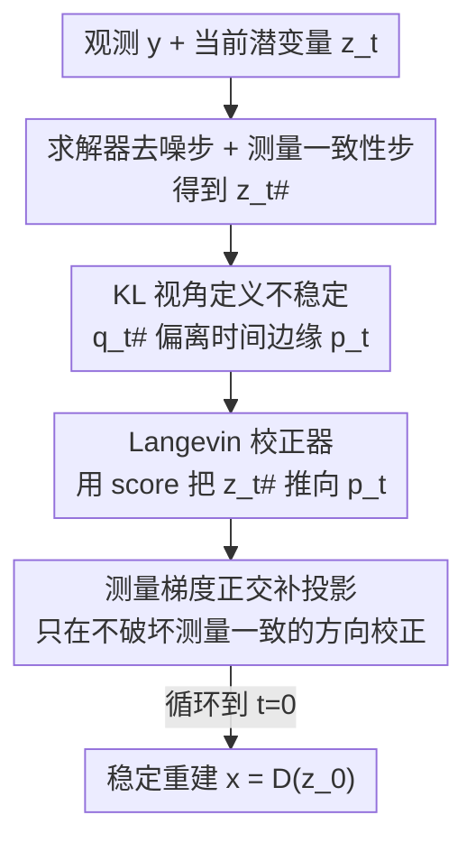

# Measurement-Consistent Langevin Corrector for Stabilizing Latent Diffusion Inverse Problem Solvers

**会议**: ICML 2026  
**arXiv**: [2601.04791](https://arxiv.org/abs/2601.04791)  
**代码**: 待确认  
**领域**: 扩散模型 / 图像复原 / 逆问题求解  
**关键词**: 潜空间扩散, 逆问题, Langevin 校正, 测量一致性, 即插即用

## 一句话总结
本文把潜空间扩散逆问题求解器（LDM solver）的不稳定性重新解释为"求解器动力学偏离扩散模型学到的时间边缘分布"，并提出即插即用的 MCLC 模块——在测量一致性步之后插入一步限制在测量梯度正交补空间上的 Langevin 校正，把潜变量拉回稳定的反向扩散轨迹，同时不破坏测量保真度，在 FFHQ/ImageNet 多种线性与非线性退化任务上稳定地提升了 LDPS、PSLD、ReSample 等基线。

## 研究背景与动机

**领域现状**：逆问题（去模糊、超分、修复等）的目标是从带噪、不完整的观测 $y = A(x) + n$ 中恢复原信号 $x$。这是经典的病态问题，必须依赖先验。如今扩散模型作为强大的数据驱动先验被广泛用于逆问题求解：从贝叶斯视角看，后验梯度 $\nabla_x \log p(x|y) = \nabla_x \log p(y|x) + \nabla_x \log p(x)$ 可以拆成测量似然项和先验项，把似然梯度注入扩散采样过程，就得到"测量一致的后验采样器"。为了把扩散模型扩展到大规模数据，潜空间扩散模型（LDM）在预训练自编码器的潜空间里建模，于是出现了一批 LDM-based 逆问题求解器（PSLD、ReSample、LatentDAPS 等）。

**现有痛点**：LDM 求解器频繁出现**不稳定**——测量一致性步会把采样路径推离数据流形，导致重建出现伪影、保真度下降（论文 Fig.1 第一行展示了 PSLD 反向轨迹里明显的杂乱潜变量）。

**核心矛盾**：以往工作把这种不稳定理解成"脱离流形（off-manifold）"，并依赖**强线性流形假设**——把扩散流形局部近似为线性，然后设计"保流形"的投影方法（如用自编码器投影、对梯度做投影）。问题是：即使原始像素空间满足线性流形假设，由于解码器 $D$ 高度非线性，这个性质**无法传递到潜空间**，所以这套假设在潜空间里根本不成立，保流形方法仍然不稳定。

**本文目标**：找到一个不依赖线性流形假设、且对潜空间天然成立的稳定化机制，既要把求解器拉回稳定动力学，又不能破坏逆问题最核心的测量保真度。

**切入角度**：扩散模型的训练目标本身就是让反向过程匹配前向过程诱导的一族时间边缘分布 $\{p_t\}$。因此这些时间边缘分布提供了一个**具体、可测量**的"稳定反向动力学"参照系。作者用 KL 散度去量化"求解器诱导的时间演化分布 $q_t^{\#}$"与"扩散模型学到的 $p_t$"之间的差距（Fig.2 显示 naive 求解器存在明显 KL gap），并把不稳定直接定义为这个差距。

**核心 idea**：用"缩小求解器动力学与扩散时间边缘分布之间的 KL 差距"代替"保持流形几何"，并通过一步**约束在测量梯度正交补上的 Langevin 校正**来缩小差距而不动测量一致性。

## 方法详解

### 整体框架
MCLC（Measurement-Consistent Langevin Corrector）是一个**插在已有 LDM 求解器每个时间步之后**的校正模块，不改动原求解器，因此是即插即用的。一个时间步的流程是：① 求解器先做常规的去噪步 + 测量一致性步，得到测量一致的潜变量 $z_t^{\#}$；② MCLC 把 $z_t^{\#}$ 当作起点，做一步（或几步）Langevin 更新，用扩散模型估计的 score $s_\theta$ 把潜变量往稳定时间边缘 $p_t$ 推；③ 关键是把这步 Langevin 更新**投影到测量梯度的正交补空间**，使得校正只在"不影响测量一致性"的方向上发生。三步循环到 $t=0$ 得到重建。

整套方法的逻辑链是"先量化不稳定（KL）→ 用 Langevin 收敛性证明校正能缩小 KL → 发现裸 Langevin 会破坏测量一致 → 用正交投影修正"，下图按这个流向给出框架。

### 关键设计

**1. 用 KL 散度把"不稳定"显式定义成偏离时间边缘分布**

以往"脱离流形"的说法依赖几何假设、难以度量，作者换成一个可测量的参照：扩散模型训练时就是最小化 $\mathbb{E}_{t}[D_{KL}(q_t \| p_t)]$，所以每个时间步都有一个学到的稳定边缘 $p_t$。本文把求解器在测量引导下诱导的时间演化分布记作 $q_t^{\#}$，并提出 Assumption 3.1：$D_{KL}(q_t^{\#} \| p_t) \ge \gamma_t > 0$，即测量一致性步必然让分布偏离稳定边缘。Fig.2 用 KL 曲线证实了这个 gap 的存在。这个定义的好处是把"稳定"从模糊的流形几何变成"让 $q_t^{\#}$ 贴近 $p_t$"这一可优化目标，后续所有设计都围绕缩小这个 KL 展开，因此动机非常具体——不是泛泛地"对齐分布"，而是对齐扩散训练目标本身定义的那一族 $p_t$。

**2. Langevin 校正器：用扩散 score 把潜变量拉回稳定边缘**

既然不稳定 = 偏离 $p_t$，最直接的办法是在测量一致性步之后插一步 Langevin 校正。Proposition 3.2 给出理论依据：以 $p_t$ 为冻结目标的连续 Langevin 过程 $dZ_t^c = \nabla \log p_t(Z_t^c)\,dc + \sqrt{2}\,dW_c$，其分布到 $p_t$ 的 KL 沿过程单调不增，$D_{KL}(q_t^c \| p_t) \le D_{KL}(q_t^{\#} \| p_t)$。实现上用 Euler–Maruyama 离散化：

$$z_t^c \leftarrow z_t^{\#} + \eta_t\, \nabla \log p_t(z_t^{\#}) + \sqrt{2\eta_t}\,\epsilon,\quad \epsilon \sim \mathcal{N}(0, I)$$

其中 score $\nabla \log p_t$ 直接由预训练扩散模型给出，$z_t^{\#}$ 是测量一致性步后的潜变量。作者特别强调：校正器修的是"测量一致性步引入的分布偏差"，而**不是**离散化数值误差——只要步长足够小，Langevin 离散化仍保持 KL 递减性质（差一个离散化误差项）。

**3. 正交补投影：校正时不破坏测量一致性**

裸 Langevin 更新有个致命问题（Remark 3.3）：它会扰动测量一致性 $r(z_t) := L(z_t, y)$。对 $r$ 做一阶 Taylor 展开 $r(z_t + \Delta z_t) \approx r(z_t) + \nabla_{z_t} r(z_t)\, \Delta z_t$，一般情况下一阶项 $\nabla_{z_t} r(z_t)\,\Delta z_t \ne 0$，即校正会把好不容易满足的测量一致性给搅乱。MCLC 的修法是把每一步 Langevin 更新**投影到测量梯度的正交补空间**：

$$z_t^c \leftarrow z_t^{\#} + \eta_t \cdot P_{\perp g_t}\, s_\theta(z_t^{\#}, t) + \sqrt{2\eta_t}\cdot P_{\perp g_t}(\epsilon)$$

其中 $g_t := \frac{\nabla_{z_t} r(z_t)}{\|\nabla_{z_t} r(z_t)\|}$ 是归一化的测量梯度方向，$P_{\perp g} = (I - g g^T)$ 把任意向量投到 $g$ 的正交补。这样一来漂移项和噪声项都不含测量梯度方向的分量，使得一阶项 $\nabla_{z_t} r(z_t)\,\Delta z_t = 0$，测量一致性在一阶意义上被完全保住。Theorem 3.4 进一步证明：即便考虑高阶项，只要 $\mathbb{E}[\|\Delta z_t\|^2] \le k < 1$，测量一致性扰动也被 $\mathbb{E}[\Delta r] \le Ck + O(k)$ 控制住，而 $k$ 由步长 $\eta_t$ 控制，于是可以通过选 $\eta_t$ 在"缩小 KL"和"保住测量一致"之间取得可控的平衡。论文还据此给出一个维度相关的步长上界，并报告单一超参设置能跨任务/退化算子/求解器泛化。

### 损失函数 / 训练策略
MCLC 是**纯推理时**的即插即用模块，不引入任何训练，直接复用预训练扩散模型的 score 网络。需要调的只是 Langevin 步长 $\eta_t$ 和校正步数，用来平衡数据保真、稳定性与计算开销——作者强调这种逐任务调参是逆问题本身固有的（不同退化程度需要不同设置），并非本方法独有，且实验显示单一设置已能良好泛化。

## 实验关键数据

### 主实验
在 FFHQ 与 ImageNet 上评测，把 MCLC 插入 LDPS、PSLD、ReSample、LatentDAPS 四个基线，覆盖高斯去模糊、运动去模糊、4× 超分等线性与非线性任务，并与 DiffStateGrad（DiffState）对比。指标含 PSNR↑、LPIPS↓、FID↓、P-FID↓。整体上 MCLC 在感知指标（LPIPS/FID/P-FID）上提升最显著。

| 任务 | 基线 | 方法 | FFHQ LPIPS↓ | FFHQ FID↓ | FFHQ P-FID↓ | ImageNet FID↓ |
|------|------|------|------|------|------|------|
| 高斯去模糊 | LDPS | Base | 0.349 | 100.10 | 93.55 | 120.79 |
| 高斯去模糊 | LDPS | **Ours** | **0.303** | **80.83** | **54.74** | **103.87** |
| 高斯去模糊 | PSLD | Base | 0.314 | 89.18 | 90.54 | 104.86 |
| 高斯去模糊 | PSLD | **Ours** | **0.286** | **66.28** | **59.13** | **92.74** |
| 运动去模糊 | PSLD | Base | 0.343 | 106.34 | 102.60 | 141.67 |
| 运动去模糊 | PSLD | **Ours** | **0.308** | **74.64** | **60.05** | **99.21** |
| 运动去模糊 | LDPS | **Ours** | 0.318 | 82.94 | **55.55** | 119.65 |

可以看到，运动去模糊这类强退化任务上提升尤为夸张：PSLD+MCLC 在 FFHQ 上 P-FID 从 102.60 降到 60.05，FID 从 106.34 降到 74.64。

### 消融 / 兼容性分析
MCLC 的核心是"两步合一"——既要 Langevin 校正缩小 KL，又要正交投影保住测量一致，二者缺一不可。

| 配置 | 效果 | 说明 |
|------|------|------|
| Base（无校正） | 不稳定、有伪影 | $q_t^{\#}$ 与 $p_t$ 存在显著 KL gap（Fig.2 红线） |
| + 裸 Langevin 校正 | 缩小 KL 但破坏测量一致 | Remark 3.3：一阶项 $\nabla r \cdot \Delta z \ne 0$ |
| + 正交补投影（完整 MCLC） | KL gap 收窄且保真 | Fig.2 紫线明显贴近 0，重建更干净 |

### 关键发现
- **正交投影是不破坏保真的关键**：直接做 Langevin 会扰动测量一致性，只有投到测量梯度正交补上才能"既校正又不动 $y$ 的拟合"——这是 MCLC 区别于普通 corrector 的核心。
- **感知质量提升大于像素 PSNR**：MCLC 主要改善 LPIPS/FID/P-FID（去伪影、更结构化），PSNR 提升相对温和甚至偶有持平，说明它修的是"稳定性与感知质量"而非单纯逐像素拟合。
- **跨求解器即插即用**：对 LDPS/PSLD/ReSample/LatentDAPS 都能直接挂载并普遍受益，且单一超参设置跨任务泛化，体现了"基于 KL 的稳定化机制"比"逐方法的流形假设"更通用。
- **LatentDAPS 上提升不明显**：在部分任务上 LatentDAPS+MCLC 与 Base 接近，说明对本身已较稳定或动力学不同的求解器，KL gap 较小、校正收益有限。

## 亮点与洞察
- **重新定义"不稳定"**：把模糊的"脱离流形"换成"偏离扩散训练目标定义的时间边缘 $p_t$"，这是个可测量、可优化的定义，直接绕开了在潜空间失效的线性流形假设——这是全文最"啊哈"的视角转换。
- **正交补投影是可迁移的 trick**：在任何"既要往某目标方向走、又不能破坏某约束"的迭代采样里，都可以借鉴"把更新投到约束梯度正交补上"的做法，比如带硬约束的引导生成。
- **理论与实现对齐**：从 Langevin 收敛性（Prop 3.2）到测量一致性的可控扰动界（Thm 3.4），再到维度相关的步长上界，给出了一条完整的"为什么稳定且不破坏保真"的论证链，而非纯经验技巧。

## 局限与展望
- **校正引入额外计算开销**：每个时间步多做一步（或多步）Langevin 更新与投影，增加采样成本，作者也承认步长/步数需要权衡保真、稳定与开销。
- **超参仍需逐任务调**：虽然报告单一设置泛化良好，但论文坦言不同退化程度/测量算子下步长本质上需要调整（这是逆问题通病，但仍是实用障碍）。
- **保真提升以一阶 Taylor 为基础**：正交投影只在一阶意义上严格保住测量一致，高阶扰动靠步长上界控制；强非线性测量算子下高阶项可能不可忽略。
- **像素 PSNR 提升有限**：方法偏向改善感知/稳定性，对追求逐像素精度的科学成像场景收益可能不如感知任务明显。

## 相关工作与启发
- **vs 保流形方法（He et al. 2024 / Zirvi et al. 2025）**：他们在线性流形假设下用自编码器投影或梯度投影来防止脱离流形；本文指出该假设在高度非线性解码器导致的潜空间里失效，改用 KL/时间边缘视角，不依赖流形几何。
- **vs DiffStateGrad（DiffState）**：作为主要对比基线，DiffState 在多数任务上对感知指标改善有限甚至偶有退化；MCLC 在 LPIPS/FID/P-FID 上普遍优于它。
- **vs 普通 Langevin corrector（如 predictor-corrector 采样）**：标准 corrector 不考虑测量一致性，会扰动 $y$ 的拟合；MCLC 通过正交补投影专门保护测量一致性，是面向逆问题的 corrector 变体。

## 评分
- 新颖性: ⭐⭐⭐⭐⭐ 用 KL/时间边缘重定义不稳定、用正交补投影保测量一致，视角与机制都新颖
- 实验充分度: ⭐⭐⭐⭐ 覆盖 4 个求解器 × 多任务 × 两数据集，但提升集中在感知指标、PSNR 改善有限
- 写作质量: ⭐⭐⭐⭐ 理论链条清晰（Prop/Thm/Remark 层层递进），图示直观
- 价值: ⭐⭐⭐⭐⭐ 即插即用、跨求解器通用，对潜空间逆问题稳定化有实际工程价值

<!-- RELATED:START -->

## 相关论文

- [\[CVPR 2026\] Outlier-Robust Diffusion Solvers for Inverse Problems](../../CVPR2026/image_restoration/outlier-robust_diffusion_solvers_for_inverse_problems.md)
- [\[ICML 2026\] Consistent Diffusion Language Models](consistent_diffusion_language_models.md)
- [\[ICML 2026\] Coevolutionary Continuous Discrete Diffusion: Make Your Diffusion Language Model a Latent Reasoner](coevolutionary_continuous_discrete_diffusion_make_your_diffusion_language_model_.md)
- [\[ICML 2026\] PODiff: Latent Diffusion in Proper Orthogonal Decomposition Space for Scientific Super-Resolution](podiff_latent_diffusion_in_proper_orthogonal_decomposition_space_for_scientific_.md)
- [\[CVPR 2026\] Dual Ascent Diffusion for Inverse Problems](../../CVPR2026/image_restoration/dual_ascent_diffusion_for_inverse_problems.md)

<!-- RELATED:END -->
