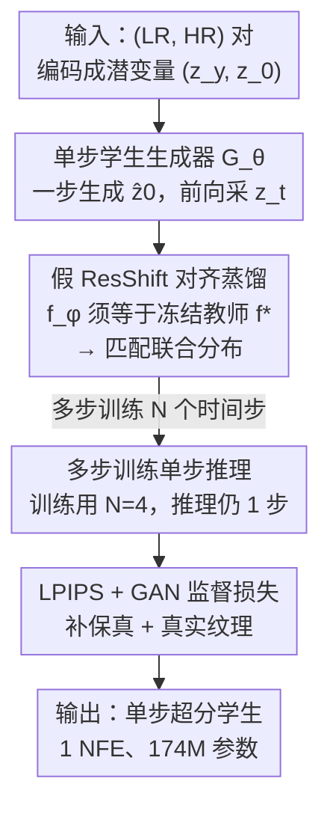

# One-Step Residual Shifting Diffusion for Image Super-Resolution via Distillation

**会议**: ICML2026  
**arXiv**: [2503.13358](https://arxiv.org/abs/2503.13358)  
**代码**: https://github.com/Daniil-Selikhanovych/RSD  
**领域**: 图像超分辨率 / 图像恢复  
**关键词**: 真实图像超分, 扩散蒸馏, 单步推理, ResShift, 假模型对齐

## 一句话总结
针对扩散超分模型推理慢的问题，本文提出 RSD（Residual Shifting Distillation）：把 15 步的 ResShift 教师蒸馏成**单步**学生生成器，方法核心是「训练学生使得用它的输出再训出来的一个『假 ResShift』恰好等于真教师」——这等价于匹配教师与学生在所有时间步上的**联合分布**（而非 VSD 那样只匹配边缘）；结果在 LPIPS / CLIPIQA / MUSIQ 上反超教师、超过同类蒸馏方法 SinSR，并以仅 174M 参数、0.5GB 显存、5 GPU·小时训练逼近大体量 T2I 超分模型的感知质量。

## 研究背景与动机
**领域现状**：真实世界盲超分（Real-ISR）要从未知复杂退化的低分辨率图重建高分辨率图，是高度病态的逆问题。扩散模型（DM）因能建模复杂分布、感知质量高于 GAN，成为强力方案；其中 ResShift 把扩散起点放在「加噪的 LR 图」上、只需 15 次去噪（NFE）就拿到优于 GAN/Transformer 的感知效果。

**现有痛点**：但 ResShift 推理仍比 GAN 慢约 10×。已有两条提速路线都不理想：(1) **SinSR** 用确定性采样把 ResShift 蒸成 1 步，却**产生模糊**、丢失真实感知细节；(2) **OSEDiff** 等把预训练文生图（T2I）模型用 LoRA + 变分得分蒸馏（VSD）压成 1 步，感知质量好，但**参数量是 SinSR 的 2.5–10×**、训练 / 推理昂贵，且 PSNR/SSIM 等保真指标偏低、容易**幻觉**出不存在的结构（如把熊猫鼻子、屋顶细节脑补错）。

**核心矛盾**：在 Real-ISR 上，「单步快、感知真、又轻量」三者难以兼得——SinSR 轻量但模糊，OSEDiff 感知好但臃肿幻觉。根因在于蒸馏目标本身：SinSR 的知识蒸馏只逼学生匹配教师轨迹，OSEDiff 的 VSD 只对齐**每个时间步的边缘分布**，都没有从「学生生成的数据分布是否真的等于真实数据分布」这个更本质的角度对齐。

**本文目标**：能否融合 SinSR（轻量、低成本）与 OSEDiff（高感知）两者之长，做出一个单步、感知质量逼近 T2I 超分、训练 / 推理成本又像 SinSR 那么低的扩散超分模型？

**切入角度**：作者沿用 ResShift 良好的感知 - 失真权衡，并借鉴「训练一个辅助『假模型』来度量分布差异」的图到图蒸馏思路（DMD2、IBMD），把蒸馏目标从「对齐轨迹/边缘」改成「对齐联合分布」。

**核心 idea**：训练单步学生 $G_\theta$，使得**在它输出的图像上重新训练出来的一个 ResShift（称为「假 ResShift」）会恰好与真教师 $f^*$ 重合**——若假模型 ≈ 真教师，则学生生成的 (LR, HR) 分布就 ≈ 真实数据分布。

## 方法详解

### 整体框架
RSD 要解决的是「把 15 步 ResShift 教师压成 1 步学生、且不掉感知质量」。输入是 (LR, HR) 图像对 $(y_0, x_0)$，输出是一个单步随机生成器 $G_\theta$：给定 LR 图与噪声即可一步出高清图 $\widehat{x}_0=G_\theta(x_T, y_0, \epsilon)$。

整套训练在 ResShift 的潜空间里跑：先把 (LR, HR) 对编码成潜变量 $(z_y, z_0)$；学生 $G_\theta$ 一步生成 $\widehat{z}_0$，再按 ResShift 前向过程采出含噪 $z_t$；这个 $z_t$ 同时喂给**真教师 ResShift $f^*$**（冻结）和一个**可训练的「假 ResShift」$f_\phi$**，由两者算出蒸馏损失 $L_\theta$（推学生）与假模型损失 $L_{\text{fake}}$（推 $f_\phi$）；额外再叠加 LPIPS 感知损失与 GAN 损失来补足保真与真实纹理。三方（学生 $G_\theta$、假模型 $f_\phi$、判别器）交替优化，收敛后只保留单步学生用于推理。

### 关键设计

**1. 假 ResShift 对齐：把蒸馏目标改成「联合分布匹配」并求出可解形式**

SinSR/VSD 的问题是只对齐轨迹或每步边缘。RSD 换了个更本质的目标：训练学生 $G_\theta$，使得**用它的输出重新训出来的 ResShift $f_{G_\theta}$ 等于真教师 $f^*$**。其依据是——若 $f_{G_\theta}\approx f^*$，则学生生成的 $(y_0,x_0)$ 分布就 $\approx$ 真实数据分布 $p_{\text{data}}(y_0,x_0)$。据此把目标写成 $L_\theta=\sum_t w_t\,\mathbb{E}\,\lVert f_{G_\theta}(x_t,y_0,t)-f^*(x_t,y_0,t)\rVert_2^2$（Eq. 9）。

但 $\nabla_\theta L_\theta$ 里含 $\nabla_\theta f_{G_\theta}$——要对「在学生数据上完整训一个 ResShift」反传，计算上不可行。本文的关键一步（Proposition 3.1）是给出**等价可解形式**：引入一个辅助「假 ResShift」$f_\phi$，让它用学生生成的数据按 ResShift 标准目标 $L_{\text{fake}}$ 训练，则 $L_\theta$ 可仅用 $f^*$、$f_\phi$ 和 $\widehat{x}_0$ 算出，绕开了对 $f_{G_\theta}$ 的反传。换句话说，「训练一个假 ResShift 去拟合学生输出」与「评估学生的蒸馏损失」是同一回事。作者进一步证明该损失等于教师与学生在**整条轨迹上的联合分布 KL**：$L_\theta=\mathbb{E}_{p(y_0)}D_{\text{KL}}\big(p(x_{0:T}|y_0)\,\Vert\,p^*(x_{0:T}|y_0)\big)$（Eq. 11）。这正是 RSD 与 VSD 的本质区别——VSD 只对齐**每个 $t$ 的边缘**，RSD 对齐**跨所有 $t$ 的联合**，因而能更完整地把教师分布迁给学生。

**2. 多步训练、单步推理：用 N 个时间步训练换取鲁棒性，推理仍只跑一步**

只在终点时间步 $T$ 训练学生，质量和稳定性有限。RSD 借鉴 DMD2/多步生成思路，固定一组 $N$ 个时间步 $1<t_1<\dots<t_N=T$，给 $G_\theta$ 加上时间条件，让它在每个 $t_n$ 都去逼近 $p_\theta(\widehat{x}_0|x_{t_n},y_0)\approx q(x_0|x_{t_n},y_0)$，用 Proposition 3.1 在所有 $t_n$ 上联合训练。**训练用多步、推理仍单步**：消融（Table 5）显示 $N$ 从 1 增到 15 时 PSNR 单调升、感知指标先升后降，作者取 $N=4$ 拿到最佳感知 - 失真权衡（LPIPS 0.355、MUSIQ 66.4，且 CLIPIQA 仍高）。这一招在不增加推理成本的前提下显著提升了单步学生的鲁棒性。

**3. LPIPS + GAN 监督损失：补足教师近似误差带来的保真与纹理缺口**

教师对 $x_0$ 的估计本身有近似偏差，纯蒸馏会继承这种偏差。RSD 再叠两个有监督损失：一是 **LPIPS 损失**（借鉴 OSEDiff），在感知特征空间比对学生输出与 HR 真值，超出教师指导地恢复纹理与结构细节（作者发现 OSEDiff 用的 MSE 损失在此设定下无帮助，遂弃用）；二是 **GAN 损失**（借鉴 DMD2），在假 ResShift 瓶颈特征上接一个小判别器头来更好匹配 HR 分布，但与 DMD2 比对「加噪数据 vs 生成输出的边缘」不同，RSD 在每个 $t_n$ 上比对 $p_{\text{data}}(x_0|y_0)$ 与 $p_\theta(\widehat{x}_0^{t_n}|y_0)$（Eq. 12）。最终每个 $t_n$ 的损失为 $L_\theta+\lambda_1 L_{\text{LPIPS}}+\lambda_2 L_{\text{GAN}}$（Eq. 13）；其中 $L_\theta$ 与 $L_{\text{GAN}}$ 在潜空间算（省去额外编解码），$L_{\text{LPIPS}}$ 在像素空间算（LPIPS 网络是在像素域训的）。消融（Table 6）显示：单加 LPIPS（$\lambda_1\neq0$）把 PSNR 24.92→26.01、LPIPS 0.355→0.271 大幅提升保真，代价是无参考感知指标略降，二者联用取得整体平衡。

### 损失函数 / 训练策略
总损失 $L_\theta+\lambda_1 L_{\text{LPIPS}}+\lambda_2 L_{\text{GAN}}$ 在每个采样时间步 $t_n$ 上施加，三方交替优化：学生 $G_\theta$、假模型 $f_\phi$（按 ResShift 标准目标 $L_{\text{fake}}$ 训练）、判别器头 $D$。RSD 是 **simulation-free** 方法——无需像 SinSR 那样在训练中跑教师全部 15 步采样，训练效率更高（论文称 SinSR 收敛约慢 3×）。

## 实验关键数据

### 主实验
在 RealSR、RealSet65、DRealSR、ImageNet-Test、DIV2K 上评测，与 GAN、ResShift、SinSR、CTMSR 及 T2I 类（OSEDiff/SUPIR/AdcSR/PiSA-SR/TSD-SR）对比。RSD 全程仅 1 NFE。

| 数据集 | 指标 | ResShift(教师,15步) | SinSR(1步) | OSEDiff(T2I,1步) | RSD (Ours,1步) |
|--------|------|--------------------|-----------|------------------|----------------|
| RealSR | LPIPS↓ | 0.360 | 0.365 | 0.299 | **0.273** |
| RealSR | CLIPIQA↑ | 0.596 | 0.689 | 0.677 | 0.706 |
| RealSR | MUSIQ↑ | 59.87 | 61.58 | 67.60 | 65.86 |
| RealSet65 | MUSIQ↑ | 61.33 | 62.17 | 68.85 | 69.17 |
| ImageNet | LPIPS↓ | 0.231 | 0.221 | 0.253 | （详见原文） |

要点：RSD 在 LPIPS / CLIPIQA / MUSIQ 等感知指标上**反超教师 ResShift**，并全面优于同为 ResShift 蒸馏的 SinSR；相比大体量 T2I 的 OSEDiff，感知质量相当（RealSet65 上 MUSIQ 还略高），却只用一小部分算力。「RSD (distill only)」（无监督损失）感知更激进但保真略低，「RSD (Ours)」（加 LPIPS+GAN）取得保真 - 感知平衡。

### 效率与消融

| 方法 | T2I 先验 | NFE | 推理时间(s) | 参数(M) | 峰值显存(MB) | 训练 |
|------|---------|-----|------------|---------|-------------|------|
| SUPIR | 是 | 50 | 17.704 | 4801 | 52535 | 240h / 64×A6000 |
| OSEDiff | 是 | 1 | 0.075 | 1775 | 3651 | 24h / 4×A100 |
| ResShift(教师) | 否 | 15 | 0.643 | 174 | 1167 | 110h / 1×A100 |
| SinSR | 否 | 1 | 0.060 | 174 | 570 | 60h / 1×A100 |
| **RSD (Ours)** | 否 | 1 | **0.059** | 174 | **539** | **5h / 4×A100** |

| 消融 (RealSR) | 配置 | PSNR↑ / LPIPS↓ | 说明 |
|--------------|------|---------------|------|
| 多步训练 $N$ | $N{=}1$ | 24.82 / 0.405 | 单步训练，感知偏弱 |
| 多步训练 $N$ | $N{=}4$ | 24.92 / 0.355 | **选用**，最佳感知-失真权衡 |
| 多步训练 $N$ | $N{=}15$ | 25.91 / 0.294 | PSNR 最高但 CLIPIQA 掉到 0.686 |
| 监督损失 | $\lambda_{1,2}{=}0$ | 24.92 / 0.355 | 纯蒸馏 |
| 监督损失 | 仅 $\lambda_1$ | 26.01 / 0.271 | 加 LPIPS，保真大涨 |

### 关键发现
- **联合分布对齐是涨点根源**：RSD 反超教师、超过 SinSR，源于把目标从 VSD 的边缘对齐换成联合分布 KL，更完整迁移教师分布。
- **轻量是结构性的**：RSD 沿用 ResShift 架构（174M），相比 T2I 类省 2.5–10× 参数、5× 以上显存，推理 0.059s，且 simulation-free 让训练只要 5 GPU·小时（SinSR 的约 1/12）。
- **多步训练 N 控制感知 - 失真权衡**：N 越大越保真（PSNR 升），但无参考感知指标先升后降，N=4 是甜点；推理始终单步，不增成本。

## 亮点与洞察
- **「假模型对齐」给出可解的联合分布蒸馏**：用一个随学生一起训练的假 ResShift $f_\phi$ 把不可反传的 $\nabla_\theta f_{G_\theta}$ 绕开，并证明等价于联合分布 KL——这把「数据分布是否匹配」这个本质目标变成了可优化的损失，是比 VSD 更干净的蒸馏视角。
- **训练多步 / 推理单步的解耦**很实用：用多时间步训练换鲁棒性，却不付任何推理代价，N 还能当感知 - 失真旋钮，工程上很好调。
- **在轻量教师上做到逼近大模型的感知质量**：证明不靠十亿参数 T2I 先验、只靠更好的蒸馏目标 + 监督损失，小体量 ResShift 也能打到 OSEDiff 级别感知，对端侧部署的超分很有启发。

## 局限与展望
- **受教师容量天花板约束**：RSD 轻量得益于 ResShift 框架，但也继承了 ResShift 的能力上限；作者指出换更强的 T2I 教师可进一步提升并支持更高分辨率，但那会牺牲当前的轻量优势。
- 训练涉及学生 + 假模型 + 判别器三方交替，外加 LPIPS/GAN 多项损失与 $\lambda_1,\lambda_2$ 权衡，调参复杂度高于纯知识蒸馏的 SinSR。
- 主实验 HR 裁剪用 256×256（对齐教师），与 OSEDiff 的 512×512 训练设定不完全可比，跨分辨率公平性需看附录补充。
- 失败案例（幻觉、严重退化下的细节）作者承认仍存在，细节推到 Appendix K，⚠️ 具体边界以原文为准。

## 相关工作与启发
- **vs SinSR（同为 ResShift 蒸馏）**：SinSR 用确定性知识蒸馏，1 步但模糊、丢感知细节，且训练要跑教师全 15 步采样；RSD 用假模型联合分布对齐，感知反超教师、simulation-free 训练快约 3×。
- **vs OSEDiff（T2I + VSD 蒸馏）**：OSEDiff 靠十亿参数 T2I 先验拿高感知，但参数 / 显存 / 训练成本大、PSNR 偏低且会幻觉；RSD 用 1/10 量级参数、5× 以上更省显存取得相当感知质量，且 RSD 的联合分布目标不同于 VSD 的边缘对齐。
- **vs IBMD（连续时间图到图蒸馏）**：RSD 是其离散时间版的针对性改造，作者称在 Real-ISR 感知指标与训练 / 推理成本上均显著优于 IBMD（Appendix A.3）。

## 评分
- 新颖性: ⭐⭐⭐⭐⭐ 把蒸馏目标从 VSD 边缘对齐升级为「假模型可解的联合分布 KL」，并给出 Proposition 证明，视角清晰且有理论支撑
- 实验充分度: ⭐⭐⭐⭐⭐ 五个数据集、感知 + 保真多指标、效率对照表、多步与监督损失双消融，覆盖全面
- 写作质量: ⭐⭐⭐⭐ 动机与方法推导扎实，但核心推导（Prop 3.1、KL 等价）较密、不少细节推到附录
- 价值: ⭐⭐⭐⭐⭐ 174M / 0.5GB / 5 GPU·小时就逼近大 T2I 超分质量，对实时与端侧 Real-ISR 落地价值高，代码开源

<!-- RELATED:START -->

## 相关论文

- [\[CVPR 2026\] One-Step Diffusion Transformer for Controllable Real-World Image Super-Resolution](../../CVPR2026/image_restoration/one-step_diffusion_transformer_for_controllable_real-world_image_super-resolutio.md)
- [\[CVPR 2026\] Time-Aware One Step Diffusion Network for Real-World Image Super-Resolution](../../CVPR2026/image_restoration/time-aware_one_step_diffusion_network_for_real-world_image_super-resolution.md)
- [\[CVPR 2026\] FiDeSR: High-Fidelity and Detail-Preserving One-Step Diffusion Super-Resolution](../../CVPR2026/image_restoration/fidesr_high-fidelity_and_detail-preserving_one-step_diffusion_super-resolution.md)
- [\[CVPR 2026\] IFCSR: Inference-Free Fidelity-Realism Control for One-Step Diffusion-based Real-World Image Super-Resolution](../../CVPR2026/image_restoration/ifcsr_inference-free_fidelity-realism_control_for_one-step_diffusion-based_real-.md)
- [\[CVPR 2026\] GDPO-SR: Group Direct Preference Optimization for One-Step Generative Image Super-Resolution](../../CVPR2026/image_restoration/gdpo-sr_group_direct_preference_optimization_for_one-step_generative_image_super.md)

<!-- RELATED:END -->
