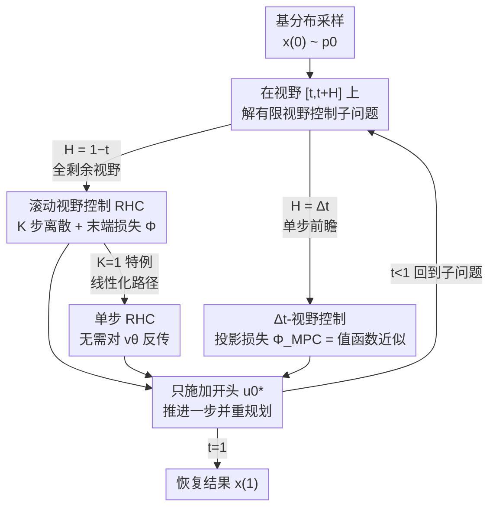

# Solving Inverse Problems with Flow-based Models via Model Predictive Control

**会议**: ICML 2026  
**arXiv**: [2601.23231](https://arxiv.org/abs/2601.23231)  
**代码**: https://github.com/alexdenker/MPCFlow  
**领域**: 扩散模型 / 图像恢复 / 逆问题求解  
**关键词**: 流匹配, 最优控制, 模型预测控制, 训练无关引导, 逆问题

## 一句话总结
把"用预训练流模型解逆问题"重新表述为**模型预测控制（MPC）**——不再一次性优化整条采样轨迹，而是在每个时间步只解一个短视野子问题、施加一步控制再重规划，从而在显著降低显存的同时，还能推导出一个**完全不需要对流模型反向传播**的变体，进而把训练无关引导扩展到量化后的 FLUX.2（32B）级别、在 24GB 消费级显卡上跑通。

## 研究背景与动机

**领域现状**：流匹配（Flow Matching）训练出的连续归一化流，已经成为高维数据生成的主力框架。它学到一个随时间变化的速度场 $v_\theta(\bm{x},t)$，通过求解 ODE $\frac{d\bm{x}(t)}{dt}=v_\theta(\bm{x}(t),t)$ 把简单基分布（高斯）变换到数据分布。除了无条件生成，人们更想借这套学好的动力学去解**逆问题**：从带噪测量 $\bm{y}=\mathcal{A}(\bm{x})+\bm{\epsilon}$ 中恢复信号 $\bm{x}$，其中 $\mathcal{A}$ 是可能非线性的前向算子。

**现有痛点**：主流的训练无关引导（training-free guidance）把数据保真项直接塞进生成动力学里去"推"轨迹，但这类启发式做法缺乏理论保证（比如对测量的一致性），数值上还容易不稳定。另一条更有原则的路线把条件采样建模成**确定性最优控制问题**（FlowGrad、OC-Flow），目标干净、保真度与先验一致性的权衡也更好——但代价是要对整条采样轨迹做轨迹优化，这意味着要么穿过 ODE 求解器反向传播（显存随步数线性增长），要么求解伴随方程（每次梯度都要正/反两条 ODE，运行时间翻倍）。

**核心矛盾**：最优控制视角"原则性强但算不动"，而启发式引导"算得动但没保证"。根因在于：全局最优控制把 $N$ 步轨迹的所有控制量 $\bm{u}_0,\dots,\bm{u}_{N-1}$ 当成一个整体一次性优化，求 $\bm{u}_k$ 的梯度需要 $N-k$ 次嵌套的流模型评估，对大模型完全不可行。

**本文目标**：在保留最优控制原则性（可证明性、可解释的正则化）的前提下，把它的计算/显存成本压到能跑大模型的程度，最好能去掉对流模型的反向传播。

**切入角度**：作者借用机器人与过程控制里成熟的**模型预测控制（MPC）**思想——不预测并执行整条轨迹，而是在每个时刻只在一个短视野上规划、只施加开头一小段、然后从新状态重规划。这种"滚动视野 + 反复重规划"天然把一个大优化拆成一串小优化，且重规划能纠正早期累积的误差。

**核心 idea**：把逆问题求解写成一串短视野控制子问题（MPC-Flow），并证明在两种极端视野设定下它都能复原全局最优控制；其中"单步视野"的特例可以解析地避开对 $v_\theta$ 的反传，使训练无关引导第一次扩展到 32B 级量化大模型。

## 方法详解

### 整体框架

出发点是把条件生成写成一个带控制项的最优控制问题：在原 ODE 上叠加一个控制 $\bm{u}(t)$，使末端状态满足条件，同时控制能量尽量小：

$$\min_{\bm{u}}\Big\{\int_0^1\|\bm{u}(t)\|_2^2\,dt+\lambda\,\Phi(\bm{x}(1))\Big\}\quad\text{s.t.}\quad\frac{d\bm{x}(t)}{dt}=v_\theta(\bm{x}(t),t)+\bm{u}(t).$$

其中积分项是**控制能量正则**（让轨迹别偏离预训练流太远，相当于一个由流模型诱导的"先验距离"正则子），末端损失 $\Phi(\bm{x})=\frac{1}{2\sigma^2}\|\mathcal{A}(\bm{x})-\bm{y}\|_2^2$ 编码逆问题的数据保真目标。直接离散化这个问题就是 FlowGrad/OC-Flow 的全局控制——昂贵且吃显存。

MPC-Flow 的整体流程是：从当前状态出发，在一个规划视野 $[t,t+H]$ 上解一个有限视野控制子问题，得到一段控制 $\bm{u}(\tau)$；**只施加开头 $\Delta t$ 那一小段**，把状态推进到下一步；然后把视野往前挪、从新状态**重新规划**，如此滚动直到 $t=1$。作者把这套框架按"视野长度 $H$"参数化出两个极端，并由此衍生一谱系的引导算法。整图见下：

### 关键设计

**1. 滚动视野控制（RHC）：用重规划换可证明的全局最优**

第一个极端是取视野 $H=1-t$，即每一步都在"剩下的全部时间" $[t,1]$ 上重新规划整条剩余轨迹（式 7），但只施加开头 $[t,t+\Delta t]$ 一段、再从更新后的状态重解。作者借助值函数 $V(t,\bm{x})=\inf_{\bm{u}_{[t,1]}}\{\int_t^1\|\bm{u}(\tau)\|^2 d\tau+\lambda\Phi(\bm{x}(1))\}$，由 Bellman 最优性原理证明了 **Theorem 3.1**：只要每步子问题都解到最优，RHC 施加的控制序列就**恰好等于全局最优控制** $\bm{u}^*$。这给了一个干净的理论锚点——MPC 不是对全局控制的妥协近似，而是它的等价分解。

可证明不等于算得动：在 $[t,1]$ 上解子问题原则上和原问题一样贵。RHC 的可行性来自**对剩余视野做粗离散**——把 $[t,1]$ 切成 $K$ 步（$t_k=t+k(1-t)/K$），用显式欧拉推进 $\bm{x}_{t_{k+1}}=\bm{x}_{t_k}+\frac{1-t}{K}[v_\theta(\bm{x}_{t_k},t_k)+\bm{u}(t_k)]$。妙处在于随 $t$ 增大剩余视野变短、有效步长自动变小，于是**临近末端时分辨率自然变细、早期则可以粗**。代价是当 $K>1$ 时，解子问题仍要穿过 $K-1$ 次嵌套的 $v_\theta$ 评估做反传，不适合实时部署。

**2. 单步 RHC（K=1）：线性化路径，彻底甩掉反向传播**

这是全文最实用的一招。把 RHC 的离散步数取到极限 $K=1$，等于用**单步欧拉**把剩余区间 $[t,1]$ 一口气走完，子问题塌缩为

$$\min_{\bm{u}\in\mathbb{R}^d}\Big\{(1-t')\|\bm{u}\|^2+\lambda\Phi(\bm{x}')\Big\},\quad \bm{x}'=\bm{x}+(1-t')(v_\theta(\bm{x},t')+\bm{u}).$$

这相当于把流路径**线性化**成一条直线预测。关键后果是：$\nabla_{\bm{u}}\mathcal{J}_{K=1}(\bm{u})$ **不需要穿过流模型 $v_\theta$ 反向传播**——因为 $\bm{x}'$ 对 $\bm{u}$ 是显式线性的，$v_\theta(\bm{x},t')$ 在这一步里当成常数。于是显存与计算成本骤降，正是这一点让 MPC-Flow 能在 4-bit 量化的 FLUX.2（32B）上跑——量化会严重劣化反传精度，而该变体根本不反传，天然契合大模型部署。作者也点明 FlowChef 可看作"去掉控制正则项的本方法重参数化"，即本方法多出来的 $\|\bm{u}\|^2$ 路径正则正是它质量更稳的来源。

**3. Δt-视野控制：单步前瞻 + 用值函数当中间损失**

另一个极端是贪心地取最小视野 $H=\Delta t$，每步只为紧接着的下一个时间步优化控制（式 8）。难点在于：此时 ODE 只解到 $t+\Delta t$，如果还用原末端损失 $\Phi(\bm{x})$ 当中间代价，控制就会"短视"、不会为未来打算。作者证明了 **Theorem 3.2**：Δt-视野控制要得到全局最优策略，中间损失必须取**值函数本身** $\Phi_{\text{MPC}}(\bm{x},t+\Delta t)=V(t+\Delta t,\bm{x})$。

真实值函数不可求，作者用单步欧拉近似它：$V(t,\bm{x})\approx\Phi(\bm{x}+(1-t)v_\theta(\bm{x},t))$，即把剩余轨迹当成一条无控制的直线外推到末端再算损失。作者指出对仿射线性概率路径，这个单步欧拉预测恰好等价于扩散模型里的 Tweedie 估计；这类近似在基于扩散的序贯蒙特卡洛采样里已被广泛使用。三个变体的取舍对比见下表。

| 变体 | 视野 $H$ | 离散步数 | 是否反传 $v_\theta$ | 中间损失 |
|------|----------|----------|---------------------|----------|
| RHC（$K>1$） | $1-t$ | $K$ 步 | 是（$\times K$） | $\Phi$（原末端损失） |
| 单步 RHC（$K=1$） | $1-t$ | 1 步 | **否** | $\Phi$ |
| Δt-视野 | $\Delta t$ | 1 步 | 是（$\times 1$） | 值函数近似 $\Phi_{\text{MPC}}$ |

### 损失函数 / 训练策略
整套方法**训练无关**：流模型 $v_\theta$ 预训练好后冻结，所有"引导"都发生在推理时求解上述控制子问题。逆问题用高斯似然末端损失 $\Phi(\bm{x})=\frac{1}{2\sigma^2}\|\mathcal{A}(\bm{x})-\bm{y}\|_2^2$；风格迁移换成 CLIP 特征 Gram 矩阵的风格损失，图像上色换成亮度一致性损失 $\Phi(\bm{x})=\frac{1}{HW}\|\bm{x}_r-\ell(\bm{x})\|_2^2$（$\ell$ 为标准亮度加权）。控制正则 $\lambda\|\bm{u}\|^2$ 充当对预训练路径的"软约束"。

## 实验关键数据

### 主实验

CelebA 上的图像恢复，覆盖线性（去噪、去模糊、超分、随机/盒状补全）与非线性去模糊，100 张测试图平均，去噪任务测重建时间：

| 方法 | 去噪 PSNR/SSIM | 超分 PSNR/SSIM | 非线性去模糊 PSNR/SSIM | 时间/图(s) |
|------|----------------|----------------|------------------------|-----------|
| PnP-Flow | **32.45** / **0.911** | 31.49 / 0.907 | 22.19 / 0.643 | 5.97 |
| D-Flow | 26.42 / 0.651 | 30.75 / 0.866 | **26.41** / 0.682 | 26.31 |
| OC-Flow（全局控制） | 19.39 / 0.559 | 24.95 / 0.746 | 20.17 / 0.528 | 234.76 |
| FlowGrad（全局控制） | 26.07 / 0.777 | 29.72 / 0.871 | 19.98 / 0.521 | 315.66 |
| **MPC-Δt** | 31.55 / 0.877 | **31.89** / **0.911** | 25.44 / **0.718** | 89.25 |
| **MPC-RHC (K=1)** | 27.30 / 0.708 | 18.02 / 0.421 | 17.63 / 0.405 | **2.05** |

关键读法：MPC-Δt 在多数线性任务上稳居第二（仅次于 PnP-Flow），超分上取得 PSNR/SSIM 双第一，非线性去模糊上 SSIM 第一；且**始终全面优于同属最优控制流派的 FlowGrad、OC-Flow，同时运行时间低一个数量级以上**（89s vs 235–316s）。MPC-RHC(K=1) 质量在部分前向算子上偏弱（它是 Algorithm 3 的裸实现、未加数值技巧），但**单图 2.05 秒**是全场最快，它的价值在大模型场景才真正兑现。

在 OrganCMNIST CT 任务（88M 参数 UNet，可直接实现全局控制对比）上，随着 RHC 离散步数 $K$ 增大，PSNR/SSIM 甚至**超过全局控制解**——因为全局控制是非凸优化、可能收敛到次优局部极小，而滚动重规划反而更稳。

### 消融 / 分析

| 配置 | 现象 | 说明 |
|------|------|------|
| MPC-RHC $K$ 增大 | PSNR/SSIM 单调上升并超过全局控制 | 重规划纠错 > 全局非凸优化 |
| MPC-RHC K=1 vs Δt | K=1 更快但部分算子掉点；Δt 质量更稳 | 线性化路径在强零空间任务上更脆 |
| FLUX.2(32B) 4-bit + K=1 | 24GB 单卡跑通风格迁移/上色 | 无反传变体是大模型可行的前提 |

### 关键发现
- **最有用的不是最准的变体，而是"无反传"的结构**：MPC-RHC(K=1) 在小图恢复上并非最强，但正因为不穿过 $v_\theta$ 反传，它是唯一能在 4-bit 量化 FLUX.2（32B）、单张 RTX 3090（24GB）上做训练无关引导的方案；量化会毁掉反传精度，避开反传反而成了优势。
- **路径正则带来更优的风格-内容帕累托前沿**：在 FLUX.2 风格迁移上，FlowChef 随条件增强会大幅偏离原生成轨迹、产生明显伪影；MPC 多出的控制正则让图像在吸收风格的同时贴住原路径，量化曲线始终位于帕累托前沿更优一侧。
- **MPC ≡ 全局最优控制的分解**（Theorem 3.1/3.2）：两种极端视野设定下解到最优都复原全局控制，说明 MPC 的提速不是以牺牲原则性为代价。

## 亮点与洞察
- **把 MPC"滚动视野 + 重规划"搬进流模型采样**：一个大轨迹优化被拆成一串短视野子问题，显存从"随步数线性"降到"只跟单段视野相关"，这是把最优控制引导推到大模型规模的关键工程杠杆。
- **$K=1$ 这一刀切得极漂亮**：单步欧拉线性化让控制梯度对 $\bm{u}$ 变成显式线性、彻底不碰 $v_\theta$ 的反传，"训练无关 + 反传无关"同时成立，正好对上量化大模型"前向能用、反传不准"的现实约束。
- **统一框架生成算法谱系**：视野长度、离散步数、终端代价三个旋钮一调，就在 FlowGrad/OC-Flow/FlowChef/Tweedie 近似之间连出一条谱系，把若干看似无关的引导方法纳入同一最优控制视角，迁移性很强。

## 局限与展望
- 作者承认 MPC-RHC(K=1) 对某些前向算子（如强零空间的超分、补全）表现偏弱，论文里是未加数值技巧的裸实现，留待 Appendix E 讨论改良。
- Δt-视野依赖单步欧拉值函数近似，对高度非线性 $\mathcal{A}$ 或概率路径偏离仿射线性时，近似误差未量化；显式学值函数（如 soft Q-learning）虽更准但要额外训练、违背零样本初衷。
- 评测主体是 CelebA/OrganCMNIST 这类规模可控的恢复任务 + FLUX.2 的定性/小样本展示，大模型上的定量对比（仅 10 图×3 seed 的上色）样本偏小，普适结论需更大规模验证。
- $\lambda$（保真 vs 控制正则）需逐任务在验证集上搜索，未给自适应策略。

## 相关工作与启发
- **vs FlowGrad / OC-Flow（全局最优控制）**：它们一次性优化整条轨迹、需穿透 ODE 反传或解伴随方程，慢且吃显存；本文证明 MPC 滚动重规划等价于它们的全局最优，却把成本降一个量级并能去反传，质量也更稳（CelebA 上全面反超）。
- **vs PnP-Flow / D-Flow 等启发式流求解器**：它们在小图恢复上 PSNR 常更高，但缺最优控制的原则性与可解释正则；本文在多数任务上紧随其后、超分反超，更大的差异化在于能扩展到 32B 量化大模型。
- **vs FlowChef**：可视为去掉控制正则项的本方法重参数化；缺了 $\|\bm{u}\|^2$ 路径正则，强条件下易偏离生成轨迹产生伪影，本文据此解释了自身更优的风格-内容权衡。
- **vs 扩散引导的 Tweedie/SMC 近似**：本文的单步欧拉值函数近似在仿射线性路径下与 Tweedie 估计等价，把扩散里成熟的近似手段接进流模型最优控制框架。

## 评分
- 新颖性: ⭐⭐⭐⭐⭐ 首个把 MPC 引入流模型条件生成、并解析地导出无反传引导变体的工作
- 实验充分度: ⭐⭐⭐⭐ 恢复任务对比充分且有理论验证，但大模型侧定量样本偏小
- 写作质量: ⭐⭐⭐⭐⭐ 理论（Bellman 最优性）与工程（无反传）衔接清晰，谱系视角统一
- 价值: ⭐⭐⭐⭐⭐ 让训练无关、原则性引导第一次跑上消费级硬件上的 32B 流模型

<!-- RELATED:START -->

## 相关论文

- [\[ICML 2026\] Learning Normalized Energy Models for Linear Inverse Problems](learning_normalized_energy_models_for_linear_inverse_problems.md)
- [\[CVPR 2025\] FiRe: Fixed-points of Restoration Priors for Solving Inverse Problems](../../CVPR2025/image_restoration/fire_fixed-points_of_restoration_priors_for_solving_inverse_problems.md)
- [\[CVPR 2026\] PnP-CM: Consistency Models as Plug-and-Play Priors for Inverse Problems](../../CVPR2026/image_restoration/pnp-cm_consistency_models_as_plug-and-play_priors_for_inverse_problems.md)
- [\[ICLR 2026\] SoFlow: Solution Flow Models for One-Step Generative Modeling](../../ICLR2026/image_restoration/soflow_solution_flow_models_for_one-step_generative_modeling.md)
- [\[CVPR 2026\] Dual Ascent Diffusion for Inverse Problems](../../CVPR2026/image_restoration/dual_ascent_diffusion_for_inverse_problems.md)

<!-- RELATED:END -->
