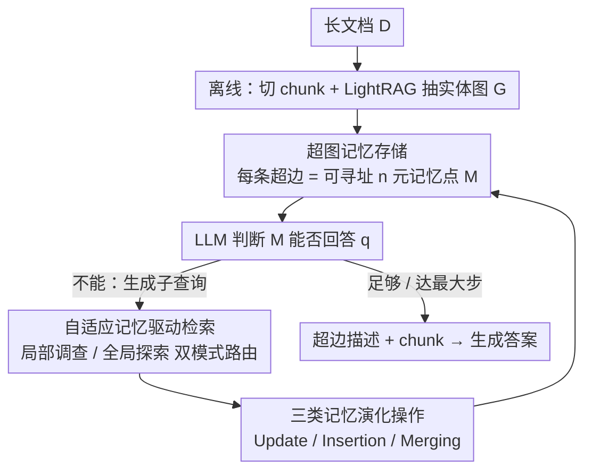

# HGMem: Hypergraph-based Working Memory to Improve Multi-step RAG for Long-Context Complex Relational Modeling

**会议**: ICML 2026  
**arXiv**: [2512.23959](https://arxiv.org/abs/2512.23959)  
**代码**: https://github.com/Encyclomen/HGMem (有)  
**领域**: 信息检索 / RAG / 工作记忆 / 长上下文推理  
**关键词**: 超图记忆, 多步RAG, 高阶关系建模, 全局意义构建, 长文档理解

## 一句话总结
本文把多步 RAG 中的 working memory 从"扁平的事实列表"重构成一张**超图**——每条超边就是一个可被 update / insert / merge 的记忆点，借助超边天然连接 $n\geq 2$ 个实体的能力，让记忆能在交互过程中持续合并低阶事实成高阶概念，从而显著提升需要"全局意义构建"的长上下文问答性能。

## 研究背景与动机

**领域现状**：处理 100k+ token 的长文档复杂问答时，单步 RAG 力有不逮，主流做法是多步 RAG（IRCOT、ReAct、DeepRAG、ComoRAG 等）：把检索-推理交替进行，并维护一个 working memory 来沉淀中间状态。memory 形态从最初的非结构化自然语言描述，演化到结构化的关系表、知识图谱、事件日志等。

**现有痛点**：现有 memory 几乎都被当作**静态的事实仓库**——只会不断追加 primitive facts。但人类工作记忆并非如此，它会主动把散落的事实**重组成更高阶的概念**（Baddeley 2000；Oberauer 2019）。这种"重组能力"在需要全局意义构建（global sense-making）的任务里尤其关键：跨段分散的事件之间隐藏着复杂的潜在联系，必须把它们聚合成统一视角才能回答。

**核心矛盾**：知识图谱、事件日志等结构化 memory 的"边"本质都是**二元关系**，无法直接表达"多个事实共同构成一个综合命题"这种 $n$ 元关系；而非结构化描述虽灵活，却失去了对原文的可追溯性和跨步操作的精确性。**表达力与可操作性、低阶事实与高阶概念之间存在系统性的 trade-off**。

**本文目标**：设计一种 working memory，要同时满足：(1) 能精确追溯到原文 chunk；(2) 能跨步精确操作（update / insert / merge）；(3) 能直接表达 $n$ 元高阶关系；(4) 能驱动检索策略在"局部深挖"与"全局拓展"之间自适应切换。

**切入角度**：超图天然把"边"推广为"超边"——一条超边可以连接任意数量的顶点，从而把"知识图谱里只能写多条二元边描述的复杂事件"折叠成单个 $n$ 元单位。如果把超边当作记忆点，超图的拓扑就自然承载了"事实如何被组织成概念"的语义。

**核心 idea**：用**超图（hypergraph）替代知识图谱**作为多步 RAG 的 working memory，让记忆点（hyperedge）通过 update / insertion / **merging** 三种操作动态演化，其中 merging 是显式构造高阶关系的关键步骤；同时在检索侧引入"局部调查 vs 全局探索"的自适应策略，让超图既存储信息又指导检索路径。

## 方法详解

### 整体框架

HGMem 要解决的是长文档复杂问答里 working memory 只会堆 primitive facts、表达不出多事实综合命题的问题，做法是把记忆从扁平事实列表换成一张可演化的超图。离线阶段把长文档 $\mathcal{D}$ 切成 200-token chunk（50-token overlap），用 GPT-4o + LightRAG 抽实体和二元关系构成实体图 $\mathcal{G}=(\mathcal{V}_{\mathcal{G}}, \mathcal{E}_{\mathcal{G}})$，实体/关系/chunk 全部用 bge-m3 编码进向量库。在线阶段则维护一张超图记忆 $\mathcal{M}=(\mathcal{V}_{\mathcal{M}}, \tilde{\mathcal{E}}_{\mathcal{M}})$，它与 $\mathcal{G}$ 共享顶点（$\mathcal{V}_{\mathcal{M}}\subseteq \mathcal{V}_{\mathcal{G}}$），但超边可任意连接 $\geq 2$ 个顶点，每条超边就是一个承载具体视角的"记忆点"。

整个在线过程是一个交互循环：从初始子查询 $\mathcal{Q}^{(0)}=\{\hat{q}\}$ 出发，每个交互步 $t$ 里 LLM 先判断当前 $\mathcal{M}^{(t)}$ 能否回答目标查询 $\hat{q}$，不能则生成新子查询集 $\mathcal{Q}^{(t)}$ 并把每个子查询归到"局部调查"或"全局探索"，在对应作用域检索出候选实体 $\mathcal{V}_{\mathcal{Q}^{(t)}}$、邻接关系 $\mathcal{E}(\mathcal{V}_{\mathcal{Q}^{(t)}})$ 与原文 chunk $\mathcal{D}(\mathcal{V}_{\mathcal{Q}^{(t)}})$，再据此把记忆演化为下一状态 $\mathcal{M}^{(t+1)}\leftarrow \mathrm{LLM}(\mathcal{M}^{(t)}, \mathcal{V}_{\mathcal{Q}^{(t)}}, \mathcal{E}(\mathcal{V}_{\mathcal{Q}^{(t)}}), \mathcal{D}(\mathcal{V}_{\mathcal{Q}^{(t)}}))$；直到记忆足够或到达最大步数，把所有超边描述加对应 chunk 喂给 LLM 生成最终回答。因此超图既是被检索改写的存储，又反过来指导每一步该往哪检索。

### 关键设计

**1. 超图记忆存储：让每条超边成为可寻址的 $n$ 元记忆点**

针对的痛点是知识图谱、事件日志这些 memory 的"边"本质都是二元关系，描述"多个事实共同构成一个综合命题"时只能拆成多条二元边、丢掉整体语义。HGMem 用超图把这个综合命题压成单个原子单位：顶点 $v_i=(\Omega^{ent}_{v_i}, \mathcal{D}_{v_i})$ 绑定实体描述与来源 chunk，超边 $\tilde{e}_j=(\Omega^{rel}_{\tilde{e}_j}, \mathcal{V}_{\tilde{e}_j})$ 绑定关系描述与它所连的顶点集。每条超边在向量库里有独立 embedding，能被子查询直接检索命中；又因为它的顶点强制存在于离线图 $\mathcal{G}$，任何超边都能追溯回原文 chunk。这样它同时拿到了非结构化描述的灵活表达力和结构化记忆的可追溯、可精确操作两个好处——一个"三个角色在某事件里各司其职"的复杂事件被存成一条超边后，后续可以作为整体被引用、修改、合并，而不会散成一堆零碎二元边。

**2. 自适应记忆驱动检索：局部调查与全局探索的双模式路由**

多步 RAG 常见的两个极端是死磕已有线索的 top-k 深挖、或漫无目的扩散到全库，HGMem 让 LLM 在生成每个子查询时同步标注它属于哪种模式来对齐认知阶段。若子查询 $q$ 想深挖某条已有超边 $\tilde{e}_j$（Local Investigation），就把这条超边所连顶点的邻域作为候选集 $\mathcal{N}(\mathcal{V}_{\tilde{e}_j})=\bigcup_{v\in\mathcal{V}_{\tilde{e}_j}}(\mathcal{N}_{\mathcal{M}^{(t)}}(v)\cup \mathcal{N}_{\mathcal{G}}(v))$，再在其上检索 $\mathcal{V}_q=\mathcal{R}_{\mathcal{N}(\mathcal{V}_{\tilde{e}_j})}(q)$；若想开辟新视角（Global Exploration），则把记忆之外的实体补集 $\mathcal{C}(\mathcal{M}^{(t)})=\mathcal{V}_{\mathcal{G}}-\mathcal{V}_{\mathcal{M}^{(t)}}$ 作为候选集做向量检索。这之所以有效，是因为超图本身就是一张 retrieval scaffold——LLM 看着当前超边集合就能判断哪些方面没碰过、哪些值得深挖，把检索成本与认知阶段绑定，比固定 top-k 更贴合多步推理；消融里去掉任一模式都明显掉点，说明两者互补。

**3. 三类记忆演化操作：Update / Insertion / Merging**

这是把 memory 从被动仓库变成主动认知结构的核心。每步检索回信息后 LLM 依次执行三类操作：Update 修订已有超边的描述（用新证据纠正之前的理解），Insertion 把新发现的事实加成新超边（吸收新信息的基础动作），Merging 则在前两步之后扫描现有超边、把语义或逻辑上本应是一个整体的若干超边合并——以目标查询 $\hat{q}$ 为锚生成新的关系描述 $\Omega^{rel}_{\tilde{e}_k}\leftarrow \mathrm{LLM}(\Omega^{rel}_{\tilde{e}_i}, \Omega^{rel}_{\tilde{e}_j}, \hat{q})$ 并取顶点并集 $\mathcal{V}_{\tilde{e}_k}=\mathcal{V}_{\tilde{e}_i}\cup \mathcal{V}_{\tilde{e}_j}$，用 $\hat{q}$ 锚定避免胡乱聚合。merging 是高阶概念能否涌现的关键：只有 insertion 时记忆永远停在 primitive facts，加上 merging 才能把散落的低阶事实重组成统一视角，消融里去掉 merging 跌约 7-9 个点、去掉 update 只跌约 2 个点，正说明这一点。

值得一提的是整个框架不含任何训练。上述所有判断——子查询走哪种模式、选 update/insertion/merging、合并哪些超边——都靠 LLM 在 prompt 引导下 zero-shot 完成，backbone 用 GPT-4o 或 Qwen2.5-32B-Instruct（temperature 0.8，max tokens 2048），超图由 hypergraph-db 管理，超边与 chunk 统一用 bge-m3 编码。

## 实验关键数据

### 主实验

在 4 个长上下文 sense-making 任务上对比：Longbench V2 子集（生成式 QA，用 GPT-4o 评 Comprehensiveness / Diversity 0-100 分）、NarrativeQA、NoCha、Prelude（均报 Accuracy %）。

| 数据集 | 指标 | 本文 HGMem (GPT-4o) | 之前最强 baseline | 提升 |
|--------|------|--------------------|--------------------|------|
| Longbench | Comprehensiveness | **65.73** | 63.62 (DeepRAG) | +2.11 |
| Longbench | Diversity | **69.74** | 65.98 (DeepRAG) | +3.76 |
| NarrativeQA | Acc (%) | **55.00** | 54.00 (ComoRAG) | +1.00 |
| NoCha | Acc (%) | **73.81** | 72.22 (HippoRAG v2) | +1.59 |
| Prelude | Acc (%) | **62.96** | 61.48 (LightRAG) | +1.48 |

在 Qwen2.5-32B-Instruct 上 HGMem 在 NarrativeQA 51.00 / NoCha 70.63 / Prelude 62.22，**用开源 32B 模型也能匹配甚至超过 GPT-4o 驱动的若干 baseline**（如在 NarrativeQA 上 51% > GraphRAG-GPT4o 的 53% 接近，在 Prelude 62.22 > GraphRAG-GPT4o 的 59.26）。

### 消融实验

Backbone 统一用 Qwen2.5-32B-Instruct。

| 配置 | NarrativeQA Acc | NoCha Acc | Prelude Acc | 说明 |
|------|-----------------|-----------|-------------|------|
| HGMem (full) | 51.00 | 70.63 | 62.22 | 完整模型 |
| w/. GE Only | 47.00 | 68.25 | 59.26 | 只用全局探索，掉 2-4 个点 |
| w/. LI Only | 43.00 | 63.49 | 60.00 | 只用局部调查，跌最多（NarrativeQA -8） |
| w/o. Update | 50.00 | 68.25 | 60.00 | 去掉 update，跌 1-2 个点 |
| **w/o. Merging** | **43.00** | **61.11** | **57.78** | **去掉 merging，跌 8-9 个点（最伤）** |

### 关键发现

- **Merging 是最核心的操作**：去掉它在 NoCha 上掉 9.52、NarrativeQA 上掉 8.00，证实"高阶关系的涌现"主要靠合并步骤，而非靠不断 insert 新事实。
- **Sense-making 查询上 merging 的收益是结构性的**：作者人工标注 120 条查询，分成"primitive"（直接事实）与"sense-making"（需要综合理解）两类。后者上 HGMem 的平均每超边连接实体数 Avg-$N_v$ 从 w/o. Merging 的 3.74-4.10 跃升到 5.25-7.97，accuracy 同步从 30-60 升到 40-70；而 primitive 查询上 Avg-$N_v$ 几乎不变（3.3-3.8 ↔ 3.3-3.9），accuracy 持平甚至略低（因为引入了冗余信息）。**这是高阶记忆"按需启用"的硬证据**。
- **3 步达到最优**：强制把 LLM 生成回答的步骤设为 0-6 步，HGMem 在 $t=3$ 达到峰值，再多步只增加成本不带来收益。
- **对离线图鲁棒**：随机砍掉 50% 实体/关系（Variant 1），或换用 LLM-free 的 Stanford OpenIE 抽图（Variant 2），HGMem 仍稳定领先其它方法相近幅度，说明性能增益主要来自框架本身而非依赖高质量图。

## 亮点与洞察

- **把"超图当 memory"而非"超图当索引"是个重要分野**：HypergraphRAG / Hyper-RAG / PropRAG 把超图作为离线静态知识索引，HGMem 把超图作为**在线动态工作记忆**，二者粒度和时间尺度完全不同。后者把超图的表达力放到了"reasoning 现场"，每步都能根据当前问题重塑结构。
- **Merging-as-cognition 的洞察可迁移**：任何需要"先观察再综合"的多步 agent（不止 RAG）都能借用——把中间状态存成可合并的离散单元，并显式地以目标问题为锚去合并，比让 LLM 在长 history 上 self-reflect 更可控。
- **"局部 vs 全局检索"的自适应路由也很巧妙**：很多多步 RAG 要么死磕 top-k 要么扩到全库，HGMem 用"已有超边的邻域"作为局部，"记忆补集"作为全局，自然地把检索成本与认知阶段对齐，去任一模式都明显掉点说明二者互补。
- **Avg-$N_v$ 作为"理解深度"的轻量度量值得借鉴**：把"平均每超边的实体数"作为隐式的认知复杂度指标，比单看 accuracy 更能解释"为什么模型答对了"，对类似 graph/memory 系统都有诊断价值。

## 局限与展望

- **完全依赖 prompt + 强 LLM**：所有判断（子查询模式、是否合并、合并哪些）都靠 LLM zero-shot，弱模型上可能崩溃；论文也没在 7B 级别开源模型上做完整验证。
- **没有给出明确的 cost / latency 数据**：3 步达到最优意味着至少 3 轮 LLM 调用 + 多次合并 prompt，相比 NaiveRAG 的开销膨胀几何级，但正文未给出对比数字（仅提"附录 E"含 cost analysis）。
- **Primitive 查询上会引入冗余**：表 3 显示 primitive 查询上 HGMem accuracy 反而略低于 w/o. Merging，因为模型仍倾向继续聚合，未来需要更精准的"是否需要合并"的判断器。
- **超图本身不学习**：merging 决策完全由 LLM 临时判断，没有跨任务的累积学习；可考虑结合 GNN/超图神经网络给 merging 候选打分，或让超图结构随用户长期交互固化。
- **离线图仍是瓶颈**：消融显示对离线图有"中等敏感性"，但所有方法都依赖一次性的离线构图，长文档新增内容时如何增量更新超图记忆未被讨论。

## 相关工作与启发

- **vs ComoRAG / DeepRAG**：同为带 working memory 的多步 RAG，但 ComoRAG 用动态 workspace 迭代整合证据、DeepRAG 用思考-检索链，二者 memory 本质仍是事实列表或推理 trace。HGMem 引入超图结构后，**记忆本身可以被结构化操作（merge / update）**，在 sense-making 任务上把 NoCha 73.81 vs ComoRAG 63.49 拉开了 ~10 个点。
- **vs ERA-CoT / KnowTrace**：同为带"图记忆"的多步 RAG，但前者用二元边图记录实体-关系，无法表达 $n$ 元高阶关系；HGMem 用超图原生支持 $n\geq 2$ 元，在需要综合多事实的查询上有结构性优势。
- **vs GraphRAG / LightRAG / HippoRAG v2**：这些是单步图增强 RAG，靠社区摘要、双层检索、个性化 PageRank 等离线索引提升全局推理；HGMem 把图记忆放到在线交互中，能在每个查询上动态长出"问题特定的"高阶概念。
- **vs Hyper-RAG / HypergraphRAG / PropRAG**：同样用超图但用作**离线静态知识索引**；HGMem 强调超图作为**在线动态工作记忆**，可在每步演化，二者解决问题层面不同。这给"超图 + RAG"流派指明了一条互补的研究方向：长期记忆（静态超图索引）+ 工作记忆（动态超图）的组合也许是下一个自然组合点。

## 评分

- 新颖性: ⭐⭐⭐⭐ 把超图从"知识索引"用到"工作记忆"是清晰且有理论基础（人类工作记忆类比）的拓展，merging 操作把"高阶关系涌现"显式化值得点赞，但单独的子技术（超图、自适应检索、memory 演化）都不算全新。
- 实验充分度: ⭐⭐⭐⭐ 4 个数据集 + 2 个 backbone + 5 类 baseline + 详尽消融 + primitive/sense-making 分层分析 + 离线图鲁棒性研究，覆盖很全；唯一遗憾是开源模型只测了 32B，没给 7B/14B 数据。
- 写作质量: ⭐⭐⭐⭐ 动机推导清晰（passive storage → high-order correlation），公式严谨且符号统一，图 1 + 图 2 把流程和演化讲得很直观，Avg-$N_v$ 表为"为什么涨点"提供了机制级解释。
- 价值: ⭐⭐⭐⭐ 对"长上下文 + 多步 RAG"方向给出了一个非常具体、可复现的结构化 memory 新范式；32B 匹敌 GPT-4o 的结果尤其有实际意义，未来 agent / memory / 多跳 QA 工作大概率会借鉴此设计。

<!-- RELATED:START -->

## 相关论文

- [\[ACL 2026\] HyperMem: Hypergraph Memory for Long-Term Conversations](../../ACL2026/information_retrieval/hypermem_hypergraph_memory_for_long-term_conversations.md)
- [\[ICLR 2026\] Q-RAG: Long Context Multi-Step Retrieval via Value-Based Embedder Training](../../ICLR2026/information_retrieval/q_rag_long_context_multi_step_retrieval.md)
- [\[ICLR 2026\] Q-RAG: Long Context Multi‑Step Retrieval via Value‑Based Embedder Training](../../ICLR2026/information_retrieval/q-rag_long_context_multistep_retrieval_via_valuebased_embedder_training.md)
- [\[ICML 2026\] ParisKV: Fast and Drift-Robust KV-Cache Retrieval for Long-Context LLMs](pariskv_fast_and_drift-robust_kv-cache_retrieval_for_long-context_llms.md)
- [\[ICML 2026\] Less Is More: Elevating RAG via Performance-Driven Context Compression](less_is_more_elevating_rag_via_performance-driven_context_compression.md)

<!-- RELATED:END -->
