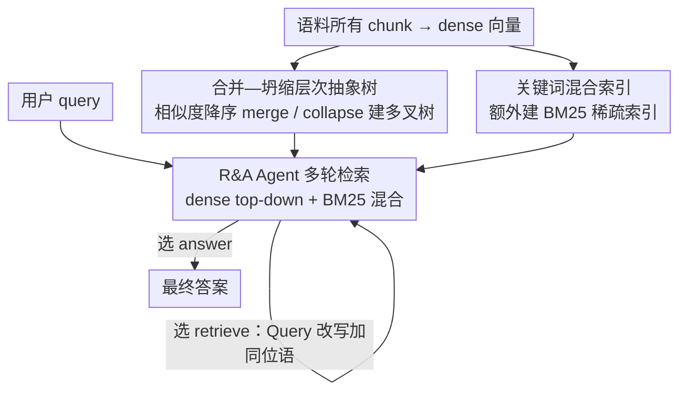

# Hierarchical Abstract Tree for Cross-Document Retrieval-Augmented Generation

**会议**: ICML 2026  
**arXiv**: [2605.00529](https://arxiv.org/abs/2605.00529)  
**代码**: https://github.com/Newiz430/Psi-RAG (有)  
**领域**: 信息检索 / 检索增强生成 / 多跳问答  
**关键词**: Tree-RAG, 跨文档多跳, 层次抽象, 智能体检索, 混合稀疏检索

## 一句话总结
Ψ-RAG 用"合并—坍缩"式的层次聚类替换 RAPTOR 的 k-means 来构建跨文档抽象树，并配上一个具备多轮重写能力的检索回答 Agent 与稀疏 BM25 混合索引，让 Tree-RAG 第一次能在语料级、跨文档多跳问答上追平甚至超越 Graph-RAG，平均 F1 比 RAPTOR 高 25.9%、比 HippoRAG 2 高 7.4%。

## 研究背景与动机

**领域现状**：当前 RAG 主要两条结构化路线，一条是 Graph-RAG（GraphRAG、HippoRAG 2），用知识图谱显式刻画文档间关系，多跳能力强但建索引时要做大量 OpenIE，开销极大；另一条是 Tree-RAG（RAPTOR 为代表），把文档自底向上 k-means 聚类成抽象树，可在 token / passage / document 三种粒度上检索，特别适合摘要型任务，但主要服务单文档场景。

**现有痛点**：把 Tree-RAG 直接放到"语料级、跨文档、多跳"场景，会同时暴露三个问题：(1) k-means 类聚类隐含球形分布假设，遇到偏态语料会产生"均匀效应"，把主要类簇的文档错配给少数簇，引入噪声；(2) 树结构的叶子之间缺显式连边，没法像 Graph-RAG 那样在文档间做因果跳跃；(3) 顶层抽象太粗，dense 向量很难把 query 中的具体实体对齐到上层的抽象概念。

**核心矛盾**：要"既保留树结构的多粒度优势，又获得 Graph-RAG 那种跨文档因果推理能力"，但传统聚类目标和静态 dense 匹配两个层面都不支持这个目标。

**本文目标**：分解为三个子问题——(a) 设计一种不依赖分布假设、能适配偏态语料的层次索引方法；(b) 在不修改树结构的前提下给检索器加入跨文档跳跃能力；(c) 给抽象节点的粗粒度匹配补上细粒度证据通道。

**切入角度**：作者从 agglomerative hierarchical clustering（AHC）出发，用 Dasgupta 代价证明这种贪心式合并天然偏好"偏态"而不是"均匀"分布；再借鉴 IRCoT 的迭代 agent，把"何时再检索一次"交给 LLM 自己判断；细粒度上则简单地加一个 BM25 关键词索引做混合。

**核心 idea**：用 "similarity ranking → 迭代 merging & collapse → abstraction" 取代 k-means 建树，再加上 R&A Agent + agentic 稀疏检索，把 Tree-RAG 一次性升级为可处理跨文档多跳的全能框架。

## 方法详解

### 整体框架
Ψ-RAG 要解决的是"把擅长摘要的 Tree-RAG 搬到语料级、跨文档多跳"这件事，办法是把建树、检索、细粒度补位三处分别替换掉。索引阶段不再做 k-means，而是把所有 chunk 编码成 dense 向量后按两两相似度从高到低逐对处理，迭代式地"合并 / 坍缩"出一棵多叉抽象树——叶子是原始 chunk，每个内部节点由 abstraction agent 写一段 summative 摘要（或一组 keyword 摘要）再重新编码。检索阶段把 query 交给一个 R&A Agent：它先做一次 dense top-down + BM25 的混合检索，把证据回填进上下文后自己判断该 `<answer>` 还是 `<retrieve>`，若选后者就改写出更具体的子 query 进入下一轮，直到回答或耗尽预算。

### 关键设计

**1. 基于"合并—坍缩"的层次抽象树：用贪心合并绕开 k-means 的分布假设**

RAPTOR 的 k-means/GMM 聚类隐含球形分布假设，遇到偏态语料会把多数类的 chunk 错配进少数簇，触发"均匀效应"噪声。Ψ-RAG 改用一套类似凝聚层次聚类的合并—坍缩流程：先算对称相似度矩阵 $S = e(D)e(D)^\top$，按相似度降序枚举 chunk 对 $(u,v)$，分三种情况处理——两者都没父节点时新建抽象节点 $a$ 令 $c(a)=\{u,v\}$（merging）；$u$ 已挂在某 $p(u)$ 下而 $v$ 独立时把 $v$ 也接到 $p(u)$（leaf node collapse）；两边各自已有根且根不同时按深度对齐，深度相同再造一个共同祖先、深度不同就把浅树嫁接到深树的对应层（abstract node collapse）。整个过程恰好 $n-1$ 步就能把 $n$ 个 chunk 连成一棵树，最后再把过宽的节点均匀劈成两半，防止抽象 agent 上下文超长。它之所以有效，是因为作者用 Dasgupta 代价做了一阶分析：在完美均匀的树上做一次"移动叶子"会降低代价，说明算法天然不偏好均匀；而在偏态树上把多数类节点搬向少数类反而抬高代价，说明它会自动保持偏态——于是不必再训练一个新目标，单凭几何—代价的性质就规避了 k-means 的均匀效应。

**2. R&A Agent 驱动的多轮检索：让 LLM 临时补出树里缺失的跨文档连边**

抽象树的叶子之间没有显式连边，像"影响 Beyoncé 的那位歌手的纪录片的制片人的妻子是谁"这种多跳 query，初次 dense 匹配很容易被"Beyoncé""纪录片"主导，真正的中介实体（David Gest）被漏掉。Ψ-RAG 让检索器具备"看证据够不够、不够就改写 query 再查"的能力：Agent 每步输出三元组 $a=(R,\langle\text{action}\rangle,\cdot)$，action 在 `<answer>` / `<retrieve>` 二选一，选 retrieve 时产出新 query $q'_i$，第 $i$ 步检索结果 $D^*_i = r(q'_i,\mathcal{T})$ 连同历史 $\{(I(D^*_j)\cup a_j)\}$ 一起回灌，直到给答案或达上限 $i_{\max}$。底层每次检索仍走 RAPTOR 的 top-down beam——从根出发逐层按 $s(q,u)$ 取 top-$k$、再把孩子放进下层候选递推到叶子。这一步的本质是用语言模型在检索时动态把树缺失的"跨文档连边"补回来：拿到第一轮证据后再决定下一跳查什么，相当于把 Graph-RAG 的显式多跳推理换成 Agent 的串行重检索。

**3. 关键词混合索引 + Query 改写：给粗抽象补上细粒度词面通道**

顶层抽象节点概括得太粗，dense 向量很难把 query 里的具体实体对到上层摘要。为此索引阶段额外建一份 BM25 稀疏索引，检索阶段 Agent 用两种方式融合 dense+sparse 的 top-$k$：参数化的 reranker 重新打分，或非参数化的 RRF（reciprocal rank fusion，按各路排名倒数加权）。更巧的是 Agent 在 `<retrieve>` 时不只改 query，还会"加描述性同位语"（如把"David Gest 的妻子"补成"美国电影制片人 David Gest 的妻子"），让 BM25 多抓几个主题关键词的同时，也给 dense 检索提供高层语境去定位上层抽象节点。两条通路因此同时受益：BM25 在词面匹配上补位抽象树的粗粒度短板，query 改写把"短问句"变成"带定语的长问句"，让稀疏与稠密检索都更容易命中正确节点。

全流程 training-free：编码器、reranker、Agent 用的 LLM（Llama-3.3-70B、Qwen3-Embedding-8B）都直接复用开源权重，索引靠相似度排序 + LLM 写摘要，检索靠 prompt 控制的 Agent，唯一要调的只有 top-$k$、$i_{\max}$、混合融合方式三个超参。

## 实验关键数据

### 主实验

| 任务 (多跳 F1) | RAPTOR | HippoRAG 2 | Ψ-RAG (Ours) | 相对 RAPTOR ↑ |
|---|---|---|---|---|
| HotpotQA / 2Wiki / MuSiQue / MultiHop-RAG 平均 | 基线 | 强基线 | +25.9% F1 vs RAPTOR；+7.4% vs HippoRAG 2 | 显著 |
| 语料级索引时间 vs Graph-RAG | — | 慢 | ≈10× 更快 | — |
| Token-level QA (NQ / PopQA) retrieval | 基线 | — | +23.7% retrieval | 显著 |

| 能力维度 | Traditional RAG | Graph-RAG | Tree-RAG (RAPTOR) | Ψ-RAG |
|---|---|---|---|---|
| 单文档 | ✓ | ✓ | ✓ | ✓ |
| 跨文档 | 部分 | ✓ | 部分 | ✓ |
| Token 级 QA | ✓ | ✓ | 弱 | ✓ |
| Passage 级 | 部分 | ✓ | ✓ | ✓ |
| Document 级摘要 | 弱 | 部分 | ✓ | ✓ |

### 消融实验

| 配置 | 关键发现 |
|---|---|
| 完整 Ψ-RAG | 在所有四类任务（单跳 / 多跳 / narrative / summarization）都拿到最佳或近最佳 |
| w/o R&A Agent | 多跳 F1 大幅退化，因为不再做跨文档跳跃 |
| w/o BM25 混合 | token-level 事实题受损最重，证明粗抽象需要细粒度补位 |
| w/o "合并—坍缩"（换 k-means） | 在偏态语料上抽象节点开始混入主类，触发 "uniform effect" 噪声 |

### 关键发现
- 在 "Sports[:50] + Business[:5]" 这类人造偏态语料上，RAPTOR 的顶层抽象节点会把多数类（Sports）的 chunk 当成少数类，引入"被混淆抽象"的噪声；Ψ-RAG 的环形树可视化里这类混淆几乎消失，与 Dasgupta 代价分析的预测完全一致。
- Ψ-RAG 的核心提升来自"层次抽象 + Agent 多轮"两者协同：单独换 indexing 只改善摘要类任务；单独加 Agent 在 token-level 提升有限；两者合用才能在多跳 QA 上压过 Graph-RAG。
- 索引速度比 GraphRAG / HippoRAG 2 快约一个量级，因为不用做 OpenIE 抽实体；这一点对真正落地很关键。

## 亮点与洞察
- 用 Dasgupta 代价从理论上把"AHC 天生抗均匀效应、天生适配偏态分布"讲清楚，这把"启发式聚类"和"任务效果"之间的鸿沟用一个干净的几何论证连了起来，比单纯堆经验对比要扎实得多。
- 把"补丁式增强"放在两个正确的位置：indexing 端补几何结构，retrieval 端补语义跳跃，最后再用 BM25 修补"抽象太粗"，三个 patch 各打一种病而不互相覆盖，是工程上很值得借鉴的"分而治之"。
- Agent 改写 query 的小 trick（加同位语描述）几乎零成本，却同时帮到 dense + sparse 两条通路，这种"轻巧补丁打到瓶颈处"很有迁移价值——可以套到其他多跳搜索、Code RAG、长文档问答里。

## 局限与展望
- 整个系统的延迟瓶颈完全在 LLM Agent 的多轮调用上；当 $i_{\max}$ 调大时 latency 线性上涨，作者没给出"何时该停"的自适应策略。
- 抽象树的质量依赖底层 LLM 写摘要的能力；如果用更小的本地模型，抽象节点可能损失关键实体，导致 dense 匹配整体崩塌；论文里没有给低成本 LLM 的退化曲线。
- "merging & collapse" 是流式贪心算法，对相似度极相近的多个 chunk 顺序敏感；实践中可能需要多次 shuffle 再聚合，论文未深入讨论稳定性。
- 与 Graph-RAG 的对比里，HippoRAG 2 的 PPR 推理被"换皮"成 Agent 多轮检索；但当跳数 $\geq 4$ 时显式图的并行扩散可能仍优于 Agent 串行调用，作者未在超多跳设置下做敏感性分析。

## 相关工作与启发
- **vs RAPTOR**：同样是 Tree-RAG 路线，但 RAPTOR 用 k-means GMM 自底向上聚簇，会在偏态语料上触发"均匀效应"；Ψ-RAG 用 AHC 风格的合并—坍缩 + 多叉重平衡，避免分布假设，且原生支持语料级索引。
- **vs HippoRAG 2 / GraphRAG**：Graph-RAG 用 OpenIE 抽实体建图、用 PPR 做多跳推理，离线索引非常贵；Ψ-RAG 把"跨文档关系"延迟到检索时由 Agent 动态发现，索引快约 10×，多跳精度反超。
- **vs IRCoT**：IRCoT 把"多步推理 + 多步检索"耦合在一条 chain 上，但底层检索器是单层 dense；Ψ-RAG 把同样的多轮思想放到抽象树 + 稀疏混合检索之上，因此在多粒度任务里更通用。
- 启发：当一个静态索引结构（树 / 图 / 倒排）单独搞不定多跳时，比起去改索引结构，"在检索时让 LLM 当临时图"是一种成本更低的捷径——这思路可以迁移到 Code RAG（按调用关系跳）、长论文 QA（按引用跳）。

## 评分
- 新颖性: ⭐⭐⭐⭐ "合并—坍缩 + Dasgupta 代价理论 + Agent 混合检索"三者组合在 Tree-RAG 里属于首创，但每个组件都有先例。
- 实验充分度: ⭐⭐⭐⭐ 在四类任务、6 个数据集、多种 baseline 上对比，并配可视化与理论；缺超多跳与小模型退化曲线。
- 写作质量: ⭐⭐⭐⭐⭐ 框架图、合并步骤示意、Dasgupta 证明、可视化对比都到位，可读性极佳。
- 价值: ⭐⭐⭐⭐ 把 Tree-RAG 一举推到与 Graph-RAG 同档的多跳能力，且 training-free + 索引快 10×，对实际部署友好。

<!-- RELATED:START -->

## 相关论文

- [\[ACL 2025\] Hierarchical Document Refinement for Long-context Retrieval-augmented Generation](../../ACL2025/information_retrieval/hierarchical_document_refinement_for_long-context_retrieval-augmented_generation.md)
- [\[ICLR 2026\] CFT-RAG: An Entity Tree Based Retrieval Augmented Generation Algorithm With Cuckoo Filter](../../ICLR2026/information_retrieval/cft-rag_an_entity_tree_based_retrieval_augmented_generation_algorithm_with_cucko.md)
- [\[ACL 2025\] Cross-Lingual Relevance Transfer for Document Retrieval](../../ACL2025/information_retrieval/cross-lingual_relevance_transfer_for_document_retrieval.md)
- [\[ICML 2026\] LazyAttention: Efficient Retrieval-Augmented Generation with Deferred Positional Encoding](lazyattention_efficient_retrieval-augmented_generation_with_deferred_positional_.md)
- [\[ICML 2026\] Predictive Prefetching for Retrieval-Augmented Generation](predictive_prefetching_for_retrieval-augmented_generation.md)

<!-- RELATED:END -->
